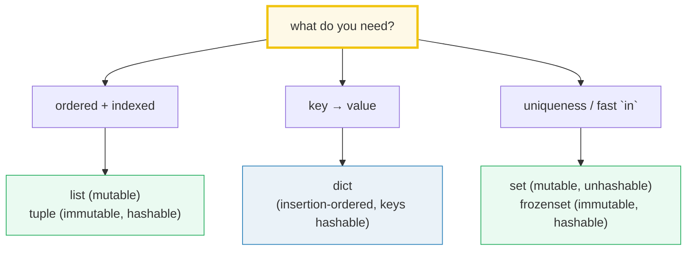
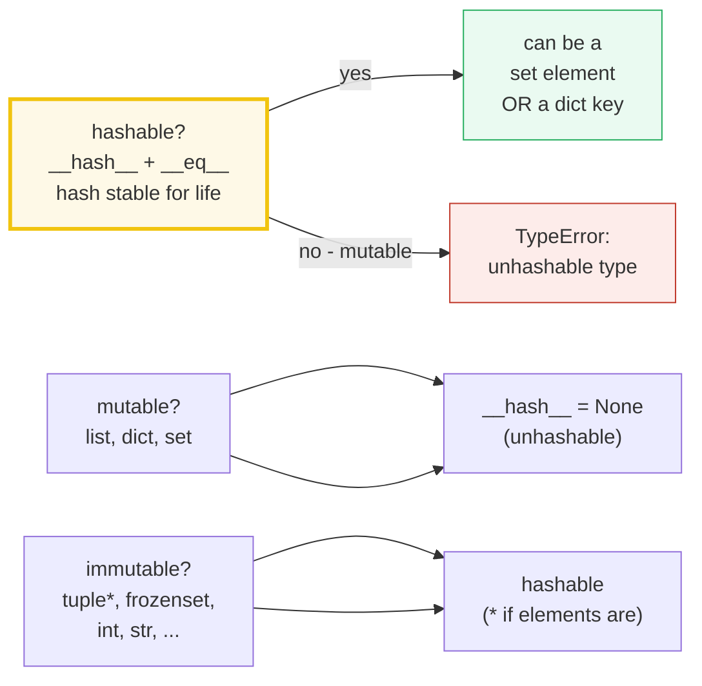
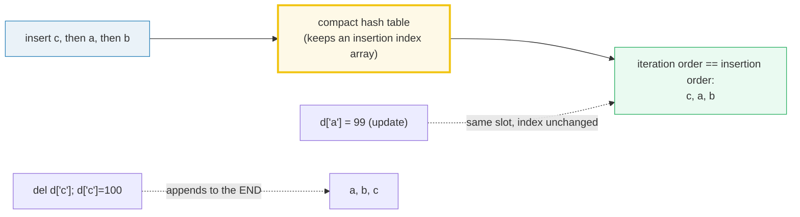

# Collections Basics — `list`, `tuple`, `dict`, `set`, `frozenset` & the Hash Contract

> **The one rule:** Python ships five everyday containers, and the difference
> between them is **not** taste — it is a small grid of traits (ordered,
> mutable, unique, hashable) that follows directly from one mechanism:
> **hashing**. The `hash`/`__eq__` contract decides what can be a `set` element
> or a `dict` key; mutability decides what can change in place; insertion order
> (since 3.7) decides how a `dict` iterates. Get this grid straight and you stop
> reaching for a `list` when you meant a `set`.

**Companion code:** [`collections_basics.py`](./collections_basics.py).
**Every number and table below is printed by `uv run python
collections_basics.py`** — change the code, re-run, re-paste. Nothing here is
hand-computed. Captured stdout lives in
[`collections_basics_output.txt`](./collections_basics_output.txt).

**Goal of this bundle (lineage, old → new):**

> from *"I use lists and dicts"*
> → *"I know exactly when to reach for `list` vs `tuple` vs `dict` vs `set` vs
> `frozenset`, why hashing governs set/dict membership, and the performance
> tradeoffs."*

🔗 This is bundle **#3 of Phase 1**. It builds directly on
[`TYPES_AND_TRUTHINESS`](./TYPES_AND_TRUTHINESS.md) (bundle #1): `==` vs `is`,
the numeric tower, and the fact that `1 == 1.0 == True`. Here we ask *why*
`{1, 1.0}` collapses to one element — the answer is the **hash/eq contract**.
The full `__hash__`/`__eq__` dunder protocol (how to make *your own* class
hashable, and what `__hash__ = None` means) is the subject of
[`DUNDER_METHODS`](./DUNDER_METHODS.md) (Phase 2); the `PyObject*` view of why
mutable objects can't be hashed belongs to
[`MEMORY_MODEL`](./MEMORY_MODEL.md) (Phase 3). See [`TODO.md`](./TODO.md) for
the full plan.

---

## 0. The five containers on one page



The hash contract is what makes the bottom half work:



| Container | ordered | mutable | unique | hashable | typical use |
|---|---|---|---|---|---|
| `list` | yes | **yes** | no | no | ordered, indexable, grows |
| `tuple` | yes | no | no | **yes**\* | fixed record, hashable key |
| `dict` | yes (insertion) | **yes** | keys | no | key → value lookup |
| `set` | no | **yes** | yes | no | membership, dedup, algebra |
| `frozenset` | no | no | yes | **yes** | hashable set; set-of-sets |

> *\* `tuple` is hashable **only when all its elements are hashable** — see §2.*

---

## 1. The five containers — ordered, mutable, unique, hashable

Python ships five everyday containers. Their traits are not independent design
choices; they follow from the data model: a type that can change in place
(`list`, `dict`, `set`) cannot have a stable hash, so it is **unhashable**; a
type that is immutable (`tuple`\*, `frozenset`) gets a hash for free and can
serve as a `set` element or `dict` key. `dict` is the hybrid: mutable as a
container, but its **keys** must each be hashable.

> From `collections_basics.py` Section A:
> ```
> ======================================================================
> SECTION A — The five core containers: list, tuple, dict, set, frozenset
> ======================================================================
> Python ships five everyday containers. Their traits — ordered,
> mutable, unique, hashable — decide what each is good at. The table
> below is the reference card; the checks beneath it PROVE each trait
> by actually constructing and probing the type.
> 
> type        ordered   mutable   unique    hashable
> --------------------------------------------------
> list        yes       yes       no        no
> tuple       yes       no        no        yes*
> dict        yes       yes       keys      no
> set         no        yes       yes       no
> frozenset   no        no        yes       yes
> (* tuple is hashable only when ALL its elements are hashable.)
> 
> [check] list preserves order: [3,1,2][0] == 3: OK
> [check] tuple preserves order: (3,1,2)[0] == 3: OK
> [check] list is mutable (append works): OK
> [check] dict is mutable (assign works): OK
> [check] set is mutable (add works): OK
> [check] tuple length is fixed at construction: OK
> [check] frozenset length is fixed at construction: OK
> [check] set dedups: {1,1,2} == {1,2}: OK
> [check] frozenset dedups: frozenset([1,1,2]) == frozenset({1,2}): OK
> [check] dict keys dedup: {1:'a', 1:'b'} == {1:'b'}: OK
> [check] list keeps dups: [1,1,2] has length 3: OK
> ```

### Why mutable ⇒ unhashable (internals)

A `dict`/`set` is a **hash table**: each key/element lives in a bucket chosen
by `hash(key) % table_size`. If the key's value could change *after* it was
filed in its bucket, its hash would change, and the table could never find it
again (it would look in the *new* bucket, but the object is still in the *old*
one). To make this corruption impossible, CPython sets `__hash__ = None` on
every type that is mutable-by-value (`list`, `dict`, `set`, `bytearray`), so
`hash(obj)` raises `TypeError` immediately — before any corruption can happen.
Immutable containers (`tuple`, `frozenset`, `str`, `bytes`) compute their hash
from their contents *once* and cache it, so the hash can never drift.

> **Subtlety:** `tuple` is immutable as a *container* (you can't add/remove
> slots), but if one of its *elements* is mutable, the tuple's *value* can
> still change — so a tuple of a list, `(1, [2])`, is itself **unhashable**
> (see §2). Immutability of the container is necessary but not sufficient; what
> matters is that the hash-relevant state can never change.

🔗 The full `__hash__`/`__eq__` dunder story — including how to make a custom
class hashable and the `__hash__ = None` trap when you override `__eq__` — is
in [`DUNDER_METHODS`](./DUNDER_METHODS.md) (Phase 2).

---

## 2. The hashability contract — what hashes, what doesn't

The [data model](https://docs.python.org/3/reference/datamodel.html#object.__hash__)
states the contract in one line: *"objects which compare equal have the same
hash value."* The reverse is **not** required — two unequal objects may share
a hash (a *hash collision*; the table falls back to `__eq__`). The practical
consequences:

- `hash(1) == hash(1.0)` — because `1 == 1.0` (the numeric tower from bundle
  #1). So `{1, 1.0}` has **one** element, and `{1: 'a'}[1.0]` works.
- `hash([1,2])` **raises** `TypeError: unhashable type: 'list'` — mutable.
- `hash((1, [2]))` **raises** too — a tuple is only as hashable as its
  weakest element.
- `hash(frozenset({1,2}))` **works** — frozenset is immutable, so it is
  hashable and can be a `set` element or `dict` key; `set` cannot.

> From `collections_basics.py` Section B:
> ```
> ======================================================================
> SECTION B — The hashability contract: what hashes, what doesn't
> ======================================================================
> An object is HASHABLE if it has a __hash__ whose value never changes
> during its lifetime AND it can be compared with __eq__. The contract
> (docs.python.org datamodel.html#object.__hash__): 'objects which
> compare equal have the same hash value.' Mutable containers are
> unhashable because their value — and thus their hash — could change
> after insertion, corrupting the hash table. (str/bytes hashes are
> randomized per process via PYTHONHASHSEED; int/tuple/frozenset hashes
> of ints are stable across runs.)
> 
> expression                    result
> ----------------------------------------------------------------
> hash(1)                       1
> hash(1.0)                     1
> hash(True)                    1
> hash(1) == hash(1.0)          True
> hash(True) == hash(1)         True
> type(hash('hello'))           <class 'int'>
> type(hash((1, 2)))            <class 'int'>
> hash((1, 2))                  -3550055125485641917
> hash(frozenset({1, 2}))       -1826646154956904602
> hash([1, 2])                  "TypeError: unhashable type: 'list'"
> hash({1: 2})                  "TypeError: unhashable type: 'dict'"
> hash({1, 2})                  "TypeError: unhashable type: 'set'"
> hash((1, [2]))                "TypeError: unhashable type: 'list'"
> 
> [check] hash(1) == hash(1.0) (equal values -> equal hashes): OK
> [check] hash(True) == hash(1) (bool == int -> equal hashes): OK
> [check] hash((1,2)) is an int (tuples of hashables hash): OK
> [check] hash(frozenset({1,2})) is an int (frozenset hashes): OK
> [check] list is unhashable (mutable): OK
> [check] dict is unhashable (mutable): OK
> [check] set is unhashable (mutable): OK
> [check] tuple of unhashable is unhashable: (1,[2]): OK
> [check] tuple of hashables is hashable: (1,2): OK
> Consequence: hashability gates set-membership & dict-key use.
> 
> frozenset({1,2}) as a set element: {fs} -> {frozenset({1, 2})}
> frozenset({1,2}) as a dict key: {fs:'v'} -> {frozenset({1, 2}): 'v'}
> [check] frozenset can be a set element (it is hashable): OK
> [check] frozenset can be a dict key (it is hashable): OK
> set {1,2} as a set element: { {1, 2} } -> TypeError: unhashable type: 'set'
> [check] set cannot be a set element (it is unhashable): OK
> ```

### Why `1`, `1.0`, and `True` share a hash (internals)

From bundle #1, `bool ⊂ int` and numeric `==` coerces across the tower, so
`1 == 1.0 == True`. The hash contract then **forces** their hashes to be equal
— otherwise a `set` could hold both `1` and `1.0` in different buckets and
"uniqueness" would silently break. CPython honors this by defining
`hash(int n) == n` for small ints (and `hash(float)` to agree with `hash(int)`
on whole numbers), and `hash(True) == hash(1)` because `bool` delegates to
`int.__hash__`. That is why `{1, 1.0, 2}` has length **2**, and why `1.0 in
{1, 2, 3}` is `True`: membership is `hash match` **then** `__eq__`, and both
succeed.

### Why `str`/`bytes` hashes are randomized (internals)

The concrete integers for `hash((1, 2))` and `hash(frozenset({1, 2}))` printed
above are **stable across runs** on this machine — int hashes are deterministic
(`hash(n) == n`), and tuple/frozenset mixing does not use the string
randomization seed. `hash('hello')`, by contrast, is **different every
process**: since Python 3.3, `str` and `bytes` hashing is salted by a
per-process random secret ([`PYTHONHASHSEED`](https://docs.python.org/3/using/cmdline.html#envvar-PYTHONHASHSEED))
to defeat algorithmic-complexity DoS attacks on dict/set lookups (an attacker
who could predict hashes could craft many colliding keys to degrade a hash
table to O(n²)). We therefore print only `type(hash('hello'))` — always
`<class 'int'>` — never the raw value, which would not be byte-reproducible.

---

## 3. Dict ordering & equality — insertion order since 3.7



Since [Python 3.7](https://docs.python.org/3/library/stdtypes.html#mapping-types-dict)
(CPython 3.6 as an *implementation detail*), `dict` preserves **insertion
order**: keys are yielded in the order they were first added. Updating a value
leaves the key in place; deleting a key and re-inserting it **appends** it to
the end. This is a language guarantee, not a CPython quirk — but note that
`==` on two dicts is **order-insensitive** (only keys+values are compared), so
you must never *test* dicts with `list(d1.keys()) == list(d2.keys())` when you
mean `d1 == d2`.

> From `collections_basics.py` Section C:
> ```
> ======================================================================
> SECTION C — Dict ordering & equality: insertion order since 3.7
> ======================================================================
> Since Python 3.7 (CPython 3.6 as an implementation detail), dict
> preserves INSERTION order: list(d.keys()) yields keys in the order
> they were first added. Updating a value does NOT move the key;
> deleting then re-inserting a key appends it to the END.
> 
> d = {'c': 1, 'a': 2, 'b': 3}
> list(d.keys())            = ['c', 'a', 'b']
> list(d.values())          = [1, 2, 3]
> list(d.items())           = [('c', 1), ('a', 2), ('b', 3)]
> d['a'] = 99  (update existing key)
> list(d.keys())            = ['c', 'a', 'b']  (order unchanged)
> del d['c']; d['c'] = 100  (delete + re-insert at end)
> list(d.keys())            = ['a', 'b', 'c']  ('c' moved to end)
> 
> [check] dict preserves insertion order: keys == [c,a,b]: OK
> [check] updating a value does not reorder keys: OK
> [check] dict == is order-insensitive: {a:1,b:2} == {b:2,a:1}: OK
> [check] 1 and 1.0 are the same dict key (equal hash + eq): OK
> ```

### Why dicts are ordered now (internals)

Before 3.6, a `dict` was a classic sparse hash table: keys landed in
`hash(key) % size` slots, and iteration visited slots in memory order — which
bore no relation to insertion order and wasted memory on empty slots. In
CPython 3.6 the implementation switched to a **compact dict**: one dense array
holds the entries in insertion order, and a separate sparse index array maps
`hash → position`. Iteration just walks the dense array, so it is automatically
in insertion order, *and* the dict uses ~20–25% less memory. The behavior was
so popular it was promoted from "CPython detail" to a **language guarantee** in
3.7 ([What's New in 3.7](https://docs.python.org/3/whatsnew/3.7.html)).
`collections.OrderedDict` is now only needed for the extra methods
(`move_to_end`, equality that *is* order-sensitive).

---

## 4. Set algebra — `| & - ^` and frozenset-as-element

`set` (and its immutable twin `frozenset`) implement the four classic set
operations as operators, each returning a **new** set without mutating the
operands:

| operator | method | result of `a ⊙ b` |
|---|---|---|
| `a \| b` | `union` | elements in **either** |
| `a & b` | `intersection` | elements in **both** |
| `a - b` | `difference` | in `a` but **not** `b` |
| `a ^ b` | `symmetric_difference` | in exactly **one** |

Membership `x in s` is **O(1) average** (hash → bucket → `__eq__`), versus
**O(n)** for `x in list` (linear scan). That single fact — plus auto-dedup —
is the entire reason `set` exists. Because `set` is **mutable** it is
unhashable; `frozenset` is the **immutable, hashable** version, so it is the
only one that can be an *element* of another set or a `dict` key.

> From `collections_basics.py` Section D:
> ```
> ======================================================================
> SECTION D — Set algebra: | & - ^ and frozenset-as-element
> ======================================================================
> Sets implement mathematical set algebra: union |, intersection &,
> difference -, symmetric_difference ^. Each returns a NEW set; the
> operands are unchanged. `in` membership is O(1) average (hash-table
> lookup) vs O(n) for a list (linear scan). frozenset, being immutable
> & hashable, can be a set ELEMENT or dict KEY; set cannot.
> 
> a = {1, 2, 3, 4}
> b = {3, 4, 5, 6}
> a | b  (union)             = {1, 2, 3, 4, 5, 6}
> a & b  (intersection)      = {3, 4}
> a - b  (difference)        = {1, 2}
> a ^ b  (symmetric diff)    = {1, 2, 5, 6}
> a after operations         = {1, 2, 3, 4}  (unchanged)
> 
> [check] union |: OK
> [check] intersection &: OK
> [check] difference -: OK
> [check] symmetric_difference ^: OK
> [check] set ops do not mutate operands: OK
> s = {1, 2, 3}
> 1 in s      = True
> 1.0 in s    = True  (1 == 1.0 -> same element)
> len({1, 1.0, 2}) = 2  (1 and 1.0 collapse)
> 
> [check] 1 in {1,2,3} is True (O(1) avg hash lookup): OK
> [check] 1.0 in {1,2,3} is True (1 == 1.0, equal hashes): OK
> [check] {1, 1.0, 2} has length 2 (1 and 1.0 collapse): OK
> frozenset is hashable, so it can be a set element / dict key:
> {fs1, fs2}              = {frozenset({3, 4}), frozenset({1, 2})}
> {fs1:'pair', fs2:'pair'} = {frozenset({1, 2}): 'pair', frozenset({3, 4}): 'pair'}
> 
> [check] frozenset can be a set element: OK
> [check] frozenset can be a dict key: OK
> ```

### Why set **iteration order is not insertion order** (internals)

Look at the line `{fs1, fs2} = {frozenset({3, 4}), frozenset({1, 2})}`: we
inserted `fs1` (`frozenset({1,2})`) **first**, yet the repr lists
`frozenset({3,4})` first. A `set` iterates its hash table in **bucket order**
(slot index), and a frozenset's bucket is `hash(frozenset) % table_size` —
which has nothing to do with insertion order. (For small **int** sets the
bucket order happens to coincide with numeric order because `hash(n) == n`,
which is why `{1,2,3,4}` prints sorted-looking — but that is a coincidence of
small ints, **not** a guarantee.) The lesson: never depend on set iteration
order; if you need order, use a `dict` (or `list`).

> **O(1) is *average*, not worst-case.** Hash collisions and table resizes make
> a single `in` lookup occasionally O(n). The *amortized* cost over many lookups
> is O(1), which is what matters — but a pathologically bad hash (or an
> attacker crafting colliding keys) degrades it. This is *exactly* why `str`
> hashing is randomized (§2): it makes crafting collisions hard.

---

## 5. Which container wins when?

Pick the container from the **need**, not from habit. The decision table below
is the expert payoff: each row is a common requirement mapped to the right
type and the reason one type dominates the others.

> From `collections_basics.py` Section E:
> ```
> ======================================================================
> SECTION E — Which container wins when? (decision table)
> ======================================================================
> Pick the container from the NEED, not from habit.
> 
> if you need...                      reach for             why
> ----------------------------------------------------------------------------------
> ordered + index access              list / tuple          O(1) by position
> immutable ordered sequence          tuple                 hashable; fixed; safe default
> key -> value mapping                dict                  O(1) lookup by key
> uniqueness + fast membership        set                   O(1) avg `in`; auto-dedup
> a set of sets / hashable set        frozenset             immutable -> hashable
> 
> raw     = [3, 1, 4, 1, 5, 9, 2, 6, 5, 3, 5]
> deduped = [3, 1, 4, 5, 9, 2, 6]  (dict.fromkeys: order + uniqueness)
> 
> [check] dict.fromkeys dedups AND preserves first-seen order: OK
> [check] 'in set'  returns True for a present value: OK
> [check] 'in list' returns True for a present value: OK
> [check] set and list agree on membership (same answer): OK
> ```

The `dict.fromkeys` trick is the bridge between two needs at once: you want
**uniqueness** *and* **first-seen order**. Pre-3.7 you needed an
`OrderedDict`; today a plain `dict` does both — `dict.fromkeys(seq)` dedups
keys while recording insertion order, so `list(...)` gives you the deduped
sequence in original order. (For membership *speed* you'd still want a `set` —
`dict.fromkeys` gives order+uniqueness but `in` on its *keys* is what's O(1).)

---

## Pitfalls

| Trap | Example | The fix |
|---|---|---|
| Using a `list` as a `dict` key / `set` element | `d = {[1,2]: 'v'}` → `TypeError: unhashable type: 'list'` | convert to `tuple` (or `frozenset`) first; only hashables can key |
| Assuming a `tuple` is always hashable | `hash((1, [2]))` → `TypeError` | a tuple is hashable **only if all its elements are**; freeze inner mutables |
| Treating a `set`'s iteration order as meaningful | `for x in {3,1,2}: ...` order not guaranteed | if order matters, use `dict`/`list`; sort for stable display |
| Assuming `len({1, 1.0}) == 2` | actually `1` — `1 == 1.0` so they collapse | remember numeric equality collapses keys/elements; use distinct types or tuples |
| Mutating a `list` you're iterating | `for x in lst: lst.append(...)` → skipped/double items | iterate over a copy (`for x in lst[:]:`) or collect then mutate |
| Expecting `dict ==` to be order-sensitive | `{1:1,2:2} == {2:2,1:1}` → `True` | use `OrderedDict` (or compare `list(d.items())`) if order matters |
| Relying on insertion order before 3.7 | legacy code on old Pythons silently unordered | it's a 3.7 language guarantee now; but `OrderedDict` if you support <3.7 |
| `set` `in` is O(1) *average* only | hash collisions / attacker-crafted keys → O(n) DoS | for untrusted keys, rely on `str` hash randomization (on by default) |
| Copying a nested structure with `list()`/`dict()` | outer copy, inner objects still **shared** (shallow) | use `copy.deepcopy` for a fully independent nested copy |
| `{1: 'a'} == {1.0: 'a'}` is `True` | numeric keys collapse across the tower | wrap keys in a distinguishing type if `1` and `1.0` must differ |

---

## Cheat sheet

- **Five containers:** `list` (ordered, mutable, unhashable), `tuple` (ordered,
  immutable, hashable *if elements are*), `dict` (insertion-ordered, mutable,
  keys hashable), `set` (unordered, mutable, unique, unhashable), `frozenset`
  (unordered, immutable, unique, **hashable**).
- **Hash contract:** "objects which compare equal have the same hash value."
  `hash(1) == hash(1.0) == hash(True) == 1`. The reverse is **not** required
  (collisions exist; `__eq__` breaks ties).
- **Mutable ⇒ unhashable:** `list`/`dict`/`set`/`bytearray` have
  `__hash__ = None`; `hash()` raises `TypeError`. Immutable containers
  (`tuple`\*, `frozenset`, `str`, `bytes`, numbers) are hashable.
- **`tuple` is only as hashable as its elements:** `hash((1,2))` works;
  `hash((1,[2]))` raises. A tuple of a list is unhashable.
- **`frozenset` vs `set`:** frozenset is hashable → can be a set element / dict
  key; set is mutable → unhashable, `{ {1,2} }` raises `TypeError`.
- **Dict order:** insertion order guaranteed since 3.7 (CPython 3.6 detail).
  Update = key stays; delete+reinsert = appends to end. `dict ==` is
  **order-insensitive**.
- **Set algebra:** `a|b` union, `a&b` intersection, `a-b` difference,
  `a^b` symmetric difference — each returns a **new** set, operands unchanged.
- **`in` cost:** `set`/`dict` O(1) average (hash+eq); `list`/`tuple` O(n)
  (scan). `1.0 in {1,2,3}` is `True` because `1 == 1.0`.
- **Order+uniqueness in one:** `list(dict.fromkeys(seq))` dedups AND keeps
  first-seen order (a plain `dict` since 3.7).
- **`str`/`bytes` hashes are randomized** per process (`PYTHONHASHSEED`);
  numeric/tuple/frozenset hashes are stable. Never hardcode a string hash.

---

## Sources

- **Python docs — Built-in Types: Mapping Types — `dict`.**
  https://docs.python.org/3/library/stdtypes.html#mapping-types-dict
  *The authoritative statement "Dictionaries preserve insertion order…
  Keys, and values, are listed in the order they were first added" and the
  "Changed in version 3.7" guarantee (3.6 was an implementation detail).
  Quoted/paraphrased in §3 and §0.*
- **Python docs — Built-in Types: Set Types — `set`, `frozenset`.**
  https://docs.python.org/3/library/stdtypes.html#set-types-set-frozenset
  *"A set is an unordered collection with no duplicate elements. Basic uses
  include membership testing and eliminating duplicate entries. Set objects
  also support mathematical operations like union, intersection, difference,
  and symmetric difference." Defines `| & - ^`. Basis for §4.*
- **Python docs — Language Reference: Data model — `object.__hash__`.**
  https://docs.python.org/3/reference/datamodel.html#object.__hash__
  *The hash/eq contract, verbatim: "The only required property is that objects
  which compare equal have the same hash value." Also that overriding `__eq__`
  without `__hash__` sets `__hash__ = None` (making the class unhashable).
  Foundation of §2; full dunder treatment deferred to 🔗 DUNDER_METHODS.*
- **Python docs — Language Reference: Data model — §3.2.5/3.2.6/3.2.7
  (Sequences, Set types, Mappings).**
  https://docs.python.org/3/reference/datamodel.html
  *"These [sets] represent unordered, finite sets of unique, immutable
  objects… As a frozenset is immutable and hashable, it can be used again as
  an element of another set, or as a dictionary key." Defines mutable vs
  immutable sequences. Basis for §1 and §2.*
- **Python docs — Tutorial: Data Structures (More on Lists, Tuples, Dictionaries, Sets).**
  https://docs.python.org/3/tutorial/datastructures.html
  *Worked examples of `list` methods, `del`, tuples, sets and their algebra,
  and dict comprehensions. Referenced for §4 and §5.*
- **Python docs — What's New in Python 3.7 (and 3.6).**
  https://docs.python.org/3/whatsnew/3.7.html
  *The promotion of dict insertion-order preservation from "CPython 3.6
  implementation detail" to "3.7 language guarantee." Cited in §3.*
- **Python docs — Using: Environment variables — `PYTHONHASHSEED`.**
  https://docs.python.org/3/using/cmdline.html#envvar-PYTHONHASHSEED
  *"This variable is used to seed the hash of str and bytes objects… It is
  used to protect against denial-of-service attacks." Explains why `str`
  hashes (but not int/tuple/frozenset hashes) are randomized. §2 internals.*
- **Wikipedia — Hash table.**
  https://en.wikipedia.org/wiki/Hash_table
  *Independent confirmation of the hash-table mechanism (bucket = hash %
  size, collision resolution, O(1) average vs O(n) worst case) that §1/§2/§4
  lean on.*
