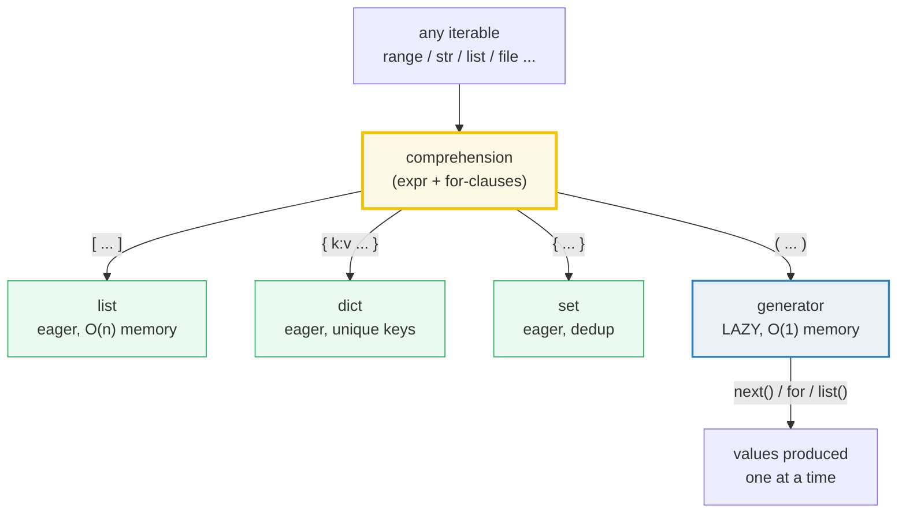
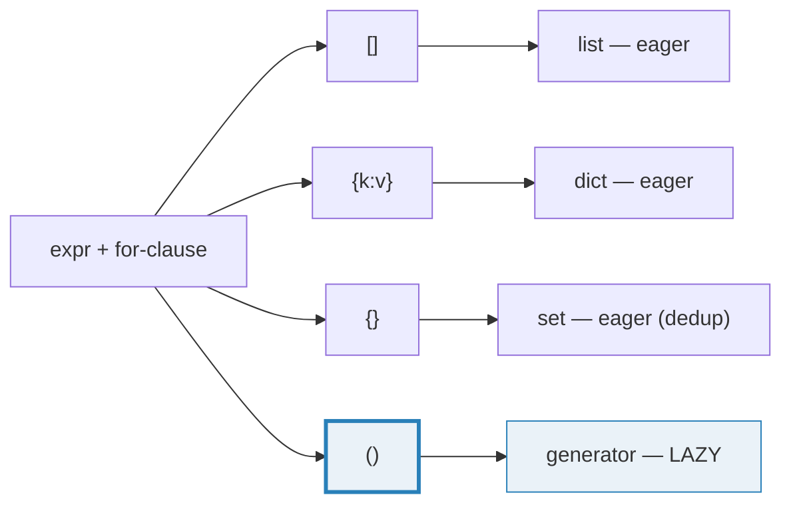
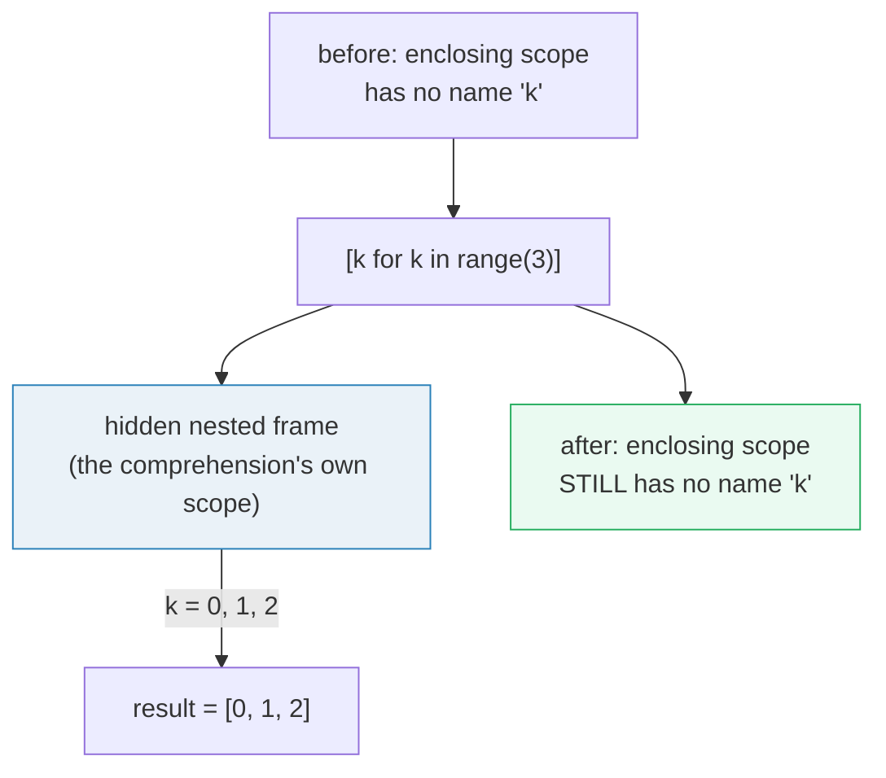
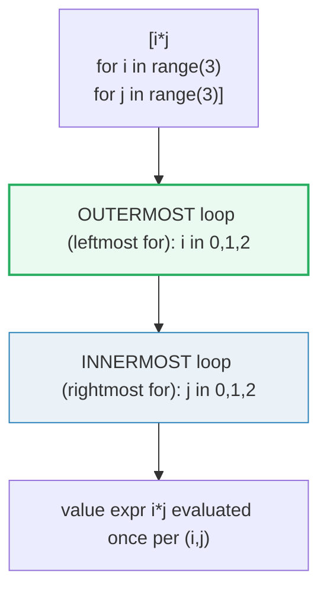
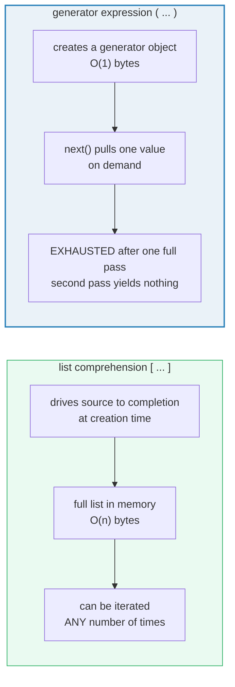

# Comprehensions — List / Dict / Set / Generator Forms, Scope, and Laziness

> **The one rule:** a comprehension is a *declarative expression* —
> "here is the shape of the result" — not an imperative recipe. One
> expression, one or more `for` clauses, and the brackets decide whether
> you get an eager `list`/`dict`/`set` or a *lazy* generator. Python 3 also
> gives every comprehension its **own scope**: the loop variable never leaks.
> Master the four forms, the `if` positions, and the double-for evaluation
> order, and you will never misread one again.

**Companion code:** [`comprehensions.py`](./comprehensions.py).
**Every value and table below is printed by `uv run python
comprehensions.py`** — change the code, re-run, re-paste. Nothing here is
hand-computed. Captured stdout lives in
[`comprehensions_output.txt`](./comprehensions_output.txt).

**Goal of this bundle (lineage, old → new):**

> from *"I write `for` loops to build lists"*
> → *"I reach for comprehensions as declarative, scoped, composable
> > expressions across list / dict / set / generator forms — and I know
> > exactly when they beat a for-loop and when they hurt readability."*

🔗 This is bundle **#4 of Phase 1**. It assumes
[`TYPES_AND_TRUTHINESS`](./TYPES_AND_TRUTHINESS.md) (the object model) and
feeds directly into [`GENERATORS_ITERATORS`](./GENERATORS_ITERATORS.md)
(Phase 1 #5) — the generator *object* a genexpr returns is the same iterator
protocol covered there. The scope-isolation demo also previews
[`FUNCTIONS_ARGS_SCOPE`](./FUNCTIONS_ARGS_SCOPE.md) (Phase 1 #6): a
comprehension in Py3 is compiled like a hidden nested function, which is
*why* its loop variable cannot leak.

---

## 0. The whole map on one page



| Form | Brackets | Eager or lazy? | Result type | Key property |
|---|---|---|---|---|
| List comprehension | `[ ... ]` | eager | `list` | ordered, allows duplicates |
| Dict comprehension | `{ k:v ... }` | eager | `dict` | insertion-ordered, unique keys |
| Set comprehension | `{ ... }` | eager | `set` | dedups |
| Generator expression | `( ... )` | **lazy** | `generator` | O(1) memory, **single-use** |

The grammar (Python Language Reference §6.2.4) is one expression followed
by `for`/`if` clauses:

```
comp_for: 'for' target_list 'in' or_test [comp_iter]
comp_if:  'if' or_test_nocond [comp_iter]
```

Multiple `for` clauses are allowed; multiple `if` clauses are allowed; they
interleave and read **left-to-right as nested loops/filters**.

---

## 1. The four forms — `[ ]`, `{ k:v }`, `{ }`, `( )`

The brackets are the only thing that changes between the four forms. Same
expression, same `for` clause, four different result types.



> From `comprehensions.py` Section A:
> ```
> ======================================================================
> SECTION A — The four forms: list, dict, set, generator
> ======================================================================
> A comprehension is one expression + one or more 'for' clauses.
> The brackets decide the result type:
>   []      -> list          (eager, ordered, allows duplicates)
>   {k:v}   -> dict          (eager, insertion-ordered, unique keys)
>   {x}     -> set           (eager, dedups)
>   ()      -> generator     (LAZY iterator object)
> 
> expression                      value                         type
> ------------------------------------------------------------------------
> [x*x for x in range(5)]         [0, 1, 4, 9, 16]              list
> {c: ord(c) for c in 'abc'}      {'a': 97, 'b': 98, 'c': 99}   dict
> {n%3 for n in range(10)}        {0, 1, 2}                     set
> (x*x for x in range(5))         <generator object>            generator
> 
> [check] list comprehension builds a list: OK
> [check] dict comprehension builds a dict: OK
> [check] dict comprehension values: {c: ord(c) for c in 'abc'}: OK
> [check] set comprehension builds a set: OK
> [check] set comprehension dedups: {n%3 for n in range(10)} == {0,1,2}: OK
> [check] generator expression has type 'generator': OK
> [check] genexpr is its own iterator: iter(g) is g: OK
> ```

### Why a genexpr is *not* a tuple (internals)

The parens form `(expr for x in src)` looks like it might build a tuple — it
does **not**. The grammar carves out a special case: a single `for`-clause
inside parens is a *generator expression*, which constructs an anonymous
generator function and immediately calls it (PEP 289 §1). The object you get
is a `generator` — the same type returned by a `def` with `yield`. It is its
own iterator (`iter(g) is g`), it produces values on demand via `next()`, and
it is **single-use**: once a `generator` is exhausted it stays empty forever.
The full iterator protocol is the subject of 🔗
[`GENERATORS_ITERATORS`](./GENERATORS_ITERATORS.md).

The eager forms (`list`/`dict`/`set`) are essentially `list(<genexpr>)`,
`dict(<genexpr>)`, `set(<genexpr>)` — they drive the underlying generator to
completion and materialise the entire result in memory before returning.

---

## 2. Py3 scope isolation — the loop variable does NOT leak

This is the single most important behavioral fact about comprehensions in
Python 3, and the one most often missed by people who learned Python 2.



> From `comprehensions.py` Section B:
> ```
> ======================================================================
> SECTION B — Py3 scope isolation: the loop variable does NOT leak
> ======================================================================
> In Python 2, a list comprehension's loop variable LEAKED into the
> enclosing scope (after [i for i in range(3)], i == 2). Python 3
> gave every comprehension its own scope (equivalent to wrapping a
> generator expression), so the loop variable is invisible after.
> 
> _scope_probe() ran: [k for k in range(3)] -> [0, 1, 2]
> After the comprehension, 'k' in locals() -> False
>   (False = the loop variable stayed inside the comprehension)
> 
> In Py2 the same code would have left k == 2 polluting the enclosing
> scope. The Py3 fix removes a whole class of 'stale loop variable'
> bugs at the cost of one extra frame per comprehension.
> 
> [check] comprehension loop var does NOT leak into enclosing locals: OK
> [check] the comprehension still produces the expected list: OK
> ```

### Why Py3 comprehensions have their own scope (internals)

In Python 2, list comprehensions were syntactic sugar that desugared to a
plain `for` loop in the *enclosing* scope — so the loop variable was an
ordinary assignment and lived on after the comprehension finished. This was a
frequent bug source: `[i for i in range(3)]; print(i)` printed `2`, and two
comprehensions using the same loop-variable name could clobber each other.

PEP 289 (generator expressions, Py2.4) introduced the rule that *generator*
expressions hide their loop variable, and explicitly announced (§3, §4):

> "List comprehensions also 'leak' their loop variable into the surrounding
> scope. This will also change in Python 3.0, so that the semantic definition
> of a list comprehension in Python 3.0 will be equivalent to
> `list(<generator expression>)`."

Python 3.0 delivered exactly that. Every comprehension (list, dict, set,
genexpr) is compiled as if it were a hidden nested function: the loop
variables are *locals* of that inner function, invisible to the enclosing
frame. Since Python 3.12, [PEP 709](https://peps.python.org/pep-0709/)
**inlines** the comprehension back into the enclosing function for speed,
but the *observable* behavior — no leak — is preserved (the loop variable is
stored in a compiler-internal slot the user cannot name).

🔗 The "hidden nested function" framing is exactly the closure model covered
in [`FUNCTIONS_ARGS_SCOPE`](./FUNCTIONS_ARGS_SCOPE.md) (Phase 1 #6).

---

## 3. Filtering vs conditional expressions — two different `if`s

The word `if` shows up in **two** structurally distinct positions inside a
comprehension, and confusing them is the most common comprehension bug.
The grammar enforces the distinction: a `comp_if` clause can only appear
*after* a `for`, while a conditional expression (`a if cond else b`) is an
ordinary expression that lives in the *value* position.

| Position | Syntax | Role | Rejected items |
|---|---|---|---|
| End (filter) | `[n for n in src if cond]` | **keeps** only items where `cond` is truthy | dropped from the result entirely |
| Value (ternary) | `[a if cond else b for ...]` | **transforms** every item into `a` or `b` | none — every source item appears once |

> From `comprehensions.py` Section C:
> ```
> ======================================================================
> SECTION C — Filtering vs conditional expressions (two different 'if's)
> ======================================================================
> 'if' can appear in TWO places in a comprehension, with different
> meanings:
>   1. At the END (filter):     [n for n in src if cond]
>        keeps only items where cond is truthy.
>   2. In the VALUE (ternary):  [a if cond else b for ...]
>        transforms each item via a conditional expression.
> They compose but they are NOT the same operator.
> 
> expression                                        value
> --------------------------------------------------------------------------
> [n for n in range(10) if n % 2 == 0]              [0, 2, 4, 6, 8]
> ['even' if n%2==0 else 'odd' for n in range(6)]   ['even', 'odd', 'even', 'odd', 'even', 'odd']
> [n*10 for n in range(10) if n % 2 == 0]           [0, 20, 40, 60, 80]
> 
> [check] filter at end keeps only evens from 0..9: OK
> [check] conditional expression labels each item: OK
> [check] filter + transform compose into one expression: OK
> ```

### Why the ternary form needs `else` (internals)

A conditional *expression* `a if cond else b` is a single expression that
always evaluates to a value (it's the Python ternary, PEP 308). It must have
an `else` because — unlike a filter — it has to produce *something* for
every item. If you write `[a if cond for x in src]` you get a `SyntaxError:
expected 'else' after conditional expression`; the only place a bare `if`
without `else` is legal inside a comprehension is the trailing filter
position. The two `if`s are parsed by different grammar rules (`comp_if` vs
the expression-level `test` rule), which is why they cannot be confused by
the compiler even though they share a keyword.

---

## 4. Nested / double-for comprehensions — leftmost is outermost

Multiple `for` clauses collapse a nested loop into one expression. The
**order matters**: the clauses read left-to-right as outside-to-inside
nesting, exactly mirroring how you would write the loops by hand.



> From `comprehensions.py` Section D:
> ```
> ======================================================================
> SECTION D — Nested / double-for comprehensions & matrix flatten
> ======================================================================
> Multiple 'for' clauses read left-to-right as NESTED loops:
> the LEFTMOST 'for' is the OUTERMOST loop (it advances slowest).
> The value expression is evaluated once per innermost iteration.
> 
> expression                                            value
> --------------------------------------------------------------------------
> [i*j for i in range(3) for j in range(3)]             [0, 0, 0, 0, 1, 2, 0, 2, 4]
> [[1,2],[3,4]] flattened via double-for                [1, 2, 3, 4]
> 
> Equivalent plain nested loops:
>   for i in range(3):
>       for j in range(3): equiv.append(i*j)
>   -> [0, 0, 0, 0, 1, 2, 0, 2, 4]
> 
> [check] double-for: leftmost for is outermost (slowest) loop: OK
> [check] matrix flatten via double-for: OK
> [check] double-for comprehension == equivalent nested loops: OK
> ```

### Why the leftmost `for` is the outermost (internals)

The reference manual (§6.2.4) and the comp-formal grammar make this explicit
in the rewrite rule. A comprehension

```
tgtexp for v1 in seq1 for v2 in seq2
```

desugars to

```
for v1 in seq1:
    for v2 in seq2:
        result.append(tgtexp)
```

— so the *leftmost* `for` corresponds to the *outermost* loop and advances
slowest. The matrix-flatten idiom `[cell for row in matrix for cell in row]`
is the canonical practical application: the outer `for` walks the rows, the
inner `for` walks each row's cells. Getting this backwards
(`[cell for cell in row for row in matrix]`) is a `NameError` at runtime
(`row` is referenced before it is bound by the outer loop) — a fast feedback
that you swapped them.

---

## 5. Generator expressions — lazy and single-use

A generator expression is the **lazy** member of the family. It allocates a
fixed-size generator object (no matter how long the source is) and produces
values one at a time via `next()`. The trade-off: it is **single-use** — once
exhausted, iterating it again yields nothing.



> From `comprehensions.py` Section E:
> ```
> ======================================================================
> SECTION E — Generator expressions: lazy & single-use (PEP 289)
> ======================================================================
> A generator expression uses PARENS, not brackets. It does NOT
> build a list — it returns a generator OBJECT that computes each
> value on demand via next(). It is SINGLE-USE: once exhausted, it
> stays empty forever. Memory cost is O(1) regardless of how many
> items it will eventually yield.
> 
> g = (x*x for x in range(5))
> type(g).__name__    = generator
> iter(g) is g        = True   (a genexpr IS its own iterator)
> next(g)             = 0    # 0*0, computed lazily
> next(g)             = 1    # 1*1, computed lazily
> list(g) (rest)      = [4, 9, 16]   # consumed the remaining 3
> list(g) again       = []   # EMPTY: the generator is exhausted
> 
> sys.getsizeof([x for x in range(1000)]) = 8856 bytes
> sys.getsizeof((x for x in range(1000))) = 192 bytes
>   (the generator's size is FIXED; the list grows with its length)
> 
> PEP 289 — outermost iterable is eager: ['before create', 'make_iter(outer) called', 'after create, before consume', 'after consume']
> 
> [check] genexpr has type 'generator': OK
> [check] genexpr is single-use: list() twice -> second empty: OK
> [check] genexpr uses less memory than the equivalent list: OK
> [check] PEP 289: outermost iterable evaluated at create time: OK
> ```

### Why a genexpr is single-use (internals)

PEP 289 §1 defines a generator expression's semantics as exactly equivalent
to creating an anonymous generator function and calling it:

```python
g = (x**2 for x in range(10))
# is equivalent to:
def __gen(exp):
    for x in exp:
        yield x**2
g = __gen(iter(range(10)))
```

A generator object holds a frozen *frame* (the suspended `for` loop) and a
reference to the source iterator. Each `next()` resumes the frame, runs to
the next `yield`, and suspends again. When the source iterator raises
`StopIteration`, the generator frame is closed and its state is discarded —
there is no saved copy of the values it produced, and no way to "rewind" the
source iterator. Hence `list(g)` twice gives `[]` the second time. If you
need to iterate the same computation twice, either materialise a list or
rebuild the genexpr.

### Why the outermost iterable is evaluated eagerly (the PEP 289 detail)

The event log `['before create', 'make_iter(outer) called', 'after create,
before consume', 'after consume']` proves a subtle rule: although the
*body* of a genexpr is lazy, the **outermost** `for`-expression's iterable
is evaluated **immediately** when the genexpr is created (it is bound as the
`exp1` argument to the hidden `__gen`), while every other expression (the
value, the inner `for` iterables, the `if` filters) is deferred. PEP 289
records Guido's rationale: in `sum(x for x in foo())`, you expect a bug in
`foo()` to surface at the call site, not deferred until `sum()` first pulls
a value. The practical consequence: side effects in the outermost iterable
run *before* the genexpr yields anything; side effects in the body run *only
when* something consumes the genexpr.

🔗 Generator objects, `yield`, `send()`, `throw()`, `close()`, and the full
iterator protocol (`__iter__` / `__next__`) are the subject of
[`GENERATORS_ITERATORS`](./GENERATORS_ITERATORS.md) (Phase 1 #5). This
bundle only touches the genexpr syntax; the machinery is the same.

---

## 6. Readability guardrail — when to STOP and write a for-loop

A comprehension is a win when the reader can name the result in one breath.
Past one nested ternary, two `for` clauses with a filter, or any side
effect, it becomes a loss: the declarative reading collapses and the line
reads as imperative code wearing brackets. The fix is always the same —
write the loop.

> From `comprehensions.py` Section F:
> ```
> ======================================================================
> SECTION F — Readability guardrail: when to STOP using a comprehension
> ======================================================================
> Comprehensions shine for simple map / filter / flatten. Past one
> line, two for-clauses, or a nested ternary, they HURT readability.
> Rule of thumb: if a reader cannot state the result without
> re-reading, use a for-loop.
> 
> data = list(range(-3, 4))   # [-3, -2, -1, 0, 1, 2, 3]
> 
> DON'T (nested ternary + filter packed into one comp):
>   bad = [(n, 'neg' if n<0 else 'zero' if n==0 else 'pos')
>          for n in data if n%2 != 0 or n == 0]
>   bad  = [(-3, 'neg'), (-1, 'neg'), (0, 'zero'), (1, 'pos'), (3, 'pos')]
> 
> DO (equivalent for-loop — same result, readable):
>   good = [(-3, 'neg'), (-1, 'neg'), (0, 'zero'), (1, 'pos'), (3, 'pos')]
> 
> [check] both forms produce identical results: OK
> [check] the result matches the hand-derived expectation: OK
> ```

The two forms produce byte-identical output (the `[check]` asserts it), so
this is purely a readability decision. The comprehension version forces the
reader to hold three things in their head at once — the filter predicate
(`n%2 != 0 or n == 0`), the nested ternary (`'neg' if n<0 else 'zero' if
n==0 else 'pos'`), and the tuple construction — and to do it right-to-left.
The `for`-loop says the same thing in the order a human would describe it.
When in doubt, optimise for the reader.

---

## Pitfalls

| Trap | Example | The fix |
|---|---|---|
| Assuming the loop variable leaks | `[i for i in range(3)]; print(i)` → `NameError` (Py3) | it stayed in Py2; in Py3 the comprehension has its own scope — rebind explicitly if you need the last value |
| Reusing an exhausted genexpr | `g = (x for x in range(3)); list(g); list(g)` → `[]` | genexprs are single-use; rebuild it, or materialise a `list` if you need multiple passes |
| Confusing filter `if` with ternary `if` | `[n if n%2 for n in src]` → `SyntaxError` (ternary needs `else`) | trailing `if` filters; value-position `if` is a ternary and needs `else` |
| Swapping double-for order | `[c for c in r for r in m]` → `NameError` (`r` used before bound) | leftmost `for` is outermost; write the nested loops by hand first if unsure |
| Expecting a genexpr to be a tuple | `type((x for x in []))` → `generator`, not `tuple` | parens + single `for` is a genexpr; for a 1-tuple use `(expr,)` |
| Building a huge list you only iterate once | `[transform(x) for x in huge_src]` then one `for` pass | use a genexpr `(transform(x) for ...)` — O(1) memory instead of O(n) |
| Expecting the genexpr body to run at creation | side effects inside `(f(x) for x in src)` don't fire until consumed | only the outermost iterable is eager (PEP 289); the body is lazy |
| Relying on dict/set comprehension order for `set` | `{x for x in src}` has no defined order | `set` is unordered; use a `dict` comprehension (insertion-ordered since Py3.7) if order matters |
| Cramming a nested ternary into one comp | `[(x, 'a' if c1 else 'b' if c2 else 'c') for ... if ...]` | if a reader has to re-read, switch to a plain `for`-loop (§6) |
| Mutating the source while iterating | `[x for x in lst if not lst.remove(x)]` → wrong length / skips | never mutate the iterable a comprehension (or any loop) is reading |

---

## Cheat sheet

- **Four forms:** `[expr for ...]` → `list`; `{k:v for ...}` → `dict`;
  `{expr for ...}` → `set`; `(expr for ...)` → `generator` (lazy).
- **Scope (Py3):** every comprehension has its own scope — the loop variable
  does **not** leak. (In Py2 it did; PEP 289 §3–§4 announced the Py3 fix.)
- **Two `if` positions:** trailing `if` *filters* (`[x for x in s if c]`);
  value-position `if-else` is a *ternary* and needs `else`
  (`[a if c else b for x in s]`). Different grammar rules; not interchangeable.
- **Double-for order:** leftmost `for` is the **outermost** loop.
  `[i*j for i in R for j in R]` == nested `for i: for j: append(i*j)`.
- **Set dedups:** `{n%3 for n in range(10)} == {0, 1, 2}`.
- **Genexpr is lazy + single-use:** `type((x for x in [])) is generator`;
  `iter(g) is g`; `list(g)` then `list(g)` → `[]`. O(1) memory regardless of
  source length.
- **PEP 289 eager-outermost detail:** the outermost iterable IS evaluated at
  genexpr creation; the body is deferred. Side effects in the outermost
  iterable run early; side effects in the body run on consumption.
- **Readability:** stop at one line / two `for` clauses / no nested ternary.
  If a reader must re-read, write a `for`-loop.

---

## Sources

- **Python Language Reference — §6.2.4 Displays for lists, sets and
  dictionaries.**
  https://docs.python.org/3/reference/expressions.html#displays-for-lists-sets-and-dictionaries
  *The authoritative grammar for comprehensions and generator expressions:
  the `comp_for` / `comp_if` clauses, the rule that "the iterable expression
  in the leftmost for clause is immediately evaluated," and that a
  comprehension has its own implicitly nested scope. Basis for §1, §3, §4,
  and §5.*
- **Python Tutorial — §5.1.3 List Comprehensions.**
  https://docs.python.org/3/tutorial/datastructures.html#list-comprehensions
  *The official worked examples of list comprehensions, nested loops, and
  the flattening idiom `[cell for row in matrix for cell in row]` quoted in
  §4.*
- **PEP 202 — List Comprehensions (Barry Warsaw, 2000).**
  https://peps.python.org/pep-0202/
  *Introduced list comprehensions in Python 2.0. Defines the `[expr for
  target in iterable ...]` form and the early "leaks the loop variable"
  semantics that Py3 later removed.*
- **PEP 274 — Dict Comprehensions (Barry Warsaw, 2001).**
  https://peps.python.org/pep-0274/
  *Extended the comprehension syntax to `{key: val for ...}` in Python 2.7
  / 3.0. Referenced in §1.*
- **PEP 289 — Generator Expressions (Raymond Hettinger, 2004).**
  https://peps.python.org/pep-0289/
  *The defining document for generator expressions. §1 gives the
  desugaring-equivalent-to-an-anonymous-generator-function rule and the
  "outermost for-expression is evaluated immediately" detail demonstrated in
  §5. §3–§4 announce that list comprehensions will stop leaking their loop
  variable in Python 3.0 (the basis of §2). §"Early Binding versus Late
  Binding" records Guido's rationale for eager evaluation of the outermost
  iterable.*
- **PEP 709 — Inlined comprehensions (Python 3.12).**
  https://peps.python.org/pep-0709/
  *Inlining list/dict/set comprehensions into the enclosing function for
  speed. Explicitly preserves the no-leak behavior: "the iteration
  variable(s) of a comprehension no longer leak into the enclosing scope."
  Referenced in the §2 internals note.*
- **PEP 308 — Conditional Expressions.**
  https://peps.python.org/pep-0308/
  *The `a if cond else b` ternary expression that powers the value-position
  `if` in §3. Explains why the ternary form mandates an `else` while the
  trailing filter `if` does not.*
- **Python docs — `types.GeneratorType`.**
  https://docs.python.org/3/library/types.html#types.GeneratorType
  *The type object returned by a generator expression and by a generator
  function; used in the §1 and §5 `[check]` asserts.*
- **Stack Overflow — "Order of for statements in a list comprehension."**
  https://stackoverflow.com/questions/32530840/order-of-for-statements-in-a-list-comprehension
  *Independent community confirmation that the for-clauses are listed in
  nesting order (leftmost = outermost), matching the §4 desugaring.*
- **CodeQL — "List comprehension variable used in enclosing scope."**
  https://codeql.github.com/codeql-query-help/python/py-leaking-list-comprehension/
  *Documents the Py2→Py3 scope change from a static-analysis perspective:
  "In Python 3 the iteration variable is no longer visible in the enclosing
  scope." Cited in §2.*
