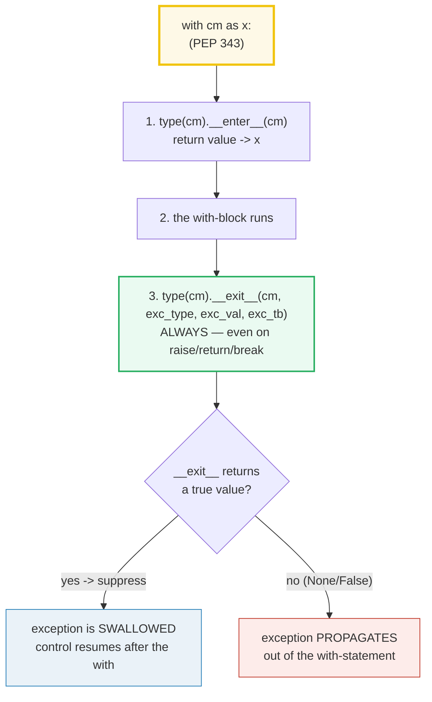
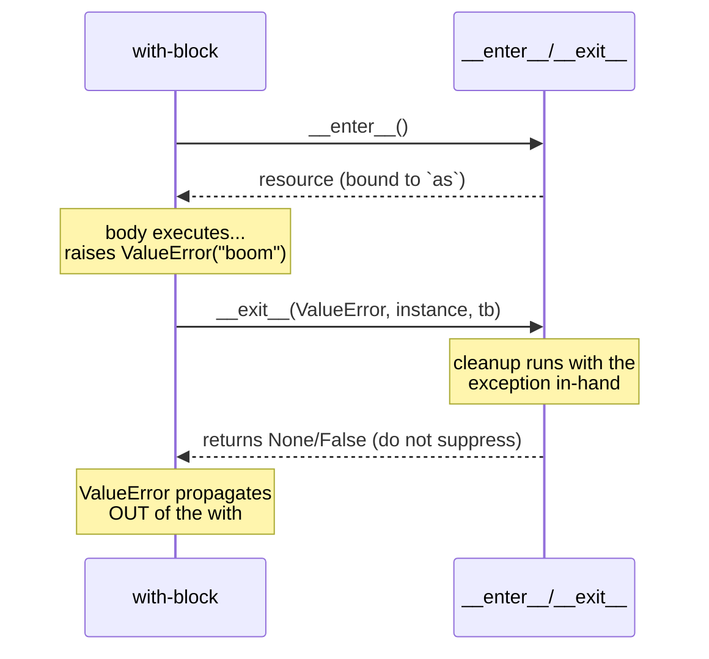
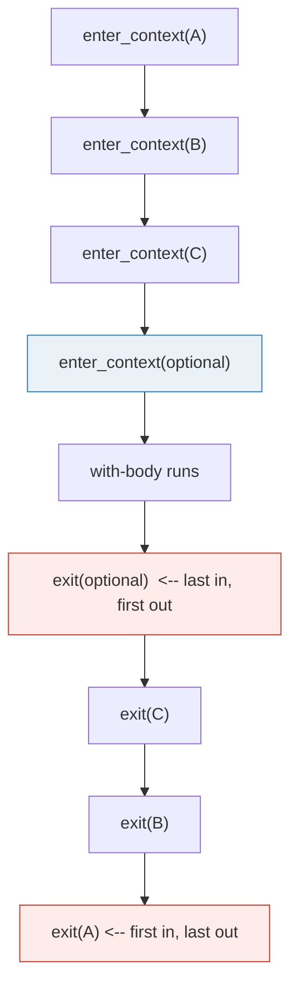

# Context Managers — `with`, `__enter__`/`__exit__`, `@contextmanager`, and `ExitStack`

> **The one rule:** a context manager is a small protocol — `__enter__`
> sets up, `__exit__` tears down, and `__exit__` is **guaranteed** to run
> no matter how the `with`-block exits (return, raise, `break`, `return`).
> Return `True` from `__exit__` and the exception is swallowed. That is
> the entire API; everything else (`@contextmanager`, `ExitStack`,
> `suppress`, `closing`, `redirect_stdout`, `async with`) is sugar on top.

**Companion code:** [`context_managers.py`](./context_managers.py).
**Every number and table below is printed by `uv run python
context_managers.py`** — change the code, re-run, re-paste. Nothing here is
hand-computed. Captured stdout lives in
[`context_managers_output.txt`](./context_managers_output.txt).

**Goal of this bundle (lineage, old → new):**

> from *"I write `with open(path) as f:` and it just closes the file"*
> → *"I understand the With-Statement Context Manager protocol
> (`__enter__`/`__exit__` on the TYPE), that `__exit__` always runs even on
> exception, that returning `True` suppresses, that I can write CMs as
> classes *or* as `@contextmanager` generators, compose them with
> `ExitStack`, reach for `contextlib` helpers, and use `async with`
> (`__aenter__`/`__aexit__`) in async code."*

🔗 This bundle sits on top of:
[`DUNDER_METHODS`](./DUNDER_METHODS.md) (P2 #10) — the data-model view that
`with x:` is `type(x).__enter__(x)` / `type(x).__exit__(x, ...)`;
[`EXCEPTIONS`](./EXCEPTIONS.md) (P1 #8) — the `finally` guarantee that CMs
replace with structured cleanup; and it points **forward** to
[`ASYNCIO`](./ASYNCIO.md) (P3 #21) for the full async event-loop story that
`async with` slots into. See [`TODO.md`](./TODO.md) for the full plan.

---

## 0. The four ideas on one page



| Question | Answer | Where in the docs |
|---|---|---|
| What does `with C() as x:` bind `x` to? | Whatever `__enter__` **returns** (often `self`). | [Data model — `object.__enter__`](https://docs.python.org/3/reference/datamodel.html#object.__enter__) |
| Does `__exit__` run if the body raises? | **Always.** It receives `(exc_type, exc_val, exc_tb)`. | [Data model — `object.__exit__`](https://docs.python.org/3/reference/datamodel.html#object.__exit__) |
| How do I stop the exception propagating? | Return a **true** value from `__exit__`. | same |
| How do I write a CM without a class? | `@contextlib.contextmanager` on a generator that `yield`s once. | [contextlib — `contextmanager`](https://docs.python.org/3/library/contextlib.html#contextlib.contextmanager) |
| How do I compose a *variable* number of CMs? | `with ExitStack() as s: s.enter_context(cm)`. Cleanups run **LIFO**. | [contextlib — `ExitStack`](https://docs.python.org/3/library/contextlib.html#contextlib.ExitStack) |
| What's the async version? | `async with` + `__aenter__`/`__aexit__` (both coroutines). [PEP 492](https://peps.python.org/pep-0492/). | [Data model — async CMs](https://docs.python.org/3/reference/datamodel.html#asynchronous-context-managers) |

---

## 1. Class-based CM: `__enter__` returns the resource, `__exit__` cleans up

The protocol lives on the **type**, not the instance (same as every other
dunder — see 🔗 [`DUNDER_METHODS`](./DUNDER_METHODS.md) §A). `with C() as x:`
is sugar for roughly:

```python
mgr = C()
x = type(mgr).__enter__(mgr)      # bound to the `as` target
try:
    ...  # your with-block
finally:
    type(mgr).__exit__(mgr, *sys.exc_info())  # always runs
```

So `x` is **not** `mgr` unless `__enter__` chooses to return `self` (the
common case for resource objects). A clean exit passes `(None, None, None)`
to `__exit__`; an exception passes the live `(type, value, traceback)`.

> From `context_managers.py` Section A:
> ```
> ======================================================================
> SECTION A — Class-based CM: __enter__ -> resource, __exit__ -> cleanup
> ======================================================================
> `with C() as x:` binds x to whatever __enter__ RETURNS (often self).
> When the with-block ends, Python calls __exit__(exc_type, exc_val,
> exc_tb). On a clean exit all three exc_* args are None. This is the
> With-Statement Context Managers protocol (Data model §3.3.6 / PEP 343).
> 
>     __enter__ -> OPEN 'data.txt'; returning <FakeFile 'data.txt' open=False>
>     inside with: f = <FakeFile 'data.txt' open=True>
> [check] f is exactly what __enter__ returned: OK
> [check] resource is OPEN inside the with-block: OK
>     __exit__  -> CLOSE 'data.txt' (exc_type=None)
>     after with:  f = <FakeFile 'data.txt' open=False>
> 
> [check] __enter__ return is bound to the `as` target: OK
> [check] resource is CLOSED after the with-block: OK
> [check] exc_type is None on a clean exit (we saw 'None' printed): OK
> ```

### Why `__enter__` returns `self` (the `PyObject*` view)

The `with`-block needs **a handle to the resource** (the file object, the
lock, the DB connection). The CM *instance* is the *manager*; the resource
*is* the manager in the common case, so `__enter__` returns `self`. But the
protocol does not require it: `contextlib.closing(thing)` returns `thing`
(not the CM), and `ExitStack.__enter__` returns the stack itself because the
stack is the compositional handle. The invariant the interpreter enforces is
just: *whatever `__enter__` returns is what `as` binds* — nothing more.

🔗 The full dunder-dispatch story (`type(x).__enter__`, not `x.__enter__`) is
in [`DUNDER_METHODS`](./DUNDER_METHODS.md) §A & §G; this bundle takes that
lookup rule as given and focuses on the protocol's behavior.

---

## 2. `__exit__` ALWAYS runs — even when the body raises

This is the property that makes `with` worth having. The Data model is
explicit ([§3.3.6, "With Statement Context Managers"](https://docs.python.org/3/reference/datamodel.html#with-statement-context-managers)):
the `__exit__` method is invoked "when the execution of the body [has
finished]" — where "finished" explicitly includes *raising*. CPython
implements this with a `SETUP_FINALLY`-style guarantee around the block: the
exception is threaded *into* `__exit__` via its three arguments, and only
re-propagated afterwards unless `__exit__` returns a true value.



> From `context_managers.py` Section B:
> ```
> ======================================================================
> SECTION B — __exit__ ALWAYS runs (even when the body raises)
> ======================================================================
> If the with-block raises, Python still calls __exit__, passing the
> exception's (type, value, traceback). Unless __exit__ returns a true
> value, the exception then PROPAGATES out of the with-statement. The
> cleanup guarantee is the whole point of `with` over bare try/finally.
> 
>     caught outside with: ValueError('boom from the body')
>     events = ['enter', 'body-before-raise', 'exit(exc_type=ValueError)']
> 
> [check] body raised ValueError (propagated past __exit__): OK
> [check] __exit__ had NOT yet run at the raise site: OK
> [check] __exit__ ran AFTER the raise (saw exc_type=ValueError): OK
> [check] full lifecycle: enter -> body -> exit(exc_type=ValueError): OK
> ```

### Why this beats hand-rolled `try/finally` (internals)

The equivalent `try/finally` is verbose and easy to get wrong — you must
remember the `finally` on **every** call site, and if the acquire step has
multiple sub-steps you need nested `try/finally`s to avoid leaking on a
partial init. `with` moves that discipline into the *type*: the author of
the resource writes `__exit__` **once**, and every caller gets the guarantee
for free. The mechanism is the same CPython cleanup-frame machinery that
powers `finally` (🔗 [`EXCEPTIONS`](./EXCEPTIONS.md) §A shows `finally`
running even on `return`); `with` just packages it as a protocol. PEP 343
was motivated precisely by the "factor out the try/finally" use case.

---

## 3. `__exit__` returning `True` SUPPRESSES the exception

The Data model says it in one sentence: *"If an exception is supplied, and
the method wishes to suppress the exception (i.e., prevent it from being
propagated), it should return a true value."* This is how `contextlib.suppress`
and many retry/ignore patterns are built — and it is **selective**: you can
inspect `exc_type` and swallow only the exception families you meant to.

> From `context_managers.py` Section C:
> ```
> ======================================================================
> SECTION C — __exit__ returning True SUPPRESSES the exception
> ======================================================================
> Data model: 'a true value [from __exit__] signifies that the
> exception... will be suppressed.' Below we selectively swallow
> ValueError but let every other exception propagate.
> 
>     __exit__ saw ValueError -> returning True
>     (ValueError did NOT propagate past the with)
> 
> [check] returning True from __exit__ suppressed the ValueError: OK
>     __exit__ saw KeyError -> returning False
>     KeyError DID propagate: KeyError('not swallowed')
> 
> [check] __exit__ returning False lets KeyError propagate: OK
> [check] __exit__ is SELECTIVE: ValueError swallowed, KeyError not: OK
> ```

### The expert gotcha: any true value suppresses

The rule is "a **true** value", not "the literal `True`". So `return 1`,
`return "suppressed"`, or `return []` (if it's non-empty) all suppress. This
is a sharp foot: a `__exit__` that *accidentally* falls off the end returns
`None` (falsy → propagates, which is what you usually want), but a `__exit__`
that does `return self._flag` where `_flag` happens to be truthy will
silently eat exceptions. Convention: **return an explicit `True`/`False`**;
reserve `return True` for CMs whose entire job is suppression
(`suppress`, `ExitStack` with a filtering callback).

---

## 4. `contextlib.contextmanager` — a generator-based CM

Writing `__enter__`/`__exit__` by hand is verbose for the common case of
"acquire, yield, release". `contextlib.contextmanager` (added in Python 2.5,
[the docs](https://docs.python.org/3/library/contextlib.html#contextlib.contextmanager))
turns a one-`yield` generator into a CM:

```python
@contextmanager
def managed_resource(*args, **kwds):
    resource = acquire_resource(*args, **kwds)   # == __enter__
    try:
        yield resource                            # == the with-block
    finally:
        release_resource(resource)                # == __exit__
```

The code **before** `yield` runs as `__enter__`; the **yielded value** is
bound to the `as` target; the code **after** `yield` runs as `__exit__`.
The decorator demands **exactly one** `yield` — a second yield triggers
`RuntimeError("generator didn't stop")` at context exit.

> From `context_managers.py` Section D:
> ```
> ======================================================================
> SECTION D — contextlib.contextmanager: a generator-based CM
> ======================================================================
> @contextmanager turns a generator into a CM. Code BEFORE yield is
> setup (== __enter__); the yielded value is bound to the `as` target;
> code AFTER yield is cleanup (== __exit__). The decorator requires
> exactly one yield.
> 
>     [setup]  <section>
>     [body]   bound to: 'payload-for-section'
>     [cleanup] </section>
> 
> [check] the yielded value is bound to the `as` target: OK
> [check] cleanup-after-yield ran (we saw '[cleanup] </section>'): OK
> 
>   One-yield rule: yielding twice is a usage error at runtime.
> 
>     body saw: 'first'
>     RuntimeError: "generator didn't stop"
> 
> [check] a generator CM must yield exactly once (2nd yield raises): OK
> ```

### How `@contextmanager` is implemented (internals)

The decorator returns a small wrapper class (`_GeneratorContextManager` in
CPython's `Lib/contextlib.py`) whose `__enter__` does `next(self.gen)` to
run setup up to the yield, and whose `__exit__` does one of two things: on a
clean exit it calls `next(self.gen)` again (which runs the cleanup and must
raise `StopIteration`); on an exception it calls
`self.gen.throw(exc_type, exc_val, exc_tb)` — **re-raising the exception
inside the generator at the yield point** (see §5). That `.throw()` is the
key trick: it's what lets a `try/except/finally` *around* the `yield` become
your `__exit__` logic, and why a bare `yield` with no surrounding `try`
lets exceptions propagate untouched.

🔗 The generator-protocol primitives (`next`, `.throw()`, `StopIteration`)
are covered in [`GENERATORS_ITERATORS`](./GENERATORS_ITERATORS.md) (P2);
this bundle shows the *CM* layer built on top of them.

---

## 5. Generator CM + exception: re-raised AT the yield

The docs are precise about the failure path
([contextlib](https://docs.python.org/3/library/contextlib.html#contextlib.contextmanager)):

> *"If an unhandled exception occurs in the block, it is reraised inside the
> generator at the point where the yield occurred. Thus, you can use a
> try…except…finally statement to trap the error (if any), or ensure that
> some cleanup takes place. If an exception is trapped merely in order to
> log it … the generator must reraise that exception. Otherwise the
> generator context manager will indicate to the `with` statement that the
> exception has been handled."*

Two consequences, both asserted below: (1) a `try/finally` around the yield
runs cleanup no matter what; (2) a `try/except` around the yield that
*doesn't* re-raise **suppresses** the exception — this is the generator-CM
equivalent of `return True` from `__exit__`. Note that code *after* the
yield inside the `try` block is **skipped** when an exception is thrown in
(the throw jumps straight to the `except`/`finally`).

> From `context_managers.py` Section E:
> ```
> ======================================================================
> SECTION E — Generator CM + exception: re-raised AT the yield
> ======================================================================
> docs.python.org contextlib: 'If an unhandled exception occurs in the
> block, it is reraised inside the generator at the point where the
> yield occurred.' So a try/finally around the yield runs cleanup, and
> a try/except can SUPPRESS the exception (don't re-raise it).
> 
>     trace = ['setup', 'before-yield', 'body-got-resource', 'caught-in-generator', 'finally-cleanup']
> 
> [check] yielded value still bound to `as` target: OK
> [check] exception re-raised AT the yield (skipped 'after-yield-clean'): OK
> [check] except in the generator caught the RuntimeError: OK
> [check] finally cleanup ran regardless: OK
> [check] RuntimeError was SUPPRESSED (generator caught and did not re-raise): OK
> ```

### The expert gotcha: "just catch and log" silently swallows

If you wrap `yield` in `except Exception: log(...)`, intending to log and
move on, you have **also suppressed** the exception — the `with`-block's
caller will never see it. To log-and-propagate you must `raise` at the end
of the `except`. Pylint even has a rule for this (`contextmanager-generator-missing-cleanup`).
The safe idiom is `try / yield / finally: <cleanup>` with **no** bare
`except`; add an `except` only when suppression is the explicit intent.

---

## 6. `ExitStack` — compose a dynamic number of CMs (LIFO cleanup)

`with A() as a, B() as b, C() as c:` is fine when you know the count at
write-time. When the list of CMs is driven by **input data** (open N files)
or **conditions** (only acquire the optional resource if needed),
[`contextlib.ExitStack`](https://docs.python.org/3/library/contextlib.html#contextlib.ExitStack)
is the tool. You enter a `with ExitStack() as stack:` block and then call
`stack.enter_context(cm)` for each resource; on exit the stack unwinds in
**reverse registration order** (LIFO), exactly as if you had written the
equivalent nested `with`-statements by hand.



> From `context_managers.py` Section F:
> ```
> ======================================================================
> SECTION F — ExitStack: compose CMs dynamically; cleanups run LIFO
> ======================================================================
> ExitStack lets you enter a VARIABLE number of CMs (driven by input
> data or conditions). enter_context(cm) returns __enter__'s value and
> registers __exit__ on a stack; on exit the stack unwinds in REVERSE
> registration order (LIFO) — exactly like nested with-statements.
> 
>     entered order:  ['a.txt', 'b.txt', 'c.txt', 'optional']
>     log (open+close) = ['open:a.txt', 'open:b.txt', 'open:c.txt', 'open:optional', 'close:optional', 'close:c.txt', 'close:b.txt', 'close:a.txt']
> 
> [check] all four resources were entered in registration order: OK
> [check] opens happened in registration order: OK
> [check] closes happened in REVERSE order (LIFO): OK
> [check] every open has a matching close: OK
> ```

### Why LIFO (internals)

Each registered `__exit__` is appended to a list; at close time the list is
iterated **backwards**. This mirrors the natural "bracket" structure of
resource lifetimes: if B's setup depended on A being alive, then B must be
torn down *before* A. The docs note one subtlety: *"if an inner callback
suppresses or replaces an exception, then outer callbacks will be passed
arguments based on that updated state"* — so an inner `__exit__` that
returns true will cause outer ones to see `(None, None, None)`. Useful for
"open all files atomically, close them all on any failure" patterns.

### Beyond `enter_context`

`ExitStack` has three other entry points worth knowing: `push(exit_fn)`
(register an exit-style callback without calling its `__enter__`),
`callback(fn, *args)` (register a plain cleanup function — cannot suppress
exceptions), and `pop_all()` (transfer the pending cleanups to a *new* stack,
used to "commit" — keep resources alive past the original `with`).
[`contextlib` Examples and Recipes](https://docs.python.org/3/library/contextlib.html#examples-and-recipes)
shows each.

---

## 7. `contextlib` helpers — `suppress`, `closing`, `redirect_stdout`

Three small but battle-tested CMs ship in
[`contextlib`](https://docs.python.org/3/library/contextlib.html):

| Helper | Equivalent to | Use it when |
|---|---|---|
| `suppress(*exc)` | `try: ... except exc: pass` | You want to **silently** ignore a specific exception (e.g. `FileNotFoundError` on `os.remove`). |
| `closing(thing)` | `try: yield thing; finally: thing.close()` | The object has `.close()` but **isn't** a CM (legacy urllib handles, `subprocess.Popen`-style). |
| `redirect_stdout(target)` | `try: old=sys.stdout; sys.stdout=target; ...; finally: sys.stdout=old` | You need to capture `print()` output for a test (swap `target` for an `io.StringIO`). |

`suppress` is **reentrant** and suppresses only the listed types (and since
3.12, plucks them out of a `BaseExceptionGroup`). `closing` is literally the
four-line contextmanager shown in its "Equivalent to" column. `redirect_stdout`
mutates global state — fine for a single-threaded script or test, unsafe in
library code running under threads.

> From `context_managers.py` Section G:
> ```
> ======================================================================
> SECTION G — contextlib helpers: suppress / closing / redirect_stdout
> ======================================================================
> suppress(*exc): swallow the listed exception types (== try/except:
> pass). closing(thing): call thing.close() on exit (for objects that
> have .close() but aren't CMs). redirect_stdout(target): swap
> sys.stdout for the duration of the block.
> 
>     suppress(FileNotFoundError): second os.remove swallowed -> removed='file still exists'
> [check] suppress swallowed the FileNotFoundError: OK
>     closing(c): bound-to-itself=True, c.closed=True
> [check] closing(thing) yields the thing itself: OK
> [check] closing(thing) called thing.close() on exit: OK
>     redirect_stdout captured 52 chars: 'hello from inside redirect_stdout\nand a second line\n'
> 
> [check] redirect_stdout captured the first print: OK
> [check] redirect_stdout captured the second print too: OK
> [check] stdout restored after the block (this line reached the terminal): OK
> ```

---

## 8. `async with` (PEP 492) — `__aenter__` / `__aexit__`

[PEP 492](https://peps.python.org/pep-0492/) (Python 3.5, 2015) introduced
`async with` for the async world. The protocol mirrors the sync one exactly,
but the two methods are **coroutines** and must be awaited:

> *"Two new magic methods are added: `__aenter__` and `__aexit__`. Both must
> return an awaitable."* — PEP 492

The same guarantees carry over: `__aexit__` always runs, even if the body
raises; returning a true value suppresses. `contextlib.asynccontextmanager`
is the generator-CM analog for `async with`, and `AsyncExitStack` composes a
mix of sync + async CMs. Full async-event-loop theory is the subject of
🔗 [`ASYNCIO`](./ASYNCIO.md) (P3 #21); here we only show that the cleanup
contract you learned above is preserved.

> From `context_managers.py` Section H:
> ```
> ======================================================================
> SECTION H — async with (PEP 492): __aenter__ / __aexit__ coroutines
> ======================================================================
> PEP 492 added `async with`. The protocol mirrors the sync one but
> uses __aenter__/__aexit__, BOTH coroutines (they must be awaited).
> The same cleanup guarantee holds: __aexit__ always runs, even on an
> exception in the body. Full async treatment lives in ASYNCIO (P3 #21).
> 
>     log = ['aenter:db', 'body:using-db', 'aexit:db']
> 
> [check] __aenter__ ran before the body: OK
> [check] the body saw the resource: OK
> [check] __aexit__ ran after the body (cleanup guaranteed): OK
> [check] async-with lifecycle: aenter -> body -> aexit: OK
> ```

---

## Pitfalls

| Trap | Example | The fix |
|---|---|---|
| Assuming `with C() as x:` binds `x` to the CM instance | `__enter__` may return anything; `closing(t)` returns `t`, not the CM | read the CM's contract; don't assume `x is the_cm_instance` |
| `__exit__` that falls off the end returns `None` | `def __exit__(self, *e): self.close()` → falsy → exception propagates (usually what you want, but be explicit) | `return False` explicitly for "always propagate"; `return True` only to suppress |
| Any truthy `__exit__` return suppresses | `return self._debug_flag` accidentally eats exceptions when the flag is truthy | return an **explicit** `True`/`False`; never a variable whose truthiness you didn't intend |
| Bare `except` around `yield` in a `@contextmanager` | `except Exception: log(e)` logs **and silently swallows** the exception | re-raise with bare `raise` at the end of the `except`, or use `try / yield / finally` with no `except` |
| Yielding more than once in `@contextmanager` | second `yield` → `RuntimeError("generator didn't stop")` at with-exit | a generator CM must `yield` **exactly once** |
| Using `suppress` to hide unexpected errors | `with suppress(Exception): risky()` masks bugs | suppress **specific** types you've reasoned about (`FileNotFoundError`, not `Exception`) |
| `redirect_stdout` is not thread-safe | mutates global `sys.stdout` → other threads' prints get captured too | only use in single-threaded scripts/tests; for libraries, inject a stream explicitly |
| `closing(thing)` vs `with thing:` confusion | `closing` only calls `.close()`; it does **not** call `__enter__`/`__exit__` | use `closing` only for objects with `.close()` but **no** CM protocol |
| Reusing a generator CM instance | `cm = f()`; `with cm: ...`; `with cm: ...` → `RuntimeError("generator didn't yield")` the second time | `@contextmanager` CMs are **single-use**; build a fresh one per `with` |
| Nesting a single `ExitStack` instance | the inner `with` clears the whole stack early | use **separate** `ExitStack` instances for nesting; reuse only across non-overlapping `with`s |
| `__enter__` raises but you already acquired sub-resources | partial init leaks the earlier resource | use an inner `ExitStack` inside `__enter__` and `pop_all()` on success (see contextlib recipes) |
| Suppressing a `BaseException` subclass by accident | `__exit__` returning `True` for `Exception` still lets `KeyboardInterrupt` propagate (it's `BaseException`), but a broad `except BaseException` in a gen-CM swallows Ctrl-C | catch only what you mean to; let `SystemExit`/`KeyboardInterrupt`/`GeneratorExit` escape |

---

## Cheat sheet

- **The protocol:** `with cm as x:` → `x = type(cm).__enter__(cm)`, run body,
  then `type(cm).__exit__(cm, exc_type, exc_val, exc_tb)` — `__exit__`
  **always** runs, even on raise/return/break.
- **`as` binding:** `x` is whatever `__enter__` **returns** (often `self`,
  but not required — `closing(t)` returns `t`).
- **Suppress:** `__exit__` returning a **true** value swallows the exception;
  `None`/`False`/falling-off-the-end all propagate.
- **Three `__exit__` args:** `(exc_type, exc_val, exc_tb)` — all `None` on a
  clean exit; the live `(type, value, traceback)` on a raise.
- **`@contextmanager`:** setup → `yield value` (bound to `as`) → cleanup.
  Exactly one `yield`. Wrap `yield` in `try/finally` for guaranteed cleanup;
  a bare `except` that doesn't re-raise **suppresses**.
- **`ExitStack`:** `enter_context(cm)` for a variable/conditional set of CMs;
  cleanups run **LIFO** (reverse registration order), like nested `with`s.
  `push`/`callback`/`pop_all` for finer control.
- **Helpers:** `suppress(*exc)` ≈ `except exc: pass`; `closing(thing)` ≈
  `finally: thing.close()`; `redirect_stdout(buf)` swaps `sys.stdout` (not
  thread-safe).
- **`async with` (PEP 492):** `__aenter__`/`__aexit__` are **coroutines**;
  same guarantees. `@asynccontextmanager` and `AsyncExitStack` mirror the
  sync helpers.
- **CMs vs `try/finally`:** CMs factor the cleanup into the **type** so every
  caller gets it for free; prefer `with` whenever a resource has a setup/teardown
  pair (`open`, `Lock`, `db.transaction`, `subprocess`, …).

---

## Sources

- **Python docs — Data model: With Statement Context Managers.**
  https://docs.python.org/3/reference/datamodel.html#with-statement-context-managers
  *The normative protocol: `__enter__` "return value … bound to the target";
  `__exit__(self, exc_type, exc_val, exc_tb)`; "a true value signifies that
  the exception … will be suppressed." Quoted in §§1, 2, 3.*
- **Python docs — Data model: Object.__enter__ / Object.__exit__.**
  https://docs.python.org/3/reference/datamodel.html#object.__enter__
  *The exact signatures and the "should return a true value" suppression
  rule. Basis for §1 and §3.*
- **Python docs — `contextlib`: Utilities for with-statement contexts.**
  https://docs.python.org/3/library/contextlib.html
  *`contextmanager`, `suppress`, `closing`, `redirect_stdout`, `ExitStack`
  (incl. LIFO ordering and `enter_context`), `asynccontextmanager`,
  `AsyncExitStack`, plus the Examples and Recipes. Quoted verbatim in §§4–7.*
- **Python docs — Data model: Asynchronous Context Managers.**
  https://docs.python.org/3/reference/datamodel.html#asynchronous-context-managers
  *`__aenter__`/`__aexit__` for `async with`. Referenced in §8.*
- **PEP 343 — The "with" statement (Coghlan, 2005).**
  https://peps.python.org/pep-0343/
  *The original motivation: factor `try/finally` cleanup out of call sites
  and into a protocol; the specification of the `with` block and the
  `__enter__`/`__exit__` contract. Cited in §§1–2.*
- **PEP 492 — Coroutines with async and await syntax (Selivanov, 2015).**
  https://peps.python.org/pep-0492/
  *Introduced `async with` and the `__aenter__`/`__aexit__` coroutine
  protocol — "Both must return an awaitable." Quoted in §8.*
- **CPython source — `Lib/contextlib.py`.**
  https://github.com/python/cpython/blob/main/Lib/contextlib.py
  *The reference implementation of `_GeneratorContextManager` (the
  `@contextmanager` wrapper), `ExitStack`, and `suppress` — used to confirm
  the `.throw()`-at-the-yield mechanism (§4 internals) and the LIFO
  callback-stack ordering (§6 internals).*
- **Stack Overflow — "How to safely handle an exception inside a context
  manager."**
  https://stackoverflow.com/questions/28157929/how-to-safely-handle-an-exception-inside-a-context-manager/28158006
  *Independent confirmation that `__exit__` is called as normal when the body
  raises, and that its three arguments are the exception details.*
