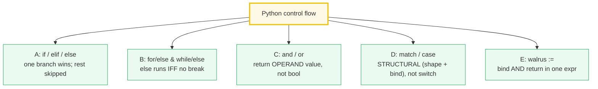
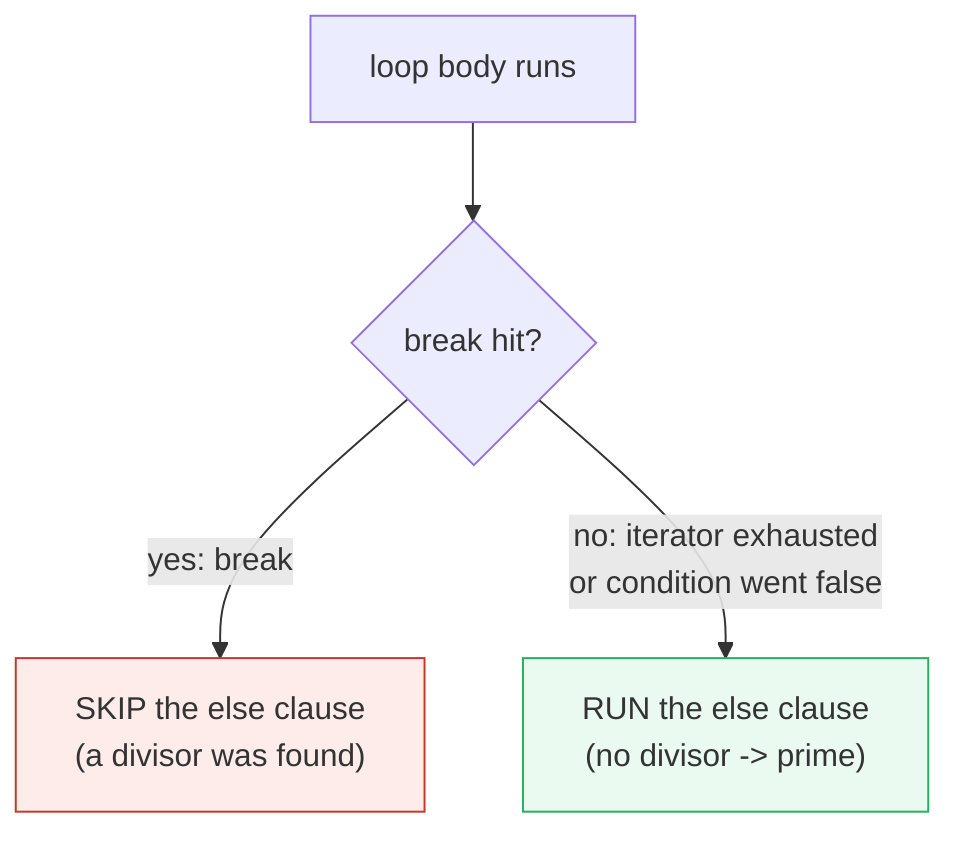
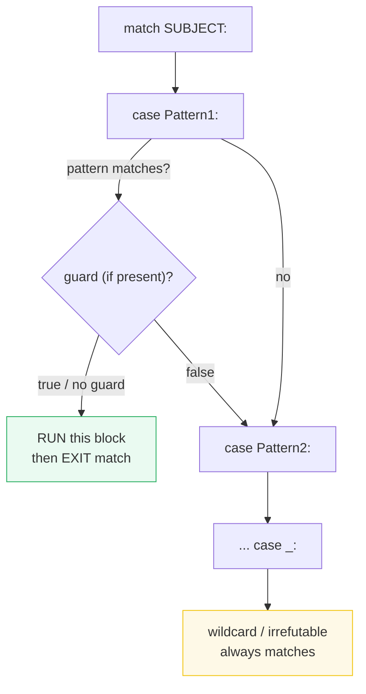

# Control Flow — `if/else`, `for/else`, Short-Circuit Values, `match`, and `:=`

> **The one rule:** Python's control-flow constructs look familiar but carry
> subtle semantics that separate juniors from experts: `for/else` runs the
> `else` **only when the loop didn't `break`**; `and`/`or` return the **operand
> value** (not a bool); `match` does **structural** pattern matching (not a C
> `switch`); and `:=` binds **and** returns in a single expression.

**Companion code:** [`control_flow.py`](./control_flow.py).
**Every number and table below is printed by `uv run python
control_flow.py`** — change the code, re-run, re-paste. Nothing here is
hand-computed. Captured stdout lives in
[`control_flow_output.txt`](./control_flow_output.txt).

**Goal of this bundle (lineage, old → new):**

> from *"I know `if`, `for`, and `while`"*
> → *"I know the subtle control-flow constructs: `for/else`, short-circuit
> value semantics, structural `match`-`case`, and the walrus operator."*

🔗 This is bundle **#7 of Phase 1**. It builds directly on
[`TYPES_AND_TRUTHINESS`](./TYPES_AND_TRUTHINESS.md) (truthiness rules drive
every `if`/`while`/`and`/`or` condition) and on
[`COMPREHENSIONS`](./COMPREHENSIONS.md) (the walrus-in-comprehension idiom in
§5). Class patterns in `match` (`Point(0, y)`) tie forward to
[`CLASSES_BASICS`](./TODO.md) and [`DUNDER_METHODS`](./TODO.md); exceptions
inside loops (`break` vs `raise`) connect to
[`EXCEPTIONS`](./TODO.md) (P1 #8).

---

## 0. The five ideas on one page



| Construct | Since | Key insight that trips up juniors |
|---|---|---|
| `if / elif / else` | always | `elif` is a **chained** check, not `else: if:` — only one branch runs |
| `for/else`, `while/else` | always | `else` means **"no `break`"** (loop exhausted naturally) |
| `x and y`, `x or y` | always | Returns the **operand** (its original type), not `True`/`False` |
| `match / case` | 3.10 (PEP 634) | **Structural**: tests shape **and binds names** — not just equality |
| `name := expr` | 3.8 (PEP 572) | Binds **and** returns; scope is the **enclosing** function |

---

## 1. `if` / `elif` / `else` — exactly one branch runs

The [`if` statement](https://docs.python.org/3/reference/compound_stmts.html#the-if-statement)
"selects exactly one of the suites by evaluating the expressions one by one
until one is found to be true." The first truthy condition wins; every
remaining `elif`/`else` is **skipped without evaluation** (lazy). There is no
`switch` statement in Python — pre-3.10 you used `if/elif` chains; since 3.10,
`match` (§4) is the structural replacement.

> From `control_flow.py` Section A:
> ```
> ======================================================================
> SECTION A — if / elif / else: exactly one branch runs
> ======================================================================
> The if statement selects exactly one suite by evaluating each
> condition top-to-bottom; the first truthy one wins, the rest are
> skipped without evaluation. There is NO 'switch' in Python
> pre-3.10; structural 'match' (Section D) replaces it.
> 
> call            result
> ----------------------------
> classify(-5)    negative
> classify(0)     zero
> classify(42)    positive
> 
> elif chain evaluated: ['A', 'B']  (C skipped — B already won)
> [check] elif short-circuits: only A and B evaluated: OK
> [check] classify(42) == 'positive': OK
> [check] classify(0) == 'zero': OK
> [check] classify(-5) == 'negative': OK
> ```

### Why `elif` is not `else: if:` (internals)

A chain `if A: … elif B: … elif C: …` is a **single** compound statement with
multiple clauses, not a tower of nested `if`s. The grammar is:

```
if_stmt: "if" assignment_expression ":" suite
         ("elif" assignment_expression ":" suite)*
         ["else" ":" suite]
```

Once any clause's test is truthy, its suite runs and the interpreter jumps
**past the entire `if` statement** — no further `elif` expressions are
evaluated. The demo above proves this: `side_effect("C", True)` is never
called because `side_effect("B", True)` already won the branch. (Contrast with
C, where `else if` is literally a nested `if` inside an `else` block — same
observable behavior, different grammar.)

---

## 2. `for/else` & `while/else` — `else` means "no `break`"



The [`for` statement](https://docs.python.org/3/reference/compound_stmts.html#the-for-statement)
and [`while` statement](https://docs.python.org/3/reference/compound_stmts.html#the-while-statement)
both allow an optional `else` clause. The rule, verbatim from the reference:

> "A `break` statement executed in the first suite terminates the loop **without
> executing the `else` clause's suite**."

So `else` on a loop really means **"the loop completed normally (no `break`)"**
— think of it as `else` = "no break", not "otherwise". The canonical use is
prime searching: loop over candidate divisors; if none divide evenly, the loop
exhausts and the `else` runs (the number is prime); if any divisor is found,
`break` skips the `else` (composite).

> From `control_flow.py` Section B:
> ```
> ======================================================================
> SECTION B — for/else & while/else: else runs IFF loop did NOT break
> ======================================================================
> Counterintuitive but precise: the 'else' on a for/while runs when
> the loop completes WITHOUT hitting 'break'. Classic use: prime
> testing — else means 'no divisor found = prime'.
> 
> n    for/else   while/else   note
> ------------------------------------------------------
> 2    True       True         PRIME: else ran (no break)
> 7    True       True         PRIME: else ran (no break)
> 9    False      False        composite: broke on 3
> 15   False      False        composite: broke on 3
> 
> [check] for/else: 7 is prime (else ran, loop exhausted): OK
> [check] for/else: 9 composite (break hit, else skipped): OK
> [check] for/else: 9 broke on divisor 3: OK
> [check] while/else: 7 is prime (else ran): OK
> [check] for/else == while/else for n in [2, 30): OK
> ```

### Why the `else` keyword? (internals)

Guido van Rossum [has explained](https://mail.python.org/pipermail/python-dev/2005-September/057092.html)
the naming: `for/else` shares a pattern with `try/else` — in both, the `else`
runs when the block was **not** exited by an exceptional event (`break` for
loops, `except` for `try`). Think:

| Statement | `else` runs when… |
|---|---|
| `if/else` | the `if` test is false |
| `for/else`, `while/else` | the loop did **not** `break` |
| `try/else` | no exception was raised |

🔗 Exceptions propagating out of a loop body interact with `break` in
non-obvious ways — covered in [`EXCEPTIONS`](./TODO.md) (P1 #8).

---

## 3. `and` / `or` — short-circuit **and** return the operand value

This is the single most misunderstood behavior in everyday Python. The
[reference §6.11](https://docs.python.org/3/reference/expressions.html#booleans)
states it precisely:

> "The expression `x and y` first evaluates *x*; if *x* is false, its value is
> returned; otherwise, *y* is evaluated and the resulting value is returned."

> "The expression `x or y` first evaluates *x*; if *x* is true, its value is
> returned; otherwise, *y* is evaluated and the resulting value is returned."

> "Note that neither `and` nor `or` restrict the value and type they return to
> `False` and `True`, but rather return: **the last evaluated argument**."

So `0 or 'default'` evaluates to the **string** `'default'` (type `str`), not
`True`. And `1 and 2` evaluates to the **int** `2`, not `True`. Both operators
**short-circuit**: the right operand is **never evaluated** when the left
already determines the outcome.

> From `control_flow.py` Section C:
> ```
> ======================================================================
> SECTION C — and / or return the OPERAND value, not a bool
> ======================================================================
> Reference §6.11: 'x and y' returns x if x is false, else y;
> 'x or y' returns x if x is true, else y. The result keeps its
> original value and type — NOT coerced to True/False.
> 
> expression              result        type
> ------------------------------------------------
> 0 or 'default'          default       str
> '' or 0                 0             int
> 'a' or 'b'              a             str
> [1] or []               [1]           list
> 1 and 2                 2             int
> 0 and 2                 0             int
> None and 'x'            None          NoneType
> 'x' and 0 and 3         0             int
> 
> None and f(...) -> None  /  'truthy' or f(...) -> 'truthy'
> side-effect log: []  (neither RIGHT operand was called)
> 
> [check] 0 or 'default' == 'default' (returns right operand): OK
> [check] 1 and 2 == 2 (returns right operand): OK
> [check] None and f(...) returns None (left, falsy): OK
> [check] 'truthy' or f(...) returns 'truthy' (left, truthy): OK
> [check] right operand NOT evaluated when left short-circuits: OK
> cfg.get('host') or 'localhost' -> 'localhost'
> cfg.get('port') or 8080       -> 8080
> [check] '' or 'localhost' picks default: OK
> [check] 0 or 8080 picks default: OK
> ```

### Why this design? (internals)

In CPython's bytecode, `and` and `or` compile to `JUMP_IF_FALSE_OR_POP` and
`JUMP_IF_TRUE_OR_POP` instructions — they **jump** past the right operand if
the left already decides the result, leaving the deciding value on the stack.
The value is never funneled through `bool()`; it's returned as-is. This makes
the `x = value or default` idiom both concise and zero-cost (no extra
allocation). It also means `and`/`or` are **not** commutative for types:
`0 or 'x'` returns `'x'` but `'x' or 0` returns `'x'` — both are "the first
truthy value", read left-to-right.

**The `x = a or default` idiom:** the demo above shows `config.get('host') or
'localhost'` — if the config value is falsy (`""`, `0`, `None`, `[]`), the
default kicks in. This is the most common real-world use of operand-value
semantics. Be careful: it treats `0` and `""` as "missing" — if `0` is a valid
value, use `x if x is not None else default` instead.

---

## 4. `match` / `case` — structural pattern matching (PEP 634, 3.10+)



Added in [Python 3.10](https://docs.python.org/3/whatsnew/3.10.html#pep-634-structural-pattern-matching-structural-pattern-matching)
([PEP 634](https://peps.python.org/pep-0634/) specification,
[PEP 636](https://peps.python.org/pep-0636/) tutorial), `match` is **not** a
C/Java `switch` (which only tests equality of scalars). It does **structural**
matching: a pattern simultaneously **tests the shape** of the subject **and
binds variables** to its sub-parts. Patterns are tried top-to-bottom; the first
whose pattern matches **and** whose guard (if present) is true wins.

| Pattern kind | Syntax example | What it does |
|---|---|---|
| **Literal** | `case 1:` | matches if `subject == 1` (singletons use `is`) |
| **OR** | `case 1 \| 2 \| 3:` | matches if any sub-pattern matches |
| **Capture** | `case x:` | always succeeds; binds `x = subject` |
| **Wildcard** | `case _:` | always succeeds; binds nothing (irrefutable) |
| **Sequence** | `case [a, b]:` | matches a 2-element sequence; binds `a`, `b` |
| **Mapping** | `case {"k": v}:` | matches a mapping with key `"k"`; binds `v` |
| **Class** | `case Point(0, y):` | `isinstance` check + attribute sub-patterns |
| **Guard** | `case P if cond:` | pattern must match **and** `cond` must be true |

> From `control_flow.py` Section D:
> ```
> ======================================================================
> SECTION D — match/case: structural pattern matching (PEP 634, 3.10+)
> ======================================================================
> 'match' is NOT a C switch (equality only). It does STRUCTURAL
> matching: a pattern tests shape AND binds names. Patterns are
> tried top-to-bottom; first match (with true guard, if any) wins.
> 
> subject                             match outcome
> --------------------------------------------------------------------
> 2                                   small int literal: 2
> ['hip', 'hop']                      two-element seq: a=hip, b=hop
> {'type': 'ok', 'data': [1, 2]}      ok-msg with data=[1, 2]
> Point(x=0, y=5)                     Point on y-axis at y=5
> Point(x=3, y=3)                     Point on diagonal: (3,3)
> Point(x=1, y=9)                     Point at (1,9)
> 'literally anything'                something else
> 
> [check] literal OR: describe(2) starts with 'small int': OK
> [check] sequence pattern binds a,b from ['hip','hop']: OK
> [check] mapping pattern binds d from ok-msg: OK
> [check] class pattern Point(0, y) binds y=5: OK
> [check] class + guard: Point(3,3) on diagonal: OK
> [check] wildcard _ matches 'literally anything': OK
> ```

### Why `match` is structural, not a switch (internals)

A C `switch` compiles to a jump table indexed by the integer value — pure
equality, no shape inspection, no binding. Python's `match` is closer to
Haskell/Scala/Rust `match`: each `case` is a **pattern** that can destructure
the subject. The class pattern `case Point(0, y):` does three things at once:

1. **`isinstance(subject, Point)`** — type check.
2. **Positional-to-keyword conversion** via `Point.__match_args__` (the
   dataclass sets this to `("x", "y")`), so `Point(0, y)` becomes
   `Point(x=<literal 0>, y=<capture y>)`.
3. **Attribute sub-matching**: `subject.x == 0` (literal pattern, uses `==`)
   and `subject.y` is bound to the name `y` (capture pattern, always succeeds).

A **guard** (`if x == y`) is evaluated **only after** the pattern matches and
all bindings are made. If the guard is false, the case is **not** selected and
execution falls through to the next `case` — the bindings from the failed case
are **not reliable** (the docs explicitly warn against relying on them).

🔗 Class patterns depend on `__match_args__` and attribute access — covered
fully in [`CLASSES_BASICS`](./TODO.md) and [`DUNDER_METHODS`](./TODO.md).

---

## 5. The walrus `:=` — assignment expression (PEP 572, 3.8+)

An **assignment expression** `(name := expr)` does two things in one: it
evaluates `expr`, binds the result to `name`, **and** returns the value as the
value of the whole parenthesized expression. The
[reference §6.12](https://docs.python.org/3/reference/expressions.html#assignment-expressions)
calls it "an assignment expression … assigns an expression to an identifier,
while also returning the value of the expression." This is different from the
`=` **statement**, which binds a name but has no value (it's not an expression).

The walrus was [added in Python 3.8](https://peps.python.org/pep-0572/)
and was **controversial** — it was the first new operator since `@` (matrix
multiply, 3.5) and it led Guido van Rossum to step down as BDFL after the
community vote. Its payoff: eliminating repetitive computation and enabling
several common idioms that previously required awkward restructuring.

> From `control_flow.py` Section E:
> ```
> ======================================================================
> SECTION E — the walrus := (PEP 572, 3.8+): bind AND return in one expr
> ======================================================================
> An assignment expression (name := expr) evaluates expr, binds it
> to name, AND returns the value as the value of the whole
> expression. The name is scoped to the nearest enclosing function
> scope (NOT a new block scope).
> 
> expression                    result    n after
> --------------------------------------------------
> (n := 10) > 5                 True      10
> 
> [check] (n := 10) > 5 is True: OK
> [check] after `n := 10`, n == 10: OK
> while (line := next(it, '')): collected = ['alpha', 'beta', 'gamma']
> [check] walrus-while collects all 3 lines until '' sentinel: OK
> [(x, doubled) for x in data if (doubled := x*2) > 4]
>   -> [(3, 6), (4, 8), (5, 10), (6, 12)]
> [check] walrus in comprehension filter binds doubled: OK
> 
> after if-block, `leaked` still in scope: 'bound by walrus in if-block'
> [check] walrus target leaks to enclosing function scope: OK
> ```

### Why `:=` binds to the enclosing scope (internals)

The walrus follows the **same scoping rules as `=`**: the target name becomes
a local variable in the **nearest enclosing function scope**, unless there's
an applicable `global` or `nonlocal` declaration. This means:

- `if (x := f()): …` — after the `if` block, `x` is still in scope (blocks
  don't create scopes in Python; only functions, classes, and comprehensions
  do).
- `while (line := next(it, "")): …` — `line` is a function-local, reassigned
  each iteration.
- In a **comprehension**, the walrus binds to the **enclosing function scope**,
  not the comprehension's implicit nested scope. So `(doubled := x * 2)` inside
  a list comprehension's `if` clause leaks `doubled` to the surrounding
  function after the comprehension finishes.

The reference notes one syntactic restriction: "Assignment expressions must be
surrounded by parentheses when used as … comprehension-if expressions and in
`assert`, `with`, and `assignment` statements. In all other places where they
can be used, parentheses are not required, including in `if` and `while`
statements."

🔗 The walrus interacts with comprehension scoping rules covered in
[`COMPREHENSIONS`](./COMPREHENSIONS.md).

---

## Pitfalls

| Trap | Example | The fix |
|---|---|---|
| Thinking `for/else` means "if the loop is false" | expecting `else` to run after `break` | `else` = **"no `break`"** (loop exhausted naturally); rename mentally to `nobreak:` |
| `and`/`or` returning a non-bool | `type(1 and 2)` → `<class 'int'>`, not `bool` | if you need a real bool, wrap with `bool(...)`: `bool(x or y)` |
| `0 or default` swallowing valid `0` | `port = config.get('port') or 8080` → `8080` even if port was `0` | use `port if port is not None else 8080` when `0`/`""` is valid |
| `match` capture shadowing a variable | `case x:` always matches and **rebinds** `x` — it's not an equality test | use `case _: pass` for default; use `case Enum.VALUE:` (dotted = value pattern) to compare to an existing name |
| Guard failing → fall-through surprises | `case Point(x, y) if x == y:` silently falls through if guard is false | remember: pattern match + guard must **both** succeed; order cases most-specific first |
| `_` looks like a variable but binds nothing | `case _:` discards the subject — `_` is a soft keyword, not a capture | don't try to read `_` after the match; it's not assigned by the wildcard |
| `:=` without parens in `if`/`while` condition | `if x := f():` is legal but reads ambiguously | always write `if (x := f()):` for clarity (and it's required in comprehension-`if`) |
| Walrus leaks into enclosing scope | `doubled` in a comprehension's `if` survives after the comprehension | be aware; don't reuse the name expecting it to be scoped to the comprehension |
| Walrus target in class scope | `class C: x := 1` adds `x` to class `__dict__` but not as a class attr you'd expect | avoid `:=` in class bodies; use `=` |
| Using `match` before 3.10 | `SyntaxError` on older interpreters | `match`/`case` are soft keywords since 3.10; guard with `sys.version_info >= (3, 10)` or require 3.10+ |

---

## Cheat sheet

- **`if`/`elif`/`else`:** exactly one branch runs; remaining `elif` tests are
  **not evaluated**. No `switch` — use `if/elif` chains or `match` (3.10+).
- **`for/else`, `while/else`:** `else` runs **IFF the loop did not `break`**.
  Idiom: prime search (else = "no divisor found"). Same for `while/else`.
- **`and`/`or`:** return the **last evaluated operand** (its original type), not
  a bool. `x and y` → `x` if `x` is falsy, else `y`. `x or y` → `x` if `x` is
  truthy, else `y`. Right operand is skipped when left decides.
- **`x = a or default`:** the most common idiom — picks the first truthy value.
  Trap: `0` and `""` are "missing"; use `if x is not None` if `0`/`""` is valid.
- **`match`/`case` (3.10+, PEP 634):** **structural** — tests shape AND binds
  names. Patterns: literal (`1`), OR (`1|2`), capture (`x`), wildcard (`_`),
  sequence (`[a,b]`), mapping (`{"k":v}`), class (`Point(0,y)`). Guards
  (`if cond`) evaluated after pattern + bindings succeed.
- **`:=` walrus (3.8+, PEP 572):** binds AND returns in one expression. Scope =
  nearest enclosing function (not the block/comprehension). Parens required in
  comprehension-`if`, `assert`, `with`, assignment statements. Idioms:
  `while (line := next(it, "")):`, `if (m := pattern.search(s)):`,
  `[y for x in data if (y := f(x)) > threshold]`.

---

## Sources

- **Python docs — The `if` statement (§8.1).**
  https://docs.python.org/3/reference/compound_stmts.html#the-if-statement
  *Grammar: `if` / `elif` / `else` select "exactly one of the suites." Quoted
  in §1 to establish that `elif` short-circuits the remaining tests.*
- **Python docs — The `while` statement (§8.2) and `for` statement (§8.3).**
  https://docs.python.org/3/reference/compound_stmts.html#the-while-statement
  *The `else` clause rule: "A `break` statement executed in the first suite
  terminates the loop without executing the `else` clause's suite." Verbatim
  basis for §2.*
- **Python docs — Boolean operations (§6.11).**
  https://docs.python.org/3/reference/expressions.html#booleans
  *The exact semantics of `and`/`or`: "return the last evaluated argument" —
  not `True`/`False`. The `s or 'foo'` idiom is quoted from this page. Basis
  for §3.*
- **Python docs — Assignment expressions (§6.12).**
  https://docs.python.org/3/reference/expressions.html#assignment-expressions
  *"(name := expr) … assigns an expression to an identifier, while also
  returning the value of the expression." The parens requirement for
  comprehension-`if` is quoted here. Basis for §5.*
- **Python docs — The `match` statement (§8.6) and Patterns (§8.6.4).**
  https://docs.python.org/3/reference/compound_stmts.html#the-match-statement
  *Full grammar and semantics for all pattern kinds (literal, capture,
  wildcard, sequence, mapping, class, OR, AS, guard). The `__match_args__`
  conversion for positional class patterns. Basis for §4.*
- **Python docs — What's New in 3.10: PEP 634 Structural Pattern Matching.**
  https://docs.python.org/3/whatsnew/3.10.html#pep-634-structural-pattern-matching-structural-pattern-matching
  *The high-level announcement; confirms 3.10 as the release that added
  `match`/`case`.*
- **PEP 634 — Structural Pattern Matching: Specification.**
  https://peps.python.org/pep-0634/
  *The formal specification referenced by the language reference.*
- **PEP 636 — Structural Pattern Matching: Tutorial.**
  https://peps.python.org/pep-0636/
  *The official tutorial with worked examples of every pattern kind.*
- **PEP 572 — Assignment Expressions (the walrus operator).**
  https://peps.python.org/pep-0572/
  *The PEP that introduced `:=` in Python 3.8. Scope rules, syntax
  restrictions (where parens are required), and the motivating idioms
  (`while (chunk := f.read())`, `if (m := pat.search())`). Referenced in §5.*
- **Python docs — More Control Flow Tools (Tutorial §4).**
  https://docs.python.org/3/tutorial/controlflow.html
  *The tutorial's treatment of `for/else` ("if the loop finishes without
  executing the break, the else clause executes") and `match`. Independent
  confirmation of §2 and §4 semantics.*
