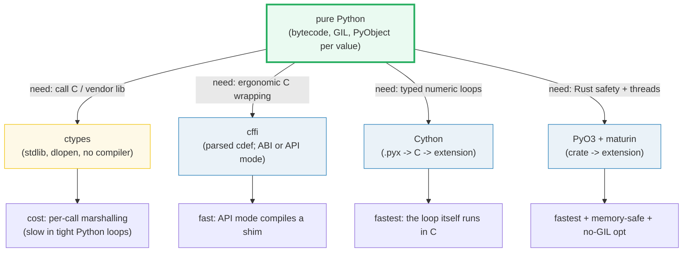
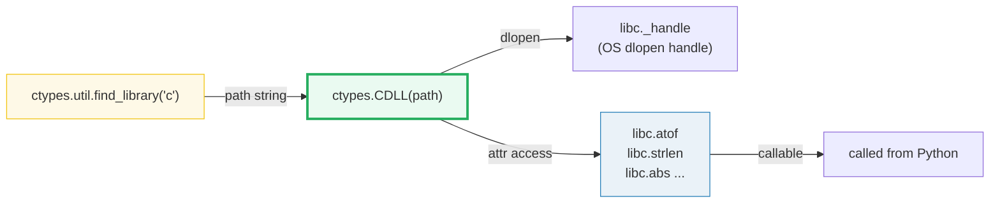

# C Extensions & FFI — `ctypes`, `cffi`, Cython, and PyO3

> **The one rule:** pure Python is the only option — *until it isn't*. When a
> profile proves you have a CPU/interop wall, four rungs let you drop to native
> code: **`ctypes`** (stdlib, no compiler, loads `.so`/`.dylib`/`.dll`),
> **`cffi`** (parsed C declarations, ABI or compiled API mode), **Cython**
> (a typed Python superset compiled to C), and **PyO3** (Rust exposed via
> `maturin`). Each rung trades ergonomics for speed; the cost is always a build
> step and a portability tax.

**Companion code:** [`c_extensions_ffi.py`](./c_extensions_ffi.py).
**Every number and table below is printed by `uv run python
c_extensions_ffi.py`** — change the code, re-run, re-paste. Nothing here is
hand-computed. Captured stdout lives in
[`c_extensions_ffi_output.txt`](./c_extensions_ffi_output.txt).

**Goal of this bundle (lineage, old → new):**

> from *"pure Python is the only option"*
> → *"when I hit a CPU/interop wall, `ctypes`/`cffi`/Cython/PyO3 let me drop to
> > C or Rust; `ctypes` (stdlib) is the gateway, the others trade ergonomics for
> > speed."*

🔗 This is bundle **#26 of Phase 4**. The single most important prerequisite
is **profiling first** — see
[`PROFILING_OPTIMIZATION`](./PROFILING_OPTIMIZATION.md) (P4 #24): you only pay
the build/portability tax below *after* `cProfile`/`timeit` prove a hot loop.
For the memory side of the same coin — `array`/`memoryview` zero-copy over
binary buffers, which often removes the *need* for native code at all — see
[`MEMORY_EFFICIENCY`](./MEMORY_EFFICIENCY.md) (P4 #25). For the GIL constraint
that every ctypes call must hold, see
[`THREADING_GIL`](./THREADING_GIL.md) (P4 #22). See
[`TODO.md`](./TODO.md) for the full plan.

> **Hard rule for this bundle:** the `.py` uses **ONLY the standard library**.
> `ctypes` (in the stdlib) loads the platform C library and calls real C
> functions. `cffi`, Cython, and PyO3 each need a build step or extra
> toolchain, so they are **EXPLAINED conceptually** below (snippets shown, NOT
> executed by the companion script). No edits to `pyproject.toml`.

---

## 0. The four rungs on one page



| Tool | In stdlib? | Build step? | Speed (hot loop) | Best for |
|---|---|---|---|---|
| **`ctypes`** | yes | no | ~1× per op (slower than builtin!) | call a few C fns; wrap a vendor `.so` |
| **`cffi`** | no (`pip`) | API mode needs a C compiler | fast (compiled shim) | ergonomic C wrappers; NumPy-grade |
| **Cython** | no (`pip`) | `.pyx` → C → extension | 10–100× | typed numeric loops, wrap C/C++ |
| **PyO3** | no (cargo) | Rust crate → `maturin` | 10–100× + safe + thread-friendly | safe rewrites; `pydantic-core`, `polars` |

The two facts every expert remembers:

1. **`ctypes` is NOT free speed.** Each call marshals every Python arg into a C
   value and boxes the result back — so a `libc.abs` call in a tight loop is
   *slower* than the builtin `abs`. `ctypes` wins when **one** call does a lot
   of C work (`strlen` on 1 MB, a vendor DSP routine, a system call).
2. **Profile before you climb.** Every rung up the ladder adds a toolchain
   dependency and a packaging burden. The 97% case is solved in pure Python
   (better algorithm + `lru_cache` + `array`/`memoryview`). Drop to native only
   when `cProfile` names a hotspot that pure Python cannot fix.

---

## 1. Load a shared library: `ctypes.CDLL(find_library("c"))`

`ctypes` (stdlib) is the gateway to native code. It `dlopen()`s a shared
library — `.so` on Linux, `.dylib` on macOS, `.dll` on Windows — and binds each
exported C symbol to a callable Python object (a `_FuncPtr`). **No compiler,
no build step**: just `find_library()` to locate the lib, then `CDLL()` to load
it. The result is a normal Python object whose attributes are the C functions.



The loader in the companion script (`_load_libc`) is portable: it tries
`find_library("c")` first (which returns `/usr/lib/libc.dylib` on macOS,
`libc.so.6` on Linux, and `None` on Windows), and falls back to the well-known
soname and finally to `msvcrt.dll` so the bundle runs on every mainstream
platform.

> From `c_extensions_ffi.py` Section A:
> ```
> ======================================================================
> SECTION A — Load a shared library: ctypes.CDLL(find_library('c'))
> ======================================================================
> ctypes (stdlib) is the gateway to native code: it dlopen()s a shared
> library (.so on Linux, .dylib on macOS, .dll on Windows) and binds
> each exported C symbol to a callable Python object. No compiler, no
> build step — just find_library() + CDLL().
> 
> sys.platform = 'darwin'
> ctypes.util.find_library('c') = '/usr/lib/libc.dylib'
> libc = ctypes.CDLL('/usr/lib/libc.dylib')
> libc._handle = 0x310646728 (the dlopen handle)
> libc.atof    = <_FuncPtr object at 0x100dbaf90>
> libc.strlen  = <_FuncPtr object at 0x100dbaed0>
> 
> [check] find_library('c') returns a non-empty path/name: OK
> [check] CDLL loads (libc._handle is set): OK
> [check] libc.atof is a callable _FuncPtr: OK
> ```

> **Per-run note:** `_handle`, the `0x...` addresses of the `_FuncPtr` objects,
> and `addressof(...)` later on are determined by the OS dynamic linker (ASLR,
> load order). They differ every run; only the **structural** facts
> (`_handle != 0`, callable, non-empty name) are pinned by `[check]` lines.

### Why `find_library` instead of a hardcoded path (internals)

Hardcoding `libc.so.6` breaks on macOS (where it's `/usr/lib/libc.dylib`) and
on Windows (no libc at all). `ctypes.util.find_library(name)` runs the
platform's native lookup: `ldconfig` on Linux, `dyld` machinery on macOS, and
the system DLL search path on Windows. The function returns a string the
platform's `CDLL` constructor understands — or `None` if nothing was found,
which is why the loader falls back to explicit sonames. The docs are explicit
that this is the supported way to locate the C library portably.

🔗 The same `dlopen`-style loading is how NumPy finds BLAS, how `cryptography`
finds OpenSSL, and how every Python-SQLite binding finds `libsqlite3`. The
pattern is universal; `ctypes` just exposes it from the stdlib.

---

## 2. Declare `argtypes`/`restype`, then call real C functions

A freshly-loaded `libc.atof` is a `_FuncPtr` with **no type information**. If
you call it without telling `ctypes` the signature, it **assumes** `c_int`
arguments and a `c_int` return — silently truncating a `double` return to an
`int` and corrupting pointer-sized arguments. The docs *require* setting:

- `argtypes` — a list of C types, one per parameter (also a safety check: wrong
  arg count or wrong type now raises `ArgumentError` instead of corrupting
  memory).
- `restype` — the C type of the return value. Set to `None` for `void`.

> From `c_extensions_ffi.py` Section B:
> ```
> ======================================================================
> SECTION B — Declare argtypes/restype, then call real C functions
> ======================================================================
> If you skip argtypes/restype ctypes guesses (often wrong): it assumes
> c_int return and C-int arguments. The docs REQUIRE setting them for
> any function returning non-int (e.g. c_double) or taking pointers.
> 
> call                            result      type
> ----------------------------------------------------------
> libc.atof(b'3.14')              3.14        float
> libc.atof(b'-2.5')              -2.5        float
> libc.strlen(b'hello')           5           int
> libc.strlen(b'')                0           int
> libc.abs(-42)                   42          int
> libc.abs(7)                     7           int
> 
> [check] libc.atof(b'3.14') == 3.14 (exact double): OK
> [check] libc.strlen(b'hello') == 5: OK
> [check] libc.strlen(b'') == 0: OK
> [check] libc.abs(-42) == 42: OK
> [check] libc.atof returns a Python float (c_double marshalled): OK
> [check] libc.abs returns a Python int (c_int marshalled): OK
> ```

### Why `c_char_p` for a C string (internals)

C has no string type — `const char *` is "a pointer to the first byte, read
until the NUL". `ctypes.c_char_p` is the Python-side equivalent: assign it
`bytes` (`b"hello"`) and `ctypes` passes the address of the underlying buffer,
NUL-terminated, to C. Pass a `str` and you get a `TypeError` (C does not
understand Unicode — encode to bytes first). The return marshalling inverts
this: `libc.atof` returns a `double`, so `restype = c_double` makes the result
arrive as a Python `float`; `libc.abs` returns `int`, so `c_int` makes it an
`int`. The `[check]` lines pin the **type** of each return — that's the
proof the marshalling actually did what you declared.

**Expert gotcha:** if you forget `libc.atof.restype = ctypes.c_double`, the
default `c_int` return will *reinterpret the first 4 bytes of the IEEE-754
double as an int* — giving you a plausible-looking but completely wrong number.
This is the single most common ctypes bug. Always set both attributes.

---

## 3. `ctypes.Structure`: a C-shaped record; `byref`/`pointer`/`memset`

A `ctypes.Structure` with a `_fields_` list is **byte-identical to a C struct**:
it occupies exactly `sizeof(fields)` bytes (plus the platform's alignment
padding, which you can override with `_pack_`), each field sits at a documented
`.offset`, and you can hand its address to any C function expecting a pointer.
This is how you call C APIs that take or return structs (a vendor `point_t`,
an `ioctl` argument, a `struct stat`).

> From `c_extensions_ffi.py` Section C:
> ```
> ======================================================================
> SECTION C — ctypes.Structure: a C-shaped record; byref/pointer/memset
> ======================================================================
> A ctypes.Structure with _fields_ is byte-identical to a C struct: it
> occupies sizeof(fields) bytes, fields sit at documented offsets, and
> you can hand its address to any C function that takes a pointer.
> 
> p = CPoint(7, 9)
>   p.x, p.y          = 7, 9
>   ctypes.sizeof(p)  = 8  (== sizeof(int)*2)
>   CPoint.x.offset   = 0  (byte offset of field x)
>   CPoint.y.offset   = 4  (byte offset of field y)
>   ctypes.addressof(p) = 4313290264
> 
> after p.x=100, p.y=-5:  p.x, p.y = 100, -5
> [check] Structure fields read back what was written: OK
> after memset(byref(p), 0, sizeof(p)): p.x, p.y = 0, 0  (C zeroed the struct's bytes in place)
> 
> [check] memset via byref zeroed the struct in place: OK
> [check] sizeof(CPoint) == 8 (two 4-byte c_ints, no padding): OK
> [check] field offsets are 0 and 4 (packed back-to-back): OK
> ```

### Why `byref` and not `pointer` (internals)

`ctypes.byref(obj)` and `ctypes.pointer(obj)` both produce a pointer to the
object's underlying C storage, but `byref` is the **lighter-weight** form: it
returns a throwaway wrapper valid only for the duration of the call, while
`pointer` allocates a real `LP_<T>` object you can keep around. The rule: use
`byref` for an out-parameter you read once, `pointer` when you need to pass the
pointer around in Python. The Section C `memset(byref(p), 0, sizeof(p))` call
proves the struct is real memory — C zeroes the bytes, and Python immediately
sees `p.x == 0, p.y == 0`. That is the round-trip proof that `_fields_`
describes the actual memory layout, not a Python-side fiction.

**Expert gotcha — alignment:** add a `c_char` then a `c_int` to `_fields_` and
`sizeof` jumps by more than 5, because C compilers insert padding so each field
starts at its natural alignment. `ctypes` mirrors the platform ABI exactly —
which is *what you want* for calling real C, but a surprise if you assumed a
packed layout. Set `_pack_ = 1` to force byte-packing when matching a
`#pragma pack(1)` C header.

---

## 4. The cost model: every `ctypes` call marshals across a boundary

```mermaid
graph LR
    Py["Python frame<br/>PyObject args"] -->|"1. box each arg to its C type"| Marshal["ctypes marshal layer"]
    Marshal -->|"2. call the C function"| C["C function in libc"]
    C -->|"3. raw C return value"| Marshal2["ctypes marshal layer"]
    Marshal2 -->|"4. box result back to PyObject"| Py2["Python frame<br/>sees a Python object"]
    style Py fill:#eafaf1,stroke:#27ae60,stroke-width:3px
    style Marshal fill:#fef9e7,stroke:#f1c40f
    style Marshal2 fill:#fef9e7,stroke:#f1c40f
    style C fill:#eaf2f8,stroke:#2980b9,stroke-width:3px
```



`ctypes` is **not** a magic "make my Python faster" switch. Each call pays a
fixed marshalling tax: (1) the GIL is held (ctypes never releases it unless
you explicitly use a `PyDLL`-style release), (2) every Python argument is
converted to its declared C type, (3) the C function runs, (4) the C return is
boxed back into a `PyObject`. For **one** call doing a lot of C work this is
negligible; for a tight Python loop doing trivial work per call, the
marshalling dominates and the **builtin beats libc**.

This single fact is the motivation for the rest of the ladder: `cffi` API mode,
Cython, and PyO3 all *move the loop itself into compiled code*, so the boundary
is crossed once for the whole loop rather than once per iteration.

> From `c_extensions_ffi.py` Section D:
> ```
> ======================================================================
> SECTION D — The cost model: every ctypes call marshals across a boundary
> ======================================================================
> ctypes is NOT magic free speed. Each call: (1) acquires the GIL (it
> is always held), (2) boxes each Python arg into its C type, (3) calls
> the C function, (4) boxes the C result back to a PyObject. For ONE
> call that does a lot of C work (strlen on 1 MB) C wins; for a call in
> a tight Python loop doing trivial work, the marshalling dominates and
> the builtin beats libc. This is why cffi/Cython exist: they amortize
> the boundary by compiling the loop itself into C.
> 
> per-op (tight loop, trivial work):
>   builtin abs(-1) :    12.9 ns  (varies per run)
>   libc.abs(-1)    :   163.2 ns  (varies per run)
>   ctypes/builtin  :    12.7x SLOWER per op (marshalling tax)
> 
> strlen(1 MB buffer), ONE call into the lib:
>   libc.strlen :  15.996 us  (varies per run)
>   len(bytes)  :   0.019 us  (varies per run)
> 
> [check] in a tight loop, ctypes abs is SLOWER than builtin abs: OK
> [check] the per-op marshalling tax is meaningful (ratio > 2x): OK
> [check] strlen(1MB) returns 1_000_000 from libc: OK
> ```

> **Per-run note:** the absolute ns/µs figures vary per machine and load. The
> `[check]` lines pin only the **relative** facts that hold everywhere:
> ctypes-per-op is slower than the builtin (the marshalling tax is real, and
> the ratio is well above 2×). `len(bytes)` on a 1 MB buffer is itself a C
> call internally (it reads the cached length from the `PyBytesObject` header),
> which is why it is so much faster than a real character-by-character
> `strlen` — it never scans the bytes at all.

### Why `ctypes` ever wins (internals)

`ctypes` earns its keep when **one** Python call delivers **many** C operations.
`libc.strlen` on a 1 MB buffer runs a vectorized ASM loop in C — one boundary
crossing, a million bytes scanned. The same is true for vendor DSP routines,
crypto primitives, and any C function that loops internally. The expert rule:
**push the loop below the boundary**, never straddle it. If you find yourself
writing `for x in data: libc.f(x)`, you have already lost — that is exactly the
case Cython and `cffi` API mode were built to fix.

🔗 The same "push work below the boundary" principle is why NumPy's vectorized
`arr.sum()` (one C call over the whole array) is 50× faster than
`sum(arr)` (one Python-level iteration per element). See
[`MEMORY_EFFICIENCY`](./MEMORY_EFFICIENCY.md) for the memory side of that
argument — `array.array` and `memoryview` are often enough that you never need
to leave Python.

---

## 5. `cffi` — parsed C declarations, ABI or API mode

`cffi` ("C foreign function interface") is the next rung. Instead of declaring
each function's `argtypes`/`restype` by hand, you **paste the C declarations**
(`ffi.cdef("double atof(const char *s);")`) and cffi parses them — so the
Python side stays in sync with the C header automatically. cffi has four modes,
the cross-product of **ABI vs API** level and **in-line vs out-of-line**
preparation:

| Mode | Preparation | Speed | Notes |
|---|---|---|---|
| **ABI, in-line** | `ffi.dlopen()` | slowest | no compiler; accesses the binary ABI like ctypes |
| **ABI, out-of-line** | `ffi.set_source()` | slow | precompiles the cdef; still ABI-level calls |
| **API, in-line** | `ffi.verify()` | fast | compiles a shim at import time; C-source level |
| **API, out-of-line** | `ffi.set_source()` + build | fastest | the recommended mode; ships a prebuilt extension |

The **ABI** modes talk directly to the shared library's binary interface (like
ctypes — same per-call cost). The **API** modes compile a dedicated C-extension
shim from your `cdef`, so the call site is a normal C-function-to-C-function
call with no marshalling overhead. The cffi overview doc's explicit
recommendation for production: **"API, out-of-line"** — compile once at install
time, ship a prebuilt wheel.

> From `c_extensions_ffi.py` Section E:
> ```
> ======================================================================
> SECTION E — cffi overview: ABI vs API mode (conceptual; not run here)
> ======================================================================
> cffi is the next rung up. You write plain C declarations; cffi parses
> them and either talks to the lib directly (ABI mode, like ctypes) or
> compiles a dedicated C-extension shim (API mode, faster). The four
> modes (per the cffi overview doc):
> 
> mode                  preparation               speed     notes
> --------------------------------------------------------------------------------------------
> ABI, in-line          ffi.dlopen()              slowest   no compiler; accesses the binary ABI like ctypes
> ABI, out-of-line      ffi.set_source()          slow      precompiles the cdef; still ABI-level calls
> API, in-line          ffi.verify()              fast      compiles a shim at import time; C-source level
> API, out-of-line      ffi.set_source()+build    fastest   the recommended mode; ships a prebuilt extension
> 
> The cffi overview doc's recommendation: prefer 'API, out-of-line' for
> production — it compiles once at install time and gives ctypes-like
> ergonomics with C-like call speed.
> 
> Conceptual snippet (NOT executed — cffi is not a stdlib module):
>     from cffi import FFI
>     ffi = FFI()
>     ffi.cdef("double atof(const char *s);")
>     lib = ffi.dlopen(ctypes.util.find_library("c"))
>     lib.atof(b"3.14")   # -> 3.14  (same call, parsed-from-C types)
> 
> [check] cffi has exactly two levels (ABI, API) crossed with two prep modes: OK
> ```

> **Not executed here:** cffi is not in the stdlib, and its API mode needs a C
> compiler at build time. The snippet above is illustrative — the same
> `atof(b"3.14")` call as in §2, but the types come from a parsed C declaration
> instead of hand-set `argtypes`. cffi is the standard way NumPy, cryptography,
> and many scientific packages talk to native C from Python.

---

## 6. Cython — compile a typed Python superset to C

Cython is both a **language** (a superset of Python: every valid `.py` is a
valid `.pyx`) and a **compiler**. You add C type declarations (`cdef` for
C-only variables/functions, `cpdef` for typed functions callable from both C
and Python). The Cython compiler translates the `.pyx` into a C source file;
your C compiler turns that into a normal Python extension module (`.so` on
Linux/macOS, `.pyd` on Windows). The build needs `setup.py` + `cythonize()` +
a C toolchain.

The payoff: with C types, the recursion `fib(n - 1) + fib(n - 2)` happens in
pure C with unboxed `long`s — no `PyObject`, no per-call marshalling, no GIL
overhead per arithmetic op. The result is typically **10–100× faster** than the
pure-Python version on hot numeric loops.

> From `c_extensions_ffi.py` Section F:
> ```
> ======================================================================
> SECTION F — Cython: compile a typed Python superset to C (conceptual)
> ======================================================================
> Cython is a language + compiler: a superset of Python where you add C
> type declarations (cdef/cpdef). The Cython compiler translates a .pyx
> file into C, then your C compiler turns that into a Python extension
> module (.so/.pyd). The build needs a setup.py + a C toolchain.
> 
> Conceptual fib .pyx (NOT executed here — needs the build step):
> 
>     # fastfib.pyx
>     cdef long _fib(long n):             # cdef: C-only, not seen by Python
>         if n < 2:
>             return n
>         return _fib(n - 1) + _fib(n - 2)
> 
>     cpdef long fib(long n):             # cpdef: callable from Python
>         return _fib(n)
> 
>     # setup.py
>     from setuptools import setup
>     from Cython.Build import cythonize
>     setup(ext_modules=cythonize("fastfib.pyx"))
> 
>     # build & import:
>     $ python setup.py build_ext --inplace
>     >>> import fastfib; fastfib.fib(30)   # runs as compiled C
> 
> Because the recursion happens in C with C longs, fib(30) is ~10-100x
> faster than the pure-Python version — no per-call marshalling.
> 
> [check] the Cython build chain is .pyx -> C source -> extension module: OK
> ```

> **Not executed here:** building the extension requires Cython + a C compiler
> at install time, neither of which is in this bundle's pyproject. The snippet
> shows the *shape* of a Cython module: a `cdef` helper invisible to Python,
> a `cpdef` entrypoint visible from both sides, and the standard `setup.py`
> pattern. Cython is what NumPy, pandas, scikit-learn, and lxml are largely
> written in.

**Expert note:** `cdef long _fib(...)` is **not callable from Python** — it is
a C function living inside the extension module. `cpdef` generates *both* a C
entry point (fast, for intra-module calls) and a Python wrapper (so `fib` is
importable). This dual-entry design is why Cython modules are fast *internally*
while still looking like normal Python modules from the outside.

---

## 7. PyO3 — expose Rust to Python via `maturin`

PyO3 is the inverse direction: instead of Python calling into C, you write a
Rust crate, decorate functions with `#[pyfunction]`, and the `maturin` build
tool produces an importable Python extension module. You get Rust's memory
safety and fearless concurrency — no `unsafe` pointer arithmetic, no manual
`free()`, and (with PyO3's recent `pyo3 = { features = ["gil-refs"] }`
options) optional release of the GIL for true parallel threads.

> From `c_extensions_ffi.py` Section G:
> ```
> ======================================================================
> SECTION G — PyO3: expose Rust to Python via maturin (conceptual)
> ======================================================================
> PyO3 is the inverse direction: write a Rust crate, decorate fns with
> #[pyfunction], and the maturin build tool produces an importable
> Python extension module. You get Rust's memory safety + speed with no
> manual refcounting beyond what PyO3's wrappers already encode.
> 
> Conceptual Rust src/lib.rs (NOT executed here — needs cargo + maturin):
> 
>     use pyo3::prelude::*;
> 
>     #[pyfunction]
>     fn fib(n: u64) -> u64 {                 // plain Rust fn
>         if n < 2 { n }
>         else { fib(n - 1) + fib(n - 2) }
>     }
> 
>     #[pymodule]
>     fn fastfib(m: &Bound<'_, PyModule>) -> PyResult<()> {
>         m.add_function(wrap_pyfunction!(fib, m)?)?;
>         Ok(())
>     }
> 
>     # build & import:
>     $ maturin develop --release
>     >>> import fastfib; fastfib.fib(30)    # Rust, called from Python
> 
> PyO3 + maturin is now the standard path for Rust<->Python; libraries
> like polars, pydantic-core, and cryptography are built this way.
> 
> [check] the PyO3 build chain is Rust crate -> maturin -> extension module: OK
> ```

> **Not executed here:** the snippet needs `cargo` + `maturin`. Note the
> signature `fn fastfib(m: &Bound<'_, PyModule>)` — that is the current PyO3
> API (the older `&PyModule` form is being phased out). PyO3 + maturin is now
> the standard path for Rust↔Python; production users include `polars` (DataFrames),
> `pydantic-core` (validation), `cryptography` (parts), `ruff`/`uv` (the
> tooling), and `tokenizers`.

### Why Rust instead of C/C++ (internals)

Three reasons experts reach for PyO3 over Cython:

1. **Memory safety without GC** — Rust's borrow checker rules out
   use-after-free, double-free, and data races at compile time. C extension
   bugs are a leading cause of mysterious CPython crashes; Rust eliminates the
   entire class.
2. **Fearless concurrency** — Rust code can release the GIL
   (`py.allow_threads(|| ...)`) and run truly parallel worker threads on a
   multi-core machine, which the CPython GIL otherwise forbids. Cython can
   also release the GIL (with `nogil`), but Rust's thread-safety guarantees
   make it far harder to introduce a race.
3. **Modern toolchain** — `cargo` handles cross-compilation, `maturin` builds
   `manylinux`/`musllinux`/`macosx` wheels for PyPI in one command. C/C++
   extension packaging (`setuptools` + `auditwheel`) is comparatively painful.

---

## 8. When to drop out of pure Python: the speed-vs-complexity ladder

```mermaid
graph LR
    P0["pure Python<br/>algorithms + builtins + lru_cache"]
    P0 -->|"profile says hot numeric loop"| P1["array / numpy<br/>(vectorized)"]
    P1 -->|"still need to call C / vendor lib"| P2["ctypes (stdlib)<br/>(no build)"]
    P2 -->|"need speed in the loop itself"| P3["cffi API mode<br/>(compiled shim)"]
    P3 -->|"need typed numeric compilation"| P4["Cython .pyx<br/>(.pyx -> C -> .so)"]
    P4 -->|"need Rust safety + threads"| P5["PyO3 + maturin<br/>(Rust -> .so)"]
    style P0 fill:#eafaf1,stroke:#27ae60,stroke-width:3px
    style P1 fill:#eafaf1,stroke:#27ae60
    style P2 fill:#fef9e7,stroke:#f1c40f
    style P3 fill:#eaf2f8,stroke:#2980b9
    style P4 fill:#eaf2f8,stroke:#2980b9
    style P5 fill:#eaf2f8,stroke:#2980b9
```



Every rung up the ladder adds **build complexity**: a new toolchain, a build
step, harder debugging (no friendly Python tracebacks inside compiled code),
and a cross-platform packaging burden. Pay it only when the profile proves the
win is real.

> From `c_extensions_ffi.py` Section H:
> ```
> ======================================================================
> SECTION H — When to drop out of pure Python: the speed-vs-complexity ladder
> ======================================================================
> Drop to native ONLY after profiling proves a hot loop. Every rung up
> the ladder adds BUILD COMPLEXITY (a compiler toolchain, a build step,
> harder debugging, cross-platform packaging). Pay it only when the
> profile says the win is real.
> 
> rung                speed           build cost                        best for
> ----------------------------------------------------------------------------------------------------
> pure Python         1x (baseline)   none (interpreter only)           the 97% case; algorithms + builtins first
> array/numpy         5-50x           pip install numpy                 vectorized numeric; no per-element Python
> ctypes (stdlib)     ~1x per op*     none (stdlib)                     call a small C fn, or wrap a vendor .so
> cffi API mode       5-50x bulk      C compiler at build time          ergonomic C wrappers; CFFI from cdef
> Cython .pyx         10-100x         Cython + C compiler + setup.py    typed numeric loops, wrapping C/C++
> PyO3 + maturin      10-100x         Rust + cargo + maturin            safe rewrite, parallel threads, no GIL opt.
> 
> * ctypes per-op is SLOWER than the builtin (Section D); it wins only
> when ONE call does a lot of C work (strlen, a vendor DSP call, ...).
> 
> [check] the ladder has six rungs from pure Python to PyO3: OK
> [check] pure Python is rung 0 (always try this first): OK
> ```

### Why "profile first" is non-negotiable (internals)

Knuth's "premature optimization is the root of all evil" applies doubly to
native extensions, because the **debugging cost** is permanent. A wrong
algorithm in pure Python takes 10 minutes to fix; the same bug inside a
compiled Cython module can take a day (no friendly traceback, no `pdb`, a C
core dump instead of a Python exception). So:

1. **Profile first** (🔗 [`PROFILING_OPTIMIZATION`](./PROFILING_OPTIMIZATION.md)).
   `cProfile` + `timeit` find the hot function. Intuition about where time goes
   is usually wrong.
2. **Try algorithm + `lru_cache` first.** An O(n) algorithm in pure Python
   beats an O(n²) algorithm in C every time. The biggest wins are usually
   algorithmic, not implementation-level.
3. **Try `array`/`numpy`/`memoryview` next** (🔗
   [`MEMORY_EFFICIENCY`](./MEMORY_EFFICIENCY.md)). Vectorized numeric often
   removes the *need* for native code at all — `numpy` is already calling
   vectorized C under the hood, one boundary crossing per *operation*, not per
   *element*.
4. **Only then climb the ladder.** Reach for `ctypes` to call a vendor `.so`;
   `cffi` for ergonomic C wrapping; Cython for typed numeric loops; PyO3 for a
   safe rewrite or true parallel threads.

🔗 The GIL is the reason "parallel threads" appears only on the PyO3 rung —
see [`THREADING_GIL`](./THREADING_GIL.md) (P4 #22). Both Cython (`with nogil`)
and PyO3 (`py.allow_threads`) can release it; pure-Python threads cannot.

---

## Pitfalls

| Trap | Example | The fix |
|---|---|---|
| Forgetting `restype` on a non-int return | `libc.atof(b"3.14")` returns garbage (reinterpreted int) without `libc.atof.restype = c_double` | **always** set both `argtypes` and `restype`; the docs require it for non-int returns |
| Passing `str` where C wants `const char*` | `libc.strlen("hello")` raises `TypeError` (ctypes wants bytes) | encode to bytes: `libc.strlen(b"hello")`, or use `c_wchar_p` for wide chars |
| `ctypes` in a tight Python loop | `for x in data: libc.abs(x)` is ~12× slower than `for x in data: abs(x)` | push the loop below the boundary — vectorize with `numpy`, or use `cffi` API / Cython |
| Assuming `ctypes` releases the GIL | long C calls (a vendor DSP routine) block every other Python thread | ctypes holds the GIL by default; release it explicitly with `PyDLL`+`pythonapi` or move the work to a `ProcessPoolExecutor` |
| Hardcoding the libc path | `ctypes.CDLL("libc.so.6")` breaks on macOS (`libc.dylib`) and Windows | use `ctypes.util.find_library("c")`; fall back to known sonames in a loop |
| Structure alignment surprise | `_fields_ = [("f", c_char), ("i", c_int)]` gives `sizeof == 8`, not 5 (padding to 4-byte alignment) | the platform ABI rules; set `_pack_ = 1` to force byte-packing when matching `#pragma pack(1)` |
| Keeping a reference to a `c_char_p` return | `s = libc.strdup(b"x"); ...; libc.free(s)` — but `c_char_p` returns `bytes`, you've lost the pointer to free | declare `restype = ctypes.POINTER(c_char)` so you keep the raw pointer; cast to `bytes` then `libc.free(ptr)` |
| Calling a `stdcall` function with `CDLL` | wrong calling convention on Windows → stack corruption / crash | use `WinDLL` (stdcall) on Windows; `CDLL` is cdecl (POSIX is always cdecl) |
| Shipping a Cython/PyO3 extension without wheel builds | users hit "compile from source" → fails without the C/Rust toolchain | build `manylinux`/`macosx` wheels in CI (`cibuildwheel`/`maturin`); publish to PyPI |
| Premature native rewrite | writing 500 lines of Cython before profiling | profile first (🔗 `PROFILING_OPTIMIZATION`); 97% of cases are solved in pure Python |

---

## Cheat sheet

- **The four rungs:** `ctypes` (stdlib, no compiler) → `cffi` (parsed C decls,
  ABI or compiled API mode) → Cython (`.pyx` typed superset compiled to C) →
  PyO3 (Rust crate exposed via `maturin`). Each rung adds build complexity in
  exchange for speed in hot loops.
- **`ctypes` loading:** `libc = ctypes.CDLL(ctypes.util.find_library("c"))`.
  `find_library` returns the platform path (`/usr/lib/libc.dylib` on macOS,
  `libc.so.6` on Linux); fall back to known sonames for portability.
- **Always declare types:** `fn.argtypes = [c_char_p]; fn.restype = c_double`
  for every function — default is `c_int`, which silently corrupts non-int
  returns. After this, `libc.atof(b"3.14") == 3.14` and
  `libc.strlen(b"hello") == 5`.
- **Strings are `bytes`:** C has no Unicode; `c_char_p` takes `bytes`
  (`b"hello"`). A `str` raises `TypeError`.
- **Structures:** `class P(ctypes.Structure): _fields_ = [("x", c_int), ...]`
  is byte-identical to a C struct. `byref(obj)` is the lightweight pointer
  form (out-params); `pointer(obj)` allocates a real `LP_<T>` you keep.
- **The cost model:** every `ctypes` call crosses the Python↔C boundary (box
  args → call → box result). Per-op, this is ~10× slower than the builtin; per
  *bulk* call (one `strlen` over 1 MB), C wins. Push the loop below the
  boundary.
- **cffi modes:** ABI (binary-level, ctypes-like, no compiler) vs API
  (compiles a C shim, fast). Production recommendation: API, out-of-line —
  compile once at install, ship a prebuilt wheel.
- **Cython:** `.pyx` + `cdef`/`cpdef` → C source → extension module. Build via
  `setup.py` + `cythonize()`. 10–100× on hot numeric loops. `cdef` is C-only;
  `cpdef` is callable from both C and Python.
- **PyO3:** Rust crate + `#[pyfunction]` + `#[pymodule]`, built by `maturin`.
  Memory-safe, can release the GIL with `py.allow_threads`, modern packaging.
  Used by `polars`, `pydantic-core`, `ruff`, `uv`.
- **When to climb:** profile first (🔗 `PROFILING_OPTIMIZATION`). Try
  algorithm + `lru_cache` → `array`/`numpy`/`memoryview` (🔗
  `MEMORY_EFFICIENCY`) → `ctypes` → `cffi` → Cython → PyO3, in that order.
  The 97% case never leaves pure Python.

---

## Sources

- **Python docs — `ctypes`: A foreign function library for Python.**
  https://docs.python.org/3/library/ctypes.html
  *The authoritative reference for `CDLL`, `find_library`, `argtypes`/`restype`,
  `Structure`/`_fields_`, `byref`/`pointer`. Quoted in §1–§3 and the basis for
  the §4 marshalling-cost claim (every call boxes args and result).*
- **Python docs — `ctypes.util.find_library`.**
  https://docs.python.org/3/library/ctypes.util.html
  *Why `find_library("c")` returns `/usr/lib/libc.dylib` on macOS,
  `libc.so.6` on Linux, and `None` on Windows — the basis for the portable
  loader in §1.*
- **Cython docs — Source Files and Compilation.**
  https://cython.readthedocs.io/en/latest/src/userguide/source_files_and_compilation.html
  *The `.pyx` → C → extension-module build chain, `cdef`/`cpdef` declarations,
  and the `setup.py` + `cythonize()` pattern shown in §6.*
- **cffi docs — Overview (ABI vs API, in-line vs out-of-line).**
  https://cffi.readthedocs.io/en/latest/overview.html
  *The four-mode matrix (ABI/API × in-line/out-of-line) and the recommendation
  to prefer "API, out-of-line" for production. Quoted in §5.*
- **PyO3 — Rust bindings for the Python interpreter (main docs).**
  https://pyo3.rs/main/doc/pyo3/
  *The Rust API: `#[pyfunction]`, `#[pymodule]`, `wrap_pyfunction!`, the
  `Bound<'_, PyModule>` signature, and the `maturin` build workflow shown in
  §7.*
- **PyO3/maturin — GitHub.**
  https://github.com/pyo3/maturin
  *The build/packaging tool for PyO3 crates: `maturin develop`,
  `maturin build`, and the manylinux/musllinux/macosx wheel output. Referenced
  in §7 and the pitfalls table.*
- **Python docs — C API (`PyArg_ParseTuple`, etc.).**
  https://docs.python.org/3/c-api/arg.html#c.PyArg_ParseTuple
  *The "other side" of the ladder: the CPython C API that hand-written C
  extensions (and PyO3/Cython under the hood) use to parse Python arguments
  and build return values. Context for why the §4 marshalling cost exists.*
- **Stack Overflow — cffi out-of-line API vs ABI mode.**
  https://stackoverflow.com/questions/60288337/what-is-the-difference-between-cffi-out-of-line-api-and-abi-mode
  *Independent confirmation of the four-mode matrix and the compile-time
  ("out-of-line") vs import-time ("in-line") distinction cited in §5.*
