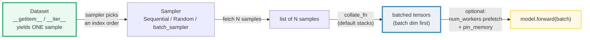
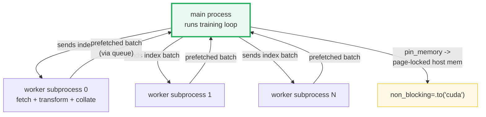

# Data Loading — Dataset, DataLoader, Sampler, and `collate_fn`

> **The one rule:** a model consumes **batches**. A `Dataset` yields **one
> sample**; a `DataLoader` is the pipeline that batches, shuffles, collates,
> and (optionally) parallelizes those samples into the tensors a model's
> `forward()` expects. Get the pipeline straight and training code writes
> itself.

**Companion code:** [`data_loading.py`](./data_loading.py).
**Every number and table below is printed by `uv run python
data_loading.py`** — change the code, re-run, re-paste. Nothing here is
hand-computed. Captured stdout lives in
[`data_loading_output.txt`](./data_loading_output.txt).

**Goal of this bundle (lineage, old → new):**

> from *"I feed data into the model manually, one sample at a time"*
> → *"Dataset + DataLoader is the feeding pipeline: a Dataset yields one
> sample, DataLoader batches/shuffles/parallelizes/collates it into tensors
> ready for the model."*

🔗 This is bundle **#32 of Phase 5**. It leans on three earlier bundles:
[`GENERATORS_ITERATORS`](./GENERATORS_ITERATORS.md) (the `__iter__`/`__next__`
protocol an `IterableDataset` and the loader itself are built on),
[`NN_MODULE`](./NN_MODULE.md) (the `nn.Module` whose `forward()` consumes the
batches this pipeline produces), and forward to
[`MULTIPROCESSING_BASICS`](./MULTIPROCESSING_BASICS.md) (Phase 3 #20 — the
worker subprocess model) and [`TRAINING_LOOP`](./TRAINING_LOOP.md) (Phase 5
#33 — where these batches actually get fed). See [`TODO.md`](./TODO.md) for
the full plan.

---

## 0. The pipeline on one page



| Stage | Object | Responsibility |
|---|---|---|
| Source | `Dataset` (map-style) / `IterableDataset` | yield **one** sample (`__getitem__`) or a **stream** (`__iter__`) |
| Order | `Sampler` | decide **which** indices, in **what order** |
| Grouping | `batch_size` / `batch_sampler` | chunk indices into mini-batches |
| Assembly | `collate_fn` (default `default_collate`) | turn a list of samples into **one batched tensor set** |
| Throughput | `num_workers` / `pin_memory` | overlap I/O with compute; speed CPU→GPU copy |

The `DataLoader` constructor wires all five together:

```python
DataLoader(dataset, batch_size=1, shuffle=None, sampler=None,
           batch_sampler=None, num_workers=0, collate_fn=None,
           pin_memory=False, drop_last=False, ..., generator=None)
```

---

## 1. Map-style Dataset — `__len__` + `__getitem__`

A **map-style** dataset subclasses `torch.utils.data.Dataset` and implements
two methods: `__len__()` (the size) and `__getitem__(idx)` (fetch sample `idx`).
`dataset[idx]` returns a single sample — typically a `(features, label)` tuple.
Random access by integer index is what lets a `Sampler` request any sample in
any order, which is what makes shuffling possible.

> From `data_loading.py` Section A:
> ```
> ======================================================================
> SECTION A — Map-style Dataset: __len__ + __getitem__
> ======================================================================
> A map-style Dataset subclasses torch.utils.data.Dataset and implements
> __len__() and __getitem__(idx). dataset[idx] returns ONE sample
> (here a (feature_vector, label) tuple). The DataLoader will later
> batch many such samples together.
> 
> isinstance(ds, Dataset)             True
> len(ds)                             8
> ds[0]                               (tensor([0., 1., 2.]), tensor(0.))
> type(ds[0]).__name__                tuple
> ds[0][0].tolist() (features)        [0.0, 1.0, 2.0]
> ds[0][1].item() (label)             0.0
> 
> [check] ToyDS is a Dataset subclass: OK
> [check] len(ds) == 8: OK
> [check] ds[0] is a tuple of two tensors: OK
> [check] ds[0][0] has shape (3,) (3 features): OK
> [check] ds[0][1] is a scalar tensor: OK
> ```

### Why two methods (internals)

`Dataset` is an **abstract** class: it has no `__getitem__`/`__len__` of its
own, so you *must* override them. The protocol contract is narrow on purpose —
the loader only ever asks two questions: *"how many?"* (`len`) and *"give me
number `i`?"* (`dataset[i]`). Everything else (reading a JPEG from disk,
tokenizing text, decoding an audio file, applying transforms) lives inside
*your* `__getitem__`. `__len__` is "optional" in the base class but most
`Sampler`s and `len(dataloader)` rely on it, so omitting it cripples the
pipeline. A subclass may also implement `__getitems__(indices)` for batched
fetch (a speedup when you can read many samples in one disk seek).

🔗 The full dunder-protocol view of `__getitem__`/`__len__` is in
[`DUNDER_METHODS`](./DUNDER_METHODS.md).

---

## 2. DataLoader batching + the default `collate_fn`

Hand the `Dataset` to a `DataLoader` with `batch_size=N` and iterate it: each
step yields **N samples collated into one batch**. The default `collate_fn`
(`default_collate`) walks the sample structure and **prepends a new batch
dimension** to every tensor field: a `(3,)` feature vector across 4 samples
becomes a `(4, 3)` tensor; a scalar label `()` becomes a `(4,)` tensor. Tuples
stay tuples (each element stacked independently); dicts stay dicts (each value
stacked); NumPy arrays and Python numbers are auto-converted to tensors.

> From `data_loading.py` Section B:
> ```
> ======================================================================
> SECTION B — DataLoader batching + default collate (stacked tensors)
> ======================================================================
> DataLoader(ds, batch_size=4, shuffle=False) iterates the dataset 4
> samples at a time. The default collate_fn STACKS each field across
> the batch into a new leading dimension: (3,) -> (4,3), () -> (4,).
> 
> type(dl).__name__                       'DataLoader'
> len(dl) (num batches)                   2
> dl.batch_size                           4
> dl.num_workers                          0
> 
> #batches                                2
> batch[0] x shape                        (4, 3)
> batch[0] y shape                        (4,)
> batch[0] x                              [[0.0, 1.0, 2.0], [3.0, 4.0, 5.0], [6.0, 7.0, 8.0], [9.0, 10.0, 11.0]]
> batch[0] y                              [0.0, 1.0, 2.0, 3.0]
> batch[1] x shape                        (4, 3)
> 
> [check] DataLoader is iterable: OK
> [check] len(dl) == 2 (8 samples / batch 4): OK
> [check] batch[0] x shape is (4, 3) (batch dim first): OK
> [check] batch[0] y shape is (4,) (scalar stacked): OK
> [check] batch[0] x == first 4 rows of the dataset: OK
> [check] default collate stacked along a NEW leading dim: OK
> ```

### Why `len(dl)` is the number of *batches*, not samples (internals)

`len(dataloader)` is derived from the **sampler**, not the dataset directly:
roughly `ceil(len(sampler) / batch_size)` (minus the last partial batch when
`drop_last=True`). So 8 samples at `batch_size=4` → `len(dl) == 2`. If the
dataset size isn't divisible by the batch size and `drop_last=False` (the
default), the final batch is **smaller** — a frequent source of shape bugs in
code that assumes every batch has exactly `batch_size` rows.

🔗 The batched tensors produced here are exactly what an `nn.Module`'s
`forward()` consumes — see [`NN_MODULE`](./NN_MODULE.md) Section A.

---

## 3. Custom `collate_fn` — padding variable-length sequences

`default_collate` calls `torch.stack`, which **requires** every sample's tensor
to have the same shape. Variable-length data (sentences, time series, point
clouds) breaks that assumption. The fix is a **custom `collate_fn`**: a plain
callable that receives the `list` of N samples and returns whatever batch
representation you want. The canonical example is **right-padding token
sequences** to the batch's max length with zeros before stacking.

> From `data_loading.py` Section C:
> ```
> ======================================================================
> SECTION C — Custom collate_fn: padding variable-length sequences
> ======================================================================
> When samples have different shapes, default_collate cannot stack
> them (torch.stack needs matching sizes). A custom collate_fn takes
> the list of samples and returns one batch tensor — here we pad each
> sequence to the batch's max length with zeros, then stack.
> 
> raw sample lengths              [1, 2, 3, 2]
> raw sample[2]                   [4, 5, 6]
> 
> type(batch).__name__            Tensor
> batch shape                     (4, 3)
> batch                           [[1, 0, 0], [2, 3, 0], [4, 5, 6], [7, 8, 0]]
> 
> [check] custom collate produced a single tensor: OK
> [check] batch shape is (4, 3) (4 seqs, max len 3): OK
> [check] seq[2] preserved in row 2: OK
> [check] seq[0] padded with zeros to length 3: OK
> ```

### Why a custom `collate_fn` runs **per batch, not per sample** (internals)

With automatic batching enabled (`batch_size` set), the loader fetches N
samples via `__getitem__`, hands the **whole list** to `collate_fn`, and yields
its return value. So padding decisions can look across the batch (true
`max_len`), and heavy post-processing (e.g. building an attention mask from the
padding) happens once per batch rather than per sample. With automatic batching
**disabled** (`batch_size=None`), `collate_fn` is instead called on each
individual sample and defaults to `default_convert` (NumPy→Tensor only) — useful
when the dataset itself already yields pre-batched chunks.

---

## 4. Deterministic shuffle — `generator=` a seeded `Generator`

`shuffle=True` reshuffles the indices at **every epoch** (every time you start
iterating the loader). Unseeded, that order is different every run — useless
for debugging or reproducible experiments. The `generator=` argument pins a
`torch.Generator` as the randomness source that `RandomSampler` draws from, so
**two loaders with the same seed see the identical permutation**. This is the
data-loading half of reproducibility (the other half is `torch.manual_seed` for
weight init).

> From `data_loading.py` Section D:
> ```
> ======================================================================
> SECTION D — Deterministic shuffle: generator=seeded Generator
> ======================================================================
> shuffle=True reshuffles at EVERY epoch. To make the order
> REPRODUCIBLE, pass generator=torch.Generator().manual_seed(seed):
> RandomSampler draws indices from THAT generator, so two loaders
> with the same seed see the identical permutation.
> 
> order with seed=0 (run 1)         [5, 3, 1, 7, 2, 6, 4, 0]
> order with seed=0 (run 2)         [5, 3, 1, 7, 2, 6, 4, 0]
> orders identical?                 True
> order with seed=1 (differs)       [4, 0, 3, 6, 7, 1, 5, 2]
> seed=0 vs seed=1 identical?       False
> 
> [check] same seed -> identical shuffle order: OK
> [check] different seed -> different order: OK
> [check] shuffle still covers every index once: OK
> ```

### Why a dedicated `Generator` (internals)

A `torch.Generator` is an **independent, forkable** RNG state. Passing it to
the loader means the shuffle's randomness is **isolated** from the global RNG
(`torch.manual_seed`) that drives weight initialization and dropout — drawing
indices doesn't advance the global stream, so model-side randomness stays
identical whether you shuffle or not. The same `generator` also seeds the
worker `base_seed` when `num_workers > 0` (see §7), threading reproducibility
through the subprocess boundary.

---

## 5. Sampler — `SequentialSampler` vs `RandomSampler` vs `batch_sampler`

A `Sampler` is an iterable that yields **the index order** the loader fetches
samples in. `shuffle=False` auto-constructs a `SequentialSampler` (0, 1, 2, …);
`shuffle=True` auto-constructs a `RandomSampler` (a permutation). You can also
pass a `Sampler` explicitly for custom orderings, or a `batch_sampler` that
yields **lists of indices per batch** (full control over batch composition,
e.g. grouping same-length sequences together). `batch_sampler` is mutually
exclusive with `batch_size`, `shuffle`, `sampler`, and `drop_last`.

> From `data_loading.py` Section E:
> ```
> ======================================================================
> SECTION E — Sampler: SequentialSampler vs RandomSampler
> ======================================================================
> A Sampler yields the index ORDER the loader fetches samples in.
> shuffle=False -> SequentialSampler (0,1,2,...); shuffle=True ->
> RandomSampler. You can also pass a Sampler explicitly, or a
> batch_sampler that yields LISTS of indices per batch.
> 
> list(SequentialSampler(ds))             [0, 1, 2, 3, 4, 5, 6, 7]
> list(RandomSampler(ds, seed=0))         [4, 0, 7, 3, 2, 5, 1, 6]
> 
> batch_sampler index lists               [[0, 1, 2], [3, 4, 5], [6, 7]]
> 
> [check] SequentialSampler yields 0..7 in order: OK
> [check] RandomSampler is a permutation of all indices: OK
> [check] batch_sampler chunks indices by batch_size: OK
> ```

### Why the sampler is a separate object (internals)

Decoupling "which indices, what order" from "how to fetch one" is what makes
the pipeline composable. The loader loop is essentially:

```python
for indices in batch_sampler:               # Sampler decides order+grouping
    yield collate_fn([dataset[i] for i in indices])  # Dataset + collate do the rest
```

So you can swap in a `WeightedRandomSampler` (for class-imbalanced data), a
length-bucketing `batch_sampler` (to minimize padding in NLP), or a
`DistributedSampler` (multi-GPU sharding) — without touching the `Dataset` or
`collate_fn`. `shuffle` and `sampler` are **mutually exclusive**: passing both
raises a `ValueError`, because `shuffle` is just sugar for "auto-pick one of
the two built-in samplers."

---

## 6. `IterableDataset` — `__iter__` for streams

When data has **no random access** (a DB cursor, a socket, a generator reading
logs in real time, or a petabyte shard store where random reads are
prohibitively slow), implement `IterableDataset` instead: it defines `__iter__`
and yields samples from a stream. There is no `__len__` and no integer index,
so **shuffling and custom samplers are not supported** — order is whatever
`__iter__` produces. This is the data-loading analog of a generator function.

> From `data_loading.py` Section F:
> ```
> ======================================================================
> SECTION F — IterableDataset: __iter__ for streams (no __len__/__getitem__)
> ======================================================================
> An IterableDataset implements __iter__ instead of __getitem__/
> __len__. It yields samples one at a time from a stream. There is no
> random access (no idx), so shuffling/sampling are NOT supported —
> order is whatever __iter__ produces.
> 
> isinstance(ds, IterableDataset)       True
> hasattr(ds, "__getitem__")            True
> hasattr(ds, "__len__")                False
> 
> batches from DataLoader(batch_size=2) [[[0.0], [1.0]], [[2.0], [3.0]], [[4.0]]]
> 
> [check] StreamingDS is an IterableDataset: OK
> [check] IterableDataset has no __len__: OK
> [check] DataLoader batches the stream into pairs: OK
> ```

> **Note on the `hasattr(ds, "__getitem__") → True` line above:**
> `IterableDataset` *inherits* from `Dataset`, which ships a stub
> `__getitem__` that raises `NotImplementedError`. So the attribute *exists*
> but is non-functional — the real protocol signal is `__iter__`, and
> `__len__` is genuinely absent. Relying on `hasattr(..., "__getitem__")` to
> distinguish map-style from iterable-style would be a bug; check
> `isinstance(ds, IterableDataset)` instead.

### Why streams can't be shuffled (internals)

Shuffling requires drawing index `j` before index `i`, which needs random
access — impossible over a forward-only stream. The standard workaround for
stream training is **buffer shuffling**: read a window of N samples into a
buffer, sample from it, refill from the stream. That gives approximate
shuffling in O(N) memory; true uniform shuffling over an unknown-length stream
is mathematically impossible. With `num_workers > 0`, each worker gets a
**replica** of the same `IterableDataset`, so you must shard inside `__iter__`
via `get_worker_info()` or you'll emit **duplicate** samples (the docs spell
this out — see Sources).

🔗 `__iter__`/`__next__` and the "iterator is a single-use stream" model are
the subject of [`GENERATORS_ITERATORS`](./GENERATORS_ITERATORS.md).

---

## 7. `num_workers` and `pin_memory` — the throughput knobs

`num_workers=0` (the default) fetches samples **in the main process**, which
blocks the training step on data loading. Setting `num_workers=N` (a positive
int) spawns **N worker subprocesses** that prefetch batches in parallel,
overlapping I/O (disk reads, decoding, transforms) with GPU compute. This
bundle keeps `num_workers=0` so the captured output is byte-reproducible —
multiprocessing introduces timing-dependent interleaving. `pin_memory=True`
copies the batch tensors into **page-locked (pinned) host memory**, which
makes the CPU→GPU `cudaMemcpyAsync` faster; it is a no-op on a CPU-only
machine (the tensor is never actually pinned, as the run shows).



> From `data_loading.py` Section G:
> ```
> ======================================================================
> SECTION G — num_workers + pin_memory (num_workers=0 kept for determinism)
> ======================================================================
> num_workers>0 spawns N worker SUBPROCESSES that fetch samples in
> parallel, overlapping I/O with compute. On macOS/Windows workers use
> the 'spawn' start method -> the Dataset + collate_fn are PICKLED to
> each child (they must be top-level, importable, not lambdas). We
> keep num_workers=0 here so output is byte-reproducible.
> 
> get_worker_info() in main process       None
> dl.num_workers                          0
> 
> dl with pin_memory=True                 (set)
> xb.is_pinned() (no-op on CPU)           False
> str(xb.device)                          cpu
> 
> [check] get_worker_info() is None in the main process: OK
> [check] num_workers=0 means single-process loading: OK
> [check] pin_memory is a no-op on CPU (tensor not pinned): OK
> ```

### Why workers are subprocesses, not threads (internals)

Python's **GIL** serializes CPU-bound Python code across threads, so threading
would give no real parallelism for the (Python-heavy) work of decoding JPEGs,
tokenizing, or running `__getitem__`. PyTorch therefore uses
`multiprocessing`: each worker is a **separate OS process** with its own GIL,
fetching and collating batches independently and shipping them back to the main
process through a queue. On Unix the default start method is `fork()` (Python
<3.14) or `forkserver()` (≥3.14), which can often share the dataset via the
cloned address space. On **macOS and Windows the default is `spawn()`**: a
fresh interpreter launches, imports your script, and the `Dataset`,
`collate_fn`, and `worker_init_fn` are **pickled** across to the child. The
practical consequences — the source of countless "DataLoader worker exited"
crashes — are:

1. Your `Dataset`, `collate_fn`, and `worker_init_fn` must be **top-level,
   importable callables** — not lambdas, not closures, not locally-defined
   classes.
2. Wrap the script's entry point in `if __name__ == "__main__":` so worker
   re-imports don't re-run training setup.
3. Each worker's PyTorch seed is `base_seed + worker_id` (where `base_seed`
   comes from the main RNG or your `generator`); **other libraries** (NumPy,
   Python `random`) are *not* auto-seeded per worker — seed them inside
   `worker_init_fn` or every worker returns identical "random" augmentations.
4. Workers hold a **copy** of the dataset; large in-memory attributes inflate
   memory by `num_workers ×`.

`get_worker_info()` returns `None` in the main process and a `WorkerInfo`
(`id`, `num_workers`, `seed`, `dataset`) inside a worker — the standard hook
for sharding an `IterableDataset` or seeding augmentations per worker.

🔗 The fork-vs-spawn-vs-forkserver model, pickling, and shared-memory semantics
are the entire subject of [`MULTIPROCESSING_BASICS`](./MULTIPROCESSING_BASICS.md)
(Phase 3 #20).

---

## 8. Transforms — a callable inside `__getitem__`

A **transform** is any callable applied to a sample. The idiomatic place to
apply it is **inside `__getitem__`**, so it runs per-sample (and, for free, in
a worker process when `num_workers > 0`). The example normalizes each feature
vector by the dataset's mean and std; `torchvision.transforms.Compose` chains
several transforms (resize → crop → flip → ToTensor → normalize) using the
exact same principle — each step is a callable.

> From `data_loading.py` Section H:
> ```
> ======================================================================
> SECTION H — A transform callable applied inside __getitem__
> ======================================================================
> A transform is any callable applied to a sample. Applying it inside
> __getitem__ means it runs per-sample (and, with num_workers>0, in a
> worker process — for free). torchvision.transforms.Compose chains
> several; the principle is identical.
> 
> raw x                               [0.0, 1.0, 2.0, 3.0, 4.0, 5.0]
> mean                                2.500000
> std                                 1.870829
> 
> ds[0] (normalized)                  [-1.3363062143325806]
> ds[1] (normalized)                  [-0.8017836809158325]
> 
> batch shape                         (3, 1)
> batch                               [[-1.3363062143325806], [-0.8017836809158325], [-0.26726123690605164]]
> 
> [check] ds[0] == (raw[0] - mean) / std: OK
> [check] whole normalized dataset has mean ~0: OK
> [check] transform preserved shape: batch (3,1): OK
> ```

### Why transforms live in `__getitem__` (internals)

Putting the transform in `__getitem__` means the DataLoader's collate step
receives **already-transformed samples**, so `torch.stack` just batches them —
no special collate logic needed, and the transform's cost is paid lazily (only
for samples actually drawn) and in parallel (across workers). The alternative —
transforming the whole dataset eagerly in `__init__` — wastes memory and
forbids per-epoch randomness like random crops or flips. For **random**
augmentation you must additionally respect the worker-seeding caveat from §7:
without `worker_init_fn`, every worker applies the *same* "random" transform.

---

## Pitfalls

| Trap | Example | The fix |
|---|---|---|
| Last partial batch breaks shape assumptions | `batch_size=4` over 6 samples → final batch has 2 rows | set `drop_last=True`, or write model code that tolerates a variable batch dim |
| Assuming every batch has `batch_size` rows | index math `out = layer(x[:, 0])` on a short final batch | use `.shape[0]` / tensor ops; don't hard-code the count |
| Variable-length data + default collate | `default_collate` on ragged tensors → `RuntimeError` (stack needs equal sizes) | write a custom `collate_fn` that pads to the batch max length |
| `shuffle=True` is non-reproducible | two runs see different orders → can't reproduce a bug | pass `generator=torch.Generator().manual_seed(seed)` |
| Passing both `shuffle=True` and `sampler=` | `ValueError: sampler option is mutually exclusive with shuffle` | pick one: let `shuffle` auto-pick, OR pass an explicit `sampler` with `shuffle=None` |
| `num_workers>0` on macOS/Windows crashes on pickling | lambda `collate_fn` or local `Dataset` class → `PicklingError` | make `Dataset`/`collate_fn`/`worker_init_fn` top-level, importable; guard `__main__` |
| Workers emit identical "random" augmentations | NumPy/`random` not seeded per worker → every worker augments identically | seed them in `worker_init_fn` from `get_worker_info().seed` |
| `IterableDataset` + `num_workers>0` returns duplicates | each worker gets a full replica and re-yields the stream | shard inside `__iter__` via `get_worker_info().id` / `num_workers` |
| `pin_memory=True` "does nothing" | on a CPU-only machine the tensor is never pinned (`is_pinned()` → False) | it only matters with a CUDA GPU; harmless on CPU |
| Detecting iterable-style via `hasattr(__getitem__)` | `IterableDataset` inherits a stub `__getitem__` → `True` | check `isinstance(ds, IterableDataset)` instead |
| Iterating a `DataLoader` twice and expecting the same order | with `shuffle=True` each epoch reshuffles | re-seed the `generator`, or iterate a fresh loader with the same seed |

---

## Cheat sheet

- **Map-style Dataset:** subclass `Dataset`, implement `__len__()` + `__getitem__(idx)`. `dataset[idx]` → one sample. This is what enables shuffling.
- **IterableDataset:** subclass `IterableDataset`, implement `__iter__()`. No `__len__`, no index, no shuffle — for streams.
- **DataLoader:** `DataLoader(dataset, batch_size, shuffle, sampler, num_workers, collate_fn, pin_memory, drop_last, generator)`. Iterating it yields **batches**.
- **Default collate:** `default_collate` prepends a **batch dimension** and stacks each field: `(3,)→(4,3)`, `()→(4,)`; recurses into tuples/dicts/namedtuples; converts NumPy/Python numbers to tensors.
- **Custom `collate_fn`:** a callable `(list[sample]) -> batch`. Use it to pad variable-length sequences or build attention masks.
- **Sampler:** yields the index order. `shuffle=False`→`SequentialSampler`, `shuffle=True`→`RandomSampler`. Pass a custom `sampler=` or `batch_sampler=` for full control; both are mutually exclusive with `shuffle`.
- **Deterministic shuffle:** `generator=torch.Generator().manual_seed(seed)` → reproducible permutation, isolated from the global RNG.
- **`num_workers>0`:** N worker **subprocesses** prefetch in parallel. On macOS/Windows they `spawn`+pickle the dataset/collate — keep them top-level, guard `__main__`, seed per-worker RNGs in `worker_init_fn`.
- **`pin_memory=True`:** page-locks batch tensors for faster CPU→GPU copy; a no-op on CPU-only machines.
- **Transform:** any callable applied in `__getitem__`; runs per-sample and (for free) in workers. `Compose` chains them.
- **`get_worker_info()`:** `None` in main process; a `WorkerInfo` (`id`, `num_workers`, `seed`, `dataset`) inside a worker — the hook for sharding/seeding.

---

## Sources

- **PyTorch docs — `torch.utils.data` (DataLoader, Dataset, IterableDataset, Sampler).**
  https://pytorch.org/docs/stable/data.html
  *The authoritative reference for this entire bundle: the `DataLoader`
  constructor signature and every argument (§0); map-style vs iterable-style
  datasets (§1, §6); automatic batching and the equivalent loop
  (`for indices in batch_sampler: yield collate_fn([dataset[i] for i in
  indices])`, §2/§3/§5); single- vs multi-process loading and the worker
  replica model (§7); memory pinning (§7). Quoted/paraphrased throughout.*
- **PyTorch docs — `torch.utils.data.Dataset`.**
  https://pytorch.org/docs/stable/data.html#torch.utils.data.Dataset
  *"All datasets that represent a map from keys to data samples should subclass
  it… should overwrite `__getitem__()`… could also optionally overwrite
  `__len__()`… could also optionally implement `__getitems__()`." Basis for §1.*
- **PyTorch docs — `torch.utils.data.IterableDataset`.**
  https://pytorch.org/docs/stable/data.html#torch.utils.data.IterableDataset
  *"All subclasses should overwrite `__iter__()`." The sharding examples
  (`get_worker_info()` splitting workload across workers) underpin the §6
  multi-process caveat.*
- **PyTorch docs — `torch.utils.data.default_collate`.**
  https://pytorch.org/docs/stable/data.html#torch.utils.data.default_collate
  *The exact input→output type mapping (Tensor→Tensor with new batch dim,
  NumPy→Tensor, Mapping→Mapping of batched values, Sequence→Sequence of
  batched values). Basis for §2 and §3.*
- **PyTorch docs — `torch.utils.data.Sampler`.**
  https://pytorch.org/docs/stable/data.html#torch.utils.data.Sampler
  *Sampler base class (`__iter__` + optional `__len__`); `SequentialSampler`,
  `RandomSampler`, `BatchSampler`. Basis for §5.*
- **PyTorch docs — Single- and Multi-process Data Loading (platform-specific behaviors).**
  https://pytorch.org/docs/stable/data.html#single-and-multi-process-data-loading
  *"On Windows and MacOS, `spawn()` is the default… the dataset, `collate_fn`
  and other arguments [are received] through pickle serialization." The
  worker-seed rule (`base_seed + worker_id`) and the per-worker library-seeding
  warning. Quoted in §7.*
- **PyTorch docs — Memory Pinning.**
  https://pytorch.org/docs/stable/data.html#memory-pinning
  *"Host to GPU copies are much faster when they originate from pinned
  (page-locked) memory… passing `pin_memory=True`… enables faster data transfer
  to CUDA-enabled GPUs." Basis for §7.*
- **PyTorch docs — Reproducibility / Randomness in multi-process data loading.**
  https://pytorch.org/docs/stable/notes/randomness.html
  https://pytorch.org/docs/stable/notes/faq.html#dataloader-workers-random-seed
  *Why `torch.manual_seed` alone is not enough across workers; the
  `worker_init_fn` seeding pattern. Referenced in §4 and §7.*
- **PyTorch docs — Best Practices for CUDA/Multiprocessing.**
  https://pytorch.org/docs/stable/notes/multiprocessing.html#multiprocessing-best-practices
  *"generally not recommended to return CUDA tensors in multi-process loading…
  we recommend using automatic memory pinning." Supports the §7 guidance.*
