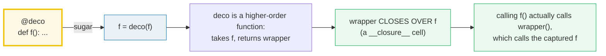
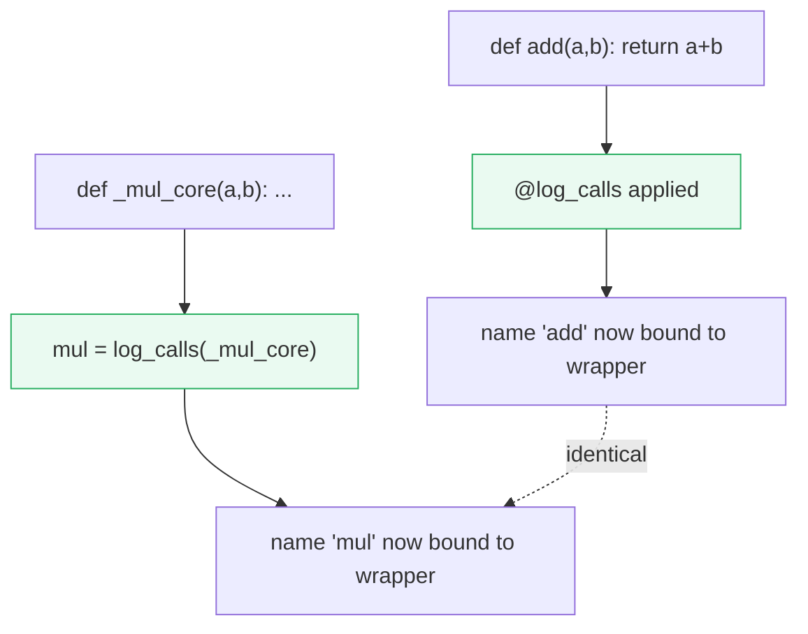
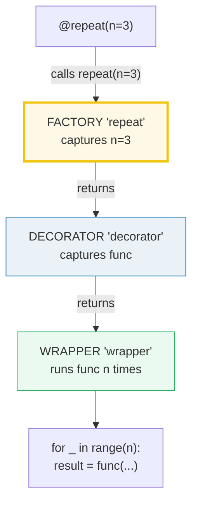
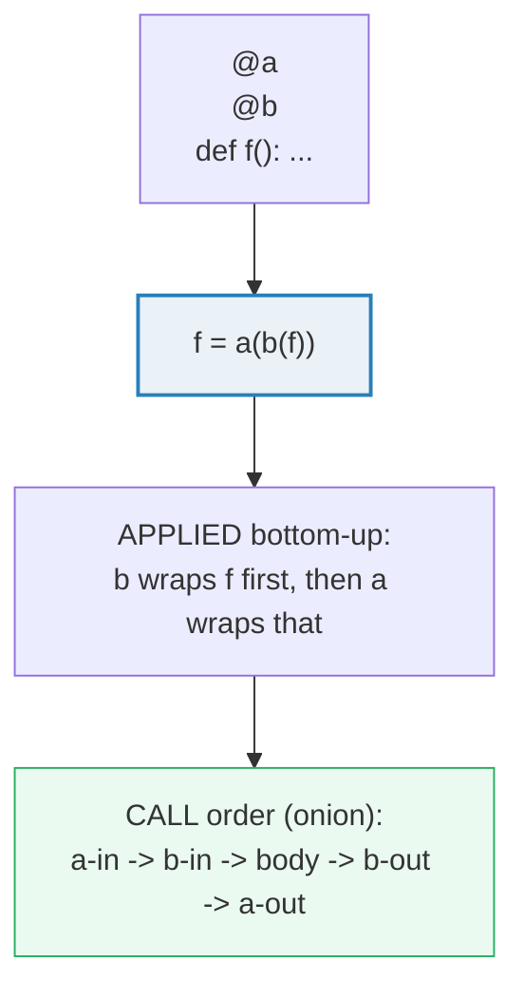

# Decorators Deep — `@deco` is Sugar, Closures are the Engine, `lru_cache` is the Payoff

> **The one rule:** a decorator is just a **higher-order function** — it takes a
> function and returns a function. The `@` symbol is *pure sugar* for
> `name = decorator(name)`. The only reason the returned wrapper can still call
> the original later is the **closure** mechanic from
> [`FUNCTIONS_ARGS_SCOPE`](./FUNCTIONS_ARGS_SCOPE.md): the inner function captures
> `func` in a `__closure__` cell and keeps it alive. Get closures + the desugar
> rule straight and every decorator — `functools.wraps`, parametrized decorators,
> class decorators, `lru_cache` — stops being magic.

**Companion code:** [`decorators_deep.py`](./decorators_deep.py).
**Every number and table below is printed by `uv run python
decorators_deep.py`** — change the code, re-run, re-paste. Nothing here is
hand-computed. Captured stdout lives in
[`decorators_deep_output.txt`](./decorators_deep_output.txt).

**Goal of this bundle (lineage, old → new):**

> from *"`@decorator` is a label I sprinkle on a function"*
> → *"a decorator is a higher-order function; `@deco` is sugar for
> `f = deco(f)`; I can write function decorators, parametrized decorators, and
> class decorators — and I know the closure traps (late binding, the `@wraps`
> metadata theft, the unhashable-args `lru_cache` failure)."*

🔗 This is bundle **#14 of Phase 2**. It builds **directly** on the closure
mechanic in [`FUNCTIONS_ARGS_SCOPE`](./FUNCTIONS_ARGS_SCOPE.md) (P1 #6 — §F there
introduces `__closure__` cells and even previews the late-binding trap we re-prove
in §7 here). Forward links: **class decorators** (§5) generalize the class-creation
model of [`CLASSES_BASICS`](./CLASSES_BASICS.md) (P2 #9); and **`contextlib`** —
the backbone of [`CONTEXT_MANAGERS`](./CONTEXT_MANAGERS.md) (P3) — is itself built
entirely from decorators (`@contextmanager` returns a wrapper that implements the
`with` protocol). See [`TODO.md`](./TODO.md) for the full plan.

---

## 0. The one diagram and the one identity



The whole topic collapses to one identity, stated verbatim in the
[language reference §8.7](https://docs.python.org/3/reference/compound_stmts.html#function):

> @f1(arg)
> @f2
> def func(): pass
>
> is roughly equivalent to
>
> def func(): pass
> func = f1(arg)(f2(func))
>
> except that the original function is not temporarily bound to the name func.

That is the entire grammar rule. Everything else — `wraps`, `repeat(n=3)`, class
decorators, `lru_cache` — is *consequence*.

| Form | Desugar | How many callables involved |
|---|---|---|
| `@deco` / `def f` | `f = deco(f)` | 1: `deco` receives `f` |
| `@deco()` / `def f` | `f = deco()(f)` | 2: `deco()` returns the *real* decorator |
| `@deco(arg)` / `def f` | `f = deco(arg)(f)` | 2: `deco(arg)` returns the decorator |
| `@deco` / `class C` | `C = deco(C)` | 1 (but `C` is a **class** object) |

---

## 1. Desugaring — `@deco` is sugar for `f = deco(f)`

A decorator is an ordinary function: it accepts a callable and returns a callable
(usually a freshly-defined `wrapper` that wraps the original). The `@` syntax
does nothing you couldn't do by hand — it just *rebinds the name* through the
decorator right after the `def` runs. Below, `add` (decorated with `@log_calls`)
and `mul` (manually wrapped as `mul = log_calls(_mul_core)`) are the **same
construction**, and both still return the original result.



> From `decorators_deep.py` Section A:
> ```
> ======================================================================
> SECTION A — Desugaring: @deco is sugar for f = deco(f)
> ======================================================================
> A decorator is a HIGHER-ORDER function: it takes a function and
> returns a (usually wrapped) function. The '@' syntax is PURE sugar.
> These two are identical:
>     @log_calls                  def _mul(a, b): ...
>     def add(a, b): ...          mul = log_calls(_mul)
> (PEP 318; language reference 8.7: 'the result must be a callable
> invoked with the function object as the only argument; the returned
> value is bound to the function name'.)
> 
> calling add(2, 3):
>     log: add(*(2, 3), **{}) -> 5
> calling mul(2, 4):
>     log: _mul_core(*(2, 4), **{}) -> 8
> 
> expression                  result
> --------------------------------------------
> add(2, 3)                   5
> mul(2, 4)                   8
> 
> [check] @log_calls add(2,3) returns the original result 5: OK
> [check] manual desugar mul=log_calls(_mul_core) returns 8: OK
> [check] both forms produce the SAME kind of wrapper object: OK
> ```

### Why the desugar matters (internals)

`@deco` is not a "marker" the interpreter remembers — it is a **compile-time
rewrite**. When CPython compiles `@log_calls` followed by `def add`, it emits
bytecode equivalent to: build the function object, push it, call `log_calls` on
it, and bind the *result* to `add`. There is no separate "decorated" flag on the
function object; after the statement, `add` simply *is* whatever `log_calls`
returned. That is why `add.__name__` is `'wrapper'` unless you copy the metadata
(see §2) — the original `add` function is now only reachable through the
wrapper's closure. PEP 318 (which introduced the syntax in Python 2.4) was
explicitly motivated by the desire to replace the verbose
`func = classmethod(func)` idiom with a readable prefix.

---

## 2. Closures are the engine — and `functools.wraps` fixes the metadata theft

A decorator's `wrapper` is an *inner* function defined inside the decorator.
Because it references the decorator's parameter `func`, `func` becomes a **free
variable** of `wrapper`: it lives in a `__closure__` cell that stays alive even
after the decorator has returned. That cell is the *only* link from the wrapper
back to the original function — which is exactly the closure model from
🔗 [`FUNCTIONS_ARGS_SCOPE`](./FUNCTIONS_ARGS_SCOPE.md) §F.

The catch: by rebinding the name to `wrapper`, you **steal the original's
identity**. `wrapper.__name__` is `'wrapper'`, not `'original'`; the docstring,
`__qualname__`, and annotations are lost too. `functools.wraps` copies them back
(via `WRAPPER_ASSIGNMENTS`) and also sets `__wrapped__` to point at the original.

> From `decorators_deep.py` Section B:
> ```
> ======================================================================
> SECTION B — Closures recap (wrapper remembers func) + functools.wraps
> ======================================================================
> A decorator's wrapper is an inner function that CLOSES OVER 'func'.
> After the outer returns, the wrapper still holds func alive in a
> __closure__ cell. WITHOUT @wraps the wrapper steals the original's
> identity (__name__ becomes 'wrapper'); WITH @wraps the name, doc,
> and __wrapped__ are preserved.
> 
> expression                                  result
> --------------------------------------------------------------
> original_plain.__code__.co_freevars         ('func',)
> WRAPPER_ASSIGNMENTS (what @wraps copies)    ('__module__', '__name__', '__qualname__', '__doc__', '__annotations__', '__type_params__')
> original_plain.__name__  (NO wraps)         'wrapper'
> original_nice.__name__   (WITH wraps)       'original_nice'
> original_nice.__doc__    (WITH wraps)       'the nice docstring.'
> original_nice.__wrapped__ is the original   True
> 
> [check] the wrapper closes over 'func' (a free variable): OK
> [check] WITHOUT @wraps the name is stolen -> 'wrapper': OK
> [check] WITH @wraps __name__ is preserved -> 'original_nice': OK
> [check] WITH @wraps __doc__ is preserved: OK
> [check] WITH @wraps __wrapped__ points back at the original: OK
> ```

### Why `co_freevars` is `('func',)` (internals)

When CPython compiles `wrapper`, it sees the name `func` is *read* but never
*assigned* inside `wrapper`'s body, so it marks `func` as a free variable
(listed in `wrapper.__code__.co_freevars`). At runtime each call to the *outer*
`nice`/`plain` builds a fresh `cell` object holding `func`, and attaches it to
the new `wrapper.__closure__`. That is why two separately-decorated functions
have **independent** wrappers even though they share the same code object — the
code is shared, the *cells* are per-decoration. `@wraps(func)` then calls
`functools.update_wrapper`, which loops over `WRAPPER_ASSIGNMENTS` doing
`setattr(wrapper, attr, getattr(func, attr))` for each, and sets
`wrapper.__wrapped__ = func` so introspection tools (and `inspect.signature`)
can see through the wrapper. Note `WRAPPER_ASSIGNMENTS` gained
`'__type_params__'` in Python 3.12 (for PEP 695 generics).

---

## 3. A timing decorator — measuring wall time per call

The same closure pattern wraps any cross-cutting concern. A *timing* decorator
captures `time.perf_counter()` before and after delegating to `func`, then stashes
the elapsed value on the wrapper itself (`wrapper.last_elapsed`). The **result**
of the wrapped call is passed through unchanged; only the side measurement is
added.

> From `decorators_deep.py` Section C:
> ```
> ======================================================================
> SECTION C — A timing decorator: measuring wall time per call
> ======================================================================
> The wrapper records time.perf_counter() before/after the call.
> The RESULT is fully deterministic; the elapsed value is a measured
> float (we assert its TYPE and sign, never a hardcoded number).
> 
> expression                                  result
> ------------------------------------------------------------------
> slow_sum(10)                                45
> slow_sum.last_elapsed is a float            True
> slow_sum.last_elapsed > 0.0                 True
> slow_sum(1_000_000)                         499999500000
> bigger loop measured a LARGER elapsed       True
> 
> [check] slow_sum(10) == 45 (sum 0..9): OK
> [check] slow_sum(1_000_000) == 499999500000 (sum 0..999999): OK
> [check] last_elapsed is a float: OK
> [check] the decorator measured a non-negative elapsed: OK
> [check] 1M-iteration loop took longer than a 10-iteration loop: OK
> ```

### Why we assert the *type*, not the number (determinism)

A measured wall-clock value is **not byte-reproducible** — it depends on CPU
load, scheduling, and frequency scaling, so it would change on every run. The
bundle therefore follows the discipline introduced in
🔗 [`FUNCTIONS_ARGS_SCOPE`](./FUNCTIONS_ARGS_SCOPE.md) §C: it prints only
deterministic *facts* about the measurement (`isinstance(elapsed, float)`,
`elapsed > 0.0`, `big > small`) and the deterministic **result**
(`499999500000` = `sum(range(1_000_000))`). `time.perf_counter()` is preferred
over `time.time()` for intervals because it is monotonic and has the highest
available resolution; `time.time()` can go *backwards* on NTP adjustments.

---

## 4. Parametrized decorators — THREE levels of nesting

`@repeat(n=3)` looks like `@deco`, but it is **not** `repeat` receiving the
function. The `(n=3)` *calls* `repeat` first; that call must *return* the real
decorator, which then receives the function. So a parametrized decorator is
**three nested scopes**: a factory (capturing `n`) → a decorator (capturing
`func`) → a wrapper (running the body `n` times).



The ambiguity to internalize:

| You wrote | What runs at def-time | What receives the function |
|---|---|---|
| `@deco` | nothing — `deco` itself | `deco` (1 callable) |
| `@deco()` | `deco()` returns a decorator | that returned decorator (2 callables) |
| `@repeat(n=3)` | `repeat(n=3)` returns a decorator | that returned decorator (2 callables) |

> From `decorators_deep.py` Section D:
> ```
> ======================================================================
> SECTION D — Parametrized decorator: @repeat(n=3), THREE nesting levels
> ======================================================================
> @repeat(n=3) is NOT repeat applied to the function — it is repeat
> CALLED with n=3, which RETURNS the real decorator. That needs three
> nested scopes (factory -> decorator -> wrapper). Note the ambiguity:
> @deco      => f = deco(f)           (deco receives the function)
> @deco()    => f = deco()(f)          (deco receives nothing; returns
>                                      a decorator that receives f)
> 
> expression                                    result
> ----------------------------------------------------------------------
> repeat.__code__.co_varnames (factory params)  ('n', 'decorator')
> announce("hi") return value               'hi'
> body actually ran (len(calls))            3
> calls list                                ['hi', 'hi', 'hi']
> 
> [check] @repeat(n=3) ran the body exactly 3 times: OK
> [check] @repeat(n=3) returns the LAST call's result: OK
> [check] repeat is a factory taking parameter n: OK
> ```

### Why each level is a distinct closure (internals)

Each nested `def` captures the *next-outer* binding: `decorator` closes over `n`
(the factory's parameter), and `wrapper` closes over **both** `n` (via the
decorator's cell) and `func` (the decorator's parameter). You can see the
factory's own locals in `repeat.__code__.co_varnames` — `('n', 'decorator')` —
confirming `repeat` builds and returns an inner `decorator`. This is precisely
why `@repeat` (without parentheses) would **crash**: `repeat` would receive the
*function* as `n`, then try to call `n-1`-ish nonsense. To accept *both*
`@repeat` and `@repeat(n=3)`, a decorator must inspect whether its first arg is
a callable (the no-arg case) — `functools` and most libraries do this with an
`if callable(arg)` branch.

---

## 5. Class decorators — decorating the *class* object

A decorator on a `class` statement receives the **class object itself** (not an
instance, not `__init__`) and returns it — usually after mutating it. The
desugar is identical to the function case (language reference §8.8:
`Foo = f1(arg)(f2(Foo))`). This is how `@dataclass` synthesizes `__init__`,
`__repr__`, and `__eq__` from the class's annotated attributes.

> From `decorators_deep.py` Section E:
> ```
> ======================================================================
> SECTION E — Class decorators: modifying the class object itself
> ======================================================================
> A decorator on a 'class' statement receives the CLASS object (not an
> instance) and returns the class — usually with extra attributes added.
> Desugar is identical to functions: @add_helpers class C: ... means
> C = add_helpers(C) (language reference 8.8).
> 
> expression                              result
> ----------------------------------------------------------------
> hasattr(Point, "describe")              True
> "describe" in Point.__dict__            True
> p.describe()                            Point instance with {'x': 1, 'y': 2}
> 
> [check] the class decorator ADDED 'describe' to the class: OK
> [check] the added method is callable on an instance: OK
> [check] the original __init__ still runs (p.x == 1): OK
> ```

### Why the added method binds as a method (internals)

`cls.describe = describe` stores a plain function object in the **class
`__dict__`**. When you read `p.describe`, the descriptor protocol (🔗
[`DESCRIPTORS`](./DESCRIPTORS.md), P3) intercepts the function and returns a
*bound method* with `self=p` already filled in — exactly as if `describe` had
been written in the `class` body. This is the same mechanism covered in
🔗 [`CLASSES_BASICS`](./CLASSES_BASICS.md) (P2 #9): a `def` in a class is just a
function that turns into a bound method on attribute access. Class decorators
therefore compose naturally with `__init_subclass__` and metaclasses — both also
run at class-creation time — but a decorator is the *simplest* hook because it
needs no inheritance.

---

## 6. Stacking — bottom-up application, nested call

When decorators are stacked, the one **nearest** the function is applied first.
`@a` / `@b` / `def f` desugars to `f = a(b(f))`. At *call* time the wrappers
nest like onion skins: the outermost (`a`) enters first, calls the next (`b`),
which calls the body, and they unwind inside-out (`b-out` then `a-out`).



> From `decorators_deep.py` Section F:
> ```
> ======================================================================
> SECTION F — Stacking: @a / @b applies BOTTOM-UP (f = a(b(f)))
> ======================================================================
> The decorator NEAREST the function is applied first. So
>     @a
>     @b
>     def f(): ...
> desugars to f = a(b(f)). At CALL time the wrappers nest: a enters,
> calls b, b enters, calls the body, then they unwind inside-out.
> 
> expression                        result
> ----------------------------------------------------------
> greet() return value              'hi'
> call order (a wraps b wraps body) ['a-in', 'b-in', 'body', 'b-out', 'a-out']
> 
> [check] at call time the outer wrapper (a) enters FIRST: OK
> [check] call order is a-in, b-in, body, b-out, a-out: OK
> [check] the wrapped function still returns 'hi': OK
> ```

### Why "bottom-up application, top-down call" is not a contradiction (internals)

These are two different orderings that people constantly conflate:

- **Application / definition order** — *bottom-up*. `b` is applied to `f` first,
  producing `b(f)`; then `a` is applied to *that*, producing `a(b(f))`. So `b`'s
  wrapper is the *inner* one (closest to the body).
- **Call order at runtime** — *outside-in on entry, inside-out on exit*. The
  outermost wrapper (`a`) is what `greet` actually *is*, so calling `greet()`
  enters `a` first; `a` then calls its captured `func`, which is `b`'s wrapper;
  `b` calls *its* captured `func`, which is finally the real body.

The recorded sequence `['a-in', 'b-in', 'body', 'b-out', 'a-out']` is the literal
proof: outer enters first, innermost (body) runs in the middle, and they unwind
symmetrically. This is why the **order of stacked decorators matters**: swapping
`@a` and `@b` swaps which wrapper is outermost and changes the call sequence.

---

## 7. The late-binding-closure trap — closures bind VARIABLES, not values

This is the single most common decorator/closure bug. A closure captures the
**variable** (a reference to the cell holding the name), not a frozen **value**.
In a list comprehension `[lambda: i for i in range(3)]`, every lambda closes
over the *same* cell named `i`; by the time you call them, the loop has finished
and `i == 2`, so **all three return 2**. The fix is to *eagerly bind* each
value: either a default argument (`lambda i=i: i`, evaluated at the lambda's
def-time) or `functools.partial(lambda i: i, i)`.

> From `decorators_deep.py` Section G:
> ```
> ======================================================================
> SECTION G — The late-binding-closure trap (closures bind VARIABLES)
> ======================================================================
> Closures capture the VARIABLE (a cell pointing at the name), not a
> frozen VALUE. A list comprehension's loop variable keeps changing, so
> every lambda built in the loop sees the loop's FINAL value when
> called later. Fix: bind each value eagerly via a default arg
> (lambda i=i: i) or functools.partial.
> 
> expression                              result
> ----------------------------------------------------------------
> late[0](), late[1](), late[2]()         (2, 2, 2)
> fixed[0](), fixed[1](), fixed[2]()      (0, 1, 2)
> via_partial[0](), [1](), [2]()          (0, 1, 2)
> 
> [check] TRAP: all late lambdas return the loop's FINAL value (2): OK
> [check] FIX (default arg): each lambda returns its own value 0,1,2: OK
> [check] FIX (functools.partial): same correct values 0,1,2: OK
> ```

### Why the cell is shared (internals)

A comprehension in Python 3 has its **own function scope**, with exactly *one*
cell for the loop variable `i`. Every `lambda: i` created inside captures that
one cell. The cell is a mutable container; the loop repeatedly *overwrites* its
contents (`CellType.cell_contents = 0`, then `1`, then `2`). When you later call
`late[0]()`, the lambda reads the cell's **current** contents — `2` — not
whatever it held when the lambda was built. The two fixes both work by creating
a *fresh* binding per iteration: `lambda i=i: i` adds `i` to the lambda's
**local** parameters (defaults are evaluated once at the lambda's def-time, so
each iteration captures a distinct default), and `partial(..., i)` stores `i` as
a bound argument in a separate partial object. This is the same
"defaults-evaluated-at-def-time" fact proven in 🔗
[`FUNCTIONS_ARGS_SCOPE`](./FUNCTIONS_ARGS_SCOPE.md) §B/§C — here turned into a
cure instead of a trap.

---

## 8. `functools.lru_cache` — memoization as a decorator

`lru_cache(maxsize=None)` (identical to `functools.cache` since 3.9) is a
decorator that memoizes return values keyed on the call's arguments. The first
call with a given argument tuple runs the body and stores the result; any later
call with the *same* arguments is a **hit** and skips the body entirely.
`cache_info()` reports `(hits, misses, maxsize, currsize)`.

> From `decorators_deep.py` Section H:
> ```
> ======================================================================
> SECTION H — functools.lru_cache: memoization via a cached decorator
> ======================================================================
> lru_cache(maxsize=None) (a.k.a. functools.cache) memoizes: the FIRST
> call with given args runs the body; later calls with the SAME args
> return the cached result (a 'hit') without re-running the body.
> cache_info() reports (hits, misses, maxsize, currsize).
> 
> expression                                result
> ------------------------------------------------------------------
> fib(10)                                   55
> body_runs after first fib(10)             11
> cache_info() after first fib(10)          CacheInfo(hits=8, misses=11, maxsize=None, currsize=11)
> fib(10) again (== 55)                     55
> body_runs after second fib(10)            11
> cache_info() after second fib(10)         CacheInfo(hits=9, misses=11, maxsize=None, currsize=11)
> fib([1,2]) raises                         TypeError
> 
> [check] fib(10) == 55: OK
> [check] with cache, fib(10) runs the body only 11 times (fib 0..10): OK
> [check] the second fib(10) is a cache HIT (body did not run again): OK
> [check] currsize == 11 (one entry per distinct arg): OK
> [check] unhashable args (a list) raise TypeError: OK
> ```

### Why the cache key requires hashable args (internals)

`lru_cache` stores results in a **dict** keyed by the arguments tuple. Building
that key calls `hash()` on each argument, so any **unhashable** argument (a
`list`, `dict`, `set`) raises `TypeError` — which is exactly why
`fib([1, 2])` blows up rather than returning a wrong answer. The `fib(10)`
trace proves the payoff: naïve recursion would call the body ~177 times for
`fib(10)`; with the cache it runs exactly **11** times (one `miss` per distinct
argument `fib(0)..fib(10)`) and the recursive sub-calls become `hits`. The
second top-level `fib(10)` adds exactly one more hit (`hits` goes `8 → 9`) and
the body-run counter stays at 11 — the body never re-executed. Two expert
caveats: (1) on a **method**, `lru_cache` keys on `(self, *args)`, so it pins
`self` in the cache and can create a **reference cycle / memory leak** — prefer
`functools.cached_property` for per-instance memoization; (2) the cache is
attached to the *decorated* function object, so it is **per-function, global**,
not per-instance.

---

## Pitfalls

| Trap | Example | The fix |
|---|---|---|
| Forgetting `@wraps` | `wrapper.__name__ == 'wrapper'`; help/debug/`inspect.signature` all lie | always `@wraps(func)` the inner wrapper; it copies `__name__`/`__doc__`/`__wrapped__` |
| `@repeat` vs `@repeat(n=3)` confusion | `@repeat` passes the *function* as `n` → crash or silent wrong behavior | make the factory detect `if callable(arg)` and branch, or always call with `()` |
| Late-binding closures in a loop | `[lambda: i for i in range(3)]` all return `2` | `lambda i=i: i` (default binds at def-time) or `functools.partial(f, i)` |
| Stacking order surprise | `@a / @b` is `a(b(f))`, not `b(a(f))` | remember: nearest-to-function applies **first**; swap the lines to swap the nesting |
| `lru_cache` on unhashable args | `cached_f([1,2])` raises `TypeError` | pass hashable args (tuple, frozenset); or write a manual dict cache |
| `lru_cache` on a method leaks `self` | cache pins the instance → memory grows | use `functools.cached_property` for per-instance memoization |
| Mutable default *inside* a decorated fn | the shared-default trap is independent of decoration | still use the `None`-sentinel pattern (🔗 FUNCTIONS_ARGS_SCOPE §B) |
| Decorator changes signature silently | callers pass kwargs the wrapper forwards via `**kwargs` but signature tools now see `wrapper` | `@wraps` + `inspect.signature` follows `__wrapped__`; or use `functools`-aware tools |
| Timing/asserting a *measured* float | `assert elapsed == 0.001` is flaky across runs | assert deterministic *facts* (`isinstance(elapsed, float)`, `elapsed > 0`), never a hardcoded number |
| Class decorator returning `None` | `cls` is rebound to `None` → instantiation breaks | always `return cls` at the end of a class decorator |

---

## Cheat sheet

- **Desugar:** `@deco` / `def f` ⟺ `f = deco(f)`. The `@` just rebinds the name
  to whatever `deco` returns. (Language reference §8.7.)
- **Closure engine:** the wrapper is an inner function; `func` is a **free
  variable** held in a `__closure__` cell that outlives the decorator's frame.
- **`functools.wraps`:** copies `WRAPPER_ASSIGNMENTS` (`__module__`, `__name__`,
  `__qualname__`, `__doc__`, `__annotations__`, `__type_params__`) and sets
  `__wrapped__`. Without it, `wrapper.__name__ == 'wrapper'`.
- **Parametrized decorator:** `@deco(arg)` ⟺ `f = deco(arg)(f)` — **three**
  nested scopes (factory → decorator → wrapper). `@deco` (no parens) is the
  one-level form; `@deco()` is the two-level form.
- **Class decorator:** receives the **class object**, mutates/returns it;
  `@d class C` ⟺ `C = d(C)`. (Language reference §8.8.) Added in PEP 3129.
- **Stacking:** `@a / @b / def f` ⟺ `f = a(b(f))`. Applied **bottom-up**; at
  call time the outermost wrapper enters first: `a-in → b-in → body → b-out → a-out`.
- **Late-binding trap:** closures capture the **variable**, not the value.
  `[lambda: i for i in range(3)]` → all return `2`. Fix: `lambda i=i: i` or
  `functools.partial`.
- **`lru_cache(maxsize=None)` / `cache`:** memoizes by a hashable args key.
  `cache_info()` → `(hits, misses, maxsize, currsize)`. Unhashable args raise
  `TypeError`; on a method it can leak `self` — prefer `cached_property`.

---

## Sources

- **Python Language Reference — §8.7 Function definitions (decorators) & §8.8
  Class definitions.**
  https://docs.python.org/3/reference/compound_stmts.html#function
  *The authoritative desugar rule, quoted verbatim: "@f1(arg) @f2 def func():
  pass is roughly equivalent to def func(): pass; func = f1(arg)(f2(func))". Also
  §8.8 confirms class decorators use the identical desugar. Basis for §1, §5, §6.*
- **Python Glossary — "decorator".**
  https://docs.python.org/3/glossary.html#term-decorator
  *Defines a decorator as "a function returning another function, usually
  applied as a transformation using the @wrapper syntax." Quoted in §0/§1.*
- **PEP 318 — Decorators for Functions and Methods.**
  https://peps.python.org/pep-0318/
  *Introduced the @ syntax in Python 2.4, motivated by replacing the
  `func = classmethod(func)` idiom. The "@deco is sugar for f = deco(f)"
  rationale referenced in §1.*
- **PEP 3129 — Class Decorators.**
  https://peps.python.org/pep-0312/
  *Extended @ to class statements (Python 3.0); the `C = deco(C)` desugar
  referenced in §5.*
- **Python docs — `functools`: `wraps`, `update_wrapper`,
  `WRAPPER_ASSIGNMENTS`, `lru_cache`, `cache`, `partial`.**
  https://docs.python.org/3/library/functools.html
  *Documents `WRAPPER_ASSIGNMENTS` (the attributes @wraps copies), the
  `__wrapped__` attribute, `cache_info()`'s `(hits, misses, maxsize, currsize)`
  tuple, the `cache` alias for `lru_cache(maxsize=None)` (3.9+), and
  `functools.partial`. Quoted in §2 and §8.*
- **Python docs — Execution model: Naming and binding (closures, free
  variables).**
  https://docs.python.org/3/reference/executionmodel.html
  *Defines free variables and the closure cell mechanic that lets a wrapper
  remember `func` after the decorator returns; underpins §2 and §7.*
- **Python Wiki — Late Binding Closures / "Why do lambdas in a loop return the
  same value?".**
  https://docs.python.org/3/faq/programming.html#why-do-lambdas-defined-in-a-loop-with-different-values-all-return-the-same-result
  *The official FAQ entry confirming the trap ("all functions return the same
  value … because of late binding") and the `lambda i=i: i` default-argument
  fix. Verified in §7.*
