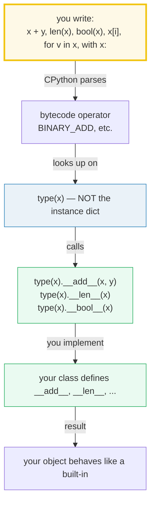
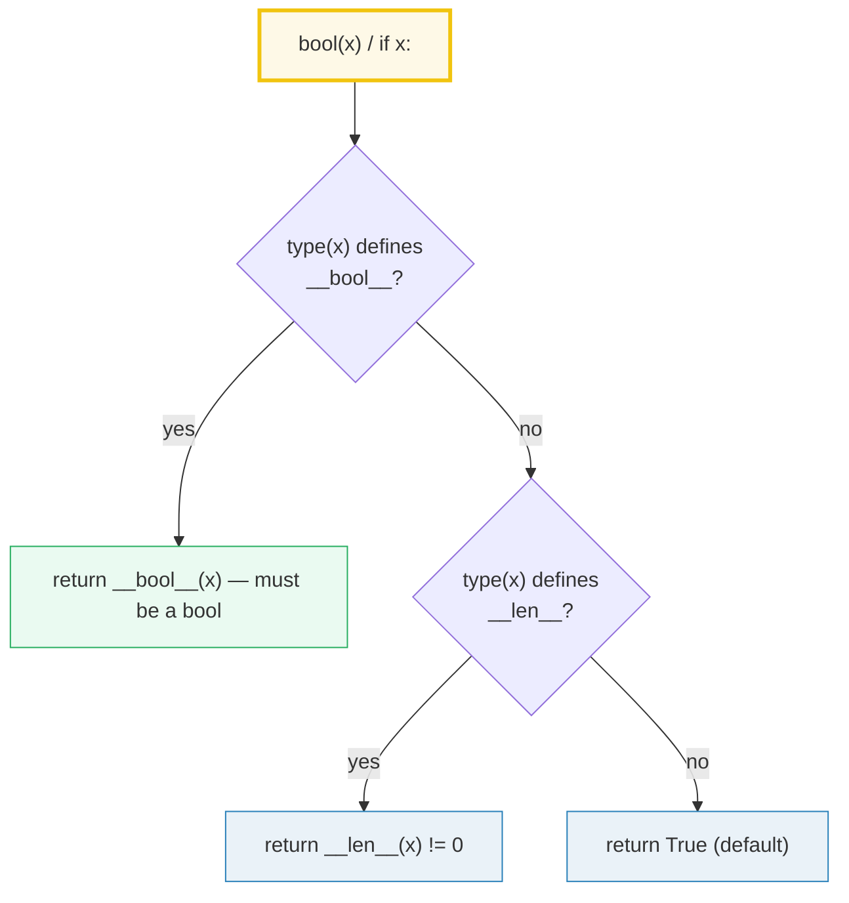
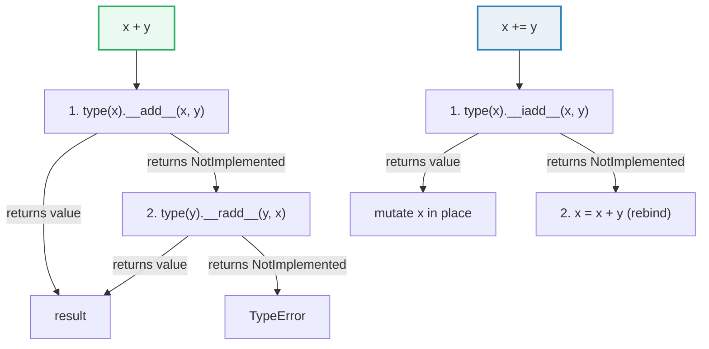

# Dunder Methods — The Python Data Model Is a Set of Hooks You Implement

> **The one rule:** "dunder methods" are not magic. They *are* the Python data
> model. Every operator (`+`, `==`, `in`), every built-in (`len()`, `str()`,
> `bool()`, `repr()`), and every protocol (`for`, `with`, indexing) is a
> **named method on your class** that the interpreter looks up on the **type**,
> not the instance. Implement the hook and your object behaves like a built-in.

**Companion code:** [`dunder_methods.py`](./dunder_methods.py). **Every value
and table below is printed by `uv run python dunder_methods.py`** — change the
code, re-run, re-paste. Nothing here is hand-computed. Captured stdout lives in
[`dunder_methods_output.txt`](./dunder_methods_output.txt).

**Goal of this bundle (lineage, old → new):**

> from *"dunder methods are magic — `__init__`, `__str__`, and a few others I
> memorize"*
> → *"dunder methods ARE the Python data model: `x + y` is literally
> `type(x).__add__(x, y)`, `len(x)` is literally `type(x).__len__(x)`, and every
> operator / built-in / protocol is a hook I can implement to make my object
> behave like a built-in."*

🔗 This is bundle **#10 of Phase 2**. It builds directly on
[`TYPES_AND_TRUTHINESS`](./TYPES_AND_TRUTHINESS.md) (the `PyObject` model,
`==` vs `is`, `__bool__`/`__len__` introduction) and feeds forward to:
[`DESCRIPTORS`](./TODO.md) (Phase 2 #12 — the machinery behind how methods bind
to instances), [`GENERATORS_ITERATORS`](./GENERATORS_ITERATORS.md) (Phase 1 #5 —
`__iter__`/`__next__` in depth), [`COLLECTIONS_BASICS`](./COLLECTIONS_BASICS.md)
(Phase 1 #3 — the `__hash__`/`__eq__` contract for `set`/`dict`), and
[`CONTEXT_MANAGERS`](./TODO.md) (Phase 3 — the full `with` protocol).

---

## 0. The one diagram that explains everything



The implication: if you want `len(my_obj)` to work, you don't hack `len` — you
define `__len__`. If you want `my_obj + other` to work, you define `__add__`.
The language is a fixed set of syntactic forms; **your job is to fill in the
hooks**.

---

## 1. The model — syntax → `type(x).__dunder__`

The [Python Language Reference §3.3](https://docs.python.org/3/reference/datamodel.html)
states: for `x + y`, "`type(x).__add__(x, y)` is called." This is not a metaphor
— it is the exact bytecode dispatch. The interpreter does **not** look at
`x.__add__` (the instance dict); it looks at `type(x).__add__` (the type's
method table). This is why you cannot overload an operator by assigning a
function to an instance attribute — the operator dispatch skips the instance
dict entirely.

The full mapping of common syntax to the dunder call:

> From `dunder_methods.py` Section A:
> ```
> ======================================================================
> SECTION A — The model: every operator is a dunder lookup on the TYPE
> ======================================================================
> Operators and built-ins are syntactic sugar. The interpreter does
> NOT call x.__add__(y) directly; it calls type(x).__add__(x, y) — a
> lookup on the TYPE, then an ordinary function call with x as the
> first argument. This is why you cannot overload an operator by
> stashing a function in the instance dict.
> 
> syntax          becomes (CPython dispatch)
> ----------------------------------------------------------------
> x + y           type(x).__add__(x, y)
> y + x           type(x).__add__ first; if NotImplemented, type(y).__radd__
> x += y          type(x).__iadd__(x, y); else x = x + y
> len(x)          type(x).__len__(x)
> bool(x)         type(x).__bool__(x), else type(x).__len__(x)
> repr(x)         type(x).__repr__(x)
> str(x)          type(x).__str__(x), else type(x).__repr__(x)
> x[i]            type(x).__getitem__(x, i)
> v in x          type(x).__contains__(x, v), else __iter__/__getitem__
> for v in x      type(x).__iter__(x), else __getitem__ from 0
> x == y          type(x).__eq__(x, y)
> hash(x)         type(x).__hash__(x)
> with x:         type(x).__enter__(x) / type(x).__exit__(x, ...)
> 
> v + 'z'                   -> V.__add__('z')
> v.__add__('z')            -> V.__add__('z')  (found via type)
> type(v).__add__(v, 'z')   -> V.__add__('z')  (operator path)
> 
> [check] 'v + z' dispatches to type(v).__add__: OK
> ```

### Why the lookup is on the type, not the instance (internals)

When CPython compiles `x + y`, it emits `BINARY_ADD` bytecode. The eval loop
calls `PyNumber_Add(x, y)`, which calls `slot_nb_add(x, y)` — and that function
looks up `x`'s **type's** `tp_methods` / `nb_add` slot, **not** `x.__dict__`.
This design has three consequences:

1. **You can't fake an operator from the instance.** Writing `x.__add__ =
   lambda o: ...` on an instance has zero effect on `x + other` — the operator
   never checks the instance dict.
2. **Operators are equally fast for builtins and user classes.** `int.__add__`
   and your `Vector.__add__` are looked up the same way (a C-level slot on the
   type object).
3. **Implicit method binding works.** `v.__add__('z')` resolves to the same
   function as `type(v).__add__(v, 'z')` — Python's attribute lookup finds
   `__add__` on the type and binds `v` as `self`. 🔗 The descriptor machinery
   that makes this binding work is the subject of
   [`DESCRIPTORS`](./TODO.md) (Phase 2 #12).

---

## 2. `__repr__` (official, for devs) vs `__str__` (informal, for users)

The [data model](https://docs.python.org/3/reference/datamodel.html#object.__repr__)
defines two string dunders with different audiences:

- **`__repr__`** — the *"official"* string. Should be unambiguous and,
  ideally, look like a valid Python expression that recreates an equal object:
  `eval(repr(obj)) == obj`. This is the `repr()` built-in and the `!r`
  conversion in f-strings. Used in tracebacks, debugger output, and containers
  (`print([point1, point2])` calls `__repr__`, not `__str__`).
- **`__str__`** — the *"informal"* string. Pretty, user-facing. This is
  `str()`, `print()`, and default f-string interpolation. If `__str__` is
  absent, `str(x)` falls back to `__repr__`.

> From `dunder_methods.py` Section B:
> ```
> ======================================================================
> SECTION B — __repr__ (official, for devs) vs __str__ (informal, for users)
> ======================================================================
> repr(x) computes the 'official' string — unambiguous, and ideally a
> valid Python expression that recreates an equal object. str(x) is the
> 'informal' pretty string. If __str__ is absent, str() falls back to
> __repr__. The !r flag in f-strings forces repr.
> 
> repr(p)       = Point(1, 2)
> str(p)        = (1, 2)
> f'{p}'   = (1, 2)     (plain interpolation uses __str__)
> f'{p!r}' = Point(1, 2)   (!r conversion forces __repr__)
> eval(repr(p)) == p  -> True   (the __repr__ round-trip ideal)
> 
> [check] repr(p) == 'Point(1, 2)': OK
> [check] str(p) == '(1, 2)': OK
> [check] eval(repr(p)) recreates an equal Point: OK
> ```

**Expert gotcha — containers always use `__repr__`:** `print([p1, p2])` calls
`__repr__` on each element, not `__str__`, even if `__str__` is defined. This
is why you see `<MyClass object at 0x...>` inside lists — the default
`object.__repr__` returns `<ClassName object at 0x{id:x}>`. Define `__repr__`
(not just `__str__`) if you ever debug by printing a collection of your objects.

---

## 3. `__eq__` + `__hash__` — the unhashable trap

This is the #1 silent bug in Python OOP. The contract:

1. **`object.__eq__` defaults to identity** (`is`) — two distinct objects are
   never `==` unless you override `__eq__`.
2. **`object.__hash__` defaults to a value derived from `id()`** — every object
   is hashable by default.
3. **If you define `__eq__` but NOT `__hash__`, Python silently sets
   `__hash__ = None`** — your object becomes **unhashable**. `set()`, `dict`
   keys, and `functools.lru_cache` all raise `TypeError: unhashable type`.

The [data model](https://docs.python.org/3/reference/datamodel.html#object.__hash__)
states: "If a class that overrides `__eq__()` needs to retain the hash
implementation from a parent class, the interpreter must be told this
explicitly by setting `__hash__ = <ParentClass>.__hash__`." If you don't, the
hash is gone.

> From `dunder_methods.py` Section C:
> ```
> ======================================================================
> SECTION C — __eq__ + __hash__ contract: the unhashable trap
> ======================================================================
> object.__eq__ defaults to IDENTITY (is). object.__hash__ defaults to
> id(). BUT: if you define __eq__ and do NOT define __hash__, Python
> silently sets __hash__ = None — your object becomes UNHASHABLE, so
> set(), dict keys, and functools.lru_cache all raise TypeError.
> 
> Plain() == Plain() -> False   (default __eq__ is identity)
> a == a             -> True
> Plain is hashable  -> True  (default __hash__ derives from id)
> 
> [check] default __eq__ is identity: OK
> EqOnly.__hash__ = None   (silently set to None!)
> hash(EqOnly(1))    -> TypeError: unhashable type: 'EqOnly'
> {EqOnly(1), EqOnly(2)} -> TypeError: unhashable type: 'EqOnly'
> 
> hash(EqHash(1)) = 1  (== hash(1))
> {EqHash(1), EqHash(1), EqHash(2)} -> len=2  (dedup works)
> 
> [check] defining __eq__ without __hash__ makes __hash__ None: OK
> [check] EqOnly is unhashable (hash() raises TypeError): OK
> [check] equal EqHash objects have equal hash: OK
> [check] set dedupes EqHash by __eq__/__hash__: OK
> ```

### Why defining `__eq__` kills `__hash__` (internals)

The rule exists because of the **hash invariant**: *equal objects MUST have
equal hashes*. `set` and `dict` use the hash to bucket an object, then use
`__eq__` to resolve collisions within a bucket. If two equal objects had
different hashes, they'd land in different buckets and the set would silently
hold "duplicate" entries.

When you define `__eq__`, Python no longer knows whether your equality is based
on a stable subset of attributes (suitable for hashing) or something volatile.
Rather than guess wrong and violate the invariant, it disables hashing
entirely. The fix: also define `__hash__` using the **same** attributes that
`__eq__` compares (and those attributes must be immutable).

🔗 The practical consequences for `set`/`dict` membership, `frozenset`, and
`collections.namedtuple`/`@dataclass(frozen=True)` are covered in
[`COLLECTIONS_BASICS`](./COLLECTIONS_BASICS.md) (Phase 1 #3).

---

## 4. `__bool__` takes precedence over `__len__`

When Python needs a truth value (`if`, `while`, `and`, `or`, `bool()`), it
calls `PyObject_IsTrue`, which checks `__bool__` **first**; if absent, it falls
back to `__len__` (`0 → False`); if neither is defined, the object is truthy.



> From `dunder_methods.py` Section D:
> ```
> ======================================================================
> SECTION D — bool(x): __bool__ wins over __len__
> ======================================================================
> When Python needs a truth value it calls PyObject_IsTrue: try
> __bool__ first; if absent, fall back to __len__ (0 -> False); if
> neither is defined, the object is truthy. A class with BOTH
> methods uses __bool__ and ignores __len__.
> 
> class                 __bool__  __len__   bool(obj)
> ----------------------------------------------------
> LenOnly               -         0         False
> BoolTrueLenZero       True      0         True
> BoolFalseLenBig       False     99        False
> 
> [check] only __len__->0 makes an object falsy: OK
> [check] __bool__(True) beats __len__(0): OK
> [check] __bool__(False) beats __len__(99): OK
> ```

`BoolTrueLenZero` defines `__bool__ → True` AND `__len__ → 0`. It comes out
**truthy** because `__bool__` wins. `BoolFalseLenBig` defines `__bool__ →
False` with `__len__ → 99`; it's falsy — `__bool__` wins again.

🔗 The falsy builtins table (`None`, `0`, `''`, `[]`, `{}`, `set()`, ...) and
the truthiness rules for builtin types are in
[`TYPES_AND_TRUTHINESS`](./TYPES_AND_TRUTHINESS.md) §2.

---

## 5. Emulating a container — the indexing/iteration protocol

Implement `__getitem__`, `__setitem__`, `__delitem__`, `__contains__`,
`__len__`, and `__iter__` and your object is indistinguishable from a built-in
collection. The lookup precedence for `in` and `for` has fallback chains:

| Operation | First try | Fallback | Last resort |
|---|---|---|---|
| `v in x` | `__contains__(x, v)` | `__iter__(x)` → scan | `__getitem__(x, 0,1,2,...)` until `IndexError` |
| `for v in x` | `__iter__(x)` | `__getitem__(x, 0,1,2,...)` until `IndexError` | `TypeError: not iterable` |

The `__getitem__` fallback for iteration is a legacy from Python's pre-iterator
days (PEP 234). It means a class with only `__getitem__` is still iterable —
the `for` loop calls `obj[0]`, `obj[1]`, `obj[2]`, ... until `IndexError`.

> From `dunder_methods.py` Section E:
> ```
> ======================================================================
> SECTION E — Emulating a container: Grid (sparse 2D) + __getitem__ fallback
> ======================================================================
> Implement __getitem__/__setitem__/__delitem__/__contains__/__len__/
> __iter__ and your object behaves like a built-in collection. `in`
> tries __contains__ first; `for` tries __iter__ first, then falls back
> to __getitem__ starting at index 0 until IndexError.
> 
> g[1,1] = 10   g[3,3] = 0   (unset -> 0)
> len(g) = 3
> (1,1) in g -> True   (9,9) in g -> False
> list(g) = [(0, 0), (1, 1), (2, 2)]   (iteration via __iter__)
> del g[0,0] -> len=2, (0,0) in g -> False
> 
> SeqByIndex has __iter__? False  __getitem__? True
> list(s) = [0, 10, 20]   (for-loop: __getitem__(0,1,2) then IndexError)
> 
> [check] Grid supports indexing, len, in, iter, del: OK
> [check] __contains__ drives the `in` operator: OK
> [check] __getitem__ fallback drives iteration: OK
> ```

The `Grid` class uses tuple keys `(row, col)` for sparse 2D storage — unset
cells return `0` via `__getitem__`'s `.get(key, 0)` default. `SeqByIndex`
proves the `__getitem__` fallback: it has no `__iter__` at all, yet `list(s)`
works because the `for` loop calls `s[0]`, `s[1]`, `s[2]`, catches the
`IndexError` at `s[3]`, and stops.

🔗 The full iterator protocol (`__iter__` returning an object with `__next__`,
`StopIteration`, generators) is in
[`GENERATORS_ITERATORS`](./GENERATORS_ITERATORS.md) (Phase 1 #5).

---

## 6. Arithmetic dunders — `__add__`, `__radd__` (reflected), `__iadd__` (in-place)

The [data model §3.3.7](https://docs.python.org/3/reference/datamodel.html#emulating-numeric-types)
defines the numeric protocol. Three layers of dispatch for `+`:



- **`__add__`** — called on the LEFT operand. Return `NotImplemented` (not
  `None`!) if your type doesn't understand the right operand.
- **`__radd__`** — the *reflected* method, called on the RIGHT operand only when
  the left operand's `__add__` returned `NotImplemented`. This is how `10 +
  Vector(1,2)` works: `int.__add__(10, Vector(...))` returns `NotImplemented`,
  so Python tries `type(Vector(...)).__radd__(Vector(...), 10)`.
- **`__iadd__`** — the *in-place* method for `+=`. If defined, it mutates `self`
  and returns it. If absent, `x += y` desugars to `x = x + y` (creating a new
  object and rebinding the name).

> From `dunder_methods.py` Section F:
> ```
> ======================================================================
> SECTION F — Arithmetic: __add__, __radd__ (reflected), __iadd__ (in-place)
> ======================================================================
> x + y calls type(x).__add__(x, y). If that returns NotImplemented
> (left operand doesn't understand the right), Python tries the
> REFLECTED method: type(y).__radd__(y, x). += tries __iadd__ first;
> if absent, it falls back to __add__ and rebinds the name.
> 
> Vector(1,2) + Vector(3,4) = Vector(4, 6)
> 10 + Vector(1,2)          = Vector(11, 12)   (int.__add__ -> NotImplemented -> Vector.__radd__)
> v1 += Vector(0,1)         -> v1 = Vector(1, 3), same object? True (__iadd__ mutates in place)
> 
> [check] Vector(1,2) + Vector(3,4) == Vector(4,6): OK
> [check] 10 + Vector(1,2) == Vector(11,12) via __radd__: OK
> [check] __iadd__ mutates in place (same id): OK
> ```

**Expert gotcha — return `NotImplemented`, not `NotImplementedError`:**
`NotImplemented` is a singleton (note: not an exception!) that tells the
interpreter "I don't know how to handle this operand; try the other side."
Returning `None` or raising `NotImplementedError` bypasses the reflected
dispatch entirely. Also note: for correct `__iadd__`, you must **return
`self`** — if you forget the `return` statement, `x += y` silently sets `x` to
`None`.

---

## 7. Context-manager preview — `__enter__` / `__exit__`

`with x:` calls `type(x).__enter__(x)` on entry (the return value is bound to
the `as` variable), then `type(x).__exit__(x, exc_type, exc_val, exc_tb)` on
exit — **even if the body raises**. The three `exc_*` arguments are `None` on a
clean exit, or the exception triple on a raised one. Return `True` from
`__exit__` to suppress the exception.

> From `dunder_methods.py` Section G:
> ```
> ======================================================================
> SECTION G — Context-manager preview: __enter__ / __exit__
> ======================================================================
> `with x:` calls type(x).__enter__(x) on entry (the return value is
> bound to the as-variable), and type(x).__exit__(x, exc_type, exc_val,
> exc_tb) on exit — even if the body raises. Return True from __exit__
> to suppress the exception. Full treatment in CONTEXT_MANAGERS (P3).
> 
> with Tracer() as t: ... -> t.calls = ['enter', 'body', ('exit', None)]
> 
> [check] with calls __enter__ -> body -> __exit__(None): OK
> ```

🔗 The full treatment — `contextlib.contextmanager`, exception suppression,
nested `with`, `ExitStack`, and async context managers (`__aenter__` /
`__aexit__`) — is in [`CONTEXT_MANAGERS`](./TODO.md) (Phase 3). The interaction
between `__exit__` and `try`/`except`/`finally` is in
[`EXCEPTIONS`](./EXCEPTIONS.md) (Phase 1 #6).

---

## Pitfalls

| Trap | Example | The fix |
|---|---|---|
| Defining `__eq__` without `__hash__` | `set()` / `dict` keys raise `TypeError: unhashable type` | also define `__hash__` using the same immutable attrs as `__eq__`; or use `@dataclass(frozen=True)` |
| Returning `None` instead of `NotImplemented` from `__add__` | `Vector(1,2) + "x"` returns `None` instead of trying `str.__radd__` | return `NotImplemented` (the singleton) for unknown operand types |
| Forgetting `return self` in `__iadd__` | `v += other` silently sets `v = None` | always `return self` at the end of `__iadd__` / `__isub__` / etc. |
| Only defining `__str__`, not `__repr__` | `print([obj])` shows `<MyClass at 0x...>` — lists use `__repr__` | always define `__repr__`; `__str__` is optional |
| `__eq__` that accepts any type | `Vector(1,2) == 42` returns `True` by accident | guard with `isinstance` first, return `NotImplemented` for unknown types |
| Mutable object used as dict key / set member | mutating after insertion "loses" it in the wrong hash bucket | only hash immutable attributes; or use `frozen=True` dataclasses |
| `__bool__` returning a non-bool | `bool(obj)` raises `TypeError: __bool__ should return bool` | always `return True`/`False`, never `return 1`/`0` or `return self.len` |
| `__len__` returning a negative int | `len(obj)` raises `ValueError: __len__() should return >= 0` | guard against negative returns; `__len__` must return `int >= 0` |
| Relying on `__getitem__` fallback iteration for performance | each iteration step does a method call + `IndexError` catch | define `__iter__` explicitly for any performance-sensitive container |
| Operator overload for non-obvious semantics | `a + b` sends an HTTP request — nobody reading `a + b` expects that | use operator overloading only when the meaning is obvious (`Vector + Vector`, not `Database + Query`) |

---

## Cheat sheet

- **The model:** every operator/built-in is a dunder lookup on `type(x)`, not
  the instance dict. `x + y` → `type(x).__add__(x, y)`. `len(x)` →
  `type(x).__len__(x)`. `bool(x)` → `type(x).__bool__(x)` or `__len__`. You
  cannot overload an operator from the instance.
- **`__repr__` vs `__str__`:** `__repr__` is official/dev-facing (ideally
  `eval(repr(x)) == x`); `__str__` is informal/user-facing (falls back to
  `__repr__` if absent). Containers (`print([obj])`) always use `__repr__`.
  `!r` in f-strings forces `__repr__`.
- **`__eq__` + `__hash__` contract:** defining `__eq__` without `__hash__`
  silently sets `__hash__ = None` → unhashable. Always define both. Equal
  objects MUST have equal hash. Hash only immutable attributes.
- **`__bool__` / `__len__`:** `__bool__` takes precedence. Only `__len__` →
  `bool(obj)` is `len(obj) != 0`. Neither → always truthy.
- **Container protocol:** `__getitem__`/`__setitem__`/`__delitem__` for
  indexing; `__contains__` for `in` (fallback: `__iter__` then
  `__getitem__`); `__iter__` for `for` (fallback: `__getitem__` from 0 until
  `IndexError`); `__len__` for `len()`.
- **Arithmetic:** `x + y` → `type(x).__add__`, then `type(y).__radd__` if
  `NotImplemented`. `x += y` → `type(x).__iadd__` (mutate + `return self`),
  else `x = x + y`. Return `NotImplemented` (not `None`!) for unknown types.
- **Context manager:** `__enter__` → return value bound to `as`. `__exit__`
  called even on exception; `return True` suppresses.

---

## Sources

- **Python Language Reference §3.3 — Data model (special method names).**
  https://docs.python.org/3/reference/datamodel.html
  *The authoritative source for every dunder in this bundle: §3.3.1
  (`__new__`/`__init__`/`__repr__`/`__str__`), §3.3.6 (emulating container types
  — `__getitem__`/`__setitem__`/`__delitem__`/`__contains__`/`__iter__`/
  `__len__`), §3.3.7 (emulating numeric types — `__add__`/`__radd__`/`__iadd__`
  and the `NotImplemented` protocol), §3.3.10 (`__bool__`/`__len__` precedence
  and the `__hash__`/`__eq__` contract). Quoted and verified throughout.*
- **Python Language Reference §3.3.1 — `object.__repr__` / `object.__str__`.**
  https://docs.python.org/3/reference/datamodel.html#object.__repr__
  *"Called by the `repr()` built-in function to compute the 'official' string
  representation of an object." Confirms the eval-round-trip ideal and the
  `__str__` → `__repr__` fallback. Used in §2.*
- **Python Language Reference §3.3.2 — `object.__hash__`.**
  https://docs.python.org/3/reference/datamodel.html#object.__hash__
  *"If a class that overrides `__eq__()` needs to retain the hash
  implementation from a parent class, the interpreter must be told this
  explicitly." The exact rule that makes `EqOnly` unhashable. Used in §3.*
- **Python Language Reference §3.3.7 — Emulating numeric types.**
  https://docs.python.org/3/reference/datamodel.html#emulating-numeric-types
  *The `type(x).__add__(x, y)` dispatch rule and the reflected (`__radd__`) /
  in-place (`__iadd__`) protocol. Used in §1 and §6.*
- **Python Language Reference §3.3.10 — `__bool__` and `__len__`.**
  https://docs.python.org/3/reference/datamodel.html#object.__bool__
  *"Called to implement truth value testing and the built-in operation
  `bool()`; should return `False` or `True`. When this method is not defined,
  `__len__()` is called." Used in §4.*
- **PEP 234 — Iterators (GvR, 2001).**
  https://peps.python.org/pep-0234/
  *Introduced the `__iter__`/`__next__` iterator protocol and the `__getitem__`
  fallback for backward compatibility with pre-iterator sequence types.
  Referenced in §5.*
- **CPython source — `Objects/abstract.c` (`PyNumber_Add`,
  `PyObject_IsTrue`).**
  https://github.com/python/cpython/blob/main/Objects/abstract.c
  *The C implementation that confirms the dispatch chains: `PyNumber_Add`
  tries `nb_add` then `nb_subtract` reflected; `PyObject_IsTrue` tries
  `nb_bool` then `mp_length`. Referenced in §1, §4, and §6 internals notes.*
