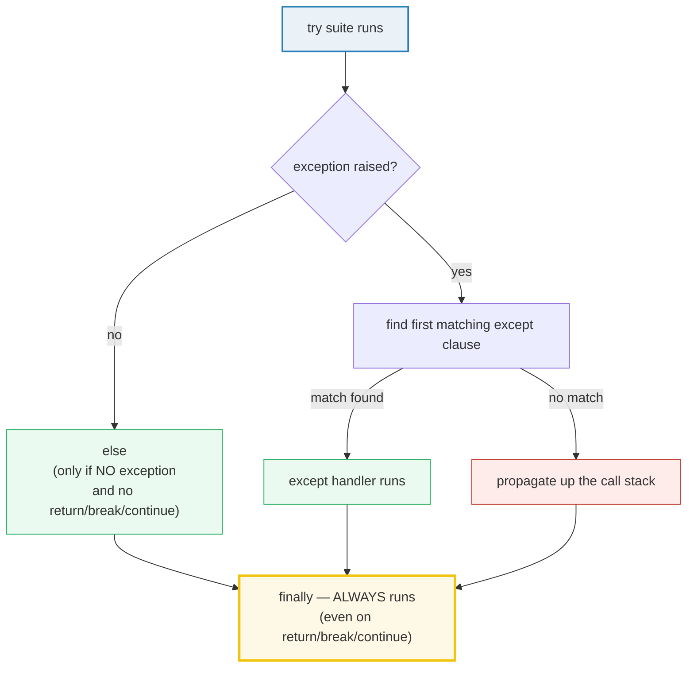
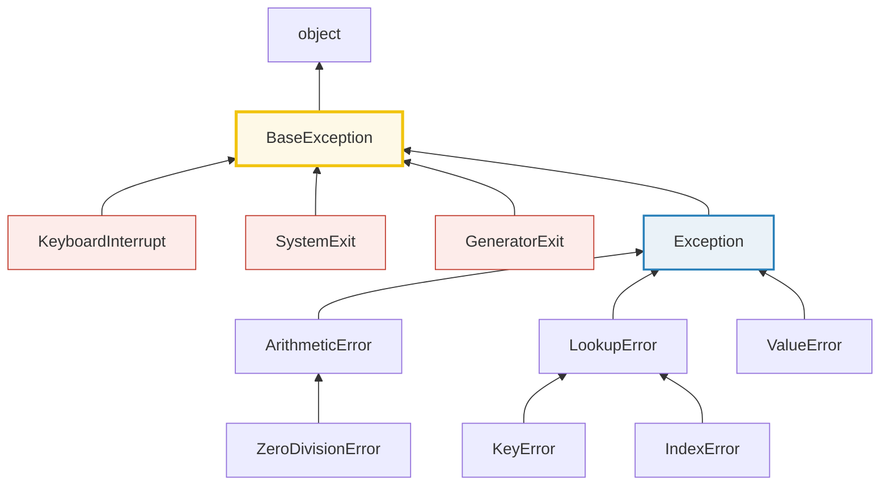

# Exceptions — The Full `try`/`except`/`else`/`finally` Lifecycle & Hierarchy

> **The one rule:** a Python exception is *not a crash* — it is an object that
> unwinds the call stack until a handler matches it. The `try` statement has
> four clauses with precise ordering rules; the exception classes form a tree
> rooted at `BaseException`; and every exception object carries its own
> traceback, cause, and context. Master the lifecycle + the hierarchy + the
> chaining model and "errors" stop being scary.

**Companion code:** [`exceptions.py`](./exceptions.py).
**Every number and table below is printed by `uv run python exceptions.py`** —
change the code, re-run, re-paste. Nothing here is hand-computed. Captured
stdout lives in [`exceptions_output.txt`](./exceptions_output.txt).

**Goal of this bundle (lineage, old → new):**

> from *"try/except catches errors"*
> → *"I understand the full try/except/else/finally lifecycle, the exception
> hierarchy, chaining (`__cause__`/`__context__`), custom exceptions, and the
> EAFP vs LBYL philosophy."*

🔗 This is bundle **#8 of Phase 1**. It builds on
[`TYPES_AND_TRUTHINESS`](./TYPES_AND_TRUTHINESS.md) (everything is a `PyObject`,
`isinstance` walks a type chain) and forwards to
[`CONTEXT_MANAGERS`](./CONTEXT_MANAGERS.md) (Phase 3) for the structured way to
guarantee cleanup (`with`). See [`TODO.md`](./TODO.md) for the full plan.

---

## 0. The whole model on one page



| Clause | When it runs | What it is for |
|---|---|---|
| `try` | always first | the code you are protecting |
| `except` | only if `try` raised a *matching* type | handle the error |
| `else` | only if `try` raised **nothing** (and no `return`/`break`/`continue`) | the "happy path" — keeps it out of `try` so you don't accidentally catch unrelated errors |
| `finally` | **always** — last task before the statement completes | cleanup (release resources); runs even on `return`/`break`/`continue`/unhandled exception |

---

## 1. `try`/`except`/`else`/`finally` — the four-phase lifecycle

The [Language Reference §8.4](https://docs.python.org/3/reference/compound_stmts.html#the-try-statement)
fixes the order. Two facts everyone gets wrong at first:

1. **`else` runs only when `try` left with no exception** (and no
   `return`/`break`/`continue`). It is *not* a "default" — it is the explicit
   "nothing went wrong" branch. Putting happy-path code in `else` rather than in
   `try` prevents you from accidentally catching an exception raised *by that
   code* rather than by the protected operation.
2. **`finally` runs unconditionally.** If `try` (or `except`, or `else`) raised
   an exception, it is *temporarily saved*, `finally` runs, and then the saved
   exception is re-raised. `finally` even runs when `try` hits a `return` — the
   return value is computed, `finally` runs, *then* the return takes effect.

> From `exceptions.py` Section A:
> ```
> ======================================================================
> SECTION A — try/except/else/finally phase ordering
> ======================================================================
> A try statement has up to four clauses. The rules (Language
> Reference 8.4): the try suite runs first; if it raises, the first
> matching except runs; else runs ONLY when try left with no
> exception (and no return/break/continue); finally ALWAYS runs,
> even on return/break/continue or an unhandled exception.
> 
> scenario                          phase order
> ------------------------------------------------------------
> no exception raised               try -> else -> finally
> ValueError raised and caught      try -> except -> finally
> 
> [check] else runs only when no exception: OK
> [check] else is skipped when an exception is caught: OK
> finally runs even when try contains a return:
> 
>   (finally ran before the return took effect)
>   caller received: 'from-try'
> 
> [check] finally runs even when try returns: OK
> A return INSIDE finally overrides try's return value:
> 
>   caller received: 'from-finally'  (try said 'from-try')
> 
> [check] return in finally overrides return in try: OK
> ```

### Why `finally` always runs (internals)

When an exception propagates, CPython walks up the frame stack looking for a
handler. A `try`/`finally` registers a **cleanup handler** on the frame's
`f_block` chain *in addition to* any `except`. The eval loop, before unwinding
past a `SETUP_FINALLY` bytecode, diverts into the `finally` suite. This is why
`finally` runs even when the `try` hit a `return`: the return value is pushed
onto the value stack, but control is handed to `finally` first; only when
`finally` completes does the `RETURN_VALUE` instruction actually fire.

**The footgun:** a `return` *inside* `finally` overrides `try`'s return value
*and discards any pending exception*. The demo above shows `return_in_finally()`
returning `'from-finally'` even though `try` said `'from-try'`. From Python 3.14
the compiler emits a [`SyntaxWarning`](https://docs.python.org/3/library/exceptions.html#SyntaxWarning)
for `return`/`break`/`continue` in a `finally` block ([PEP 765](https://peps.python.org/pep-0765/))
because it is almost always a bug.

---

## 2. Catching specifics — and the bare-`except` trap

An `except` clause matches when the raised exception is an instance of the named
class **or any subclass of it** (so `except LookupError` catches both
`KeyError` and `IndexError`). You can name a single class, a tuple of classes,
or the broad `Exception`. The dangerous form is the **bare `except:`** (or
`except BaseException`), which also matches `SystemExit`, `KeyboardInterrupt`,
and `GeneratorExit` — the three exceptions that inherit *directly* from
`BaseException`, not from `Exception`.

> From `exceptions.py` Section B:
> ```
> ======================================================================
> SECTION B — Catching specifics & the bare-except trap
> ======================================================================
> Match a specific type, a tuple of types, or Exception (broad). A
> class in an except clause matches the class AND its subclasses.
> The trap: bare `except:` (identical to `except BaseException`) also
> catches SystemExit and KeyboardInterrupt — which you usually want
> to let propagate. We simulate a Ctrl-C with a BaseException
> subclass so the demo stays deterministic.
> 
>   except ValueError caught: ValueError('bad value')
> [check] except ValueError catches a ValueError: OK
>   except (KeyError, IndexError) caught: KeyError
> [check] except (KeyError, IndexError) catches a KeyError: OK
>   FakeInterrupt was NOT caught by `except Exception`
> [check] except Exception does NOT catch a BaseException subclass: OK
>   `except BaseException` DID catch the fake interrupt (the trap)
> [check] bare-except equivalent catches BaseException subclasses: OK
> 
>   => Prefer `except Exception:` for a broad catch; reserve bare
>      `except:` / `except BaseException` for top-level log-and-reraise.
> ```

### Why `except Exception` is the safe "catch all" (internals)

The demo uses a `FakeInterrupt(BaseException)` to stand in for `KeyboardInterrupt`
without actually interrupting the process. `except Exception` does **not** catch
it (because `FakeInterrupt` is not a subclass of `Exception`), so it propagates
to the outer `except FakeInterrupt`. But `except BaseException` — which is
exactly what a bare `except:` means — *does* swallow it. That is the trap: a
bare `except:` will silently eat a user's Ctrl-C (`KeyboardInterrupt`) and
`sys.exit()` (`SystemExit`), freezing a program that should have died. [PEP
8](https://peps.python.org/pep-0008/#programming-recommendations) tells you to
never use it; ruff flags it as `E722` (`BLE001` for `except BaseException`). The
discipline: catch the **most specific** type you can handle; if you must catch
broadly, use `except Exception:` so control-flow exceptions still escape.

---

## 3. The exception hierarchy — `BaseException` vs `Exception`



The [built-in hierarchy](https://docs.python.org/3/library/exceptions.html#exception-hierarchy)
puts `BaseException` at the root. `Exception` is *one* of its subclasses and is
the base of everything a normal program should catch. The three control-flow
exceptions (`KeyboardInterrupt`, `SystemExit`, `GeneratorExit`) deliberately sit
**on `BaseException` directly** so that `except Exception:` — the broadest sane
catch — still lets them through. Concrete errors group under intermediate bases
like `ArithmeticError` (`ZeroDivisionError`, `OverflowError`) and `LookupError`
(`KeyError`, `IndexError`), so you can catch a whole family with one clause.

> From `exceptions.py` Section C:
> ```
> ======================================================================
> SECTION C — The exception hierarchy: BaseException vs Exception
> ======================================================================
> Every exception subclasses BaseException. Exception is the base of
> all NON-system-exiting exceptions. KeyboardInterrupt, SystemExit
> and GeneratorExit branch directly off BaseException — on purpose,
> so `except Exception` can't swallow a Ctrl-C or sys.exit().
> 
> expression                                result
> --------------------------------------------------------
> issubclass(ValueError, Exception)         True
> issubclass(Exception, BaseException)      True
> issubclass(ValueError, BaseException)     True
> issubclass(KeyboardInterrupt, Exception)  False
> issubclass(KeyboardInterrupt, BaseException)True
> issubclass(SystemExit, Exception)         False
> issubclass(SystemExit, BaseException)     True
> issubclass(ZeroDivisionError, ArithmeticError)True
> issubclass(KeyError, LookupError)         True
> issubclass(ZeroDivisionError, Exception)  True
> 
> [check] ValueError is an Exception: OK
> [check] Exception is a BaseException: OK
> [check] KeyboardInterrupt is NOT an Exception (it is BaseException): OK
> [check] SystemExit is NOT an Exception (it is BaseException): OK
> [check] ZeroDivisionError -> ArithmeticError -> Exception chain: OK
>   ValueError.__mro__        = (<class 'ValueError'>, <class 'Exception'>, <class 'BaseException'>, <class 'object'>)
>   KeyboardInterrupt.__mro__ = (<class 'KeyboardInterrupt'>, <class 'BaseException'>, <class 'object'>)
>   SystemExit.__mro__        = (<class 'SystemExit'>, <class 'BaseException'>, <class 'object'>)
> ```

### Why matching is "the class or a base of it" (internals)

`except E` matches a raised exception `x` when `isinstance(x, E)`. Because
`isinstance` walks the MRO (`__mro__`), listing `except ArithmeticError` catches
`ZeroDivisionError` too — `ZeroDivisionError` appears in `ArithmeticError`'s
subtree. The reverse is false: `except ZeroDivisionError` will **not** catch a
plain `ArithmeticError`. Order your `except` clauses from **most specific to
most general**, because only the *first* matching clause runs (a common bug is
putting `except Exception` first and shadowing every specific handler below it).

---

## 4. Exception chaining — `__cause__`, `__context__`, and bare `raise`

Three attributes on every exception object record its history
([`BaseException` docs](https://docs.python.org/3/library/exceptions.html#BaseException)):

- **`__cause__`** — set *explicitly* by `raise B from A`. Says "B was directly
  caused by A."
- **`__context__`** — set *implicitly* whenever a new exception is raised while
  another is already being handled (inside an `except`/`finally` block). Says
  "B happened while we were dealing with A."
- **`__suppress_context__`** — set to `True` automatically whenever `__cause__`
  is set (so `raise B from None` hides the implicit context from the traceback).

A bare `raise` (no argument) **re-raises the active exception** unchanged — the
standard way to log-and-propagate. If there is no active exception, bare `raise`
raises `RuntimeError`.

> From `exceptions.py` Section D:
> ```
> ======================================================================
> SECTION D — Exception chaining (__cause__/__context__) & re-raise
> ======================================================================
> Explicit chaining: `raise B from A` sets B.__cause__ = A. Implicit
> chaining: raising ANY new exception inside an except/finally block
> sets new.__context__ to the exception being handled. Bare `raise`
> re-raises the active exception unchanged.
> 
>   raised: RuntimeError from ValueError
>     e.__cause__           = ValueError('the root cause')
>     e.__context__         = None
>     e.__suppress_context__ = True
> [check] 'raise ... from' sets __cause__: OK
> [check] explicit __cause__ is the original exception: OK
> [check] 'from' also sets __suppress_context__ = True: OK
> 
>   raised: RuntimeError inside a KeyError handler (no 'from')
>     e.__cause__   = None
>     e.__context__ = KeyError('missing key')
> [check] implicit chaining sets __context__ to the handled exception: OK
> [check] __cause__ is None when no explicit 'from': OK
> 
>   bare `raise` re-raised: ValueError('original message')
> [check] bare raise re-raises the active exception: OK
> ```

### Why chaining exists (internals)

Before [PEP 3134](https://peps.python.org/pep-3134/) (Python 3.0), wrapping one
exception in another *destroyed* the original — debuggers lost the root cause.
PEP 3134 added `__context__` (always set during handling, so you can never lose
context by accident) and `__cause__` (set only when *you* say `raise ... from`,
declaring a deliberate causal link). The default traceback renderer prints
explicitly-chained exceptions ("*The above exception was the direct cause of the
following exception*") and implicitly-chained ones ("*During handling of the
above exception, another exception occurred*"). The distinction is preserved
because `raise B from None` sets `__suppress_context__ = True`, telling the
renderer to hide the (still-present) `__context__` — useful when you *translate*
an implementation-detail error into a clean public API error.

---

## 5. Custom exception hierarchies

The [tutorial §8.6](https://docs.python.org/3/tutorial/errors.html#user-defined-exceptions)
advises deriving app exceptions from `Exception` (never `BaseException`). A
custom error is an ordinary class: it can have subclasses, multiple
inheritance, extra attributes, and an overridden `__str__`. Multiple inheritance
is powerful here — `class ValidationError(AppError, ValueError)` is caught by
*both* `except AppError` and `except ValueError`, so a validator plugs into code
that already handles `ValueError`.

> From `exceptions.py` Section E:
> ```
> ======================================================================
> SECTION E — Custom exception hierarchy
> ======================================================================
> Derive app exceptions from Exception (NOT BaseException). A custom
> error can have subclasses, multiple inheritance, and a custom
> __str__ for friendlier messages.
> 
>   ValidationError('email', 'missing @'):
>     type(err).__mro__ = (<class '__main__.section_e_custom_exceptions.<locals>.ValidationError'>, <class '__main__.section_e_custom_exceptions.<locals>.AppError'>, <class 'ValueError'>, <class 'Exception'>, <class 'BaseException'>, <class 'object'>)
>     str(err)          = '[email] invalid: missing @'
>     err.args          = ('email: missing @',)
>     err.field         = 'email'
>     err.reason        = 'missing @'
> 
> [check] ValidationError is an AppError: OK
> [check] ValidationError is a ValueError (multiple inheritance): OK
> [check] ValidationError is an Exception: OK
> [check] custom __str__ is used: OK
> [check] except AppError catches the subclass: OK
> [check] except ValueError also catches it (2nd base class): OK
>   caught as AppError:   [email] invalid: missing @
>   caught as ValueError: [age] invalid: negative
> ```

### Why the MRO matters (internals)

The MRO (`type(err).__mro__`) shown above is the linearization CPython uses for
both `isinstance` checks *and* `except` matching. `ValidationError(AppError,
ValueError)` resolves to `[ValidationError, AppError, ValueError, Exception,
BaseException, object]` via the C3 linearization algorithm — so a handler for
*any* of those bases catches it. The `args` attribute holds whatever you passed
to `super().__init__(...)`; overriding `__str__` lets you format a friendlier
message than the raw `args` tuple (note `str(err)` is `'[email] invalid: ...'`
while `err.args` is `('email: missing @',)`).

> **CPython caveat** ([built-in exceptions docs](https://docs.python.org/3/library/exceptions.html#inheriting-from-built-in-exceptions)):
> some built-in exceptions have custom C memory layouts, so subclassing
> *several* built-in exception types at once can be fragile. Subclassing one
> built-in + your own pure-Python bases (as here) is safe.

---

## 6. EAFP vs LBYL — the two error styles

Python culture is **EAFP** — *"Easier to Ask Forgiveness than Permission"*: just
try the operation and catch the failure. The alternative, **LBYL** — *"Look
Before You Leap"* — checks a condition first (`if key in d:`). EAFP is preferred
because (a) it is one happy path instead of a check-then-use pair, and (b) it
**avoids TOCTOU races** ("time-of-check to time-of-use"): in concurrent code,
the state can change between the `if` check and the use, but a `try` that
performs the operation atomically cannot be raced.

> From `exceptions.py` Section F:
> ```
> ======================================================================
> SECTION F — EAFP (try first) vs LBYL (check first)
> ======================================================================
> EAFP = 'Easier to Ask Forgiveness than Permission' (try the op,
> catch the error). LBYL = 'Look Before You Leap' (check first).
> EAFP is idiomatic Python and avoids TOCTOU races: between an LBYL
> check and the use, the state can change.
> 
>   d = {'a': 1}
>   eafp('a') = EAFP got 1
>   eafp('x') = EAFP: key absent
>   lbyl('a') = LBYL got 1
>   lbyl('x') = LBYL: key absent
> 
> [check] EAFP returns the value when key present: OK
> [check] EAFP handles absent key via except KeyError: OK
> [check] LBYL matches EAFP for present key: OK
> [check] LBYL matches EAFP for absent key: OK
>   finally is manual cleanup; `with` (context managers) is the
>   structured way to guarantee cleanup.
>   -> see CONTEXT_MANAGERS (Phase 3) for the with-statement protocol.
> ```

### Why EAFP is idiomatic (internals)

EAFP leans on the fact that **raising and catching an exception is cheap when it
does not happen** — the common path (`d[key]` succeeds) runs no extra
instructions, whereas LBYL always pays for the membership test. The expensive
part of exceptions is *raising* (building the traceback, unwinding frames),
which only happens on the rare error path. This makes EAFP both cleaner and
faster for the common case. (A pathological exception raised in a tight loop
*will* be slow — that is the one place LBYL wins.)

---

## Pitfalls

| Trap | Example | The fix |
|---|---|---|
| Bare `except:` swallows Ctrl-C / `sys.exit()` | `except:` catches `KeyboardInterrupt` → program won't die | use `except Exception:` for a broad catch; reserve bare `except:` for top-level log-and-reraise |
| `except Exception:` listed before specific clauses | the broad clause shadows `except ValueError` below it | order clauses **most-specific → most-general**; only the first match runs |
| `return` in `finally` overrides `try`'s return & drops the exception | `finally: return x` silently discards a pending exception | never `return`/`break`/`continue` from `finally` (3.14+ warns, [PEP 765](https://peps.python.org/pep-0765/)) |
| Catching the exception type, not its subclasses, "by accident" | `except ArithmeticError` *also* catches `ZeroDivisionError` | intended — but remember the reverse (`except ZeroDivisionError` won't catch plain `ArithmeticError`) |
| Losing the original error when wrapping | `except E: raise NewError(...)` without `from` → `__cause__` is `None` | `raise NewError(...) from e` to preserve the explicit cause |
| Bare `raise` with no active exception | `raise` at module top → `RuntimeError: No active exception to re-raise` | only use bare `raise` *inside* an `except` block |
| `except` with no `as` can't see the instance | `except ValueError: print(e)` → `NameError` | `except ValueError as e:` |
| The bound exception is deleted at end of `except` | `except E as e: ...` then `e` is gone after the block | CPython clears it to break a ref cycle with the traceback; save `e` to another name if you need it |
| Subclassing `BaseException` directly for app errors | your error then escapes `except Exception` handlers | always derive from `Exception` (or a subclass) |
| Treating `NotImplementedError` and `NotImplemented` as the same | they are different objects (exception vs constant) | `NotImplementedError` is raised; `NotImplemented` is returned by dunder methods for the interpreter to retry |

---

## Cheat sheet

- **Four clauses, fixed order:** `try` → (first matching) `except` → `else` →
  `finally`. `else` runs only on no-exception (and no `return`/`break`/
  `continue`); `finally` **always** runs.
- **`finally` even runs on `return`:** the return value is held while `finally`
  executes, then returned. A `return` *inside* `finally` overrides it (and
  discards any pending exception) — don't do it.
- **Matching:** `except E` catches `x` iff `isinstance(x, E)` — the class *or
  any subclass*. Name a tuple for several types: `except (KeyError, IndexError)`.
- **Never bare `except:`** (== `except BaseException`) — it swallows
  `KeyboardInterrupt`/`SystemExit`. Use `except Exception:` for "catch almost
  everything."
- **Hierarchy:** `BaseException` is the root; `Exception` is the safe base;
  `KeyboardInterrupt`, `SystemExit`, `GeneratorExit` sit on `BaseException`
  directly so `except Exception` can't eat a Ctrl-C.
- **Chaining:** `raise B from A` → `B.__cause__ = A`, `__suppress_context__ = True`.
  Raising inside an `except`/`finally` → `new.__context__` = the handled
  exception, `__cause__ = None`. `raise B from None` hides the context.
- **Bare `raise`:** re-raises the active exception unchanged (log-and-propagate).
  Outside a handler it raises `RuntimeError`.
- **Custom exceptions:** derive from `Exception`; multiple inheritance
  (`class X(AppError, ValueError)`) makes a handler for either base match.
- **EAFP > LBYL:** try-first is idiomatic, has one happy path, and is
  race-free; checks can be invalidated between check and use (TOCTOU).
- **Cleanup:** `finally` is manual cleanup; `with` (context managers) is the
  structured way. 🔗 [`CONTEXT_MANAGERS`](./CONTEXT_MANAGERS.md) (Phase 3).

---

## Sources

- **Python docs — Tutorial §8: Errors and Exceptions.**
  https://docs.python.org/3/tutorial/errors.html
  *The lifecycle of `try`/`except`/`else`/`finally` (§8.3, §8.7), `raise` and
  re-raising (§8.4), exception chaining with `from` (§8.5), and user-defined
  exceptions (§8.6). The `divide()` worked example and the
  `bool_return() -> False` finally-override are quoted in §1.*
- **Python docs — Language Reference §8.4: The try statement.**
  https://docs.python.org/3/reference/compound_stmts.html#the-try-statement
  *The normative grammar (`try1_stmt`) and the exact semantics of the `except`
  (§8.4.1), `else` (§8.4.3), and `finally` (§8.4.4) clauses — including "the
  `finally` clause will execute as the last task before the `try` statement
  completes" and the rule that a `return`/`break`/`continue` in `finally`
  discards a saved exception. Basis for §1 and the pitfalls table.*
- **Python docs — Language Reference §7.8: The raise statement.**
  https://docs.python.org/3/reference/simple_stmts.html#the-raise-statement
  *`raise` with no expression re-raises "the exception that is currently being
  handled" (else `RuntimeError`); `raise B from A` sets `__cause__`; implicit
  chaining sets `__context__`; `raise B from None` suppresses context. Quoted in
  §4.*
- **Python docs — Library Reference: Built-in Exceptions.**
  https://docs.python.org/3/library/exceptions.html
  *The full exception hierarchy (BaseException ← Exception ← ValueError …);
  `__context__`/`__cause__`/`__suppress_context__` semantics; why
  `KeyboardInterrupt`/`SystemExit` inherit from `BaseException` "so as to not be
  accidentally caught by code that catches `Exception`"; the CPython caveat on
  multiple inheritance of built-in exceptions. Basis for §2, §3, §4, §5.*
- **PEP 3134 — Exception Chaining and Embedded Tracebacks (Wedren, 2009).**
  https://peps.python.org/pep-3134/
  *Introduced `__context__` (implicit) and `__cause__` (explicit via `from`),
  the rationale that wrapping an exception should never destroy the original,
  and the traceback-rendering rules. Referenced in §4 internals.*
- **PEP 765 — Disallow return/break/continue in `finally` (2024).**
  https://peps.python.org/pep-0765/
  *Python 3.14 emits a `SyntaxWarning` for `return`/`break`/`continue` in a
  `finally` block because it silently discards exceptions. Quoted in §1 and the
  pitfalls table.*
- **PEP 8 — Style Guide: Programming Recommendations.**
  https://peps.python.org/pep-0008/#programming-recommendations
  *"When catching exceptions, mention specific exceptions whenever possible
  instead of using a bare `except:` clause." Independent confirmation of the
  bare-except trap in §2.*
- **Stack Overflow — "What is wrong with using a bare 'except'?"**
  https://stackoverflow.com/questions/54948548/what-is-wrong-with-using-a-bare-except
  *Community confirmation that a bare `except:` catches `SystemExit` and
  `KeyboardInterrupt`, making Ctrl-C harder to use. Cross-checked against the
  docs in §2.*
