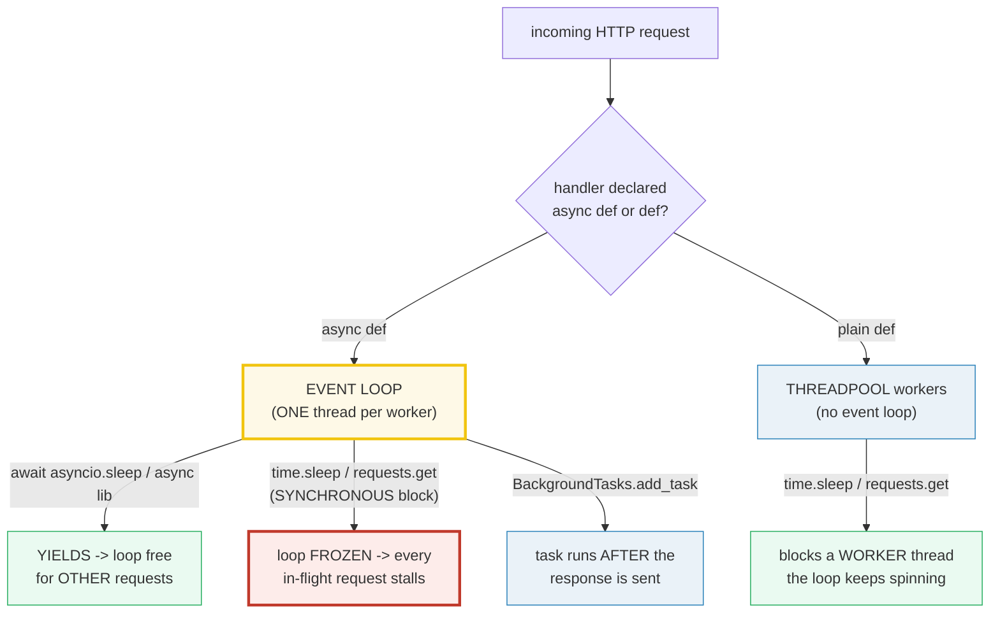
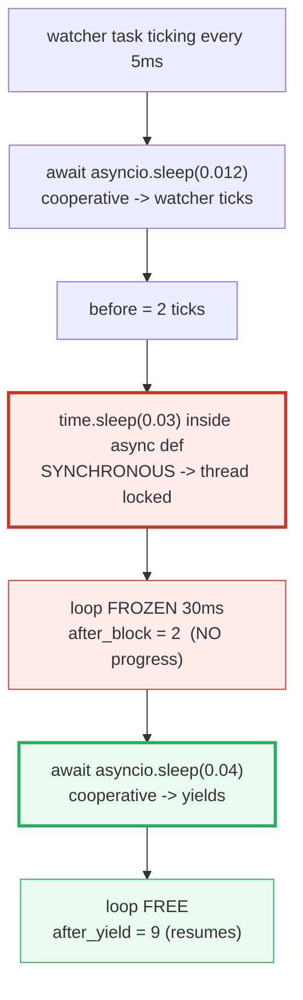

# FastAPI Async — The Event Loop, the Threadpool, and the Blocking Trap

> **The one rule:** FastAPI runs **one event loop per worker**. An `async def`
> handler is called **directly on that loop** — so `await` overlaps I/O and a
> blocking call (`time.sleep`, `requests.get`) freezes **every** in-flight
> request. A plain `def` handler is offloaded to a **threadpool worker** that
> has *no* event loop, so blocking there is safe. `BackgroundTasks` run
> **after** the response is sent. Pick `async` only when you actually `await`.

**Companion code:** [`fastapi_async.py`](./fastapi_async.py).
**Every value and ordering below is printed by `uv run python
fastapi_async.py`** — it drives the app with `TestClient`, so the whole thing
runs synchronously and deterministically. Change the code, re-run, re-paste.
Nothing here is hand-computed. Captured stdout lives in
[`fastapi_async_output.txt`](./fastapi_async_output.txt).

**Goal of this bundle (lineage, old → new):**

> from *"I write `async def` on every handler because async is faster"*
> → *"`async def` runs on the event loop (await I/O directly); plain `def`
> > runs in a threadpool; a blocking call **inside** `async def` freezes the
> > whole loop; `BackgroundTasks` fire after the response — pick `async` only
> > when you `await`."*

🔗 This bundle is the FastAPI specialization of
[`ASYNCIO_BASICS`](./ASYNCIO_BASICS.md) (Phase 3 #21): the loop and the
blocking-call trap are the same machinery — FastAPI just routes your handlers
onto it. For real CPU parallelism (ML inference, hashing) see
[`MULTIPROCESSING`](./MULTIPROCESSING.md) (Phase 3 #20); for async DB clients
wired through `Depends` see [`FASTAPI_DEPENDENCIES`](./FASTAPI_DEPENDENCIES.md)
(Phase 7 #45); for startup/shutdown wiring see
[`FASTAPI_MIDDLEWARE_LIFESPAN`](./FASTAPI_MIDDLEWARE_LIFESPAN.md) (Phase 7 #47).

---

## 0. The one picture



| Question | Answer |
|---|---|
| Where does an `async def` handler run? | **On the event loop**, directly awaited by Starlette. |
| Where does a plain `def` handler run? | In an **external threadpool** worker thread; the loop then `await`s its result. |
| Is a blocking call safe in `async def`? | **No** — it freezes the single loop, stalling every in-flight request. |
| Is a blocking call safe in plain `def`? | **Yes** — it blocks a worker thread, not the loop. |
| When do `BackgroundTasks` run? | **After** the response body is built and sent (in the same request's flow). |
| Does any of this give CPU parallelism? | **No** — it's concurrency (overlapped I/O). CPU work needs separate processes. |

---

## 1. `async def` handler — `await` yields, the loop stays free

An `async def` path operation is a **coroutine**. Starlette `await`s it on the
event loop. The moment the handler `await`s something that *suspends* (an async
DB call, `httpx.AsyncClient`, `asyncio.sleep`), control returns to the loop and
it can drive **other** requests. The demo proves it from inside a handler: a
background `asyncio` task (`watcher`) ticks **fully** during the handler's own
`await asyncio.sleep`, because the loop was free to run it.

> From `fastapi_async.py` Section A:
> ```
> ======================================================================
> SECTION A — async def handler: await yields, the loop stays free
> ======================================================================
> GET /a -> 200 {'handler': 'async', 'awaited': True, 'watcher_ticks': 3}
> asyncio.iscoroutinefunction(a) -> True
> (the watcher ticked DURING the awaited sleep -> loop was free)
> 
> [check] GET /a returned 200: OK
> [check] a is a coroutine function (async def): OK
> [check] watcher ticked fully during the awaited sleep (loop was free): OK
> ```

### Why the loop stays free (internals)

`await asyncio.sleep(x)` registers a timer callback `x` seconds in the future
and suspends the coroutine — it does **not** spin or block. The loop's `while
True:` is then free to pop the next ready callback (the `watcher`'s next tick,
or another request's handler). The `watcher_ticks: 3` result is the proof: the
watcher ran to completion *while* `/a` was "sleeping", which is only possible
because `await` handed control back. This is the entire performance model of a
FastAPI server: turn a **sum** of I/O latencies (one request blocks until its
DB call returns) into a **max** (many requests' DB calls overlap on one loop).
🔗 The loop itself — `asyncio.run`, `create_task`, `gather` — is dissected in
[`ASYNCIO_BASICS`](./ASYNCIO_BASICS.md) (Phase 3 #21).

---

## 2. Plain `def` handler — runs in a threadpool worker (no loop)

A handler declared with plain `def` is **not** a coroutine. Starlette cannot
`await` it directly, so it runs the function in an **external threadpool** and
`await`s the wrapper. The FastAPI [concurrency docs](https://fastapi.tiangolo.com/async/)
say it plainly: *"When you declare a path operation function with normal `def`
instead of `async def`, it is run in an external threadpool that is then
awaited, instead of being called directly (as it would block the server)."*

The demo detects this structurally: inside the `def` handler it calls
`asyncio.get_running_loop()`, which **raises `RuntimeError`** — proving the
handler is executing on a thread with **no** running event loop (a threadpool
worker), so a blocking call there cannot freeze the loop.

> From `fastapi_async.py` Section B:
> ```
> ======================================================================
> SECTION B — plain def handler: runs in a threadpool worker (no loop)
> ======================================================================
> GET /s -> 200 {'handler': 'sync', 'thread': 'AnyIO worker thread', 'has_running_loop': False}
> asyncio.iscoroutinefunction(s) -> False
> (worker thread has no running loop -> blocking call is safe here)
> 
> [check] GET /s returned 200: OK
> [check] s is NOT a coroutine function (plain def): OK
> [check] sync handler ran OFF the event loop (threadpool worker thread): OK
> ```

> **Reproducibility note:** the thread name (`AnyIO worker thread`) is the
> anyio/Starlette threadpool; the **invariant** is `has_running_loop: False`
> — the worker thread provably has no running loop, which is why blocking I/O
> there is safe. (Starlette/anyio back FastAPI's concurrency; see Sources.)

### Why `def` is the right home for blocking libraries (internals)

The rule follows from §1 + §2 together. If your handler body calls a **blocking
sync** library (`requests`, `psycopg2`, a sync SDK), you have two choices:

1. Declare it `async def` and call the blocking lib → **catastrophe**: the call
   runs on the loop, blocks the thread, and §3's trap fires.
2. Declare it plain `def` → Starlette runs it in the threadpool, the loop keeps
   spinning for other requests, and only *that* worker thread is busy. ✓

This is exactly why the FastAPI "In a hurry?" guidance says: *"If you are using
a third party library that … doesn't have support for using `await` … declare
your path operation functions as normally, with just `def`."* The threadpool
absorbs the block. (Dependencies follow the **same** rule: a `def` dependency is
threadpooled too — 🔗 see [`FASTAPI_DEPENDENCIES`](./FASTAPI_DEPENDENCIES.md),
Phase 7 #45.)

---

## 3. THE trap — a blocking call inside `async def` freezes the loop

This is the single most expensive FastAPI mistake. A handler declared `async
def` runs **on the loop**. A synchronous blocking call inside it — `time.sleep`,
`requests.get`, `open().read()` on a slow disk, a tight CPU loop — **never
yields**, so the loop's `while True:` cannot advance. Under a real uvicorn
worker there is **one** loop shared by **every** in-flight request, so they all
stall for the full duration of the block — not just this handler.

The demo makes it concrete: the `/bad` handler spawns a `watcher` task that
ticks every 5 ms, then calls `time.sleep(0.03)`. During that 30 ms the watcher
makes **zero** progress (`after_block == before`); the moment the handler does a
real `await asyncio.sleep`, the loop is freed and the watcher races forward
(`after_yield` jumps from 2 to 9).



> From `fastapi_async.py` Section C:
> ```
> ======================================================================
> SECTION C — THE TRAP: time.sleep inside async def freezes the loop
> ======================================================================
> GET /bad -> 200 {'before': 2, 'after_block': 2, 'after_yield': 9}
>   before time.sleep       : 2
>   AFTER  time.sleep(0.03) : 2   <- NO progress
>   AFTER  asyncio.sleep    : 9   <- resumes
> (under a real server this freezes EVERY in-flight request, not
>  just this one — the loop is shared across all of them)
> 
> [check] GET /bad returned 200: OK
> [check] watcher made NO progress during time.sleep (loop frozen): OK
> [check] watcher RESUMED after the cooperative asyncio.sleep: OK
> ```

> **Reproducibility note:** the exact tick counts (`2`, `9`) drift with
> scheduling; the **invariants** are `after_block == before` (frozen) and
> `after_yield > after_block` (resumed), and those always hold.

### Why this is catastrophic at scale (internals) & the fix

A uvicorn worker is one process running one event loop. While `/bad`'s
`time.sleep(0.03)` runs, that loop is **dead** — incoming requests are accepted
into the socket buffer but no handler coroutine advances, health checks time
out, and p50/p99 latency spikes. Multiply one 30 ms block by many concurrent
users and throughput collapses. The fixes, in order of preference:

1. **Use the async equivalent** of the blocking lib: `httpx.AsyncClient` for
   HTTP, `asyncpg`/`aiosqlite`/`motor` for DBs, `aiofiles` for files. Then keep
   the handler `async def` and `await` it — this is what §1's overlap buys you.
2. **Offload the blocking call to a thread** with
   `await asyncio.to_thread(blocking_fn, *args)` inside `async def`. The loop
   keeps spinning while a threadpool worker runs the block (GIL means this helps
   for I/O-bound blocking, not CPU).
3. **Declare the handler plain `def`** so Starlette threadpools the whole thing
   (§2). Simplest; fine when the entire handler is blocking.

🔗 `asyncio.to_thread` and the GIL-vs-thread nuance are covered in
[`ASYNCIO_BASICS`](./ASYNCIO_BASICS.md) (Phase 3 #21, §5).

---

## 4. When to use `async def` vs plain `def` (the decision)

The two rules collapse into one heuristic: **match the declaration to the work
the body does.** If the body `await`s an async-capable lib, use `async def`
(the await keeps the loop free). If the body calls a blocking sync lib, use plain
`def` (Starlette threadpools it → safe). The only outright bug is the §3
combination — `async def` + a blocking call.

> From `fastapi_async.py` Section D:
> ```
> ======================================================================
> SECTION D — When to use async def vs plain def
> ======================================================================
> Rule (FastAPI concurrency docs): a `def` path operation is run in
> an external threadpool that is then awaited; an `async def` path
> operation is called DIRECTLY on the event loop. So match the
> declaration to the work the body does:
> 
> handler body calls...                           declare as  why
> ------------------------------------------------------------------------------------
> await conn.fetch(...)  (asyncpg / async DB)     async def   await yields; loop free for other requests
> await client.get(...)  (httpx.AsyncClient)      async def   non-blocking HTTP; overlaps other I/O
> requests.get(...)  (sync HTTP lib)              def         threadpooled -> blocks a worker, not the loop
> time.sleep(x) / psycopg2 query (sync)           def         FastAPI threadpools it -> safe
> pure CPU, no I/O (e.g. json.dumps)              async def   no threadpool hop; stays on the loop
> 
> [check] await-able async lib -> declare the handler async def: OK
> [check] blocking sync lib -> declare the handler plain def (threadpooled): OK
> ```

### Why "pure CPU → `async def`" surprises people (the subtle bit)

FastAPI's docs note a counterintuitive case: a **pure-CPU, no-I/O** handler
(e.g. trivial `json.dumps`, a quick computation) is *better* as `async def`
than as plain `def`. Why? A `def` handler pays a **threadpool hop** (submit the
function to a worker thread, await the wrapper, marshal the result back) — that
round-trip costs ~microseconds and is pure overhead when the function itself
isn't blocking. `async def` runs it inline on the loop with no hop. The trap,
of course, is that "quick CPU" can grow into "slow CPU", at which point you're
back in §3 — so only use `async def` here when the work is genuinely fast and
non-blocking. Real CPU-bound work (ML inference, hashing big payloads) belongs
in a process pool or a separate worker service — 🔗 see
[`MULTIPROCESSING`](./MULTIPROCESSING.md) (Phase 3 #20) and §6 below.

---

## 5. `BackgroundTasks` — the response is sent *before* the task runs

`BackgroundTasks` (imported from `fastapi`, sourced from
[`starlette.background`](https://www.starlette.dev/background/)) lets a handler
return immediately and schedule work to run **after** the response is sent.
The [docs](https://fastapi.tiangolo.com/tutorial/background-tasks/) state it
directly: *"You can define background tasks to be run after returning a
response."* You call `.add_task(func, *args, **kwargs)`; the function may be
`async def` or plain `def` (Starlette runs each appropriately).

The demo proves the ordering deterministically: the `/x` handler snapshots the
shared `BG_LOG` into the response **before** returning, then schedules a task
that appends to `BG_LOG`. The response body's `at_response` is therefore `[]`
(task hadn't run yet), while after `client.post()` returns `BG_LOG` contains
`'ran-after-response'` — the task ran after the response body was built.


> From `fastapi_async.py` Section E:
> ```
> ======================================================================
> SECTION E — BackgroundTasks: the response is sent BEFORE the task runs
> ======================================================================
> POST /x -> 200 {'returned': True, 'at_response': []}
> BG_LOG right after client.post() returns -> ['ran-after-response']
> (response body's 'at_response' was snapshotted BEFORE the task;
>  BG_LOG is populated only AFTER the response was sent)
> 
> [check] POST /x returned 200: OK
> [check] response body built BEFORE the task ran (at_response is empty): OK
> [check] background task ran AFTER the response (BG_LOG now populated): OK
> ```

### Why it's "after the response" and not background-parallel (internals)

Starlette's `Response.__call__` first sends the HTTP head and body via the ASGI
`send` callable, and **only then** `await`s `self.background()` — the
`BackgroundTasks` object, which runs each registered function in order. So the
client has already received the full response (low latency) when the task
executes, but the task still runs **on the same event loop / in the same
request flow** — it is concurrency, not parallelism. Three consequences experts
know:

- A `BackgroundTask` that blocks (`time.sleep`) inside an `async def` task
  function freezes the loop exactly like §3 — "background" does not mean
  "off the loop".
- Background tasks share the worker's loop, so they compete with new requests
  for CPU/loop time. They're ideal for **small, fast** post-response work
  (write a log row, fire a webhook, invalidate a cache). The docs explicitly
  recommend a real queue ([Celery](https://docs.celeryq.dev) + Redis/RabbitMQ)
  for heavy work or work that must survive a crash / scale across servers.
- Because the response is sent first, **failures in a background task cannot
  reach the client** — log them, or the client never learns the work failed.

🔗 `BackgroundTasks` can also be injected as a dependency (merged across the
dep tree); that pattern lives in
[`FASTAPI_DEPENDENCIES`](./FASTAPI_DEPENDENCIES.md) (Phase 7 #45).

---

## 6. Concurrency vs parallelism — async overlaps I/O, not CPU

A FastAPI app runs **one event loop per worker process** (uvicorn `-w N` spawns
N processes, each its own interpreter + loop + GIL). `await` overlaps **I/O
waits** across many requests on that one thread — that is *concurrency*, not
*parallelism*: only one handler executes a Python instruction at any instant.
CPU-bound work (hashing, image processing, ML inference) that never `await`s
blocks the loop **exactly like** `time.sleep` does (proven in
[`ASYNCIO_BASICS`](./ASYNCIO_BASICS.md) §7). For real CPU throughput you need
separate processes or an offloaded worker.

> From `fastapi_async.py` Section F:
> ```
> ======================================================================
> SECTION F — Concurrency vs parallelism: async overlaps I/O, not CPU
> ======================================================================
> A FastAPI app runs ONE event loop per worker. `await` overlaps I/O
> WAITS across many requests on that one thread — that is concurrency,
> NOT parallelism. CPU-bound work (hashing, ML inference) must go to
> separate processes: a tight CPU loop never yields, so it blocks the
> loop exactly like time.sleep does.
> 
> workload                        runs where              scale via
> ----------------------------------------------------------------------------
> many slow I/O requests          the event loop          async handlers + async libs
> quick blocking I/O              threadpool workers      def handlers (auto-pooled)
> CPU-bound (hash, ML)            separate processes      gunicorn workers / ProcessPool
> fire-and-forget cleanup         BackgroundTasks         same loop, after the response
> 
> [check] async overlaps I/O on one loop (concurrency, not parallelism): OK
> [check] CPU parallelism needs separate processes (the loop is one thread): OK
> ```

🔗 **The loop & GIL:** [`ASYNCIO_BASICS`](./ASYNCIO_BASICS.md) (Phase 3 #21)
proves the CPU-loop-blocks-the-loop trap with a runnable example; the GIL is
why threads don't help for CPU. 🔗 **Real CPU parallelism:**
[`MULTIPROCESSING`](./MULTIPROCESSING.md) (Phase 3 #20) is the only model that
spawns separate interpreters with separate GILs. In production, scale a FastAPI
service by running **multiple uvicorn/gunicorn worker processes** (one loop
each) behind a reverse proxy, and offload ML to a process pool or a dedicated
inference service. 🔗 **Startup/shutdown:** wiring expensive setup (DB pools,
model loads) at process start is the job of the lifespan — see
[`FASTAPI_MIDDLEWARE_LIFESPAN`](./FASTAPI_MIDDLEWARE_LIFESPAN.md) (Phase 7 #47).

---

## Pitfalls

| Trap | Example | The fix |
|---|---|---|
| Blocking call inside `async def` | `requests.get()` / `time.sleep()` in an `async def` handler freezes the whole loop (§3) | use the async lib (`httpx.AsyncClient`, `asyncpg`); or `await asyncio.to_thread(fn)`; or declare the handler plain `def` |
| `async def` everywhere "for speed" | a blocking sync lib wrapped in `async def` is **slower** than plain `def` (loop frozen) | match the declaration to the work: `await` async lib → `async def`; blocking lib → `def` |
| Calling a sync DB driver from `async def` | `psycopg2` query inside `async def` stalls every request | use `asyncpg`/`aiosqlite`/`motor`; or make the handler `def`; or `await asyncio.to_thread` |
| Assuming `BackgroundTasks` are parallel/off-loop | a blocking `async def` background task freezes the loop just like §3 | keep tasks small & fast; move heavy work to Celery + a queue |
| Expecting the client to see a background-task failure | response is sent before the task runs, so task errors can't reach the client | log task errors; use a durable queue if the work must not be lost |
| Treating async as CPU parallelism | a tight CPU loop in a handler blocks the loop (one thread) | offload to `ProcessPoolExecutor` or a separate worker process; run multiple uvicorn workers |
| Plain `def` handler that's trivially fast | pays a threadpool hop for no benefit | use `async def` for pure-CPU/no-I/O work to avoid the hop (§4) |
| Forgetting dependencies follow the same rule | a `def` dependency doing blocking I/O is fine; an `async def` dependency doing blocking I/O is the §3 trap | 🔗 see [`FASTAPI_DEPENDENCIES`](./FASTAPI_DEPENDENCIES.md) |
| Mixing `BackgroundTask` (singular) vs `BackgroundTasks` | `starlette.background.BackgroundTask` won't be auto-injected by FastAPI | use `BackgroundTasks` (plural) from `fastapi` so FastAPI wires it as a parameter |
| Confusing one-loop-per-worker with one global loop | assuming CPU work in worker A blocks worker B | workers are separate processes with separate loops; inter-worker CPU work doesn't block, intra-worker does |

---

## Cheat sheet

- **`async def` handler:** runs **directly on the event loop**. `await`
  async-capable I/O (`httpx.AsyncClient`, `asyncpg`, `asyncio.sleep`) to keep
  the loop free for other requests. A blocking call here freezes **every**
  in-flight request (§3).
- **plain `def` handler:** runs in an **external threadpool** worker (no running
  loop — `asyncio.get_running_loop()` raises). Blocking sync libs are **safe**
  here: they block a worker, not the loop (§2).
- **The decision:** `await` an async lib → `async def`; call a blocking sync lib
  → plain `def`; trivially-fast pure CPU → `async def` (no threadpool hop) (§4).
- **The trap:** `time.sleep` / `requests.get` / a tight CPU loop inside
  `async def` freezes the single shared loop. Fix: async lib, or
  `await asyncio.to_thread(fn)`, or declare the handler `def`.
- **`BackgroundTasks`:** `.add_task(fn, *args, **kwargs)` schedules `fn` to run
  **after** the response is sent, on the same loop. Good for small fast work;
  use Celery + a queue for heavy/durable work (§5).
- **Concurrency vs parallelism:** one loop per worker = overlapped **I/O**
  (concurrency). Real **CPU** parallelism needs separate processes
  (`multiprocessing`, multiple uvicorn/gunicorn workers, or an offloaded
  service) — 🔗 [`ASYNCIO_BASICS`](./ASYNCIO_BASICS.md), [`MULTIPROCESSING`](./MULTIPROCESSING.md).
- **Testing:** drive the app synchronously with `fastapi.testclient.TestClient`
  (`TestClient(app)` then `client.get(...)`); background tasks complete before
  the call returns, so snapshot state *inside* the handler to observe the
  pre-task ordering (§5).

---

## Sources

- **FastAPI docs — Concurrency and async / await.**
  https://fastapi.tiangolo.com/async/
  *The authoritative source for the `async def` vs `def` routing. Quoted
  verbatim in §2 and §4: "When you declare a path operation function with
  normal `def` instead of `async def`, it is run in an external threadpool that
  is then awaited, instead of being called directly (as it would block the
  server)." Also the "In a hurry?" decision guidance and the note that
  dependencies follow the same rule.*
- **FastAPI docs — Background Tasks.**
  https://fastapi.tiangolo.com/tutorial/background-tasks/
  *Defines `.add_task(func, *args, **kwargs)`, that tasks run "after returning a
  response", that `BackgroundTasks` comes from `starlette.background`, and that
  Celery is recommended for heavy/durable work. Basis for §5.*
- **FastAPI docs — Very Technical Details (Dependencies & Sub-dependencies).**
  https://fastapi.tiangolo.com/async/#dependencies
  *Confirms a standard `def` dependency (not just path operation) is "called on
  an external thread (from the threadpool) instead of being awaited." Referenced
  in §2 and the 🔗 FASTAPI_DEPENDENCIES cross-reference.*
- **Starlette docs — Background.**
  https://www.starlette.dev/background/
  *The underlying implementation: `BackgroundTasks` runs after the response is
  sent; supports `async def` and plain `def` task functions. Underpins §5.*
- **Starlette source — `run_in_threadpool` (anyio).**
  https://www.starlette.io/applications/#running-sync-code-in-async-views
  *Starlette routes plain `def` path operations through
  `anyio.to_thread.run_sync`, which runs them on a worker thread with no running
  event loop — the mechanism that makes §B's `has_running_loop: False`
  deterministically true.*
- **Python docs — `asyncio`: Coroutines and Tasks (blocking calls).**
  https://docs.python.org/3/library/asyncio-dev.html#asyncio-blocking
  *"Long-running CPU-bound functions … block the event loop … if any function
  call takes a long time to complete, the event loop will not be able to run
  other tasks during that time." The general principle behind §3.*
- **`asyncio.to_thread`.**
  https://docs.python.org/3/library/asyncio-task.html#asyncio.to_thread
  *The recommended offload path for blocking I/O inside `async def` (§3 fix).*
- **Sibling bundle — [`ASYNCIO_BASICS`](./ASYNCIO_BASICS.md) (Phase 3 #21).**
  *The event-loop / blocking-call fundamentals this bundle specializes for
  FastAPI. §5 there proves `time.sleep` freezes the loop with a runnable
  watcher; §7 there proves a CPU loop blocks every coroutine.*
- **Sibling bundle — [`MULTIPROCESSING`](./MULTIPROCESSING.md) (Phase 3 #20).**
  *The only one of asyncio/threads/processes that gives real CPU parallelism —
  referenced in §6 for where ML/hashing work actually belongs.*
