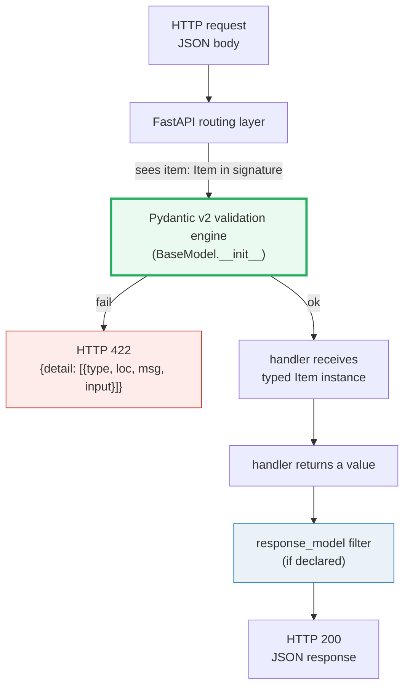

# FastAPI Bodies & Pydantic — Typed Request/Response I/O with 422s for Free

> **The one rule:** a Pydantic `BaseModel` declared in a FastAPI handler
> signature **is the request body**. FastAPI reads the incoming JSON, runs it
> through Pydantic's validation engine, and hands your handler a **typed
> instance** — not a `dict`. Bad input never reaches your code: it short-circuits
> to a structured **HTTP 422** with a `detail` list that pinpoints the failing
> field via `loc`. `Field(...)` adds constraints, `response_model=` filters the
> output, and enums/datetimes serialize themselves. You write type hints; the
> framework gives you end-to-end typed I/O.

**Companion code:** [`fastapi_bodies_pydantic.py`](./fastapi_bodies_pydantic.py).
**Every status code, 422 `loc`, and JSON body below is printed by `uv run python
fastapi_bodies_pydantic.py`** via `fastapi.testclient.TestClient` — no uvicorn,
no network. Change the code, re-run, re-paste. Nothing here is hand-computed.
Captured stdout lives in
[`fastapi_bodies_pydantic_output.txt`](./fastapi_bodies_pydantic_output.txt).

**Goal of this bundle (lineage, old → new):**

> from *"I read the request JSON by hand with `await request.json()` and validate
> each field with `if`/`raise`"*
> → *"a Pydantic `BaseModel` in the handler signature IS a validated request
> body; `Field` constraints + `response_model` give me end-to-end typed I/O with
> 422s for free, and nested/optional/extra-forbid models compose without
> boilerplate."*

🔗 This is bundle **#44 of Phase 7**. It builds directly on:
- [`FASTAPI_ROUTING_PARAMS`](./FASTAPI_ROUTING_PARAMS.md) (P7 #43) — path &
  query parameters. **This bundle adds the third source: the request BODY**,
  carried by a Pydantic model. The disambiguation rule (path → body → query by
  parameter *type*) in §7 is the union of both bundles.
- [`TYPE_HINTS`](./TYPE_HINTS.md) (P3 #18) — annotations are runtime-readable
  via `__annotations__`. **Pydantic v2 is the validation engine that actually
  enforces them** at model-instantiation time; FastAPI just hooks that engine
  into the request pipeline.
- `FASTAPI_DEPENDENCIES` (P7 #45, planned) — the same signature inspection
  that turns `item: Item` into a body turns `db: Session = Depends(...)` into a
  dependency. Same machinery, different `Depends()` marker.

---

## 0. The three ideas on one page



| Question | Mechanism | Failure mode |
|---|---|---|
| "Where does FastAPI get the body?" | A parameter **typed as a `BaseModel` subclass** | no such param → no body parsed |
| "How are constraints expressed?" | `Field(gt=0, min_length=2, pattern=...)` on model fields | violation → **422** with a typed `detail` entry |
| "How is the response shaped?" | `@app.get("/", response_model=Out)` filters the return value | fields not in `Out` are **dropped**, not leaked |
| "What about extra/unknown fields?" | `model_config = ConfigDict(extra='forbid'|'ignore')` | `'forbid'` → **422**; `'ignore'` → silently dropped (default) |

---

## 1. A `BaseModel` in the signature **is** the JSON body

The smallest possible FastAPI body handler:

```python
from fastapi import FastAPI
from pydantic import BaseModel

class Item(BaseModel):
    name: str
    price: float

app = FastAPI()

@app.post("/items")
def create_item(item: Item) -> dict:
    return {"name": item.name, "price": item.price}  # `item` is a typed Item
```

Posting `{"name":"widget","price":9.99}` makes FastAPI: (1) read the body as
JSON, (2) call `Item(**parsed)` (Pydantic v2 validation), (3) hand the resulting
`Item` instance to `create_item`. **`item` is never a `dict`** — it's an
attribute-accessible object with completion, type checks, and the full Pydantic
API (`item.model_dump()`, `item.model_validate(...)`, etc.).

> From `fastapi_bodies_pydantic.py` Section A:
> ```
> ======================================================================
> SECTION A — A Pydantic model in the signature IS the JSON body
> ======================================================================
> Posting JSON to /items; FastAPI parses it into a validated `Item`
> instance and hands that to the handler. The handler echoes 3 fields.
> 
> POST /items {'name': 'widget', 'price': 9.99, 'sku': 'ABC123', 'quantity': 5}
>   status: 200
>   body:   {'name': 'widget', 'price': 9.99, 'tag': None}
> 
> [check] status == 200 for valid body: OK
> [check] handler received typed Item (name echoed): OK
> [check] price preserved as float: OK
> [check] optional `tag` defaults to None: OK
> ```

### Why this works — FastAPI's signature inspection (internals)

FastAPI does **not** look at the JSON. It looks at the **function signature**.
At route-registration time (`@app.post(...)`), `fastapi.dependencies.utils`
calls `inspect.signature(handler)` and, for each parameter, decides its source:

- **Pydantic `BaseModel` subclass** → request body (this bundle).
- **Singular scalar** (`int`, `str`, `float`, `bool`, `enum`, ...) → query
  parameter (🔗 covered in [`FASTAPI_ROUTING_PARAMS`](./FASTAPI_ROUTING_PARAMS.md)).
- **Annotated with `Path(...)` / `Query(...)` / `Body(...)` / `Cookie(...)` /
  `Header(...)`** → that explicit source.

At request time, the body source pulls `await request.json()`, splats it into
`Item(**data)`, and **Pydantic v2's validation engine runs** — that's the same
engine you'd call directly via `Item.model_validate(data)`. If validation
raises `pydantic.ValidationError`, FastAPI catches it and returns 422 (below).
The model is then injected as the parameter value. There is no intermediate
`dict` step on the happy path.

🔗 The signature-inspection mechanism is the *same* one that powers
`Depends()` for DI (see the planned `FASTAPI_DEPENDENCIES` bundle, P7 #45):
FastAPI treats `item: Item` and `db: Session = Depends(get_db)` through one
unified parameter-resolution pipeline.

---

## 2. Validation failure → **HTTP 422** with a precise `loc`

When `Item(...)` raises `ValidationError`, FastAPI maps it to an HTTP **422
Unprocessable Entity** (not 400 — the request *was* well-formed JSON, it just
failed semantic validation). The response body is a `detail` list; each entry
has `type` (a stable URI-like error code), `loc` (the path to the bad field),
`msg` (human text), and `input` (what was actually passed).

> From `fastapi_bodies_pydantic.py` Section B:
> ```
> ======================================================================
> SECTION B — Missing required field -> 422 with loc=[body,<field>]
> ======================================================================
> Posting {name:'ok'} with price/sku/quantity MISSING. Pydantic raises
> ValidationError; FastAPI maps it to HTTP 422 with a `detail` list.
> 
> POST /items {'name':'ok'}
>   status: 422
>   detail (3 errors):
>     type=missing    loc=['body', 'price']  msg='Field required'
>     type=missing    loc=['body', 'sku']  msg='Field required'
>     type=missing    loc=['body', 'quantity']  msg='Field required'
> 
> [check] status == 422 for invalid body: OK
> [check] loc points at body.price: OK
> [check] loc points at body.sku: OK
> [check] loc points at body.quantity: OK
> [check] every reported error is type 'missing': OK
> ```

### Why 422 (not 400) and why the `loc` path (internals)

The HTTP spec splits the difference: **400 Bad Request** is for malformed
syntax (non-JSON garbage, truncated body); **422 Unprocessable Entity**
(WebDAV RFC 4918, widely adopted by REST APIs) is for *syntactically valid*
content that fails *semantic* validation. FastAPI chose 422 because by the
time Pydantic sees it, the JSON has already parsed — what failed is the
*schema contract*.

The `loc` list is Pydantic's **field path**: `["body", "price"]` reads as
"inside the request body, the field `price`". For nested models it grows a
third segment (§4). The first element (`"body"`) is FastAPI's namespace tag —
the same field name could appear in `query` or `path`, so FastAPI prefixes to
disambiguate. The `type` strings (`missing`, `greater_than`,
`string_too_short`, `extra_forbidden`, `enum`, ...) are stable identifiers
defined in Pydantic v2's `PydanticUndefined` / validation error catalogue;
**clients can branch on them programmatically** instead of parsing `msg`.

🔗 The 422 contract and its OpenAPI advertisement are the same one
[`FASTAPI_ROUTING_PARAMS`](./FASTAPI_ROUTING_PARAMS.md) uses for path/query
validation — one error format, three parameter sources.

---

## 3. `Field(...)` constraints are 422 gates

Every Pydantic constraint keyword becomes a validation gate that fires *before*
your handler runs. `Field(gt=0, le=100)` on a float; `min_length`/`max_length`
on a string; `pattern` (a regex anchored with `\A`/`\Z` semantics); `ge`/`lt`
on ints. Each gate has its own `type` tag in the 422 response, so clients can
react specifically.

```python
from pydantic import BaseModel, Field

class Item(BaseModel):
    name: str     = Field(min_length=2, max_length=8)
    price: float  = Field(gt=0, le=100)
    sku: str      = Field(pattern=r"^[A-Z]{3}\d+$")
    quantity: int = Field(ge=1, lt=1000)
```

> From `fastapi_bodies_pydantic.py` Section C:
> ```
> ======================================================================
> SECTION C — Field(gt/lt/ge/le/min_length/max_length/pattern) -> 422 gates
> ======================================================================
> Each Field(...) constraint becomes a validation gate; violating any
> one yields 422 with a distinct `type` tag. Probing each gate:
> 
> probe                           status   type                      loc
> ------------------------------------------------------------------------------
> price <= 0   (gt=0)             422      greater_than              ['body', 'price']
> [check] price <= 0   (gt=0) -> 422 with greater_than at ['body', 'price']: OK
> price > 100  (le=100)           422      less_than_equal           ['body', 'price']
> [check] price > 100  (le=100) -> 422 with less_than_equal at ['body', 'price']: OK
> name 'a'     (min_length=2)     422      string_too_short          ['body', 'name']
> [check] name 'a'     (min_length=2) -> 422 with string_too_short at ['body', 'name']: OK
> name too long(max_length=8)     422      string_too_long           ['body', 'name']
> [check] name too long(max_length=8) -> 422 with string_too_long at ['body', 'name']: OK
> sku 'abc123' (pattern)          422      string_pattern_mismatch   ['body', 'sku']
> [check] sku 'abc123' (pattern) -> 422 with string_pattern_mismatch at ['body', 'sku']: OK
> quantity 0   (ge=1)             422      greater_than_equal        ['body', 'quantity']
> [check] quantity 0   (ge=1) -> 422 with greater_than_equal at ['body', 'quantity']: OK
> quantity 9999(lt=1000)          422      less_than                 ['body', 'quantity']
> [check] quantity 9999(lt=1000) -> 422 with less_than at ['body', 'quantity']: OK
> ```

### Why `pattern` uses `string_pattern_mismatch` (internals)

Pydantic v2 compiles each `pattern=` to a `regex` validator in Rust (the
`pydantic-core` engine). On mismatch it raises with `type='string_pattern_mismatch'`
and the *expected* pattern in `ctx['pattern']` — note it's `mismatch`, not the
v1 name `value_error.str.regex`. The pattern is **not** automatically anchored:
you almost always want `^...$` (or `\A...\Z`) to prevent prefix/suffix matches.
The other constraints (`gt`, `ge`, `lt`, `le`, `min_length`, `max_length`) are
primitive comparisons; their `type` tags map 1:1 to the keyword (`greater_than`,
`greater_than_equal`, `less_than`, `less_than_equal`, `string_too_short`,
`string_too_long`). Multiple gates can fire on the same field in one request —
the response carries **all** of them, not just the first.

---

## 4. Nested `BaseModel`s validate recursively

A field whose type is *itself* a `BaseModel` subclass composes: Pydantic
recurses into the sub-model, and a failure inside it produces a `loc` with an
extra segment per nesting level.

```python
class Address(BaseModel):
    city: str
    zip_code: str = Field(pattern=r"^\d{5}$")

class User(BaseModel):
    name: str
    address: Address          # nested model
    tags: list[str] = Field(default_factory=list, max_length=3)
```

> From `fastapi_bodies_pydantic.py` Section D:
> ```
> ======================================================================
> SECTION D — Nested BaseModels validate recursively (loc has 3 segments)
> ======================================================================
> User.address is an Address sub-model; errors inside it produce a
> `loc` with THREE segments: body -> address -> <field>.
> 
> POST /users {'name': 'ann', 'address': {'city': 'NYC', 'zip_code': '10001'}, 'tags': ['a', 'b']}
>   status: 200  body: {'name': 'ann', 'city': 'NYC', 'tags': 2}
> 
> POST /users {'name': 'ann', 'address': {'city': 'NYC', 'zip_code': 'bad'}}
>   status: 422
>     loc=['body', 'address', 'zip_code']  msg="String should match pattern '^\\d{5}$'"
> 
> [check] valid nested body -> 200: OK
> [check] nested ok: name == 'ann': OK
> [check] nested ok: city parsed from sub-model: OK
> [check] invalid nested -> 422: OK
> [check] loc has 3 segments (body,address,zip_code): OK
> ```

### Why the `loc` grows — Pydantic's validation tree (internals)

Pydantic v2 walks the model as a **tree of validators**: each field has a
validator function (compiled by `pydantic-core` from the type annotation), and
nested-model fields delegate to the sub-model's own validator tree. When a leaf
validator fails, `pydantic-core` bubbles the error up, **prefixing each level's
name to `loc`** as it unwinds. So `body → address → zip_code` is literally the
path from the request body root, through the `address` sub-model, to the
`zip_code` leaf. Lists add an integer index (`body → tags → 0`), dicts add the
key. This is why the 422 format scales to arbitrary depth: the `loc` is the
full address, not a flattened message.

---

## 5. Optional fields + `extra='forbid'` vs `extra='ignore'`

Two orthogonal policies:

- **Optional field:** `tag: str | None = None`. A field with a default is
  *not required*; omitting it sets it to the default. `str | None` allows
  `None` as a value (not just omission). The union type is for type-checkers;
  FastAPI decides "required" from the **presence of a default**, not from the
  annotation (per the official tutorial).
- **Unknown fields:** what happens when the client posts `{name:'x', bogus:1}`
  to a model with only `name`? Controlled by `model_config =
  ConfigDict(extra=...)`:
  - `'ignore'` (the **default**) — silently drop unknown fields.
  - `'forbid'` — reject with 422 `type='extra_forbidden'`.
  - `'allow'` — keep them on the instance (rarely wanted; bypasses typing).

> From `fastapi_bodies_pydantic.py` Section E:
> ```
> ======================================================================
> SECTION E — Optional `tag: str | None = None` + extra='forbid'/'ignore'
> ======================================================================
> Default extra policy is 'ignore' (unknown fields silently dropped).
> extra='forbid' REJECTS unknown fields with a 422 (loc=[body,<field>]).
> 
> omit optional `tag` -> tag=None
> [check] optional field omitted -> None: OK
> 
> POST /loose {'name':'x','bogus':1}  (extra='ignore')
>   status: 200  body: {'name': 'x'}
> [check] extra='ignore' drops unknown field (200): OK
> [check] extra='ignore' returned only `name`: OK
> 
> POST /strict {'name':'x','bogus':1}  (extra='forbid')
>   status: 422
>     type=extra_forbidden    loc=['body', 'bogus']  msg='Extra inputs are not permitted'
> 
> [check] extra='forbid' rejects unknown field (422): OK
> [check] extra='forbid' loc points at body.bogus: OK
> [check] extra='forbid' error type is 'extra_forbidden': OK
> ```

### Why `'ignore'` is the default, and when to flip it (internals)

Pydantic v1's default was also `'ignore'`, inherited by v2 for backward
compatibility. The rationale is **robustness**: real-world clients (browsers,
older SDKs, proxies adding headers-as-fields) routinely send extra keys, and a
strict-by-default policy would break them. The expert move is to flip to
`'forbid'` on **public** API models — it catches typos (`{"naem":"x"}`) and
schema drift early, and makes the contract self-documenting. Keep `'ignore'`
(or `'allow'`) for ingesting genuinely schemaless blobs (webhook payloads,
legacy feeds). `model_config` is the v2 replacement for v1's inner `class
Config:` — it's a `ConfigDict` (a `TypedDict`), so your editor type-checks the
keys.

---

## 6. `response_model=` filters the output

The dual of the request body: `@app.get("/", response_model=Out)` tells FastAPI
to **serialize the handler's return value through `Out`**, dropping any field
not declared on `Out`. This is how you return a richer internal object while
exposing only the public shape — no manual `del`/dict-comprehension, no leak.

```python
class ItemOut(BaseModel):
    name: str
    price: float

@app.get("/filtered", response_model=ItemOut)
def filtered() -> dict:
    return {"name": "widget", "price": 9.99, "secret": "do-not-leak"}
```

> From `fastapi_bodies_pydantic.py` Section F:
> ```
> ======================================================================
> SECTION F — response_model filters the output (drops undeclared fields)
> ======================================================================
> Handler returns a dict with a `secret` key; response_model=ItemOut
> (name, price only) strips `secret` from the serialized response.
> 
> GET /filtered  (handler returns name+price+secret)
>   status: 200
>   body:   {'name': 'widget', 'price': 9.99}
>   keys:   ['name', 'price']
> 
> [check] response_model route -> 200: OK
> [check] response_model keeps `name`: OK
> [check] response_model keeps `price`: OK
> [check] response_model DROPS `secret`: OK
> [check] only declared fields survive: OK
> ```

### Why `response_model` runs even on `dict` returns (internals)

FastAPI wraps every handler return in `jsonable_encoder` and then through the
`response_model` (if declared) via `Out.model_validate(value)`. Because
Pydantic v2's `model_validate` accepts a `dict` (and coerces), you can return a
plain `dict`, a `dataclass`, an ORM object (with `model_config =
ConfigDict(from_attributes=True)`), or another `BaseModel` — the
`response_model` is the **single serialization gate**. That gate (a) enforces
the output contract, (b) generates the OpenAPI response schema, (c) strips
fields not in `Out`, and (d) catches you accidentally returning `None` when
`Out` requires fields (→ 500). Expert pattern: use a **different** model for
input and output (`ItemIn` vs `ItemOut`) so read/write contracts diverge
intentionally — `id`, `created_at`, `hashed_password` live only on `ItemOut`
(or only on `ItemIn`).

---

## 7. Body + path + query in one signature

A handler can mix all three sources. FastAPI disambiguates by **parameter
type and name**:

- name matches a `{slot}` in the path → **path** parameter;
- type is a `BaseModel` subclass → **body** parameter;
- any other singular scalar (`int`, `str`, `float`, `bool`, `enum`, ...) →
  **query** parameter (with `= None` it's optional).

```python
@app.put("/items/{item_id}")
def update_item(item_id: int, item: Item, q: str | None = None) -> dict: ...
```

> From `fastapi_bodies_pydantic.py` Section G:
> ```
> ======================================================================
> SECTION G — Body + path + query: FastAPI disambiguates by parameter TYPE
> ======================================================================
> Rule: param matching {item_id} -> path; Pydantic model -> body;
> singular scalar (int/str/...) with a default -> query.
> 
> PUT /items/42?q=hello  json={'name': 'ok', 'price': 1.0, 'sku': 'ABC123', 'quantity': 1}
>   status: 200  body: {'item_id': 42, 'name': 'ok', 'q': 'hello'}
> 
> [check] mixed signature -> 200: OK
> [check] item_id parsed from PATH (int 42): OK
> [check] item.name parsed from BODY: OK
> [check] q parsed from QUERY ('hello'): OK
> PUT /items/7  (no ?q=)  -> q=None
> [check] q defaults to None when query absent: OK
> ```

### Why `q: str | None = None` is optional but `q: str | None` is NOT (gotcha)

The official tutorial is explicit: **FastAPI decides "required" from the
default value, not from the annotation**. `q: str | None = None` is optional
(absent → `None`); `q: str | None` (no default) is **required**, even though
the annotation mentions `None`. This trips every newcomer. The annotation is
for static checkers and OpenAPI generation; FastAPI's runtime rule is "has a
default ⇔ optional". Path parameters are the exception — they're always
required because the URL must match.

🔗 Path and query parameter validation (`Path(...)`, `Query(...)`, numeric
constraints on path slots) is the entire subject of
[`FASTAPI_ROUTING_PARAMS`](./FASTAPI_ROUTING_PARAMS.md). This bundle's §7 is
the **composition** of body (this guide) + path/query (that guide) in one
signature.

---

## 8. Serialization: enums and datetimes round-trip as JSON

The response side of the contract: Pydantic v2's serializer knows how to
JSON-encode types that `json.dumps` can't — `Enum` (→ its value), `datetime`
(→ ISO 8601), `date`, `UUID`, `Decimal`, `bytes` (→ base64), `set` (→ list),
etc. The handler returns a Python object; FastAPI serializes it. You never
write `json.dumps(..., default=...)`.

```python
class Color(str, Enum):
    red = "red"
    green = "green"

class Event(BaseModel):
    color: Color
    at: datetime
```

> From `fastapi_bodies_pydantic.py` Section H:
> ```
> ======================================================================
> SECTION H — Enum & datetime serialize cleanly to JSON (round-trip)
> ======================================================================
> Pydantic v2's serializer knows how to JSON-encode Enum (its value),
> datetime (ISO 8601), date, UUID, etc. The handler doesn't do it.
> 
> POST /events {'color': 'red', 'at': '2024-01-15T10:30:00'}
>   status: 200
>   body:   {'color': 'red', 'value': 'red', 'at_iso': '2024-01-15T10:30:00'}
> 
> POST /events {'color':'purple',...}
>   status: 422
>     type=enum     loc=['body', 'color']  msg="Input should be 'red' or 'green'"
> 
> [check] valid enum + datetime -> 200: OK
> [check] enum serializes to its value: OK
> [check] datetime round-trips as ISO 8601: OK
> [check] invalid enum value -> 422: OK
> [check] invalid enum loc is body.color: OK
> ```

### Why `Color(str, Enum)` serializes to `'red'` not `'Color.red'` (internals)

Two layers: (1) **validation** — Pydantic accepts the enum *by name or by
value*; `'red'` matches `Color.red.value` so it validates. `'purple'` matches
neither name nor value → `type='enum'` with the expected set in `ctx`. (2)
**serialization** — when FastAPI converts the response, it calls
`Color.red.model_dump()` (or the JSON encoder), which for a `str`-mixin enum
emits the string value `'red'`. A pure `Enum` (without `str` mixin) would
serialize to its `.value` too (Pydantic v2 default), but mixing in `str` makes
`Color.red == 'red'` true in plain Python too — handy for comparisons and
JSON logs. The invalid-enum error `type='enum'` (not `value_error.enum`) is
the Pydantic v2 name; clients branching on error types must use the v2
catalogue.

---

## Pitfalls

| Trap | Example | The fix |
|---|---|---|
| Thinking `q: str \| None` is optional | `def f(q: str \| None)` → FastAPI still requires it | Add a default: `q: str \| None = None`. **FastAPI decides "required" from the default, not the annotation.** |
| Forgetting to anchor `pattern=` | `Field(pattern=r"[A-Z]{3}")` matches `"ABCdef"` | Use `^...$` (or `\A...\Z`): `r"^[A-Z]{3}\d+$"`. Pydantic does not auto-anchor. |
| Returning a field not on `response_model` and assuming it's private | `return {"name":.., "secret":..}` with `response_model=ItemOut` → `secret` IS dropped, but if you skip `response_model` it leaks | Always declare `response_model=` for public endpoints; use separate `In`/`Out` models. |
| Treating 422 as 400 | client does `if r.status == 400` and misses all validation errors | Validate against **422** for Pydantic failures; reserve 400 for malformed JSON (rare — FastAPI parses JSON before Pydantic). |
| Assuming extra fields are rejected by default | `{"name":"x","typo":1}` is silently accepted | Set `model_config = ConfigDict(extra='forbid')` on public models to catch typos. |
| Mixing up Pydantic v1 vs v2 error `type`s | branching on `value_error.str.regex` (v1) never fires in v2 | Use v2 names: `string_pattern_mismatch`, `greater_than`, `missing`, `extra_forbidden`, `enum`, etc. |
| `list[str] = []` as a default | shared mutable default across requests | Use `Field(default_factory=list)`; same rule as [mutable default args](./FUNCTIONS_ARGS_SCOPE.md). |
| `Enum` not mixing in `str`/`int` | `Color.red == "red"` is `False`, OpenAPI shows `"Color.red"` | `class Color(str, Enum):` — mixin makes value-equality work and improves JSON docs. |
| Expecting `loc` to be a string | `e["loc"] == "price"` → always False | `loc` is a **list**: `["body", "price"]`; for nested models it has 3+ segments. |
| Using `model_config` as inner `class Config:` | silently ignored in v2 | v2 uses `model_config = ConfigDict(...)` (a class attribute, not an inner class). |
| Returning `None` from a handler with `response_model=` | → 500 (`None` fails validation) | Return a real model instance, or raise `HTTPException(404)`. |

---

## Cheat sheet

- **Body = a Pydantic model in the signature.** `def f(item: Item)` → FastAPI
  parses JSON, validates via `Item(**data)`, hands you a typed `Item`.
- **422, not 400, for validation failures.** Response: `{"detail": [{"type",
  "loc", "msg", "input"}]}`. `loc` is a list: `["body", <field>, ...]`.
- **`Field(...)` constraints** → 422 gates: `gt/lt/ge/le` (numbers),
  `min_length/max_length` (strings/lists), `pattern` (regex),
  `examples` (docs only, not enforced). Each has its own `type` tag.
- **Nested models** validate recursively; `loc` grows a segment per level
  (`["body", "address", "zip_code"]`).
- **Optional** = field with a default (`tag: str | None = None`). **Required** =
  no default (the annotation alone does NOT make it optional).
- **`extra`**: `'ignore'` (default, silently drops unknown) / `'forbid'` (422
  `extra_forbidden`) / `'allow'` (keeps them). Set via
  `model_config = ConfigDict(extra='forbid')`.
- **`response_model=Out`** filters the handler's return through `Out` — fields
  not on `Out` are dropped, not leaked. Use separate `In`/`Out` models for
  read/write asymmetry.
- **Body + path + query in one signature**: `{slot}` → path, `BaseModel` →
  body, other scalars → query. Path params are always required.
- **Serialization is automatic**: `Enum` → value, `datetime` → ISO 8601,
  `UUID`/`Decimal`/`bytes`/`set` all handled. You never write `json.dumps`.
- **v2 error `type`s are stable URIs**: `missing`, `greater_than`,
  `string_too_short`, `string_pattern_mismatch`, `extra_forbidden`, `enum`,
  ... Branch on them in clients, not on `msg` text.

---

## Sources

- **FastAPI tutorial — Request Body.**
  https://fastapi.tiangolo.com/tutorial/body/
  *The canonical "declare a Pydantic model in the signature" walk-through;
  the rule that a `BaseModel` parameter is the body; the body + path + query
  disambiguation in §7.* Quoted in §1 and §7.
- **FastAPI tutorial — Declare Request Example Data (`Field`, `json_schema_extra`).**
  https://fastapi.tiangolo.com/tutorial/schema-extra-example/
  *`Field(examples=[...])` adds examples to the OpenAPI schema; `model_config`
  as the v2 replacement for the inner `class Config:`.* Cited in §3 and §5.
- **FastAPI tutorial — Body - Fields.**
  https://fastapi.tiangolo.com/tutorial/body-fields/
  *`Field(gt=, le=, min_length=, max_length=, pattern=, examples=)` constraint
  keywords.* Basis for §3.
- **FastAPI tutorial — Body - Nested Models.**
  https://fastapi.tiangolo.com/tutorial/body-nested-models/
  *Recursive validation of sub-models and `list[SubModel]` fields.* Basis for §4.
- **FastAPI tutorial — Response Model.**
  https://fastapi.tiangolo.com/tutorial/response-model/
  *`response_model=Out` filters the output and generates the response OpenAPI
  schema.* Basis for §6.
- **FastAPI tutorial — Handling Errors (RequestValidationError → 422).**
  https://fastapi.tiangolo.com/tutorial/handling-errors/
  *FastAPI's `RequestValidationError` handler emits the `{detail: [...]}` body
  with `type/loc/msg/input`. The choice of **422** (not 400) for validation
  failure.* Cited in §2.
- **Pydantic v2 docs — Models.**
  https://docs.pydantic.dev/latest/concepts/models/
  *`BaseModel`, `model_config = ConfigDict(...)`, `model_validate`,
  `model_dump`, default values, `Field(...)`.* Basis for §1, §5, and the
  internals notes throughout.
- **Pydantic v2 docs — Fields.**
  https://docs.pydantic.dev/latest/concepts/fields/
  *The full list of `Field(...` constraints (`gt`, `ge`, `lt`, `le`,
  `min_length`, `max_length`, `pattern`), their semantics, and the note that
  `pattern` is **not** auto-anchored.* Quoted in §3.
- **Pydantic v2 docs — Model Config (`extra`).**
  https://docs.pydantic.dev/latest/api/config/
  *`extra='ignore' | 'forbid' | 'allow'`; `'ignore'` is the default. The
  `ConfigDict` TypedDict that replaces v1's inner `class Config:`.* Cited in §5.
- **Pydantic v2 docs — Validation Errors.**
  https://docs.pydantic.dev/latest/errors/errors/
  *The stable `type` catalogue (`missing`, `greater_than`, `string_too_short`,
  `string_pattern_mismatch`, `extra_forbidden`, `enum`, ...) and the `loc`
  path semantics.* Basis for the §2/§3/§4 error-type tables.
- **Pydantic v2 docs — Enum and Datetime serialization.**
  https://docs.pydantic.dev/latest/concepts/fields/#optional-fields
  https://docs.pydantic.dev/latest/concepts/json_schema/
  *Enums serialize to their value; `datetime` to ISO 8601; the serializer is
  Pydantic's, not the handler's.* Basis for §8.
- **RFC 4918 (WebDAV) — 422 Unprocessable Entity.**
  https://datatracker.ietf.org/doc/html/rfc4918#section-11.2
  *The semantic distinction FastAPI relies on: 422 = "the server understands
  the content type but was unable to process the contained instructions."*
  Referenced in the §2 internals note.
