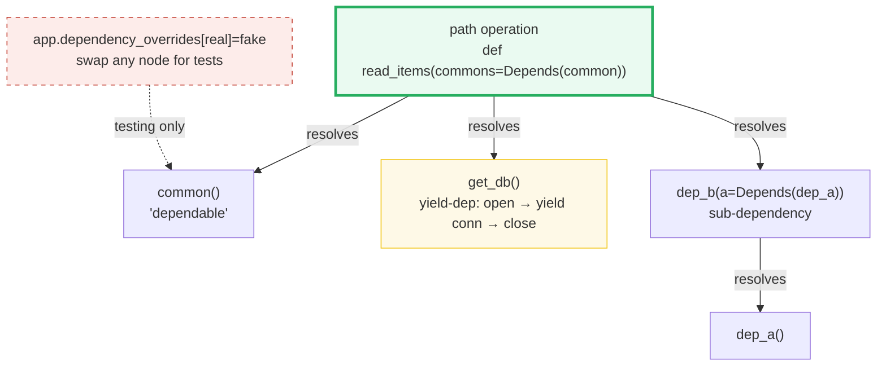
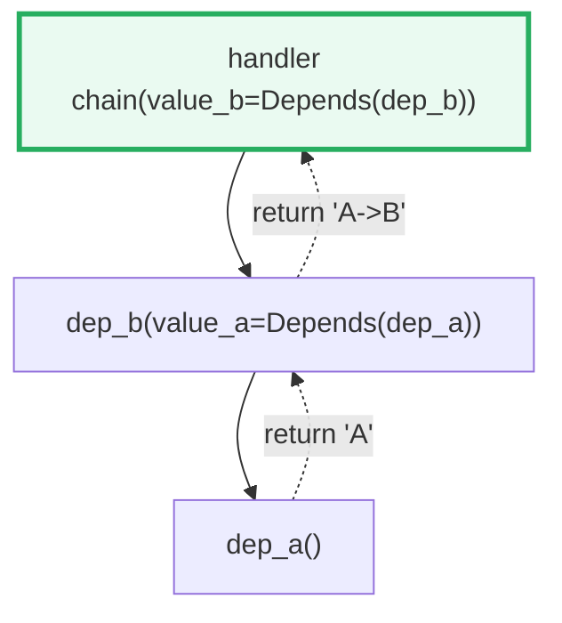
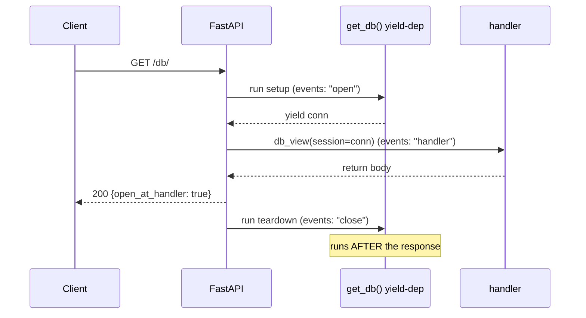
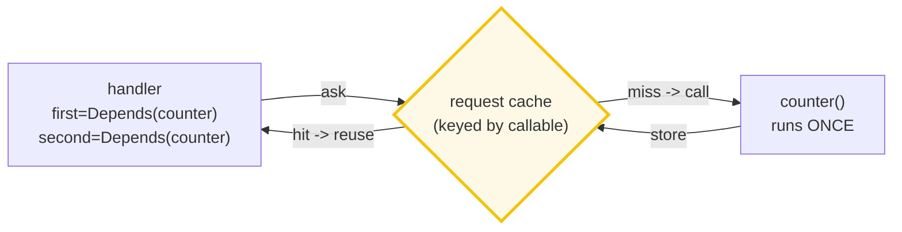
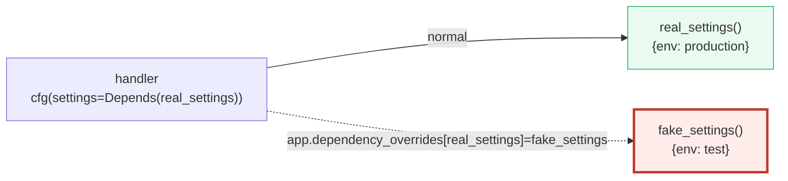

# FastAPI Dependencies — `Depends()`, the Resolution Graph, and `yield` Setup/Teardown

> **The one rule:** a handler should *declare what it needs*, not *fetch what it
> needs*. `Depends(fn)` tells FastAPI "call `fn` and hand me its return value";
> the framework then resolves an arbitrarily-deep graph of such deps, caches
> each one **once per request**, runs `yield`-deps as setup/teardown around the
> handler, and lets tests swap any node via `dependency_overrides`.

**Companion code:** [`fastapi_dependencies.py`](./fastapi_dependencies.py).
**Every status code and JSON body below is printed by `uv run python
fastapi_dependencies.py`** (driven through `fastapi.testclient.TestClient`) —
change the code, re-run, re-paste. Nothing here is hand-computed. Captured
stdout lives in
[`fastapi_dependencies_output.txt`](./fastapi_dependencies_output.txt).

**Goal of this bundle (lineage, old → new):**

> from *"I read headers and open DB connections inside the handler"*
> → *"FastAPI `Depends()` inverts dependencies: I declare what I need, the
> framework resolves (and caches per-request) the graph — `yield`-deps give
> setup/teardown, sub-deps compose, and tests can override any dep."*

🔗 This is bundle **#45 of Phase 7** (FastAPI). It assumes
[`FASTAPI_ROUTING_PARAMS`](./TODO.md) (#43) and
[`FASTAPI_BODIES_PYDANTIC`](./TODO.md) (#44). The `yield`-dep teardown is a
live application of [`CONTEXT_MANAGERS`](./CONTEXT_MANAGERS.md) (Phase 3 #22);
`Header()`-raising guards preview [`FASTAPI_AUTH`](./TODO.md) (#48); and
`dependency_overrides` is the central trick of
[`FASTAPI_TESTING`](./TODO.md) (#49). See [`TODO.md`](./TODO.md) for the plan.

---

## 0. The one picture



| Want | Mechanism | Section |
|---|---|---|
| Share logic / parse query params once | `def dep(): ...; handler(c=Depends(dep))` | A |
| Compose reusable building blocks | a dep that itself takes `Depends(...)` | B |
| Open a resource, **guarantee** it closes | `def dep(): yield value; cleanup` | C |
| Strong typing + editor completion | a **class** (its `__init__` is inspected) | D |
| Gate a route on a header / token | `Header()` + `raise HTTPException` | E |
| Avoid double work within one request | per-request **cache** (dep runs once) | F |
| Run a dep for *every* route | `FastAPI(dependencies=[...])` / `APIRouter` | G |
| Swap a dep in tests | `app.dependency_overrides[real] = fake` | H |

---

## 1. `Depends(fn)` — declare what you need, the framework calls it

A *dependable* is an ordinary function that takes the same kinds of parameters
a path operation does (query, path, header, body, …) and **returns** anything.
You hand the *function object* (no parentheses) to `Depends(common)`.
FastAPI then, **for every request**: calls `common(...)` with the parsed
params, takes its return value, and passes that as the `commons` argument to
your handler. You never call `common` yourself — that inversion *is* the win.


> From `fastapi_dependencies.py` Section A:
> ```
> ======================================================================
> SECTION A — Depends(fn): framework calls fn, injects its return
> ======================================================================
> A 'dependable' is just a function with path-op-style params.
> FastAPI calls it for you and passes what it RETURNS to the handler.
> 
> GET /items/?q=foo&skip=5  -> 200
> handler received (injected): {'q': 'foo', 'skip': 5, 'limit': 100}
> 
> [check] Depends(common) injects common()'s return dict: OK
> [check] defaults fill in (limit=100): OK
> ```

### Why this is "inversion" (internals)

Without DI the handler *pulls*: it reaches into the request, parses `q`,
validates `skip`, and builds its own dict — so parsing logic is duplicated
across every endpoint. With `Depends` the handler *declares*: "give me the
result of `common`". FastAPI's dependency machinery (in `fastapi.dependencies`)
walks the parameter list with `inspect.signature`, treats any `Depends(...)`
default as a sub-problem, resolves it recursively, and **injects** the result.
The handler knows nothing about HTTP parsing — only about the *value* it
received. That is dependency inversion: the high-level policy (the handler)
no longer owns the low-level detail (param extraction).

---

## 2. Sub-dependencies — a dep can depend on a dep

A dependency function may declare `Depends(...)` in **its own** signature.
FastAPI builds a directed graph and resolves it **leaves-first**: `dep_a`
runs before `dep_b`, `dep_b` before the handler, and each result is threaded
upward. The graph can be arbitrarily deep.



> From `fastapi_dependencies.py` Section B:
> ```
> ======================================================================
> SECTION B — Sub-dependencies: a→b→handler resolves in order
> ======================================================================
> A dependency may declare its OWN Depends(). FastAPI builds the
> graph and resolves leaves-first, so each dep gets its inputs.
> 
> GET /chain/  -> 200
> body: {'value_b': 'A->B', 'order': ['a', 'b', 'handler']}
> 
> [check] chain resolved leaves-first: a, then b, then handler: OK
> [check] dep_a's value flowed THROUGH dep_b to the handler: OK
> ```

The `order` list (`['a', 'b', 'handler']`) is the proof: each dep appended to
it on entry, so the printed sequence *is* the resolution order. This is how
you compose `current_user → active_user → admin_user` ladders — each layer
adds a requirement and passes the enriched value up.

---

## 3. `yield`-dependencies — setup before, teardown after (a context manager)

Replace `return` with `yield`: everything **up to and including** the `yield`
runs as *setup* (the yielded value is injected), and everything **after** the
`yield` runs as *teardown*, **after** the response. This is the canonical
database-session / resource pattern.



> From `fastapi_dependencies.py` Section C:
> ```
> ======================================================================
> SECTION C — yield-dependency: setup before, teardown after the handler
> ======================================================================
> Use `yield` (not `return`): code BEFORE+INCLUDING yield is setup
> (the yielded value is injected); code AFTER yield is teardown that
> runs after the response. This is the DB-session / resource pattern.
> 
> GET /db/  -> 200
> body: {'open_at_handler': True}
> event log: ['open', 'handler', 'close']
> 
> [check] setup ran BEFORE the handler: OK
> [check] handler ran after setup: OK
> [check] teardown ran AFTER the handler: OK
> [check] the yielded value (open=True) was what the handler saw: OK
> ```

### Why a yield-dep *is* a context manager (internals)

The FastAPI docs state it plainly: any function valid under
`@contextlib.contextmanager` / `@contextlib.asynccontextmanager` is valid as a
yield-dependency — because **FastAPI decorates it with exactly those
internally**. The `yield` splits the function into `__enter__` (the setup) and
`__exit__` (the teardown), and FastAPI drives it the same way a `with` block
does. That is why the teardown is *guaranteed* to run even if the handler
raises — the exit path is the context-manager protocol, not ad-hoc cleanup.

🔗 The full `__enter__`/`__exit__` protocol, `ExitStack` composition, and
`@contextmanager` mechanics are in
[`CONTEXT_MANAGERS`](./CONTEXT_MANAGERS.md) (Phase 3 #22). FastAPI just reuses
that protocol at request scope.

**Expert gotcha:** if you `except SomeError` inside a yield-dep and *don't*
re-raise (or raise a new `HTTPException`), FastAPI cannot see the exception —
the client still gets a 500 but the server logs nothing. Always `raise` again.

---

## 4. A class is a dependency — FastAPI inspects `__init__`

The only real requirement is that a dependency be **callable**. A class *is*
callable (calling it constructs an instance), so FastAPI inspects its
`__init__` parameters exactly as it would a function's, parses them from the
request, then **injects the constructed instance**. This gives you typed
attributes (`p.skip`) instead of a opaque `dict`.

> From `fastapi_dependencies.py` Section D:
> ```
> ======================================================================
> SECTION D — Class as a dependency: FastAPI inspects __init__
> ======================================================================
> A dependency only needs to be CALLABLE. A class is callable (it
> builds an instance), so FastAPI inspects its __init__ params exactly
> like a path-op's, then injects the constructed INSTANCE.
> 
> GET /page/?skip=2&limit=3  -> 200
> body: {'type': 'Paginator', 'skip': 2, 'limit': 3}
> 
> [check] an INSTANCE of the class was injected (not the class itself): OK
> [check] __init__ params were parsed from the query string: OK
> ```

The `type` field is `'Paginator'`, proving the *instance* (not the class) was
injected. Shortcut: when the type annotation *is* the class, write
`p: Paginator = Depends()` (no argument) — FastAPI infers the callable.

---

## 5. `Header()` + `HTTPException` — the guard / auth dependency

A dependency that reads a `Header()` and `raise`s `HTTPException` short-
circuits the request: the handler never runs. This is the auth-guard shape.
Below, a missing **or** wrong `x-token` both yield `401`.

> From `fastapi_dependencies.py` Section E:
> ```
> ======================================================================
> SECTION E — Header() guard dependency: bad/missing token -> 401
> ======================================================================
> A dependency that reads Header() and raises HTTPException is the
> guard / auth pattern: it short-circuits the request before the
> handler ever runs.
> 
> GET /secure/                       -> 401
> GET /secure/  x-token=wrong        -> 401
> GET /secure/  x-token=secret       -> 200 {'token': 'secret'}
> 
> [check] missing header -> 401 (dep raised): OK
> [check] bad header    -> 401 (dep raised): OK
> [check] good header   -> 200 and the dep's return was injected: OK
> ```

**Why the header has `default=None`:** a *required* `Header()` that is absent
fails FastAPI's validation **first** and returns `422`, before `verify_token`
ever runs. Giving it `default=None` makes it optional, so the function itself
decides — and can map "absent" to `401` (semantically: unauthenticated), not
"malformed". This distinction matters in real auth flows.

🔗 Real auth (OAuth2 password bearer, JWT, `Security(...)` with scopes) is
[`FASTAPI_AUTH`](./TODO.md) (#48) — it is built entirely out of this guard-dep
shape, just with standardized error bodies.

---

## 6. Per-request cache — the same dep runs **once** per request

If the *same* dependable is requested twice in a single request — two params,
or two sub-deps that share a parent — FastAPI calls it **once**, stores the
value in a request-scoped cache, and hands the cached value to every
"dependant". That is why `first == second` below and `dep_calls == 1`.



> From `fastapi_dependencies.py` Section F:
> ```
> ======================================================================
> SECTION F — per-request cache: a dep used twice in one request runs once
> ======================================================================
> If two params (or a sub-dep chain) ask for the SAME dependable in a
> single request, FastAPI calls it ONCE and reuses the cached value.
> 
> GET /twin/  -> 200
> body: {'first': 1, 'second': 1, 'dep_calls': 1}
> 
> [check] both params received the SAME cached value: OK
> [check] dep called exactly ONCE even though injected twice: OK
> ```

**Expert knob:** if a dep *must* re-run each time (e.g. it deliberately
returns fresh state), pass `use_cache=False` to `Depends`. The cache key is the
**callable**, so two different functions are never conflated — only repeated
mentions of the *same* function collapse.

---

## 7. App-level dependencies — gate every route at once

`FastAPI(dependencies=[...])` (and the same `dependencies=` kwarg on an
`APIRouter` or `@app.get(..., dependencies=[...])`) runs those deps for every
matching path operation, **even handlers that don't take the value**. The
handler's signature is untouched; the dep is pure side-effect (logging, rate
limiting, a blanket auth check).

> From `fastapi_dependencies.py` Section G:
> ```
> ======================================================================
> SECTION G — App-level deps: dependencies=[...] runs for every route
> ======================================================================
> FastAPI(app, dependencies=[...]) (or the same kwarg on an APIRouter)
> runs those deps for every path op, even handlers that ignore them.
> 
> GET /r1/ -> 200 {'route': 'r1'}
> GET /r2/ -> 200 {'route': 'r2'}
> audit dep ran 2 time(s) across 2 requests
> 
> [check] /r1/ still returns its own body: OK
> [check] /r2/ still returns its own body: OK
> [check] app-level dep ran for EVERY route (2 requests -> 2 runs): OK
> ```

The `audit` dep ran twice — once per request — yet neither `r1` nor `r2`
mentions it in its signature. Combined with a `Header()` guard (§5) this is
how you lock a whole router behind a token in one line.

---

## 8. `dependency_overrides` — swap any node for tests (preview)

`app.dependency_overrides` is a `dict` mapping the **original** callable to a
**replacement**. Once set, FastAPI calls the replacement everywhere the
original was requested, and skips the original (and its sub-deps) entirely.
Reset by assigning `{}`. This is the testing lever: point `real_settings` at
`fake_settings` and every handler instantly sees test data — no monkey-
patching, no test database.



> From `fastapi_dependencies.py` Section H:
> ```
> ======================================================================
> SECTION H — dependency_overrides: swap a dep for tests (preview)
> ======================================================================
> app.dependency_overrides[real] = fake makes FastAPI call `fake`
> instead of `real` everywhere. Reset with = {} . This is the testing
> lever (full treatment in FASTAPI_TESTING).
> 
> no override   : {'env': 'production', 'debug': False}
> override set  : {'env': 'test', 'debug': True}
> override reset: {'env': 'production', 'debug': False}
> 
> [check] without override the REAL dep ran: OK
> [check] app.dependency_overrides swapped real -> fake: OK
> [check] resetting overrides restored the real dep: OK
> ```

🔗 The override works for deps used in path-op functions, path-op decorators,
and `include_router(...)` — everywhere. Full testing practice (`TestClient`
vs `httpx.AsyncClient`, fixture-scoped overrides, fakes) is
[`FASTAPI_TESTING`](./TODO.md) (#49).

---

## Pitfalls

| Trap | Example | The fix |
|---|---|---|
| Calling the dep yourself | `handler(c=Depends(common()))` — you passed the *result*, not the callable | pass the **function object**: `Depends(common)` (no parens) |
| Required `Header()` missing → `422` not your auth code | `def dep(x: str = Header())` — validation fires before the function | use `Header(default=None)` and decide inside, so "absent" maps to your status |
| Swallowing an exception in a yield-dep | `except E: pass` → client gets 500 but server logs nothing | always `raise` again (or raise a new `HTTPException`); never bare `except` |
| Assuming a dep re-runs per param | two `Depends(counter)` share one cached value per request | pass `use_cache=False` if you genuinely need fresh calls |
| Yielding more than once | a dep with two `yield`s → it is not a valid context manager | `yield` exactly **once** per dependency |
| Teardown needs a sub-dep's value | `get_db` closes using a value `dep_a` produced, but `dep_a` already exited | order teardowns via the sub-dep chain (b depends on a, so a exits *after* b) — FastAPI handles this if you wire the `Depends` correctly |
| Forgetting to reset `dependency_overrides` | a test sets an override and the next test inherits it | set `app.dependency_overrides = {}` at test teardown (or scope it in a fixture) |
| Expecting app-level dep's return value | `dependencies=[Depends(audit)]` — the value is discarded | app-level deps are for **side effects / guards** only; to *use* a value, take it in the handler's signature |
| Mixing `async def` deps with blocking work | a sync DB driver inside `async def get_db` blocks the event loop | match the dep's flavor to the work: `def` for blocking (run in threadpool), `async def` for `await`-able I/O (🔗 `FASTAPI_ASYNC`, #46) |

---

## Cheat sheet

- **`Depends(fn)`** — hand the *callable* (no parens); FastAPI calls it per
  request and injects its **return** value. Any callable works: function,
  class, lambda.
- **Sub-dependencies** — a dep may take its own `Depends(...)`; resolution is
  leaves-first, values flow upward, depth is unlimited.
- **`yield`-deps** — `setup; yield value; teardown`. Setup runs before the
  handler, teardown **after** the response. Internally a `@contextmanager`.
  `yield` exactly once. Re-`raise` in `except`.
- **Class deps** — `__init__` params are inspected like a path-op's; the
  constructed **instance** is injected. Shortcut: `p: Cls = Depends()`.
- **Guard deps** — `Header(default=None)` + `raise HTTPException(status_code,
  detail)` short-circuits the request before the handler runs.
- **Per-request cache** — the same dependable runs **once** per request;
  pass `use_cache=False` to force re-execution.
- **App-level deps** — `FastAPI(dependencies=[...])` / `APIRouter(dependencies=
  [...])` / `@app.get(..., dependencies=[...])` run a dep for every matching
  route; the return value is discarded (use for guards / logging).
- **`dependency_overrides`** — `app.dependency_overrides[real] = fake` swaps a
  node everywhere for tests; reset with `= {}`.

---

## Sources

- **FastAPI docs — Tutorial: Dependencies.**
  https://fastapi.tiangolo.com/tutorial/dependencies/
  *The canonical "what is Dependency Injection" page: a dependable takes
  path-op params, `Depends(common_parameters)` injects its return value, and
  "you don't call it directly (don't add the parenthesis)." Basis for §1.*
- **FastAPI docs — Sub-dependencies.**
  https://fastapi.tiangolo.com/tutorial/dependencies/sub-dependencies/
  *"You can create dependencies that have sub-dependencies … as deep as you
  need them to be. FastAPI will take care of solving them" — leaves-first
  resolution. The per-request cache ("call that sub-dependency only once per
  request") is documented here too. Basis for §2 and §6.*
- **FastAPI docs — Classes as Dependencies.**
  https://fastapi.tiangolo.com/tutorial/dependencies/classes-as-dependencies/
  *"The key factor is that a dependency should be a 'callable' … a Python
  class is also a callable … FastAPI will analyze the parameters for that
  callable." Confirms §4, including the `Depends()` shortcut.*
- **FastAPI docs — Dependencies with yield.**
  https://fastapi.tiangolo.com/tutorial/dependencies/dependencies-with-yield/
  *"Use `yield` instead of `return` … code prior to and including the `yield`
  is executed before creating a response; code following the `yield` is
  executed after the response." States the context-manager equivalence
  (`@contextlib.contextmanager`) and the "always `raise` in `except`" rule.
  Basis for §3 and the yield-dep pitfall.*
- **FastAPI docs — Global Dependencies.**
  https://fastapi.tiangolo.com/tutorial/dependencies/global-dependencies/
  *"`FastAPI(dependencies=[Depends(verify_token), ...])` … they will be applied
  to all the path operations in the application" (and on an `APIRouter`).
  Basis for §7.*
- **FastAPI docs — Advanced: Testing Dependencies with Overrides.**
  https://fastapi.tiangolo.com/advanced/testing-dependencies/
  *"`app.dependency_overrides` … you put as a key the original dependency (a
  function), and as the value, your dependency override (another function)" and
  reset with `app.dependency_overrides = {}`. Basis for §8.*
- **FastAPI docs — Header Parameters (validation, 422 on missing required).**
  https://fastapi.tiangolo.com/tutorial/header-params/
  *Confirms that a required `Header()` failing validation returns `422` before
  the function body runs — the reason §5 uses `Header(default=None)` to map
  "absent" to `401`.*
- **Python docs — `contextlib` (context managers).**
  https://docs.python.org/3/library/contextlib.html
  *The `@contextmanager` / `@asynccontextmanager` decorators FastAPI uses
  internally to turn a single-`yield` function into a context manager — the
  mechanism behind yield-deps. Full treatment in 🔗
  [`CONTEXT_MANAGERS`](./CONTEXT_MANAGERS.md) (Phase 3 #22).*
