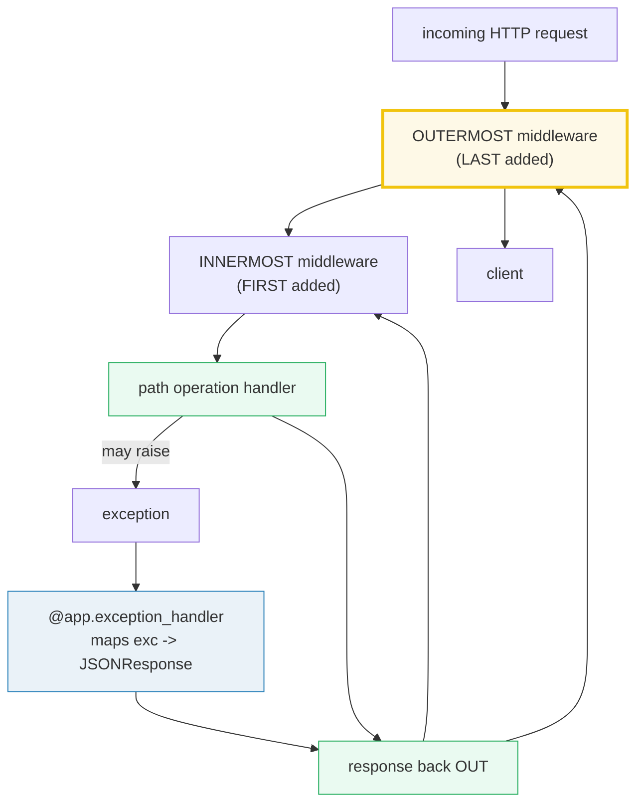
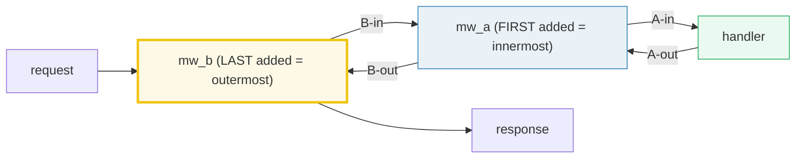
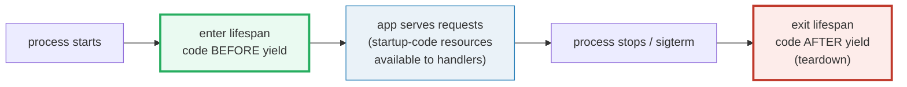

# FastAPI Middleware & Lifespan — The Onion, the Error Map, and the App Lifecycle

> **The one rule:** every request enters your app through a stack of
> **middleware** (the onion — the **last** added is the **outermost**), and the
> whole app lives inside one **async context manager**, the **lifespan**, that
> runs setup before the first request and teardown after the last. Custom
> middleware mutates request/response in flight; **CORSMiddleware** answers
> browser preflights; **exception handlers** map raised exceptions to JSON
> responses. Three layers, three concerns, one ASGI app.

**Companion code:**
[`fastapi_middleware_lifespan.py`](./fastapi_middleware_lifespan.py).
**Every value and ordering below is printed by `uv run python
fastapi_middleware_lifespan.py`** — it drives eight tiny apps with
`TestClient`, so the whole thing runs synchronously and deterministically.
Change the code, re-run, re-paste. Nothing here is hand-computed. Captured
stdout lives in
[`fastapi_middleware_lifespan_output.txt`](./fastapi_middleware_lifespan_output.txt).

**Goal of this bundle (lineage, old → new):**

> from *"my app has no cross-cutting concerns — every handler repeats the
> logging, the auth, the error mapping, and the DB open"*
> → *"middleware is the onion around every request (last-added = outermost);
> > CORSMiddleware answers preflights; `@app.exception_handler` maps raised
> > exceptions to JSON; the lifespan async context manager owns startup and
> > shutdown (replacing `on_event`). Three layers that shape every request and
> > the whole app life."*

🔗 This bundle is the FastAPI specialization of two earlier bundles. The
**async context manager** protocol (`__aenter__` / `__aexit__`) that powers
`lifespan` is dissected in [`CONTEXT_MANAGERS`](./CONTEXT_MANAGERS.md)
(Phase 3 #22) — the present bundle only uses it. The **event loop** the
lifespan yields back to is the one from [`ASYNCIO_BASICS`](./ASYNCIO_BASICS.md)
(Phase 3 #21). The same-loop/blocking-call trap from
[`FASTAPI_ASYNC`](./FASTAPI_ASYNC.md) (Phase 7 #46) applies to **every
middleware** too — a blocking call inside `@app.middleware("http")` freezes the
whole server. CORS/security headers are revisited in
[`FASTAPI_AUTH`](./FASTAPI_AUTH.md) (Phase 7 #48).

---

## 0. The one picture



| Question | Answer |
|---|---|
| Where does a request go first? | The **outermost middleware** = the **last** one added (`app.add_middleware` or `@app.middleware`). |
| What does a middleware see? | The `request`, then — after `await call_next(request)` — the `response`. It can mutate either. |
| What is the execution order? | Request: outermost→innermost→handler. Response: handler→innermost→outermost. (LIFO unwind.) |
| Is CORS a separate thing? | **No** — `CORSMiddleware` is just another middleware; it intercepts OPTIONS preflights and stamps `Access-Control-Allow-*`. |
| How does an exception become a response? | `@app.exception_handler(SomeExc)` (or keyed on a status `int`) is called with `(request, exc)` and returns a `Response`. |
| Where do startup/shutdown live? | In the **lifespan** — an `@asynccontextmanager` passed to `FastAPI(lifespan=...)`. Code before `yield` runs at startup; after `yield` at shutdown. It **replaces** `on_event("startup"/"shutdown")`. |
| How is shared state wired to handlers? | Set `app.state.X = ...` in the lifespan; read it in handlers via `request.app.state.X`. |

---

## 1. Custom middleware — wrap every request, mutate the response

The FastAPI [middleware docs](https://fastapi.tiangolo.com/tutorial/middleware/)
define it crisply: *"A 'middleware' is a function that works with every
**request** before it is processed by any specific path operation. And also
with every **response** before returning it."* You register one with the
`@app.middleware("http")` decorator on an `async def` that takes
`(request, call_next)`. The body `await`s `call_next(request)` to get the
`response` the route produced, mutates it, and returns it. Code **before** the
`await` sees the request; code **after** sees the response — that is the entire
surface area.

The demo stamps a constant `X-Served-By` header on every response. The header
appears on `GET /` even though the route returns only `{"hello": "world"}` —
proof the middleware ran *after* the route built the JSON (it sees the
`application/json` content-type FastAPI set).

> From `fastapi_middleware_lifespan.py` Section A:
> ```
> ======================================================================
> SECTION A — Custom middleware adds a response header
> ======================================================================
> @app.middleware('http') wraps EVERY request. The function takes
> (request, call_next), awaits call_next(request) to get the response,
> then mutates the response before returning it. Below: stamp every
> response with a constant X-Served-By header.
> 
> GET / -> 200
>   X-Served-By  header -> 'fastapi-mw-demo'
>   content-type header -> 'application/json'
> 
> [check] GET / returned 200: OK
> [check] middleware stamped the X-Served-By header: OK
> [check] middleware ran AFTER the route built the JSON response: OK
> ```

### Why middleware sees every request (internals)

`@app.middleware("http")` is sugar for `app.add_middleware(BaseHTTPMiddleware,
dispatch=func)` (from Starlette). `add_middleware` *wraps* the current ASGI app
in a new layer that calls your `dispatch` function; the wrapped app is what
gets called next. So the final ASGI app is a nested onion of wrappers around
the routing core. Because every HTTP request must traverse the onion to reach
the router, **every** request passes through every middleware — there is no
opt-out per route (use `Depends` for per-route cross-cutting; 🔗 see
[`FASTAPI_DEPENDENCIES`](./FASTAPI_DEPENDENCIES.md), Phase 7 #45). The FastAPI
docs note one ordering subtlety worth memorising: dependencies with `yield`
exit **after** the middleware, and `BackgroundTasks` run **after all
middleware**.

---

## 2. Middleware order — the onion (LAST added = OUTERMOST)

This is the single most misunderstood middleware fact. The
[docs](https://fastapi.tiangolo.com/tutorial/middleware/#multiple-middleware-execution-order)
are explicit: *"each new middleware wraps the application, forming a stack.
The **last** middleware added is the **outermost**, and the first is the
**innermost**."* So:

```
app.add_middleware(MiddlewareA)
app.add_middleware(MiddlewareB)
```

gives the order:

- **Request**: `MiddlewareB → MiddlewareA → route`
- **Response**: `route → MiddlewareA → MiddlewareB`

The demo proves it: `mw_a` is registered first, then `mw_b`. The recorded
trace is `B-in, A-in, handler, A-out, B-out` — `B` is encountered first on the
way in and last on the way out, because `B` *wraps* `A`, which *wraps* the
route.



> From `fastapi_middleware_lifespan.py` Section B:
> ```
> ======================================================================
> SECTION B — Middleware order: the onion (LAST added = OUTERMOST)
> ======================================================================
> FastAPI docs: 'each new middleware wraps the application, forming
> a stack. The LAST middleware added is the OUTERMOST, and the first
> is the INNERMOST.' So adding A then B gives request B->A->route and
> response route->A->B. The recording below proves it.
> 
> GET / -> 200; recorded order:
>   B-in
>   A-in
>   handler
>   A-out
>   B-out
> (B was added AFTER A -> B is outermost -> request: B->A->handler,
>  response: handler->A->B)
> 
> [check] GET / returned 200: OK
> [check] request path is B-in -> A-in -> handler (B outermost): OK
> [check] response path is handler -> A-out -> B-out (unwound LIFO): OK
> [check] full onion: B-in, A-in, handler, A-out, B-out: OK
> ```

### Why "last added = outermost" (internals)

`add_middleware` doesn't append to a list that runs in registration order — it
**re-wraps**. Internally Starlette keeps a `user_middleware` list and rebuilds
the app with `build_middleware_stack`: it starts from the router and, for each
middleware **in the order added**, wraps the current app so that the *new*
middleware becomes the outermost layer of the result so far. By the time the
loop finishes, the **last**-added middleware is the outermost ASGI callable.
The mnemonic is "stack push/pop": pushes happen in registration order, but the
request pops the top (last pushed) first. This is LIFO, identical in spirit to
`ExitStack` unwinding in reverse registration order (🔗
[`CONTEXT_MANAGERS`](./CONTEXT_MANAGERS.md) §6, Phase 3 #22).

> **Practical consequence:** if you want CORS to be checked **before** your
> auth middleware runs, add auth **first** and CORS **after** — CORS becomes
> outermost. Getting this backwards is a common cause of CORS errors leaking
> past auth, or auth headers missing on preflight responses.

---

## 3. CORS — a middleware that answers preflight OPTIONS

[CORS](https://developer.mozilla.org/en-US/docs/Web/HTTP/CORS) is enforced by
**browsers**, not servers: a browser will block a cross-origin JS response
unless the server sends the right `Access-Control-Allow-*` headers. FastAPI's
[CORS docs](https://fastapi.tiangolo.com/tutorial/cors/) route this through —
surprise — a middleware: `CORSMiddleware` (re-exported from Starlette). The
docs identify two cases:

- **Preflight requests**: any `OPTIONS` request with `Origin` and
  `Access-Control-Request-Method` headers. The middleware *intercepts* it,
  answers `200` with the CORS headers, and the route is **never called**.
- **Simple requests**: any request with an `Origin` header. The middleware
  passes it through to the route and stamps CORS headers on the response.

The configured knobs map directly to response headers:
`allow_origins`→`Access-Control-Allow-Origin`,
`allow_methods`→`Access-Control-Allow-Methods`,
`allow_headers`→`Access-Control-Allow-Headers`,
`allow_credentials`→`Access-Control-Allow-Credentials`,
`max_age`→`Access-Control-Max-Age`. Note `allow_headers` always includes the
"simple" defaults (`Accept`, `Accept-Language`, `Content-Language`,
`Content-Type`) per the [CORS spec](https://developer.mozilla.org/en-US/docs/Web/HTTP/CORS),
then appends whatever you configured (`X-Custom` below). A request from a
disallowed origin gets **no** `Access-Control-Allow-Origin` on the response —
the browser then blocks it.

> From `fastapi_middleware_lifespan.py` Section C:
> ```
> ======================================================================
> SECTION C — CORSMiddleware: preflight OPTIONS gets CORS headers
> ======================================================================
> CORS is just another middleware. A browser preflight is an OPTIONS
> request with Origin + Access-Control-Request-Method; CORSMiddleware
> intercepts it, answers 200 with Access-Control-Allow-* headers, and
> never calls the route.
> 
> preflight OPTIONS / -> 200
>   access-control-allow-origin: https://example.com
>   access-control-allow-methods: GET, POST
>   access-control-allow-headers: Accept, Accept-Language, Content-Language, Content-Type, X-Custom
>   access-control-allow-credentials: true
>   access-control-max-age: 600
>   vary: Origin
> 
> simple GET / (allowed origin)    -> ACAO: 'https://example.com'
> simple GET / (disallowed origin) -> ACAO: None
> 
> [check] preflight returned 200: OK
> [check] allow-origin echoes the allowed origin: OK
> [check] allow-methods lists the configured methods: OK
> [check] allow-credentials is true: OK
> [check] max-age is 600 (configured cache seconds): OK
> [check] simple request from allowed origin still gets ACAO: OK
> [check] simple request from disallowed origin gets NO ACAO: OK
> ```

### Why `allow_credentials` forbids the `*` wildcard (the gotcha)

The CORS spec (and the [MDN
note](https://developer.mozilla.org/en-US/docs/Web/HTTP/CORS#credentialed_requests_and_wildcards))
forbids responding `Access-Control-Allow-Origin: *` when credentials (cookies,
`Authorization`) are involved — a browser will reject the response. So the
FastAPI/Starlette docs state: *"None of `allow_origins`, `allow_methods` and
`allow_headers` can be set to `['*']` if `allow_credentials` is set to
`True`." The middleware instead **echoes the request Origin** when it's in the
allowed list (that is why `access-control-allow-origin: https://example.com`
appears verbatim, not `*`). Also note `Vary: Origin` — required so a cache
doesn't serve an `example.com`-stamped response to a different allowed origin.

---

## 4. Exception handlers — map a raised exception to a JSON response

A handler is just a function; it can `raise` any exception. Without a custom
handler, FastAPI's defaults turn known HTTP exceptions into JSON and let
everything else surface as a 500. `@app.exception_handler(SomeException)`
**overrides** that: when any handler raises `SomeException`, FastAPI calls
your function with `(request, exc)` and the `Response` you return goes to the
client. The [handling-errors docs](https://fastapi.tiangolo.com/tutorial/handling-errors/)
give the canonical example mapping a custom `UnicornException` to a 418.

The demo raises `BusinessError("insufficient-funds", 7)` inside `/charge`. The
registered handler turns that into `418 {"error": ..., "code": 7}` — a clean
machine-readable error body, with a status code chosen by the handler (not the
exception). The client never sees a Python traceback; it sees exactly the JSON
the handler returned.

> From `fastapi_middleware_lifespan.py` Section D:
> ```
> ======================================================================
> SECTION D — Custom exception handler -> JSON response
> ======================================================================
> @app.exception_handler(SomeException) installs a global mapper: when
> any handler raises SomeException, FastAPI calls your function with
> (request, exc) and your returned JSONResponse goes to the client.
> 
> GET /charge (raises BusinessError) -> 418 {'error': 'insufficient-funds', 'code': 7}
> (the handler mapped the domain exception to a 418 JSON body)
> 
> [check] GET /charge returned 418 (mapped by custom handler): OK
> [check] response body carries the exception's msg and code: OK
> ```

### Why this beats `try/except` in every handler (internals)

Without exception handlers you would wrap every route body in
`try/except BusinessError: return JSONResponse(...)`. With one registration
you factor that out to a **single** place, applied to **every** route
(including future ones). Under the hood, Starlette's `ExceptionMiddleware`
keeps a dict keyed by exception class (and a separate dict keyed by status
code — see §5). When a route raises, Starlette walks the exception's MRO and
uses the first matching handler; if none matches, the `ServerErrorMiddleware`
catches it and produces a 500. Custom handlers run **inside** the middleware
onion, so any middleware that needs to see the final response status (e.g. an
access-log middleware, §8) sees the mapped status, not the raw exception.

---

## 5. `HTTPException` & the status-code-keyed handler

`HTTPException(status_code=..., detail=...)` is the built-in way to say "this
request failed with this HTTP status". FastAPI's default handler turns it into
`{status_code} {"detail": ...}` JSON. Because it is a Python exception, you
`raise` it (not `return` it) — control unwinds immediately, skipping the rest
of the handler.

You can also register a handler keyed on a **status code** (`int`) rather than
an exception class. The Starlette
[docs](https://www.starlette.dev/exceptions/) describe this as the mechanism
behind `ServerErrorMiddleware`: any unhandled exception that would surface as
that status is routed through your function. The demo registers
`@app.exception_handler(500)` and raises a bare `RuntimeError`; instead of a
default 500 with a stack trace, the client gets
`500 {"caught": "generic-500"}`.

> From `fastapi_middleware_lifespan.py` Section E:
> ```
> ======================================================================
> SECTION E — HTTPException default handling + generic status-code handler
> ======================================================================
> raise HTTPException(status_code=404, detail=...) -> FastAPI's default
> handler returns 404 with body {'detail': ...}. You can also register
> a handler keyed on a STATUS CODE (int): anything that surfaces as
> that status is routed through your function. Below, an unhandled
> RuntimeError becomes a 500 with our custom body.
> 
> GET /missing (raises HTTPException(404)) -> 404 {'detail': 'no such thing'}
> GET /boom   (raises RuntimeError)      -> 500 {'caught': 'generic-500'}
> (HTTPException used the default handler; the 500 status handler
>  intercepted the unhandled RuntimeError)
> 
> [check] HTTPException(404) -> 404 via the default handler: OK
> [check] HTTPException default body is {'detail': ...}: OK
> [check] generic 500 handler caught the RuntimeError: OK
> ```

> **Testing note:** to observe a 500 actually go through your handler instead
> of being re-raised by `TestClient`, construct it with
> `TestClient(app, raise_server_exceptions=False)`. Under a real uvicorn
> worker no such flag is needed — unhandled exceptions are always routed to
> the 500 handler.

### FastAPI's `HTTPException` vs Starlette's (the subtle bit)

FastAPI's `HTTPException` subclasses Starlette's, with one difference:
FastAPI's `detail` accepts any JSON-able value (dict, list), Starlette's only
accepts a string. The docs therefore recommend registering any override on
**Starlette's** `HTTPException` (`from starlette.exceptions import HTTPException
as StarletteHTTPException`) so that exceptions raised by Starlette internals
or third-party middleware are also caught.

---

## 6. The lifespan — one async context manager owns startup and shutdown

The [lifespan docs](https://fastapi.tiangolo.com/advanced/events/) describe it
plainly: *"You can define this startup and shutdown logic using the `lifespan`
parameter of the `FastAPI` app, and a 'context manager'."* You write an
`@asynccontextmanager async def lifespan(app):` function: code **before**
`yield` runs once, before the app accepts requests; code **after** `yield`
runs once, after the app has stopped. Pass it as `FastAPI(lifespan=lifespan)`.

The two halves are paired by design: open a resource before, release it after.
That pairing was awkward with the older `@app.on_event("startup")` /
`@app.on_event("shutdown")` decorators because the two handlers shared state
only through globals. The docs mark `on_event` **deprecated**: *"If you provide
a `lifespan` parameter, `startup` and `shutdown` event handlers will no longer
be called. It's all `lifespan` or all events, not both."*

Testing this needs a subtlety: `TestClient(app)` must be used **as a context
manager** (`with TestClient(app) as client:`) so the lifespan startup runs on
`__enter__` and shutdown runs on `__exit__`. A plain `client = TestClient(app)`
does **not** run the lifespan. The demo prints the events list at five points
to prove the arc: empty before the `with`, `['startup']` inside it, then
`['startup', 'shutdown']` after.



> From `fastapi_middleware_lifespan.py` Section F:
> ```
> ======================================================================
> SECTION F — Lifespan: startup runs on `with` enter, shutdown on exit
> ======================================================================
> FastAPI(lifespan=...) takes an ASYNC CONTEXT MANAGER. Code BEFORE
> yield runs once at startup; code AFTER yield runs once at shutdown.
> Using TestClient(app) as a context manager triggers BOTH — entering
> the with runs startup, exiting it runs shutdown. This REPLACES the
> deprecated on_event('startup'/'shutdown').
> 
> events before `with TestClient(app)`     : []
> events inside `with`, before any request : ['startup']
> GET / inside the with-block              : 200 {'events_at_request': ['startup']}
> events inside `with`, after the request  : ['startup']
> events AFTER the with-block exited       : ['startup', 'shutdown']
> (startup ran once on enter; shutdown ran once on exit)
> 
> [check] nothing ran before the with-block: OK
> [check] startup ran exactly once on `with` enter (before any request): OK
> [check] serving a request did not add startup/shutdown events: OK
> [check] shutdown ran once on `with` exit: OK
> ```

### Why it is an *async* context manager (internals)

The lifespan *is* the ASGI [Lifespan Protocol](https://asgi.readthedocs.io/en/latest/specs/lifespan.html)
— the server emits `lifespan.startup` before serving and `lifespan.shutdown`
after. Starlette wraps that into the `@asynccontextmanager` protocol you saw
in 🔗 [`CONTEXT_MANAGERS`](./CONTEXT_MANAGERS.md) (Phase 3 #22, §8: `__aenter__`/
`__aexit__` are coroutines). That is why it can `await asyncpg.create_pool()` or
`await httpx.AsyncClient()` directly in setup. Two expert consequences:

- **One startup, one shutdown per worker process** — not per request, not per
  worker if you run a single worker. With `gunicorn -k uvicorn.workers.UvicornWorker -w N`
  you get N independent lifespans; a resource opened in startup exists N times.
- **Failure during startup prevents serving.** If the code before `yield`
  raises, the app never starts accepting requests — exactly what you want for a
  DB pool that can't open. The exception propagates to the server and the
  process exits non-zero.

---

## 7. `app.state` — the shared namespace populated at startup

The lifespan receives the `app` argument; whatever you set on `app.state`
there is visible in every handler via `request.app.state`. `app.state` is a
simple object (a `Starlette.State` instance) — attribute access, no schema —
intended for process-wide resources opened at startup: DB pools, ML models,
feature flags. The demo "opens a DB" (sets `app.state.db` to a string) and
seeds `app.state.counter = 0`; the handler reads `db` and increments
`counter`, and the second request sees the incremented value — state persists
**across** requests because it lives on the app, not on a single request's
scope.

> From `fastapi_middleware_lifespan.py` Section G:
> ```
> ======================================================================
> SECTION G — app.state: a shared namespace populated at startup
> ======================================================================
> The lifespan receives the app; whatever you set on app.state there
> is visible in every handler via request.app.state. Below: lifespan
> 'opens the DB' (a string) and seeds a counter; the handler reads
> and mutates it across requests.
> 
> 1st GET /info -> 200 {'db': 'postgres://demo', 'counter': 1}
> 2nd GET /info -> 200 {'db': 'postgres://demo', 'counter': 2}
> (handler saw the db string the lifespan set; counter persisted
>  ACROSS requests — state outlives any single request)
> 
> [check] handler saw the startup-set db string: OK
> [check] counter was seeded at 0 and incremented to 1 on first request: OK
> [check] state persisted across requests (2nd request saw counter 2): OK
> ```

### Why not just use module-level globals? (internals)

You can — and the official lifespan example does (a module-level `ml_models`
dict). But `app.state` is the **idiomatic** home for two reasons: (a) it is
scoped to *this* `FastAPI` instance, so tests/sub-apps/mounts don't share
state across instances the way module globals do; (b) Starlette also copies
`app.state` into each request's ASGI `scope["state"]`, so deeply nested
components can read it without importing the app object. The trap: `app.state`
is **per worker process**. Two uvicorn workers do not share a counter or a DB
pool — for shared counters use Redis/Postgres, not `app.state.counter`.

---

## 8. The production pattern — request-logging middleware

The cross-cutting concern that justifies middleware as a concept: a single
piece of code that observes **every** request and response, regardless of
route. The classic is structured access logging: record `(method, path,
status, duration_ms)` for each request. Implemented as middleware, it sees
the final status (after exception handlers) and wraps the route timing
cleanly. The demo captures rows into a list for determinism; in production
you'd emit a JSON log line.

> From `fastapi_middleware_lifespan.py` Section H:
> ```
> ======================================================================
> SECTION H — Request-logging middleware (the production pattern)
> ======================================================================
> The cross-cutting pattern: a middleware that logs (method, path,
> status, duration_ms) for every request. We capture into a list so
> the output is deterministic (duration varies -> assert >= 0).
> 
> method  path        status  ms>=0
> --------------------------------------
> GET     /           200     True
> GET     /           200     True
> GET     /missing    404     True
> 
> [check] middleware recorded exactly 3 requests: OK
> [check] recorded methods/paths/statuses match the calls: OK
> [check] every duration is non-negative: OK
> ```

> **Reproducibility note:** `ms` varies run-to-run, so the assertion only
> checks `>= 0`; the **invariant** is that the middleware recorded the right
> `(method, path, status)` tuple for each call, including the 404 raised by
> `HTTPException` in `/missing` — proof the middleware saw the *final* mapped
> status, not the raw exception.

### Why this is the canonical use of middleware (and when it is not)

Logging, tracing, request-id injection, timing, gzipping, and CORS are the
textbook middleware use cases — they apply to **every** request uniformly and
don't care which route handled it. The flip side: anything that is
**route-specific** (auth for this router only, a Pydantic model dependency, a
per-route DB session) does **not** belong in middleware — put it in
`Depends(...)`. Middleware can't easily inject typed values into handler
signatures; `Depends` can. 🔗 See [`FASTAPI_DEPENDENCIES`](./FASTAPI_DEPENDENCIES.md)
(Phase 7 #45). And the same warning as everywhere else in FastAPI: a blocking
call (`requests.get`, `time.sleep`) inside an `async def` middleware freezes
the whole event loop — see [`FASTAPI_ASYNC`](./FASTAPI_ASYNC.md) §3 (Phase 7 #46).

---

## Pitfalls

| Trap | Example | The fix |
|---|---|---|
| Assuming "first added = outermost" | registering auth then CORS and expecting auth to run on preflights — CORS is innermost and preflight bypasses it | remember: **last added is outermost** (§2); add CORS last so it answers preflight before anything else |
| Forgetting to use `with TestClient(app)` | `client = TestClient(app); client.get(...)` → lifespan never runs, `app.state.X` is missing, startup code skipped | always `with TestClient(app) as client:` when the app has a lifespan (§6) |
| Mixing `lifespan=` with `@app.on_event(...)` | expecting both to fire — the docs say "it's all lifespan or all events, not both" | migrate `on_event` handlers into the lifespan; drop the decorator |
| `allow_origins=['*']` with `allow_credentials=True` | browsers reject the response; Starlette rejects the config at request time | list explicit origins; let the middleware echo the matched Origin (§3) |
| Registering a handler for FastAPI's `HTTPException` only | Starlette-internal `HTTPException`s bypass your override | register on `starlette.exceptions.HTTPException` (aliased) so both are caught (§5) |
| Expecting `TestClient` to surface 500s by default | the raw exception is re-raised in the test, not handed to your 500 handler | use `TestClient(app, raise_server_exceptions=False)` (§5) |
| Treating `app.state` as shared across workers | a counter on `app.state` differs per uvicorn worker; "increment" drifts | use Redis/Postgres for shared counters; `app.state` is per-process (§7) |
| Heavy work in startup blocking the deploy | a 30s model load in lifespan delays readiness; rolling deploys stall | do warm-up lazily, or load in a background task after `yield`, or accept the delay and set the healthcheck grace period |
| Blocking call inside `@app.middleware("http")` | `requests.get(...)` or `time.sleep(...)` in middleware freezes the loop for **every** in-flight request | use `httpx.AsyncClient` and `await`; or offload with `await asyncio.to_thread(...)` (🔗 FASTAPI_ASYNC §3) |
| Using middleware for route-specific concerns | auth-in-middleware can't inject the typed user into the handler signature | use `Depends(get_current_user)` instead; middleware is for **every** request (§8) |
| Expecting exception handlers to run **outside** middleware | wanting the access-log middleware to log "500" but it sees the original 200 | handlers run **inside** the onion — middleware already sees the mapped status; only `BackgroundTasks` run after all middleware |

---

## Cheat sheet

- **Custom middleware:** `@app.middleware("http") async def f(request, call_next)` —
  code before `await call_next(request)` sees the request; code after sees the
  `response`. Mutate the response and return it (§1).
- **Order — the onion:** the **last** middleware added is the **outermost**
  (runs first on the request, last on the response). Request:
  outermost→innermost→handler; response: handler→innermost→outermost (LIFO) (§2).
- **CORS:** `app.add_middleware(CORSMiddleware, allow_origins=[...],
  allow_methods=[...], allow_headers=[...], allow_credentials=...,
  max_age=...)`. Preflight `OPTIONS` is intercepted with `200` + CORS headers;
  simple requests get CORS headers on the response. Never `['*']` with
  credentials (§3).
- **Custom exception handler:** `@app.exception_handler(SomeExc) async def h(request, exc)
  -> Response` — globally maps `SomeExc` to whatever response you return (§4).
- **`HTTPException`:** `raise HTTPException(status_code=404, detail=...)` →
  default handler returns `404 {"detail": ...}`. Override the default by
  registering a handler on Starlette's `HTTPException` (§5).
- **Status-code handler:** `@app.exception_handler(500)` catches anything that
  surfaces as a 500; use `TestClient(app, raise_server_exceptions=False)` to
  observe it in tests (§5).
- **Lifespan:** `@asynccontextmanager async def lifespan(app): ...; yield; ...`
  passed as `FastAPI(lifespan=lifespan)`. Pre-`yield` = startup, post-`yield`
  = shutdown. **Replaces** `on_event("startup"/"shutdown")` (deprecated) (§6).
- **Testing lifespan:** `with TestClient(app) as client:` runs startup on
  `__enter__`, shutdown on `__exit__`. A bare `TestClient(app)` does **not**
  run the lifespan (§6).
- **`app.state`:** set `app.state.X = ...` in the lifespan; read
  `request.app.state.X` in handlers. Per-process (per-worker), not shared
  across uvicorn workers (§7).
- **Logging middleware:** the canonical "wrap every request" pattern — record
  `(method, path, status, duration)`. Route-specific concerns belong in
  `Depends`, not middleware (§8).

---

## Sources

- **FastAPI docs — Middleware.**
  https://fastapi.tiangolo.com/tutorial/middleware/
  *The authoritative definition of a FastAPI middleware ("a function that works
  with every request before it is processed … and with every response before
  returning it"), the `@app.middleware("http")` decorator with
  `(request, call_next)`, and the explicit order rule quoted verbatim in §2:
  "The last middleware added is the outermost, and the first is the
  innermost." Also the note that dependency-`yield` exits after middleware and
  `BackgroundTasks` run after all middleware.*
- **FastAPI docs — CORS (Cross-Origin Resource Sharing).**
  https://fastapi.tiangolo.com/tutorial/cors/
  *Defines `CORSMiddleware` and every knob: `allow_origins`, `allow_methods`
  (default `['GET']`), `allow_headers` (default `[]`, simple headers always
  allowed), `allow_credentials` (default `False`), `expose_headers`, `max_age`
  (default `600`). The rule that `'*'` is incompatible with `credentials=True`
  is quoted in §3.*
- **FastAPI docs — Handling Errors.**
  https://fastapi.tiangolo.com/tutorial/handling-errors/
  *`raise HTTPException(status_code=..., detail=...)` and the default
  `{"detail": ...}` body; `@app.exception_handler(SomeException)` for custom
  mapping; overriding the default handlers; and the FastAPI-vs-Starlette
  `HTTPException` inheritance note quoted in §5.*
- **FastAPI docs — Lifespan Events (Advanced User Guide).**
  https://fastapi.tiangolo.com/advanced/events/
  *The `@asynccontextmanager async def lifespan(app)` API; pre-`yield` =
  startup, post-`yield` = shutdown; the deprecation warning that
  `on_event("startup"/"shutdown")` is replaced by `lifespan` ("It's all
  `lifespan` or all events, not both"); the pointer to the ASGI Lifespan
  Protocol and Starlette lifespan state. Basis for §6 and §7.*
- **FastAPI docs — Testing Events: lifespan and startup - shutdown.**
  https://fastapi.tiangolo.com/advanced/testing-events/
  *Documents that `TestClient` must be used as a context manager
  (`with TestClient(app) as client:`) for the lifespan to run — the testing
  subtlety called out in §6.*
- **Starlette docs — Middleware.**
  https://www.starlette.dev/middleware/
  *The underlying implementation. `CORSMiddleware` parameter reference; the
  note that `BaseHTTPMiddleware` is the class behind `@app.middleware("http")`;
  `Vary: Origin` and the simple-headers list referenced in §3.*
- **Starlette docs — Exceptions.**
  https://www.starlette.dev/exceptions/
  *`ExceptionMiddleware` and the status-code-keyed handler mechanism. Source
  of the §5 note that handlers can be keyed on either an exception class or an
  HTTP status `int`.*
- **Starlette docs — Lifespan.**
  https://www.starlette.dev/lifespan/
  *The lifespan state propagation: `app.state` is a `Starlette.State` and is
  copied into each request's `scope["state"]`, the mechanism behind §7's
  `request.app.state.X`.*
- **ASGI specification — Lifespan Protocol.**
  https://asgi.readthedocs.io/en/latest/specs/lifespan.html
  *The underlying protocol Starlette/FastAPI implement. Defines the
  `lifespan.startup` / `lifespan.shutdown` events the server emits — the
  reason the lifespan is an async context manager (§6 internals).*
- **MDN — HTTP CORS.**
  https://developer.mozilla.org/en-US/docs/Web/HTTP/CORS
  *Independent confirmation of the browser-enforced nature of CORS, the
  preflight vs simple-request distinction, the always-allowed "simple"
  headers, and the credentialed-requests-and-wildcards rule quoted in §3.*
- **Sibling bundle — [`CONTEXT_MANAGERS`](./CONTEXT_MANAGERS.md) (Phase 3 #22).**
  *The async context manager protocol (`__aenter__` / `__aexit__` coroutines)
  that the lifespan is an instance of; §8 there covers `@asynccontextmanager`
  and `async with`. Forward-referenced from §6.*
- **Sibling bundle — [`FASTAPI_ASYNC`](./FASTAPI_ASYNC.md) (Phase 7 #46).**
  *The blocking-call-inside-`async def` trap applies equally to middleware
  bodies — referenced in the §8 internals note and the pitfalls table.*
