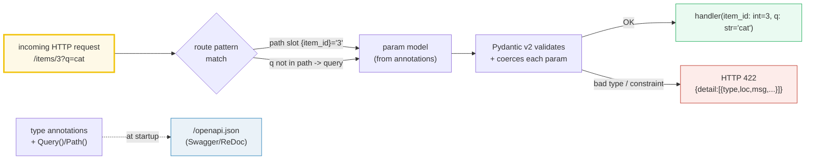
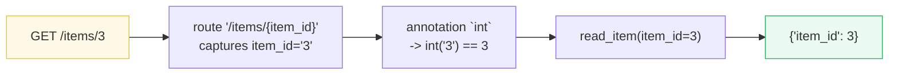

# FastAPI Routing & Parameters — Path, Query, Validation, and the Free OpenAPI Schema

> **The one rule:** FastAPI routes by **path pattern**; the function signature
> does the rest. A `{slot}` in the path is a **path parameter**; any other
> function parameter is a **query parameter**; the **type annotation** drives
> parsing + validation; constraints come from `Query(...)` / `Path(...)`. A bad
> type or a violated constraint short-circuits to a structured **HTTP 422**, and
> the **OpenAPI schema** is generated from the very same annotations — for free.

**Companion code:** [`fastapi_routing_params.py`](./fastapi_routing_params.py).
**Every status code, JSON body, and schema snippet below is printed by
`uv run python fastapi_routing_params.py`** via
`fastapi.testclient.TestClient` — no uvicorn, no network. Change the code,
re-run, re-paste. Captured stdout lives in
[`fastapi_routing_params_output.txt`](./fastapi_routing_params_output.txt).

**Goal of this bundle (lineage, old → new):**

> from *"I parse the URL myself"*
> → *"FastAPI maps path `{vars}` + function params to typed, validated
> path/query params; a bad type returns a structured 422, and the OpenAPI
> schema is generated for free."*

🔗 This is bundle **#43 of Phase 7** (FastAPI). It assumes you already speak
Python type hints — see [`TYPE_HINTS`](./TYPE_HINTS.md) (P3 #18). The
validation engine underneath everything here is **Pydantic v2**, which is
itself built on type hints. Later bundles take this further:
[`FASTAPI_BODIES_PYDANTIC`](./FASTAPI_BODIES_PYDANTIC.md) (P7 #44) adds request
bodies / Pydantic models; [`FASTAPI_DEPENDENCIES`](./FASTAPI_DEPENDENCIES.md)
(P7 #45) adds dependency injection. See [`TODO.md`](./TODO.md) for the plan.

---

## 0. The whole pipeline on one page



| Question | Where it lives | Default required? | Validation source |
|---|---|---|---|
| Path param `item_id` | `{item_id}` slot in the route string | **always** required (it's part of the URL) | bare annotation, or `Path(...)` |
| Query param `q` | function param whose name is NOT a `{slot}` | required if no default; optional with a default | bare annotation, or `Query(...)` |
| Constraint `ge=0, le=100` | `Annotated[int, Query(ge=0, le=100)]` | independent of required-ness | Pydantic numeric validators |
| Error format on failure | HTTP 422 `{"detail": [...]}` | — | Pydantic v2 `ValidationError` |

---

## 1. Path parameters — `{item_id}` parsed by annotation

A **path operation** is `@app.get("/items/{item_id}")`. The `{item_id}` slot
captures a single URL segment and FastAPI passes that substring to the
function parameter **of the same name**. The **annotation** (`int` here) is
not documentation — FastAPI uses it to **coerce** the substring, so the
handler receives a real Python `int`, not the URL string `"3"`.



> From `fastapi_routing_params.py` Section A:
> ```
> ======================================================================
> SECTION A — Path parameters: {item_id} parsed to int
> ======================================================================
> A path operation declares a URL slot with {name}. FastAPI passes
> the matched substring to a function parameter of the SAME name,
> coerces it via the type annotation, and returns the parsed value.
> 
> client.get('/items/3').status_code -> 200
> client.get('/items/3').json()      -> {'item_id': 3}
> Notice the function received 3 as a Python int, not the string
> '3' from the URL.
> 
> [check] GET /items/3 returns HTTP 200: OK
> [check] GET /items/3 body is {'item_id': 3}: OK
> [check] item_id is parsed to int (not str): OK
> ```

### Why this works (internals)

At decoration time `@app.get("/items/{item_id}")` registers the route with
Starlette's router, compiling the path into a regex with a named group
(`(?P<item_id>[^/]+)` by default; `:path` makes it greedy). When a request
arrives, FastAPI's `solve_dependencies` reads `inspect.signature(read_item)`,
sees `item_id: int` is also a `{slot}`, and builds a **Pydantic model on the
fly** with one field `item_id: int`. The URL substring `"3"` is fed to that
model; Pydantic coerces it to `3` and hands the validated value to your
function. If coercion fails (next section) Pydantic raises
`RequestValidationError`, which FastAPI serializes into a 422.

🔗 The Pydantic v2 model that powers coercion/Validation is the same machinery
as in [`TYPE_HINTS`](./TYPE_HINTS.md) — type hints at runtime.

---

## 2. Type validation — a bad int becomes a structured HTTP 422

Send `/items/abc` and the handler is **never called**: FastAPI short-circuits
with HTTP 422 and a JSON body whose `detail` list pinpoints **which** location
failed and **which** Pydantic error type fired.

> From `fastapi_routing_params.py` Section B:
> ```
> ======================================================================
> SECTION B — Type validation: '/items/abc' -> HTTP 422 (structured)
> ======================================================================
> When the path substring cannot be coerced to the declared type,
> FastAPI short-circuits with 422 and a JSON body whose `detail`
> list pinpoints the location and the Pydantic error type.
> 
> client.get('/items/abc').status_code -> 422
> client.get('/items/abc').json()      -> {'detail': [{'type': 'int_parsing', 'loc': ['path', 'item_id'], 'msg': 'Input should be a valid integer, unable to parse string as an integer', 'input': 'abc'}]}
> 
> [check] GET /items/abc returns HTTP 422: OK
> [check] error loc pinpoints ['path', 'item_id']: OK
> [check] error type is 'int_parsing' (Pydantic v2): OK
> ```

### Why 422 (and not 400 or 500)

**422 Unprocessable Entity** is the [RFC 4918](https://tools.ietf.org/html/rfc4918#section-11.2)
status FastAPI picks for *semantically well-formed* requests that fail
*content-level* validation. It deliberately differs from **400 Bad Request**
(syntax/protocol error) and **404 Not Found** (no route matched). The error
body is the JSON encoding of `pydantic.ValidationError.errors()`:

| Field | Meaning | Example |
|---|---|---|
| `type` | Pydantic v2 error identifier (string) | `"int_parsing"`, `"missing"`, `"greater_than_equal"` |
| `loc` | `[<in>, <field>]` — where `<in>` is `path` / `query` / `body` | `["path", "item_id"]` |
| `msg` | Human-readable explanation | `"Input should be a valid integer, ..."` |
| `input` | The offending raw input | `"abc"` |
| `ctx` | Constraint context (optional) | `{"ge": 0}` |

**Expert gotcha — the error-type strings are NOT part of a stability
guarantee.** Pydantic v2 changed them wholesale from v1 (e.g. `type_error.integer`
→ `int_parsing`). If you write client-side error mapping that switches on
`err["type"]`, pin your Pydantic minor version and re-test on bumps.

---

## 3. Query parameters — anything NOT in the path

Any function parameter whose name does **not** appear as a `{slot}` in the
path is automatically a **query parameter**. Defaults make it optional; the
annotation still drives parsing and validation. `q` below has no default →
required; `limit: int = 10` → optional with a default of `10`.

> From `fastapi_routing_params.py` Section C:
> ```
> ======================================================================
> SECTION C — Query parameters: params NOT in the path
> ======================================================================
> Any function parameter whose name does NOT appear as a {slot} in
> the path is interpreted as a query parameter. Defaults make it
> optional; the annotation still drives parsing + validation.
> 
> client.get('/search?q=cats&limit=5').status_code -> 200
> client.get('/search?q=cats&limit=5').json()      -> {'q': 'cats', 'limit': 5}
> 
> [check] GET /search?q=cats&limit=5 returns HTTP 200: OK
> [check] q parsed verbatim as 'cats': OK
> [check] limit parsed as int 5 (not '5'): OK
> ```

### Why detection is "by name, not by position" (internals)

For each handler FastAPI iterates the `inspect.signature` parameters and
partitions them:

- name in the path's `{slots}` → **path param** (always required, regardless
  of any default you might mistakenly add);
- name not in the path AND not a Pydantic model AND not annotated `Body(...)`
  → **query param**;
- annotated as a Pydantic model / `Body(...)` → **request body** (🔗
  `FASTAPI_BODIES_PYDANTIC`).

Because partitioning is by name, declaration order in the signature is
irrelevant. This is also why **`/users/me` must be declared before
`/users/{user_id}`** — routes are evaluated in registration order, and the
regex for `{user_id}` would happily match the literal `me`.

---

## 4. Required vs optional — no default vs default / `T | None`

Two independent axes:

1. **Required?** A query param with **no default** is required (omitting it →
   422 with `type="missing"`). A **default** (including `None`) makes it
   optional.
2. **Nullable?** `T | None` (or `Optional[T]`) says the value may be `None`.
   Pairing `str | None = None` is the idiomatic "optional, defaults to None".

> From `fastapi_routing_params.py` Section D:
> ```
> ======================================================================
> SECTION D — Required vs optional: no-default vs default / `T | None`
> ======================================================================
> For query params: no default -> REQUIRED (missing -> 422). A
> default value (incl. `T | None = None`) -> OPTIONAL and uses the
> default when the client omits it.
> 
> client.get('/req?required_q=hi').status_code -> 200
> client.get('/req?required_q=hi').json()      -> {'required_q': 'hi', 'optional_q': None}
> 
> client.get('/req').status_code -> 422
> client.get('/req').json()      -> {'detail': [{'type': 'missing', 'loc': ['query', 'required_q'], 'msg': 'Field required', 'input': None}]}
> 
> [check] optional param omitted -> 200, uses default None: OK
> [check] required param missing -> HTTP 422: OK
> [check] missing-required error type is 'missing': OK
> ```

### Why path params are ALWAYS required (gotcha)

From the [docs](https://fastapi.tiangolo.com/tutorial/path-params-numeric-validations/):
*"A path parameter is always required as it has to be part of the path. Even
if you declared it with `None` or set a default value, it would not affect
anything."* The router regex cannot match a URL that lacks the segment, so a
"missing path param" is a **404**, not a 422 — the request never reaches the
param model.

**Expert gotcha — `bool` parsing is permissive.** A query param `short: bool`
parses `"1"`, `"true"`, `"yes"`, `"on"` (case-insensitive) as `True` and most
other strings as `False`. That means `?short=false` works, but `?short=cat`
also "works" (returns `False`) instead of 422. Use `Annotated[bool, Query(...)]`
with a strict mode or an `Enum` if you need strictness.

---

## 5. Query constraints — `Annotated[int, Query(ge=0, le=100)]`

The modern (FastAPI ≥ 0.95) idiom wraps the annotation in `typing.Annotated`
and stuffs a `Query(...)` (or `Path(...)`) inside it. `ge`, `gt`, `le`, `lt`
are the numeric bounds; they generate both a Pydantic validator **and**
`minimum`/`maximum` keys in the OpenAPI schema.

> From `fastapi_routing_params.py` Section E:
> ```
> ======================================================================
> SECTION E — Query constraints: Annotated[int, Query(ge=0, le=100)]
> ======================================================================
> Wrapping the annotation in Annotated[T, Query(...)] attaches
> numeric/string constraints. A value outside the range short-
> circuits to 422 with a Pydantic error of the matching type.
> 
> client.get('/page?limit=50').status_code  -> 200 body={'limit': 50}
> client.get('/page?limit=-1').status_code  -> 422
> client.get('/page?limit=-1').json()['detail'][0] -> {'type': 'greater_than_equal', 'loc': ['query', 'limit'], 'msg': 'Input should be greater than or equal to 0', 'input': '-1', 'ctx': {'ge': 0}}
> 
> [check] limit=50 within [0,100] -> HTTP 200: OK
> [check] limit=-1 violates ge=0 -> HTTP 422: OK
> [check] error type is 'greater_than_equal': OK
> [check] error ctx exposes the bound {'ge': 0}: OK
> ```

### Why prefer `Annotated[...]` over `= Query(...)`

The legacy form `limit: int = Query(10, ge=0)` puts metadata in the **default**
slot, which (a) forces a re-ordering dance when one param has a default and
another doesn't, and (b) confuses `mypy`/IDE because the "default" isn't
really an `int`. `Annotated[int, Query(ge=0, le=100)] = 10` cleanly separates
**type** (`int`), **metadata/constraints** (`Query(...)`), and **default**
(`= 10`). It also composes with future PEP 695 / `Annotated`-aware tools.

The constraint codes you'll see most often:

| Code | Bound | Pydantic error `type` |
|---|---|---|
| `ge=x` | `value >= x` | `less_than_equal` flipped → `greater_than_equal` on failure |
| `gt=x` | `value > x` | `greater_than` |
| `le=x` | `value <= x` | `less_than_equal` |
| `lt=x` | `value < x` | `less_than` |

---

## 6. Path constraints — `Annotated[int, Path(ge=1)]`

`Path(...)` accepts the **same** kwargs as `Query(...)` — both are subclasses
of `fastapi.params.Param`. The only difference is the `in` location reported
in errors (`path` vs `query`) and the fact that a path param cannot be made
optional.

> From `fastapi_routing_params.py` Section F:
> ```
> ======================================================================
> SECTION F — Path constraints: Annotated[int, Path(ge=1)]
> ======================================================================
> Path(...) accepts the SAME validation/metadata kwargs as Query(...)
> (both subclass fastapi.params.Param). Constraints on a path slot
> behave identically: violation -> 422.
> 
> client.get('/note/5').status_code -> 200 body={'note_id': 5}
> client.get('/note/0').status_code -> 422 type=greater_than_equal
> 
> [check] note/5 satisfies ge=1 -> HTTP 200: OK
> [check] note/0 violates ge=1 -> HTTP 422: OK
> [check] path-constraint error type is 'greater_than_equal': OK
> ```

### Why `Path` and `Query` exist as separate names at all

If they share the same kwargs, why two classes? Two reasons: (1) the
**declared intent** (`Path` documents "this is a path slot") and (2) FastAPI
uses it during param partitioning to decide the OpenAPI `"in"` value
(`"path"` vs `"query"`) and to forbid nonsensical combinations (e.g. a path
param declared optional). The function-shaped `Path()` / `Query()` imports are
actually factory functions returning instances of classes of the same name —
a small lie your editor accepts to avoid type-checker complaints.

---

## 7. Multiple path params + a query param

A route can have many `{slots}`; FastAPI assigns each to the matching
parameter by name and treats the leftovers as query params. The signature
order is irrelevant.

> From `fastapi_routing_params.py` Section G:
> ```
> ======================================================================
> SECTION G — Multiple path params + query: /users/{uid}/items/{iid}
> ======================================================================
> FastAPI detects which params are path vs query by NAME: any name
> matching a {slot} is a path param, everything else is a query
> param. Declaration order in the signature is irrelevant.
> 
> client.get('/users/7/items/3?detail=true').status_code -> 200
> client.get('/users/7/items/3?detail=true').json()      -> {'uid': 7, 'iid': 3, 'detail': True}
> 
> [check] GET nested route returns HTTP 200: OK
> [check] both path ints parsed (uid=7, iid=3): OK
> [check] query 'detail=true' coerced to bool True: OK
> ```

### Why this composes cleanly (internals)

The route is compiled once into a single regex with two named groups
(`(?P<uid>[^/]+)/(?:items/)?(?P<iid>[^/]+)` — conceptually). On match,
FastAPI has a `dict` of path values; it walks the signature, picks out the
params whose names appear in that dict, and routes the rest to query parsing.
The bool coercion (`"true"` → `True`) is Pydantic's `bool` validator, which
accepts the standard truthy spellings.

---

## 8. The OpenAPI schema — generated from the annotations

`GET /openapi.json` returns the auto-generated OpenAPI 3.1 document. Each
path lists its parameters with `in` (`path`/`query`), `required`, JSON Schema
`type`, any numeric bounds, and defaults — all derived from the same
annotations that drive validation. `/docs` (Swagger UI) and `/redoc` are just
HTML front-ends over this JSON.

> From `fastapi_routing_params.py` Section H:
> ```
> ======================================================================
> SECTION H — The OpenAPI schema is generated from the annotations
> ======================================================================
> FastAPI derives the OpenAPI (Swagger) document from the route
> signatures. GET /openapi.json exposes it; each path lists its
> params with `in` (path/query), required flag, type, and any
> numeric bounds coming from Query/Path.
> 
> openapi.json status -> 200
> openapi.json paths  -> ['/items/{item_id}', '/note/{note_id}', '/page', '/req', '/search', '/users/{uid}/items/{iid}']
> /users/{uid}/items/{iid} parameters -> [{'name': 'uid', 'in': 'path', 'required': True, 'schema': {'type': 'integer', 'title': 'Uid'}}, {'name': 'iid', 'in': 'path', 'required': True, 'schema': {'type': 'integer', 'title': 'Iid'}}, {'name': 'detail', 'in': 'query', 'required': False, 'schema': {'type': 'boolean', 'default': False, 'title': 'Detail'}}]
> 
> [check] /openapi.json returns HTTP 200: OK
> [check] every declared route is documented in the schema: OK
> [check] schema marks uid/iid as path params: OK
> [check] schema marks detail as a query param: OK
> ```

### Why the schema is "free" (internals)

FastAPI's `get_openapi_path()` walks the same `dependant` structure built at
decoration time and emits OpenAPI 3.1 operation objects: path parameters get
`"in": "path"`, query parameters get `"in": "query"`, `Query(ge=0, le=100)`
becomes `"minimum": 0, "maximum": 100`, etc. Because the schema is built from
the **same** annotations as the validator, the docs cannot drift from the
code — a change to `Query(ge=1)` immediately updates both the 422 behavior and
the published schema. `app.openapi()` caches the dict; `app.openapi_url` and
`app.swagger_ui_url` expose the endpoints.

**Expert gotcha — the OpenAPI cache is built once.** `app.openapi_schema` is
`None` until the first `/openapi.json` call, then memoized. If you
dynamically add routes *after* the first request to `/openapi.json`, the new
routes will NOT appear until you set `app.openapi_schema = None` to bust the
cache (or call `app.openapi()` to rebuild eagerly).

---

## Pitfalls

| Trap | Example | The fix |
|---|---|---|
| Declaring `/users/{user_id}` before `/users/me` | `/users/me` matches `{user_id}="me"` | declare the **literal** path first; routes are evaluated in registration order |
| Treating a path param as optional | `def f(item_id: int = 0): ...` inside `/{item_id}` | path params are ALWAYS required; the default is ignored. Use a query param or a separate route |
| Assuming `bool` query params are strict | `?short=cat` parses to `False`, not 422 | use `Enum` / a strict validator if you need exact `true`/`false` |
| Switching client logic on `err["type"]` | breaks across Pydantic minors (`int_parsing` vs old names) | pin your Pydantic version; treat error types as unstable |
| Confusing **required** with **non-nullable** | `q: str = None` type-checks wrong; use `str \| None = None` | required = no default; nullable = `T \| None`. The two axes are independent |
| Redefining the same path twice | `@app.get("/users")` twice → only the first wins | routes are unique per `(method, path)`; the second registration is silently shadowed |
| `Query`/`Path` default-ordering trap (legacy form) | `def f(q: str, n: int = Query(...))` → `SyntaxError` (non-default after default) | use the `Annotated[T, Query(...)]` form — defaults and metadata stop fighting |
| Expecting `/files/home/x.txt` to work with `{file_path}` | the `[^/]+` regex stops at the first `/` | declare the slot as `{file_path:path}` (Starlette converter) |
| Adding routes **after** the first `/openapi.json` hit | new routes missing from the schema | set `app.openapi_schema = None` to bust the memoized cache |
| Reading `422` as "client typo, treat like 400" | loses the structured `detail` list | parse `detail[*].loc` / `.type` for field-level error feedback to the user |

---

## Cheat sheet

- **Path param:** `{name}` slot in the route + matching function param. Always
  required. Coerced by the annotation. `Annotated[int, Path(ge=1)]` adds
  constraints.
- **Query param:** any function param whose name is NOT a `{slot}`. Required
  iff no default; `T | None = None` is the idiomatic optional-and-nullable.
  `Annotated[int, Query(ge=0, le=100)]` adds constraints.
- **Detection by name, not by order:** FastAPI partitions signature params by
  whether the name matches a `{slot}`. Body params come from Pydantic models
  (🔗 `FASTAPI_BODIES_PYDANTIC`).
- **Bad type → HTTP 422** with `{"detail": [{"type", "loc", "msg", "input",
  ("ctx")}]}`. Pydantic v2 error `type` strings (`int_parsing`, `missing`,
  `greater_than_equal`, …) are not a stable API.
- **Numeric constraint codes:** `ge` (≥), `gt` (>), `le` (≤), `lt` (<). On
  violation the error `type` is the comparison's English name
  (`greater_than_equal`, …) and `ctx` carries the bound.
- **`Path` vs `Query`:** same kwargs (both subclass `fastapi.params.Param`);
  differ only in declared intent and the OpenAPI `"in"` value emitted.
- **OpenAPI schema:** free, derived from the same annotations. `GET
  /openapi.json` (cached on `app.openapi_schema`); `/docs` = Swagger UI,
  `/redoc` = ReDoc. Bust the cache with `app.openapi_schema = None` after
  dynamic route additions.
- **Validation engine:** Pydantic v2 throughout (🔗 `TYPE_HINTS`). Request
  bodies and Pydantic models are the subject of 🔗 `FASTAPI_BODIES_PYDANTIC`
  (P7 #44); handler dependencies in 🔗 `FASTAPI_DEPENDENCIES` (P7 #45).

---

## Sources

- **FastAPI docs — Tutorial: Path Parameters.**
  https://fastapi.tiangolo.com/tutorial/path-params/
  *The `{item_id}` slot syntax; the `item_id: int` annotation example;
  `/items/3` → `{"item_id": 3}` (data conversion); `/items/foo` → HTTP 422
  with `{"type": "int_parsing", "loc": ["path", "item_id"], ...}` (data
  validation, quoted verbatim in §2); route-order warning (`/users/me` before
  `/users/{user_id}`); the `{file_path:path}` converter.*
- **FastAPI docs — Tutorial: Query Parameters.**
  https://fastapi.tiangolo.com/tutorial/query-params/
  *"function parameters that are not part of the path parameters are
  automatically interpreted as query parameters"; defaults make a query param
  optional; `T | None = None` idiom for optional; required query params have
  no default (omitting → 422 with `{"type": "missing", "loc": ["query",
  "needy"]}`); multiple path + query params detected by name; permissive
  `bool` parsing (`"1"`, `"true"`, `"on"`, `"yes"` → `True`).*
- **FastAPI docs — Tutorial: Path Parameters and Numeric Validations.**
  https://fastapi.tiangolo.com/tutorial/path-params-numeric-validations/
  *`from typing import Annotated` + `Annotated[int, Path(title=..., ge=1)]`
  idiom (FastAPI ≥ 0.95); `Query` / `Path` share the same kwargs (both
  subclass `Param`); `ge`/`gt`/`le`/`lt` numeric constraints; "a path
  parameter is always required" note quoted in §4; the `*`-first trick to
  escape default-ordering in the legacy non-`Annotated` form.*
- **FastAPI docs — FastAPI app instance / OpenAPI.**
  https://fastapi.tiangolo.com/reference/openapi/
  *`FastAPI.openapi()` builds and memoizes the OpenAPI schema on
  `app.openapi_schema`; `/openapi.json`, `/docs` (Swagger UI), `/redoc` are
  wired by default. Basis for the §8 cache-busting gotcha.*
- **Pydantic v2 docs — Error Messages.**
  https://docs.pydantic.dev/latest/errors/errors/
  *The `type` / `loc` / `msg` / `input` / `ctx` shape of validation errors
  and the catalog of error types (`int_parsing`, `missing`,
  `greater_than_equal`, `less_than_equal`, …). Confirms the error-type
  strings are Pydantic-version-specific (§2 gotcha).*
- **RFC 4918 — HTTP Extensions for Web Distributed Authoring and Versioning
  (WebDAV), §11.2 "422 Unprocessable Entity".**
  https://tools.ietf.org/html/rfc4918#section-11.2
  *Defines HTTP 422 as "the server understands the content type of the
  request entity … but was unable to process the contained instructions" —
  the exact semantics FastAPI relies on for validation failures (§2).*
