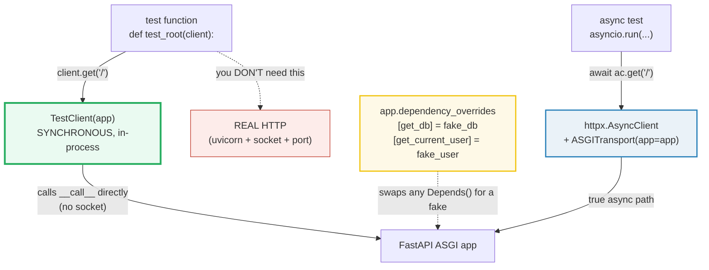
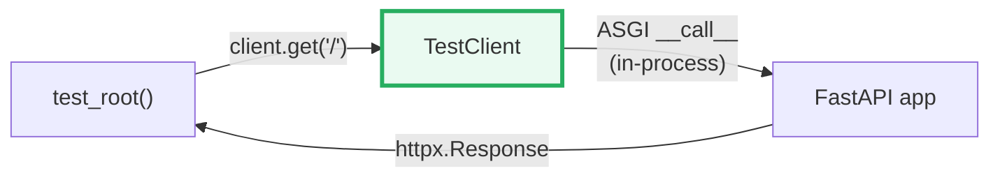
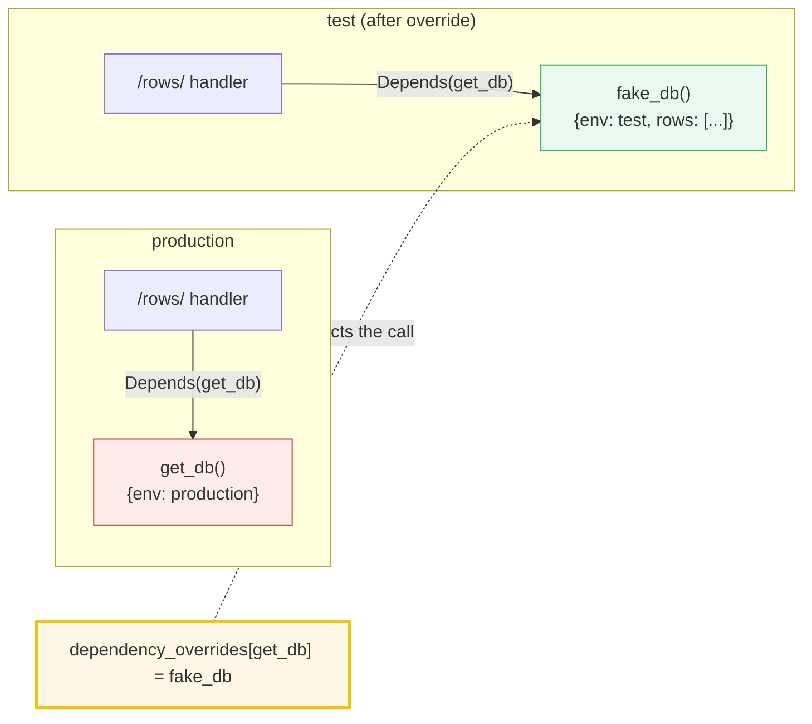
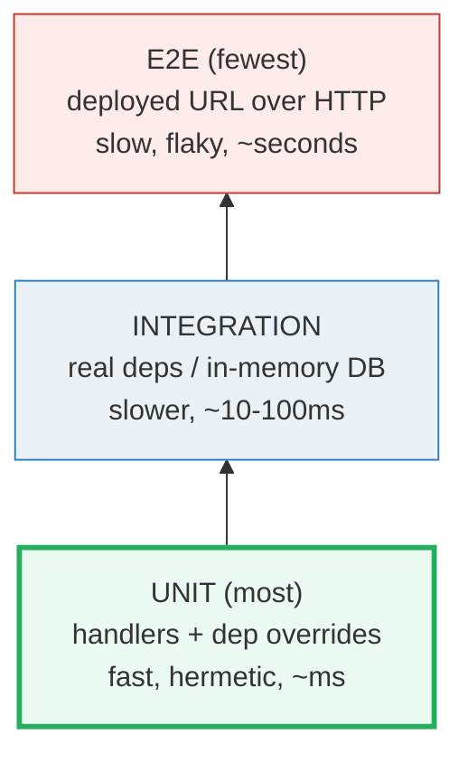

# FastAPI Testing — `TestClient`, `dependency_overrides`, and the Async Client

> **The one rule:** a test should exercise the **route** without exercising the
> **world**. `TestClient` drives the app **in-process** (no socket, no port, no
> `uvicorn`), and `app.dependency_overrides` swaps any `Depends()` — DB, auth,
> settings — for a **fake**. The result: fast, hermetic, deterministic API tests.
> Async paths get a true async client (`httpx.AsyncClient` + `ASGITransport`).

**Companion code:** [`fastapi_testing.py`](./fastapi_testing.py).
**Every status code and JSON body below is printed by `uv run python
fastapi_testing.py`** (driven through `fastapi.testclient.TestClient` +
`httpx.AsyncClient` + `pytest.main` on a /tmp scratch test file) — change the
code, re-run, re-paste. Nothing here is hand-computed. Captured stdout lives in
[`fastapi_testing_output.txt`](./fastapi_testing_output.txt).

**Goal of this bundle (lineage, old → new):**

> from *"I test my API by running the server and `curl`-ing it"*
> → *"`TestClient` drives the app in-process (no network) and
> `dependency_overrides` swap the DB/auth for fakes — fast, hermetic,
> deterministic API tests; async endpoints get a true async client."*

🔗 This is bundle **#49 of Phase 7** (FastAPI). It assumes
[`FASTAPI_ROUTING_PARAMETERS`](./TODO.md) (#43),
[`FASTAPI_BODIES_PYDANTIC`](./TODO.md) (#44), and especially
[`FASTAPI_DEPENDENCIES`](./FASTAPI_DEPENDENCIES.md) (#45) — whose §H previewed
`dependency_overrides` as "full treatment in FASTAPI_TESTING." pytest fixtures
come from [`TESTING_LINTING`](./TESTING_LINTING.md) (P4 #28); the auth override
pattern connects to [`FASTAPI_AUTH`](./TODO.md) (#48); and the async client
relies on the event loop from [`ASYNCIO_BASICS`](./ASYNCIO_BASICS.md) (P3 #21).
See [`TODO.md`](./TODO.md) for the full plan.

---

## 0. The one picture



`TestClient` (sync, no network) and `httpx.AsyncClient` + `ASGITransport` (async,
no network) both hit the **same ASGI app object** in-process. The difference is
whether the test function itself is `def` or `async def`. Either way: no socket,
no port, no server startup.

| Want | Use | Test fn | Why |
|---|---|---|---|
| Simple, fast, 90% of tests | `TestClient(app)` | `def test_...():` | runs async handlers via an internal portal |
| Exercise the real async path | `httpx.AsyncClient` + `ASGITransport` | `async def test_...():` | lets you `await` async DB/IO in the same test |
| Swap DB/auth for fakes | `app.dependency_overrides[real] = fake` | either | hermetic: no real DB, no real JWT |
| Reset an override | `app.dependency_overrides = {}` | either | restores the real dep |

---

## 1. `TestClient` basics — GET in-process, no socket

`fastapi.testclient.TestClient` is re-exported from Starlette (which in turn is
backed by [HTTPX](https://www.python-httpx.org)). You wrap your `FastAPI()` app
once and then drive it with the same verbs you'd use with `httpx` or `requests`:
`.get()`, `.post()`, `.put()`, `.delete()`. Each call returns an
`httpx.Response` with `.status_code` and `.json()`.



> From `fastapi_testing.py` Section A:
> ```
> ======================================================================
> SECTION A — TestClient basics: GET in-process, no socket, no uvicorn
> ======================================================================
> fastapi.testclient.TestClient (re-exported from Starlette, backed by
> httpx) calls the ASGI app DIRECTLY in-process. No socket, no port, no
> uvicorn. client.get('/...') returns an httpx.Response; .status_code
> and .json() are the two assertions you write.
> 
> GET /            -> 200 {'msg': 'Hello World'}
> GET /items/42    -> 200 {'item_id': 42}
> type(r1)         -> Response (httpx.Response)
> 
> [check] GET / returns 200: OK
> [check] GET / body is the handler's dict: OK
> [check] path param parsed (item_id=42): OK
> [check] TestClient returns an httpx.Response: OK
> ```

### Why there's no network (internals)

An ASGI app is just a callable: `app(scope, receive, send) → coroutine`. The
`TestClient` doesn't open a socket — it synthesizes a `scope` dict, calls
`app.__call__` directly, collects the `send()` events (response status, headers,
body chunks), and packs them into an `httpx.Response`. Because the handler may be
`async def`, `TestClient` runs it through an internal **event-loop portal**
(anyio's portal mechanism) so your `def test_...():` stays synchronous. This is
why the official docs call it "very familiar and intuitive" and "you can use
pytest directly without complications."

---

## 2. POST / PUT / DELETE + JSON body + status codes

`TestClient` mirrors all httpx verbs. Pass a Python `dict` (or any JSON-able
value) to the `json=` kwarg and httpx serializes it as the request body. To
return `201 Created` instead of the default `200 OK`, set `status_code=201` on
the route decorator.

> From `fastapi_testing.py` Section B:
> ```
> ======================================================================
> SECTION B — POST/PUT/DELETE + JSON body + status codes
> ======================================================================
> TestClient mirrors the httpx verbs: .post/.put/.delete accept a
> `json=` kwarg that serializes the body. Set status_code=201 on the
> route for create endpoints (the HTTP convention for 'created').
> 
> POST   /items/    -> 201 {'created': {'name': 'wrench', 'qty': 7}}
> PUT    /items/7   -> 200 {'replaced': {'name': 'wrench', 'qty': 7}}
> DELETE /items/7   -> 200 {'deleted': 7}
> 
> [check] POST returns 201 (status_code=201 on the route): OK
> [check] POST body echoes the created item: OK
> [check] PUT returns 200 and replaces: OK
> [check] DELETE returns 200 with the deleted key: OK
> ```

**Gotcha — body models must be module-level.** With `from __future__ import
annotations` (which turns every annotation into a string), FastAPI resolves type
hints via `typing.get_type_hints()`. If your `class Item(BaseModel)` is defined
*inside a function*, it's not in module scope and FastAPI silently falls back to
treating the parameter as a **query** param instead of a **body** — the POST will
return `422` with `loc: ['query', 'item']` instead of parsing the JSON body.
Define Pydantic models at module level (as this bundle does).

---

## 3. Validation 422 — bad body returns `error loc`, not 500

When a pydantic-model body fails validation, FastAPI short-circuits with
**422 Unprocessable Entity** and a structured `detail` list. Each entry has
`type`, `loc`, `msg`, and `input`. Assert on the **`loc`** (the failing field
path), not on a string-matched message — messages can change across pydantic
versions, but `loc` is stable.

> From `fastapi_testing.py` Section C:
> ```
> ======================================================================
> SECTION C — Validation 422: bad body returns error loc, not 500
> ======================================================================
> A pydantic-model body that fails validation makes FastAPI return 422
> (Unprocessable Entity) with detail=[{loc, msg, type, ...}]. The `loc`
> pinpoints the failing field — assert on it in tests rather than
> string-matching the message.
> 
> POST /items/ missing 'qty' -> 422
> detail: [{'type': 'missing', 'loc': ['body', 'qty'], 'msg': 'Field required', 'input': {'name': 'wrench'}}]
> 
> [check] missing required field -> 422 (not 500): OK
> [check] error loc points at ('body', 'qty'): OK
> ```

The `loc` tuple is `("body", "qty")`: `"body"` because the field lives in the
JSON body, `"qty"` because that's the missing model field. A query-param error
would have `loc = ("query", ...)`, a path-param error `loc = ("path", ...)`.

---

## 4. `dependency_overrides` — swap `get_db` for a fake

This is the **central testing lever** for FastAPI. Any dependency (a function
used in `Depends(...)`) can be swapped by registering a fake in
`app.dependency_overrides`:

```python
app.dependency_overrides[real_dep] = fake_dep   # swap
...
app.dependency_overrides = {}                   # reset
```

FastAPI calls `fake_dep` instead of `real_dep` for **every** route that depends
on it — no real database connection, no real external API, no real config.
🔗 Full DI theory (the resolution graph, `yield`-deps, per-request cache) is in
[`FASTAPI_DEPENDENCIES`](./FASTAPI_DEPENDENCIES.md) (#45); this bundle is the
*testing* application.



> From `fastapi_testing.py` Section D:
> ```
> ======================================================================
> SECTION D — dependency_overrides: swap get_db for a fake (no real DB)
> ======================================================================
> app.dependency_overrides[real] = fake makes FastAPI call `fake`
> instead of `real` everywhere. Below: a route Depends(get_db); we
> override get_db with a fake returning canned data, then RESET with
> = {}. This is the hermetic-test lever (full DI theory in #45).
> 
> real dep      : {'env': 'production', 'rows': []}
> override set  : {'env': 'test', 'rows': [{'id': 1}, {'id': 2}]}
> override drop : {'env': 'production', 'rows': []}
> 
> [check] real dep ran (env=production): OK
> [check] handler saw the FAKE rows (no real DB hit): OK
> [check] reset restores the real dep: OK
> ```

### Why the override is keyed on the *function object* (internals)

`dependency_overrides` is a plain `dict` whose **keys are dependable functions**
(not strings, not strings-of-names). When FastAPI's dependency resolver is about
to call a dependable, it first checks
`app.dependency_overrides.get(dependable.__original_call__)`. If a fake is
registered, it calls the fake instead — but the **cache key** and the injection
position stay the same, so the handler receives the fake's return value exactly
where it expected the real value. That's why resetting to `{}` instantly
restores the real dep: the resolver simply falls through to the original
callable.

---

## 5. Auth override — fake `get_current_user` skips real JWT

The same mechanism handles authentication. In production, `get_current_user`
might decode a JWT, hit an OAuth provider, or query a user table. In tests, you
override it with a function that returns a hardcoded fake user — the protected
route returns `200` without any real auth machinery. This is the standard "don't
hit real auth in unit tests" pattern recommended by the FastAPI docs.

> From `fastapi_testing.py` Section E:
> ```
> ======================================================================
> SECTION E — Auth override: fake get_current_user skips real JWT/OAuth
> ======================================================================
> The standard 'don't hit real auth in unit tests' pattern: a route
> Depends(get_current_user); tests override it to return a fake user,
> skipping JWT/OAuth entirely. The protected route returns 200.
> 
> real dep          -> 401 {'detail': 'not authenticated'}
> override to alice -> 200 {'user': {'id': 99, 'name': 'alice'}}
> 
> [check] real auth dep raises 401: OK
> [check] overriding auth makes the protected route return 200: OK
> [check] the fake user was injected into the handler: OK
> ```

Without the override, the real `get_current_user` raises `HTTPException(401)` and
the handler never runs. With the override, FastAPI injects
`{"id": 99, "name": "alice"}` directly — no token, no header, no JWT library.
🔗 The full JWT/OAuth machinery itself is the subject of
[`FASTAPI_AUTH`](./TODO.md) (#48).

---

## 6. pytest fixtures — the `app` + `client` boilerplate

The idiomatic layout: one `@pytest.fixture` builds the `app`, another wraps it
in a `TestClient`. Tests list `client` as a parameter and pytest injects it by
name. This gives each test a fresh app (and therefore a clean
`dependency_overrides` dict) automatically.

> From `fastapi_testing.py` Section F:
> ```
> ======================================================================
> SECTION F — pytest fixtures: an app fixture + a client fixture
> ======================================================================
> The boilerplate: one @pytest.fixture builds the app, another wraps it
> in a TestClient. Tests list `client` as a param — pytest injects it.
> Below: a tiny test file written to /tmp, run via pytest.main.
> 
> --- pytest on test_fixtures.py (client/app fixtures) ---
> .
> 1 passed in <duration>s
> 
> [check] fixture-based test -> exit code 0 (ExitCode.OK): OK
> [check] output reports '1 passed': OK
> ```

🔗 Fixture theory (injection by name, `tmp_path`, `capsys`, `monkeypatch`,
parametrize) is in [`TESTING_LINTING`](./TESTING_LINTING.md) (P4 #28). The
pattern here is the FastAPI-specific application of those concepts. In a real
project the fixture would live in `conftest.py` so every test file in the
package can use it without importing it.

---

## 7. Async testing — `httpx.AsyncClient` + `ASGITransport`

`TestClient` is synchronous: it runs your `async def` handlers through an
internal portal so you can call them from a plain `def test_...():`. That's
convenient but means the test itself can't `await` anything. When you need the
**real** async path — e.g. to `await` an async DB query in the same test, or to
verify your handler works with `httpx.AsyncClient` integration — use:

```python
async with httpx.AsyncClient(
    transport=httpx.ASGITransport(app=app),
    base_url="http://test",
) as ac:
    response = await ac.get("/")
```

`ASGITransport(app=app)` wires the `AsyncClient` directly to the ASGI app —
again in-process, no socket. The `base_url` is required by `httpx` but can be
any dummy string since no real HTTP is made.

> From `fastapi_testing.py` Section G:
> ```
> ======================================================================
> SECTION G — Async testing: httpx.AsyncClient + ASGITransport
> ======================================================================
> TestClient runs async handlers via an internal portal — convenient
> but SYNCHRONOUS. To exercise the REAL async path (and to `await`
> other async code in the same test), use httpx.AsyncClient with
> transport=httpx.ASGITransport(app=app); drive it with asyncio.run.
> 
> async GET /  -> 200 {'msg': 'async'}
> type(r)      -> Response (httpx.Response)
> 
> [check] async client GET returns 200: OK
> [check] async client GET returns the body: OK
> [check] AsyncClient also returns an httpx.Response: OK
> ```

### Why you'd reach for the async client (internals)

`TestClient` uses anyio's portal to bridge sync → async: it runs a background
event loop and submits coroutine calls to it. This works for most tests but has
two limitations: (1) you can't `await` anything inside the test body (it's a
plain `def`), and (2) objects that bind to a specific event loop (e.g. some
async DB drivers) may raise `RuntimeError: Task attached to a different loop`.
The `AsyncClient` approach sidesteps both: the test runs `async def`, so it
shares the loop with the app and can freely `await` async helpers. The FastAPI
docs recommend `@pytest.mark.anyio` (or `pytest-asyncio`) to mark async test
functions; this bundle uses bare `asyncio.run()` for simplicity.

🔗 The event loop, `asyncio.run`, and the sync/async boundary are covered in
[`ASYNCIO_BASICS`](./ASYNCIO_BASICS.md) (P3 #21).

---

## 8. The API test pyramid

Not all tests are equal. The **test pyramid** (Mike Cohn, *Succeeding with Agile*)
applies to APIs just as it does to UIs: write **many** fast unit tests, **fewer**
integration tests, and a **tiny** number of end-to-end smoke tests.



- **Unit tests (the base, the majority):** each test hits **one route** with
  `TestClient`, and `dependency_overrides` swaps the DB/auth/settings for fakes.
  No network, no real database — sub-millisecond, hermetic, deterministic. This
  is what Sections A–E demonstrate.
- **Integration tests (the middle):** the real dependencies run — a real (often
  in-memory SQLite or testcontainers) database, real pydantic validation, real
  middleware. Slower (10–100 ms each) but they catch wiring bugs that fakes hide.
- **E2E smoke tests (the tip, the fewest):** a handful of tests against a
  deployed/staged URL over real HTTP. They're the slowest and the flakiest
  (network, DNS, auth provider), so you keep them to single digits and run them
  in CI, not on every save.

> From `fastapi_testing.py` Section H:
> ```
> ======================================================================
> SECTION H — The API test pyramid: many unit, fewer integration, smoke e2e
> ======================================================================
> Tests form a PYRAMID. Bottom (most): UNIT tests — handlers with
> dependency_overrides swapping DB/auth for fakes (hermetic, fast).
> Middle: INTEGRATION — real deps / a real (often in-memory) DB. Top
> (fewest): end-to-end SMOKE against a deployed/staged URL.
> 
> layer         strategy                  cost
> ----------------------------------------------------------------------
> unit          handlers + dep overrides  fast, hermetic, ~ms each
> integration   real deps / in-memory DB  slower, ~10-100ms each
> e2e           deployed URL over HTTP    slow, flaky, ~seconds
> 
> example counts: unit=120, integration=25, e2e=3 (total 148)
> 
> [check] unit tests are the MAJORITY: OK
> [check] unit tests > integration tests: OK
> [check] e2e is the thinnest layer (slowest, flakiest): OK
> ```

---

## Pitfalls

| Trap | Example | The fix |
|---|---|---|
| Body model defined inside a function | `item: Item` → `422 loc: ['query','item']` (treated as query, not body) | define Pydantic models at **module level**; `from __future__ import annotations` turns annotations to strings that `get_type_hints` can't resolve locally |
| Forgetting to reset `dependency_overrides` | test A's override leaks into test B | set `app.dependency_overrides = {}` at the end of each test, or use a fixture with `yield` + teardown |
| Asserting on error **message** strings | `assert "Field required" in detail` breaks on a pydantic version bump | assert on `detail[0]["loc"]` (the field path) — it's stable across versions |
| Using `TestClient` inside an `async def` test | `RuntimeError: This event loop is already running` | switch to `httpx.AsyncClient` + `ASGITransport(app=app)` for async tests |
| `AsyncClient` + `base_url` left out | `httpx` raises "Missing URL" | `base_url` is required even though no real HTTP is made — any dummy like `"http://test"` works |
| Testing with `curl` against a running server | slow, order-dependent, port conflicts, non-hermetic | use `TestClient` — no server, no port, no network; 1000+ tests/second |
| Overriding a dep that has `yield` (setup/teardown) | teardown silently never runs in the fake | the fake must also be a generator (or just a plain `return`); the real `yield`-dep's teardown is skipped by design when overridden |
| `AsyncClient` doesn't trigger lifespan events | startup/shutdown (DB pool, etc.) never fires | wrap with `asgi-lifespan`'s `LifespanManager`, or call startup explicitly |
| Inverting the pyramid (many e2e, few unit) | CI takes 10 min, flakes daily | unit tests with `dependency_overrides` are ms-fast and hermetic — they should be the majority |

---

## Cheat sheet

- **`TestClient(app)`** — from `fastapi.testclient`; backed by `httpx`; calls the
  ASGI app in-process (no socket, no port, no `uvicorn`). Returns `httpx.Response`.
- **The two assertions:** `assert response.status_code == 200` and
  `assert response.json() == {...}`.
- **Body:** pass `json={...}` to `.post()` / `.put()`. Pydantic body models must
  be **module-level** (annotations are strings under `from __future__ import
  annotations`).
- **422 validation:** bad body → `422` with `detail[0]["loc"]` pointing at the
  failing field (e.g. `("body", "qty")`). Assert on `loc`, not on message text.
- **`dependency_overrides[real] = fake`** — swaps any `Depends()` for a fake.
  Reset with `app.dependency_overrides = {}`. Keys are **function objects**.
- **Auth override:** override `get_current_user` with a `lambda: {"id": 99, ...}`
  to skip JWT/OAuth entirely in unit tests.
- **Fixtures:** `@pytest.fixture def app()` builds the app; `def client(app)`
  wraps it in `TestClient`. Tests list `client` as a param. Put them in
  `conftest.py`.
- **Async client:** `httpx.AsyncClient(transport=httpx.ASGITransport(app=app),
  base_url="http://test")` — true async path, no socket. Drive with `asyncio.run`
  or `@pytest.mark.anyio`.
- **Pyramid:** unit (dep overrides, ms) > integration (real DB, 10–100ms) > e2e
  (deployed URL, seconds). Keep e2e to single digits.

---

## Sources

- **FastAPI docs — Tutorial: Testing.**
  https://fastapi.tiangolo.com/tutorial/testing/
  *The canonical TestClient walkthrough: "testing FastAPI applications is easy and
  enjoyable … based on HTTPX"; the extended GET/POST example with `X-Token`
  headers; the note that test functions are "normal `def`, not `async def`" so you
  "can use pytest directly without complications." Quoted/used in §1 and §2.*
- **FastAPI docs — Advanced: Testing Dependencies with Overrides.**
  https://fastapi.tiangolo.com/advanced/testing-dependencies/
  *The official `app.dependency_overrides` recipe: "put as a key the original
  dependency (a function), and as the value, your dependency override"; reset with
  `app.dependency_overrides = {}`; the external-auth-provider use case. Basis for
  §4 and §5.*
- **FastAPI docs — Advanced: Async Tests.**
  https://fastapi.tiangolo.com/advanced/async-tests/
  *The `httpx.AsyncClient(transport=ASGITransport(app=app), base_url="http://test")`
  pattern; why `TestClient`'s "magic doesn't work anymore when we're using it
  inside asynchronous functions"; the `@pytest.mark.anyio` marker; the lifespan
  caveat. Quoted in §7.*
- **Starlette docs — TestClient.**
  https://www.starlette.dev/testclient/
  *"Thanks to Starlette, testing FastAPI applications is easy" — confirms
  `fastapi.testclient.TestClient` is a re-export of `starlette.testclient.TestClient`,
  which is backed by HTTPX. Referenced in §1.*
- **HTTPX documentation.**
  https://www.python-httpx.org
  *The underlying client; the FastAPI testing docs say "whenever you need the
  client to pass information … search how to do it in `httpx`." Covers `json=`,
  `headers=`, `cookies=`, and the `ASGITransport` used in §7.*
- **HTTPX ASGI Transport (source / docs).**
  https://www.python-httpx.org/advanced/transports/#asgitransport
  *`httpx.ASGITransport(app=app)` — the transport that wires `AsyncClient`
  directly to an ASGI app in-process without opening a socket. Used in §7.*
- **Mike Cohn — Test Pyramid (*Succeeding with Agile*, 2009).**
  https://martinfowler.com/articles/practical-test-pyramid.html
  *Martin Fowler's writeup of the original concept; the "many unit, fewer
  integration, fewest e2e" shape applied to APIs in §8.*
