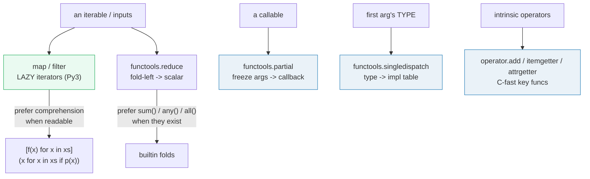
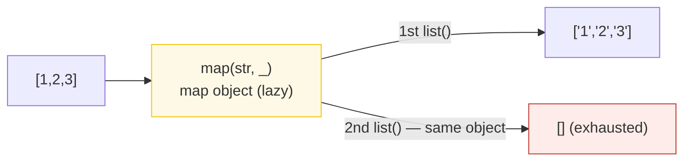
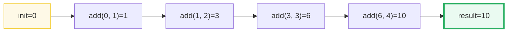
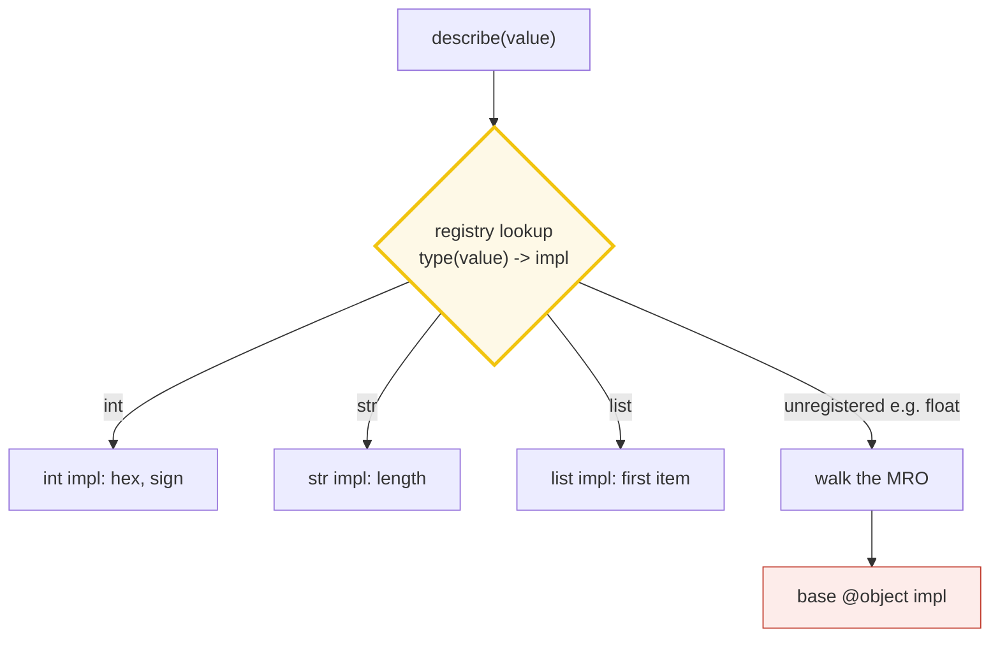
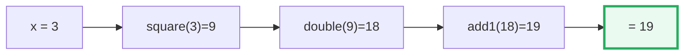

# Functional Toolkit — `map`/`filter`/`reduce`, `partial`, `singledispatch`, `operator`

> **The one rule:** Python isn't a functional language, but it ships a
> *pragmatic* functional toolkit — lazy `map`/`filter`, `functools.reduce`/
> `partial`/`singledispatch`, and the `operator` module. The expert move is
> knowing **when a `map`/`reduce` beats a loop** (and when it just obscures):
> comprehensions usually win for `map`/`filter`, but `partial`, `singledispatch`,
> and `operator.itemgetter` fill niches loops can't.

**Companion code:** [`functional_toolkit.py`](./functional_toolkit.py).
**Every number and table below is printed by `uv run python
functional_toolkit.py`** — change the code, re-run, re-paste. Nothing here is
hand-computed. Captured stdout lives in
[`functional_toolkit_output.txt`](./functional_toolkit_output.txt).

**Goal of this bundle (lineage, old → new):**

> from *"Python isn't functional"*
> → *"Python has a pragmatic functional toolkit — map/filter/reduce, partial
> application, singledispatch, operator — and I know when it beats a loop
> (and when it just obscures)."*

🔗 This bundle leans on three siblings: laziness and single-use iterators are
defined properly in [`GENERATORS_ITERATORS`](./GENERATORS_ITERATORS.md) (P1 #5);
`functools` is also home to `@lru_cache` / `@cache`, the backbone of
[`DECORATORS_DEEP`](./DECORATORS_DEEP.md) (P2 #14); and `singledispatch` is the
runtime twin of two later idioms — `match-case` (P1 #7 CONTROL_FLOW) and
`@overload` ([`TYPE_HINTS`](./TYPE_HINTS.md), P3 #18). See [`TODO.md`](./TODO.md)
for the full plan.

---

## 0. The five tools on one page



| Tool | Returns | Lazy? | What it replaces |
|---|---|---|---|
| `map(f, xs)` | `map` iterator | **yes** (single-use) | `[f(x) for x in xs]` (often clearer) |
| `filter(p, xs)` | `filter` iterator | **yes** (single-use) | `[x for x in xs if p(x)]` (often clearer) |
| `functools.reduce(f, xs, init)` | scalar | eager | `sum`/`any`/`all`/`min`/`max` when they fit |
| `functools.partial(f, *a, **k)` | `partial` callable | n/a | a hand-written wrapper to bind args |
| `functools.singledispatch(f)` | generic function | n/a | a long `if/elif isinstance(...)` chain |
| `operator.itemgetter/attrgetter` | key callable | n/a | `lambda r: r[1]` / `lambda o: o.age` (slower) |

---

## 1. `map`/`filter` return ITERATORS (lazy, single-use) in Py3

The single biggest Py2→Py3 change in this corner of the language: **`map` and
`filter` no longer build lists.** They return a `map` / `filter` *object* that
is a **single-use iterator** — values are produced on demand, and a second pass
over the same object is empty. (In Python 2 both returned lists.) The same
release (3.0, per PEP 3100) **removed `reduce` from builtins entirely**; it
now lives in `functools` and has to be imported.



The pythonic equivalent of `map(str, xs)` is `[str(x) for x in xs]` (eager) or
`(str(x) for x in xs)` (lazy genexpr). GvR's [reasoning](https://docs.python.org/3/faq/programming.html#why-is-python-not-fully-functional)
("Why is Python not fully functional?"): the comprehension form reads at a
glance and lets you embed a filter clause — `map` + `filter` chained usually
does not.

> From `functional_toolkit.py` Section A:
> ```
> ======================================================================
> SECTION A — map/filter return ITERATORS (lazy, single-use) in Py3
> ======================================================================
> In Python 3, map() and filter() do NOT build a list. They return
> single-use ITERATOR objects (map/filter) that compute each value
> on demand. list() materializes them; a second pass is EMPTY. In
> Python 2 both returned lists; reduce() was removed from builtins
> entirely in 3.0 (PEP 3100) and now lives in functools.
> 
> expression                      value                     type
> --------------------------------------------------------------------
> map(str, [1,2,3])               <map object>              map
> list(map(str, [1,2,3]))         ['1', '2', '3']           list
> filter(None, [0,2,0,4])         <filter object>           filter
> list(filter(None, [0,2,0,4]))   [2, 4]                    list
> 
> m2 = map(str, [1,2,3])
> list(m2) (1st pass) = ['1', '2', '3']
> list(m2) (2nd pass) = []   <- EMPTY: iterator consumed
> 
> Pythonic equivalents:
>   [str(x) for x in [1,2,3]]   -> eager list  ['1', '2', '3']
>   (str(x) for x in [1,2,3])   -> lazy genexpr (same laziness as map)
> 
> [check] map object is not a list (it is a lazy iterator): OK
> [check] list(map(str,[1,2,3])) == ['1','2','3']: OK
> [check] filter(None, ...) drops the falsy zeros: OK
> [check] map object is single-use: list() twice -> 2nd is []: OK
> [check] the listcomp equivalent produces the same values eagerly: OK
> ```

### Why `map`/`filter` are lazy now (internals)

A `map` object holds three fields: the function, a reference to the source
iterable's iterator, and a result tuple buffer. It implements `__iter__`
(returns `self`) and `__next__` (pulls one item from the source iterator,
applies the function, returns it). Because it IS its own iterator —
`iter(map_obj) is map_obj` — it obeys the **single-use** rule that bites every
iterator in Python: once `StopIteration` fires, the object is dead forever.
This is the same protocol a generator or a file object follows.

🔗 The full iterator-protocol treatment — `__iter__`/`__next__`, frame
suspension, generator exhaustion — is in
[`GENERATORS_ITERATORS`](./GENERATORS_ITERATORS.md) (P1 #5). Everything in this
bundle about "single-use" comes straight from that protocol.

### The expert gotcha

The laziness is silent: `result = map(f, huge)` returns immediately with a
`map` object, and nothing has actually run. If you then *don't* iterate the
result (or you iterate it twice), you get either no work done or an empty
second pass. Worse, if `f` raises on item #3, the traceback points at the
*consumer* (`list(result)`), not at the `map(...)` line — the call site is long
gone. The fix is to either materialize eagerly when in doubt, or reach for a
comprehension which makes the eager/lazy choice visible at the syntax level.

---

## 2. `functools.reduce` — the fold-left (and why `sum()` usually wins)

`reduce(f, [a, b, c, d], init)` is the classic **left fold**. It seeds an
accumulator with `init`, then walks the iterable left-to-right, applying
`f(acc, next)` at each step. The accumulator is always the *left* argument of
`f`. Without `init`, the first element seeds the accumulator (and an empty
iterable raises `TypeError`).



PEP 3100 (Py3) demoted `reduce` out of builtins precisely because **most real
reductions have a more readable builtin**: `sum()` for `+`, `math.prod()` for
`*`, `any`/`all` for boolean folds, `min`/`max` for selection. Reach for
`reduce` when no builtin fits (a custom merge) — and even then, a plain loop
often reads better.

> From `functional_toolkit.py` Section B:
> ```
> ======================================================================
> SECTION B — functools.reduce: the fold-left (and why sum() usually wins)
> ======================================================================
> reduce(f, [a,b,c,d], init) folds LEFT: it accumulates f(init,a),
> then f(_,b), f(_,c), f(_,d). The accumulator is always the LEFT
> argument. An optional initializer seeds the accumulator and is
> the only safe choice for an empty iterable.
> 
> expression                                    result
> ------------------------------------------------------------
> reduce(lambda a,b: a+b, [1,2,3,4])            10
> reduce(lambda a,b: a+b, [1,2,3,4], 100)       110
> reduce(operator.mul, [1,2,3,4])               24
> reduce(lambda a,b: a+b, [], 0)                0
> 
> Step-by-step fold trace of reduce(add, [1,2,3,4]):
>   initial acc         = 0
>   add(acc, 1) -> acc = 1
>   add(acc, 2) -> acc = 3
>   add(acc, 3) -> acc = 6
>   add(acc, 4) -> acc = 10
> 
> sum() is the builtin you'd usually use instead of reduce(add, ...).
>   sum([1,2,3,4])      = 10   <- faster, clearer
>   sum([1,2,3,4], 100) = 110   <- start arg == reduce init
> 
> [check] reduce(add, [1,2,3,4]) == 10: OK
> [check] reduce(add, [1,2,3,4], 100) == 110: OK
> [check] reduce(mul, [1,2,3,4]) == 24 (factorial-like): OK
> [check] reduce(add, [], 0) == 0 (initializer protects empty iter): OK
> [check] sum() matches reduce(add, ...) for [1,2,3,4]: OK
> ```

### Why `reduce` left builtins (internals / history)

GvR's [2005 "Origins of Python's Functional Features"](https://mail.python.org/pipermail/python-3000/2006-January/000066.html)
and the PEP 3100 notes: `reduce` was dropped from builtins because "the number
of cases in which reduce is the obviously right tool is very small," and the
cases people did use it for (`sum`, `prod`, `any`, `all`) were better served
by named builtins. It stayed in `functools` for the rare legitimate fold
(e.g. flattening one level of nesting via `operator.concat`). The Python 3.8+
addition of `math.prod()` closed the last common "I just need reduce(\*)" gap.

### The expert gotcha — always pass `initial` for empty-safe folds

Without `initial`, `reduce(f, [])` raises `TypeError` ("empty iterable with no
initial value"). If your iterable *might* be empty, pass `initial=` explicitly
— it doubles as the empty-iterable return value. The CPython pseudo-impl in the
docs makes this obvious: with `initial` missing, the accumulator is seeded by
`next(it)`, which raises `StopIteration` on an empty source and `reduce`
converts that into a `TypeError`.

---

## 3. `functools.partial` — freeze args, pre-configure a callback

`partial(func, *args, **keywords)` returns a new callable that behaves like
`func` with `*args` prepended and `**keywords` merged in. Any extra args at
call time are appended to the frozen ones; extra keywords override. The
classic use case is **pre-configuring a callback** so the call site can be
just `callback()` — common in GUI/signal handlers, `multiprocessing`, and test
fixtures.

The returned object is a `functools.partial` *instance* (not a function), and
exposes three read-only attributes: `.func` (the wrapped callable), `.args`
(the frozen positional args), and `.keywords` (the frozen keyword args). This
makes partials introspectable — you can inspect a configured callback to see
what it will do.

> From `functional_toolkit.py` Section C:
> ```
> ======================================================================
> SECTION C — functools.partial: freeze args, pre-configure callbacks
> ======================================================================
> partial(func, *args, **kwargs) returns a new callable with those
> args/kwargs 'frozen in'. Extra args at call time are appended.
> The classic use: pre-configuring a callback so the call site is
> just `callback()`.
> 
> expression                    result
> --------------------------------------------
> add5 = partial(add, 5)        
> add5(1, 1)                    7
> add53 = partial(add, 5, 3)    
> add53(1)                      9
> basetwo = partial(int, base=2)
> basetwo("10010")              18
> 
> add5.func is add        = True
> add5.args               = (5,)
> basetwo.keywords        = {'base': 2}
> 
> [check] partial(add,5)(1,1) == 7: OK
> [check] partial(add,5,3)(1) == 9: OK
> [check] partial(int, base=2)('10010') == 18: OK
> [check] partial exposes .func/.args/.keywords: OK
> ```

### Why `partial` is a C type, not a closure (internals)

The docs' "roughly equivalent to" pseudo-code shows a `def newfunc(*more_args,
**more_keywords)` that does `func(*args, *more_args, **(keywords | more_keywords))`
— but the real `partial` is a **C-implemented type** (`functools.partialobject`
in `Modules/_functoolsmodule.c`). Being a C type means (a) attribute access
(`.func`, `.args`, `.keywords`) is cheap, (b) calling it has no Python-level
wrapper frame, and (c) it's picklable in most cases (the wrapped `func` and
frozen args must be picklable). A hand-rolled `lambda` capturing the same state
would be neither introspectable nor (in older Pythons) reliably picklable,
which matters when you ship a partial across a `multiprocessing` pipe.

### The expert gotcha

`partial` freezes **positional args from the left** only. You cannot skip the
first positional arg to pre-fill the second — that's what the Python 3.14
`functools.Placeholder` sentinel was added for (the docs show
`partial(str.replace, _, _, '')` so you can reserve a slot). On older Pythons,
the workaround is to bind by keyword instead: `partial(func, b=2)` works if
`b` is a named parameter. Also note `partialmethod` (not `partial`) is the
right tool for **methods** — it plays correctly with descriptor binding on
`self`.

---

## 4. `functools.singledispatch` — dispatch on the FIRST arg's type

`@singledispatch` transforms a function into a **generic function**: the impl
that actually runs is chosen by the **runtime type of the first argument**.
You register one impl per type via `@func.register`. This is the
**open/closed** alternative to a long `if/elif isinstance(...)` chain: adding
support for a new type means registering a new impl, *not* editing the
dispatch function. Adding a type can even be done from another module.



Two critical scoping rules: dispatch is on the **first arg only** (other args
are ignored for dispatch), and **methods** need `@singledispatchmethod` (added
in 3.8) — `@singledispatch` on a method would dispatch on `self`, which is
useless. When no impl is registered for the exact type, singledispatch walks
the type's MRO and uses the first registered base; if nothing matches, it runs
the original `@object`-registered base impl (the function body under the
`@singledispatch` decorator itself).

> From `functional_toolkit.py` Section D:
> ```
> ======================================================================
> SECTION D — functools.singledispatch: dispatch on the FIRST arg's type
> ======================================================================
> @singledispatch turns a function into a GENERIC function: the impl
> that runs is chosen by the RUNTIME TYPE of the FIRST argument. You
> register one impl per type. This is the open/closed alternative to
> a big if/elif isinstance chain: adding a type does NOT mean editing
> the dispatch function. NOTE: dispatch is on the FIRST arg ONLY; for
> methods use @singledispatchmethod.
> 
> call                    dispatched impl runs
> ----------------------------------------------------------------
> describe(5)             int 5: hex 0x5, is_positive=True
> describe('x')           str of length 1: 'x'
> describe([10,20])       list of 2 items: first=10
> describe(3.14)          object: 3.14
> describe(None)          object: None
> 
> Under the hood there is a type->impl registry:
>   describe.registry keys = ['int', 'list', 'object', 'str']
>   describe.dispatch(int) = _
>   describe.dispatch(float) = describe  (falls back to the base @object impl)
> 
> [check] int impl runs for 5 (mentions hex): OK
> [check] str impl runs for 'x' (mentions length): OK
> [check] list impl runs for [10,20]: OK
> [check] unregistered float falls back to base object impl: OK
> [check] dispatch(int) is the int-specific function, not the base: OK
> ```

### Why singledispatch is *single* (internals)

CPython's `singledispatch` keeps a `dict` mapping `type -> impl`. On a call it
does `type(arg)` (one C-level opcode), then a dict lookup; on a miss it walks
`type(arg).__mro__` left-to-right and uses the first registered base. This is
"single dispatch" in the CLOS/multimethod sense — only **one** argument
participates in dispatch. True multimethods (dispatch on the tuple of all arg
types) need third-party libraries (e.g. `multipledispatch`) or the
`@overload`-plus-runtime-check pattern. The `where` clauses of `match-case`
(3.10+) cover a lot of the same ground with a different ergonomic; see the
comparison in the pitfalls table below.

### The expert gotcha

`singledispatch` dispatches on the **runtime** type, ignoring annotations on
the registered function *except* as a shorthand for the registered type. So
`@describe.register` `def _(arg: list[int]): ...` registers on `list` — the
`[int]` parameterization is for static checkers only, and `[1,2,3]` dispatches
identically to `["a","b"]` at runtime (the docs call this out explicitly). To
register a generic alias like `list[int]`, pass the type explicitly:
`@describe.register(list)`. Also: registering on an
[abstract base class](https://docs.python.org/3/glossary.html#term-abstract-base-class)
(`collections.abc.Mapping`) dispatches *virtual subclasses* too — so a plain
`dict` will hit your `Mapping` impl even though `dict` does not subclass it.

🔗 PEP 443 introduced `singledispatch` (Py 3.4). The compile-time analog is
[`TYPE_HINTS`](./TYPE_HINTS.md) `@typing.overload` (P3 #18) — which is
*static-only* and does nothing at runtime. The structural analog is
`match-case` (PEP 634, Py 3.10), covered in CONTROL_FLOW (P1 #7): `match` can
dispatch on shape and literals, but `singledispatch` wins for plain
"isinstance-by-type" open/closed extension.

---

## 5. `operator` module — `itemgetter`/`attrgetter` as fast key funcs

The `operator` module exports the intrinsic operators **as functions**:
`operator.add(x, y)` is `x+y`, `operator.mul(x, y)` is `x*y`,
`operator.contains(a, b)` is `b in a`, and so on (the docs have the full
[operator→function mapping table](https://docs.python.org/3/library/operator.html#mapping-operators-to-functions)).
The big practical win, though, is **`itemgetter` and `attrgetter`**: they build
tiny C-fast callables that are perfect as the `key=` argument to
`sorted`/`max`/`min`/`itertools.groupby`. `itemgetter(1)` is `lambda r: r[1]`
but faster and picklable; `attrgetter('age')` is `lambda o: o.age` likewise.

> From `functional_toolkit.py` Section E:
> ```
> ======================================================================
> SECTION E — operator module: itemgetter/attrgetter as fast key funcs
> ======================================================================
> operator exposes the intrinsic operators AS FUNCTIONS:
> operator.add(x, y) == x+y, operator.mul == x*y, etc. The big win is
> itemgetter/attrgetter: they build tiny C-fast callables perfect as
> the `key=` argument to sorted/max/itertools.groupby.
> 
> expression                                result
> --------------------------------------------------------
> operator.add(2, 3)                        5
> operator.mul(2, 3)                        6
> operator.itemgetter(1)([10,20,30])        20
> operator.itemgetter(0,2)([10,20,30])      (10, 30)
> 
> add_lambda vs operator.add (same result, operator is C-fast):
>   ( 1,  2) -> lambda 3, operator 3
>   (10,  5) -> lambda 15, operator 15
>   ( 0,  0) -> lambda 0, operator 0
> 
> people = [Person('Cleo',7), Person('Ada',12), Person('Bo',3)]
> sorted(people, key=attrgetter('age'))  = [Person('Bo', 3), Person('Cleo', 7), Person('Ada', 12)]
> sorted(people, key=attrgetter('name')) = [Person('Ada', 12), Person('Bo', 3), Person('Cleo', 7)]
> 
> [check] operator.add(2,3) == 5: OK
> [check] operator.mul(2,3) == 6: OK
> [check] itemgetter(1)([10,20,30]) == 20: OK
> [check] itemgetter(0,2)([10,20,30]) == (10, 30): OK
> [check] sorted by attrgetter('age') is ascending by age: OK
> [check] operator.add behaves identically to lambda a,b: a+b: OK
> ```

### Why `operator.add` over `lambda a, b: a + b` (internals)

`operator.add` is a thin C wrapper around the `PyNumber_Add` C-API call — one
indirection, no Python-level frame, no bytecode for the lambda body. A
`lambda a, b: a + b` creates a real function object whose body is two
bytecodes (`LOAD_FAST`, `BINARY_OP`); every call allocates a frame. For
`sorted` with millions of keys this gap shows up. The same logic applies to
`itemgetter`/`attrgetter`: the docs show their "equivalent to" Python source
(`def g(obj): return obj[item]`), but the real implementation is a C struct
holding the item specs and a fast `__call__`. Bonus: because they're C types,
they're reliably picklable — handy when sorting has to happen in a worker
process.

### The expert gotcha

`itemgetter(0, 2)` (multiple args) returns a **tuple** — `(obj[0], obj[2])` —
not a list. That's perfect for multi-key sorts (`sorted(rows, key=itemgetter(2, 0))`
sorts by column 2, then by column 0 as a tiebreaker), but it bites you if you
expected a single value. Also, `attrgetter('name.first')` supports
**dotted paths** (it walks `getattr` repeatedly), which is otherwise a
multi-line lambda — that feature alone justifies reaching for `attrgetter`
over a lambda in nested-data sort keys.

---

## 6. Composing functions — and when functional *beats* a loop vs *obscures* it

Higher-order functions take and return functions. `compose(f, g)(x) == f(g(x))`
is the textbook example; a **pipeline of partials** chains `map`/`filter`/`sum`
into a single transformation. But the *real* expert skill is knowing the
readability cliff: a one-line `reduce(add, xs)` is fine, but a `reduce` that
*also* filters and maps is almost always clearer as a comprehension or a plain
loop.



> From `functional_toolkit.py` Section F:
> ```
> ======================================================================
> SECTION F — composing functions + when functional wins vs a loop
> ======================================================================
> Higher-order functions take/return functions. compose(f,g)(x) is
> f(g(x)); a pipeline of partials chains small steps into one call.
> When does functional beat a loop? When it stays READABLE: a clean
> map/filter pipeline, a one-line reduce fold. When it HURTS: a
> nested reduce over a multi-step transform — the loop is clearer.
> 
> compose(double, add1)(3) = double(add1(3)) = 8
> compose(add1, compose(double, square))(3) = add1(double(square(3))) = 19
> 
> Pipeline of partials on [1, 2, 3, 4, 5]:
>   stage0 src                  [1, 2, 3, 4, 5]
>   stage1 map(square)          [1, 4, 9, 16, 25]
>   stage2 filter(>10)          [16, 25]
>   stage3 sum                  41
> 
> data = [1,2,3,4]   # want squares of the evens
> DON'T (reduce that maps+filters):
>   obscure = [4, 16]
> DO (comprehension reads at a glance):
>   clear   = [4, 16]
> 
> [check] compose(double, add1)(3) == 8: OK
> [check] compose(add1, compose(double, square))(3) == 19: OK
> [check] partial-pipeline sum(map->filter->sum) of [1..5] == 16+25 = 41: OK
> [check] obscure reduce == clear comprehension: OK
> ```

### Why the comprehension usually wins (internals / style)

A list comprehension compiles to a dedicated `LIST_APPEND` bytecode that
writes straight into the result list's interior pointer — no `LOAD_METHOD`,
no `BUILD_TUPLE` for the call args, no per-iteration attribute lookup on
`.append`. The comprehension also gets its **own scope** (Py3, per PEP 3104)
so the loop variable doesn't leak. The result is that
`[x*x for x in xs if x % 2 == 0]` is both faster and more readable than
`list(filter(lambda x: x % 2 == 0, map(lambda x: x*x, xs)))` — and the same
expression with `reduce` doing map-and-filter inline (the "DON'T" example
above) is a perfect demonstration of *obscuring*. Reserve `reduce` for true
folds (merging, accumulating into a non-list shape), and `partial`/
`singledispatch`/`operator` for the niches where they have no comprehension
equivalent.

🔗 When you DO want a multi-stage lazy pipeline, the right tool is usually
generator functions + `itertools`, covered fully in
[`GENERATORS_ITERATORS`](./GENERATORS_ITERATORS.md) (P1 #5). For composition
with caching, [`DECORATORS_DEEP`](./DECORATORS_DEEP.md) (P2 #14) shows how
`functools.lru_cache` and `@wraps` fit in.

### The expert gotcha — composition reads right-to-left

`compose(f, g)(x) = f(g(x))` — math order, not reading order. A pipeline
written as `compose(a, compose(b, compose(c, d)))` executes `d → c → b → a`,
which is the opposite of how you'd read it left to right. That's why most
Python codebases skip a `compose` helper and use either nested calls
(`a(b(c(d(x))))`) or, for IO/monadic flows, an explicit `.pipe()`-style
chain. If you do reach for compose, build a left-to-right variant
(`pipeline(f, g, h)(x) = h(g(f(x)))`) to keep reading order natural.

---

## Pitfalls

| Trap | Example | The fix |
|---|---|---|
| Iterating a `map`/`filter` twice | `m = map(f, xs); list(m); list(m)` → `[]` | materialize once into a `list`/`tuple`, or use a list comprehension instead |
| `reduce(f, [])` raises `TypeError` | no `initial`, empty source | always pass `initial=` for empty-safe folds (it's also the empty-iter result) |
| Reaching for `reduce(add, ...)` | `reduce(lambda a,b: a+b, xs)` | use `sum(xs)` (or `math.prod` for `*`, `any`/`all` for bool folds) |
| Expecting `partial` to skip a positional arg | `partial(f, _, 2)` was a `SyntaxError` pre-3.14 | on 3.14+ use `functools.Placeholder`; older Pythons — bind by keyword |
| `@singledispatch` on a method dispatches on `self` | `class C: @singledispatch def m(self, x): ...` | use `@singledispatchmethod` (Py 3.8+) — dispatches on first non-`self` arg |
| Thinking `list[int]` annotation affects runtime dispatch | `@fun.register def _(arg: list[int])` still matches any `list` | pass the type explicitly if you need it: `@fun.register(list)`; parametrized generics are static-only |
| `itemgetter(0, 2)` returns a tuple, not a value | expecting `obj[0]` and getting `(obj[0], obj[2])` | remember multi-item `itemgetter` is for multi-key sorts; use single arg for one item |
| `compose(f, g)` runs right-to-left | `compose(print, str.upper)("x")` upper-cases first | either read it as math, or define a left-to-right `pipeline` variant |
| Lambda key funcs in `sorted` with multiprocessing | `sorted(rows, key=lambda r: r[1])` may fail to pickle | use `itemgetter(1)` — C type, reliably picklable |
| `reduce` that also maps+filters | `reduce(lambda a, x: a + [x*x] if p(x) else a, xs, [])` | rewrite as `[x*x for x in xs if p(x)]` — reads at a glance, runs faster |
| `singledispatch` vs `match-case` confusion | both can do type dispatch | `singledispatch` is open/closed (register from anywhere); `match` is structural & literal, closed to the one `match` stmt |

---

## Cheat sheet

- **`map(f, xs)` / `filter(p, xs)`** return **lazy, single-use iterators** in
  Py3 (not lists). `list(m)` materializes; a second `list(m)` is `[]`.
  `reduce` was removed from builtins in Py3 (PEP 3100); import from `functools`.
- **Comprehension usually wins:** `[f(x) for x in xs]` and
  `[x for x in xs if p(x)]` are more pythonic than `map`/`filter` and compile
  to faster bytecodes.
- **`functools.reduce(f, xs, init)`** is a left fold; `init` is the empty-iter
  fallback. Prefer `sum`/`math.prod`/`any`/`all`/`min`/`max` when they fit.
- **`functools.partial(f, *a, **k)`** freezes args/keywords into a new
  callable. Exposes `.func`, `.args`, `.keywords`. Use it to pre-configure
  callbacks. For methods use `partialmethod`; to skip a leading positional arg
  (Py 3.14+) use `functools.Placeholder`.
- **`@functools.singledispatch`** dispatches on the **first arg's runtime
  type**; register impls with `@fun.register`. Open/closed alternative to an
  `isinstance` chain. For methods use `@singledispatchmethod`. Falls back
  through the MRO to the base `@object` impl.
- **`operator` module:** `add`/`mul`/`contains`/... = intrinsic operators as
  functions (C-fast). `itemgetter(i)` and `attrgetter('name')` build key-func
  callables — faster and picklable-er than the equivalent `lambda`. Multi-arg
  `itemgetter(0, 2)` returns a tuple (great for multi-key sorts).
- **`compose(f, g)(x) == f(g(x))`** — math order, runs right-to-left. A
  pipeline of `partial`s chains small steps; the readability cliff is a
  `reduce` that maps+filters — prefer a comprehension there.

---

## Sources

- **Python docs — `functools`: Higher-order functions and operations on
  callable objects.** https://docs.python.org/3/library/functools.html
  *Authoritative signatures for `partial` (incl. `.func`/`.args`/`.keywords`),
  `reduce` (with the exact pseudo-impl showing how `initial` seeds the
  accumulator and why empty-without-initial raises), and `singledispatch`
  (dispatch on the first arg, `@singledispatchmethod` for methods, the note
  that `list[int]` annotations are static-only, ABC virtual-subclass
  dispatch). Quoted / demonstrated in §2–§4.*
- **Python docs — `operator`: Standard operators as functions.**
  https://docs.python.org/3/library/operator.html
  *The full [operator→function mapping table](https://docs.python.org/3/library/operator.html#mapping-operators-to-functions)
  (`add`/`mul`/`contains`/...), plus the "equivalent to" pseudo-impls and
  use-as-key-func guidance for `itemgetter`/`attrgetter`/`methodcaller`.
  Cited in §5.*
- **Python docs — Built-in Functions (`map`, `filter`).**
  https://docs.python.org/3/library/functions.html
  *`filter(function, iterable)` — verbatim "Construct an iterator from those
  elements of iterable for which function is true"; `map` similarly returns an
  iterator. The docs explicitly equate `filter(f, it)` to the genexpr
  `(item for item in iterable if function(item))`. Basis for §1.*
- **PEP 3100 — Python 3.0 / Misc Python 3.0 planned changes.**
  https://peps.python.org/pep-3100/
  *"`reduce()` will be removed from the builtins and relocated to
  `functools`." The Py3 decision that demoted `reduce` (and made `map`/
  `filter` lazy) — referenced in §1 and §2.*
- **PEP 443 — Single-dispatch generic functions.**
  https://peps.python.org/pep-0443/
  *The original proposal and rationale for `functools.singledispatch` (added
  in 3.4). Explains the single-arg dispatch design and the registry mechanism.
  Referenced in §4.*
- **GvR — "Origins of Python's Functional Features" (python-3000 list, 2005).**
  https://mail.python.org/pipermail/python-3000/2006-January/000066.html
  *The rationale for dropping `reduce` from builtins ("the number of cases in
  which reduce is the obviously right tool is very small"), and the design
  preference for named builtins (`sum`/`any`/`all`). Cited in §2.*
- **Python docs — Design FAQ: "Why is Python not fully functional?".**
  https://docs.python.org/3/faq/programming.html#why-is-python-not-fully-functional
  *Official position on the comprehension-vs-`map`/`filter` readability
  preference, and on Python's pragmatic (not purist) functional style.
  Referenced in §1 and §6.*
- **Real Python — "Python's reduce(): From Functional to Pythonic Style".**
  https://realpython.com/python-reduce-function/
  *Independent confirmation of the Py2→Py3 demotion of `reduce` to
  `functools`, and of the `sum`/`math.prod`/`any`/`all`-usually-wins guidance.
  Cross-checked in §2.*
