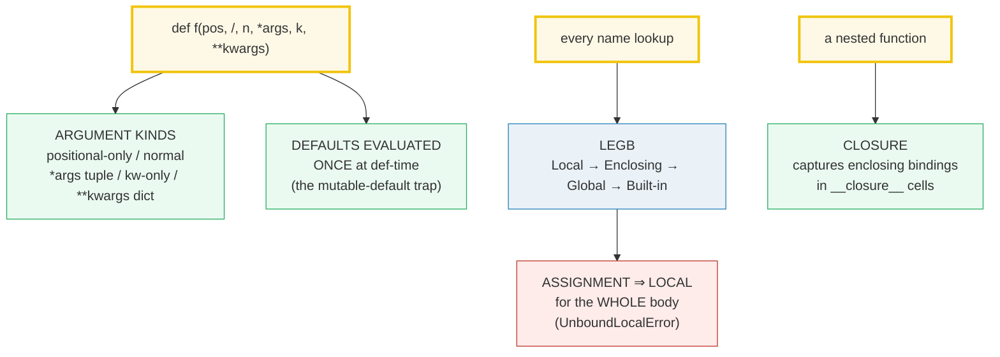
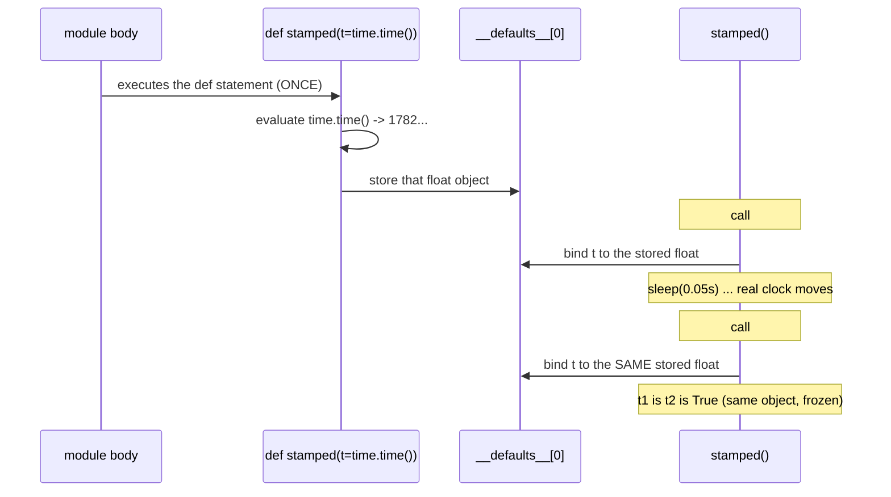
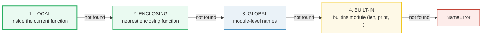

# Functions, Arguments & Scope — `*args`/`**kwargs`, the Mutable-Default Trap, LEGB, Closures

> **The one rule:** Python evaluates a function's default values **once, at
> `def`-time** — not each call — and resolves every name through a fixed
> **LEGB** chain (Local → Enclosing → Global → Built-in). Furthermore, **any**
> assignment to a name anywhere in a body makes that name local for the *whole*
> body. Get these three straight and `UnboundLocalError`, the mutable-default
> bug, and late-binding closures stop surprising you.

**Companion code:** [`functions_args_scope.py`](./functions_args_scope.py).
**Every number and table below is printed by `uv run python
functions_args_scope.py`** — change the code, re-run, re-paste. Nothing here is
hand-computed. Captured stdout lives in
[`functions_args_scope_output.txt`](./functions_args_scope_output.txt).

**Goal of this bundle (lineage, old → new):**

> from *"I define functions with `def`"*
> → *"I understand argument-passing semantics, default-argument evaluation
> timing, LEGB name resolution, closures, and the assignment-makes-it-local
> rule."*

🔗 This is bundle **#6 of Phase 1**. It builds on the object model of
[`TYPES_AND_TRUTHINESS`](./TYPES_AND_TRUTHINESS.md) (every argument is a label
bound to a `PyObject*`, passed by assignment — there is no call-by-reference).
The closure machinery shown here is exactly what
[`DECORATORS_DEEP`](./DECORATORS_DEEP.md) (Phase 2 #14) leans on. See
[`TODO.md`](./TODO.md) for the full plan.

---

## 0. The five ideas on one page



| Question | Mechanism | The trap |
|---|---|---|
| How are leftover args collected? | `*args` → **tuple**, `**kwargs` → **dict** | forgetting they pack into *immutable* tuple / mutable dict |
| When is `f(x=EXPR)` evaluated? | **once**, when the `def` runs | a mutable `EXPR` (list/dict) is shared across all calls |
| How is a bare name resolved? | **LEGB** order, first hit wins | shadowing a global/enclosing name by accident |
| What does an assignment do? | makes the name **local** for the whole body | `print(x); x=1` → `UnboundLocalError` |
| What does a nested function keep? | the **enclosing** bindings, in `__closure__` cells | late binding: closures capture *variables*, not frozen values |

---

## 1. Argument kinds — positional-only, `*args`, keyword-only, `**kwargs`

A parameter list has up to **five slots in a fixed order**:

```python
def f(pos_only, /, normal, *args, kw_only, **kwargs):
    ...
```

- `pos_only` (before a bare `/`) — must be passed **by position**; its name is
  not externally usable (matches C-level builtins like `divmod(x, y, /)`).
- `normal` — positional **or** keyword.
- `*args` — collects the leftover **positional** arguments into a **tuple**.
- `kw_only` (after a bare `*`) — must be passed **by keyword**.
- `**kwargs` — collects the leftover **keyword** arguments into a **dict**.

At the **call site** the same markers do the reverse: `f(*seq)` unpacks an
iterable to positional args, `f(**mapping)` unpacks a mapping to keyword args.

> From `functions_args_scope.py` Section A:
> ```
> ======================================================================
> SECTION A — Argument kinds: positional, *args, **kwargs, /, and *
> ======================================================================
> A parameter list has up to five slots in a fixed order:
>     def f(pos_only, /, normal, *args, kw_only, **kwargs)
> *args packs the leftover POSITIONAL args into a TUPLE; **kwargs
> packs the leftover KEYWORD args into a DICT. A bare '*' forces the
> params after it to be keyword-only; a bare '/' forces the params
> before it to be positional-only.
> 
> call                              value
> --------------------------------------------------------------
> kinds(1,2,3,4,x=5,y=6)            1, 2
>   args (leftover positional)      (3, 4)
>   isinstance(args, tuple)         True
>   kwargs (leftover keyword)       {'x': 5, 'y': 6}
>   isinstance(kwargs, dict)        True
> 
> signature                   call                  result
> ----------------------------------------------------------------
> def kw_only(a, *, k)        kw_only(1, k=2)       (1, 2)
> def pos_only(a, /, b)       pos_only(1, 2)        (1, 2)
> 
> add3(*[1, 2], **{'c': 3}) = 6
> 
> [check] args is a tuple: OK
> [check] kwargs is a dict: OK
> [check] bare '*' makes following params keyword-only: OK
> [check] bare '/' makes preceding params positional-only: OK
> [check] call-site * and ** unpack into positional and keyword args: OK
> ```

### Why `*args` is a tuple and `**kwargs` is a dict (internals)

The language reference fixes this: `*args` **always** binds a **tuple**
(immutable — you cannot accidentally mutate a caller's list through it), and
`**kwargs` **always** binds a **dict** keyed by the keyword strings. The bare
`*` and `/` markers are not parameters themselves — they are *delimiters* that
switch the "kind" of the surrounding parameters. `*` (introduced in PEP 3102)
forces keyword-only parameters; `/` (PEP 570) forces positional-only. The
parameter vs. argument distinction matters here too (official glossary):
**parameters** are the names in the `def`; **arguments** are the values you
pass at the call site.

🔗 The "everything is a label on a `PyObject*`" model from
[`TYPES_AND_TRUTHINESS`](./TYPES_AND_TRUTHINESS.md) is why Python has **no**
call-by-reference: the parameter name is *rebound* to the argument object, with
no alias back to the caller's name.

---

## 2. The mutable-default trap — the default is built **once**

This is the single most famous Python gotcha. The default value expression is
evaluated **exactly once** — when the `def` statement executes — and the
resulting object is **reused** on every call that omits that argument. For an
immutable default (`int`, `str`, `None`, `tuple`) you never notice; for a
**mutable** default (`list`, `dict`, `set`) every call mutates the one shared
object, so state *accumulates* across calls.

> From `functions_args_scope.py` Section B:
> ```
> ======================================================================
> SECTION B — The mutable-default trap: the default is built ONCE
> ======================================================================
> Default values are evaluated exactly ONCE — when the 'def' runs —
> and the SAME object is reused on every call that omits that arg.
> For an immutable default (int/str/None) you never notice; for a
> MUTABLE default (list/dict/set) every call mutates the one shared
> object. The fix is `acc=None` + rebuild inside the body.
> 
> expression                              result
> --------------------------------------------------------------
> append_trap(1)  -> snapshot             [1]
> append_trap(2)  -> snapshot             [1, 2]
> r1 is r2 (same shared list)             True
> id(default) before == after             True
> append_trap.__defaults__[0]             [1, 2]
> 
> append_safe(1)  [None sentinel]         [1]
> append_safe(2)  [None sentinel]         [2]
> s1 is s2 (fresh list each call)         False
> 
> [check] trap accumulates: append_trap(1) == [1]: OK
> [check] trap accumulates: append_trap(2) == [1, 2]: OK
> [check] both calls returned the SAME list object: OK
> [check] the default object's id() is stable across calls: OK
> [check] the None-sentinel fix gives a fresh list each call: OK
> ```

### Why the same list survives across calls (internals)

The default objects live on the **function itself**, in `f.__defaults__`
(positional defaults) and `f.__defaults_kw____` (keyword-only defaults). When
you call `append_trap(1)` with no `acc`, CPython binds `acc` to the entry in
`__defaults__[0]` — the *very same* list object every time. That is why
`id(default)` is identical before and after, and why `r1 is r2` is `True`. The
canonical fix (straight from the Programming FAQ) is the **`None` sentinel**:
default to `None`, then inside the body do `acc = [] if acc is None else acc`.
Now each call that omits the arg builds a **fresh** list, so `s1 is s2` is
`False`. (Test the sentinel with `is None`, never `== None`.)

> **The other side of the coin:** this "evaluate once" property is *useful* —
> it is the cheapest possible **memoization cache**. The FAQ shows
> `def f(arg1, arg2, *, _cache={}): ...` exploiting the shared default dict on
> purpose. The trap and the trick are the *same* mechanism; only intent differs.

🔗 A live, mutable default dict is exactly how `functools.lru_cache`-style
caches predate `functools`. The "default as cache" pattern resurfaces in
[`DECORATORS_DEEP`](./DECORATORS_DEEP.md) (Phase 2 #14).

---

## 3. Defaults are evaluated at **def-time**, not call-time

Section 2 showed the *object* is reused. Section 3 proves the *expression* runs
**once, when `def` executes** — not each call. The cleanest demonstration is a
`time.time()` default: if it were evaluated at call-time, two calls separated
by a `sleep` would return different timestamps. They do not — both return the
single value frozen at definition time.

> From `functions_args_scope.py` Section C:
> ```
> ======================================================================
> SECTION C — Defaults are evaluated at def-time, not call-time
> ======================================================================
> Because the default expression runs once when 'def' executes (not
> each call), a default of `time.time()` captures a single timestamp
> frozen at definition time. Two calls separated by a sleep return
> the SAME value — proving call-time evaluation does NOT happen.
> 
> expression                                    result
> --------------------------------------------------------------
> t1 - stamped.__defaults__[0]                  0.0
> t2 - t1  (despite a 0.05s sleep)              0.0
> t1 is t2  (literally the same float object)   True
> time.time() - t1 > 0.04  (real clock moved)   True
> 
> [check] the returned value equals the frozen default exactly: OK
> [check] t2 == t1 despite the sleep (no call-time evaluation): OK
> [check] the default is literally the same float object: OK
> [check] the real wall clock HAS advanced past the frozen default: OK
> ```



### Why the timestamp is literally the same object (internals)

The `def` runs the default expression **once** and stores the result in
`__defaults__`. Each argument-less call binds the parameter to that *same*
stored object — so `t1`, `t2`, and `stamped.__defaults__[0]` are all **the same
`PyObject*`** (`t1 is t2` is `True`, not merely `t1 == t2`). The fourth check
proves the real wall clock *has* advanced (`time.time() - t1 > 0.04`), so the
equality of `t1` and `t2` cannot be explained by a frozen clock — only by a
frozen *default*. The compound-statement reference states it directly: *"the
[default] expression is evaluated once at function definition"* — placing it
in the *defining* scope, not the call scope.

---

## 4. LEGB — Local, Enclosing, Global, Built-in

When Python meets a bare name, it searches **four namespaces in fixed order**
and stops at the **first** hit:



**Reading** a name needs no declaration. **Writing** (an assignment) defaults
to *Local*: to instead rebind an *Enclosing* name use `nonlocal`, to rebind a
*Global* name use `global`.

> From `functions_args_scope.py` Section D:
> ```
> ======================================================================
> SECTION D — LEGB resolution: Local, Enclosing, Global, Built-in
> ======================================================================
> Name lookup walks four scopes in fixed order — Local -> Enclosing
> -> Global -> Built-in — and stops at the FIRST hit. Reading a name
> needs no declaration. WRITING (assignment) defaults to Local; to
> rebind an Enclosing name use 'nonlocal', to rebind a Global name
> use 'global'.
> 
> expression                          result
> --------------------------------------------------------------
> inner() reads [L, E, G, B]          ['L (local)', 'E (enclosing)', 'G (global)', 'len']
> counter() x3  (nonlocal rebind)     (1, 2, 3)
> bump_global() x2  (global rebind)   (1, 2)
> 
> [check] LEGB: local read wins over enclosing/global: OK
> [check] LEGB: enclosing read resolves before global: OK
> [check] LEGB: global read resolves before built-in: OK
> [check] LEGB: built-in (len) is the last fallback: OK
> [check] nonlocal lets inner rebind the enclosing counter: OK
> [check] global lets a function rebind a module-level name: OK
> ```

### Why `nonlocal`/`global` exist at all (internals)

Without them, *every* assignment in a function would silently mutate module
state — a recipe for action-at-a-distance bugs (the FAQ calls this the "bar
against unintended side-effects"). So the rule is: **assignment ⇒ local by
default**; you must *opt in* to rebinding an outer name with an explicit
`global`/`nonlocal` declaration. `nonlocal` (PEP 3104, Python 3) walks outward
to the **nearest enclosing function scope** that has the name — it cannot reach
the module (use `global` for that). Note LEGB has **no "class scope"** step: a
name defined in a class body is *not* visible to methods as an enclosing name —
they reach it through `self.` or the class name, which is why the chain above
jumps Local → Enclosing(function) → Global.

---

## 5. The assignment-makes-local rule — `UnboundLocalError`

This is the trap that follows directly from §4. If a name is assigned **any**
where in a function body, the compiler marks it **local for the entire body** —
even the lines *before* the assignment. So `print(x); x = 1` raises
`UnboundLocalError` on the `print()`, *even though a global `x` exists*: by the
time `print` runs, `x` is already classified local, and a local that has not
yet been assigned a value cannot be read.

> From `functions_args_scope.py` Section E:
> ```
> ======================================================================
> SECTION E — Assignment makes a name local for the WHOLE body
> ======================================================================
> If a name is assigned ANYWHERE in a function body, the compiler
> treats it as local for the ENTIRE body — even lines BEFORE the
> assignment. So `print(x); x = 1` raises UnboundLocalError on the
> print(), although a global x exists. Reads-only stay global.
> 
> expression                              result
> --------------------------------------------------------------
> reads_only()  (no assignment -> global) 99
> reads_then_writes() raises              UnboundLocalError
>   message                               "cannot access local variable 'unbound_x' where it is not associated with a value"
> 
> [check] a read-only function sees the global: OK
> [check] print(x) before x=1 raises UnboundLocalError: OK
> [check] the error names the shadowed variable: OK
> ```

### Why a function that *never runs* the assignment still fails (internals)

This is decided at **compile time, not run time**. When CPython compiles a
function, it does a static pass: any name that has an assignment target
*anywhere* in the body is recorded as a **fast local** (`STORE_FAST` /
`LOAD_FAST` bytecode), regardless of where the assignment sits. So in
`reads_then_writes`, the `unbound_x = 1` on the last line causes the *first*
line's `print(unbound_x)` to compile to `LOAD_FAST unbound_x` — and loading a
local that has no value yet raises `UnboundLocalError`. The contrast function
`reads_only` has *no* assignment to `unbound_x`, so it compiles to `LOAD_GLOBAL`
and happily reads `99`. The fix is exactly the §4 escape hatch: prepend
`global unbound_x` (or `nonlocal` for an enclosing name) to make the
assignment target the outer name instead. The official FAQ's title for this
section is literally *"Why am I getting an UnboundLocalError when the variable
has a value?"* — because the surprise is that the global value is *irrelevant*
once the name is classified local.

---

## 6. Closures — capturing enclosing bindings (→ decorators)

A **closure** is a nested function that retains the variables of its
*enclosing* scope — even after the outer function has returned. The captured
("free") variables are not copied values; they live in **`__closure__` cells**,
one cell per free variable, and `cell_contents` reads the current value. Each
*call* to the outer function builds a **fresh** set of cells, so two closures
over different enclosing values are independent.

> From `functions_args_scope.py` Section F:
> ```
> ======================================================================
> SECTION F — Closures: an inner function captures enclosing bindings
> ======================================================================
> A closure is an inner function that remembers the variables of its
> ENCLOSING scope — even after the outer function has returned. The
> captured ('free') variables live in __closure__ cells; each call to
> the outer builds a NEW set of cells, so two closures are
> independent.
> 
> expression                              result
> --------------------------------------------------------------
> add10(5)                                15
> add20(5)                                25
> add10.__code__.co_freevars              ('n',)
> add10.__closure__[0].cell_contents      10
> add20.__closure__[0].cell_contents      20
> 
> late[0]() / late[1]() / late[2]()       (2, 2, 2)
> fixed[0]() / fixed[1]() / fixed[2]()    (0, 1, 2)
> 
> [check] add10(5) == 15 (captured n == 10): OK
> [check] add20(5) == 25 (captured n == 20): OK
> [check] each adder has its OWN captured n: OK
> [check] 'n' is a free variable of adder: OK
> [check] late-binding closures all see the loop's final value (2): OK
> [check] default-arg binding freezes each value at def-time: OK
> ```

### Why closures capture *variables*, not frozen values (internals)

A free variable is not a snapshot — it is a **shared cell** (`PyCellObject`)
that both the enclosing frame and the inner function point at. When `make_adder`
returns, the enclosing frame is gone, but the *cell* survives because the
returned `adder` still holds a reference to it. That is why
`add10.__closure__[0].cell_contents` is `10` and `add20`'s is `20`: each call
to `make_adder` created its **own** cell. The dark side of "capture the
variable, not the value" is the **late-binding** loop trap: `[lambda: i for i
in range(3)]` builds three closures that all reference the *same* loop variable
`i`. By the time any of them is called, the loop has finished and `i` is `2` —
so all three return `2`. The classic fix, `lambda i=i: i`, works precisely
*because* of §3: the default `i=i` is evaluated **once per `def`-time** (once
per loop iteration), freezing each value into that lambda's `__defaults__`.

🔗 A **decorator** is just a function that returns a closure (or replaces one).
The `__closure__` / `co_freevars` introspection you see here is exactly what
[`DECORATORS_DEEP`](./DECORATORS_DEEP.md) (Phase 2 #14) builds on — `functools.wraps`
exists to copy `__wrapped__`, `__name__`, and the closure machinery across the
wrapper.

---

## Pitfalls

| Trap | Example | The fix |
|---|---|---|
| Mutable default accumulates state | `def f(x, acc=[]): acc.append(x)` → `f(1)` `[1]`, `f(2)` `[1, 2]` | default to `None`; rebuild inside: `acc = [] if acc is None else acc` |
| Default evaluated at call-time (expected) | `def f(t=time.time())` "should" refresh | it never does — captured once at `def`-time; pass the arg explicitly if you need freshness |
| `UnboundLocalError` on a name that has a global | `def f(): print(x); x=1` | add `global x` (or `nonlocal x` for an enclosing name) |
| Reading a global you meant to rebind | `def f(): count += 1` (no decl) → `UnboundLocalError` | declare `global count` (module) or `nonlocal count` (enclosing) |
| `nonlocal` reaching for a module name | `nonlocal x` where `x` is global | `nonlocal` only targets enclosing **functions**; use `global` for module names |
| Class body treated as enclosing scope | a method reading a class-level name as a bare name | LEGB has **no class step** — use `self.x` / `ClassName.x` / `global` |
| Late-binding closures in a loop | `[lambda: i for i in range(3)]` all return `2` | bind now: `lambda i=i: i`, or a factory `lambda i: (lambda: i)` |
| Mutating `*args` expecting to change caller's list | `def f(*a): a[0] = 9` | `*args` is a **tuple** — immutable; mutate the original by passing it positionally |
| Treating `**kwargs` ordering as significant pre-3.7 | relying on `kwargs` key order | `dict` is insertion-ordered only since 3.7 (CPython 3.6); don't depend on it earlier |
| Confusing *parameter* (in `def`) with *argument* (at call) | "passing the parameter" | **parameters** are names in the definition; **arguments** are the values passed |
| `== None` to test the sentinel | `if acc == None:` (a bad `__eq__` lies) | always `if acc is None:` — identity, no `__eq__` call |

---

## Cheat sheet

- **Five parameter slots, fixed order:** `def f(pos_only, /, normal, *args, kw_only, **kwargs)`.
  `/` → positional-only; `*` → keyword-only; `*args` packs a **tuple**;
  `**kwargs` packs a **dict**. At the call site `f(*seq, **map)` unpacks.
- **Default evaluation:** the default expression runs **once, at `def`-time**,
  stored in `f.__defaults__` / `f.__defaults_kw__`. Every argument-less call
  binds the *same* object.
- **Mutable-default trap + fix:** never `acc=[]` / `{}` / `set()`. Use
  `acc=None` then `acc = [] if acc is None else acc`. (The same "evaluate once"
  property is a free memoization cache when used on purpose.)
- **LEGB lookup order:** Local → Enclosing(function) → Global(module) →
  Built-in. First hit wins; miss → `NameError`. **No class scope step.**
- **Read vs write:** reading needs no declaration; **assignment ⇒ local** for
  the whole body. Rebind enclosing with `nonlocal`; rebind module with `global`.
- **Assignment-makes-local:** `print(x); x=1` raises `UnboundLocalError` — the
  global is irrelevant once `x` is classified local (decided at compile time).
- **Closures:** a nested function captures enclosing bindings in `__closure__`
  cells (`co_freevars` lists them; `cell_contents` reads them). Each outer call
  makes fresh cells → independent closures.
- **Late binding:** closures capture *variables*, not frozen values. In a loop,
  bind now with `lambda i=i: i` (a default arg, evaluated once per iteration).

---

## Sources

- **Python docs — The Python Tutorial: More on Defining Functions.**
  https://docs.python.org/3/tutorial/controlflow.html#more-on-defining-functions
  *The canonical statement that default argument values are evaluated **once**
  when the `def` is executed, the `*args`/`**kwargs` packing semantics, and the
  keyword-only-after-`*` rule. Basis for §1 and §3.*
- **Python docs — Programming FAQ: "Why are default values shared between
  objects?"**
  https://docs.python.org/3/faq/programming.html#why-are-default-values-shared-between-objects
  *Verbatim: "Default values are created exactly once, when the function is
  defined." Gives the mutable-`{}` trap and the `None`-sentinel fix. Quoted in
  §2.*
- **Python docs — Programming FAQ: "Why am I getting an UnboundLocalError when
  the variable has a value?"**
  https://docs.python.org/3/faq/programming.html#why-am-i-getting-an-unboundlocalerror-when-the-variable-has-a-value
  *"When you make an assignment to a variable in a scope, that variable becomes
  local to that scope." The `global`/`nonlocal` escape hatches. Quoted in §5.*
- **Python docs — Programming FAQ: "What are the rules for local and global
  variables?"** and **"How can I pass optional or keyword parameters..."** and
  **"How do you make a higher order function?"** and **"Why do lambdas defined
  in a loop..."**
  https://docs.python.org/3/faq/programming.html
  *"If a variable is assigned a value anywhere within the function's body, it's
  assumed to be a local unless explicitly declared as global"; `*`/`**` give "a
  tuple and ... a dictionary"; the nested-scope `linear(a,b)` higher-order
  example; and the late-binding `lambda n=x: n**2` loop fix. Basis for §1, §4,
  §6.*
- **Python docs — Reference: Execution model — Naming and binding.**
  https://docs.python.org/3/reference/executionmodel.html#naming-and-binding
  *The authoritative definition of scope and the LEGB resolution order: "a scope
  ... contains names ... If a name is declared global, all references and
  assignments go directly to the middle scope containing the module's global
  names." Also "the scope of local variables ... is the function body." Basis
  for §4.*
- **Python docs — Reference: Compound statements — Function definitions.**
  https://docs.python.org/3/reference/compound_stmts.html#function-definitions
  *Default value evaluation: "Default parameter values are evaluated ... when
  the function definition is executed"; the grammar of `*`/`**` and `/`
  parameters; `nonlocal`/`global` as simple statements. Basis for §1, §3.*
- **Python docs — Reference: Simple statements — `nonlocal` / `global`.**
  https://docs.python.org/3/reference/simple_stmts.html#nonlocal
  *"`nonlocal` ... causes the listed identifiers to refer to previously bound
  variables in the nearest enclosing scope excluding globals." Confirms
  `nonlocal` cannot reach module scope. Quoted in §4.*
- **PEP 3102 — Keyword-Only Arguments.** https://peps.python.org/pep-3102/
  *Introduced the bare `*` separating positional-or-keyword from keyword-only
  parameters. Referenced in §1.*
- **PEP 570 — Python Positional-Only Parameters.** https://peps.python.org/pep-0570/
  *Introduced the bare `/` marking positional-only parameters (Python 3.8).
  Referenced in §1.*
- **PEP 3104 — Access to Names in Outer Scopes.** https://peps.python.org/pep-3104/
  *Introduced `nonlocal` (Python 3) so nested functions can rebind enclosing
  variables. Referenced in §4 and §6.*
- **Stack Overflow — "Least Astonishment" and the Mutable Default Argument.**
  https://stackoverflow.com/questions/1132941/least-astonishment-and-the-mutable-default-argument
  *Independent confirmation (GvR's rationale quoted) that defaults are
  evaluated once at definition time and the object is reused. Corroborates §2.*
