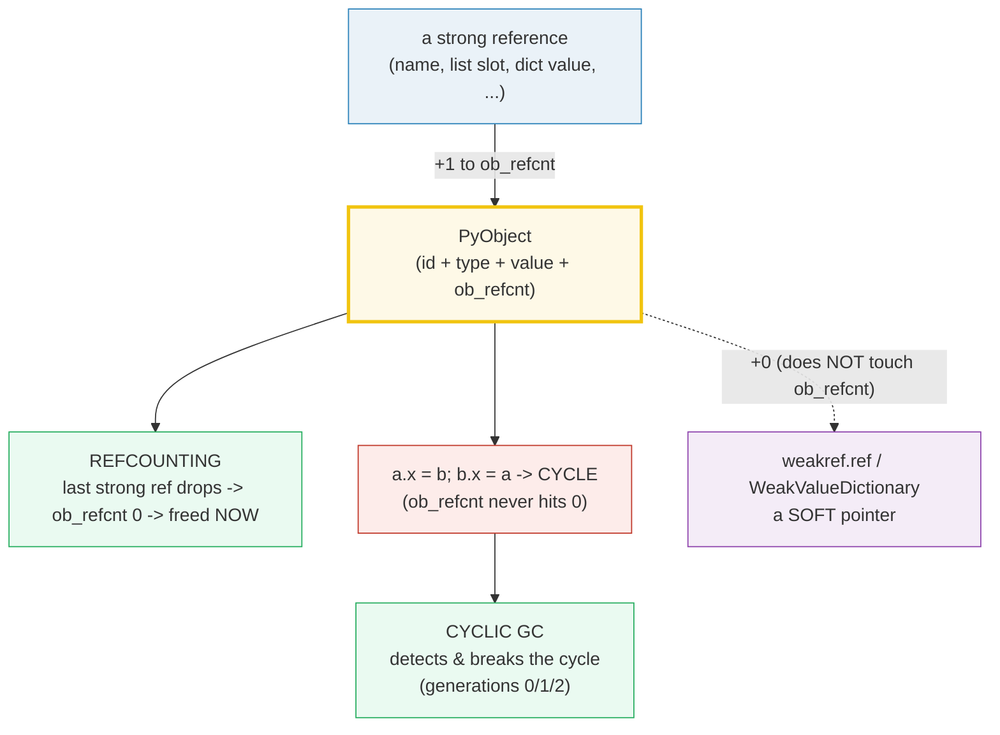
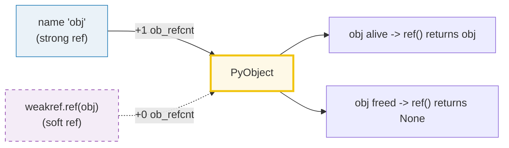

# GC & Weakrefs — Reference Counting, the Cyclic GC, and Soft Pointers

> **The one rule:** CPython frees objects by **reference counting** the instant
> the last strong reference disappears; a separate **cyclic garbage collector**
> breaks the *one* pattern refcounting cannot handle — reference cycles; and
> **weak references** let you hold a handle to an object without keeping it
> alive. Get these three straight and "will this object be freed?" stops being
> a guessing game.

**Companion code:** [`gc_weakrefs.py`](./gc_weakrefs.py). **Every number and
table below is printed by `uv run python gc_weakrefs.py`** — change the code,
re-run, re-paste. Nothing here is hand-computed. Captured stdout lives in
[`gc_weakrefs_output.txt`](./gc_weakrefs_output.txt).

**Goal of this bundle (lineage, old → new):**

> from *"Python has a garbage collector"*
> → *"I understand that CPython frees objects by refcounting instantly, that a
> separate cyclic GC collects reference cycles refcounting alone cannot break,
> and that `weakref` lets me hold a handle without keeping the referent alive."*

🔗 Builds on [`MEMORY_MODEL`](./MEMORY_MODEL.md) (Phase 3 #16) — every reference
here is one row in the `PyObject*` view developed there; if `id()` / `is` /
`ob_refcnt` feel new, read that bundle first. Cleanup patterns that *should*
replace `__del__` (context managers) are covered in
[`CONTEXT_MANAGERS`](./CONTEXT_MANAGERS.md) (Phase 3 #22). `__slots__` and the
broader "spend less memory per object" story are deferred to a future
MEMORY_EFFICIENCY note.

---

## 0. The three ideas on one page



| Question | Mechanism | Cost |
|---|---|---|
| "Is this object freed the moment I drop the last name?" | **Refcounting** — yes, in CPython. | O(1), instant, predictable. |
| "What if `a` and `b` point at each other?" | Refcounting **cannot** free them. The **cyclic GC** must step in. | Periodic sweep over tracked objects; not deterministic timing. |
| "Can I hold a handle that does NOT keep the object alive?" | **`weakref.ref(obj)`** — returns `obj` while alive, `None` once dead. | Adds *no* strong reference; does not touch `ob_refcnt`. |

---

## 1. Refcounting — the last strong ref frees *now*

CPython is **refcount-first**. Every `PyObject` carries an `ob_refcnt` field.
Each time a name, list slot, dict value, attribute, or function argument starts
pointing at the object, the count is incremented (`Py_INCREF`); each time one
goes away, it is decremented (`Py_DECREF`). The instant the count reaches zero,
the object's memory is freed — no pause, no sweep, no generational bookkeeping.
This is why CPython can release files/sockets/GIL handles promptly when you
`del` the last name, and why finalization order in straight-line code is so
predictable.

We watch the death through a **`weakref.ref`** handle, which is the cheapest
observer available: it returns the object while alive and `None` once the
object has gone.

> From `gc_weakrefs.py` Section A:
> ```
> ======================================================================
> SECTION A — Refcounting: deleting the last strong ref frees immediately
> ======================================================================
> CPython is refcount-FIRST. Every object carries an ob_refcnt; when
> the count hits 0 the object is freed *at that instant* (no pause,
> no sweep). We watch the death through a weakref.ref handle, which
> returns the object while alive and None once it is gone.
> 
> sys.getrefcount(obj) (live, 2 refs: 'obj' + getrefcount arg): 2
> ref() is obj  (weakref resolves while alive): True
> del obj  -> ob_refcnt drops to 0 -> CPython frees it now
> ref() after del  (the weakref no longer resolves): None
> 
> [check] weakref returns the object while it is alive: OK
> [check] after del, the weakref returns None (object was freed): OK
> ```

### Why `sys.getrefcount(obj)` returns 2 here (internals)

At the moment we call `sys.getrefcount(obj)`, two references exist:

1. the local name `obj` in our frame, and
2. the *argument* temporarily bound inside `sys.getrefcount` itself for the
   duration of the call.

That second one is why the docs say "the count … is one higher than you might
expect." If you `sys.getrefcount(some_singleton)` you'll see an even larger
number: the interpreter, the `builtins` module, the small-int / interned-string
caches, the type object's MRO chain, etc., may all hold extra references.

🔗 This is the same `ob_refcnt` field from
[`MEMORY_MODEL`](./MEMORY_MODEL.md) — the `PyObject*` view, `id()`, and `is`
are all defined against that one struct. The "delete the last name → object
dies" intuition is precisely *decrement to zero → `Py_Dealloc` runs now*.

---

## 2. A reference cycle — the *one* pattern refcounting cannot free

If `a.x = b` and `b.x = a`, neither object's `ob_refcnt` can ever reach zero
naturally: each keeps the other's count pinned at 1. `del a; del b` removes
the *names* but the two objects are still alive on the heap, holding each
other hostage. This is a **reference cycle**, and refcounting alone cannot
free it.

That is the *entire reason* the **cyclic garbage collector** (`gc` module)
exists. It periodically scans the graph of "GC-tracked" objects, finds such
cycles, and breaks them. We force a scan with **`gc.collect()`** so the demo
is deterministic — without that, the cycle would be freed at the next
automatic collection, which could be many milliseconds or many megabytes of
allocations later.

> From `gc_weakrefs.py` Section B:
> ```
> ======================================================================
> SECTION B — A reference cycle survives del; gc.collect() frees it
> ======================================================================
> Two objects that point at each other form a CYCLE. After `del a,
> del b`, neither ob_refcnt reaches 0 — each still has one reference
> (from the other). Refcounting alone cannot free them. The cyclic
> GC must step in. We force it deterministically with gc.collect().
> 
> cycle built: a.x is b -> True; b.x is a -> True
> del a, del b  (only the names go away; the objects keep each other)
> ra() right after del  (NOT None -> still alive): True
> rb() right after del  (NOT None -> still alive): True
> gc.collect() returned (objects freed): 38
> ra() after gc.collect()  (None -> freed): None
> rb() after gc.collect()  (None -> freed): None
> 
> [check] cycle objects survive del of both names (refcount can't break it): OK
> [check] after gc.collect(), the cycle is gone (weakrefs return None): OK
> ```

### Why the cycle survives `del` but dies after `gc.collect()` (internals)

The cyclic GC's algorithm, in one paragraph: it walks the subgraph of
GC-tracked objects, **subtracts internal references** (a trial decrement of
each edge inside the cycle), and asks "is anything left with a nonzero
*external* refcount?" If no, the subgraph is a **cyclic isolate** — unreachable
from the running program — and the GC clears every edge inside it, which
collapses each `ob_refcnt` to zero, which in turn frees each object via the
normal refcounting path. So the cyclic GC doesn't "free" objects directly; it
*breaks* the cycle and lets refcounting do the freeing.

The number `38` printed by `gc.collect()` is the **count of objects freed
during that one sweep** — far more than just our two `Cycle` instances because
the GC also reaps whatever else had accumulated in gen 0 since interpreter
start. Do **not** assert on the exact number; it varies by Python build,
history, and what other libraries have already imported.

**Common cycle shapes in real code:**

- A list that contains itself: `lst = []; lst.append(lst)`.
- A dict that points at itself: `d['self'] = d`.
- Two object instances with mutual back-references (parent ↔ child).
- A closure that captures the function it's defined in.
- A bound method stored as an attribute of its own `self`.

None of these leak forever — the cyclic GC reclaims them — but until the next
collection they *do* sit on the heap. That is the cost of "refcount-first with
a cyclic backup" versus a pure tracing collector.

---

## 3. The cyclic GC: generations, thresholds, and forced collection

The cyclic GC is **generational**, with three age bands called **generation
0, 1, 2**. Newly allocated GC-tracked objects enter gen 0; survivors of a gen-0
collection are promoted to gen 1; survivors of a gen-1 collection are promoted
to gen 2. The hypothesis is the **weak generational hypothesis**: most objects
die young, so collecting gen 0 frequently and gen 2 rarely gives the best
trade-off between pause time and memory reclamation.

Two thresholds govern *when* an *automatic* collection kicks in:

- **`threshold0`** — when `allocations − deallocations` since the last
  collection exceeds this, a gen-0 collection runs.
- **`threshold1`** — gen 1 is also collected once gen 0 has been collected
  `threshold1` times since the last gen-1 collection. (`threshold2` plays the
  same role for promoting gen 1 → gen 2, with an extra reachability
  revalidation step.)

You can **always** short-circuit the timing logic and force a collection with
`gc.collect(generation)` — that is what this bundle does everywhere, to keep
the output deterministic.

> From `gc_weakrefs.py` Section C:
> ```
> ======================================================================
> SECTION C — gc generations, thresholds, and forced collection
> ======================================================================
> The cyclic GC groups tracked objects into three GENERATIONS. New
> objects enter gen 0; survivors are promoted to gen 1 then gen 2.
> Younger generations are collected more often. Collection runs
> automatically when (allocations - deallocations) > threshold0; you
> can also force it with gc.collect(generation).
> 
> gc.get_threshold()  (default thresholds t0, t1, t2): (2000, 10, 10)
> gc.get_count()     (current counts c0, c1, c2):      (4, 0, 0)
> gc.isenabled()     (automatic cyclic GC on?):        True
> 
> counts before any forced collect:  (4, 0, 0)
> after gc.collect(0) [gen 0 only]:  (0, 1, 0)
> after gc.collect(1) [gen 0 + 1]:   (0, 0, 1)
> after gc.collect(2) [full sweep]:  (0, 0, 0)
> 
> gc.disable(); gc.isenabled() -> False
> gc.enable();  gc.isenabled() -> True
> 
> [check] gc.get_threshold() returns a 3-tuple (t0, t1, t2): OK
> [check] gc.collect(0) resets the gen-0 count to a small value: OK
> [check] gc.disable() turns the automatic collector off: OK
> [check] gc.enable() turns it back on: OK
> ```

### Reading the count tuples (internals)

`gc.get_count()` returns `(c0, c1, c2)` where `cN` is roughly "how close gen N
is to its next automatic collection." Watch what each forced `collect(N)` does
to those counts:

- `gc.collect(0)` runs gen 0 only. `c0` resets to 0; whatever survived is
  promoted, bumping `c1` by one. Here: `(4, 0, 0)` → `(0, 1, 0)`.
- `gc.collect(1)` runs gens 0 and 1. Both `c0` and `c1` reset; survivors
  promote, bumping `c2`. Here: → `(0, 0, 1)`.
- `gc.collect(2)` is a **full collection** — all three generations. Here:
  → `(0, 0, 0)`.

### The default threshold changed across versions

On Python 3.13 the default `gc.get_threshold()` is **`(2000, 10, 10)`** —
`threshold0` was raised from `700` to `2000` in Python 3.11 (the cyclic GC
itself was made cheaper, so a higher trigger buys fewer collections per second
without extra memory pressure). Older tutorials that say `(700, 10, 10)` are
correct for 3.10 and earlier; **never assert on the exact default** in
production code. **Assert the behavior**, not the constants.

`gc.disable()` turns off only the **automatic** cyclic GC. Refcounting still
runs (it cannot be disabled — it's wired into every `Py_DECREF`). You would
disable the cyclic GC in latency-critical loops where you have *proven* there
are no reference cycles, or in a child process after `fork()` to avoid
copy-on-write page faults from the GC touching parent pages.

---

## 4. `weakref.ref` — a soft pointer that does not keep its target alive

`weakref.ref(obj)` returns a callable handle to `obj`. Calling it returns the
object while the object is alive, and `None` once the object has been
collected. Crucially, the weakref **does not increment `obj`'s `ob_refcnt`** —
that is the whole point. You can hold a weakref to a large object (a cache
value, an image, a generator) without preventing its collection.



> From `gc_weakrefs.py` Section D:
> ```
> ======================================================================
> SECTION D — weakref.ref: a soft pointer that does not add to the refcount
> ======================================================================
> weakref.ref(obj) returns a *callable* handle. Calling it returns
> obj while obj is alive, and None once obj has been collected. The
> weakref itself does NOT increment obj's ob_refcnt — that is the
> whole point: you can hold a handle without keeping the object alive.
> 
> sys.getrefcount(obj) before weakref: 2
> sys.getrefcount(obj) after  weakref: 2
> (unchanged -> the weakref did NOT add a strong reference)
> ref() is obj  (handle resolves while alive): True
> ref() after del obj  (handle resolves to None): None
> 
> [check] creating a weakref does not change the strong refcount: OK
> [check] weakref resolves to the object while it is alive: OK
> ```

### Why the refcount is unchanged (internals)

Weak references are stored in a **separate side table** on the type object
(`tp_weaklistoffset`), not as a `Py_INCREF` on the referent. When the referent
is about to be deallocated, CPython walks that side table, fires each
weakref's callback (if any), and marks each weakref as "dead" so that
subsequent `ref()` calls return `None`. Because the weakref never incremented
the count, it cannot prevent the deallocation in the first place.

**Idiom — the thread-safe liveness check.** Don't write
`if ref() is not None: ref().do_work()` — between the two calls another thread
could collect the object. Bind once:

```python
obj = ref()
if obj is not None:
    obj.do_work()  # strong local keeps obj alive until end of scope
```

🔗 **Not every object supports weakrefs.** `object`, `int`, `tuple`, `list`,
`dict` themselves cannot be weakly referenced (try
`weakref.ref(object())` → `TypeError`). Subclassing adds support:
`class MyDict(dict): pass` is weak-referenceable. Types with `__slots__` need
to list `'__weakref__'` explicitly to opt in. Full rules in the `weakref`
module docs.

---

## 5. `WeakValueDictionary` — a cache that auto-evicts dead values

A `WeakValueDictionary` holds **weak references to its values**. When the last
strong reference to a value disappears and the cyclic GC notices, the entry is
silently dropped from the dict. This is the standard pattern for "associate
extra data with an object whose lifetime someone else owns" — caches, memo
tables, the `id() → object` lookup table from the `weakref` docs. The
sibling `WeakKeyDictionary` and `WeakSet` work analogously on keys / elements.

> From `gc_weakrefs.py` Section E:
> ```
> ======================================================================
> SECTION E — WeakValueDictionary: values auto-evict when their last strong ref dies
> ======================================================================
> A WeakValueDictionary holds weak refs to its VALUES. When the last
> strong ref to a value disappears (and the cyclic GC notices), the
> entry is silently dropped. Perfect for caches keyed by something
> else — the cache never keeps a big object alive on its own.
> 
> cache['thumbnail'] = img; 'thumbnail' in cache -> True
> cache['thumbnail'] is img -> True
> del img  (the only strong ref)
> gc.collect(); 'thumbnail' in cache -> False
> 
> bucket.add(one); 'one in bucket' before del -> True
> del one + gc.collect(); bucket empty -> True
> 
> [check] WeakValueDictionary entry present while strong ref exists: OK
> [check] WeakValueDictionary entry vanishes after value is collected: OK
> [check] WeakSet drops the element once its strong ref dies: OK
> ```

### Why we call `gc.collect()` after the `del` (gotcha)

The eviction is **not instantaneous**. The `WeakValueDictionary` is notified
by a callback wired onto the weakref — and that callback fires from the cyclic
GC's sweep, not from the `del`. For values that reach `ob_refcnt == 0` purely
through refcounting (no cycle), the callback usually fires promptly — but the
docs do not guarantee *when*, and in tight loops you may see the entry linger
for a few bytecode instructions. **Force it deterministically with
`gc.collect()`** in tests; in production, treat "the entry may briefly outlive
the value" as an inherent property of weak containers.

**Practical uses:**

- An `id(obj) → obj` registry so two callers that independently received the
  same object can find each other (the `weakref` module docs use exactly this
  as their worked example).
- A per-instance memoization cache that should not outlive the instance.
- An observer set (`WeakSet` of callbacks) so that registered callbacks do not
  prevent their owners from being collected.

---

## 6. `__del__` pitfalls and the `weakref.finalize` alternative

Before [PEP 442](https://peps.python.org/pep-0442/) (Python 3.4), an object
with a `__del__` method that was part of a reference cycle was
**uncollectable** — the GC couldn't know which `__del__` to run first, so it
punted and put the whole cycle into `gc.garbage`, where it stayed until
interpreter exit. PEP 442 fixed this by introducing a separate `tp_finalize`
slot and a safe collection protocol:

1. Weakrefs to the cyclic isolate's objects are cleared and their callbacks
   fired (objects still in a usable state).
2. **The finalizers of all objects in the isolate are called.**
3. The GC re-traverses the subgraph to check it is still unreachable. If a
   finalizer resurrected anything, the collection is aborted; otherwise,
4. All internal references are cleared, every `ob_refcnt` drops to zero, and
   the objects are freed through the normal refcounting path.

Even with PEP 442, `__del__` is **fragile and discouraged for resource
cleanup**. Its problems:

- **Exceptions are swallowed** — anything raised in `__del__` is printed to
  `stderr` and dropped, never propagated.
- **Interpreter shutdown ordering** — at exit, module globals are torn down in
  an unspecified order, so a `__del__` that references a module-level name may
  hit `NameError` because the name is already gone.
- **Resurrection hazards** — `__del__` can stash `self` somewhere, making the
  object spring back to life; the finalizer may then run more than once.
- **Order is unspecified** for cyclic isolates — PEP 442 explicitly says
  "the order in which finalizers are called is undefined."

The robust alternatives:

- **A context manager** (`with`) for scoped, deterministic cleanup — see
  🔗 [`CONTEXT_MANAGERS`](./CONTEXT_MANAGERS.md) (Phase 3 #22). This is almost
  always the right answer for files, sockets, locks, DB connections.
- **`weakref.finalize(obj, func, *args, **kwargs)`** for "fire this callback
  when `obj` is collected" — simpler than a raw weakref callback because the
  module guarantees the finalizer itself stays alive until collection, and
  because the callback receives only what you explicitly pass it (not the
  whole `self`), so it sidesteps the resurrection and shutdown-ordering traps.

> From `gc_weakrefs.py` Section F:
> ```
> ======================================================================
> SECTION F — __del__ pitfalls and the weakref.finalize alternative
> ======================================================================
> Before PEP 442, an object with __del__ inside a reference cycle was
> UNCOLLECTABLE and leaked into gc.garbage. PEP 442 (Python 3.4+) made
> __del__ safe in cycles by calling finalizers *before* breaking the
> cycle and re-checking reachability. Even so, __del__ is fragile
> (exception swallowing, interpreter-shutdown ordering, resurrection
> hazards). For resource cleanup, prefer a context manager or
> weakref.finalize.
> 
> fin.alive before del -> True
> fin.alive after  del -> False
> callback fired with: ['victim finalized']
> 
> WithDel object in a cycle, freed after gc.collect() -> True
> (pre-PEP-442 this leaked into gc.garbage; PEP 442 fixed it)
> 
> [check] weakref.finalize callback fires exactly once on collection: OK
> [check] after firing, fin.alive is False: OK
> [check] PEP 442: __del__ objects in a cycle ARE collectible now: OK
> ```

### Why `weakref.finalize` is safer than `__del__` (internals)

A `__del__` method has access to the **entire `self`** — every attribute, the
type, the module globals — so any of those can accidentally *resurrect* the
object or trip over an already-torn-down global. A `weakref.finalize(obj, func,
*args, **kwargs)` instead takes only the **explicitly-passed `func`, `args`,
`kwargs`**; the finalizer never holds a strong reference to `obj` itself, so
the lifecycle is linear: `obj` is collected → the registered `func(*args,
**kwargs)` is called → the finalizer is marked dead and never fires again. The
canonical example in the docs is a `TempDir` class whose cleanup function is
`shutil.rmtree` bound to the directory *name* (a `str`), not to the `TempDir`
instance itself.

🔗 For deterministic, scoped cleanup the right tool is still a **context
manager** — `weakref.finalize` is for "best-effort cleanup if I forget to close
explicitly." Both belong in your toolkit; see
[`CONTEXT_MANAGERS`](./CONTEXT_MANAGERS.md) (Phase 3 #22).

---

## 7. `tracemalloc` — where did the memory go?

`tracemalloc` traces Python-level memory allocations (calls to
`PyMem_Malloc` / `PyObject_Malloc`) and lets you take **snapshots** of the
current allocation state. You take a snapshot before and after a workload, then
call `snapshot.compare_to(other, 'lineno')` to see which lines of code are
responsible for the allocation delta. It is the standard tool for "my program
is using more memory than I expected — where?"

> From `gc_weakrefs.py` Section G:
> ```
> ======================================================================
> SECTION G — tracemalloc: snapshot where allocations come from
> ======================================================================
> tracemalloc traces Python-level memory blocks. You take a snapshot
> before and after a workload, then compare to see which lines of
> code allocated (or freed) the most memory.
> 
> workload: 50_000 fresh str objects in a list
> len(payload) -> 50000
> payload[0] -> 'row-0-payload'
> 
> top 3 allocation diffs (compare_to(snap_before, 'lineno')):
>   gc_weakrefs.py:386 size_diff=3333210 count_diff=50001
>   tracemalloc.py:560 size_diff=384 count_diff=2
>   tracemalloc.py:423 size_diff=328 count_diff=1
> 
> tracemalloc.get_traced_memory() -> current=3338894, peak=3339014
> 
> [check] tracemalloc recorded allocations from this file: OK
> [check] the workload allocated non-zero memory (current > 0): OK
> ```

### Reading the snapshot (internals)

The biggest line is the comprehension on `gc_weakrefs.py:386` — that's where
the 50,000 strings get built. `size_diff=3333210` is the **byte delta** (about
3.3 MB), `count_diff=50001` is the **block delta** (50,000 strings plus the
list itself). `tracemalloc.py:560` and `tracemalloc.py:423` are tracemalloc's
own bookkeeping allocations — the cost of *measuring*. `get_traced_memory()`
returns `(current, peak)` — the live bytes and the high-water mark since
`start()`.

**Practical workflow:**

1. `tracemalloc.start()` as early as possible in your program — you can only
   trace allocations made *after* `start()`.
2. Take `snap_before = tracemalloc.take_snapshot()` at the start of the
   workload.
3. Run the workload.
4. Take `snap_after = tracemalloc.take_snapshot()`.
5. `snap_after.compare_to(snap_before, 'lineno')[:20]` for the top 20 lines.
6. `tracemalloc.stop()` when done (tracing has nonzero overhead).

The same machinery powers `tracemalloc`-backed leak detectors in pytest
plugins (`pytest-tracemalloc`) and memory profilers (`memray` for a
lower-level, C-stack-walking view that also catches allocations made by C
extensions — `tracemalloc` only sees the Python allocator).

---

## Pitfalls

| Trap | Example | The fix |
|---|---|---|
| Expecting a cycle to be freed instantly | `a.x=b; b.x=a; del a,b` leaves both alive until next cyclic GC sweep | `gc.collect()` if you need deterministic reclamation; better, design out the cycle |
| Asserting on `gc.collect()`'s return value | The number includes *everything* in the swept generation — varies by history | assert *behaviors* (`weakref returns None`), never the raw count |
| Asserting on the default `gc.get_threshold()` | `threshold0` went `700 → 2000` in Python 3.11 | read it dynamically; assert the 3-tuple shape, not the constants |
| Relying on `weakref.ref` eviction timing | The cache entry can briefly outlive the value | `gc.collect()` in tests; treat as best-effort in prod |
| Trying to weakref a non-weakrefable type | `weakref.ref(object())` → `TypeError` | subclass (`class D(dict): pass`), or for `__slots__` add `'__weakref__'` |
| Using `__del__` for resource cleanup | exception swallowing, shutdown-ordering `NameError`, resurrection | context manager for scoped cleanup; `weakref.finalize` for "fire-and-forget" |
| Forgetting `weakref.finalize`'s args capture `obj` indirectly | `weakref.finalize(obj, obj.method)` keeps `obj` alive *forever* (the bound method holds it) | pass the bare function + primitive args: `weakref.finalize(obj, shutil.rmtree, path)` |
| Disabling the cyclic GC and then leaking cycles | `gc.disable()` does not stop refcounting; cycles accumulate silently | only disable if you have *proven* there are no cycles; re-enable in children after `fork()` |
| Assuming `gc.collect()` while a collection is running is a no-op | the docs say the effect is **undefined** | don't call `gc.collect()` from inside a `gc.callbacks` callback |
| Two-step weakref liveness check | `if ref() is not None: ref().x` races in threads | bind once: `o = ref(); if o is not None: o.x` |
| Treating `__del__` order in a cycle as deterministic | PEP 442 explicitly leaves it **undefined** | never depend on which `__del__` runs first |
| Confusing `tracemalloc` with a native profiler | it sees only Python-allocator allocations, not `malloc` from C extensions | use `memray` for C-level allocations |

---

## Cheat sheet

- **Refcounting is primary.** Every `PyObject` has an `ob_refcnt`. Last strong
  ref drops → count hits 0 → object freed *now*. `sys.getrefcount(x)` returns
  the live count (and one extra for its own argument).
- **Cycles are the one thing refcounting can't free.** `a.x=b; b.x=a` pins
  both `ob_refcnt`s at 1; `del a,b` only removes the names. The cyclic GC must
  step in.
- **Force collection deterministically with `gc.collect()`** — never rely on
  the automatic collector's timing in tests. `gc.collect(0|1|2)` collects only
  that generation and all younger ones.
- **Generations 0/1/2** with default threshold `(2000, 10, 10)` on Python 3.11+
  (was `(700, 10, 10)` on 3.10 and earlier). Don't assert the constants.
- **`gc.disable()`** turns off only the *automatic* cyclic GC; refcounting
  still runs. `gc.isenabled()` / `gc.enable()` to check / restore.
- **`weakref.ref(obj)`** is a callable soft pointer. `r()` → `obj` while
  alive, `None` after collection. It does **not** increment `obj`'s refcount.
- **`WeakValueDictionary`** / **`WeakSet`** / **`WeakKeyDictionary`** hold
  their values/elements/keys weakly — entries auto-evict when the referent
  dies. Always `gc.collect()` after `del` in tests to make eviction
  deterministic.
- **`__del__` is discouraged for resource cleanup.** PEP 442 (3.4+) made it
  safe inside cycles but the pitfalls (swallowed exceptions, shutdown-ordering,
  resurrection, unspecified order) remain.
- **`weakref.finalize(obj, func, *args, **kwargs)`** is the modern cleanup
  callback — never references `obj` itself, so no resurrection. Pass primitive
  args only (`shutil.rmtree, path_str`), never a bound method of `obj`.
- **`tracemalloc`** snapshots Python-allocator memory. Workflow:
  `start()` → `take_snapshot()` → workload → `take_snapshot()` →
  `compare_to(prev, 'lineno')`. For C-extension allocations use `memray`.

---

## Sources

- **Python docs — `gc` module.**
  https://docs.python.org/3/library/gc.html
  *Authoritative for `gc.collect(generation)`, `gc.get_threshold()` /
  `set_threshold()`, `gc.get_count()`, `gc.enable()` / `disable()` /
  `isenabled()`, `gc.get_objects(generation)`, `gc.get_referents` /
  `get_referrers`, and the generational model quoted verbatim in §3 ("The GC
  classifies objects into three generations … When the number of allocations
  minus the number of deallocations exceeds threshold0, collection starts.").*
- **Python docs — `weakref` module.**
  https://docs.python.org/3/library/weakref.html
  *`weakref.ref` semantics ("calling the reference object will cause `None` to
  be returned" once the referent is gone), `WeakValueDictionary` /
  `WeakKeyDictionary` / `WeakSet` ("entries … will be discarded when no strong
  reference to the value exists any more"), and the `weakref.finalize` API +
  the TempDir comparison with `__del__` that §6 paraphrases.*
- **Python docs — Data model: `object.__del__`.**
  https://docs.python.org/3/reference/datamodel.html#object.__del__
  *The official semantics of `__del__`, including that "It is not guaranteed
  that `__del__()` methods are called for objects that still exist when the
  interpreter exits" and that exceptions raised inside are reported but not
  propagated.*
- **Python docs — Data model §3.1: Objects, values and types.**
  https://docs.python.org/3/reference/datamodel.html#objects-values-and-types
  *The "CPython implementation detail" block quoted in §1: "CPython currently
  uses a reference-counting scheme with (optional) delayed detection of
  cyclically linked garbage, which collects most objects as soon as they become
  unreachable … See the documentation of the `gc` module for information on
  controlling the collection of cyclic garbage."*
- **Python docs — `tracemalloc` module.**
  https://docs.python.org/3/library/tracemalloc.html
  *`tracemalloc.start()`, `take_snapshot()`, `Snapshot.compare_to(other,
  'lineno')`, `Snapshot.statistics('lineno')`, `get_traced_memory()` — the API
  used in §7.*
- **PEP 442 — Safe object finalization (Pitrou, 2013).**
  https://peps.python.org/pep-0442/
  *The five-step cyclic-isolate disposal protocol (weakref callbacks →
  **call all finalizers** → re-check reachability → break references → done)
  that §6 paraphrases, plus the definitions of "cyclic isolate", "cyclic
  trash", "zombie", and "resurrection" used there.*
- **PEP 205 — Weak References.**
  https://peps.python.org/pep-0205/
  *The original proposal and rationale for `weakref`, referenced by the
  `weakref` module docs; basis for §4 and §5.*
- **CPython Internal Docs — Garbage collector design.**
  https://github.com/python/cpython/blob/main/InternalDocs/garbage_collector.md
  *Linked from the `gc` module docs; the authoritative write-up of the trial
  decrement algorithm ("subtract internal references") used to detect cyclic
  isolates, and the special rules for collecting the oldest generation
  (referred to by `gc.set_threshold`'s docstring).*
