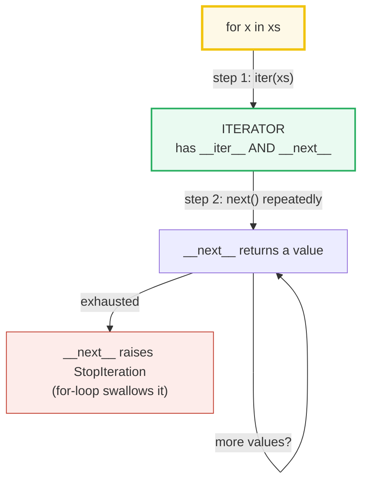
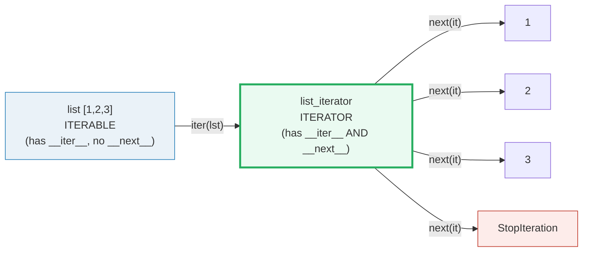
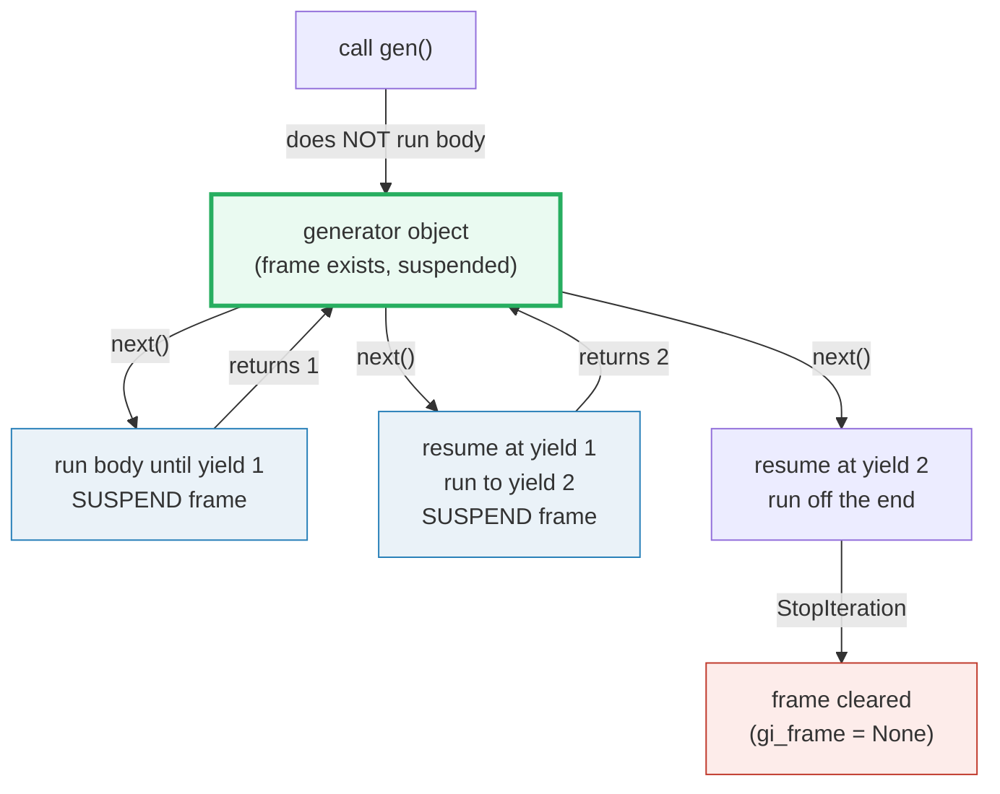
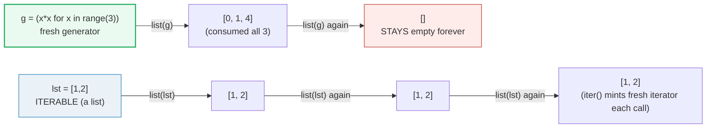
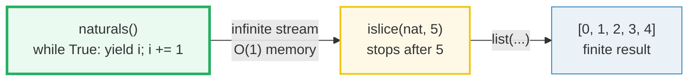

# Generators & Iterators — The Protocol, `yield`, and Lazy Pipelines

> **The one rule:** every `for x in xs` runs the **iterator protocol** —
> `iter(xs)` returns an *iterator*, `next()` walks it until `StopIteration`. A
> list is an *iterable* (it has `__iter__`) but **not** an iterator (no
> `__next__`). A *generator* is a function whose frame **suspends** at each
> `yield` and resumes on the next `next()` call — which makes it **lazy**,
> **memory-cheap**, and **single-use**. `itertools` is the stdlib algebra that
> exploits all three properties to build infinite pipelines in O(1) memory.

**Companion code:** [`generators_iterators.py`](./generators_iterators.py).
**Every value and table below is printed by `uv run python
generators_iterators.py`** — change the code, re-run, re-paste. Nothing here is
hand-computed. Captured stdout lives in
[`generators_iterators_output.txt`](./generators_iterators_output.txt).

**Goal of this bundle (lineage, old → new):**

> from *"I write `for x in things`"*
> → *"I understand the iterator protocol, why generators are lazy +
> memory-cheap + single-use, and how to build infinite/lazy pipelines with
> `yield` and `itertools`."*

🔗 This is bundle **#5 of Phase 1**. It assumes
[`TYPES_AND_TRUTHINESS`](./TYPES_AND_TRUTHINESS.md) (the object model) and
extends the **generator expression** introduced in
[`COMPREHENSIONS`](./COMPREHENSIONS.md) §5 — a genexpr is just syntactic sugar
for a generator *function*; everything about suspension, exhaustion, and O(1)
memory covered there is the *same protocol* formalized here. The
memory-cheapness story is revisited at full depth in a future
`MEMORY_EFFICIENCY` bundle (streaming multi-GB files, `__slots__`, chunking).
See [`TODO.md`](./TODO.md) for the full plan.

---

## 0. The whole map on one page



| Concept | What it is | Key property |
|---|---|---|
| **Iterable** | any object with `__iter__` (list, str, dict, range, file...) | `iter(x)` returns a fresh iterator each call; **reusable** |
| **Iterator** | any object with `__iter__` **and** `__next__` | `iter(it) is it`; **single-use** — exhausted after one pass |
| **Generator function** | a function containing `yield` | calling it returns a fresh generator; frame **suspends** at each `yield` |
| **Generator object** | the iterator returned by a generator function | type `generator`; lazy, memory-cheap, single-use |
| `yield from sub` | delegate to a sub-iterator (PEP 380) | re-yields sub's values; captures sub's `return` value |

---

## 1. Iterable vs iterator — the protocol `for` runs on



The [language reference](https://docs.python.org/3/library/stdtypes.html#iterator-types)
defines the protocol precisely: an **iterator** must define `__iter__()`
(returning the iterator itself) **and** `__next__()` (returning the next value
or raising `StopIteration`). An **iterable** is anything with `__iter__()`;
`iter(x)` is the builtin that calls `x.__iter__()`. A list is iterable but
**not** an iterator — calling `next([1,2,3])` raises `TypeError: 'list' object
is not an iterator`, because `list` has no `__next__`.

> From `generators_iterators.py` Section A:
> ```
> ======================================================================
> SECTION A — Iterable vs iterator: the protocol Python's `for` runs on
> ======================================================================
> Every `for x in xs` first calls iter(xs) to get an ITERATOR, then
> calls next() on it until StopIteration. iter() works on any
> ITERABLE (list/str/dict/range/file...); next() works ONLY on
> iterators. A list is iterable but NOT an iterator: it has no
> __next__ method.
> 
> lst = [1, 2, 3]
> type(lst).__name__           = list
> hasattr(lst, '__iter__')     = True
> hasattr(lst, '__next__')     = False   <- no __next__: NOT an iterator
> it = iter(lst)
> type(it).__name__            = list_iterator
> iter(it) is it               = True   <- an iterator's __iter__ returns SELF
> next(it)                     = 1
> next(it)                     = 2
> next(it)                     = 3
> next(it)                     -> StopIteration (iterator exhausted)
> 
> next([1, 2, 3])              -> TypeError: 'list' object is not an iterator
> 
> [check] iter(it) is it for an iterator (protocol: __iter__ returns self): OK
> [check] a list has __iter__ (it is iterable): OK
> [check] a list has NO __next__ (it is NOT an iterator): OK
> ```

### Why `iter(it) is it` (internals)

The protocol demands that an iterator's `__iter__` return **itself**. This is
not arbitrary: it lets any iterator be used wherever an iterable is expected
(so `for x in some_iterator:` works, and so you can pass an iterator to
`sorted()`, `list()`, `tuple()` even though they call `iter()` on their
argument). The `for` loop's exact expansion is:

```python
_iter = iter(xs)          # xs.__iter__() -> an iterator
while True:
    try:
        x = next(_iter)   # _iter.__next__()
    except StopIteration:
        break
    <body>
```

That's the whole machine. A list produces a *fresh* `list_iterator` every time
you call `iter()` on it — which is why a list survives repeated iteration but
an iterator does not (§4). The `TypeError` on `next([1,2,3])` is CPython's
`builtin_next` checking `PyIter_Check` and refusing non-iterators.

---

## 2. A hand-rolled iterator — `__iter__` + `__next__` (Countdown)

There is no magic beneath the protocol. A class with `__iter__` (returning
`self`) and `__next__` (raising `StopIteration` when done) **is** an iterator.
The `Countdown` below is structurally identical to what
`iter([3,2,1])` returns — same two methods, same exhaustion rule.

> From `generators_iterators.py` Section B:
> ```
> ======================================================================
> SECTION B — A hand-rolled iterator: __iter__ + __next__ (Countdown)
> ======================================================================
> The whole protocol is two methods. __iter__ returns the iterator
> (for an iterator, it returns self). __next__ returns the next
> value, or raises StopIteration to say 'done'. This is exactly
> what iter([1,2,3]) returns under the hood — no magic.
> 
> class Countdown:
>     def __iter__(self): return self
>     def __next__(self):
>         if self.n <= 0: raise StopIteration
>         self.n -= 1; return self.n + 1
> 
> cd = Countdown(3)
> iter(cd) is cd        = True
> for v in Countdown(3): seq = [3, 2, 1]
> manual walk of Countdown(2): next, next, next -> [2, 1, 'StopIteration']
> 
> [check] Countdown(3) yields 3, 2, 1 then stops: OK
> [check] iter(cd) is cd (an iterator's __iter__ returns self): OK
> [check] iter(cd) is cd for a Countdown instance: OK
> [check] manual walk ends in StopIteration: OK
> ```

### Why `StopIteration` and not `None` / a sentinel (internals)

`StopIteration` is the protocol's **only** "no more items" signal — it cannot
be confused with a real value (so `None` can be a legitimate yielded value),
and it propagates cleanly through nested call stacks. The `for` loop, `list()`,
`tuple()`, `sum()`, `zip()`, and `*unpacking` all catch `StopIteration`
internally. **Never** raise `StopIteration` outside `__next__` (or a
`yield`-less generator that returns) — in Python 3.7+ doing so inside a
generator's `finally`/`except` is converted to `RuntimeError` (PEP 479), a
common migration bug. A single `Countdown` is also single-use (try iterating
`cd` twice in the `.py` — the second pass is empty); to be re-iterable, a
class should make `__iter__` return a *new* iterator object, not `self`.

---

## 3. `yield` makes a function into a generator (frame suspends)



The [language reference](https://docs.python.org/3/reference/expressions.html#yield-expressions)
says: the presence of `yield` (not `return`) in a function body makes the whole
function a **generator function**. Calling it **does not execute the body** —
it returns a fresh **generator object** holding a suspended frame. Each
`next()` runs the body forward to the next `yield`, then suspends; the value
of the `yield` expression becomes `next()`'s return value. The frame's locals
and instruction pointer are preserved between calls, which is exactly how a
generator maintains state without a class.

> From `generators_iterators.py` Section C:
> ```
> ======================================================================
> SECTION C — `yield` makes a function into a generator (frame suspends)
> ======================================================================
> A function containing `yield` is a GENERATOR FUNCTION. CALLING it
> does NOT execute the body — it returns a fresh GENERATOR object.
> Each next() runs the body until the next `yield`, then SUSPENDS
> the frame (locals + instruction pointer are kept alive). Calling
> next() again RESUMES exactly where it left off.
> 
> Calling two_yields() returns a generator; body has NOT run yet:
> type(g).__name__               = generator
> g.gi_frame is not None         = True  (frame exists, suspended)
> 
> Driving it with next() — watch the body prints interleave:
> calling next(g)...
>     [body: running up to first yield]
>   -> 1
> calling next(g)...
>     [body: resumed between yields; local state preserved]
>   -> 2
> calling next(g)...
>     [body: resumed after second yield; about to fall off the end]
>   -> StopIteration (body ran off the end)
> 
> Frame-suspension demo: local var `total` persists across yields.
> rt = running_total(10)   # total starts at 10
> next(rt) -> 10
> next(rt) -> 11
> next(rt) -> 12   (10 -> 11 -> 12: SAME frame, local persisted)
> 
> [check] calling a generator function returns a generator object: OK
> [check] an exhausted generator's frame is None (gi_frame cleared): OK
> [check] a fresh generator's frame is live before first next(): OK
> [check] next() walks the yields in order: OK
> [check] a single generator's local var accumulates across next() calls: OK
> ```

### Why the frame suspends instead of returning (internals)

A normal function call allocates a frame on the CPython call stack, runs to
completion, and **pops** the frame on `return`. A generator call also allocates
a frame, but `yield` does **not** pop it — the [YIELD_VALUE
bytecode](https://github.com/python/cpython/blob/main/Python/ceval.c) saves
the frame pointer inside the generator object and returns the yielded value to
the caller. On the next `next()`, CPython **pushes the saved frame back** and
resumes execution at the instruction after the `yield`. The frame's
`fastlocals` (where local variables live) are untouched in the meantime — so
`total` in `running_total` keeps climbing. Once the body falls off the end (or
hits a bare `return`), the frame is finally cleared: `g.gi_frame` becomes
`None`, and the generator is exhausted forever. The `gi_frame` attribute is
the most direct observable proof of suspension.

🔗 The **generator expression** `(x*x for x in range(5))` from
[`COMPREHENSIONS`](./COMPREHENSIONS.md) §5 is sugar for an implicit generator
function — it creates the same `generator` object, suspends the same way, and
exhausts the same way. The genexpr is just a one-liner syntax for "yield
`<expr>` in a loop"; everything in this bundle applies to it.

---

## 4. Iterators are single-use — exhaustion is permanent



This is the #1 source of "my generator is empty" bugs. An **iterator** is
stateful — it advances a cursor with each `next()`. Once that cursor reaches
the end, every further `next()` raises `StopIteration` and `list(it)` returns
`[]`. A **list** (or any *iterable* that is not itself an iterator) survives
repeated iteration because `iter(lst)` **mints a fresh iterator** each call,
leaving the list's data untouched.

> From `generators_iterators.py` Section D:
> ```
> ======================================================================
> SECTION D — Iterators are single-use: exhaustion is permanent
> ======================================================================
> An iterator is CONSUMED by iteration. Once exhausted, every
> further next() raises StopIteration and list(it) returns []. This
> is true of generator expressions, generator functions, map/filter
> objects, zip objects, file objects, and EVERY itertools output.
> A LIST survives repeated iteration; an ITERATOR does not.
> 
> g = (x*x for x in range(3))
> list(g) (1st pass) = [0, 1, 4]
> list(g) (2nd pass) = []   <- EMPTY: g was consumed
> 
> def small_gen(): yield 'a'; yield 'b'
> g_a = small_gen(); g_b = small_gen()
> g_a is g_b        = False   <- two DISTINCT generator objects
> list(g_a)         = ['a', 'b']
> list(g_b)         = ['a', 'b']   <- each call makes a fresh generator
> list(g_a) again   = []   <- but each generator is single-use
> 
> lst = [1, 2]
> list(lst) x3      = [[1, 2], [1, 2], [1, 2]]
>   (a list is an ITERABLE: iter() mints a fresh iterator each time)
> 
> [check] generator expression is single-use: list() twice -> 2nd empty: OK
> [check] two calls to a generator function -> two distinct objects: OK
> [check] each fresh generator yields its values on the first pass: OK
> [check] a generator is exhausted after one full pass: OK
> [check] a list survives repeated iteration: OK
> ```

### Why the distinction matters (internals + gotchas)

The iterator-vs-iterable split exists so that the *same* container type can be
iterated many times (a list, a dict, a set) while the *cursor* object is
disposable. Calling a **generator function twice** produces **two distinct
generator objects** — each one runs the body independently from the top; this
is why `g_a is g_b` is `False` and why `list(g_a)` then `list(g_b)` both
return `['a', 'b']`. The trap is that `map()`, `filter()`, `zip()`,
`enumerate()`, `reversed()`, open **file objects**, and **every itertools
function** all return **single-use iterators**, not lists — so
`rows = csv.reader(f); max(rows); sum(1 for _ in rows)` silently gives `0`
for the count because `max()` already exhausted the iterator. Defensive
patterns: (a) materialize with `list(it)` if you need to reuse, (b) accept
that generators are consumed and design callers accordingly, or (c) write a
re-iterable wrapper class whose `__iter__` returns a fresh generator each call.

---

## 5. `yield from` — delegating to a sub-generator (PEP 380)

[PEP 380](https://peps.python.org/pep-0380/) (Python 3.3) introduced
`yield from sub` as a *transparent, bidirectional* two-way channel between the
caller and a sub-generator. The outer generator delegates: each value the sub
yields is re-yielded by the outer, `send()`/`throw()` from the caller flow
straight into the sub, and when the sub finishes, its `return` value becomes
the value of the `yield from` expression in the outer. `sub` can be any
iterable — another generator, a list, a string, a range.

> From `generators_iterators.py` Section E:
> ```
> ======================================================================
> SECTION E — `yield from` delegates to a sub-generator (PEP 380)
> ======================================================================
> `yield from sub` makes the outer generator transparently delegate
> to `sub`: each value the sub yields is re-yielded by the outer,
> and when the sub raises StopIteration, control returns to the
> outer. `sub` can be any iterable (another generator, a list, a
> string, a range...).
> 
> def sub_gen(): yield 'x'; yield 'y'
> def delegating_gen():
>     yield 'start'
>     yield from sub_gen()       # delegate to a sub-generator
>     yield from ['a', 'b']      # works on any iterable
>     yield 'end'
> 
> list(delegating_gen()) = ['start', 'x', 'y', 'a', 'b', 'end']
> 
> `yield from` ALSO captures the sub-generator's return value:
> def returning_sub(): yield 1; yield 2; return 'SUB_RESULT'
> def outer(): sent = yield from returning_sub(); yield f'got: {sent}'
> list(outer())         = [1, 2, 'got: SUB_RESULT']
> 
> [check] yield from flattens sub-generator values into the outer stream: OK
> [check] yield from forwards the sub-generator's return value: OK
> ```

### Why `yield from` beats an explicit `for v in sub: yield v` (internals)

The naïve rewrite — `for v in sub: yield v` — only forwards **values**, not
control flow. `send()`, `throw()`, and `close()` from the caller land on the
*outer* generator, not the sub; and the sub's `return` value is silently
dropped. `yield from` establishes the [transparent two-way
connection](https://peps.python.org/pep-0380/#formal-semantics) specified in
PEP 380's "Formal Semantics": the outer effectively becomes a no-op pass-through
for `send`/`throw`/`close` while the sub runs, which is essential for
coroutine-style code, recursive tree walks, and flattening nested structures.
The `return value` capture (shown by `list(outer()) == [1, 2, 'got: SUB_RESULT']`)
is how a sub-generator communicates a final result *out of band* alongside its
stream of yielded values.

---

## 6. Infinite generators + `islice` — lazy pipelines in O(1) memory



A `while True: yield ...` generator never stops on its own — and that is
**safe**, because it produces a value *only* when `next()` asks for one. The
object's memory is fixed (`sys.getsizeof` is constant regardless of how many
items you've pulled); only the caller's patience bounds the run. The standard
way to take the first *N* items of a (possibly infinite) iterator is
[`itertools.islice`](https://docs.python.org/3/library/itertools.html#itertools.islice),
which works like sequence slicing but with no negative indices and full
laziness.

> From `generators_iterators.py` Section F:
> ```
> ======================================================================
> SECTION F — Infinite generators + islice: lazy pipelines in O(1) memory
> ======================================================================
> A generator with `while True: yield ...` never stops on its own.
> That's SAFE because it's lazy — it only produces a value when
> next() asks for one, so the infinite stream costs O(1) memory.
> itertools.islice(it, n) is the standard way to take the first N
> items of any (possibly infinite) iterator.
> 
> def naturals():
>     i = 0
>     while True: yield i; i += 1
> 
> list(islice(naturals(), 5))      = [0, 1, 2, 3, 4]
> list(islice(naturals(), 10, 13)) = [10, 11, 12]   (start/stop, like slicing)
> 
> sys.getsizeof(naturals()) before pulls = 184 bytes
> sys.getsizeof(naturals()) after 3 pulls = 184 bytes
>   (fixed — pulling 1 or 1e9 values does not grow the object)
> 
> [check] infinite generator + islice(_, 5) -> [0,1,2,3,4]: OK
> [check] islice supports start/stop like sequence slicing: OK
> [check] the generator object size is constant regardless of pulls: OK
> ```

### Why infinite generators don't blow memory (internals)

A generator object stores **no** values at all — it stores only its **frame**
(locals + instruction pointer), which is a fixed-size struct. `naturals()`
holding "the natural numbers" and `naturals()` holding "the first three" have
the **same** `sys.getsizeof` because nothing is buffered: each `next()`
*computes* the next value from `i += 1` on the fly. Contrast with
`list(range(10**9))`, which must materialize a billion pointers (≈8 GB on
64-bit CPython) before you can even look at the first one. This is the
architectural payoff of the lazy protocol: infinite streams, streaming files
line-by-line, log-processing pipelines — all run in **O(1) memory** as long
as you never call `list()` on the whole thing. `islice(it, n)` is the safety
valve that turns an infinite stream into a finite one.

🔗 This O(1)-memory property is the foundation of the future
`MEMORY_EFFICIENCY` bundle, which extends it to streaming multi-GB files,
generator-based ETL pipelines, and the `__slots__`/chunking tricks that keep
peak RSS flat.

---

## 7. itertools greatest hits — `count`, `chain`, `takewhile`, `accumulate`, `product`

[`itertools`](https://docs.python.org/3/library/itertools.html) is the stdlib's
"iterator algebra" — a core set of functions that each return a **lazy
iterator** and compose like Unix pipes. The six below are the ones you reach
for daily. Note every result is materialized by `list(...)` only for display;
the itertools object itself is single-use and O(1)-memory.

| Tool | Signature | Yields |
|---|---|---|
| `count(start, step)` | infinite | `start, start+step, start+2*step, ...` |
| `chain(*iters)` | finite per input | `p0, p1, …, q0, q1, …` (concat) |
| `takewhile(pred, it)` | finite | items until `pred` first returns False |
| `accumulate(it, func)` | finite | running totals (`func` defaults to `+`) |
| `product(*iters)` | finite | cartesian product (nested for-loop) |

> From `generators_iterators.py` Section G:
> ```
> ======================================================================
> SECTION G — itertools greatest hits: count, chain, takewhile, accumulate, product
> ======================================================================
> itertools is the stdlib's iterator algebra. EVERY function returns
> a LAZY iterator — chaining/accumulating over a million items costs
> O(1) memory until you materialize them with list(). Below: one
> demo of each, plus a composed lazy pipeline.
> 
> tool        expression                                      result
> ----------------------------------------------------------------------------------
> count       islice(count(10), 5)                            [10, 11, 12, 13, 14]
> chain       chain('AB', 'CD')                               ['A', 'B', 'C', 'D']
> takewhile   takewhile(lambda x: x<3, [1,2,3,4,1])           [1, 2]
> accumulate  accumulate([1,2,3,4])                           [1, 3, 6, 10]
> accumulate  accumulate([1,2,3,4], initial=10)               [10, 11, 13, 16, 20]
> product     product('AB', 'xy')                             [('A', 'x'), ('A', 'y'), ('B', 'x'), ('B', 'y')]
> 
> Lazy pipeline (no intermediate list is ever materialized):
>   list(islice( (x*x for x in takewhile(lambda n: n<100, count(7))), 5 ))
>   = [49, 64, 81, 100, 121]
> 
> [check] count(10) is an infinite arithmetic stream: OK
> [check] chain concatenates iterables lazily: OK
> [check] takewhile stops at the first False (and consumes that item): OK
> [check] accumulate gives running totals: OK
> [check] accumulate with initial= prepends the start value: OK
> [check] product is the cartesian product: OK
> [check] lazy pipeline composition works end-to-end: OK
> ```

### Why composing lazy iterators scales (internals)

The pipeline `islice((x*x for x in takewhile(n<100, count(7))), 5)` pulls
items **one at a time** through the whole chain: `islice` asks the genexpr for
one item → the genexpr asks `takewhile` for one → `takewhile` asks `count` for
one → `count` yields 7 → `takewhile` checks `7 < 100` (True), yields 7 →
genexpr squares to 49 → `islice` emits (49,) and counts 1. Repeat for 8, 9,
10, 11; after the 5th, `islice` stops and the upstream never sees 12. No
intermediate list `[7, 8, 9, …, 99]` is ever built — the whole pipeline is
O(1) memory. This is the same "demand-pull" architecture as Unix pipes or
lazy functional languages (Haskell, SML), and is exactly why the itertools
[docs](https://docs.python.org/3/library/itertools.html) describe the module
as "iterator building blocks inspired by constructs from APL, Haskell, and
SML." Note two subtle correctness points printed above: `takewhile` **consumes
and discards** the first failing item (so `3` is eaten even though a later
`1` would pass the predicate — `takewhile` does not recover), and
`product('AB','xy')` consumes its inputs **eagerly** into pools before
yielding (so it only works with finite inputs, unlike the lazy `count`).

---

## Pitfalls

| Trap | Example | The fix |
|---|---|---|
| Treating a list as an iterator | `next([1,2,3])` → `TypeError` | call `iter()` first: `next(iter([1,2,3]))`; or just use a `for` loop |
| Reusing an exhausted generator | `g = (x for x in range(3)); sum(g); list(g)` → `[]` | materialize once with `list(g)` if you need it twice; or call the generator function again for a fresh one |
| Assuming `zip`/`map`/`filter` are reusable | `m = map(f, data); list(m); list(m)` → `[]` | they return **single-use iterators**; wrap in `list()` if you need to iterate twice |
| File object exhausted silently | `for line in f: ...; for line in f: ...` → 2nd loop empty | `f.seek(0)` to rewind, or read once into a list |
| Raising `StopIteration` inside a generator's `finally` | pre-3.7 idiom now raises `RuntimeError` (PEP 479) | use a bare `return` to end a generator; never `raise StopIteration` |
| `takewhile` "loses" the first failing item | `takewhile(<5, [1,4,6,3])` → `[1,4]` (the `6` is consumed) | if you need to peek-and-resume, use `itertools.tee` or `more_itertools.before_and_after` |
| `product` on infinite inputs hangs | `product(count(), 'ab')` never yields (buffers forever) | `product` fully consumes inputs into pools — only finite inputs are safe |
| `islice` with negative indices | `islice(it, -1)` → `ValueError` | use `collections.deque(it, maxlen=n)` for a trailing slice instead |
| Calling a generator function vs. calling the generator | `def g(): yield 1; g()` does **nothing** until you call `next()` | always assign: `gen = g(); next(gen)` — the function call just *creates* the object |
| Mutating a list while iterating it | `for x in lst: lst.remove(x)` skips elements | iterate over a copy (`for x in lst[:]`) or over `list(lst)`; or use a comprehension to build the new list |
| Confusing `iter(it) is it` (iterator) with `iter(x) is x` (iterable) | `iter([1,2]) is [1,2]` → `False` | only iterators return themselves from `__iter__`; lists/dicts/sets do not |

---

## Cheat sheet

- **Iterable:** has `__iter__()` → `iter(x)` returns a fresh iterator. Lists,
  dicts, strings, sets, files are iterables (reusable across iterations).
- **Iterator:** has `__iter__()` **and** `__next__()`; `iter(it) is it`
  (returns itself). Single-use — exhausted after one pass; `next()` raises
  `StopIteration` at the end.
- **The `for` loop protocol:** `_it = iter(xs); while True: try: x =
  next(_it); except StopIteration: break; <body>`. That is the whole machine.
- **Generator function:** a function with `yield`. Calling it returns a fresh
  **generator object** (type `generator`); the body does **not** run yet. Each
  `next()` runs to the next `yield` and **suspends** the frame; locals persist
  across calls. Frame clears (`gi_frame = None`) when the body ends.
- **Single-use:** generators, genexprs, `map`/`filter`/`zip`/`enumerate`,
  files, and every itertools output are **consumed once**. `list(g)` twice →
  second is `[]`. A list survives because `iter(lst)` mints a fresh iterator.
- **`yield from sub`:** delegate transparently — re-yields sub's values,
  forwards `send`/`throw`/`close`, captures sub's `return` value (PEP 380).
- **Infinite generators:** `while True: yield ...` is safe (lazy, O(1)
  memory). Wrap with `itertools.islice(it, n)` to take a finite prefix.
- **itertools essentials:** `count(start, step)` (infinite arithmetic),
  `chain(*iters)` (concat), `takewhile(pred, it)` (prefix while true),
  `accumulate(it, func)` (running totals), `product(*iters)` (cartesian
  product — inputs consumed eagerly, finite only). All return lazy, single-use
  iterators.
- **Memory:** a generator object's `sys.getsizeof` is fixed regardless of how
  many values it will eventually produce — values are computed on demand, not
  buffered.

---

## Sources

- **Python docs — Built-in Types: Iterator Types.**
  https://docs.python.org/3/library/stdtypes.html#iterator-types
  *The authoritative definition of the iterator protocol: `__iter__()` returns
  the iterator object itself, `__next__()` returns the next item or raises
  `StopIteration`. Quoted in §1 and §2.*
- **Python docs — Glossary: iterator & iterable.**
  https://docs.python.org/3/glossary.html#term-iterator
  https://docs.python.org/3/glossary.html#term-iterable
  *"An iterable is an object capable of returning its members one at a time";
  "an iterator represents a stream of data … repeated calls to `__next__()`
  either return successive items or raise `StopIteration`." Basis for §1.*
- **Python docs — Expressions: Yield expressions.**
  https://docs.python.org/3/reference/expressions.html#yield-expressions
  *The semantics of `yield`: suspension of execution, the value returned by
  `next()`, and the generator-protocol methods (`send`, `throw`, `close`).
  Underpins §3 and §5.*
- **Python docs — Library: itertools.**
  https://docs.python.org/3/library/itertools.html
  *Signatures and "roughly equivalent to" code for `count`, `chain`,
  `takewhile`, `accumulate`, `product`, `islice`, plus the itertools recipes.
  Quoted in §6 and §7; the `accumulate([1,2,3,4,5]) → 1 3 6 10 15` example
  matches the demo.*
- **PEP 380 — Syntax for Delegating to a Subgenerator.**
  https://peps.python.org/pep-0380/
  *Introduces `yield from`, the transparent two-way channel between caller and
  sub-generator, and the "Formal Semantics" that specify `send`/`throw`/`close`
  forwarding plus the `return`-value capture. Basis for §5.*
- **PEP 479 — Change StopIteration handling inside generators.**
  https://peps.python.org/pep-0479/
  *The 3.7 rule that a `StopIteration` bubbling out of a generator becomes a
  `RuntimeError` — referenced in the §2 internals note and the pitfalls
  table.*
- **PEP 255 — Simple Generators.**
  https://peps.python.org/pep-0255/
  *The original Python 2.2 design introducing `yield` and the suspended-frame
  execution model. Historical grounding for §3.*
- **Stack Overflow — "Why 'list' object is not an iterator".**
  https://stackoverflow.com/questions/50735626/typeerror-list-object-is-not-an-iterator
  *Independent confirmation that `next([1,2,3])` raises `TypeError: 'list'
  object is not an iterator` because `list` defines `__iter__` but not
  `__next__`. Cross-checked against the TypeError line printed in §1.*
- **CPython source — ceval.c (YIELD_VALUE bytecode).**
  https://github.com/python/cpython/blob/main/Python/ceval.c
  *The bytecode implementation that saves the frame pointer inside the
  generator object on `yield` and restores it on the next `next()` — the
  mechanism behind the `gi_frame` suspension shown in §3.*
