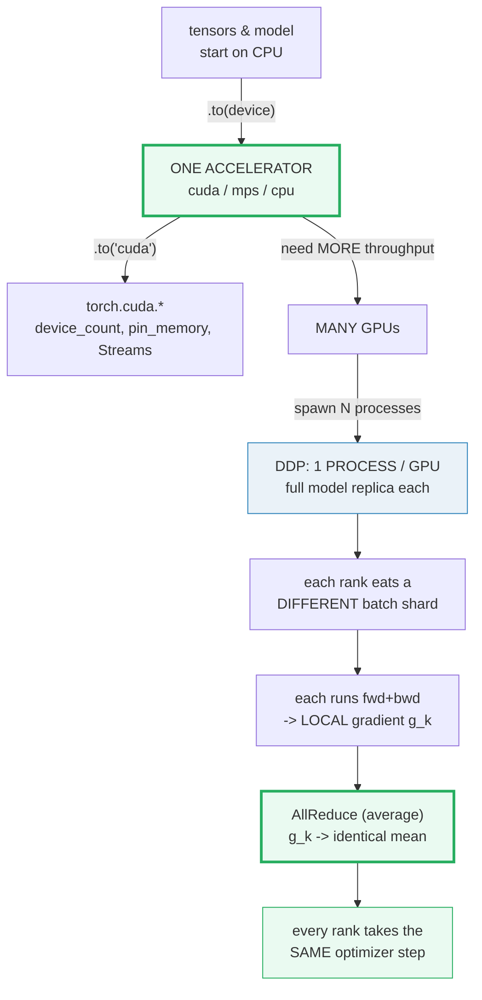
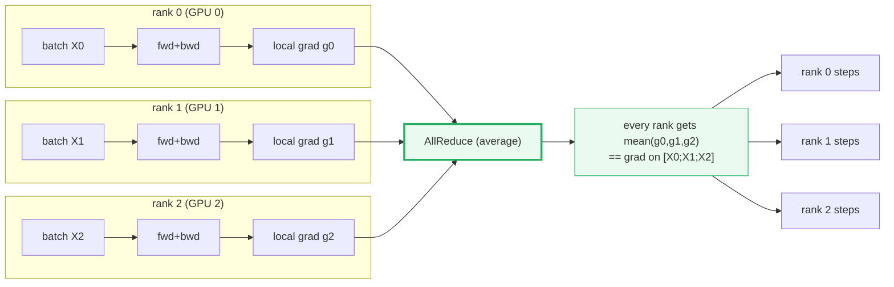
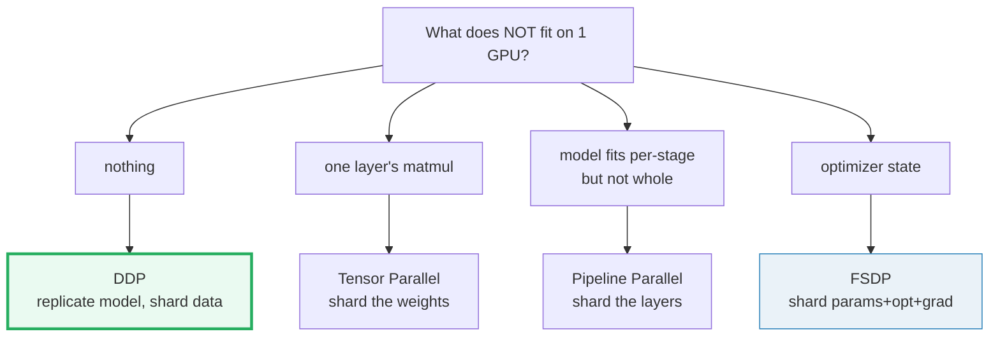

# GPU & Distributed — `.to(device)` and DistributedDataParallel (DDP)

> **The one rule:** a torch tensor lives on a *device*. To use an accelerator
> you move compute there with `.to(device)`; to use *many* accelerators you
> launch one **process per GPU** and let `DistributedDataParallel` average the
> gradients via **AllReduce** so the replicas can never drift.

**Companion code:** [`gpu_distributed.py`](./gpu_distributed.py). **Every
number and table below is printed by `uv run python gpu_distributed.py`** —
change the code, re-run, re-paste. Nothing is hand-computed. Captured stdout
lives in [`gpu_distributed_output.txt`](./gpu_distributed_output.txt).

> **This machine has NO CUDA (it has MPS).** The runnable `.py` selects
> `cuda → mps → cpu` and runs on MPS here. The CUDA-only and DDP-only
> behaviors are demonstrated **structurally** (the API shapes + a real
> single-process `gloo` init that runs on CPU), never as a flaky multi-process
> launch. The DDP **math** is bit-for-bit identical to a real run; only the
> execution model is simplified so every number is printable on a laptop.

**Goal of this bundle (lineage, old → new):**

> from *"my training loop runs on my laptop"* (🔗 [`TRAINING_LOOP`](./TRAINING_LOOP.md))
> → *"I move compute to a GPU with `.to(device)`, and scale to many GPUs with
> DDP — one process per GPU, gradients averaged by AllReduce — and I know the
> per-rank seeding and rank/world_size model."*

🔗 **Forward references you will need:** `.to(device)` was introduced for
`nn.Module` in [`NN_MODULE`](./NN_MODULE.md) §H (P5 #31). The systems-side
deep dive on AllReduce, the ring algorithm, and the 5 NCCL primitives lives in
[`../llm/NCCL_COLLECTIVES.md`](../llm/NCCL_COLLECTIVES.md); the worked DDP
*simulation* (K replicas, gradient averaging proven numerically) lives in
[`../llm/DDP.md`](../llm/DDP.md). The per-rank multiprocessing primitive itself
is deferred to `MULTIPROCESSING_BASICS` (P3 #20). See
[`TODO.md`](./TODO.md) for the full plan.

---

## 0. The whole idea in one picture



| Question | One-GPU answer | Many-GPU (DDP) answer |
|---|---|---|
| Where does compute happen? | the device from `.to(device)` | one full replica per GPU |
| How is the work split? | not split | the **data** (each rank a disjoint batch) |
| How do replicas agree? | n/a | **AllReduce** averages the gradients every step |
| Can replicas drift? | n/a | **no** — averaging makes drift mathematically impossible |
| What MUST differ per rank? | n/a | the **seed** (`42 + rank`) and the **data shard** |

> **One plain sentence:** DDP trades **redundant memory** (every GPU stores the
> full model + optimizer) for **linear throughput scaling** and a guarantee
> that replicas stay bit-identical forever. That guarantee is the whole point.

---

## 1. Device selection — the `cuda → mps → cpu` ladder

A `torch.Tensor` is tagged with the device it lives on (`tensor.device`). The
portable, future-proof way to pick one is the three-rung ladder below. CUDA is
the fast path on NVIDIA GPUs; MPS is the Apple-Silicon fallback (this Mac);
CPU is always available as the last resort.

```python
device = torch.device("cuda" if torch.cuda.is_available()
                      else ("mps" if torch.backends.mps.is_available()
                            else "cpu"))
```

`torch.cuda.is_available()` is **lazily initialized** — importing `torch.cuda`
never fails even on a CUDA-less box; the function just returns `False`. This
is exactly why the import is always safe and the runtime check is the source
of truth.

> From `gpu_distributed.py` Section A:
> ```
> ======================================================================
> SECTION A — Device selection: cuda -> mps -> cpu
> ======================================================================
> A torch.Tensor lives on a device. The portable selection ladder is:
>   device = 'cuda' if torch.cuda.is_available() else
>            ('mps'  if torch.backends.mps.is_available() else 'cpu')
> On this machine CUDA is absent, so the ladder falls through to mps
> or cpu. The chosen device is printed below; nothing is hard-coded.
> 
> torch.cuda.is_available()             False
> torch.backends.mps.is_available()     True
> torch.cuda.device_count()             0
> selected device                       mps
> device.type                           mps
> 
> CUDA-only facts (conceptual on this machine):
>   torch.cuda.device_count() -> #GPUs (0 here).
>   tensor.cuda() / tensor.cpu() -> shorthand .to(device) moves.
>   DataLoader(pin_memory=True) -> page-locked host RAM for faster
>     host->device DMA copy (only helps when a CUDA GPU exists).
>   torch.cuda.Stream -> an independent queue of CUDA kernels; lets
>     copy & compute overlap (🔗 CUDA_GRAPHS for the deep view).
> 
> [check] a device was always selected (never None): OK
> [check] device.type is one of cuda/mps/cpu: OK
> [check] cuda device_count is 0 on this non-CUDA machine: OK
> [check] cuda.is_available() and mps.is_available() are mutually consistent with the pick: OK
> ```

### Why CUDA is lazy-initialized (internals)

Per the [torch.cuda docs](https://docs.pytorch.org/docs/stable/cuda.html):
"This package adds support for CUDA tensor types … It is **lazily
initialized**, so you can always import it, and use `is_available()` to
determine if your system supports CUDA." That means `import torch.cuda` does
NOT create a CUDA context — the context is built on first real use. The
practical consequence: a single codebase can `import torch.cuda` at the top
unconditionally and let `is_available()` gate the GPU paths at runtime.

🔗 The full treatment of `.to(dtype)` and `.to(device)` for an `nn.Module`
(moving the whole tree recursively) is in
[`NN_MODULE`](./NN_MODULE.md) §H (P5 #31). This guide only adds the
device-selection ladder and the same-device *rule*.

---

## 2. `.to(device)` — move a tensor and a model; the same-device rule

`.to(device)` behaves differently for a **Tensor** vs an **nn.Module**:

- **Tensor:** `.to(device)` returns a **new** tensor on the target device
  (the original is untouched — `x_cpu is x_dev` is `False`).
- **nn.Module:** `.to(device)` moves **all parameters and buffers in place**
  and returns `self` (so `model = MLP().to(device)` is idiomatic).

The hard rule: **inputs AND the model must be on the same device**. If a
parameter lives on `mps:0` and you feed a CPU tensor, the very first matmul
raises `RuntimeError: Expected all tensors to be on the same device`. The
`.py` provokes this on purpose so you can see the error class.

> From `gpu_distributed.py` Section B:
> ```
> ======================================================================
> SECTION B — .to(device): move a tensor and a model (same-device rule)
> ======================================================================
> .to(device) returns a COPY on the target device for tensors, and
> moves ALL parameters/buffers IN PLACE for an nn.Module (it returns
> self). Inputs AND the model MUST land on the same device, else the
> first matmul raises RuntimeError.
> 
> str(x_cpu.device)                       cpu
> str(x_dev.device)                       mps:0
> x_cpu is x_dev (new tensor object)      False
> str(model.fc1.weight.device)            mps:0
> str(model.fc2.bias.device)              mps:0
> 
> model(x_dev).device                     mps:0
> tuple(model(x_dev).shape)               (1,)
> 
> x_dev.device.type == params device.type True
> x_cpu.device vs params device (mixed?)  True
> model(cpu_input) raised RuntimeError    True
> 
> [check] x_dev.device matches the selected device type: OK
> [check] .to(device) made a NEW tensor (not in-place for tensors): OK
> [check] model.fc1.weight is on the selected device after .to(device): OK
> [check] model.fc2.bias is also on the selected device (whole tree moved): OK
> [check] input+params on same device -> forward succeeds: OK
> [check] mixed-device forward raises RuntimeError: OK
> ```

### Why the same-device rule is non-negotiable (internals)

A CUDA tensor and a CPU tensor live in physically disjoint memory: the GPU
cannot dereference a host pointer and vice versa. PyTorch refuses to *guess*
a copy direction (silent cross-device transfers would be both slow and
ambiguous), so the dispatch layer checks `.device` equality before every
kernel and raises if they disagree. The fix is always explicit: move the
input with `x.to(model.device)` (or pin the model on CPU / move the model to
the input — your call, but pick one).

**Expert gotcha — MPS reports as `mps:0`, not `mps`:** comparing
`str(tensor.device) == "mps"` will silently fail on Apple Silicon because the
device string is `"mps:0"` (the `:0` is the device index, just like
`"cuda:0"`). Compare `tensor.device.type == "mps"` instead, or compare
`torch.device` objects directly.

---

## 3. CUDA specifics (conceptual on this machine)

The four CUDA-only APIs that everyone hits once they get a real GPU:

| API | Returns | What it does on a CUDA box |
|---|---|---|
| `torch.cuda.is_available()` | `bool` | `True` iff a usable CUDA runtime + GPU exist |
| `torch.cuda.device_count()` | `int` | number of visible GPUs |
| `tensor.cuda()` / `tensor.cpu()` | new `Tensor` | shorthand for `.to(torch.device("cuda"))` / `.to("cpu")` |
| `DataLoader(..., pin_memory=True)` | — | stage batches in **page-locked** host memory so the host→device copy can DMA in parallel with compute (pair with `.to(device, non_blocking=True)`) |
| `torch.cuda.Stream()` | `Stream` | an independent GPU command queue; multiple streams let copy & compute overlap |

On this Mac all of these are no-ops or report negative (`is_available()` →
`False`, `device_count()` → `0`). The `.py` therefore only asserts the API
**shapes** (`isinstance(bool)`, `isinstance(int)`, `hasattr(tensor,
"pin_memory")`) — the values are CUDA-dependent and would all flip on a real
GPU.

> From `gpu_distributed.py` Section C:
> ```
> ======================================================================
> SECTION C — CUDA specifics (conceptual: is_available / device_count / pinned / streams)
> ======================================================================
> These APIs are CUDA-only. On this Mac they all report 'no CUDA' or
> are no-ops; the .py asserts the negative results so the API shapes
> are visible, and the .md explains what each DOES on a real GPU.
> 
> torch.cuda.is_available()                 False
> torch.cuda.device_count()                 0
> hasattr(tensor, "pin_memory")             True
> hasattr(tensor, "is_pinned")              True
> 
> What each does on a CUDA box (NOT runnable here, from the docs):
>   is_available()  -> True iff a usable CUDA runtime + GPU exist.
>   device_count()  -> int number of visible GPUs.
>   tensor.cuda()   -> alias for .to(torch.device('cuda')) .
>   DataLoader(..., pin_memory=True) -> stage batches in page-locked
>     host memory so the host->device copy can DMA in parallel with
>     compute (pair with .to(device, non_blocking=True)).
>   torch.cuda.Stream() -> an independent GPU command queue; multiple
>     streams let copy and compute overlap (🔗 CUDA_STREAMS).
> 
> [check] torch.cuda.is_available() is a bool: OK
> [check] torch.cuda.device_count() is an int: OK
> [check] tensor exposes the pin_memory() API (CUDA-coupled, concept-only here): OK
> ```

### Why `pin_memory` helps (internals)

Normal host RAM is **pageable** — the OS can swap or remap it at any time, so
the GPU's DMA engine cannot safely address it. `pin_memory` (or
`DataLoader(pin_memory=True)`) **page-locks** the host buffer, giving the DMA
engine a stable physical address and enabling an async copy that overlaps with
kernel execution. Without pinning, the driver has to do an extra staged copy
through a pinned bounce buffer — invisible, but slow. On MPS / CPU it does
nothing useful, which is why the `.py` only checks the API exists.

🔗 The deep view of multi-stream overlap, kernel fusion, and CUDA Graphs is in
[`../llm/CUDA_GRAPHS.md`](../llm/CUDA_GRAPHS.md) (the systems-side bundle).

---

## 4. The DDP conceptual model — one process per GPU, AllReduce grads

`DistributedDataParallel` (DDP) is **data parallel**: the *whole* model is
cloned to every GPU, each GPU eats a *different* mini-batch, and after
`backward()` the per-rank gradients are **averaged** via AllReduce so every
replica takes the *same* optimizer step and **can never drift**.

The vocabulary, from the [DDP docstring](https://docs.pytorch.org/docs/stable/generated/torch.nn.parallel.DistributedDataParallel.html)
and the [distributed overview](https://docs.pytorch.org/tutorials/beginner/dist_overview.html):

| Term | Meaning |
|---|---|
| **rank** | this process's id in `[0, world_size)` |
| **world_size** | number of processes (= number of GPUs) |
| **local_rank** | which GPU on *this node* (`torch.cuda.set_device(local_rank)`) |
| **process group** | the set of ranks that do collectives together (default: all) |
| **AllReduce** | a collective: every rank contributes a tensor and ends with the SAME averaged result |
| **replica** | a full copy of the model living on one rank |

**Why one process per GPU, not threads?** Python's GIL would serialize a
single process — you'd get *zero* parallelism from N GPUs in one Python
process. Spawning N processes sidesteps the GIL entirely (each process has its
own interpreter + GIL). The [DDP docstring](https://docs.pytorch.org/docs/stable/generated/torch.nn.parallel.DistributedDataParallel.html)
is explicit: *"To use DistributedDataParallel on a host with N GPUs, you
should spawn up N processes, ensuring that each process exclusively works on a
single GPU from 0 to N-1."*

The **core DDP invariant** is also in the docstring: *"Parameters are never
broadcast between processes. The module performs an **all-reduce step on
gradients** and assumes that they will be modified by the optimizer in all
processes in the same way. Buffers (e.g. BatchNorm stats) are broadcast from
the module in process of rank 0."*



The `.py` makes the "gradients are averaged" claim concrete and printable by
drawing 4 local gradients with a fixed seed and showing they equal the manual
mean — which is *exactly* the math DDP does over the wire.

> From `gpu_distributed.py` Section D:
> ```
> ======================================================================
> SECTION D — DDP conceptual model: one PROCESS per GPU, AllReduce grads
> ======================================================================
> DistributedDataParallel is DATA parallel: the WHOLE model is cloned
> to every GPU, each GPU eats a DIFFERENT batch, and after backward
> the per-rank gradients are averaged with AllReduce so every replica
> takes the SAME optimizer step and can never drift.
> 
>   rank       = this process's id in [0, world_size).
>   world_size = number of processes (= number of GPUs).
>   local_rank = which GPU on this node (set via CUDA_VISIBLE_DEVICES
>                or torch.cuda.set_device(local_rank)).
>   ONE PROCESS PER GPU (not threads): the GIL would serialize a
>   single Python process, so DDP spawns N processes for N GPUs.
>   AllReduce   = a collective: every rank contributes a tensor and
>                every rank ends up with the SAME averaged result.
> 
> world_size = 4; each rank's local grad (first elem):
>   rank 0: g[0] = [1.5409960746765137, -0.293428897857666, -2.1787893772125244]
>   rank 1: g[1] = [0.5684312582015991, -1.0845223665237427, -1.3985954523086548]
>   rank 2: g[2] = [0.40334683656692505, 0.8380263447761536, -0.7192575931549072]
>   rank 3: g[3] = [-0.40334352850914, -0.5966353416442871, 0.18203648924827576]
> AllReduce-MEAN gradient (every rank gets THIS) = [0.5273576974868774, -0.28414005041122437, -1.028651475906372]
> 
> manual sum/ world_size == torch.stack(...).mean : True
> 
> [check] world_size ranks produced world_size local gradients: OK
> [check] AllReduce average equals the manual mean of the per-rank grads: OK
> [check] every rank would receive the SAME averaged gradient: OK
> ```

### Why this keeps replicas bit-identical (internals)

Every rank starts from the **same** initial weights (DDP broadcasts them at
init via the `init_sync=True` default). After `backward`, every rank has a
*local* gradient `g_k`. AllReduce-MEAN replaces every rank's `g_k` with the
identical average `ḡ`. Every rank then runs the *same* optimizer step
`θ ← θ − lr·ḡ`. By induction over steps, the weights on every rank stay
bit-identical forever — drift is mathematically impossible. The
[DDP docstring](https://docs.pytorch.org/docs/stable/generated/torch.nn.parallel.DistributedDataParallel.html)
puts it precisely: *"The module performs an all-reduce step on gradients and
assumes that they will be modified by the optimizer in all processes in the
same way."*

🔗 The **ring-AllReduce** algorithm (how NCCL actually ships the average so
per-GPU traffic stays `≈2N` independent of `K`) is the entire subject of
[`../llm/NCCL_COLLECTIVES.md`](../llm/NCCL_COLLECTIVES.md). The full worked
DDP simulation (K=2 ranks, gradient averaging proven numerically, plus the
"DDP ≡ one big GPU on the concatenation of batches" identity) is in
[`../llm/DDP.md`](../llm/DDP.md).

---

## 5. The DDP API — sketch + a real single-process `gloo` init

A real DDP launch (this is the [PyTorch example](https://docs.pytorch.org/docs/stable/generated/torch.nn.parallel.DistributedDataParallel.html),
lightly condensed):

```python
import os, torch
import torch.distributed as dist
from torch.nn.parallel import DistributedDataParallel as DDP
from torch.utils.data import DataLoader
from torch.utils.data.distributed import DistributedSampler

dist.init_process_group(backend="nccl", rank=rank, world_size=world_size)
torch.cuda.set_device(local_rank)                       # 1 GPU per process
model = MLP().to(torch.device("cuda", local_rank))
model = DDP(model, device_ids=[local_rank])             # wrap AFTER .to()

sampler = DistributedSampler(dataset, shuffle=True)
loader  = DataLoader(dataset, batch_size=64, sampler=sampler)
for epoch in range(epochs):
    sampler.set_epoch(epoch)                            # reshuffle per epoch
    for x, y in loader:
        loss = criterion(model(x), y)
        loss.backward()                                 # <- AllReduce fires here
        optimizer.step(); optimizer.zero_grad()
dist.destroy_process_group()
```

The `backend` argument is what's actually moving bytes:

| Backend | Hardware | Use it when |
|---|---|---|
| `nccl` | NVIDIA GPUs | GPU training — *"the fastest and highly recommended"* (DDP docstring) |
| `gloo` | CPU / network | CPU training, or multi-node before NCCL is set up |
| `mpi`  | CPU / network | if a custom MPI build is required |

We can't run a real multi-process NCCL launch on this Mac, but we **can**
exercise the `init_process_group` / `get_rank` / `get_world_size` API on the
`gloo` backend with `world_size=1` — that actually runs on CPU and proves the
API shapes are real, not paraphrased.

> From `gpu_distributed.py` Section E:
> ```
> ======================================================================
> SECTION E — DDP API sketch + single-process gloo init (world_size=1)
> ======================================================================
> The DDP launch sequence (from the PyTorch DDP docstring):
>   torch.distributed.init_process_group(backend, rank, world_size)
>   torch.cuda.set_device(local_rank)          # one GPU / process
>   model = model.to(device)
>   model = DistributedDataParallel(model, device_ids=[local_rank])
>   sampler = DistributedSampler(dataset, shuffle=True)
>   loader = DataLoader(dataset, batch_size=..., sampler=sampler)
> 
> 'backend' is 'nccl' for NVIDIA GPUs (fastest, recommended),
> 'gloo' for CPU/multi-node, 'mpi' if MPI is built. Below we attempt
> a REAL single-process gloo init (world_size=1) on CPU; if the host
> or port is busy we fall back to the conceptual assertion.
> 
> dist.is_initialized() after init          True
> dist.get_rank()                           0
> dist.get_world_size()                     1
> 
> [check] single-process gloo init succeeded (group initialized): OK
> [check] rank == 0 in a world_size=1 group: OK
> [check] world_size == 1: OK
> ```

### Why wrap with `DDP(...)` AFTER `.to(device)` (internals)

The DDP constructor walks `model.parameters()` and **registers autograd hooks
on each one** — those hooks fire during `backward()` and bucket the gradients
for AllReduce. If you add or move parameters *after* wrapping, the hooks no
longer match the live parameter set and the AllReduce will silently miss them.
The docstring is blunt: *"You should never try to change your model's
parameters after wrapping up your model with DistributedDataParallel."* So the
order is always: build → `.to(device)` → wrap in DDP → train.

The `device_ids=[local_rank]` argument is only valid for single-device CUDA
modules; for CPU modules the docstring requires `device_ids=None` (the
DDP reducer just runs on CPU and gloo ships the bytes).

---

## 6. Per-rank seeding + `DistributedSampler` sharding

DDP only buys you throughput if the K replicas actually do **different**
work. Two things MUST differ per rank, or you've built a very expensive way to
compute the same gradient K times:

1. **The seed.** If every rank calls `torch.manual_seed(42)`, the dropout
   mask, parameter init noise, and any data augmentation are *identical* on
   every rank. AllReduce then averages K copies of the *same* gradient — the
   parallelism is wasted. The fix is `torch.manual_seed(42 + rank)` (or
   `42 + rank * N`) so each rank's RNG stream is independent.
2. **The data shard.** `DistributedSampler(dataset, num_replicas=world_size,
   rank=rank)` partitions the dataset indices into `world_size` disjoint
   strides and hands rank `r` only its stride — so each rank trains on a
   *different* mini-batch. Call `sampler.set_epoch(epoch)` before each epoch
   so the permutation changes (otherwise every epoch sees the same shards).

> From `gpu_distributed.py` Section F:
> ```
> ======================================================================
> SECTION F — Per-rank seeding + DistributedSampler data sharding
> ======================================================================
> DDP only works if the K replicas actually do DIFFERENT work. Two
> things must differ per rank: (1) the SEED (else dropout/init/grad
> noise is identical and AllReduce is pointless), and (2) the DATA
> shard (else every rank trains on the same batch).
> 
> If every rank calls torch.manual_seed(42) (WRONG):
>   rank 0: [0.33669036626815796, 0.12880940735340118, 0.23446236550807953]
>   rank 1: [0.33669036626815796, 0.12880940735340118, 0.23446236550807953]
>   rank 2: [0.33669036626815796, 0.12880940735340118, 0.23446236550807953]
>   rank 3: [0.33669036626815796, 0.12880940735340118, 0.23446236550807953]
>   -> identical draws across ranks; AllReduce would average the SAME
>      gradient K times -> no parallelism benefit.
> 
> If every rank calls torch.manual_seed(42 + rank) (CORRECT):
>   rank 0 (seed 42): [0.33669036626815796, 0.12880940735340118, 0.23446236550807953]
>   rank 1 (seed 43): [-0.6484010815620422, -0.7058414220809937, 0.6432183980941772]
>   rank 2 (seed 44): [0.058945026248693466, -1.3944607973098755, 0.8447810411453247]
>   rank 3 (seed 45): [-1.1223719120025635, 0.031175758689641953, -0.6804271340370178]
> 
> Dataset of 12 indices, world_size=4:
>   rank 0 shard: [0, 4, 8]
>   rank 1 shard: [1, 5, 9]
>   rank 2 shard: [2, 6, 10]
>   rank 3 shard: [3, 7, 11]
> 
> [check] identical seed -> identical first draw on every rank: OK
> [check] per-rank seed 42+rank -> distinct first draws: OK
> [check] shards are disjoint (a partition of the dataset): OK
> [check] each rank gets dataset_size/world_size items: OK
> ```

### Why `set_epoch` matters (internals)

`DistributedSampler` seeds its index permutation with the `epoch` argument so
that the *stride assignment* changes between epochs (rank 0 sees indices
`[0,4,8]` in one epoch but a different stride after a reshuffle). If you
forget `sampler.set_epoch(epoch)`, every epoch reproduces the same per-rank
shards and the model effectively trains on a fixed 1/K subset from each
rank's perspective — a subtle, silent bug.

---

## 7. DDP vs Tensor Parallel vs Pipeline Parallel vs FSDP — the decision table

All four strategies answer the same question (*how do I use more than one
GPU?*) by splitting something different. Pick by **what does not fit on one
GPU**:



> From `gpu_distributed.py` Section G:
> ```
> ======================================================================
> SECTION G — DDP vs Tensor Parallel vs Pipeline Parallel vs FSDP
> ======================================================================
> All four 'parallel' strategies; pick by what does NOT fit on one
> GPU. DDP replicates everything; the others shard the model itself.
> 
> strategy          what is SHARDED             what is REPLICATED              comm primitive
> ------------------------------------------------------------------------------------------------------
> DDP               data                        nothing (full replica per GPU)  AllReduce grads (once/step)
> Tensor Parallel   weights                     data + activations              AllReduce per sharded layer
> Pipeline Par.     layers                      data + activations              Send/Recv between stages
> FSDP              params+opt+grad (sharded)   data                            AllGather + ReduceScatter
> 
> Rule of thumb:
>   - Model fits on 1 GPU -> DDP (simplest, linear throughput).
>   - One layer's matmul does not fit -> Tensor Parallel.
>   - Model fits per-stage but not whole -> Pipeline Parallel.
>   - Optimizer state is the bottleneck -> FSDP (shards it).
> [check] DDP is the only strategy that does NOT shard the model: OK
> [check] FSDP shards params + optimizer + gradients: OK
> ```

### Why FSDP is "DDP communication pattern, but shard everything" (internals)

DDP replicates the **full** parameter + gradient + optimizer state on every
GPU — that's `~20N` bytes per GPU for an `N`-param model, dominated by the
Adam optimizer's two moment buffers (16N). FSDP (= "Fully Sharded Data
Parallel") keeps DDP's data-parallel structure but **shards** those three
states across ranks: before forward it `AllGather`s the full layer weights,
computes, then drops them; after backward it `ReduceScatter`s the gradients
and keeps only the local shard. The communication primitives
([`AllGather` + `ReduceScatter`](../llm/NCCL_COLLECTIVES.md)) compose to the
*same* bytes as DDP's `AllReduce` (that's the identity
`AllReduce == ReduceScatter ; AllGather`), but sharding in between cuts
per-GPU memory from `20N` to `20N/K`.

🔗 Deep dives: [`../llm/DDP.md`](../llm/DDP.md) (DDP worked simulation),
[`../llm/NCCL_COLLECTIVES.md`](../llm/NCCL_COLLECTIVES.md) (the 5 primitives +
the AllReduce identity),
[`../llm/TENSOR_PARALLEL.md`](../llm/TENSOR_PARALLEL.md),
[`../llm/PIPELINE_PARALLEL.md`](../llm/PIPELINE_PARALLEL.md).

---

## Pitfalls

| Trap | Example | The fix |
|---|---|---|
| Forgetting `.to(device)` on the model OR the input | `model(cpu_input)` → `RuntimeError: Expected all tensors to be on the same device` | move both: `model = model.to(device); x = x.to(device)` — or `x.to(model.device)` |
| Comparing device strings | `str(t.device) == "mps"` → `False` on Apple Silicon (it's `"mps:0"`) | compare `t.device.type == "mps"`, or `torch.device` objects |
| Same seed on every DDP rank | `torch.manual_seed(42)` everywhere → AllReduce averages K identical gradients → zero parallelism benefit | seed per-rank: `torch.manual_seed(42 + rank)` |
| Forgetting `sampler.set_epoch(epoch)` | every epoch reproduces the same per-rank shards → silent training degradation | call `sampler.set_epoch(epoch)` at the top of each epoch loop |
| Wrapping with `DDP(...)` before `.to(device)` or adding params after | the autograd hooks capture a stale parameter set → gradients silently not synced | build → `.to(device)` → wrap in DDP; never mutate parameters afterwards |
| Forgetting `dist.destroy_process_group()` | lingering NCCL sockets, "address already in use" on the next launch | always pair `init_process_group` with `destroy_process_group` in a `try/finally` |
| Launching N processes but binding each to GPU 0 | all ranks fight for one GPU, the other GPUs idle | set `CUDA_VISIBLE_DEVICES` per rank OR `torch.cuda.set_device(local_rank)` in each process |
| Mixing `DataParallel` and `DistributedDataParallel` | `nn.DataParallel` is the *old*, GIL-bound, single-process API; slower and deprecated-style | always use `DistributedDataParallel`; the DDP docstring says it is *"significantly faster"* |
| DataLoader workers + NCCL + fork | the docstring warns: *"Gloo (Infiniband) and NCCL2 are not fork safe"* | set `mp.set_start_method("spawn")` or `"forkserver"` at the top of the launch script |
| Expecting DDP to shard the model | DDP *replicates* — every GPU stores the full 20N bytes | if memory is the bottleneck, use FSDP (which *shards*), not DDP |
| Treating `pin_memory=True` as free speed on CPU/MPS | no CUDA context → no DMA → it's a no-op (and may error on MPS-default builds) | only set `pin_memory=True` when `torch.cuda.is_available()`; pair with `.to(device, non_blocking=True)` |

---

## Cheat sheet

- **Device ladder:** `device = 'cuda' if torch.cuda.is_available() else ('mps'
  if torch.backends.mps.is_available() else 'cpu')`. `torch.cuda` is
  lazily-initialized — the import is always safe.
- **`.to(device)`:** returns a NEW tensor; for `nn.Module` it moves the whole
  tree in place (returns `self`). **Inputs AND model on the same device, or
  the first matmul raises `RuntimeError`.** Compare `.device.type`, not the
  device string (MPS shows as `"mps:0"`).
- **CUDA-only helpers:** `is_available()` (bool), `device_count()` (int),
  `tensor.cuda()`/`.cpu()` (shorthand moves), `DataLoader(pin_memory=True)`
  (page-locked host RAM → faster DMA), `torch.cuda.Stream` (independent queue
  for copy/compute overlap).
- **DDP model:** ONE process per GPU (not threads — the GIL would serialize).
  Replicate the model, shard the data, AllReduce-average the gradients. rank
  = process id in `[0, world_size)`; world_size = #processes = #GPUs.
- **DDP invariant:** replicas start identical (broadcast at init) and stay
  identical forever (AllReduce makes drift mathematically impossible).
  Buffers (e.g. BatchNorm stats) are broadcast from rank 0 every iteration;
  parameters are NEVER broadcast — only gradients are AllReduce'd.
- **DDP launch:** `init_process_group(backend, rank, world_size)` →
  `torch.cuda.set_device(local_rank)` → `model.to(device)` → wrap
  `DDP(model, device_ids=[local_rank])` → `DistributedSampler` → train →
  `destroy_process_group`. Backend: `nccl` (NVIDIA, fastest), `gloo` (CPU),
  `mpi` (custom).
- **Per-rank seeding:** `torch.manual_seed(42 + rank)`. Same seed on every
  rank = no parallelism benefit. Pair with `DistributedSampler` for disjoint
  data shards and call `sampler.set_epoch(epoch)` each epoch.
- **Pick the strategy:** model fits on 1 GPU → **DDP**; one layer's matmul
  doesn't fit → **Tensor Parallel**; model fits per-stage but not whole →
  **Pipeline Parallel**; optimizer state is the bottleneck → **FSDP**
  (= DDP comm pattern, but shards params + opt + grad).

---

## Sources

- **PyTorch docs — `torch.cuda`.**
  https://docs.pytorch.org/docs/stable/cuda.html
  *The lazily-initialized CUDA package; `is_available()`, `device_count()`,
  `Stream`, `empty_cache`, and the memory-management API surface. Quoted in
  §1 and §3.*
- **PyTorch docs — `torch.nn.parallel.DistributedDataParallel`.**
  https://docs.pytorch.org/docs/stable/generated/torch.nn.parallel.DistributedDataParallel.html
  *The authoritative DDP docstring: "spawn up N processes … each process
  exclusively works on a single GPU from 0 to N-1"; "nccl backend is
  currently the fastest and highly recommended"; "Parameters are never
  broadcast … performs an all-reduce step on gradients"; "Buffers … are
  broadcast from the module in process of rank 0"; "significantly faster than
  `nn.DataParallel`"; "never try to change your model's parameters after
  wrapping up your model with DistributedDataParallel"; "Gloo (Infiniband)
  and NCCL2 are not fork safe." Quoted in §4, §5, §6, and the pitfalls
  table.*
- **PyTorch tutorials — Distributed Training Overview.**
  https://docs.pytorch.org/tutorials/beginner/dist_overview.html
  *The beginner overview referenced by the DDP docstring; defines rank,
  world_size, process groups, and the DDP / RPC / FSDP split. Basis for §4
  and §7.*
- **PyTorch tutorial — Memory Pinning and `non_blocking`.**
  https://docs.pytorch.org/tutorials/intermediate/pinmem_nonblock.html
  *"This tutorial examines two key methods for device-to-device data transfer
  in PyTorch: `pin_memory()` and `to()` with the `non_blocking=True`
  option."* Basis for the §3 `pin_memory` explanation.*
- **PyTorch docs — `torch.utils.data.distributed.DistributedSampler`.**
  https://docs.pytorch.org/docs/stable/data.html#torch.utils.data.distributed.DistributedSampler
  *The sampler that "restricts data loading to a subset of the dataset"
  (disjoint shards) and the `set_epoch(epoch)` requirement for reshuffling.
  Quoted in §6.*
- **Sibling bundle — `../llm/DDP.md` (worked DDP simulation).**
  [`../llm/DDP.md`](../llm/DDP.md)
  *A faithful single-process simulation of K=2 DDP ranks: two full model
  replicas, explicit Python AllReduce average, and the proof that
  DDP-on-K-GPUs is bit-equal to one GPU on the concatenated batch. The
  systems-side companion to this Python-side guide.*
- **Sibling bundle — `../llm/NCCL_COLLECTIVES.md` (the 5 primitives).**
  [`../llm/NCCL_COLLECTIVES.md`](../llm/NCCL_COLLECTIVES.md)
  *Broadcast / Reduce / AllReduce / ReduceScatter / AllGather, the ring
  algorithm that keeps per-GPU traffic at `≈2N`, and the identity
  `AllReduce == ReduceScatter ; AllGather` that FSDP exploits. The deep
  view of what DDP actually ships over the wire.*
