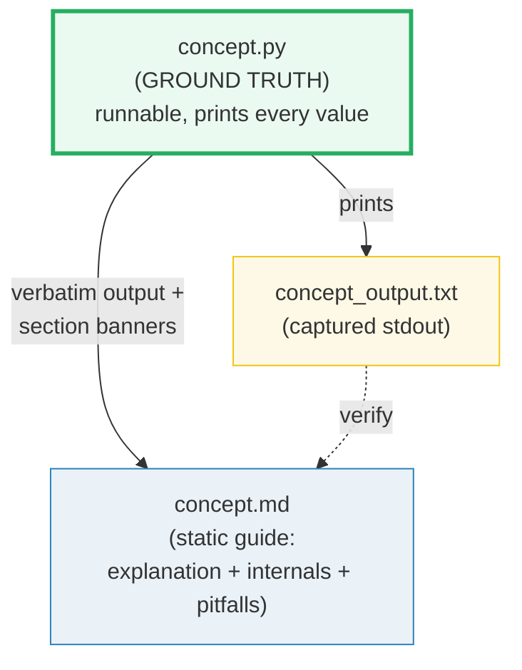
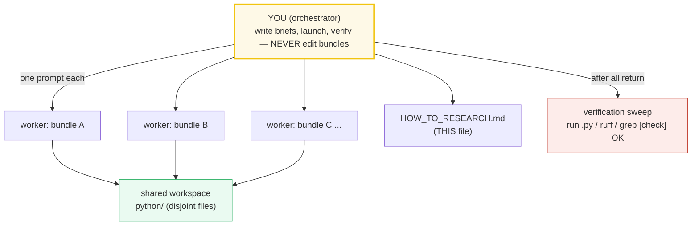
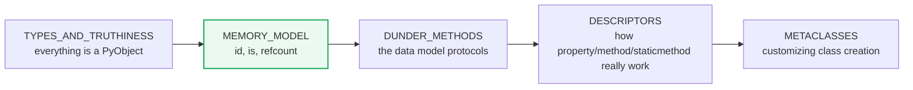

# HOW_TO_RESEARCH — The "Concept-as-a-Bundle" Workflow (Python)

> A note from past-me to future-me: **how this `python/` folder is organized,
> why, and how to extend it.** Each concept is a small, runnable `.py` whose
> output is pasted verbatim into a `.md` guide. Nothing is hand-waved; every
> claim is reproducible.
>
> **The north-star goal:** a reader who walks every bundle start-to-finish
> becomes a **Python expert** — fluent in the data model, the CPython internals,
> concurrency tradeoffs, the toolchain, and the AI libraries built on top.
>
> **The golden rule of building:** you (the orchestrator) **never write or edit a
> bundle file by hand.** Every bundle is produced by a **subagent** (one worker
> per bundle). Your job is to write tight worker briefs, launch them in parallel,
> and run the verification sweep. This is the `../llm/` delegation discipline,
> applied here with the manual escape hatch removed.
>
> Sister folder: [`../llm/`](../llm/) — the same ground-truth discipline applied
> to LLM *systems* concepts (29 bundles). This folder applies it to the **Python
> language and its AI toolchain** (PyTorch, LangChain, FastAPI, FastMCP).

---

## 0. The one rule (of a bundle)

> **Every concept is a `.py` + `.md` pair that cite each other, all deriving from
> ONE runnable `.py`. Nothing is hand-computed.**

If a claim, value, or output appears in a `.md`, it was printed by the `.py` (or
recomputed with the identical logic). This is the discipline that keeps the
guides trustworthy as they scale to 50+ topics.



There is **no `.html`** in this folder (unlike `../llm/`). The runnable `.py`
*is* the interactive artifact — a reader opens it, runs it, edits it, and watches
the output change. This keeps the surface area small and the focus on code.

---

## 1. The directory layout

```
python/
├── HOW_TO_RESEARCH.md          ← you are here (meta-workflow)
├── TODO.md                     ← the phase-by-phase build checklist (all bundles)
├── pyproject.toml              ← uv env (ruff, mypy, pytest + phase-specific deps)
│
├── types_and_truthiness.py         ← ground-truth impl   ─┐
├── types_and_truthiness_output.txt ← captured stdout       │ one concept bundle
├── TYPES_AND_TRUTHINESS.md         ← static guide          ─┘
│
├── strings_and_bytes.py  ─┐
├── STRINGS_AND_BYTES.md   │  another bundle (cross-referenced 🔗)
└── ...                    ─┘
```

A **concept bundle** = `{name}.py` + `{NAME}.md` (+ the committed
`{name}_output.txt`).

**Naming convention** (matches `../llm/`):
- `.py` / `_output.txt` → `lower_snake_case` (e.g. `asyncio_basics.py`).
- `.md` → `UPPER_SNAKE_CASE` (e.g. `ASYNCIO_BASICS.md`).
- One stem per concept; the three files share it so cross-links are obvious.

---

## 2. The three roles of each file

| File | Role | Hard rules |
|---|---|---|
| **`name.py`** | Ground truth. Clean, runnable, **self-contained** reference that prints every value the `.md` needs, behind a section banner. | Single source of truth. Run via `uv run python name.py`. Each teachable point gets its own `section_*()` printing a banner + a readable block. Use **tiny but complete** examples so every line is printable while every behavior shows up. Deterministic inputs only. Add `[check] ... OK` asserts for invariants. |
| **`{NAME}.md`** | Static, rigorous guide. Mermaid diagrams + **verbatim** output pasted from the `.py`. | Every output block sits under a `> From name.py Section X:` callout — no orphan numbers. Explains **what**, **why** (internals), and the **expert-level gotchas**. Cross-refs to siblings marked 🔗. Ends with a pitfalls table + cheat sheet. |
| **`name_output.txt`** | Captured stdout. Committed so the `.md` can be re-derived/audited without running. | `uv run python name.py > name_output.txt 2>/dev/null`. Diff it against the `.md` callouts to audit any value. |

---

## 3. The "expert depth" requirement

A junior tutorial stops at "here's how you write a list comprehension." This
folder's bar is higher. **Every `.md` a worker produces must answer three layers:**

1. **What** — the syntax / API and a runnable worked example (the `.py`).
2. **Why** — the mechanism beneath it. For Python this usually means: the **data
   model** (dunder protocols), the **object/memory model** (refcounting, the
   `PyObject*` view, `id()`/`is`), the **CPython execution model** (frames,
   bytecode, the eval loop), or the **concurrency model** (GIL, event loop).
3. **Gotchas that separate juniors from experts** — the silent-bug traps: mutable
   defaults, late-binding closures, `is` vs `==`, integer caching, generator
   exhaustion, `__init_subclass__` ordering, GIL-vs-async mismatches, etc.

The **pitfalls table** at the end of each `.md` is non-negotiable — it is the
"expert payoff." If a worker ships a `.md` with no pitfalls table, re-spawn it.

---

## 4. The golden rule: orchestrator + workers (you never edit by hand)



- **You (the orchestrator) do NOT write bundle code.** You: (a) fill in the worker
  prompt template (§5) with a per-concept brief, (b) launch workers **in
  parallel** — one `Task` call per bundle, all in one message, (c) run the
  verification sweep (§8), (d) re-spawn any worker that failed verification.
- **Each worker owns exactly ONE bundle** (its `.py` + `_output.txt` + `.md`) and
  is told to follow this guide to the letter. It is forbidden from touching any
  other bundle's files (and from editing `pyproject.toml` / `HOW_TO_RESEARCH.md`
  / `TODO.md`).
- **The workspace is shared** (`python/`), but file ownership is disjoint, so
  parallel writes are safe.
- **No "just do it by hand" exception.** Even a single bundle goes through a
  worker. Fresh context per bundle is the whole point — bundle #9 stays as
  rigorous as bundle #1 because no single context has to hold all of them.

> Why no manual path? When you build many bundles in one session, context fills
> up, quality drifts, and later bundles get sloppy. A worker gets a *fresh*
> context every time. Your judgment lives in the 5-minute brief, not the
> 50-minute hand-write.

---

## 5. The standard worker prompt (copy this, fill the blanks)

Every worker gets this preamble verbatim, then a per-concept "brief". This is the
single most important artifact in this guide — get it right and the bundles come
back uniform.

```text
You are building ONE "concept bundle" for the Python learning repo. Work
ENTIRELY inside /Volumes/data/workspace/tutorials/python/. Do NOT touch any
file that is not part of your assigned bundle, and do NOT edit pyproject.toml,
HOW_TO_RESEARCH.md, or TODO.md.

=== STEP 0: ABSORB THE WORKFLOW (mandatory, do first, in order) ===
1. Read /Volumes/data/workspace/tutorials/python/HOW_TO_RESEARCH.md IN FULL.
   It is the law: the bundle = {name}.py (ground truth) +
   {name}_output.txt (captured stdout) + {NAME}.md (guide). There is NO .html.
2. Study the canonical model bundle(s) and COPY THEIR STYLE EXACTLY:
   {MODEL_BUNDLES}   # e.g. python/types_and_truthiness.py + .md (Phase 1 onward)
   Match: the banner/section_*() print structure of the .py; the
   "> From {name}.py Section X:" verbatim callouts + mermaid + pitfalls table +
   cheat sheet in the .md; the three-layer depth (what / why-internals / gotchas).

=== STEP 1: MINE THE AUTHORITATIVE SOURCE ===
Read these and quote real code/API/signatures, not paraphrases:
{CITE_SOURCES}   # e.g. "CPython docs Data model §3.3; PEP 484; functools source"

=== STEP 2: FACT-CHECK VIA WEB SEARCH (mandatory, do NOT skip) ===
For every signature, version, PEP number, and behavioral claim: web-search the
official docs (docs.python.org, peps.python.org) or the library docs, and ≥1
other authoritative source. Verify the EXACT behavior in ≥2 places. Record every
URL in a "## Sources" section at the bottom of {NAME}.md.
NEVER guess a signature or a number. If you cannot verify a fact, search until
you can, or flag it explicitly in your final report. Start your searches at:
{WEB_ANCHORS}

=== HARD RULES ===
- NEVER hand-compute. The .py prints every value. The .md pastes values verbatim
  under "> From {name}.py Section X:" callouts.
- Stdlib-first. Use ONLY the dependencies already in pyproject.toml for this
  phase. Do NOT add any dependency or edit pyproject.toml/uv.lock.
- Deterministic inputs only (hardcoded values / seeded RNG / temperature=0 for
  LLM calls). Output must be byte-reproducible on re-run.
- Tiny-but-complete examples so every value prints while every behavior shows.
- Three-layer depth: the .md MUST cover what + why (internals) + expert gotchas,
  and MUST end with a pitfalls table + a one-line cheat sheet.
- Offline/mockable for AI phases: prefer a stub/fake (e.g. a fake chat model,
  in-memory vector store) so the bundle runs with no network or API key. If a
  live key is genuinely required, say so loudly in the .md header.

=== DELIVERABLES (exact paths) ===
- /Volumes/data/workspace/tutorials/python/{name}.py
- /Volumes/data/workspace/tutorials/python/{name}_output.txt
    (produce via: uv run python {name}.py > {name}_output.txt 2>/dev/null)
- /Volumes/data/workspace/tutorials/python/{NAME}.md

{NAME}.md MUST contain: the lineage old→new with WHY each step happened; mermaid
diagrams; "> From {name}.py Section X:" verbatim output blocks; a worked
smallest-scale example; a pitfalls table; a cheat sheet; 🔗 cross-references to
sibling bundles; and a "## Sources" section (URLs).

=== VERIFICATION (do ALL of these, then report) ===
1. `uv run python {name}.py` runs clean; every `[check] ... OK` passes.
2. {name}_output.txt captured and non-empty, and its values match the .md callouts.
3. `ruff check {name}.py` is clean. `mypy {name}.py` for type-system bundles.

=== REPORT BACK (your final message) ===
- The 3 file paths created.
- Check result: how many `[check] ... OK` printed.
- Web sources used (list URLs).
- Any fact you could NOT verify (do not hide uncertainty).

=== YOUR CONCEPT BRIEF ===
Bundle name: {name} / {NAME}
Phase: {PHASE_N}
Lineage (old → new): {LINEAGE}
Anchor concepts/signatures (verify on web, implement in the .py, assert):
  {ANCHOR_CONCEPTS}
Suggested .py sections: {SECTION_LIST}
Suggested mermaid in .md: {MERMAID_IDEAS}
A concrete value the .py must print (pin it so you can sanity-check):
  {PINNED_VALUE_OR_HOW_TO_DERIVE_IT}
```

The `{BLANK}` fields are the only thing that changes between workers. Everything
else is constant — that's what keeps the bundles uniform.

> **Bootstrap note (Phase 1 only):** the very first bundle has no model to copy.
  Give it a richer brief (spell out the banner style, the callout format, the
  pitfalls-table columns), then designate it the style anchor for all later
  workers by putting its path in `{MODEL_BUNDLES}`.

---

## 6. Filling the brief — the per-concept fields

For each concept you delegate, you (orchestrator) fill in:

| Field | What to put |
|---|---|
| `{MODEL_BUNDLES}` | 1–2 already-shipped bundles to copy style from (Phase 1's first bundle onward). |
| `{CITE_SOURCES}` | Real docs refs: `docs.python.org/3/...`, `peps.python.org/pep-XXXX`, library docs section. |
| `{WEB_ANCHORS}` | Official doc URL + a search phrase, e.g. "PEP 484 typing; data model docs.python.org/3/reference/datamodel.html". |
| `{ANCHOR_CONCEPTS}` | The exact behaviors/signatures to verify & assert, e.g. "`is` returns `True` only for same `id()`; small-int cache is `[-5, 256]`". |
| `{SECTION_LIST}` | Suggested teachable points (A: the basic API, B: internals, C: worked example, D: contrast/gotcha). |
| `{PINNED_VALUE}` | A concrete output the .py must print, so the worker (and you) can sanity-check. |

**Rule of thumb:** spend 5 minutes on the brief. A lazy brief → a lazy bundle.
The brief is where your judgment as orchestrator actually lives.

---

## 7. Coordination rules (keep the swarm safe)

1. **Disjoint file ownership.** Each worker writes only its 3 files. State the
   exact paths in the prompt and forbid edits elsewhere. This makes parallel
   writes safe in the shared `python/` dir.
2. **No dependency edits.** `pyproject.toml` / `uv.lock` are read-only to workers.
   If a worker "needs" another lib, it must implement from scratch (more
   educational anyway) — or you add the dep between batches.
3. **Launch in parallel.** Send all worker `Task` calls in ONE message.
   Independent file ownership = safe concurrency = max throughput.
4. **One concept per worker.** Never let a worker build two bundles — context
   splits and both degrade. A huge concept is still one worker with a richer brief.

---

## 8. The verification sweep (do this after ALL workers return)

Workers self-verify, but you independently re-check the whole batch. Run this
sweep; it catches silent failures (a worker that reported OK but shipped a bug):

```bash
cd /Volumes/data/workspace/tutorials/python
for name in {BUNDLE_STEMS_FOR_THIS_BATCH}; do
  echo "===== $name ====="
  uv run python $name.py > /tmp/$name.out 2>/tmp/$name.err \
    && echo "  py: ran" || { echo "  py: FAILED"; cat /tmp/$name.err; }
  grep -c "\[check\]" /tmp/$name.out | xargs -I{} echo "  checks printed: {}"
  ruff check $name.py >/dev/null 2>&1 && echo "  ruff: OK" || echo "  ruff: FAIL"
  test -s "${name}_output.txt" && echo "  output.txt: present" || echo "  output.txt: MISSING"
done
```

Then spot-check: open 2–3 `.md` files, confirm a couple of `> From ... Section X:`
callouts match the corresponding `_output.txt` values byte-for-byte.

**Re-spawn failures.** Any bundle that fails the sweep: re-launch ONE worker for
just that bundle, paste its prior output + the failing check as context, and ask
it to fix only the failure. Don't rewrite from scratch unless the whole bundle is
wrong.

---

## 9. Cross-referencing conventions

The whole point is **contrast to build understanding**. Tell workers to be explicit:

- 🔗 marker in a `.md` = a cross-reference to a related bundle.
- Always state *why* the link matters in one line, e.g.
  "🔗 [MEMORY_MODEL](./MEMORY_MODEL.md) — `is` vs `==` only makes sense once you
  see that a variable is a *label on* a `PyObject`, not a box holding a value."

Example spine used across the object-model phase:



---

## 10. Tooling & environment

- **`uv`** manages the env. Run everything with `uv run python <file>`. No manual
  venv activation.
- **`ruff`** is the linter/formatter (`ruff check --fix`).
- **`mypy`** type-checks the type-system bundles.
- **`pytest`** powers the testing/tooling bundle and any fixture-based checks.
- **Phase-specific deps** are gated by phase so early phases don't need the heavy
  AI stack:
  - Phase 1–4: stdlib + `ruff`/`mypy`/`pytest` (optionally `numpy`, `cython`).
  - Phase 5: `torch`.
  - Phase 6: `langchain`, `langgraph`, an API key for an LLM provider.
  - Phase 7: `fastapi`, `uvicorn`, `httpx`.
  - Phase 8: `fastmcp` (and reuses FastAPI).

> For the AI phases (5–8), prefer **offline/mockable** examples in the `.py`
> where possible (fake embeddings, a stub chat model) so the bundle runs without
> network or API keys. Mark any bundle that genuinely needs a live key clearly in
> its `.md` header.

---

## 11. Common failure modes (and the fix)

| Worker symptom | Cause | Fix |
|---|---|---|
| `py: FAILED` | exception / wrong API | re-spawn with the correct `{ANCHOR_CONCEPTS}` + exact signature |
| `[check]` count is 0 | worker skipped asserts | re-spawn, emphasize "add `[check] ... OK` for every invariant" |
| `ruff: FAIL` | style/import issues | re-spawn with `ruff check --fix` in the verify step |
| Numbers in `.md` don't match `_output.txt` | worker hand-typed | re-spawn, emphasize "paste verbatim under callouts" |
| No `## Sources` | worker skipped web search | re-spawn, make Step 2 non-optional |
| No pitfalls table | worker wrote a junior tutorial | re-spawn, cite §3 (the "expert payoff") |
| Worker edited another bundle's file | brief was loose | restore from git; tighten the "do NOT touch" clause |

---

## 12. The batch-run checklist (orchestrator's pre-flight)

Before launching a swarm:
- [ ] `pyproject.toml` has the phase's deps; `uv run python -c "import <dep>"` works.
- [ ] Each worker's 3 file paths are disjoint from every other worker's.
- [ ] Each brief has `{CITE_SOURCES}`, `{WEB_ANCHORS}`, `{ANCHOR_CONCEPTS}`.
- [ ] Each brief has a concrete `{PINNED_VALUE}` (or a way to derive it).
- [ ] For Phase 1, the first bundle is designated the style anchor.
- [ ] You have the verification sweep script ready (§8).

After the swarm returns:
- [ ] Verification sweep green for all bundles.
- [ ] Spot-checked 2–3 `.md` callouts against `_output.txt`.
- [ ] Re-spawned any failures.
- [ ] Ticked the boxes in [`TODO.md`](./TODO.md).

---

## 13. Why this produces experts (not just users)

- **The `.py` makes it falsifiable.** Anyone can re-run and see the exact output —
  including the internals (`id()`, `dis.dis()`, `gc.get_referrers()`). No
  hand-waving over "trust me, that's how the GIL works."
- **The three-layer depth rule** forces every concept past syntax into mechanism
  and into the traps that working engineers actually hit.
- **Subagent delegation keeps depth uniform** — bundle #50 is as deep as #1
  because each gets fresh context and the same constant preamble.
- **Cross-references force the big picture.** Linking `is`-vs-`==` to the refcount
  model, and the refcount model to the GIL, and the GIL to asyncio — that chain
  *is* Python expertise.

---

## 14. Where to start

Open [`TODO.md`](./TODO.md) for the full phase-by-phase build plan (54 bundles,
8 phases). Then launch the **Phase 1 swarm** (one worker per bundle, all in one
message), designating `types_and_truthiness` as the style anchor.
