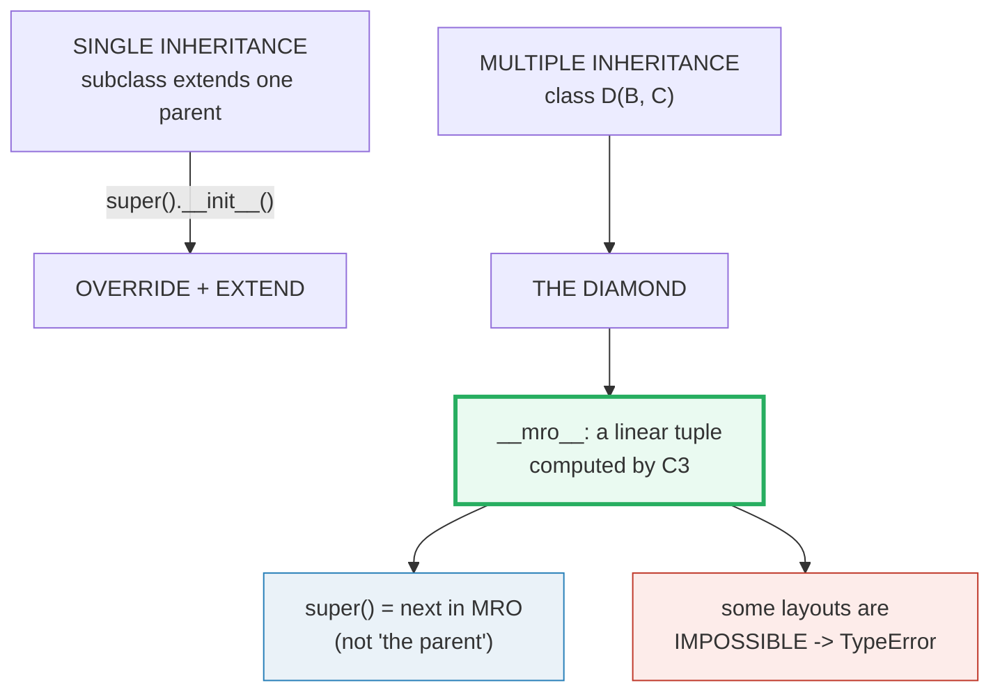
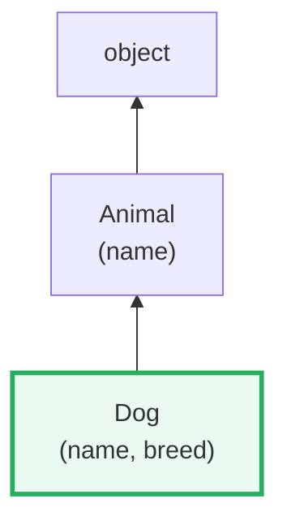
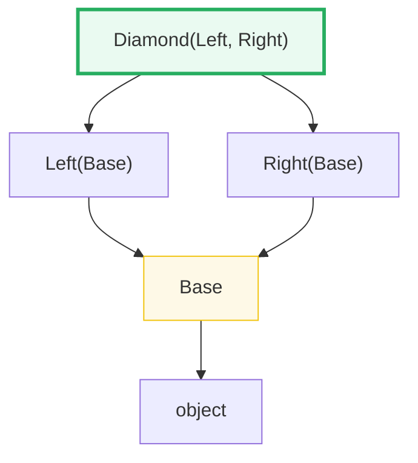
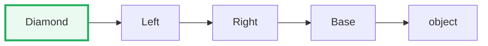
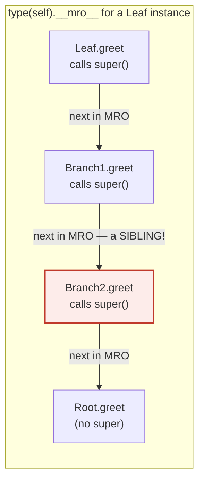

# Inheritance & MRO — Single, Multiple, Diamonds, and the C3 Linearization

> **The one rule:** Python resolves every attribute lookup — method or
> otherwise — against a **single linear list** called the **MRO** (Method
> Resolution Order). `super()` doesn't mean "parent"; it means **"the next
> class after me in the instance's MRO."** The MRO is computed by a
> deterministic algorithm called **C3 linearization**, and some class layouts
> are **structurally impossible** — C3 detects the contradiction and raises
> `TypeError` before the class is even created.

**Companion code:** [`inheritance_mro.py`](./inheritance_mro.py).
**Every MRO tuple, call order, and worked example below is printed by
`uv run python inheritance_mro.py`** — change the code, re-run, re-paste.
Nothing here is hand-computed. Captured stdout lives in
[`inheritance_mro_output.txt`](./inheritance_mro_output.txt).

**Goal of this bundle (lineage, old → new):**

> from *"I know a subclass extends a parent"*
> → *"I understand single + multiple inheritance, how `super()` walks the MRO,
> > the C3 linearization that computes it, and why some diamond layouts are
> > impossible."*

🔗 Builds on the object model from
[`TYPES_AND_TRUTHINESS`](./TYPES_AND_TRUTHINESS.md) (every value is a
`PyObject` with a `type`) and the method-lookup mechanics introduced in
[`FUNCTIONS_ARGS_SCOPE`](./FUNCTIONS_ARGS_SCOPE.md) (how `def` binds to
objects). `super()` itself is a **proxy object** built on the descriptor
protocol — full coverage in [`DESCRIPTORS`](./DESCRIPTORS.md) (P2 #12). The
`__mro__` tuple is frozen at **class creation time** by `type.__new__`, which
you can customize with [`METACLASSES`](./METACLASSES.md) (P2 #13). For the
*structural* alternative to `isinstance` — duck-typing via `Protocol` — see
[`TYPE_HINTS`](./TYPE_HINTS.md) (P3 #18).

---

## 0. The five ideas on one page



| Concept | What it means | Key API |
|---|---|---|
| **MRO** | The linear order in which Python searches classes for an attribute. | `cls.__mro__`, `cls.mro()` |
| **`super()`** | A proxy that looks up the attribute starting at the **next class** after the current one in `type(self).__mro__`. | `super()`, `super(Cls, self)` |
| **C3 linearization** | The algorithm that computes the MRO. Deterministic; either succeeds or raises `TypeError`. | set automatically at `class` body execution |
| **Cooperative MI** | Every class in the chain calls `super()`, so the call spreads across the whole diamond. | `super().method()` in every layer |
| **Mixin** | A small class designed to be combined via multiple inheritance; calls `super()` and wraps the result. | `class Foo(MixinA, Base): ...` |

---

## 1. Single inheritance: override + `super().__init__()`

The simplest case: a subclass extends **one** parent. It can override methods
(`speak` below) and add new attributes (`breed`). `super().__init__(...)`
delegates to the parent's constructor so the parent sets up its state before
the child adds its own — without `super()`, the parent's `__init__` would
never run and `self.name` would be missing.



> From `inheritance_mro.py` Section A:
> ```
> ======================================================================
> SECTION A — Single inheritance: override + super().__init__()
> ======================================================================
> A subclass extends ONE parent. It may override methods and add new
> attributes. super().__init__(...) delegates to the parent so the
> parent's state is set up before the child adds its own.
> 
> dog = Dog('Rex', 'Husky')
>   dog.name   = 'Rex'   (set by Animal.__init__ via super)
>   dog.breed  = 'Husky'  (set by Dog.__init__)
>   dog.speak()= Rex the Husky barks: Woof!
>   Dog.__mro__= (Dog, Animal, object)
> 
> [check] super().__init__ set .name from the parent: OK
> [check] the child set .breed itself: OK
> [check] the override replaced speak(): OK
> ```

### Why `Dog.__mro__` is `(Dog, Animal, object)` (internals)

The C3 formula for single inheritance is trivial:
`L(Dog) = [Dog] + merge(L(Animal), [Animal]) = [Dog] + merge([Animal, object], [Animal])`.
`merge` takes `Animal` (a valid head — not in any tail), then `object`.
Result: `(Dog, Animal, object)`. Attribute lookup walks this list left to
right: `dog.speak` finds `Dog.speak` first (the override); if it didn't exist
it would fall through to `Animal.speak`, then `object` (which has no
`speak` → `AttributeError`).

🔗 `super()` returns a **proxy object** that stores the MRO starting position
internally. How that proxy is implemented — as a descriptor with `__get__` —
is covered in [`DESCRIPTORS`](./DESCRIPTORS.md) (P2 #12).

---

## 2. `isinstance` / `issubclass` honor the full MRO

`isinstance(obj, cls)` is `True` if and only if `cls` appears in
`type(obj).__mro__`. `issubclass(sub, sup)` is `True` if and only if `sup`
appears in `sub.__mro__`. Both walk the **entire** chain — `isinstance(dog,
object)` is `True` because `object` is the last element of every MRO. The
converse is not guaranteed: `issubclass(Animal, Dog)` is `False` because
`Dog` is not in `Animal.__mro__`.

> From `inheritance_mro.py` Section B:
> ```
> ======================================================================
> SECTION B — isinstance / issubclass walk the full MRO chain
> ======================================================================
> isinstance(obj, cls) is True if cls is in type(obj).__mro__.
> issubclass(sub, sup) is True if sup is in sub.__mro__. Both walk
> the ENTIRE chain, not just the direct parent.
> 
> expression                    result
> ------------------------------------------
> isinstance(dog, Dog)          True
> isinstance(dog, Animal)       True
> isinstance(dog, object)       True
> issubclass(Dog, Animal)       True
> issubclass(Dog, object)       True
> issubclass(Animal, Dog)       False
> 
> [check] isinstance(dog, Animal) (chain up): OK
> [check] isinstance(dog, object) (everything is object): OK
> [check] issubclass(Dog, object): OK
> [check] issubclass(Animal, Dog) is False: OK
> ```

### Why `isinstance` is MRO-based, not `type()`-based (internals)

A beginner might write `type(dog) is Animal` to test "is this an Animal?" —
and it would return `False` for a `Dog`, because `type(dog)` is `Dog`, not
`Animal`. `isinstance` is the correct test because it checks **membership in
the MRO**, not exact-type equality. This is the Liskov substitution principle
enforced at runtime: a `Dog` **is** an `Animal`, so any code that expects an
`Animal` should accept a `Dog`.

🔗 For *structural* typing (duck-typing checked by mypy, not at runtime), see
`typing.Protocol` in [`TYPE_HINTS`](./TYPE_HINTS.md) (P3 #18). A `Protocol`
checks the *shape* of an object, not its MRO — the two models are orthogonal.

---

## 3. Multiple inheritance: the diamond and `__mro__`

When a class inherits from **two** parents that share a common ancestor, you
get a **diamond**. The question is: in what order does Python search? The
answer is the **MRO**, computed by C3. For `class Diamond(Left, Right)` where
both inherit `Base`, the MRO is `(Diamond, Left, Right, Base, object)` —
**left-to-right, depth-first, no duplication**.



The linearized MRO beside the diamond:



`Base` appears **once** — C3 guarantees that each class in the MRO is unique.
`Diamond().whoami()` returns `'Left'` because `Left` is searched before
`Right`.

> From `inheritance_mro.py` Section C:
> ```
> ======================================================================
> SECTION C — Multiple inheritance: the diamond and __mro__
> ======================================================================
> class Base; class Left(Base); class Right(Base);
> class Diamond(Left, Right) — the classic diamond shape.  Method
> lookup follows Diamond.__mro__, computed by C3.  Left is listed
> before Right, so Diamond().whoami() finds Left first.
> 
> Diamond.__mro__    = (Diamond, Left, Right, Base, object)
> Diamond().whoami() = 'Left'
> 
> [check] Diamond.__mro__ == (Diamond, Left, Right, Base, object): OK
> [check] whoami() resolves to Left (leftmost parent wins): OK
> [check] Base appears exactly once (no duplication in MRO): OK
> [check] object is the last element of every MRO: OK
> ```

### Why `Base` appears only once (internals)

Before Python 2.3, the MRO was **depth-first, left-to-right** (DLR), which
for a diamond gave `(Diamond, Left, Base, Right, Base, object)` — `Base`
appeared **twice**. This caused subtle bugs: `Base.__init__` could be called
twice, and the order violated the local precedence of `Right` (which should
be consulted before `Base`). C3 linearization (adopted in 2.3, see
[the C3 paper](https://www.python.org/download/releases/2.3/mro/)) fixes this
by **monotonicity**: if class `A` precedes class `B` in any parent's
linearization, then `A` precedes `B` in the child's linearization. The
result is a total order with no duplicates.

🔗 `__mro__` is an **immutable tuple** set once by `type.__new__` at class
creation time. You can customize this process (intercept `__mro__`
computation) with a metaclass — see [`METACLASSES`](./METACLASSES.md) (P2 #13).

---

## 4. `super()` walks the INSTANCE's class MRO (the cooperative insight)

This is the single most misunderstood feature in Python's object model.
**`super()` does not mean "the parent class." It means "the next class after
the current one in `type(self).__mro__`."** In a diamond, that "next class"
can be a **sibling**, not a parent.

Consider four classes forming a diamond. Each `greet()` prepends its own name
and calls `super().greet()`:



When `Leaf().greet()` runs, the call chain is `Leaf → Branch1 → Branch2 →
Root`. The critical moment: inside `Branch1.greet`, `super().greet()` does
**not** go to `Root` (Branch1's parent) — it goes to `Branch2` (the next
class in **the instance's** MRO, which is `Leaf.__mro__`). But if you call
`Branch1().greet()` directly (instance of `Branch1`, not `Leaf`), the same
`super()` call **does** go to `Root` — because `Branch1.__mro__` is just
`(Branch1, Root, object)`.

**Same code, different behavior** — depending entirely on the instance's
class.

> From `inheritance_mro.py` Section D:
> ```
> ======================================================================
> SECTION D — super() walks the INSTANCE's class MRO (cooperative)
> ======================================================================
> super() does NOT mean 'the parent class'. It means 'the NEXT class
> after the current one in type(self).__mro__'.  In a diamond this
> can be a SIBLING, not a parent.  Each level calls super() so every
> class in the chain gets a turn (cooperative multiple inheritance).
> 
> Leaf.__mro__    = (Leaf, Branch1, Branch2, Root, object)
> Branch1.__mro__ = (Branch1, Root, object)
> 
> Leaf().greet()    = ['Leaf.greet', 'Branch1.greet', 'Branch2.greet', 'Root.greet']
>   ^ Branch1.greet's super() skips to Branch2 (sibling!), not Root
> Branch1().greet() = ['Branch1.greet', 'Root.greet']
>   ^ Branch1.greet's super() goes to Root (parent) — same code!
> 
> [check] Leaf().greet() visits all four classes: OK
> [check] Branch1().greet() skips Branch2 (not in Branch1.__mro__): OK
> [check] Branch1's super() is Branch2 for a Leaf instance: OK
> [check] Branch1's super() is Root for a Branch1 instance: OK
> ```

### Why this design exists (internals)

When you write `super()` inside a method, Python's compiler turns it into
`super(__class__, <first_arg>)` (PEP 3135). The `super` proxy then looks up
the attribute by searching `type(self).__mro__` starting from the index
**after** `__class__`. Two consequences:

1. **The search uses the instance's class, not the defining class.** That's
   why `Branch1.greet`'s `super()` finds `Branch2` for a `Leaf` instance but
   `Root` for a `Branch1` instance.
2. **Cooperative MI requires every class to call `super()`.** If `Branch1`
   skipped `super().greet()`, then `Branch2.greet` and `Root.greet` would
   never run — the chain breaks. This is why cooperative multiple inheritance
   (the `super()` in every layer pattern) is mandatory for mixins to compose
   correctly (§6).

🔗 `super()` returns a built-in proxy type (`<class 'super'>`) whose
attribute access is driven by `__getattribute__`. That proxy itself uses the
descriptor protocol — explored fully in
[`DESCRIPTORS`](./DESCRIPTORS.md) (P2 #12).

---

## 5. C3 linearization: the merge algorithm + impossible layouts

The MRO is not arbitrary — it is computed by a precise algorithm called
**C3 linearization** (adopted in Python 2.3). The formula:

```
L(C) = [C] + merge(L(P1), L(P2), ..., L(Pn), [P1, P2, ..., Pn])
```

where `P1..Pn` are the direct parents in declaration order. The `merge`
works like this:

1. Look at the **head** (first element) of each input list.
2. Find a head that does **not** appear in the **tail** (all elements after
   the first) of *any* input list.
3. Move that head to the output; remove it from all lists.
4. Repeat until all lists are empty.
5. **If every head is blocked** (each appears in some other list's tail), the
   merge **fails** → `TypeError`.

The `.py` implements this algorithm from scratch (`_c3_merge`) and prints
each step so you can watch it work:

> From `inheritance_mro.py` Section E:
> ```
> ======================================================================
> SECTION E — C3 linearization: merge algorithm + impossible layout
> ======================================================================
> C3 formula:  L(C) = [C] + merge(L(P1), ..., L(Pn), [P1, ..., Pn])
> Merge rule:  repeatedly take the first HEAD that is not in any TAIL
>              of the input lists.  If every head is blocked, no MRO
>              exists and Python raises TypeError at class creation.
> 
> Worked example — recompute Diamond.__mro__ from scratch:
>     L(Left)       = (Left, Base, object)
>     L(Right)      = (Right, Base, object)
>     [Left, Right] (parent order)
>   merge steps:
>   take Left       -> ['Left']
>   take Right      -> ['Left', 'Right']
>   take Base       -> ['Left', 'Right', 'Base']
>   take object     -> ['Left', 'Right', 'Base', 'object']
> 
>   _c3_merge result = ['Diamond', 'Left', 'Right', 'Base', 'object']
>   Diamond.__mro__  = (Diamond, Left, Right, Base, object)
> 
> [check] our _c3_merge matches Diamond.__mro__: OK
> Impossible layout — IX(IA, IB) and IY(IB, IA) contradict:
>   IX.__mro__ = (IX, IA, IB, object)   # demands IA before IB
>   IY.__mro__ = (IY, IB, IA, object)   # demands IB before IA
>   class IZ(IX, IY) -> both orderings -> deadlock.
> 
>   take IX         -> ['IX']
>   take IY         -> ['IX', 'IY']
>   _c3_merge raises: Cannot create a consistent method resolution order (MRO)
>   Python raises:    Cannot create a consistent method resolution order (MRO) for bases IA, IB
> 
> [check] class IZ(IX, IY) raises TypeError (inconsistent MRO): OK
> ```

### Why `IZ(IX, IY)` is impossible (the deadlock, step by step)

After taking `IX` and `IY`, the remaining lists are `[IA, IB, object]` and
`[IB, IA, object]`:

- Try `IA` (head of list 1): `IA` is in the **tail** of list 2
  (`[IB,` **`IA`** `, object]`) → **blocked**.
- Try `IB` (head of list 2): `IB` is in the **tail** of list 1
  (`[IA,` **`IB`** `, object]`) → **blocked**.

Every head is blocked. `IX` says "IA before IB"; `IY` says "IB before IA."
A child of both demands a total order, but the two constraints are
contradictory. C3 detects this and Python raises `TypeError` **at class
creation time** — the `class` statement itself fails. The error message
reports the conflicting bases (`IA, IB`), not the direct parents (`IX, IY`),
because CPython's `mro_internal` in `typeobject.c` reports the bases at the
point where the merge deadlocks.

This is **not** a bug — it's C3 protecting you from a nonsensical hierarchy.
If you see this error, one of your base classes has the wrong parent order;
swap the bases or restructure the hierarchy.

🔗 The MRO is computed inside `type.__new__` during class creation. A
**metaclass** can override `__mro__` computation (rarely needed, but possible)
— see [`METACLASSES`](./METACLASSES.md) (P2 #13).

---

## 6. Mixins via cooperative `super()`

A **mixin** is a small class designed to be combined with others via multiple
inheritance. It typically doesn't stand alone — it calls `super().method()`
and **wraps** the result. The mixin sits between the concrete class and the
base in the MRO, slotting in transparently because `super()` finds whatever
is "next" in the chain.

> From `inheritance_mro.py` Section F:
> ```
> ======================================================================
> SECTION F — A mixin combined via cooperative super()
> ======================================================================
> A MIXIN is a small class designed to be combined with others. It
> rarely stands alone — it calls super() and wraps the result, so it
> slots into any MRO position seamlessly.
> 
> FancyGreeter.__mro__   = (FancyGreeter, UpperMixin, PlainGreeter, object)
> FancyGreeter().greet() = 'hello -> UPPER[HELLO]'
>   ^ UpperMixin.greet calls super().greet() -> PlainGreeter.greet
> 
> [check] FancyGreeter.__mro__ puts the mixin before the base: OK
> [check] the mixin wraps the base output: OK
> ```

### Why mixins must call `super()` (the cooperative contract)

The `UpperMixin` has **no** base of its own — it inherits from `object`
implicitly. Yet `super().greet()` inside `UpperMixin.greet` works because
`super()` doesn't look at `UpperMixin`'s parents; it looks at
`type(self).__mro__`. For a `FancyGreeter` instance, the MRO is
`(FancyGreeter, UpperMixin, PlainGreeter, object)`, so `super().greet()` from
`UpperMixin` resolves to `PlainGreeter.greet`. If `UpperMixin` called
`PlainGreeter.greet(self)` directly instead of `super().greet()`, it would
break when combined with a different base. The `super()` call makes the mixin
**base-agnostic** — it works with anything that provides `greet()`.

This is the **cooperative multiple inheritance contract**: every class
participating in a diamond must accept the same arguments (typically
`*args, **kwargs`) and call `super().__init__(...)` so the chain propagates.
Standard-library examples include `collections.UserDict`, the
`contextlib.AbstractContextManager` family, and the `logging.FilterMixIn`.

---

## Pitfalls

| Trap | Example | The fix |
|---|---|---|
| Forgetting `super().__init__()` in a subclass | `self.name` is missing → `AttributeError` | always call `super().__init__(...)` first, then add child state |
| Thinking `super()` means "parent" | `Branch1.greet`'s `super()` goes to `Branch2` (sibling) for a `Leaf` instance | remember: `super()` = **next in MRO**, which is instance-dependent |
| A mixin that calls the base directly | `UpperMixin` calls `PlainGreeter.greet(self)` → breaks with any other base | always use `super().method()` in mixins so they compose |
| Breaking the cooperative chain | one class skips `super()` → later classes in the MRO never run | every layer must call `super()` and pass through `*args, **kwargs` |
| Inconsistent MRO | `class IZ(IX(IA,IB), IY(IB,IA))` → `TypeError` at class creation | restructure: ensure all parents agree on the order of shared ancestors |
| Using `type(x) is Cls` instead of `isinstance` | `type(dog) is Animal` → `False` (misses subclasses) | use `isinstance(x, Cls)` — it checks the full MRO |
| Mismatched `__init__` signatures in a diamond | `B.__init__(self, x)` and `C.__init__(self, y, z)` → `super().__init__()` call breaks | standardize on `**kwargs` (or `*args`) and forward unknown kwargs |
| Assuming MRO is depth-first-left-to-right (old DLR) | expecting `(D, Left, Base, Right, Base, object)` | C3 is **monotonic** and **deduplicates** — each class appears once |
| Calling `super()` outside a method (no `__class__` cell) | `super()` in a standalone function → `RuntimeError` | `super()` only works inside methods (PEP 3135); use `super(Cls, self)` explicitly elsewhere |

---

## Cheat sheet

- **MRO:** `cls.__mro__` — the linear tuple Python searches for attributes.
  Computed by C3 at class creation. Each class appears **once**.
- **`super()`:** means **"next class after me in `type(self).__mro__`"** —
  not "parent." Instance-dependent: the same method's `super()` can resolve
  differently depending on the instance's class.
- **C3 formula:** `L(C) = [C] + merge(L(P1), ..., L(Pn), [P1, ..., Pn])`.
  Merge: take the first head not in any tail. If all heads are blocked →
  `TypeError`.
- **Diamond:** `class D(B, C)` where `B(A)` and `C(A)` → `D.__mro__ == (D,
  B, C, A, object)`. Leftmost parent wins; shared ancestor appears once.
- **Cooperative MI:** every layer calls `super()` and forwards `*args,
  **kwargs`. This is how mixins compose and how all classes in a diamond
  get a turn.
- **`isinstance` / `issubclass`:** check membership in the MRO, not exact
  type. `isinstance(dog, Animal)` → `True`; `type(dog) is Animal` → `False`.
- **Impossible MRO:** `class Z(X(A,B), Y(B,A))` → `TypeError` because the
  two parents demand contradictory orderings of `A` and `B`.

---

## Sources

- **Python docs — The Python Tutorial: Inheritance.**
  https://docs.python.org/3/tutorial/classes.html#inheritance
  *The canonical introduction to single/multiple inheritance, method
  override, `super()`, and `isinstance`. Defines the diamond problem and
  Python's resolution via the MRO. Referenced in §1–§4.*
- **Python docs — Data Model: `__mro__` and `mro()`.**
  https://docs.python.org/3/reference/datamodel.html
  *The `type.__mro__` attribute (an immutable tuple) and the `type.mro()`
  method (the C3-based computation). Quoted in §3 and §5.*
- **Python docs — `super()`.**
  https://docs.python.org/3/library/functions.html#super
  *The zero-argument `super()` form: "the search order is the same as that
  used by `getattr()` except that the type itself is skipped." Basis for §4.*
- **The Python 2.3 Method Resolution Order (C3 linearization paper).**
  https://www.python.org/download/releases/2.3/mro/
  *The original C3 paper by Michele Simionato and Samuele Pedroni. Derives
  the merge algorithm, proves monotonicity, and shows why inconsistent
  hierarchies raise `TypeError`. Primary source for §5.*
- **PEP 253 — Subclassing Built-in Types.**
  https://peps.python.org/pep-0253/
  *Explains the MRO in the context of new-style classes and why C3 replaced
  the old depth-first-left-to-right order. Referenced in §3.*
- **PEP 3135 — New Super (zero-argument `super()`).**
  https://peps.python.org/pep-3135/
  *How `super()` with no arguments works: the compiler inserts
  `super(__class__, <first_arg>)` via the `__class__` closure cell. Basis
  for the §4 internals note.*
- **Python docs — `isinstance` / `issubclass`.**
  https://docs.python.org/3/library/functions.html#isinstance
  *`isinstance(obj, classinfo)` — "True if the object is an instance or
  subclass of a class." Confirms MRO-based semantics in §2.*
- **C3 Linearization Algorithm in Python — GeeksforGeeks.**
  https://www.geeksforgeeks.org/python/c3-linearization-algorithm-in-python/
  *Independent worked example of the C3 merge on a complex hierarchy
  (F/G/H/Z), confirming the merge steps and the formula. Cross-checked in
  §5.*
- **Method Resolution Order and C3 linearization — pilosus.org.**
  https://blog.pilosus.org/posts/2019/05/02/python-mro/
  *A reference implementation of `_merge()` in pure Python with a step-by-step
  walkthrough. Cross-checked against our `_c3_merge` in §5.*
