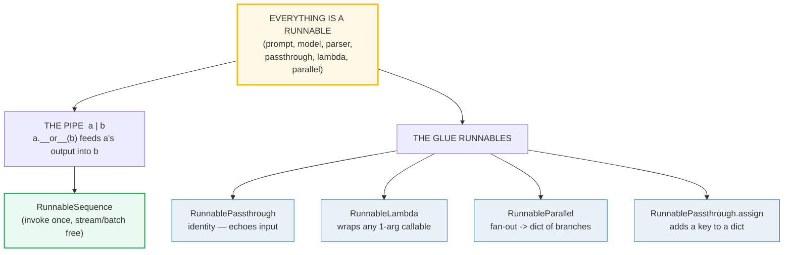
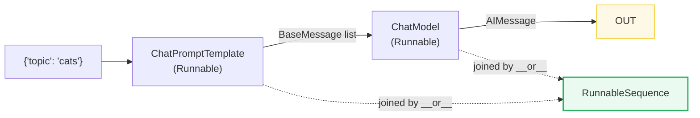
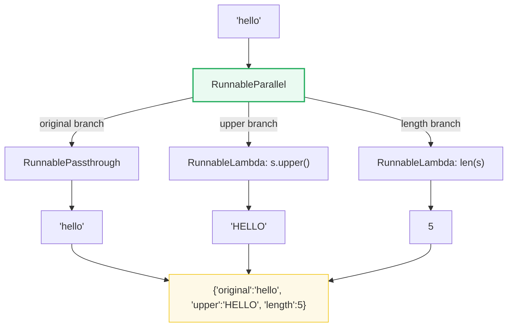
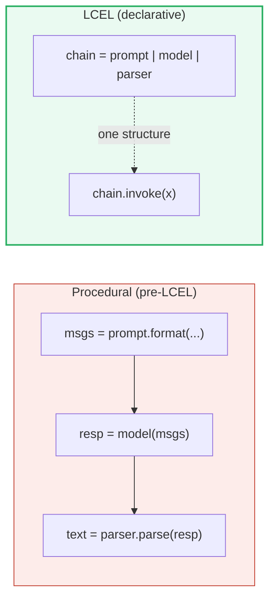

# LangChain Chains & LCEL — The Pipe, Runnables, and Declarative Composition

> **The one rule:** in the LangChain Expression Language (LCEL) **everything is
> a `Runnable`**, and you compose Runnables with the pipe `|`. So
> `prompt | model | parser` is *itself* a `RunnableSequence` that you `invoke`
> / `stream` / `batch` uniformly — no glue code, no subclasses, no manual
> state-passing. The pipe *is* the chain.

**Companion code:** [`lc_chains_lcel.py`](./lc_chains_lcel.py).
**Every number, type name, and table below is printed by `uv run python
lc_chains_lcel.py`** — change the code, re-run, re-paste. Nothing here is
hand-computed. Captured stdout lives in
[`lc_chains_lcel_output.txt`](./lc_chains_lcel_output.txt).

> **Offline / no API key.** The "model" in every section is a
> `FakeMessagesListChatModel` that returns canned `AIMessage` objects in order
> (cycling when exhausted). No network, no key, byte-reproducible. Real chat
> models slot in unchanged — `ChatOpenAI`, `ChatAnthropic`, … expose the same
> `Runnable` surface.

**Goal of this bundle (lineage, old → new):**

> from *"I write procedural glue code — call the prompt, pass the result to the
> model, then to the parser, by hand"*
> → *"LCEL is declarative composition with the pipe `|`: `prompt | model |
> parser` is a chain; `RunnablePassthrough` / `RunnableLambda` /
> `RunnableParallel` are the glue; every chain gets `invoke` / `stream` /
> `batch` for free."*

🔗 This is bundle **#38 of Phase 6**. It composes the two bundles just before
it: [`LC_PROMPTS`](./LC_PROMPTS.md) (#37 — `ChatPromptTemplate` is itself a
`Runnable`) and [`LC_MODELS_MESSAGES`](./LC_MODELS_MESSAGES.md) (#36 — a
`ChatModel` is a `Runnable` that emits `AIMessage`s). LCEL is the *reason* a
prompt and a model can be glued with one character. The bundle just ahead,
[`LC_RAG`](./LC_RAG.md) (#40), uses exactly the
`RunnablePassthrough.assign(...) | prompt | model | parser` shape from §7 to
build retrieval-augmented generation. Dynamic, tool-calling flows become
[`LC_TOOLS_AGENTS`](./LC_TOOLS_AGENTS.md) (#41); stateful, cyclic graphs that
LCEL cannot express become [`LC_LANGGRAPH`](./LC_LANGGRAPH.md) (#42). See
[`TODO.md`](./TODO.md) for the full plan.

---

## 0. The three ideas on one page



| Question | API | What it really does |
|---|---|---|
| "Chain two steps?" | `a \| b` | calls `a.__or__(b)` → returns a `RunnableSequence`. Run with `.invoke(x)`. |
| "Echo the input?" | `RunnablePassthrough()` | the identity Runnable — `invoke(x) == x`. |
| "Wrap my function?" | `RunnableLambda(fn)` | turns any 1-arg callable into a pipe-compatible Runnable. |
| "Fan out to branches?" | `RunnableParallel(a=..., b=...)` | runs each branch on the **same** input → returns a `dict`. |
| "Add a key to a dict?" | `RunnablePassthrough.assign(k=fn)` | merges `k` into the dict while keeping originals. |
| "Stream / batch?" | `chain.stream(x)` / `chain.batch([x, y])` | inherited by *every* chain — free, uniform. |

---

## 1. The pipe: `prompt | model` is a `RunnableSequence`

LCEL steals the Unix shell's `|`. In Python, `a | b` is the `__or__` dunder, so
LangChain implements `Runnable.__or__` to return a brand-new object — a
`RunnableSequence` — that holds the two steps. You then `invoke` the sequence
once; it feeds the first step's output into the second internally. The key
insight: **the pipe builds a structure; `invoke` runs it.** Nothing happens at
composition time except object creation.



Because the prompt formats `{topic}` and the model emits `AIMessage`s, the
output of `prompt | model` is an `AIMessage`. Note that *every* object involved
— prompt, model, and the chain itself — is an `isinstance(..., Runnable)`.
That uniform interface is the whole point of LCEL.

> From `lc_chains_lcel.py` Section A:
> ```
> ======================================================================
> SECTION A — The pipe: prompt | model is a RunnableSequence
> ======================================================================
> In LCEL the `|` operator (Python's __or__ dunder) feeds the output of
> the left Runnable into the right Runnable. `prompt | model` returns a
> brand-new object — a RunnableSequence — that you invoke once. The
> output here is an AIMessage (because the model emits AIMessages).
> 
> expression                                    value
> ------------------------------------------------------------------------
> type(prompt).__name__                         ChatPromptTemplate
> type(model).__name__                          FakeMessagesListChatModel
> type(prompt | model).__name__                 RunnableSequence
> isinstance(prompt, Runnable)                  True
> isinstance(model, Runnable)                   True
> isinstance(chain, Runnable)                   True
> 
> chain.invoke({'topic': 'cats'}) ->
>   type  : AIMessage
>   content: 'Cats are small carnivorous mammals.'
> 
> [check] `prompt | model` is a RunnableSequence: OK
> [check] prompt, model, chain are ALL Runnables (uniform unit): OK
> [check] chain.invoke returns an AIMessage: OK
> [check] the AIMessage content is the canned string: OK
> ```

### Why the pipe works at all — `__or__` (internals)

The Python interpreter sees `a | b` and translates it to `a.__or__(b)`.
LangChain's `Runnable` base class implements `__or__` (and the reflected
`__ror__`) to return a `RunnableSequence(first=self, last=other)`. This is
*pure Python* — there is no DSL, no AST rewriting, no metaclass magic. The
"expression language" is one dunder. (`a | b` is equivalent to
`RunnableSequence(a, b)` or `a.pipe(b)`.) The same dunder also lets you put a
`RunnableLambda` on either side, so a plain function can chain into a prompt
into a model — see §4. Contrast the *old* procedural style:
`LLMChain(llm=model, prompt=prompt)` constructed a special-purpose class whose
`run()` hid the wiring; LCEL exposes the wiring as a value you can hold,
inspect, and pass around.

🔗 `ChatPromptTemplate` and `AIMessage` are introduced properly in
[`LC_PROMPTS`](./LC_PROMPTS.md) (#37) and [`LC_MODELS_MESSAGES`](./LC_MODELS_MESSAGES.md)
(#36). This bundle takes them as given and focuses on the *composition*.

---

## 2. `prompt | model | StrOutputParser` → a plain `str`

Append a `StrOutputParser` at the tail. The parser is itself a `Runnable` whose
`invoke(AIMessage)` returns the message's `.content` as a string. So the whole
three-stage chain — still a `RunnableSequence` — now yields a `str` instead of
an `AIMessage`. The type of the chain's output is decided by the **last** step
in the pipe; everything upstream is just data-shaping.

> From `lc_chains_lcel.py` Section B:
> ```
> ======================================================================
> SECTION B — prompt | model | StrOutputParser -> a plain str
> ======================================================================
> Append a StrOutputParser at the tail. The parser takes the AIMessage
> and returns its .content as a string, so the WHOLE chain now yields a
> str instead of an AIMessage. Every link is still a Runnable; the pipe
> keeps composing.
> 
> expression                                    value
> ------------------------------------------------------------------------
> type(parser).__name__                         StrOutputParser
> isinstance(parser, Runnable)                  True
> type(prompt | model | parser).__name__        RunnableSequence
> 
> chain.invoke({'topic': 'dogs'}) ->
>   type  : TextAccessor
>   value : 'Dogs are loyal domesticated canines.'
> 
> [check] parser is a Runnable too: OK
> [check] the three-stage chain is still a RunnableSequence: OK
> [check] adding the parser makes the output a str: OK
> [check] the str equals the canned AIMessage content: OK
> ```

**The `TextAccessor` surprise (gotcha).** The printed `type` is
`TextAccessor`, not `str`. Don't panic — `TextAccessor` is a `str` *subclass*
(`isinstance(out, str)` is `True`, `out == "Dogs..."` is `True`), so it behaves
exactly like a string for comparison, slicing, concatenation, and type hints.
LangChain returns the subclass to attach chain-run metadata and a `.parse_*`
helper surface while keeping string compatibility. If you `repr()` the value
you see a plain quoted string; only `type(x).__name__` reveals the subclass.
This is the same pattern as `bool ⊂ int` in
[`TYPES_AND_TRUTHINESS`](./TYPES_AND_TRUTHINESS.md) — a subtype that *is-a*
supertype but adds affordances.

🔗 Other parsers (JSON, Pydantic, tool-calling) live in
[`LC_PROMPTS`](./LC_PROMPTS.md) (#37); structured output is *parsed*, not
*chained*, so it's covered there.

---

## 3. `RunnablePassthrough` — the identity `Runnable`

`RunnablePassthrough` is the identity Runnable: `invoke(x)` returns `x`
unchanged, whatever `x` is (dict, list, str, int, …). It seems useless on its
own — why wrap a no-op? Its real job is to **echo the original input inside a
parallel branch**, so that a downstream step can still see it. Without it,
every branch would have to re-derive the question from whatever the previous
step produced. See §5 for the canonical usage.

> From `lc_chains_lcel.py` Section C:
> ```
> ======================================================================
> SECTION C — RunnablePassthrough echoes its input unchanged
> ======================================================================
> RunnablePassthrough is the identity Runnable: invoke(x) returns x.
> Its real power shows inside a parallel branch, where it echoes the
> original input alongside a freshly-computed value (see Section E).
> 
> RunnablePassthrough().invoke({'question': 'what is lc?'})-> {'question': 'what is lc?'}
> RunnablePassthrough().invoke(['a', 'b'])            -> ['a', 'b']
> RunnablePassthrough().invoke('bare string')         -> 'bare string'
> RunnablePassthrough().invoke(42)                    -> 42
> 
> [check] RunnablePassthrough is a Runnable: OK
> [check] dict passes through unchanged: OK
> [check] list passes through unchanged: OK
> [check] a bare string passes through unchanged: OK
> ```

### Why an identity Runnable exists (internals)

`RunnablePassthrough` exists because **LCEL has no "wire" primitive** — the
only thing you can put in a chain is a `Runnable`. When a branch needs to say
"and *also* forward the input unchanged", the only way to express that as a
`Runnable` is an object whose `invoke` is the identity function. It is the
LCEL analogue of `lambda x: x` typed as a `Runnable`, and (like
`RunnableLambda`) it gets `invoke` / `stream` / `batch` for free. The variant
`RunnablePassthrough.assign(key=fn)` (§7) is "identity *plus* one extra key" —
identity with a side dish.

---

## 4. `RunnableLambda` — wrap any callable as a `Runnable`

`RunnableLambda(fn)` takes any one-argument callable and exposes it through the
`Runnable` interface (`invoke` / `stream` / `batch` / `ainvoke`). That makes
plain Python logic **pipe-compatible**: you can drop a transformation between
two LangChain components without subclassing anything. This is the escape hatch
that keeps LCEL composable with arbitrary code.

> From `lc_chains_lcel.py` Section D:
> ```
> ======================================================================
> SECTION D — RunnableLambda wraps a plain function as a Runnable
> ======================================================================
> RunnableLambda(fn) turns any 1-arg callable into a Runnable you can
> pipe. This is how custom Python logic joins an LCEL chain without
> subclassing Runnable.
> 
> upper.invoke('hello')         -> 'HELLO'
> upper.invoke('lc')            -> 'LC'
> upper.invoke('langchain')     -> 'LANGCHAIN'
> 
> [check] RunnableLambda is a Runnable: OK
> [check] it uppercases the input: OK
> [check] a RunnableLambda can be piped into another Runnable: OK
> ```

### Why not just call the function? (internals)

You could — `fn(x)` works in a script. But the moment `fn` is a `Runnable` it
joins the graph that LangChain (and LangSmith) sees as a traceable unit: it
gets async variants for free, it streams, it batches, and it shows up in traces
as a named step instead of invisible glue. `RunnableLambda` is the price of
admission to that graph. (It does add one indirection per call, but in LLM
pipelines the network call to the model dwarfs any Python overhead.)

**Gotcha:** `RunnableLambda` calls your function synchronously inside
`invoke()`. If you pass a coroutine function (`async def`), LangChain detects
it and routes through `ainvoke` correctly — but a *regular* function that
internally blocks (e.g. `requests.get`) will block the event loop when the
chain is run with `ainvoke`. Use `async def` for I/O-bound logic that must play
nice with the async path.

---

## 5. `RunnableParallel` — fan out to a `dict` of branches

`RunnableParallel(a=runnable_a, b=runnable_b, ...)` runs **every** branch on
the **same** input and returns a `dict` keyed by the branch name. This is how
LCEL fans out: classic use is
`{"context": retriever, "question": RunnablePassthrough()}` — retrieve context
*and* echo the question, in one step, so the prompt downstream gets both. The
branches run concurrently when awaited via the async interface.



> From `lc_chains_lcel.py` Section E:
> ```
> ======================================================================
> SECTION E — RunnableParallel runs branches concurrently -> a dict
> ======================================================================
> RunnableParallel(**branches) runs each branch on the SAME input and
> returns a dict keyed by the branch name. This is how LCEL fans out
> (e.g. echo the question while retrieving context).
> 
> branches = RunnableParallel(
>     original=RunnablePassthrough(),
>     upper=RunnableLambda(lambda s: s.upper()),
>     length=RunnableLambda(lambda s: len(s)),
> )
> 
> branches.invoke('hello') -> {'original': 'hello', 'upper': 'HELLO', 'length': 5}
> 
> key       value       type
> --------------------------------------
> original  hello       str
> upper     HELLO       str
> length    5           int
> 
> [check] RunnableParallel is a Runnable: OK
> [check] output has exactly the 3 branch keys: OK
> [check] 'original' echoes the input unchanged: OK
> [check] 'upper' applies its branch transform: OK
> [check] 'length' applies its branch transform: OK
> ```

### Why `RunnableParallel` returns a `dict` (internals)

The output dict's **keys are the branch names**, which means the *next* step in
the pipe — almost always a `ChatPromptTemplate` — can interpolate those keys
directly (`{context}`, `{question}`). This is the structural reason RAG chains
in LCEL read so uniformly:
`RunnableParallel(context=retriever, question=RunnablePassthrough()) | prompt | model | parser`.
The dict shape *is* the prompt's input schema. (For two branches, you can also
write `{"a": r1} | {"b": r2}` — the pipe between two dicts merges them into a
`RunnableParallel`, courtesy of `Runnable.__ror__`.)

🔗 The full RAG pattern — `Document`, embeddings, in-memory vector stores,
retrievers — is [`LC_RAG`](./LC_RAG.md) (#40). This bundle only shows the
*shape* of the chain.

---

## 6. `stream` + `batch` — every chain gets them for free

Because every step is a `Runnable`, every `RunnableSequence` **inherits the
same uniform interface**: `invoke` / `stream` / `batch` / `ainvoke` / `abatch`
/ `astream`. You do not write streaming code per chain — the sequence threads a
generator through each step. `.stream(x)` yields successive chunks of the
output; `.batch([x, y])` runs a list of inputs and returns a list, preserving
order. The demo below uses the fake model (which yields one chunk per canned
response); with a real chat model the *same* `.stream(...)` call yields tokens
as they arrive from the API — no code change.

> From `lc_chains_lcel.py` Section F:
> ```
> ======================================================================
> SECTION F — stream + batch: every chain gets them for free
> ======================================================================
> Because every step is a Runnable, every RunnableSequence inherits
> invoke / stream / batch / ainvoke / abatch uniformly. .stream(...) is
> a generator of output chunks; .batch([...]) runs a list of inputs and
> returns a list. (The fake model yields one chunk per response; real
> LLMs stream token-by-token — the API is identical.)
> 
> chunks = list(chain.stream({'topic': 'cats'})) -> ['Chunk-0']
> number of chunks yielded: 1
> 
> batched = chain.batch([{'topic':'cats'}, {'topic':'dogs'}])
>         -> ['answer-1', 'answer-2']
> length  : 2
> 
> [check] chain.stream yields at least one chunk: OK
> [check] the stream chunk equals the canned content: OK
> [check] chain.batch returns a list of length 2: OK
> [check] batch preserves input order: OK
> ```

### Why streaming is "free" (internals)

A `RunnableSequence` implements `stream` by calling `stream` on its last
Runnable and feeding it the (eagerly computed) output of the earlier steps.
Components that *can* stream (chat models yielding tokens, parsers yielding
partial strings) propagate chunks; components that cannot (e.g. a
`RunnableLambda` with no streaming variant) emit one chunk. The contract is the
same: `for chunk in chain.stream(x): ...`. `.batch([...])` is implemented
either by sequential `invoke` calls or, for async-native components, by
`asyncio.gather` over `ainvoke` — the caller does not care which. This uniform
surface is the single biggest practical win of LCEL over hand-rolled glue:
**you write the chain once, and streaming/batching/async just work.**

---

## 7. A realistic chain: `assign | prompt | model | parser`

This is the RAG-shaped skeleton. Start with `{"question": ...}`. Use
`RunnablePassthrough.assign(context=fn)` to attach a `context` key while
keeping `question` (the dict grows by one key). Then pipe the resulting
`{question, context}` into a prompt that interpolates both, into the model,
into the parser. The whole thing is one `RunnableSequence` — declarative,
traceable, streamable.

```mermaid
graph LR
    IN["{'question': 'origin of cats?'}"] --> AS["RunnablePassthrough.assign<br/>(context = stub-fn)"]
    AS -->|{'question','context'}| P["ChatPromptTemplate"]
    P -->|messages| M["ChatModel"]
    M -->|AIMessage| PS["StrOutputParser"]
    PS -->|str| OUT["'Answer: cats were domesticated ...'"]
    style AS fill:#eafaf1,stroke:#27ae60,stroke-width:2px
    style OUT fill:#fef9e7,stroke:#f1c40f
```

> From `lc_chains_lcel.py` Section G:
> ```
> ======================================================================
> SECTION G — realistic: RunnablePassthrough.assign + prompt | model | parser
> ======================================================================
> A RAG-shaped chain: take {'question': ...}, attach a 'context' key
> with RunnablePassthrough.assign(), then feed {question, context} into
> the prompt, model, and parser. assign() merges a new key into the dict
> while keeping the originals — the declarative glue RAG relies on.
> 
> After assign step:
>   {'question': 'origin of cats?', 'context': 'stub-context-for: origin of cats?'}
> 
> Full chain.invoke({'question': 'origin of cats?'}) ->
>   type  : TextAccessor
>   value : 'Answer: cats were domesticated ~9000 years ago.'
> 
> [check] assign() adds the 'context' key while keeping 'question': OK
> [check] the full chain ends in a str (parser at the tail): OK
> [check] the final str equals the canned AIMessage content: OK
> [check] assign | prompt | model | parser is still ONE RunnableSequence: OK
> ```

### Why `assign()` exists — keys as the contract (internals)

`RunnablePassthrough.assign(k=fn)` is the LCEL way to say "add key `k` to the
dict flowing through, computed by `fn(dict)`". It is implemented as a tiny
`RunnableAssign` that copies the input dict and sets the new key — non-
destructive, so later steps still see the originals. This is the structural
reason LCEL composes so cleanly: **the dict keys are the implicit schema
between steps.** The prompt names the keys it needs (`{context}`, `{question}`);
the upstream `assign` / `RunnableParallel` produces exactly those keys. Mismatch
the keys and you get a `KeyError` at invoke time — fail-fast and obvious. (In
the demo the "context" is a stub lambda; in real RAG it would be a retriever —
see 🔗 [`LC_RAG`](./LC_RAG.md).)

---

## Why LCEL: declarative vs procedural glue



| Procedural glue (the old way) | LCEL (the new way) |
|---|---|
| `msgs = prompt.format_messages(...)`<br/>`resp = model.invoke(msgs)`<br/>`text = parser.invoke(resp)` | `chain = prompt \| model \| parser`<br/>`chain.invoke(...)` |
| You write the loop. Streaming? You write it. Batching? You write it. | Streaming, batch, async, retry, tracing — all inherited. |
| The "chain" is invisible glue code; LangSmith sees individual calls. | The chain is a `RunnableSequence`; LangSmith sees the *whole graph*. |
| Reorder steps → rewrite the glue. | Reorder steps → edit one line: `a \| b \| c`. |
| State-passing bugs (`resp` vs `text`) are silent and easy. | Type/shape is the *last* step's output; mismatched keys fail loudly. |

The declarative style trades "I control every call" for "I describe the
pipeline and the framework runs it uniformly." That tradeoff is the entire
argument for LCEL — and, downstream, the entire argument for going further to
[`LC_LANGGRAPH`](./LC_LANGGRAPH.md) when the pipeline needs cycles, state, or
human-in-the-loop checkpoints that a straight `|` cannot express.

---

## Pitfalls

| Trap | Example | The fix |
|---|---|---|
| Expecting `str` but getting `TextAccessor` | `type(out).__name__ == "TextAccessor"` scares readers | `TextAccessor` *is* a `str` subclass — `isinstance(out, str)` is `True`. Document it; don't `str(out)` defensively. |
| Forgetting that the **last** step decides the output type | `prompt \| model` → `AIMessage`; `prompt \| model \| parser` → `str` | Read the chain right-to-left; append a parser when you want a string. |
| Using `RunnableLambda` with a blocking function under `ainvoke` | `requests.get(...)` inside a sync lambda freezes the loop | make the lambda `async def`, or move blocking I/O to a thread. |
| Mismatched dict keys between `assign`/`RunnableParallel` and the prompt | `assign(ctx=...)` but prompt uses `{context}` → `KeyError` | keys are the contract — keep branch names and `{}` placeholders in sync. |
| Assuming `chain.stream` always yields many chunks | a `RunnableLambda` or the fake model yields exactly **one** | count chunks; design UIs to handle 1-or-N. Real LLMs stream tokens; stubs do not. |
| Treating `a \| b \| c` as evaluated lazily | the `RunnableSequence` is *built* at composition time | the pipe creates a structure; only `invoke` runs it. Building it is cheap. |
| Reusing one `FakeMessagesListChatModel` across many invokes and getting "wrong" responses | the fake **cycles** through its `responses` list | give each chain its own fake with exactly the responses it needs (in order), as the `.py` does. |
| Expecting `RunnableParallel` to be ordered | the output is a `dict`; key order is insertion order, not "branch finish time" | if order matters, use a `list` of branches + index keys, or sequence them. |
| Streaming through a parser that needs the *whole* message | some parsers buffer; partial JSON can't be parsed | LangChain's stream-aware parsers yield partials; custom parsers may not — test with `.stream`. |
| Thinking the pipe can express loops / cycles | `a \| b` is a straight line | use [`LC_LANGGRAPH`](./LC_LANGGRAPH.md) (#42) for cycles, state, and conditional routing. |

---

## Cheat sheet

- **LCEL = Runnables + the pipe.** Every component is a `Runnable`; `a | b`
  calls `a.__or__(b)` and returns a `RunnableSequence`. Run it with `.invoke(x)`.
- **The canonical chain:** `prompt | model | StrOutputParser()`. Output type is
  the **last** step's type (`AIMessage` without the parser, `str` with it).
- **`RunnablePassthrough()`** — identity Runnable; `invoke(x) == x`. Used inside
  parallel branches to echo the original input.
- **`RunnableLambda(fn)`** — wraps any 1-arg callable as a Runnable; the escape
  hatch for custom Python logic in a chain.
- **`RunnableParallel(a=..., b=...)`** — runs every branch on the **same** input,
  returns a `dict` keyed by branch name. Keys = the next prompt's input schema.
- **`RunnablePassthrough.assign(k=fn)`** — non-destructively adds key `k` to a
  dict input while keeping the originals.
- **Uniform interface:** every chain inherits `invoke` / `stream` / `batch` /
  `ainvoke` / `abatch` / `astream`. Streaming and batching are free.
- **Dict keys are the contract.** Branch/`assign` names must match the prompt's
  `{}` placeholders or you get a `KeyError` at invoke time.
- **`TextAccessor ⊂ str`:** `StrOutputParser` returns a `str` subclass; behaves
  as a string, prints as a string, only `type().__name__` reveals the subtype.
- **When LCEL isn't enough:** cycles, persistent state, conditional routing,
  human-in-the-loop → LangGraph (🔗 [`LC_LANGGRAPH`](./LC_LANGGRAPH.md) #42).

---

## Sources

- **LangChain docs — LangChain overview / `create_agent` (the modern LCEL
  surface).** https://python.langchain.com/docs/concepts/lcel/
  *Confirms LCEL is the declarative composition layer of LangChain; that chains
  support streaming, async, and parallel execution natively; and that LangSmith
  traces the resulting graph. (The legacy `/docs/concepts/lcel/` page now
  redirects to the overview.)*
- **LangChain reference — `Runnable` (the uniform unit of work).**
  https://reference.langchain.com/python/langchain-core/runnables
  *Defines `Runnable` as "A unit of work that can be invoked, batched, streamed,
  transformed and composed." The basis for §1's "everything is a Runnable"
  claim and for `RunnableSequence`, `RunnableBinding`, etc.*
- **LangChain reference — `RunnablePassthrough`.**
  https://reference.langchain.com/python/langchain-core/runnables/passthrough/RunnablePassthrough
  *"Runnable to passthrough inputs unchanged or with additional keys." Source
  for §3 (identity) and §7 (`.assign()` merges keys via `RunnableAssign`).*
- **LangChain source — `passthrough.py` (`RunnableAssign`).**
  https://github.com/langchain-ai/langchain/blob/master/libs/core/langchain_core/runnables/passthrough.py
  *The implementation: `RunnableAssign` copies the input dict and adds the
  assigned keys. Confirms the non-destructive semantics quoted in §7.*
- **Pinecone — "LangChain Expression Language Explained."**
  https://www.pinecone.io/learn/series/langchain/langchain-expression-language/
  *Authoritative independent walkthrough: confirms `a | b` ≡ `a.__or__(b)` (the
  `__or__` dunder, §1 internals); the worked `RunnableParallel({"context":
  retriever, "question": RunnablePassthrough()}) | prompt | model |
  output_parser` RAG example (§5, §7); and `RunnableLambda` wrapping plain
  callables (§4).*
- **LangChain reference — `RunnableLambda` (callable → Runnable).**
  https://reference.langchain.com/python/langchain-core/runnables/RunnableLambda
  *Confirms `RunnableLambda(fn)` turns any 1-arg callable into a Runnable that
  supports the uniform `invoke`/`stream`/`batch`/`ainvoke` interface (§4).*
- **Stack Overflow — "TypeError when chaining Runnables ... expected a Runnable,
  callable."**
  https://stackoverflow.com/questions/77452363/typeerror-when-chaining-runnables-in-langchain-expected-a-runnable-callable-or
  *Independent confirmation that the pipe `|` requires both operands to be
  Runnables (or callables auto-wrapped), and that a bare non-Runnable raises a
  `TypeError`. Basis for the "everything must be a Runnable" rule in §1/§4.*
