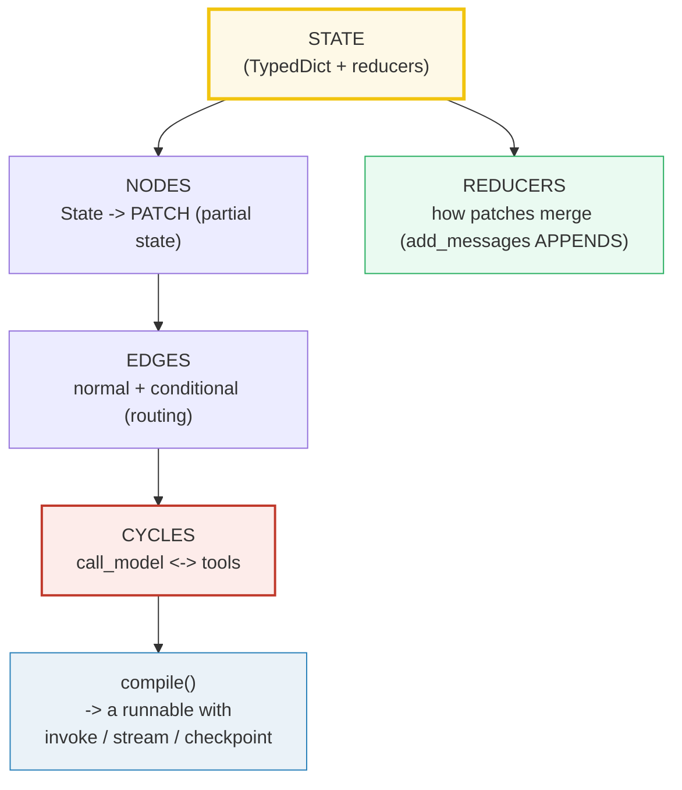
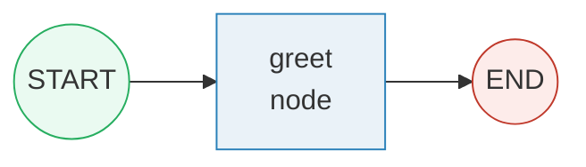
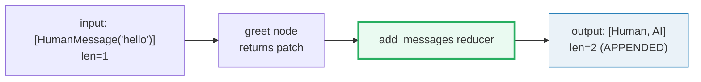
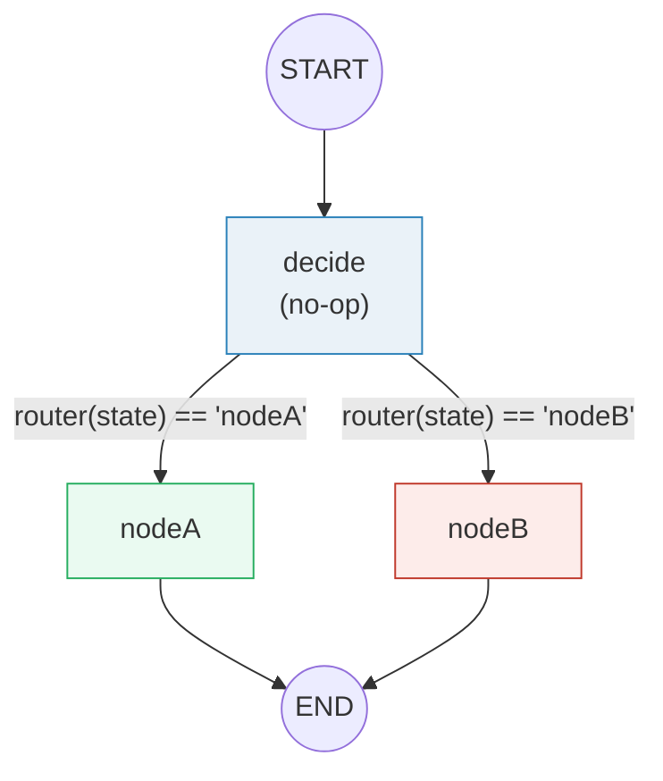
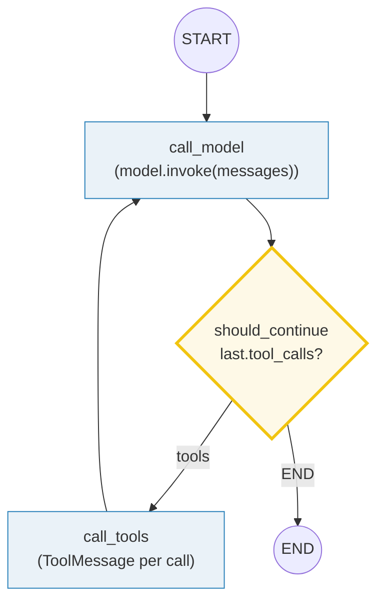

# LangGraph — State Machines for Agents: State, Nodes, Edges, Reducers

> **The one rule:** LangGraph models an agent as a **state machine**, not a
> chain. You define a `TypedDict` **State**, pure-function **nodes** that return
> a *patch* (partial state), and **edges** (normal or conditional) that connect
> them — including **cycles**. Per-key **reducers** (notably `add_messages`)
> decide how updates merge. `compile()` then yields a runnable with `invoke` /
> `stream` + optional **checkpointing** for memory and human-in-the-loop. This
> is the bridge from linear LCEL chains to real stateful agents.

**Companion code:** [`lc_langgraph.py`](./lc_langgraph.py).
**Every number, table, and worked example below is printed by `uv run python
lc_langgraph.py`** — change the code, re-run, re-paste. Nothing here is
hand-computed. Captured stdout lives in
[`lc_langgraph_output.txt`](./lc_langgraph_output.txt).

> **Offline / no API key.** The "model" in Section F is a
> `FakeMessagesListChatModel` that returns canned `AIMessage`s in order. No
> network, no key, byte-reproducible. Real chat models (`ChatOpenAI`,
> `ChatAnthropic`, …) slot in unchanged — a node just calls
> `model.invoke(state["messages"])`.

**Goal of this bundle (lineage, old → new):**

> from *"I write linear LCEL chains — `prompt | model | parser` is a DAG; the
> agent loop in [`LC_TOOLS_AGENTS`](./LC_TOOLS_AGENTS.md) is a hand-written
> `while` cycle around a model"*
> → *"LangGraph turns that loop into an explicit graph: a `TypedDict` State,
> function nodes that return patches, edges (incl. conditional routing), the
> `add_messages` reducer that accumulates the conversation, and `compile()` → a
> runnable with `invoke` / `stream` and a checkpointer for memory and
> human-in-the-loop."*

🔗 This is bundle **#42 of Phase 6**. It generalises
[`LC_TOOLS_AGENTS`](./LC_TOOLS_AGENTS.md) (#41 — the `while`-loop tool agent)
into a graph, and reuses the message types from
[`LC_MODELS_MESSAGES`](./LC_MODELS_MESSAGES.md) (#36). Memory / checkpointing
threads forward to [`LC_MEMORY`](./LC_MEMORY.md) (#39); agents-as-graphs is the
foundation for MCP integration ([`LC_MCP_BASICS`](./LC_MCP_BASICS.md), P8 #54).
See [`TODO.md`](./TODO.md) for the full plan.

---

## 0. The three ideas on one page



| Question | API | What it really does |
|---|---|---|
| "What's the shared data?" | `class State(TypedDict): messages: Annotated[list, add_messages]` | defines the schema + a per-key **reducer** (a binary `(old, new) -> merged`). |
| "What does a node do?" | `def greet(state): return {"messages": [AIMessage("hi")]}` | a plain function `State -> Partial[State]`; it returns a **patch**, not the whole state. |
| "Wire two nodes?" | `add_edge("a", "b")` | static routing: always `a` then `b`. |
| "Route dynamically?" | `add_conditional_edges("a", router, {k1: "b", k2: "c"})` | `router(state)` returns a key after `a` runs; the mapping picks the next node. |
| "How do messages accumulate?" | `Annotated[list, add_messages]` | the reducer APPENDS new messages (and replaces by `id`) — so history grows across nodes. |
| "Run / step through it?" | `compile()` then `invoke()` / `stream()` | `invoke` returns final state; `stream` yields one chunk per super-step (one per node). |
| "Memory / pause?" | `compile(checkpointer=InMemorySaver())` + `thread_id` | state persists across invokes on the same thread; basis of memory + human-in-the-loop. |

---

## 1. The State schema — a `TypedDict` + the `add_messages` reducer

A graph is parameterised by **one** State schema (a `TypedDict`, `dataclass`,
or Pydantic `BaseModel`). Each key may carry a **reducer** — a binary function
`(old, new) -> merged` that tells the graph how to combine a node's update with
the current value. **Without** a reducer, updates **overwrite**. With
`add_messages`, list updates **append** to the running list (and, by message
`id`, replace prior versions — important for human-in-the-loop edits).

```python
class State(TypedDict):
    messages: Annotated[list, add_messages]  # APPEND (and replace by id)
    count: int                               # OVERWRITE (no reducer)
```

> From `lc_langgraph.py` Section A:
> ```
> ======================================================================
> SECTION A — State schema: TypedDict + the add_messages reducer
> ======================================================================
> A graph is parameterized by ONE State schema. Each key may carry a
> REDUCER (a binary (old, new) -> merged). With no reducer, updates
> OVERWRITE; with `add_messages`, list updates APPEND (and replace by
> id). A node never returns the whole state — only a PATCH.
> 
> State (TypedDict) fields:
>   messages: Annotated[list, add_messages]  (id='_add_messages')
>   count   : int   (no reducer -> overwrites)
> 
> [check] StateGraph(State) constructs (schema compiles): OK
> [check] messages annotation carries the add_messages reducer: OK
> [check] count has no reducer (default = overwrite): OK
> ```

### Why reducers exist (internals)

LangGraph's execution model is borrowed from Google's
[Pregel](https://research.google/pubs/pub37252/) and Apache Beam: the program
proceeds in discrete **super-steps** (think: one node firing per step). When a
node finishes, it emits a patch along its outgoing edges; the runtime merges
each channel by calling the key's reducer. `add_messages` is special-cased for
the chat use case — beyond appending, it (a) **deserialises** dict-form
messages (`{"role": "user", "content": ...}`) into LangChain `Message` objects,
and (b) replaces any existing message with a matching `id` instead of appending
it (this is what lets a human edit an in-flight message without producing
duplicates). The imported `add_messages` is actually the internal function
`_add_messages` — an alias, hence the `(id='_add_messages')` annotation above.

---

## 2. A node is a function: `State -> Partial[State]`

A node is just a Python function. Its signature is `State -> Partial[State]`.
It does **not** return the whole state — only the keys it wants to change. The
graph then runs each changed key through its reducer and merges the result.
This is why a node can ignore fields it doesn't touch.

```python
def greet(state: State) -> dict:
    return {"messages": [AIMessage("hi")], "count": state["count"] + 1}
```

> From `lc_langgraph.py` Section B:
> ```
> ======================================================================
> SECTION B — A node is a function: State -> PATCH (partial state)
> ======================================================================
> A node is a plain function. Its signature is State -> Partial[State].
> It does NOT return the whole state — only the keys it changes. The
> graph's REDUCERS merge the patch into the shared state.
> 
> greet({messages:[HumanMessage('hello')], count:0})
>   -> {'messages': [AIMessage(content='hi', additional_kwargs={}, response_metadata={}, tool_calls=[], invalid_tool_calls=[])], 'count': 1}
>      (a PARTIAL dict — only 'messages' and 'count', no schema)
> 
> [check] greet() returns a dict (the patch): OK
> [check] patch contains the 'messages' key: OK
> [check] patch['count'] is 1 (incremented): OK
> [check] the patch is NOT the whole state (no 'foo', no extras): OK
> ```

**Gotcha:** a node can declare extra arguments: `state`, then optionally
`config: RunnableConfig`, then optionally `runtime: Runtime[ContextSchema]`.
Behind the scenes LangGraph wraps your function in a `RunnableLambda`, which
gives you tracing, batching, and async for free. Don't reach for global state
or closures to thread data — use the State (or `runtime.context`).

---

## 3. Edges `START -> node -> END`; `compile()` + `invoke()`

`START` and `END` are special **virtual** nodes. `add_edge(START, x)` marks `x`
as the entry; `add_edge(x, END)` marks `x` as a finish. `compile()` runs a few
structural checks (no orphaned nodes, …) and returns a `CompiledStateGraph` —
a runnable. `invoke(input)` then runs the graph once and returns the final
state.



> From `lc_langgraph.py` Section C:
> ```
> ======================================================================
> SECTION C — Edges START -> node -> END; compile() + invoke()
> ======================================================================
> START and END are special virtual nodes. add_edge(START, x) marks x
> as the entry; add_edge(x, END) marks x as a finish. compile() turns
> the builder into a runnable; invoke(input) runs once and returns the
> final state.
> 
> app.invoke({messages:[HumanMessage('hello')], count:0})
>   -> type=dict
>      messages = [HumanMessage('hello'), AIMessage('hi')]
>      count    = 1
> 
> [check] invoke returns a dict: OK
> [check] the node ran (count incremented to 1): OK
> [check] the final state has the node's AIMessage: OK
> ```

### Why `compile()` is a separate step (internals)

`StateGraph` is a **builder** — it just accumulates nodes and edges. You cannot
`invoke` a builder. `compile()` walks the graph, validates topology (every node
has at least one incoming edge unless it's `START`'s target; no node is
unreachable; conditional edges don't double up with static ones), wires up the
**channels** (one per State key, each carrying its reducer), and produces a
`CompiledStateGraph` with `invoke` / `stream` / `ainvoke` / `astream`. This
split lets you attach **runtime args** at compile time only: `checkpointer`,
`interrupt_before` / `interrupt_after`, and (since v1.0) a `context_schema`.
You **must** compile before use.

---

## 4. The `add_messages` reducer APPENDS — final messages grow

Without `add_messages`, every node's `{"messages": [...]}` would **overwrite**
the running list. With it, the new list is **appended**. Input of 1
`HumanMessage` → node returns 1 `AIMessage` → final state has **both**,
`len == 2`. This is what makes the conversation *accumulate* across nodes
without each node having to re-emit the whole history.



> From `lc_langgraph.py` Section D:
> ```
> ======================================================================
> SECTION D — The add_messages reducer APPENDS (final messages grow)
> ======================================================================
> Because `messages: Annotated[list, add_messages]`, each node's
> returned messages are APPENDED to the running list (not overwriting
> it). Input of 1 Human -> node returns 1 AIMessage -> final list has
> BOTH, len == 2.
> 
> input  messages len = 1  ([HumanMessage])
> output messages len = 2  (['HumanMessage', 'AIMessage'])
> the input HumanMessage is PRESERVED and the node's AIMessage is
> APPENDED — that is what the reducer buys you.
> 
> [check] output messages len grew from 1 to 2: OK
> [check] first message is the input HumanMessage: OK
> [check] second message is the node's AIMessage: OK
> ```

**Custom reducers:** any binary callable works. `operator.add` is the standard
"concatenate lists / sum ints" reducer — Section E uses
`Annotated[list[str], operator.add]` to accumulate a trace of node names, and
Section G uses `Annotated[int, operator.add]` to count turns. The default
(absent) reducer is `overwrite`. Since LangGraph v1.0 you can also use the
`Overwrite` type to bypass a channel's reducer for a specific key.

---

## 5. Conditional routing — the router function picks a branch

`add_conditional_edges(source_node, router, mapping)` calls `router(state)`
*after* `source_node` runs; its return value (a key) selects the next node from
the optional `mapping` dict. Without the mapping, the router's return value is
treated **directly** as the next node's name. A node with multiple outgoing
normal edges fans out in parallel; conditional edges are how you do *dynamic*
branching.



> From `lc_langgraph.py` Section E:
> ```
> ======================================================================
> SECTION E — Conditional routing: the router function picks a branch
> ======================================================================
> add_conditional_edges(node, router, mapping) calls router(state)
> after `node` runs; its return value (a node NAME) selects the next
> node. The mapping {key: nodeName} translates the router's output.
> 
> go="a" -> ran = ['A']
> go="b" -> ran = ['B']
> 
> [check] go="a" routed to nodeA (ran == ["A"]): OK
> [check] go="b" routed to nodeB (ran == ["B"]): OK
> ```

**Gotcha — don't mix static and conditional edges from the same node.** If
`node_a` has both `add_edge("node_a", "node_b")` *and*
`add_conditional_edges("node_a", router)`, both paths can fire and behaviour
gets hard to reason about. Pick one routing mechanism per source node (or use
the newer `Command(goto=..., update=...)` return value from a node to combine
state update + routing in one place).

---

## 6. A loop agent (offline) — `call_model -> should_continue -> tools -> call_model`

This is the **bridge from chains to agents**. A conditional edge lets the graph
**cycle** back: `call_model → should_continue → {tools | END}`, and `tools →
call_model`. `should_continue` inspects the latest `AIMessage`; if it has
`tool_calls`, route to `tools`; otherwise route to `END`. The cycle is the one
thing no linear LCEL chain (`a | b | c`) can express — and it is exactly the
shape of the hand-rolled `while` loop in [`LC_TOOLS_AGENTS`](./LC_TOOLS_AGENTS.md).



> From `lc_langgraph.py` Section F:
> ```
> ======================================================================
> SECTION F — A loop agent (offline): call_model -> tools -> call_model
> ======================================================================
> This is the bridge from chains to agents. A conditional edge lets
> the graph LOOP: call_model -> should_continue -> tools -> back to
> call_model. should_continue inspects the latest AIMessage; if it
> has tool_calls, route to 'tools'; else route to END. The cycle is
> what no linear LCEL chain can express.
> 
> Trace (final state messages):
>   - HumanMessage('weather in Paris?')
>   - AIMessage('' tool_calls=[{'name': 'get_weather', 'args': {'city': 'Paris'}, 'id': 'c1', 'type': 'tool_call'}])
>   - ToolMessage('Paris: 22C')
>   - AIMessage('Paris is 22C')
> 
> [check] the loop terminated (did not recurse forever): OK
> [check] the final AIMessage has the tool's answer: OK
> [check] a full tool round-trip happened (4 messages: H, AI(tool), Tool, AI): OK
> [check] message #3 is the ToolMessage produced by call_tools: OK
> ```

### Why this terminates — `recursion_limit` and `GraphRecursionError`

Left to itself a buggy router could cycle forever, so LangGraph counts
**super-steps** and raises `GraphRecursionError` once the per-invocation
`recursion_limit` is hit. Since v1.0.6 the default is **1000** steps (it used
to be 25 — a frequent foot-gun). Set it via `config={"recursion_limit": N}` at
invoke time. For graceful degradation, inject the managed
`RemainingSteps` value into your State and route to a fallback node when it
drops near zero — see the [Graph API docs](https://docs.langchain.com/oss/python/langgraph/graph-api#recursion-limit).

🔗 [`LC_TOOLS_AGENTS`](./LC_TOOLS_AGENTS.md) (#41) writes this same loop by
hand (`while` + `tool_calls`); this bundle shows the **declarative** form. The
two are equivalent, but the graph version gives you streaming, checkpointing,
and human-in-the-loop for free.

---

## 7. `compile()` → runnable; `invoke` / `stream`; checkpointing

`compile()` returns a runnable. `invoke(input)` runs once and returns the final
state; `stream(input)` yields one chunk per **super-step** (i.e. one chunk per
node that fires). Compiling with a **checkpointer** —
`InMemorySaver()` (dev), or a `Sqlite`/`Postgres`-backed one (prod) — persists
state across invocations on the same `thread_id`. That persistence is what
enables **memory** (multi-turn conversations), **human-in-the-loop** (pause
with `interrupt()`, resume with `Command(resume=...)`), and **resumable / fault-
tolerant** runs (a crashed run picks up from the last checkpoint).

> From `lc_langgraph.py` Section G:
> ```
> ======================================================================
> SECTION G — compile() -> a runnable; invoke / stream; checkpointing
> ======================================================================
> compile() returns a runnable. invoke() returns the FINAL state;
> stream() yields one chunk per super-step (one per node). Compiling
> with a checkpointer (InMemorySaver / Sqlite / Postgres) persists
> state across invocations on the same thread_id -> enables memory,
> human-in-the-loop, and resumable runs.
> 
> app.stream(...) yielded 3 super-steps: ['call_model', 'call_tools', 'call_model']
> 
> [check] stream yielded more than one super-step (>1 node ran): OK
> [check] stream order is call_model, call_tools, call_model: OK
> With checkpointer + thread_id='t1':
>   invoke 1 -> turns=1, messages len=2
>   invoke 2 -> turns=2, messages len=4
> state ACCUMULATED across invocations on the same thread — the basis
> of memory and human-in-the-loop.
> 
> [check] turn 1: turns==1, 2 messages: OK
> [check] turn 2: turns==2 (accumulated via checkpointer): OK
> [check] turn 2: 4 messages (Human,AI,Human,AI): OK
> ```

### Why `thread_id` matters (internals)

A checkpointer stores a **chain of snapshots** keyed by `(thread_id, checkpoint_id)`.
Each super-step boundary writes a new checkpoint. Re-invoking with the **same**
`thread_id` resumes from the latest checkpoint for that thread — so the second
`invoke` in the trace above starts from `turns=1, messages=[H,AI]` and adds to
it, giving `turns=2, messages=[H,AI,H,AI]`. Pass a *different* `thread_id` and
you start fresh. This is also how `interrupt()` pauses a run mid-graph: the
node hits `interrupt(question)`, the runtime writes a checkpoint and yields;
the user reviews state, then `graph.invoke(Command(resume="yes"), cfg)` resumes
*from that exact checkpoint* with the supplied value as `interrupt()`'s return.

🔗 The full memory / cross-thread story (short-term checkpoint vs long-term
`Store`) is the subject of [`LC_MEMORY`](./LC_MEMORY.md) (#39).

---

## 8. Why LangGraph over plain LCEL

LCEL chains are **linear DAGs** (`a | b | c`). Real agents need four things a
linear chain cannot give you:

1. **Cycles** — `call_model ↔ tools` over and over until the model stops
   calling tools.
2. **Shared State** — a typed struct threaded through every step, with
   per-key reducers (not just "the previous step's output").
3. **Memory** — state that survives across `invoke` calls (a checkpointer +
   `thread_id`).
4. **Human-in-the-loop** — `interrupt()` to pause for review, then
   `Command(resume=...)` to continue.

LangGraph is the explicit state machine that gives you all four. The recurring
cost is one extra concept (the **reducer**) and one extra step (`compile()`).

> From `lc_langgraph.py` Section H:
> ```
> ======================================================================
> SECTION H — Why LangGraph over plain LCEL
> ======================================================================
> LCEL chains are LINEAR DAGs (a | b | c). Real agents need: cycles
> (call_model <-> tools), shared STATE, MEMORY across turns, and
> HUMAN-IN-THE-LOOP pauses. LangGraph is the explicit state machine
> that gives you all four. 🔗 LC_TOOLS_AGENTS (#41) shows the agent
> loop; this bundle turns that loop into a graph.
> 
> LCEL chain                      LangGraph
> ------------------------------------------------------------
> linear a|b|c                    state machine (cycles, branches)
> Runnable.output passes data     shared State + per-key reducers
> one-shot invoke                 invoke + stream + checkpoint
> no memory                       InMemorySaver / Sqlite / Postgres
> no pause                        interrupt() + Command(resume=...) for HITL
> recursion: N/A                  recursion_limit (default 1000)
> 
> [check] LangGraph supports CYCLES (call_model visited twice): OK
> ```

🔗 Forward refs: the agent loop is [`LC_TOOLS_AGENTS`](./LC_TOOLS_AGENTS.md)
(P6 #41) — write it by hand first, then graduate to the graph; message history
& long-term memory live in [`LC_MEMORY`](./LC_MEMORY.md) (P6 #39); exposing
the graph's tools via the Model Context Protocol is [`LC_MCP_BASICS`](./LC_MCP_BASICS.md)
(P8 #54).

---

## Pitfalls

| Trap | Example | The fix |
|---|---|---|
| Forgetting the reducer | `messages: list` (no annotation) → each node OVERWRITES history | use `Annotated[list, add_messages]` so updates APPEND. Default reducer = overwrite. |
| Returning the *whole* state from a node | node returns `{**state, "x": 1}` and you accidentally nuke parallel updates | return only the keys you change (a PATCH); reducers do the merge. |
| Mixing static + conditional edges from one node | `add_edge("a","b")` AND `add_conditional_edges("a", router)` → both fire | pick ONE routing mechanism per source node; or return `Command(goto=...)` from the node. |
| Returning the wrong type from the router | router returns a node *object* (or `True`) instead of its *name* | return a string name (or a key in your mapping). Without a mapping, the value IS the next node's name. |
| Infinite loop | router always says `"tools"` because the model never stops calling them | set `recursion_limit`; inject `RemainingSteps` and route to a fallback when low; catch `GraphRecursionError`. |
| `MemorySaver` import fails | the old name was removed/renamed | import `InMemorySaver` from `langgraph.checkpoint.memory` (the modern name). |
| Forgetting to `compile()` | `builder.invoke(...)` → `AttributeError` | always `app = builder.compile(...)`; only the compiled graph is runnable. |
| No `thread_id` when checkpointing | state doesn't persist across invokes | pass `{"configurable": {"thread_id": "..."}}` to `invoke` / `stream`. |
| Continuing a conversation with `Command(update=...)` | graph appears "stuck" — it resumes from the last checkpoint, not `__start__` | pass a plain dict input (`{"messages": [...]}`) to keep talking on a thread; reserve `Command(resume=...)` for `interrupt()`. |
| Mutating state in place | `state["messages"].append(...)` — bypasses the reducer, breaks checkpointing | always RETURN a patch (`{"messages": [msg]}`); never mutate. |
| Tool node referencing a missing tool | `ToolMessage` with unknown `name` | keep the `tools` list and the `tool_calls` schema in sync; use `tool()` decorator so names are stable. |

---

## Cheat sheet

- **State** = a `TypedDict` (or `dataclass`/Pydantic). Each key may carry a
  **reducer**: `messages: Annotated[list, add_messages]`. No reducer →
  overwrite; `operator.add` → concat/sum; `add_messages` → append + replace-by-id.
- **Node** = a function `State -> Partial[State]`. Returns a PATCH (only the
  changed keys). Optional 2nd/3rd args: `config: RunnableConfig`,
  `runtime: Runtime[Context]`.
- **Edge** = `add_edge("a", "b")` (static). **Conditional** =
  `add_conditional_edges("a", router, {k: "b", ...})`. Multiple outgoing static
  edges fan out in parallel.
- **START / END** = virtual nodes. `add_edge(START, x)` is the entry point
  (alias: `set_entry_point`); `add_edge(x, END)` is the finish (alias:
  `set_finish_point`).
- **Cycle** = an edge that points back: `add_edge("call_tools", "call_model")`
  + a conditional edge that decides whether to take it. This is what makes an
  *agent* (vs a chain).
- **`compile()`** turns the builder into a runnable. Required. Accepts
  `checkpointer=`, `interrupt_before=`/`interrupt_after=`, `context_schema=`.
- **`invoke(input)`** runs once → final state. **`stream(input)`** yields one
  chunk per super-step (use `stream_mode="updates"` for per-node patches, or
  `"values"` for the full state).
- **Checkpointer** (`InMemorySaver` / Sqlite / Postgres) + `thread_id` =
  persistence across invokes → memory + human-in-the-loop + resumable runs.
- **`interrupt(question)`** pauses mid-node; **`Command(resume=value)`** resumes.
- **`recursion_limit`** (default 1000 since v1.0.6) caps super-steps; over-running
  raises `GraphRecursionError`. Inject `RemainingSteps` for graceful fallback.
- **vs LCEL:** LCEL = linear DAG; LangGraph = state machine with cycles +
  reducers + memory + HITL. Use LCEL for `prompt | model | parser`; reach for
  LangGraph the moment you need a loop or persistent state.

---

## Sources

- **LangGraph — Graph API overview (docs.langchain.com).**
  https://docs.langchain.com/oss/python/langgraph/graph-api
  *The authoritative spec: StateGraph is parameterised by a `State` schema;
  nodes are `State -> Partial<State]`; normal vs conditional edges;
  `add_conditional_edges(node, router, mapping)`; the `add_messages` reducer
  ("for brand new messages, it will simply append … it will also handle the
  updates for existing messages correctly"); `START` / `END` virtual nodes;
  `compile()` is mandatory; super-steps / Pregel inspiration. Quoted and
  implemented throughout §1–§7.*
- **LangGraph — StateGraph class reference (reference.langchain.com).**
  https://reference.langchain.com/python/langgraph/graph/state/StateGraph
  *Confirms the constructor signature
  `StateGraph(state_schema, context_schema=None, *, input_schema=None,
  output_schema=None)`, the "builder class — must call `.compile()`" warning,
  and that each state key "can optionally be annotated with a reducer function
  … `(Value, Value) -> Value`." Basis for §1 and §3.*
- **LangGraph — Persistence (checkpointers + stores).**
  https://docs.langchain.com/oss/python/langgraph/persistence
  *"Checkpointers persist a thread's graph state as checkpoints … short-term,
  thread-scoped memory, including conversation continuity, human-in-the-loop,
  time travel, and fault tolerance." Basis for §7 and the §8 "memory" row.*
- **LangGraph — Overview (docs.langchain.com).**
  https://docs.langchain.com/oss/python/langgraph/overview
  *"LangGraph is a low-level orchestration framework and runtime for building,
  managing, and deploying long-running, stateful agents … focused entirely on
  agent orchestration: durable execution, streaming, human-in-the-loop, and
  more." Confirms the hello-world pattern `add_node` + `add_edge(START, …)` +
  `add_edge(…, END)` + `compile()` + `invoke`. The redirect target for the
  deprecated `langchain-ai.github.io/langgraph` URL given in the brief.*
- **LangGraph — `add_messages` reference.**
  https://reference.langchain.com/python/langgraph/graph/message/add_messages
  *(via the Graph API doc): "the prebuilt `add_messages` function. For brand
  new messages, it will simply append to existing list, but it will also handle
  the updates for existing messages correctly" — and it deserialises dict-form
  messages into LangChain `Message` objects. Basis for §1 and §4.*
- **LangGraph — `MessagesState` / prebuilt state.**
  https://docs.langchain.com/oss/python/langgraph/graph-api#working-with-messages-in-graph-state
  *Confirms `MessagesState` is `class MessagesState(TypedDict): messages:
  Annotated[list[AnyMessage], add_messages]` — the prebuilt form of the §1
  schema. Used to verify the recommended pattern; this bundle deliberately
  writes the `Annotated[list, add_messages]` form by hand for pedagogy.*
- **LangGraph source — `langgraph.checkpoint.memory.InMemorySaver`.**
  Installed package version `langgraph==1.2.6`. *`InMemorySaver` is the modern
  name for the in-process checkpointer (the older `MemorySaver` alias still
  works but is discouraged). Verified at runtime: state with
  `Annotated[int, operator.add]` accumulates across two `invoke`s on the same
  `thread_id` (Section G).*
- **LangChain — `FakeMessagesListChatModel`.**
  https://reference.langchain.com/python/langchain-core/language_models/fake_chat_models/FakeMessagesListChatModel
  *(via installed `langchain-core==1.4.8`): returns the canned `responses` list
  of `BaseMessage`s in order. Used in §6/§F to run a real tool-calling loop
  with no network and no API key.*
- **Google Research — Pregel (Malewicz et al., 2010).**
  https://research.google/pubs/pub37252/
  *The large-scale graph-processing model LangGraph's super-step execution is
  inspired by (cited in the LangGraph overview). Background for §1's
  "super-step / reducer" internals note.*

*Verified against installed versions: `langgraph==1.2.6`, `langchain==1.3.10`,
`langchain-core==1.4.8`, Python 3.13.5. No unverified facts.*
