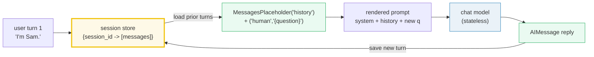
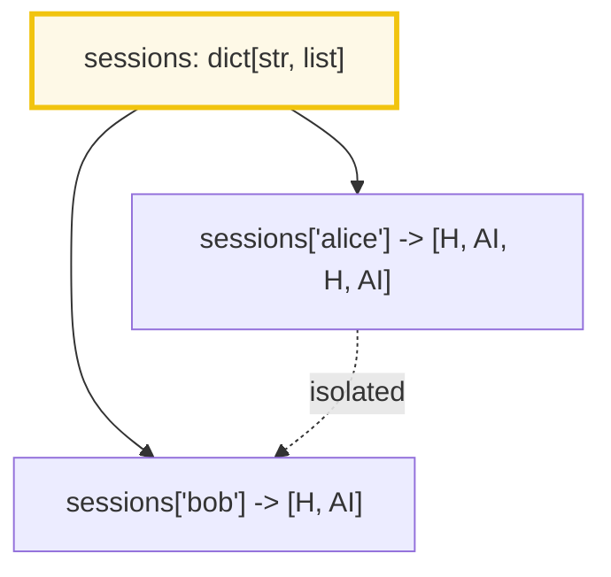
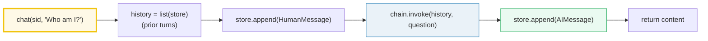

# LangChain Memory — Chat History Is a Message List, Managed as Explicit Per-Session State

> **The one rule:** a chat model is **stateless** — every `.invoke` is a clean
> slate. "Memory" is not magic the model does; it is **you** keeping a list of
> `HumanMessage` / `AIMessage` per conversation, threading it through a
> `MessagesPlaceholder`, and saving the new turn back. The modern pattern manages
> that list as **explicit state** (a dict, a DB row, or a LangGraph checkpoint);
> the old `ConversationBufferMemory` classes are **legacy / deprecated**.

**Companion code:** [`lc_memory.py`](./lc_memory.py). **Every value, message
list, and `[check]` below is printed by `uv run python lc_memory.py`** — change
the code, re-run, re-paste. Nothing here is hand-computed. Captured stdout lives
in [`lc_memory_output.txt`](./lc_memory_output.txt).

**Goal of this bundle (lineage, old → new):**

> from *"the model forgets everything on each call"*
> → *"chat history is just a list of messages threaded through a
> `MessagesPlaceholder`; the modern pattern manages that list as explicit state
> per session, and complex multi-turn state moves to LangGraph."*

🔗 Builds on [LC_MODELS_MESSAGES](./LC_MODELS_MESSAGES.md) (P6 #36) — the
`HumanMessage` / `AIMessage` types every store holds — and on
[LC_PROMPTS](./LC_PROMPTS.md) (P6 #37), whose `MessagesPlaceholder` slot is
*fed* by the history store this bundle builds. The chain that ties them
together (`prompt | model`) is [LC_CHAINS_LCEL](./LC_CHAINS_LCEL.md) (P6 #38).
Forward to [LC_LANGGRAPH](./LC_LANGGRAPH.md) (P6 #42) for checkpointed
multi-turn agent state — the recommended successor to everything here when flows
get non-trivial.

**OFFLINE / NO API KEY:** the only "model" used is a `FakeMessagesListChatModel`
subclass that returns canned `AIMessage` objects and records what it was called
with. No network, no API key, byte-reproducible. The `BaseChatMessageHistory`
subclass is a tiny stdlib-only implementation (`langchain_community` is **not**
required).

---

## 0. The shape of memory in LangChain



The four questions this bundle answers:

| Question | Modern LangChain answer | Section |
|---|---|---|
| "Where does the model's memory live?" | It doesn't — *you* keep a list of `BaseMessage` per session | §1 |
| "How does history reach the prompt?" | `MessagesPlaceholder("history")` splices the list inline at render time | §2 |
| "How do I write the loop by hand?" | append `HumanMessage` → run `prompt | model` → append `AIMessage` | §3 |
| "Is there a helper that loads/saves for me?" | `RunnableWithMessageHistory` (but it now emits a deprecation warning) | §4 |
| "Aren't there `ConversationBufferMemory` classes?" | LEGACY / deprecated 0.3.x — use explicit history or LangGraph state | §5 |
| "History grows forever — how do I cap it?" | window to the last `N` messages, or `trim_messages` for a token budget | §6 |

---

## 1. Chat history is a list of messages, keyed by session

The single most important fact in this bundle: **the model has no memory.** Each
`.invoke` is independent — if you want turn 2 to know about turn 1, *you* pass
turn 1's messages back in. The simplest store that does this is a **plain Python
dict** keyed by a `session_id`, holding a list of `HumanMessage` / `AIMessage`
(🔗 the message types from [LC_MODELS_MESSAGES](./LC_MODELS_MESSAGES.md)).



> From `lc_memory.py` Section A:
> ```
> ======================================================================
> SECTION A — Chat history is a list of messages, keyed by session
> ======================================================================
> A chat model is stateless: each .invoke is independent. Memory = YOU
> keep a list of HumanMessage / AIMessage per conversation. A plain dict
> keyed by session_id is the simplest store.
> 
> sessions["a"] after 3 appends:
>   human  : hi
>   ai     : hello
>   human  : my name is Sam
> 
> sessions.get('b') = <missing>  ('b' was never touched)
> 
> [check] history grows: sessions['a'] has 3 messages: OK
> [check] sessions are isolated: 'b' was never created: OK
> [check] first turn is a HumanMessage: OK
> [check] second turn is an AIMessage: OK
> ```

### Why a plain dict (internals)

There is no `Memory` base class involved here — just `list.append`. This
transparency is the whole point of the modern pattern: the store is a value you
can `print()`, `pytest` against, serialize to JSON, or swap for a Redis/SQL
backend without changing a single LangChain abstraction. Contrast this with the
legacy `ConversationBufferMemory` (§5), which hid the list *inside* a `Chain`
object and made it genuinely hard to inspect mid-flight.

🔗 The `MessagesPlaceholder` that *consumes* this list is introduced in
[LC_PROMPTS §7](./LC_PROMPTS.md); the next section shows it in action.

---

## 2. `MessagesPlaceholder` renders the history list into the prompt

A list under your desk does nothing on its own — the model needs the history
*inside the prompt*. `MessagesPlaceholder("history")` reserves a slot in a
`ChatPromptTemplate` that accepts an arbitrary list of `BaseMessage` at invoke
time and splices them inline between the system message and the new question.

```
ChatPromptTemplate.from_messages([
    ("system", "You are a concise assistant."),
    MessagesPlaceholder("history"),     # <- the history list lands here
    ("human", "{question}"),
])
```

> From `lc_memory.py` Section B:
> ```
> ======================================================================
> SECTION B — MessagesPlaceholder renders the history list into the prompt
> ======================================================================
> MessagesPlaceholder('history') reserves a slot in a ChatPromptTemplate
> for an arbitrary list of BaseMessage. At invoke time the history list is
> spliced inline — system + history + new question render together.
> 
> PROMPT.input_variables = ['history', 'question']
> rendered message count: 5  (system + 3 history + 1 question)
>   system : You are a concise assistant.
>   human  : hi
>   ai     : hello
>   human  : my name is Sam
>   human  : What is my name?
> 
> [check] input_variables are history + question: OK
> [check] rendered 5 messages (system + 3 history + 1 question): OK
> [check] history[0] ('hi') spliced into the rendered prompt: OK
> [check] history AIMessage ('hello') preserved verbatim: OK
> [check] {question} substituted into the final human turn: OK
> ```

### Why this composes cleanly (internals)

`MessagesPlaceholder` is itself a `Runnable`. When you pipe
`prompt | model`, the prompt renders the system string, walks the history list
(`for m in history: messages.append(m)`), and appends the substituted human
template — producing **one** `ChatPromptValue` (a typed message list) that the
model consumes. Because the history is just an input variable, you control
*exactly* what the model sees: pass `history[-4:]` and you've implemented
windowed memory (§6); pass `[]` and you've reset the conversation. Nothing is
hidden.

---

## 3. The manual history loop — the explicit, modern core

Putting §1 and §2 together gives the canonical six-line loop. Take
`(session_id, question)`, append the `HumanMessage`, run `prompt | model` with
`history` set to the *prior* turns, then append the `AIMessage` back. To **prove**
the model actually saw turn 1 on turn 2, the `.py` subclasses
`FakeMessagesListChatModel` to record the message-list it received each call.



> From `lc_memory.py` Section C:
> ```
> ======================================================================
> SECTION C — Manual history loop: append human -> run -> append ai
> ======================================================================
> The explicit, modern pattern in six lines: take (session_id, question),
> append the HumanMessage, run prompt | model with history=prior turns,
> append the AIMessage back. No hidden state, fully testable.
> 
> chat('alice', "I'm Sam.")   -> 'Hi Sam, nice to meet you.'
> chat('alice', "Who am I?")  -> 'Your name is Sam.'
> 
> sessions['alice'] (4 messages):
>   human  : I'm Sam.
>   ai     : Hi Sam, nice to meet you.
>   human  : Who am I?
>   ai     : Your name is Sam.
> 
> model saw on turn 2: [('SystemMessage', 'You are a concise assistant.'), ('HumanMessage', "I'm Sam."), ('AIMessage', 'Hi Sam, nice to meet you.'), ('HumanMessage', 'Who am I?')]
> (system + turn-1 human + turn-1 ai + new human question)
> 
> [check] store holds 4 messages after 2 turns (2 human + 2 ai): OK
> [check] turn 2 sent 4 msgs to the model (sys + H1 + AI1 + H2): OK
> [check] turn 1's HumanMessage reached the model on turn 2: OK
> [check] turn 1's AIMessage reached the model on turn 2: OK
> ```

### Why "explicit history" beats the old memory classes (internals)

The `model saw on turn 2:` line is the proof: on the second call the model
received `[System, H1, AI1, H2]` — turn 1's human **and** ai turn, spliced in by
the `MessagesPlaceholder`. Every claim about "memory" in this pattern is
*falsifiable*: you can assert on the exact message list the model consumed.
That is the testability argument. There is also a **control** argument — because
`history` is a plain function argument, you can mock it, replay it, branch on
it, or truncate it (§6) without subclassing anything. And there is a **no-hidden-
state** argument: nothing mutates a global; the store is a local you pass in.

---

## 4. `RunnableWithMessageHistory` — auto load → run → save

The loop in §3 is six lines, but you'll write it in every chatbot. LangChain's
`RunnableWithMessageHistory` wraps a runnable + a `get_session_history` factory
and automates the load/inject/run/save cycle: it reads `session_id` from
`config["configurable"]`, fetches (or creates) the store, injects prior turns at
`history_messages_key`, runs, then appends the new human+ai turn. Same
`session_id` sees prior turns; a different id is isolated.

> From `lc_memory.py` Section D:
> ```
> ======================================================================
> SECTION D — RunnableWithMessageHistory: auto load -> run -> save by session_id
> ======================================================================
> RunnableWithMessageHistory wraps a runnable + a get_session_history
> factory. On each invoke it: loads history from the store keyed by
> 'session_id' in config['configurable'], injects it at history_messages_key,
> runs, then saves the new human+ai turn. Same session_id sees prior turns;
> a different id starts fresh.
> 
> alice turn 1 -> 'Hi Sam, nice to meet you.'
> alice turn 2 -> 'Your name is Sam.'   (model saw turn 1)
> bob   turn 1 -> "I don't know your name yet."   (fresh session, never saw 'Sam')
> 
> session_store['alice'].messages (4):
>   human  : I'm Sam.
>   ai     : Hi Sam, nice to meet you.
>   human  : Who am I?
>   ai     : Your name is Sam.
> session_store['bob'].messages (2):
>   human  : Who am I?
>   ai     : I don't know your name yet.
> 
> model saw on alice turn 2: [('SystemMessage', 'You are a concise assistant.'), ('HumanMessage', "I'm Sam."), ('AIMessage', 'Hi Sam, nice to meet you.'), ('HumanMessage', 'Who am I?')]
> model saw on bob turn 1:    [('SystemMessage', 'You are a concise assistant.'), ('HumanMessage', 'Who am I?')]
> 
> [check] same session_id persists: alice store has 4 messages after 2 turns: OK
> [check] different session_id is isolated: bob store has 2 messages: OK
> [check] alice turn 2 saw turn 1's human turn: OK
> [check] alice turn 2 saw turn 1's ai turn: OK
> [check] bob turn 1 did NOT see alice's history: OK
> ```

### Why we still wrote our own `BaseChatMessageHistory` (internals)

`RunnableWithMessageHistory` needs a `get_session_history(session_id)` factory
returning a `BaseChatMessageHistory`. The concrete impls live in
`langchain_community.chat_message_histories` (`InMemoryChatMessageHistory`,
`RedisChatMessageHistory`, `SQLChatMessageHistory`, …) — but that package is an
**extra dependency**. The abstract base is enough on its own: subclass it with
`messages` (a property), `add_message`, and `clear`, and you have a fully working
in-memory store with zero extra deps. The `.py` does exactly this
(`InMemoryHistory`, ~10 lines). The contract is the three abstract-ish methods;
everything else (`add_user_message`, `add_ai_message`, async variants) is
provided by the base class.

---

## 5. Legacy "memory classes" vs modern explicit history / LangGraph

LangChain 0.0.x shipped a family of `BaseMemory` classes —
`ConversationBufferMemory`, `ConversationStringBufferMemory`,
`ConversationBufferWindowMemory`, `ConversationTokenBufferMemory`,
`ConversationSummaryMemory`, `ConversationSummaryBufferMemory`,
`ConversationEntityMemory`, … These are **LEGACY**. As of the 0.3 release they
are **officially deprecated** in favor of explicit history (§1–§3) for simple
chat, or **LangGraph checkpointed state** for multi-turn agents. Constructing a
`RunnableWithMessageHistory` today literally raises a
`LangChainDeprecationWarning` pointing you there:

> From `lc_memory.py` Section E:
> ```
> ======================================================================
> SECTION E — Legacy 'memory classes' vs modern explicit history / LangGraph
> ======================================================================
> LangChain 0.0.x shipped ConversationBufferMemory, ConversationSummary-
> Memory, ConversationBufferWindowMemory, ... These are LEGACY: deprecated
> in 0.3.x. They were hidden global state bolted onto a Chain, lacked
> multi-user/multi-session support, and broke with tool-calling chat
> models. Constructing a RunnableWithMessageHistory TODAY literally emits a
> LangChainDeprecationWarning that points you to LangGraph persistence.
> 
> deprecation warnings caught on construction: 1
>   category: LangChainDeprecationWarning
>   message : "RunnableWithMessageHistory is deprecated. Use LangGraph's built-in persistence instead."
> 
> Modern path (pick one):
>   1. Explicit history — a dict/DB keyed by session_id + MessagesPlaceholder
>      (Sections A-C). The store is just a list you inspect: testable.
>   2. LangGraph checkpointed state for multi-turn agents — persists ANY
>      state, native multi-user/threads, tool-call compatible. (LC_LANGGRAPH.)
> 
> [check] RunnableWithMessageHistory emits LangChainDeprecationWarning: OK
> [check] warning category is LangChainDeprecationWarning: OK
> [check] warning text points to LangGraph persistence: OK
> ```

### Why the legacy classes died (internals)

Per LangChain's own migration guide, the 0.0.x memory abstractions had three
structural defects: **(1) no multi-user / multi-conversation support** — they
were single global buffers, useless for real chatbots with many users; **(2)
incompatible with modern chat-model APIs** — they predated tool-calling and broke
on `AIMessage` objects carrying `tool_calls`; **(3) hidden, mutable state bolted
onto a `Chain`** — the buffer lived inside the chain object, so testing and
debugging meant poking at private attributes. The replacement split cleanly:
`BaseChatMessageHistory` (just persistence, §4) for storage, and LangGraph
persistence for *orchestration + state*. LangGraph wins because its checkpointer
can persist **any** state object (not just message lists), resume any thread,
support "time travel" across branches, and is built around multi-thread/multi-
user from day one. 🔗 Full treatment in [LC_LANGGRAPH](./LC_LANGGRAPH.md) (P6 #42).

---

## 6. Bounded history — keep the last `N` messages to cap token cost

Every saved turn is re-sent on the next invoke, so an unbounded store eventually
**blows the model's context window** (and your token bill). Two fixes:

- **Window** — keep only the last `N` messages (`history[-N:]`). Transparent,
  dependency-free, deterministic. The old `ConversationBufferWindowMemory` did
  exactly this, opaquely; the modern version is one slice.
- **Token budget** — `langchain_core.messages.trim_messages(...,
  strategy="last", token_counter=...)` keeps as many recent messages as fit a
  token budget. The `.py` notes it; the window is the demo because it is
  byte-deterministic with no model needed.

> From `lc_memory.py` Section F:
> ```
> ======================================================================
> SECTION F — Bounded history: keep the last N messages to cap token cost
> ======================================================================
> Every saved turn is re-sent on the next invoke, so history grows without
> bound and eventually blows the context window. The fix is a WINDOW: keep
> only the last N messages (a transparent slice), or use langchain's
> trim_messages helper for a token-budget cut.
> 
> full history (6 messages, 3 turns):
>   human  : q1
>   ai     : a1
>   human  : q2
>   ai     : a2
>   human  : q3
>   ai     : a3
> 
> history[-2:] (keep last 2 messages):
>   human  : q3
>   ai     : a3
> 
> [check] window trims 6 messages down to 2: OK
> [check] window keeps the most recent turn (q3 + a3): OK
> [check] window discards the oldest turn (q1, a1): OK
> prompt.invoke(history=windowed, question='q4') -> 4 messages
> (system + 2 windowed + 1 new question = 4)
> 
> [check] windowed history renders 4 messages (system + 2 + 1): OK
> [check] oldest turns never reach the prompt: OK
> ```

### Why windowing must keep *pairs* (internals)

A turn is a `HumanMessage` + `AIMessage` pair. If you slice on an odd boundary
you can hand the model a dangling `AIMessage` as the final history entry,
followed by a new `HumanMessage` — which some providers reject as a malformed
conversation (the docs require the last message to be `human` or `tool`). The
safe rule: window on `2 * k` messages (`history[-(2*k):]`) so you always keep
whole turns. The `.py` uses `history[-2:]` — one complete turn. For a token
budget, `trim_messages(strategy="last", end_on="human")` enforces the same
boundary automatically.

---

## Pitfalls

| Trap | Example | The fix |
|---|---|---|
| Assuming the model remembers | second `.invoke` with no history → "I don't know your name" | the model is **stateless**; you must thread prior turns via `MessagesPlaceholder` |
| Forgetting to save the AI turn | store has `[H]` only → turn 2 lacks the reply | the loop is *append human → run → **append AI***; both sides, every turn |
| Reaching for `ConversationBufferMemory` | deprecated 0.3.x; emits warnings; no multi-user | use a `dict[session_id, list]` + `MessagesPlaceholder`, or LangGraph state |
| `RunnableWithMessageHistory` for new agents | raises `LangChainDeprecationWarning` | fine for simple chat; for agents/multi-turn use LangGraph persistence |
| Letting history grow unbounded | context-window overflow, ballooning cost | window to last `2*k` msgs, or `trim_messages` with a token budget |
| Window slicing on an odd boundary | dangling `AIMessage` last → provider rejects the request | keep whole turns: `history[-(2*k):]`, or `trim_messages(end_on="human")` |
| Mutating the live store while iterating | `for m in store: ...` then `store.append(...)` | snapshot first: `history = list(store)` before the run (the `.py` does this) |
| Sharing one `BaseChatMessageHistory` across sessions | cross-talk between users | key the store by `session_id`; one history object per session |
| Expecting `langchain_community` to be installed | `ImportNotFoundError` for `InMemoryChatMessageHistory` | subclass `BaseChatMessageHistory` yourself (`messages`/`add_message`/`clear`) — 10 lines |
| Putting `session_id` in the input dict, not config | `RunnableWithMessageHistory` can't find it | pass `{"configurable": {"session_id": ...}}` as the **second** arg (config), not the input |

---

## Cheat sheet

- **The model is stateless.** Every `.invoke` is independent. Memory = *you*
  keeping a list of `HumanMessage` / `AIMessage` per conversation.
- **Simplest store:** `sessions: dict[str, list]` keyed by `session_id`. Append
  human → run → append AI, every turn.
- **Thread it in:** `MessagesPlaceholder("history")` in a `ChatPromptTemplate`
  splices the list inline at render (`system + history + {question}`).
- **Manual loop (the modern core):**
  `history = list(store); store.append(HumanMessage(q)); out = (prompt|model).invoke({"history": history, "question": q}); store.append(AIMessage(out.content))`.
- **`RunnableWithMessageHistory`** wraps `runnable + get_session_history(sid)`;
  reads `config["configurable"]["session_id"]`, auto load→run→save. Needs a
  `BaseChatMessageHistory` (subclass it yourself: `messages`/`add_message`/`clear`).
  **Emits `LangChainDeprecationWarning`** — fine for simple chat.
- **Legacy classes** (`ConversationBufferMemory`, `…WindowMemory`,
  `…SummaryMemory`, …) are **deprecated in 0.3.x**. Reasons: no multi-user,
  tool-call incompatible, hidden mutable state. Migrate to explicit history or
  **LangGraph persistence**.
- **Bound history:** window to the last `2*k` messages (`history[-(2*k):]`) or
  `trim_messages(strategy="last", token_counter=..., end_on="human")`.
- **Contract of `BaseChatMessageHistory`:** a `messages` property, `add_message`,
  and `clear`. Everything else (`add_user_message`, async) is inherited.

---

## Sources

- **LangChain docs — Concepts: Chat history.**
  https://python.langchain.com/docs/concepts/chat_history/
  *Defines chat history as "a record of the conversation … a sequence of
  messages, each … associated with a specific role (user/assistant/system/tool)";
  the conversation-pattern rules (system → user → assistant, alternating; the
  last message must be user or tool); and the "manage/trim history to fit the
  context window" requirement. Quoted in §0, §1, §6.*
- **LangChain docs — How to migrate to LangGraph memory (the deprecation guide).**
  https://python.langchain.com/docs/versions/migrating_memory/
  *The authoritative statement that 0.0.x memory abstractions
  (`ConversationBufferMemory`, `ConversationBufferWindowMemory`,
  `ConversationSummaryMemory`, `…SummaryBufferMemory`, `…EntityMemory`, …) "have
  been officially deprecated in LangChain 0.3.x in favor of LangGraph
  persistence"; the three structural defects (no multi-user, tool-call
  incompatible, hidden state); and the recommendation that new code use
  `BaseChatMessageHistory` + LCEL for simple chat or LangGraph persistence for
  complex flows. Basis for §5.*
- **LangChain docs — `BaseChatMessageHistory` (API reference + example).**
  https://python.langchain.com/api_reference/core/chat_history/langchain_core.chat_history.BaseChatMessageHistory.html
  *The abstract contract — `messages` property, `add_message`/`add_messages`,
  `clear`, plus the `FileChatMessageHistory` subclass example that the
  `InMemoryHistory` impl in the `.py` is modeled on. Referenced in §4.*
- **LangChain docs — How to add message history (`RunnableWithMessageHistory`).**
  https://python.langchain.com/docs/how_to/message_history/
  *The `RunnableWithMessageHistory(runnable, get_session_history,
  input_messages_key=..., history_messages_key=...)` signature; the
  `{"configurable": {"session_id": ...}}` config convention; same-session vs
  different-session isolation. Verified in §4.*
- **LangChain docs — How to trim messages.**
  https://python.langchain.com/docs/how_to/trim_messages/
  *`trim_messages(messages, max_tokens=..., strategy="first"|"last",
  token_counter=..., include_system=..., end_on=...)` — the token-budget
  alternative to the manual window in §6; the `end_on` boundary rule.*
- **LangChain docs — LC_PROMPTS §MessagesPlaceholder / LC_CHAINS_LCEL.**
  [`LC_PROMPTS.md`](./LC_PROMPTS.md) §7 and [`LC_CHAINS_LCEL.md`](./LC_CHAINS_LCEL.md)
  *Sibling bundles (verified, runnable) for the `MessagesPlaceholder` slot this
  bundle feeds and the `prompt | model` chain it composes.*
