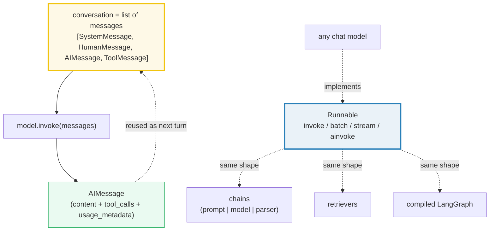
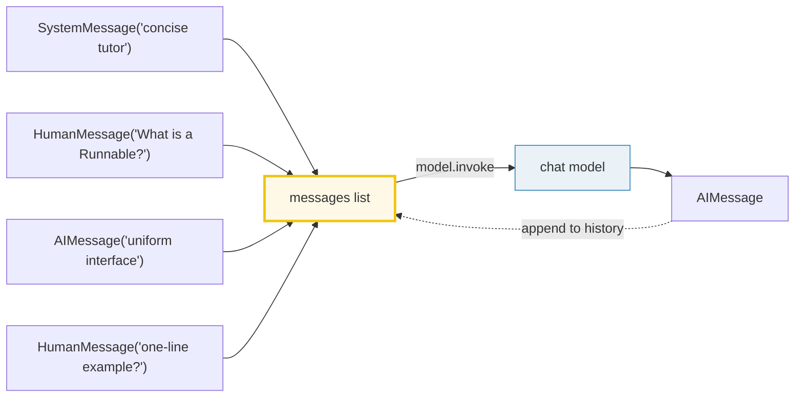

# LC Models & Messages — The Runnable Contract, `invoke`/`batch`/`stream`, and Message-Typed I/O

> **The one rule:** in LangChain, every chat model — and every chain, output
> parser, retriever, and compiled LangGraph graph — is a **`Runnable`**. That
> means the same `invoke` / `batch` / `stream` / `ainvoke` methods work
> everywhere, with **message-typed** input (`[SystemMessage, HumanMessage, …]`)
> and output (`AIMessage`). Once you know the contract, you can swap a fake test
> model for `ChatOpenAI` / `ChatAnthropic` without touching a line of business
> logic.

**Companion code:** [`lc_models_messages.py`](./lc_models_messages.py).
**Every value and table below is printed by `uv run python
lc_models_messages.py`** — change the code, re-run, re-paste. Nothing here is
hand-computed. Captured stdout lives in
[`lc_models_messages_output.txt`](./lc_models_messages_output.txt).

> **OFFLINE / NO API KEY.** This bundle uses **only**
> `FakeMessagesListChatModel` (from `langchain_core.language_models.fake_chat_models`),
> which returns canned `AIMessage`s deterministically. It runs anywhere — no
> network, no provider account, no rate limit, no key. The Runnable contract it
> demonstrates is **identical** to what a real chat model exposes; only the
> generation behind it differs.

**Goal of this bundle (lineage, old → new):**

> from *"I call an LLM provider's HTTP API directly (raw request/response,
> different code per provider)"*
> → *"LangChain chat models are Runnables: uniform `invoke`/`stream`/`batch`
> across providers, message-typed in/out, swappable — and I can develop and test
> completely offline with a fake model."*

🔗 Bundle **#36 of Phase 6**. This is the **on-ramp to the LangChain stack**:
the message format and the Runnable contract recur in every later bundle.
- Messages flow into prompts → [`LC_PROMPTS`](./LC_PROMPTS.md) (#37).
- The Runnable `|` operator composes chains → [`LC_CHAINS_LCEL`](./LC_CHAINS_LCEL.md) (#38).
- A growing message list *is* chat memory → [`LC_MEMORY`](./LC_MEMORY.md) (#39).
- `AIMessage.tool_calls` powers tool-using agents → [`LC_TOOLS_AGENTS`](./LC_TOOLS_AGENTS.md).

---

## 0. The three ideas on one page



| Question | Answer | Where it shows up |
|---|---|---|
| "What goes IN to a chat model?" | a `list[BaseMessage]` (or a `str` shorthand) | §A, §D |
| "What comes OUT?" | a single `AIMessage` (`.content`, `.tool_calls`, `.usage_metadata`) | §B, §G |
| "How do I call it?" | `model.invoke(...)` / `model.batch([...])` / `model.stream(...)` — uniform across every `Runnable` | §C |
| "How do I test without a key?" | `FakeMessagesListChatModel(responses=[...])` returns canned `AIMessage`s | §B, §F |

---

## 1. Message types — System / Human / AI / Tool

LangChain provides a **unified message format** that works across every chat
model, so you don't have to think about each provider's wire format. Every
message subclasses `BaseMessage`, carries a **role** (exposed as `.type`) and
**content** (usually a `str`), plus optional provider-specific metadata.

The four roles you will meet first:

| Class | `.type` | Role in the conversation |
|---|---|---|
| `SystemMessage` | `"system"` | prime the model's behavior / persona |
| `HumanMessage` | `"human"` | the user's turn |
| `AIMessage` | `"ai"` | the model's turn — adds `.tool_calls`, `.usage_metadata` |
| `ToolMessage` | `"tool"` | the *result* of a tool call, fed back to the model (needs `tool_call_id`) |

(There is also `AIMessageChunk` for streaming — same shape, supports `+` to
merge — and `RemoveMessage`, a LangGraph helper for trimming history. Both are
deferred to sibling bundles.)

> From `lc_models_messages.py` Section A:
> ```
> ======================================================================
> SECTION A — Message types: System/Human/AI/Tool; .type, .content, .tool_calls
> ======================================================================
> LangChain's unified message format (python.langchain.com/docs/concepts/
> messages): every message has a ROLE and CONTENT. Each subclass maps to a
> role; .type exposes the role string; AIMessage adds .tool_calls and
> .usage_metadata (both empty by default).
> 
> class           type      content
> --------------------------------------------------------
> SystemMessage   system    'You are a helpful assistant.'
> HumanMessage    human     'What is 2+2?'
> AIMessage       ai        '2 + 2 = 4'
> ToolMessage     tool      '4'
> 
> AIMessage.tool_calls        = []
> AIMessage.invalid_tool_calls= []
> AIMessage.usage_metadata    = None
> 
> [check] SystemMessage.type == 'system': OK
> [check] HumanMessage.type == 'human': OK
> [check] AIMessage.type == 'ai': OK
> [check] ToolMessage.type == 'tool': OK
> [check] AIMessage.tool_calls defaults to []: OK
> [check] AIMessage.usage_metadata defaults to None: OK
> ```

### Why there are *separate classes* per role (internals)

The role isn't a free-form string — it's baked into the class because providers
disagree on where the role goes. OpenAI/Anthropic put `system` in the messages
list; some providers (older Claude, certain OSS models) take it as a *separate
API parameter*; a few don't support it at all. LangChain's chat-model adapters
peek at `isinstance(m, SystemMessage)` and route the content to the right slot
for each provider. So `SystemMessage` is not just a typed string — it is the
unit the provider-adapter code dispatches on. `AIMessage` is special the other
way: it carries the **standardized** fields (`tool_calls`,
`invalid_tool_calls`, `usage_metadata`, `id`) that LangChain normalizes out of
each provider's raw response so your downstream code never has to grok
OpenAI-vs-Anthropic JSON.

🔗 `ToolMessage` only makes sense paired with an `AIMessage.tool_calls` entry —
that round-trip is the entire subject of [`LC_TOOLS_AGENTS`](./LC_TOOLS_AGENTS.md).

---

## 2. `model.invoke([...])` — the one call you'll write most

A chat model's `.invoke()` takes a `list[BaseMessage]` (or a `str`, which
LangChain auto-wraps in a `HumanMessage`) and returns exactly one `AIMessage`.
The example below uses `FakeMessagesListChatModel`, which returns a **canned**
`AIMessage` from its `responses` list and ignores the input — perfect for
reproducible demos and tests.

```python
from langchain_core.language_models.fake_chat_models import FakeMessagesListChatModel
from langchain_core.messages import AIMessage, HumanMessage

model = FakeMessagesListChatModel(responses=[AIMessage(content="hi there")])
out   = model.invoke([HumanMessage(content="hello")])
# out is an AIMessage; out.content == "hi there"
```

The single most important fact about that snippet: **swap one line** —
`FakeMessagesListChatModel(...)` → `ChatOpenAI(model="gpt-4o-mini")` or
`ChatAnthropic(model="claude-3-5-sonnet-latest")` — and **every other line runs
unchanged**. The `.invoke()` signature, the message types, and the `AIMessage`
return type are all part of the Runnable contract, not the provider.

> From `lc_models_messages.py` Section B:
> ```
> ======================================================================
> SECTION B — model.invoke([...messages]) with FakeMessagesListChatModel
> ======================================================================
> A chat model is a Runnable. .invoke takes a list of messages and returns
> ONE AIMessage. Here the model is FakeMessagesListChatModel — it returns a
> canned AIMessage regardless of input. Swap 'FakeMessagesListChatModel' for
> 'ChatOpenAI'/'ChatAnthropic' and the SAME line runs against a real model.
> 
> type(model).__name__ = FakeMessagesListChatModel
> type(out).__name__   = AIMessage
> out.type             = 'ai'
> out.content          = 'hi there'
> 
> [check] model.invoke returns an AIMessage: OK
> [check] out.content == 'hi there' (canned response): OK
> [check] out.type == 'ai': OK
> ```

### Why `.invoke` always returns a single message (internals)

`invoke` is defined on `RunnableSerializable` and is contractually
**one input → one output**. Under the hood, `BaseChatModel.invoke(input)` calls
`_generate(messages)`, which returns a `ChatResult` whose `.generations` is a
list (some providers support `n > 1` candidate generations); `invoke` returns
the *first* generation's message. If you want all `n` candidates, call
`.generate()` and walk `ChatResult.generations` yourself. The "one message per
invoke" rule is what makes the Runnable interface composable: a chain's output
is a fit input for the next Runnable.

🔗 Composing Runnables with `|` is [`LC_CHAINS_LCEL`](./LC_CHAINS_LCEL.md) (#38).

---

## 3. The Runnable interface — `invoke` / `batch` / `stream`

The Runnable interface is the **uniform surface** across the entire LangChain
stack. Whether you hold a chat model, a prompt template, a retriever, an output
parser, or a compiled LangGraph, these methods exist and mean the same thing:

| Method | Input | Output | When to reach for it |
|---|---|---|---|
| `invoke(input)` | one input | one output | the default; one user turn |
| `batch([in₁, in₂, …])` | list of inputs | list of outputs | fan-out / parallelism (default: threadpool) |
| `stream(input)` | one input | generator of chunks | show tokens to the user as they arrive |
| `ainvoke` / `abatch` / `astream` | same | `async` equivalents | inside `async def`, with `await` |

The component input/output types vary — a `ChatModel` eats messages and emits a
`ChatMessage`; a `Retriever` eats a `str` and emits `list[Document]`; an
`OutputParser` eats an LLM message and emits whatever it parses. **The method
*names* and *shapes* don't vary** — that's the whole point of Runnable.

> From `lc_models_messages.py` Section C:
> ```
> ======================================================================
> SECTION C — The Runnable interface: invoke / batch / stream
> ======================================================================
> The Runnable contract (python.langchain.com/docs/concepts/runnables/) is
> UNIFORM across chat models, chains, output parsers, retrievers, and
> compiled LangGraph graphs:
> 
>   invoke(input)           -> single output
>   batch([in1, in2, ...])  -> list of outputs (parallel; threadpool)
>   stream(input)           -> generator yielding output chunks
> 
> Below: ONE canned AIMessage is reused for every call, so batch's parallel
> ordering cannot perturb the captured output.
> 
> invoke(...)  -> AIMessage, content='ack'
> batch([...3]) -> list, len=3, contents=['ack', 'ack', 'ack']
> stream(...)  -> 1 chunk(s); first chunk class=AIMessage, content='ack'
> (Real models yield AIMessageChunk tokens; the fake has no _stream
>  override, so BaseChatModel.stream falls back to the full message.)
> 
> [check] invoke returns an AIMessage: OK
> [check] batch returns a list: OK
> [check] batch returns 3 outputs (one per input): OK
> [check] every batch output is an AIMessage: OK
> [check] stream yields >=1 chunk: OK
> [check] stream chunk is a BaseMessage: OK
> ```

### Why `batch` is parallel and order-preserving (internals)

`Runnable.batch` is implemented on the base class as "run `invoke` for each
input on a `ThreadPoolExecutor`, collect results in input order". That gives
free parallelism for **I/O-bound** work (HTTP calls to a provider) — and on
CPython it's the *right* tool, because the GIL serializes the Python-level
work anyway, so threads don't fight for CPU. The result list is **indexed by
input position**, not completion order, so callers see deterministic ordering
even though requests fly concurrently. If you want results *as they finish*
(out-of-order), use `batch_as_completed`. Cap concurrency with
`config={"max_concurrency": N}`.

### Why the fake's `stream` returns one big chunk (internals)

`BaseChatModel` has a default `stream` that calls `_generate` once and yields
the resulting message as a single chunk. A **real** chat model overrides
`_stream` to yield incremental `AIMessageChunk`es as tokens arrive over the
network — that is what makes a chat UI feel live. `FakeMessagesListChatModel`
does **not** override `_stream` (its source has only `_generate`), so it falls
back to the base behavior: one chunk holding the whole canned message. To test
token-by-token streaming offline, reach for its sibling
`GenericFakeChatModel`, whose `_stream` splits content on whitespace. The
*interface* (`for chunk in model.stream(...)`) is the same in all three cases.

---

## 4. A conversation is a list of messages

The single input to `invoke` is a **whole conversation**, not just the latest
user utterance. You pass a Python list representing the chat history in
chronological order: system prompt first, then alternating `HumanMessage` /
`AIMessage` turns, plus any `ToolMessage` results. The model sees the entire
list — there is no hidden server-side memory in the LangChain message API; **if
you want the model to remember, you re-send the history every call.**



> From `lc_models_messages.py` Section D:
> ```
> ======================================================================
> SECTION D — A conversation is a list of messages (chat history)
> ======================================================================
> invoke() takes the WHOLE conversation as a list — system prompt, prior
> turns, tool results — and the model sees every message in order. Below we
> hand it a 4-message history; the fake model ignores the contents but the
> interface accepts the full list and returns a fresh AIMessage.
> 
> #  type      content
> ------------------------------------------------------------
> 0  system    'You are a concise tutor.'
> 1  human     'What is a Runnable?'
> 2  ai        'A uniform interface: invoke/batch/stream.'
> 3  human     'Give me a one-line example.'
> 
> len(history) = 4
> out.type     = 'ai'
> out.content  = "model.invoke([HumanMessage('hi')])"
> 
> [check] history has 4 messages: OK
> [check] history[0] is the SystemMessage: OK
> [check] history[-1] is a HumanMessage: OK
> [check] invoke over a 4-message history still returns an AIMessage: OK
> ```

### Why memory is *your* job (internals)

HTTP is stateless; providers don't store your conversation between calls. The
LangChain message list is the **only** place history lives — every turn you
append the model's `AIMessage` and the next `HumanMessage`, then re-send the
whole thing. That sounds wasteful but it's how every provider's chat API works
under the hood (and why token *input* counts grow over a long conversation).
Two consequences: (1) long histories cost real money and hit context windows,
so you need **trimming/summarization** strategies; (2) the same message list,
serialised, is a perfectly transportable conversation log.

🔗 Managing that growing list — windowed trimming, summarization, LangGraph
checkpoints — is [`LC_MEMORY`](./LC_MEMORY.md) (#39).

---

## 5. Content: a string, *or* a list of content blocks

`message.content` is **usually a `str`** — that's the 99% case for chat. For
multimodal or structured payloads it may instead be a **list of content
blocks**, each a `dict` with a `"type"` key (`"text"`, `"image"`,
`"tool_use"`, …). The exact block shape is **provider-specific**: Anthropic
uses `{"type": "image", "source": {...}}`, OpenAI uses
`{"type": "image_url", "image_url": {"url": ...}}`. LangChain deliberately
does **not** normalize `content` — it passes your list through. You either
build provider-native blocks yourself or use a helper like
`convert_to_openai_messages` / `convert_to_anthropic_messages` to translate.

> From `lc_models_messages.py` Section E:
> ```
> ======================================================================
> SECTION E — content: a string OR a list of content blocks
> ======================================================================
> message.content is usually a Python str. For multimodal or structured
> content it can also be a LIST of blocks (text / image / tool_use / ...).
> The exact block shape is provider-specific; LangChain passes it through.
> 
> text_msg.content     = 'What color is the sky?'
>                        (type=str)
> blocks_msg.content   = [{'type': 'text', 'text': 'Describe this image:'}, {'type': 'image', 'source_type': 'url', 'url': 'https://example.com/sky.png'}]
>                        (type=list, 2 blocks)
> block[0]['type']     = 'text'
> block[1]['type']     = 'image'
> 
> [check] string content has type str: OK
> [check] block content has type list: OK
> [check] blocks_msg has 2 content blocks: OK
> [check] first block is a text block: OK
> ```

### Why `content` isn't standardized (internals)

The LangChain docs say it explicitly: *"the `content` property is **not**
standardized across different chat model providers, mostly because there are
still few examples to generalize from."* The fields that **are** standardized
live as separate `AIMessage` attributes — `tool_calls`, `usage_metadata`, `id`,
`invalid_tool_calls`. So when you write provider-portable code, prefer reading
those named attributes over picking apart `content` as a list of blocks. If you
*must* inspect blocks, branch on the provider or use the conversion helpers.

---

## 6. Why develop against a fake model

`FakeMessagesListChatModel` is a `BaseChatModel` subclass whose `_generate`
returns `self.responses[self.i]` and advances a cyclic counter. That tiny
contract is what lets this entire bundle run **offline, deterministically, and
without credentials**:

- **Deterministic** — same `responses=[...]` ⇒ same byte-for-byte output on
  every run, every machine. (Critical for a tutorial guide that pastes output
  verbatim, and for golden-file unit tests.)
- **Offline** — no network, no provider account, no API key, no rate limit, no
  cost. CI runs without secrets.
- **Uniform contract** — it implements the *same* Runnable methods
  (`invoke`/`batch`/`stream`/`ainvoke`) as `ChatOpenAI` / `ChatAnthropic`.
- **Swap-in safe** — tests written against the fake pass unchanged when you
  later swap in a real model. The fake is a **test double**, not a special
  case: production code never branches on "is this a fake?".

What real models add on top: actual generation, true token-by-token streaming
(via overridden `_stream`), `usage_metadata` populated from the provider's
billing fields, and live `tool_calls` the model actually decided to emit. The
Runnable contract above is identical either way.

> From `lc_models_messages.py` Section F:
> ```
> ======================================================================
> SECTION F — Why a fake model: offline, deterministic, key-free
> ======================================================================
> FakeMessagesListChatModel is a BaseChatModel subclass that returns a
> canned response list. Properties that make it the right tool here:
> 
>   * DETERMINISTIC: same responses list -> same output, byte-for-byte.
>   * OFFLINE:       no network, no provider, no API key, no rate limit.
>   * UNIFORM:       it implements the SAME Runnable methods as
>                    ChatOpenAI / ChatAnthropic — invoke/batch/stream.
>   * SWAP-IN SAFE:  tests written against the fake pass unchanged when
>                    you swap in a real model behind the same interface.
> 
> Real providers add: real text generation, token-level streaming,
> usage_metadata from the API, and live tool-calling. The Runnable contract
> above stays identical — that is why the fake is a faithful test double.
> 
> has invoke/batch/stream: True
> _llm_type               = 'fake-messages-list-chat-model'
> 
> [check] FakeMessagesListChatModel exposes invoke/batch/stream: OK
> [check] FakeMessagesListChatModel is a BaseChatModel subclass: OK
> ```

### Why this matters for TDD on agents (internals)

LLM-based systems are notoriously hard to test: outputs drift, each run costs
money, and latency makes suites slow. A deterministic fake lets you write
ordinary `assert`-based tests for the *plumbing* — message routing, prompt
assembly, tool-call parsing, chain composition, retry/backoff — without paying
for or waiting on a real model. The pattern is: **fake for unit tests,
real-model integration tests behind a marker** (`pytest -m integration`).
LangChain ships both `FakeMessagesListChatModel` (canned list) and
`GenericFakeChatModel` (iterator, with whitespace-chunked `_stream`) for
exactly this split.

---

## 7. `AIMessage.tool_calls` — when the model decides to call a tool

An `AIMessage` doesn't have to carry prose. When the model decides a tool is
needed, it emits a **tool call**: the `AIMessage.tool_calls` attribute is a
list of dicts, each with the standardized keys `name`, `args`, `id`, and
`type`. The downstream code (your agent loop, or LangGraph) reads that list,
dispatches each call to the matching Python function, and feeds the results
back as `ToolMessage`s keyed by the same `tool_call_id`. With a real
tool-calling model this is real; with the fake we **canned** an `AIMessage`
that already has `tool_calls=[{...}]` set, so we can assert the parsing shape
deterministically.

```python
canned = AIMessage(
    content="",
    tool_calls=[{"name": "get_weather",
                 "args": {"city": "San Francisco"},
                 "id": "call_abc123"}],
)
# When constructed this way, LangChain normalizes each entry to:
#   {"name": ..., "args": ..., "id": ..., "type": "tool_call"}
```

> From `lc_models_messages.py` Section G:
> ```
> ======================================================================
> SECTION G — AIMessage.tool_calls: the model decides to call a tool
> ======================================================================
> An AIMessage can carry .tool_calls — a list of {name, args, id, type}
> dicts the model produced instead of (or alongside) plain text. With a real
> tool-calling model this is how agents hand off to tools; with the fake
> model we CANNED one to assert the parsing shape. (🔗 LC_TOOLS_AGENTS.)
> 
> len(out.tool_calls)      = 1
> tool_call keys           = ['args', 'id', 'name', 'type']
> tc['type']               = 'tool_call'
> tc['name']               = 'get_weather'
> tc['args']               = {'city': 'San Francisco', 'units': 'metric'}
> tc['id']                 = 'call_abc123'
> out.invalid_tool_calls   = []
> 
> [check] invoke returns an AIMessage carrying tool_calls: OK
> [check] tool_call has 'name' key: OK
> [check] tool_call has 'args' key: OK
> [check] tool_call name is 'get_weather': OK
> [check] tool_call args.city == 'San Francisco': OK
> [check] parsed tool_call carries 'type' == 'tool_call': OK
> ```

### Why `tool_calls` is a *standardized* field (internals)

OpenAI returns tool calls under
`choices[0].message.tool_calls[*].function.{name,arguments}` (with
`arguments` as a JSON **string**); Anthropic puts them under
`content[*].type == "tool_use"` with `input` as a **dict**. LangChain's
provider adapters normalize both into the same
`{"name": str, "args": dict, "id": str, "type": "tool_call"}` shape on
`AIMessage.tool_calls`, so your agent loop is provider-agnostic. When parsing
fails (malformed JSON, missing field), LangChain puts the partial entry on
`AIMessage.invalid_tool_calls` instead of raising — your code can decide
whether to retry, surface to the user, or ignore. **Never** hand-parse
`additional_kwargs["function_call"]` (the legacy shape); always read
`.tool_calls` / `.invalid_tool_calls`.

🔗 The full agent loop — bind tools, dispatch, feed `ToolMessage` back — is
[`LC_TOOLS_AGENTS`](./LC_TOOLS_AGENTS.md).

---

## Pitfalls

| Trap | Example | The fix |
|---|---|---|
| Assuming the model remembers prior turns | calling `invoke([HumanMessage("again")])` after a prior call and expecting context | re-send the **whole** message list every call; history lives in *your* code, not the server (🔗 `LC_MEMORY`) |
| Mutating a message list in place across calls | `messages.append(...); model.invoke(messages)` then later `messages.pop()` changes what a *different* branch sees | treat message lists as immutable per-call; copy (`[*msgs, new]`) before appending |
| Passing a single message instead of a list | `model.invoke(HumanMessage("hi"))` — works only because of an implicit coercion path | pass a **list**: `model.invoke([HumanMessage("hi")])`; the str shorthand `model.invoke("hi")` is also supported |
| Hand-parsing `additional_kwargs["function_call"]` | brittle, misses Anthropic's `tool_use` shape | read `.tool_calls` / `.invalid_tool_calls` — they are the **standardized** fields |
| Relying on `content` always being a `str` | `m.content.upper()` crashes when a vision model returns a list of blocks | `if isinstance(m.content, str): ...` or use the conversion helpers before inspecting |
| Expecting `batch` to preserve *completion* order | results come back in **input** order, but finish whenever | use `batch` for in-order results, `batch_as_completed` for as-ready; cap with `max_concurrency` |
| Assuming the fake streams token-by-token | `FakeMessagesListChatModel.stream` yields **one** full `AIMessage` chunk | use `GenericFakeChatModel` (whitespace-split `_stream`) or a real model to test chunk-by-chunk streaming |
| `FakeMessagesListChatModel` with N>1 responses + `batch` | `_generate` advances a shared `i` counter from parallel threads → non-deterministic per-index content | use **one** canned response when you need byte-stable batch output, or assert on the *set* of contents |
| Treating `AIMessage.id` as stable in tests | the id (`run-<uuid>-<idx>`) is assigned at invoke time and is **not** deterministic | assert on `.content`/`.type`/`.tool_calls`; never on `.id` |
| Forgetting `ToolMessage` needs `tool_call_id` | `ToolMessage(content="4")` raises a validation error | always pass `tool_call_id=` matching the originating `AIMessage.tool_calls[i]["id"]` |

---

## Cheat sheet

- **Four message classes:** `SystemMessage` (`type="system"`),
  `HumanMessage` (`"human"`), `AIMessage` (`"ai"`), `ToolMessage` (`"tool"`).
  All subclass `BaseMessage`; all carry `.content` and `.type`.
- **`AIMessage` extra fields:** `.tool_calls` (list, default `[]`),
  `.invalid_tool_calls` (list, default `[]`), `.usage_metadata` (default
  `None`), `.id`. These are the **standardized** fields; `.content` is **not**
  standardized.
- **The Runnable contract:** every chat model / chain / retriever / parser /
  LangGraph exposes `invoke` (1→1), `batch` ([…])→[…], parallel threadpool),
  `stream` (1→generator of chunks), plus `a*` async variants.
- **invoke shape:** `model.invoke([HumanMessage("...")])` → `AIMessage`. A bare
  string (`model.invoke("...")`) is auto-wrapped as a single `HumanMessage`.
- **Conversation = the whole list:** re-send `[System, Human, AI, Human, ...]`
  every call; the server is stateless. Trim/summarize to control cost and
  context window (🔗 `LC_MEMORY`).
- **content is `str` *or* `list[block]`:** prefer reading the named
  `AIMessage` fields over parsing `content`; convert between providers with
  `convert_to_openai_messages` / `convert_to_anthropic_messages`.
- **`tool_calls`:** normalized list of `{name, args, id, type="tool_call"}`;
  failures go to `invalid_tool_calls`. Feed results back as
  `ToolMessage(content=..., tool_call_id=...)`.
- **Offline test double:** `FakeMessagesListChatModel(responses=[AIMessage(...)])`
  — deterministic, no key, swap-in-safe. For streamed-fake tests use
  `GenericFakeChatModel`. Real models add generation, real streaming,
  `usage_metadata`, live `tool_calls`; the Runnable contract is identical.
- **`batch` ordering:** results are indexed by **input** position (not
  completion order); use `batch_as_completed` for as-ready; cap with
  `config={"max_concurrency": N}`.

---

## Sources

- **LangChain docs — Concepts: Messages.**
  https://python.langchain.com/docs/concepts/messages/
  *Defines role/content/metadata; the four roles (system, user, assistant,
  tool); the `AIMessage` standardized fields table (`content` raw,
  `tool_calls`/`invalid_tool_calls`/`usage_metadata`/`id` standardized); the
  statement that `content` is **not** standardized. Quoted/paraphrased in §1,
  §5, §7.*
- **LangChain docs — Concepts: Runnable interface.**
  https://python.langchain.com/docs/concepts/runnables/
  *The Runnable contract: "invoke: single input → output; batch: multiple
  inputs → outputs in parallel; stream: outputs streamed as produced"; the
  per-component input/output type table (ChatModel: messages → ChatMessage,
  Retriever: str → List[Documents], …); the note that default `batch` uses a
  `ThreadPoolExecutor` (GIL ⇒ effective only for I/O-bound work). Basis for §3.*
- **LangChain API reference — `FakeMessagesListChatModel`.**
  https://reference.langchain.com/python/langchain-core/language_models/fake_chat_models/FakeMessagesListChatModel/
  *"Fake chat model for testing purposes." Bases `BaseChatModel`; fields
  `responses: list[BaseMessage]` ("cycle through in order"), `sleep`, `i`
  ("internally incremented after every model invocation"). Verified against the
  installed source (`_generate` reads `responses[self.i]`, advances modulo
  length). Basis for §2, §6.*
- **LangChain source — `langchain_core/language_models/fake_chat_models.py`.**
  (`GenericFakeChatModel._stream` splits `content` on `re.split(r"(\s)",
  content)`; `FakeMessagesListChatModel` overrides only `_generate`.) Read via
  `inspect.getsource` on the installed `langchain_core==1.4.8`. Confirms §3's
  "fake has no `_stream` override → falls back to one full-message chunk".*
- **LangChain docs — Concepts: Chat models (interface & methods).**
  https://python.langchain.com/docs/concepts/chat_models/
  *Chat models implement the Runnable interface; `invoke` accepts a string,
  list of messages, or PromptValue and returns a chat message; `stream` /
  `batch` / async variants available on all models. Cross-cited with the
  Messages and Runnables pages above.*
- **Reddit / blog confirmation — deterministic testing with fakes.**
  https://blog.sixty-north.com/deterministic-testing-for-langchain-agents.html
  *"Tests for LLM-based agents face a triple challenge: each run hits a paid
  API, produces non-deterministic outputs, and is slow." Independent motivation
  for the fake-model pattern in §6.*
