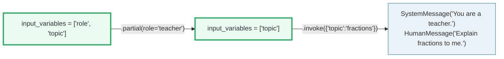
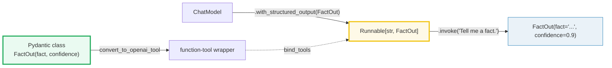

# LangChain Prompts — `ChatPromptTemplate` is a Typed, Reusable, Composable Prompt

> **The one rule:** an f-string is a *one-shot string*. A `ChatPromptTemplate`
> is a **typed, reusable, composable runnable** — it declares its variables up
> front, validates them, lets you pre-fill some and inject others at runtime,
> embeds few-shot examples, and snaps into the uniform `prompt | model | parser`
> pipeline. Stop f-stringing your prompts.

**Companion code:** [`lc_prompts.py`](./lc_prompts.py). **Every value, message
list, and `[check]` below is printed by `uv run python lc_prompts.py`** — change
the code, re-run, re-paste. Nothing here is hand-computed. Captured stdout
lives in [`lc_prompts_output.txt`](./lc_prompts_output.txt).

**Goal of this bundle (lineage, old → new):**

> from *"I f-string my prompts together with `f'...{topic}...'`"*
> → *"`ChatPromptTemplate` is a typed, reusable, composable prompt: variables,
> partials, few-shot, and structured-output schemas that turn free-form text
> into a deterministic, testable step."*

🔗 Builds on [LC_MODELS_MESSAGES](./LC_MODELS_MESSAGES.md) (P6 #36) — the
`BaseMessage` / `HumanMessage` / `AIMessage` model layer this whole bundle
renders into. Forwards to [LC_CHAINS_LCEL](./LC_CHAINS_LCEL.md) (P6 #38), where
`prompt | model | parser` becomes a single runnable, and to
[LC_MEMORY](./LC_MEMORY.md) (P6 #39), where the `MessagesPlaceholder` slot is
fed by a chat-history store. Structured-output schemas are the bridge to
output parsers.

---

## 0. The shape of a typed prompt

```mermaid
graph LR
    Tpl["ChatPromptTemplate<br/>input_variables = ['topic']"] -->|".invoke({'topic':'cats'})"| CPV["ChatPromptValue<br/>(typed message list)"]
    CPV -->|".to_messages()"| ML["[SystemMessage, HumanMessage(...'cats'...)]"]
    ML --> Model["chat model<br/>(real or FakeMessagesListChatModel)"]
    Tpl -.->"|.partial(role='teacher')|" Tpl2["new template<br/>input_variables = ['topic']"]
    style Tpl fill:#eafaf1,stroke:#27ae60,stroke-width:3px
    style CPV fill:#fef9e7,stroke:#f1c40f
    style ML fill:#eaf2f8,stroke:#2980b9
    style Tpl2 fill:#eafaf1,stroke:#27ae60
```

The four questions this bundle answers:

| Question | LangChain answer | Section |
|---|---|---|
| "How do I declare `{vars}` in a chat prompt?" | `ChatPromptTemplate.from_messages([("user", "...{topic}...")])` | §1 |
| "What happens if I forget a var?" | a `KeyError` naming the missing var, at the template boundary | §2 |
| "Can I pre-fill some vars now and the rest later?" | `.partial(role='teacher')` returns a new template with fewer `input_variables` | §3 |
| "String vs chat prompt — when each?" | `PromptTemplate` → one string (legacy LLMs); `ChatPromptTemplate` → typed message list (every chat model) | §4 |
| "How do I show the model examples?" | interleave `("human", ...)` / `("ai", ...)` tuples before the real `{input}` slot | §5 |
| "How do I force a parsed object out of the model?" | `model.with_structured_output(Schema)` — binds the schema as a tool the model must call | §6 |
| "How do I inject chat history?" | `MessagesPlaceholder("history")` — a slot for an arbitrary list of `BaseMessage` | §7 |

---

## 1. `ChatPromptTemplate.from_messages` + variable substitution

`from_messages` takes a list of `(role, template)` tuples. Any `{name}` inside
a template is a **variable**; everything else is fixed text. At `.invoke({dict})`
time each variable is substituted, and the result is a `ChatPromptValue` — a
typed list of `BaseMessage` (the same `BaseMessage` from
[LC_MODELS_MESSAGES](./LC_MODELS_MESSAGES.md)) ready to feed a chat model.

`prompt.input_variables` is computed at construction by scanning the templates
for `{...}` placeholders. That is the **typed** part: the prompt *declares* its
inputs the way a function declares its parameters.

> From `lc_prompts.py` Section A:
> ```
> ======================================================================
> SECTION A — ChatPromptTemplate.from_messages + variable substitution
> ======================================================================
> from_messages takes (role, template) tuples. {topic} is a VARIABLE:
> at .invoke time it is substituted into the human message. The return
> is a ChatPromptValue (NOT a string) — a typed message list ready to
> feed a chat model.
> 
> prompt.input_variables = ['topic']
> 
> type(value)               = ChatPromptValue
> value.to_string()         = 'System: You are a helpful assistant.\nHuman: Tell me a joke about cats.'
> value.to_messages():
>   system : You are a helpful assistant.
>   human  : Tell me a joke about cats.
> 
> [check] invoke returns a ChatPromptValue: OK
> [check] two messages rendered (system + human): OK
> [check] {topic} substituted to 'cats': OK
> [check] first message is the system message: OK
> [check] second message is a HumanMessage: OK
> ```

### Why this beats an f-string (internals)

`ChatPromptTemplate` is a `Runnable[dict, ChatPromptValue]`. Being a `Runnable`
is the whole point: a prompt becomes a node you can compose (`prompt | model |
parser`), stream, batch, trace, and unit-test in isolation — none of which is
possible with a bare `f"..."`. The variable scan happens once at construction
(in `_get_input_variables`), not at every invoke, so the cost is paid upfront.

🔗 See [LC_CHAINS_LCEL](./LC_CHAINS_LCEL.md) for the `|` operator and why
everything in LangChain being a `Runnable` is the design choice that makes
chaining work at all.

---

## 2. Missing variable — a clear, early error

A plain f-string silently leaves `{topic}` in the output if you forget it. A
`ChatPromptTemplate` raises a `KeyError` **naming the missing variable** at the
template boundary, so the bug is caught before it ever reaches the model.

> From `lc_prompts.py` Section B:
> ```
> ======================================================================
> SECTION B — Missing variable: template raises instead of silently passing {x}
> ======================================================================
> A plain f-string would leave '{topic}' in the output if you forgot it.
> A ChatPromptTemplate raises a clear KeyError naming the missing var,
> so the bug is caught at the template boundary, not downstream.
> 
> prompt.invoke({}) raised: KeyError
>   message: "Input to ChatPromptTemplate is missing variables {'topic'}.  Expected: ['topic'] Received: []\nNote: if you intended {topic} to be part of the string and not a variable, please escape it with double curly braces like: '{{topic}}'.\nFor troubleshooting, visit: https://docs.langchain.com/oss/python/langchain/errors/INVALID_PROMPT_INPUT "
> 
> [check] missing var raises KeyError: OK
> [check] error names the missing variable 'topic': OK
> [check] error lists Expected: ['topic']: OK
> ```

**Expert detail:** the error suggests the fix for you — escape a literal `{x}`
with double braces (`{{x}}`) so it is treated as text, not a variable. That is
the same convention as Python's `str.format`. If you ever ship a prompt that
contains literal JSON with braces, you will need this escape.

---

## 3. `partial()` — pre-fill some vars, defer the rest

`.partial(**prefilled)` returns a **new** `ChatPromptTemplate` with those
variables baked in. The returned template has a **shorter `input_variables`**
list — the pre-filled vars are gone from it. The classic use is a prompt that
depends on (a) the logged-in user, fixed for the session, and (b) the actual
user input, varying per call: pre-fill (a) once, hand the partial off, and the
caller only needs to supply (b).



> From `lc_prompts.py` Section C:
> ```
> ======================================================================
> SECTION C — partial(): pre-fill some vars -> a template with fewer remaining
> ======================================================================
> .partial(**prefilled) returns a NEW ChatPromptTemplate with those vars
> baked in. The returned template has a SHORTER input_variables list, so
> you can hand it to a sub-pipeline that only knows the rest of the vars.
> 
> original.input_variables = ['role', 'topic']
> partial.input_variables  = ['topic']
> (role is gone — only topic remains)
> 
> teacher.invoke({'topic':'fractions'}) ->
>   system : You are a teacher.
>   human  : Explain fractions to me.
> 
> [check] original has both vars: OK
> [check] partial removed 'role' from input_variables: OK
> [check] partial kept 'topic' in input_variables: OK
> [check] {role} substituted to 'teacher': OK
> [check] {topic} substituted at invoke time: OK
> ```

### Why `partial` is non-destructive (internals)

`partial` copies the template and overrides `partial_variables`. The original
template is untouched — you can build a tree of partials off one base template
(one per role, one per locale, etc.) without mutating shared state. This is the
same "function with bound arguments" pattern as `functools.partial`, applied to
the prompt-as-`Runnable` abstraction.

---

## 4. `PromptTemplate` (string) vs `ChatPromptTemplate` (message list)

LangChain ships **two** prompt-template roots. They share the variable-scan
machinery but produce **different** prompt-value types:

| Template | `.invoke` returns | Backing type | Use when |
|---|---|---|---|
| `PromptTemplate` | `StringPromptValue` (one string) | a single `str` | you call a legacy string-in/string-out `LLM`, or you genuinely need one rendered string |
| `ChatPromptTemplate` | `ChatPromptValue` (a message list) | `list[BaseMessage]` | **every chat model** (system/human/ai roles), and every `prompt | model | parser` pipeline |

> From `lc_prompts.py` Section D:
> ```
> ======================================================================
> SECTION D — PromptTemplate (string) vs ChatPromptTemplate (message list)
> ======================================================================
> PromptTemplate is a SINGLE-STRING template. .invoke returns a
> StringPromptValue (one string). Use it for plain-text LLMs (the legacy
> string-in/string-out LLM API) or when you only need one rendered string.
> 
> ChatPromptTemplate is a MESSAGE-LIST template. .invoke returns a
> ChatPromptValue (a list of typed messages). Use it for every chat model
> (system/human/ai roles) and for any prompt | model | parser pipeline.
> 
> PromptTemplate.invoke   -> StringPromptValue: 'Translate: hola'
> ChatPromptTemplate.invoke -> ChatPromptValue
>   system : You are a translator.
>   human  : Translate: hola
> 
> [check] PromptTemplate.invoke returns StringPromptValue: OK
> [check] StringPromptValue.to_string() is a plain string: OK
> [check] ChatPromptTemplate.invoke returns ChatPromptValue: OK
> [check] ChatPromptValue yields 2 messages (system + human): OK
> [check] both share the same {sentence} variable substitution: OK
> ```

🔗 Both `StringPromptValue` and `ChatPromptValue` are `PromptValue` — the
shared interface that lets a chat model accept either (see
[LC_MODELS_MESSAGES](./LC_MODELS_MESSAGES.md)). In practice, almost all modern
code uses `ChatPromptTemplate`; reach for `PromptTemplate` only when integrating
with an old completion-style `LLM`.

---

## 5. Few-shot — bake example `(human, ai)` pairs into the template

Few-shot prompting means **showing** the model worked input/output examples
*before* the real query, so it learns the pattern from context. In a
`ChatPromptTemplate` this is just interleaving literal `("human", ...) /
("ai", ...)` tuples ahead of the real `("human", "{input}")` slot. The example
texts are **fixed** (no `{}` in them) so they do **not** appear in
`input_variables`; only `{input}` does.

> From `lc_prompts.py` Section E:
> ```
> ======================================================================
> SECTION E — Few-shot: example (human, ai) pairs inside the template
> ======================================================================
> Few-shot prompting = include worked input/output examples IN the
> template so the model sees the pattern before answering. In LangChain
> this is just interleaving literal ('human', ...) / ('ai', ...) tuples
> ahead of the real ('human', '{input}') slot. Variables in the example
> tuples are NOT counted as input_variables — they are fixed text.
> 
> prompt.input_variables = ['input']
> (only {input} is a real variable; the example texts are fixed)
> 
> rendered message count: 6  (system + 2 example pairs + 1 real query)
>   system : Classify the sentiment as 'positive' or 'negative'.
>   human  : I love this product!
>   ai     : positive
>   human  : This broke on day one.
>   ai     : negative
>   human  : It works as advertised.
> 
> [check] only 'input' is an input variable (examples are not): OK
> [check] rendered 6 messages: 1 system + 4 example + 1 query: OK
> [check] example AIMessage 'positive' is preserved verbatim: OK
> [check] example AIMessage 'negative' is preserved verbatim: OK
> [check] {input} substituted into the final human message: OK
> ```

**Beyond fixed examples:** when the example set is large or should be picked
dynamically per query, swap the literal tuples for
[`FewShotChatMessagePromptTemplate`](https://python.langchain.com/docs/how_to/few_shot_examples_chat/)
— it takes an `example_selector` (similarity, length, n-gram, …) and renders
the chosen examples into the same human/ai pair pattern. The static version
here is the deterministic, fully-offline base case.

---

## 6. `with_structured_output(Schema)` — bind a Pydantic schema to a model

`model.with_structured_output(Schema)` returns a **new runnable** that returns a
**parsed** object (a Pydantic instance, a `TypedDict`, or a `dict`) instead of
an `AIMessage`. Internally, for OpenAI / Anthropic / Gemini, it **binds the
schema as a tool** the model is forced to call, then **parses the tool-call
args** back into the schema. You get a typed, validated object straight from
the model — no regex, no `json.loads`, no ad-hoc parsing.



The Pydantic schema, its JSON Schema, and the tool wrapper a real model would
be bound to (printed by `convert_to_openai_tool(FactOut)`):

> From `lc_prompts.py` Section F:
> ```
> ======================================================================
> SECTION F — with_structured_output(Schema): bind a Pydantic schema to a model
> ======================================================================
> model.with_structured_output(Schema) returns a NEW runnable that
> returns a *parsed* object (Pydantic instance / TypedDict / dict) instead
> of an AIMessage string. Internally (for OpenAI/Anthropic/etc.) it binds
> the schema as a tool the model is FORCED to call, then parses the tool
> call args into the schema. Below: the schema, the bound tool, and the
> fake-model caveat.
> 
> FactOut.model_fields = ['fact', 'confidence']
> JSON Schema 'required' = ['fact', 'confidence']
> JSON Schema 'properties.fact.type' = string
> 
> convert_to_openai_tool(FactOut) — what a real model would be bound to:
> {
>   "type": "function",
>   "function": {
>     "name": "FactOut",
>     "description": "Schema for a fact + a confidence score. With a real chat model,\nwith_structured_output(FactOut) binds this as a tool the model must call,\nand the runnable returns a *parsed* FactOut instance (not free text).",
>     "parameters": {
>       "properties": {
>         "fact": {
>           "description": "A factual statement.",
>           "type": "string"
>         },
>         "confidence": {
>           "description": "Confidence score in [0.0, 1.0].",
>           "type": "number"
>         }
>       },
>       "required": [
>         "fact",
>         "confidence"
>       ],
>       "type": "object"
>     }
>   }
> }
> 
> [check] model exposes with_structured_output: OK
> fake.with_structured_output(FactOut) raised: NotImplementedError
>   msg: with_structured_output is not implemented for this model.
>   -> the FakeMessagesListChatModel inherits the base stub; a real
>      chat model (e.g. ChatOpenAI) binds the tool, parses the call,
>      and returns FactOut(fact=..., confidence=...). Demonstrated by
>      the schema + the tool above; the parsing path needs a real model.
> 
> [check] FactOut has fields fact, confidence: OK
> [check] JSON schema marks both fields required: OK
> [check] confidence has type 'number' in JSON schema: OK
> [check] convert_to_openai_tool emits a 'function' tool wrapper: OK
> ```

### Offline caveat (and what a real model would do)

`FakeMessagesListChatModel` inherits the **base** `with_structured_output`
stub, which raises `NotImplementedError`. That is correct: the fake model does
not honor a tool-calling API, so it cannot *enforce* the schema. The check
above asserts the **method exists and is callable** and the **schema compiles
to a valid tool wrapper** — the two offline-verifiable invariants. With a real
chat model (e.g. `ChatOpenAI`), the same call returns a runnable that:
1. binds `FactOut` as a forced tool via `convert_to_openai_tool`,
2. invokes the model (the model emits a tool call whose `args` match the
   schema),
3. parses those args into `FactOut(fact=..., confidence=...)`,
4. returns the Pydantic instance (or raises `OutputParserException` if the
   model lied and the args fail validation).

🔗 The same machinery underlies the **output parsers** family — when a model
cannot do tool calling (some open-weight locals), LangChain falls back to a
JSON prompt + `PydanticOutputParser`. See the output-parsers bundle.

---

## 7. `MessagesPlaceholder` — inject a dynamic list of messages (history)

`MessagesPlaceholder("name")` reserves a slot into which you pass an
**arbitrary list of `BaseMessage`** at invoke time. The classic use is **chat
history**: a fixed system message + the variable history + the new user
question, all rendered into one message list.

> From `lc_prompts.py` Section G:
> ```
> ======================================================================
> SECTION G — MessagesPlaceholder: inject a dynamic list of messages (history)
> ======================================================================
> MessagesPlaceholder('name') reserves a slot into which you pass an
> ARBITRARY list of BaseMessage at invoke time. The classic use is chat
> history: the system message + injected history + the new user question
> all render into one message list. (History usually lives in memory ->
> see LC_MEMORY.)
> 
> prompt.input_variables = ['history', 'question']
> history passed = ['HumanMessage', 'AIMessage']
> 
> rendered message count: 4  (system + 2 history + 1 question)
>   system : You are a helpful assistant.
>   human  : What is 2+2?
>   ai     : 4.
>   human  : And 3+3?
> 
> [check] input_variables includes 'history' and 'question': OK
> [check] rendered 4 messages (system + 2 history + 1 question): OK
> [check] history HumanMessage preserved verbatim: OK
> [check] history AIMessage preserved verbatim: OK
> [check] {question} substituted into the final human message: OK
> ```

**Shorthand:** `("placeholder", "{msgs}")` is the tuple form of
`MessagesPlaceholder("msgs")` — same behavior, less import boilerplate.

🔗 Where does `history` come from at runtime? In real apps it is loaded from a
per-conversation store — that is exactly the subject of
[LC_MEMORY](./LC_MEMORY.md) (P6 #39). The placeholder is the **seam** between
a memory module and the prompt: memory hands in a `list[BaseMessage]`, the
placeholder renders them in order.

---

## Why typed prompts beat f-strings (the three-layer payoff)

1. **Validation of variables.** `input_variables` is computed at construction,
   so a typo in a variable name (`{tpoic}`) is caught the moment the prompt is
   built — not when an empty value silently hits the model. Missing vars at
   invoke time raise a clear `KeyError` naming the offender (§2).
2. **Reuse & composition.** `partial()` (§3) lets you build a *family* of
   prompts from one base without mutating shared state. Because the template is
   a `Runnable`, it composes with `|` into `prompt | model | parser` (🔗
   [LC_CHAINS_LCEL](./LC_CHAINS_LCEL.md)). f-strings cannot do either.
3. **Testability.** A prompt with declared `input_variables` is a pure
   `dict -> PromptValue` function. You can unit-test it the way you test any
   pure function: feed it a dict, assert the rendered messages. No model, no
   network, no API key — every `[check] ... OK` in this bundle is such a test.

---

## Pitfalls

| Trap | Example | The fix |
|---|---|---|
| Forgetting a variable | `prompt.invoke({})` raises `KeyError: ... missing variables {'topic'}` | read the error — it names the var and the `Expected:` list; supply it, or `.partial()` it |
| Literal `{x}` you did not mean as a variable | template `"return {json}"` is parsed as variable `json` | escape as `"return {{json}}"` (the error message itself reminds you) |
| Using `PromptTemplate` for a chat model | you lose the system/human/ai role split and get one flat string | use `ChatPromptTemplate.from_messages([("system", ...), ("user", ...)])` for any chat model |
| Few-shot example texts containing `{`/`}` | `"example: {'key': 1}"` becomes a phantom variable | escape braces (`{{`/`}}`), or pull the example out of the template via `FewShotChatMessagePromptTemplate` |
| Treating `partial()` as mutating | `prompt.partial(role='x')` *returns a new* template; the original is unchanged | capture the return: `teacher = prompt.partial(role='teacher')` |
| Expecting `with_structured_output` to work on a fake/local model | `FakeMessagesListChatModel.with_structured_output(...)` raises `NotImplementedError` | use a real chat model that supports tool calling; or fall back to `PydanticOutputParser` + a JSON prompt |
| `MessagesPlaceholder` name ≠ key in `.invoke({...})` dict | `MessagesPlaceholder("history")` then `.invoke({"msgs": [...]})` raises | the placeholder's name and the dict key must match exactly |
| Assuming `to_string()` round-trips a chat prompt | `to_string()` is a debug aid (`"System: ...\nHuman: ..."`), not a parseable format | for the model, use `.to_messages()`; never re-parse `to_string()` |
| Mutating `partial_variables` on a shared base | two callers partial the same base and clobber each other's view | always call `.partial()` to get a private copy; do not poke `template.partial_variables` directly |

---

## Cheat sheet

- **`ChatPromptTemplate.from_messages([(role, tpl), ...])`** — declare a typed
  chat prompt with `{vars}`; `.invoke({dict})` returns a `ChatPromptValue`
  (`list[BaseMessage]`). `input_variables` is auto-scanned at construction.
- **`PromptTemplate.from_template(s)`** — single-string variant; `.invoke`
  returns a `StringPromptValue` (one `str`). Use only for legacy string LLMs.
- **Missing variable** → `KeyError` naming the var + the `Expected:` list.
  Escape a literal `{x}` as `{{x}}`.
- **`.partial(**prefilled)`** → a *new* template with those vars baked in;
  `input_variables` shrinks. The original is unchanged.
- **Few-shot** → interleave literal `("human", ex_in)` / `("ai", ex_out)`
  tuples before the real `("human", "{input}")` slot. Examples are fixed text;
  only `{input}` is a variable.
- **`model.with_structured_output(Schema)`** → a `Runnable` that returns a
  parsed Pydantic/TypedDict/dict. Real models bind the schema as a tool and
  parse the call; fakes/locals raise `NotImplementedError`. `Schema` must be a
  Pydantic class / `TypedDict` / JSON-schema dict / OpenAI tool dict.
- **`MessagesPlaceholder("name")`** (or `("placeholder", "{name}")`) → a slot
  for a `list[BaseMessage]` injected at invoke time; the classic seam for chat
  history.
- **Why typed beats f-string:** variables are validated at construction, the
  prompt is a `Runnable` that composes with `|`, and the whole thing is a pure
  `dict -> PromptValue` function you can unit-test with no model.

---

## Sources

- **LangChain — Conceptual guide: Prompt Templates.**
  https://python.langchain.com/docs/concepts/prompt_templates/
  *The authoritative description of `PromptTemplate` (single string) vs
  `ChatPromptTemplate` (message list), and of `MessagesPlaceholder` for
  injecting a list of messages. Quoted and reproduced in §1, §4, and §7.*
- **LangChain — How-to: Partially format prompt templates.**
  https://python.langchain.com/docs/how_to/prompts_partial/
  *Documents `.partial(**kwargs)` returning a new template with a shorter
  `input_variables` list. Basis for §3.*
- **LangChain — How-to: Few-shot examples for chat models.**
  https://python.langchain.com/docs/how_to/few_shot_examples_chat/
  *The literal `("human", ...) / ("ai", ...)` interleaving pattern used in §5,
  and the `FewShotChatMessagePromptTemplate` upgrade path for dynamic example
  selection.*
- **LangChain — How-to: Return structured data from a model.**
  https://python.langchain.com/docs/how_to/structured_output/
  *`model.with_structured_output(Schema)` accepting a Pydantic class, a
  `TypedDict`, a JSON Schema, or an OpenAI tool schema, and returning a parsed
  object. Basis for §6.*
- **LangChain — Conceptual guide: Structured outputs.**
  https://python.langchain.com/docs/concepts/structured_outputs/
  *The mechanism: structured output is (typically) implemented by binding the
  schema as a tool the model is forced to call, then parsing the tool-call
  args. Referenced in §6.*
- **LangChain API reference — `ChatPromptTemplate`.**
  https://reference.langchain.com/python/langchain-core/prompts/chat/ChatPromptTemplate
  *`input_variables`, `partial_variables`, `.partial()`, and the `Runnable`
  interface. Referenced in §1 and §3.*
- **LangChain API reference — `convert_to_openai_tool`.**
  https://reference.langchain.com/python/langchain-core/utils/function_calling/convert_to_openai_tool
  *The function used in §6 to render a Pydantic class into the OpenAI
  tool/function wrapper a real model would be bound to.*
- **LangChain API reference — `with_structured_output` (BaseChatOpenAI).**
  https://reference.langchain.com/python/langchain-openai/chat_models/base/BaseChatOpenAI/with_structured_output
  *Confirms the real-model behavior: a forced tool call is returned in the
  `raw` `AIMessage`, then parsed into the schema. Basis for the §6 caveat on
  `FakeMessagesListChatModel`.*
