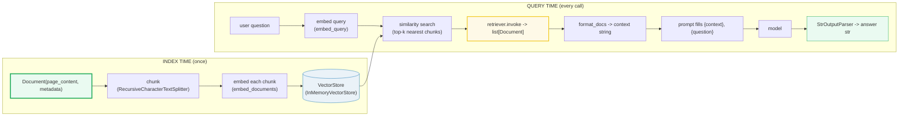

# LC RAG — Retrieval-Augmented Generation: Documents, Embeddings, Retrievers, and the LCEL Chain

> **The one rule:** RAG replaces "I paste the docs into the prompt" with "the
> **retriever** fetches the relevant chunks via **embeddings + similarity**, stuffs
> them into the prompt as **context**, and the model answers from them." The
> retriever is a **Runnable**, so the whole pipeline is one LCEL chain.

**Companion code:** [`lc_rag.py`](./lc_rag.py). **Every number, type name, and
worked example below is printed by `uv run python lc_rag.py`** — change the code,
re-run, re-paste. Nothing here is hand-computed. Captured stdout lives in
[`lc_rag_output.txt`](./lc_rag_output.txt).

> **OFFLINE / NO API KEY.** The embedder is a *seeded* `FakeEmbeddings` subclass;
> the model is a `FakeMessagesListChatModel`. No network, no key, byte-reproducible.
> **Caveat:** the fake vectors are DETERMINISTIC but SEMANTICALLY MEANINGLESS —
> the seed pins the noise, it does not encode meaning. So the similarity *ranking*
> in the examples is reproducible but NOT a signal of real topical relevance. We
> assert STRUCTURAL facts (counts, types, the chain runs end-to-end). Real
> embeddings (OpenAI, Sentence-Transformers, …) place semantically-similar texts
> NEAR each other; fake ones do not.

**Goal of this bundle (lineage, old → new):**

> from *"I paste docs into the prompt and hope the model finds the answer"*
> → *"RAG retrieves the relevant chunks via embeddings + similarity, stuffs them
> into the prompt as context, and the model answers from them; the retriever is a
> Runnable that plugs into LCEL."*

🔗 This is bundle **#40 of Phase 6**. It builds directly on
[`LC_CHAINS_LCEL`](./LC_CHAINS_LCEL.md) (the pipe, `RunnablePassthrough`, dict
branches — the RAG chain IS an LCEL chain) and [`LC_PROMPTS`](./LC_PROMPTS.md)
(the `{context}` / `{question}` template the chain fills). See
[`TODO.md`](./TODO.md) for the full plan.

---

## 0. The whole pipeline on one page



| Stage | LangChain object | Key method | Input → Output |
|---|---|---|---|
| **Document** | `Document` | — | text + metadata dict |
| **Embeddings** | `FakeEmbeddings` (real: `OpenAIEmbeddings`, …) | `embed_query`, `embed_documents` | `str → list[float]` |
| **Vector store** | `InMemoryVectorStore` (real: FAISS, Chroma, pgvector) | `add_documents`, `similarity_search` | store + search Documents |
| **Retriever** | `VectorStoreRetriever` (a `Runnable`) | `invoke(query)` | `str → list[Document]` |
| **RAG chain** | `RunnableSequence` | `invoke(question)` | `str → str` (answer) |

---

## 1. Document — the atom of retrieval

A `Document` is a piece of text (`page_content`) plus a free-form dict of tags
(`metadata`). Only `page_content` is **embedded**; `metadata` rides along so
that, at retrieval time, you know *where* a chunk came from (source URL, page
number, chunk offset, ACL tag). This separation is deliberate: the vector
captures *meaning*, the metadata captures *provenance*.

```python
from langchain_core.documents import Document

doc = Document(
    page_content="The cat is a small carnivorous mammal.",
    metadata={"source": "wiki", "topic": "animals"},
)
```

> From `lc_rag.py` Section A:
> ```
> ======================================================================
> SECTION A — Document: page_content (the text) + metadata (the tags)
> ======================================================================
> A Document is the atom of RAG: the text to be embedded/retrieved
> (page_content) plus a free-form dict of tags (metadata) that travel
> with it. metadata is where source URLs, page numbers, chunk offsets,
> and ACL tags live — it is NOT embedded, only stored alongside.
> 
> Document(page_content='The cat is a small carnivorous mammal.',
>           metadata={'source': 'wiki', 'topic': 'animals'})
> 
> field           value                                   type
> ----------------------------------------------------------------
> page_content    The cat is a small carnivorous mammal.  str
> metadata        {'source': 'wiki', 'topic': 'animals'}  dict
> 
> [check] doc.page_content is a str: OK
> [check] doc.metadata is a dict: OK
> [check] metadata carries the 'source' tag: OK
> [check] metadata is NOT embedded (it rides along, not in the vector): OK
> ```

### Why metadata is not embedded (internals)

`embed_query(text)` sees **only** the string. The `Embeddings` protocol
(`embed_documents`, `embed_query`) takes `str` / `list[str]` — there is no slot
for metadata. The vector store stores the `Document` object (text + metadata +
vector) under an id; `similarity_search` returns the **whole** `Document`, so
metadata surfaces at retrieval time but never enters the embedding. This is why
you can filter on metadata *after* retrieval without re-embedding.

---

## 2. Embeddings — text → fixed-dimension vector

An embedder maps text to a point in a fixed-dimension vector space. The contract
is two methods: `embed_query(str) → list[float]` (one query string) and
`embed_documents(list[str]) → list[list[float]]` (a batch). Both return vectors
of the **same** dimensionality — the store cannot mix dim-5 and dim-1536 vectors.

> ⚠️ **`FakeEmbeddings` is NOT seeded by default.** The stock class calls
> `np.random.default_rng()` with **no seed** (fresh OS entropy per call), so its
> vectors differ every run. This bundle uses a tiny subclass —
> `SeededFakeEmbeddings` — that seeds the RNG from `SHA-256(text)`, making the
> output byte-reproducible. The subclass IS a `FakeEmbeddings` (`isinstance`
> passes). **The vectors are still meaningless** — the hash pins the noise, it
> does not encode meaning. Real embeddings (OpenAI, Cohere, Sentence-Transformers)
> place semantically-similar texts near each other; these fill 5 slots with
> reproducible noise.

> From `lc_rag.py` Section B:
> ```
> ======================================================================
> SECTION B — Embeddings: text -> fixed-dim vector (dim 5; MEANINGLESS)
> ======================================================================
> An embedder maps text to a fixed-dimension vector. embed_query maps
> ONE query string; embed_documents maps a LIST. Both return
> dim-N lists of floats. Below: dim=5, seeded so output is stable.
> 
> embed_query('what is a cat?') ->
>   len   : 5
>   vector: [2.178, 1.393, 1.6912, 0.8718, -0.3147]
>   type  : list of float
> 
> embed_documents(['cat', 'dog']) ->
>   count : 2
>   lens  : [5, 5]
>   cat   : [0.1936, 0.7359, -0.6705, -0.5204, 0.2583]
>   dog   : [-0.8389, 0.0541, -0.8219, -0.1102, 0.8187]
>   same? : False  (different text -> different vector)
> 
> [check] embed_query returns a list of length 5: OK
> [check] embed_documents returns one vector per input text: OK
> [check] different texts map to different vectors: OK
> [check] isinstance(emb, FakeEmbeddings) (it IS a FakeEmbeddings): OK
> [check] vectors are MEANINGLESS: same-len noise, not topical similarity: OK
> ```

### Why embeddings work for retrieval (internals)

Real embedding models are trained so that texts with **similar meaning** map to
**nearby points** in vector space (contrastive objective: similar pairs pulled
together, dissimilar pairs pushed apart). "Nearby" is measured by **cosine
similarity** — the cosine of the angle between two vectors, ranging from −1
(opposite) through 0 (orthogonal) to 1 (identical direction). Cosine similarity
ignores vector magnitude, so it depends only on **direction** (the "topic
direction" in embedding space). This is why `InMemoryVectorStore` can rank
documents by relevance without ever understanding the words: it just compares
angles. `FakeEmbeddings` skips all of this — its vectors are random, so the
angles are random, so the ranking is random (but reproducible under our seed).

🔗 The fake model here mirrors the offline discipline in
[`LC_MODELS_MESSAGES`](./LC_MODELS_MESSAGES.md) (`FakeMessagesListChatModel`).

---

## 3. Vector store — index Documents, search by similarity

A vector store indexes Documents by their embedding vector.
`add_documents(docs, ids=[...])` embeds each `page_content` and stores
`(id, vector, text, metadata)`. `similarity_search(query, k=N)` embeds the query
and returns the **k nearest** Documents by cosine similarity.

```python
from langchain_core.vectorstores import InMemoryVectorStore

vs = InMemoryVectorStore(SeededFakeEmbeddings(size=5))
vs.add_documents(CORPUS, ids=["c1", "c2", "c3"])   # explicit ids -> stable
hits = vs.similarity_search("feline mammal", k=2)   # -> list[Document]
```

> From `lc_rag.py` Section C:
> ```
> ======================================================================
> SECTION C — InMemoryVectorStore: add_documents + similarity_search
> ======================================================================
> A vector store indexes Documents by their embedding vector.
> add_documents embeds each page_content and stores (id, vector, doc).
> similarity_search embeds the query, then returns the k nearest docs
> by cosine similarity. IDs are passed explicitly so output is stable.
> 
> vs.add_documents(CORPUS, ids=['c1', 'c2', 'c3']) -> ['c1', 'c2', 'c3']
> store size: 3 documents indexed
> 
> vs.similarity_search('feline mammal', k=2) ->
>   count   : 2
>   types   : ['Document', 'Document']
>   contents: ['A dog is a loyal domesticated canine.', 'Python is a high-level programming language.']
>   (ranking is reproducible noise, NOT real topical relevance)
> 
> [check] add_documents returns the explicit ids we passed: OK
> [check] similarity_search returns exactly k=2 docs: OK
> [check] every hit is a Document: OK
> [check] each hit carries its page_content + metadata: OK
> ```

> **Note on the ranking:** the query `"feline mammal"` returns the dog and
> Python docs — **not** the cat doc. With *real* embeddings it would return the
> cat doc (semantically closest). This is the FakeEmbeddings caveat in action:
> the count and types are correct, but the *order* is meaningless noise. This is
> exactly why we assert **structure** (count == 2, all Documents) rather than
> **semantics** (which specific docs come first).

### Why explicit ids matter (internals)

Without `ids=`, `InMemoryVectorStore` generates a **UUID4** per document — fresh
random entropy every run. That breaks byte-reproducibility (the ids appear in
output and in the store's dict keys). Passing explicit ids (`["c1", "c2",
"c3"]`) pins them. In production, derive ids deterministically from content
(e.g. `hashlib.sha256(page_content.encode()).hexdigest()`) so re-indexing the
same doc hits the same id (idempotent upsert) rather than creating duplicates.

🔗 Real backends: FAISS (in-memory, fast ANN), Chroma (embedded DB), pgvector
(Postgres extension) — same `add_documents` / `similarity_search` interface,
different storage and scale characteristics. Out of scope for this bundle.

---

## 4. Retriever — a Runnable that returns k Documents

`as_retriever(search_kwargs={"k": N})` wraps the vector store as a **retriever**:
an object whose `.invoke(query)` returns `list[Document]`. The crucial property
is that a retriever **is a `Runnable`** — so it pipes into LCEL with `|` and
joins the same uniform interface (invoke / stream / batch) as prompts, models,
and parsers.

```python
retriever = vs.as_retriever(search_kwargs={"k": 2})
docs = retriever.invoke("carnivore")   # -> list[Document], length 2
```

> From `lc_rag.py` Section D:
> ```
> ======================================================================
> SECTION D — as_retriever: a Runnable that returns k Documents
> ======================================================================
> as_retriever() wraps the vector store as a RETRIEVER — a Runnable
> whose .invoke(query) returns list[Document]. Because it is a Runnable
> it pipes into LCEL (| prompt | model | parser). search_kwargs={'k':
> N} fixes how many docs come back.
> 
> retriever = vs.as_retriever(search_kwargs={'k': 2})
> type(retriever)     : VectorStoreRetriever
> isinstance Runnable : True
> has .invoke         : True
> 
> retriever.invoke('carnivore') ->
>   count   : 2
>   types   : ['Document', 'Document']
> 
> [check] retriever is a Runnable: OK
> [check] retriever has .invoke (uniform interface): OK
> [check] retriever.invoke returns exactly k=2 docs: OK
> [check] every returned item is a Document: OK
> ```

### Why the retriever is a Runnable (internals)

`VectorStoreRetriever` subclasses `Runnable`. When you write
`retriever | format_docs`, the `|` (`__or__`) composes them into a
`RunnableSequence` — exactly the same mechanism as `prompt | model`. This is the
design payoff of LCEL: **everything is a Runnable**, so retrieval plugs into the
chain without an adapter. `search_kwargs={"k": N}` is baked into the retriever
at construction time; changing `k` means building a new retriever.

🔗 The pipe, `RunnablePassthrough`, and `RunnableSequence` are covered in
[`LC_CHAINS_LCEL`](./LC_CHAINS_LCEL.md) — the RAG chain below is just §G of
that bundle with a real retriever instead of a stub.

---

## 5. The RAG chain — retriever | format | prompt | model | parser → str

This is the whole point. A dict-branch builds `{"context": ..., "question":
...}`: the `context` key runs the retriever and formats the docs into one
string; the `question` key passes the raw query through. That dict feeds the
prompt, then the model, then `StrOutputParser`. `invoke(question)` returns a
**str** answer.

```python
def format_docs(docs):
    return "\n".join(d.page_content for d in docs)

chain = (
    {"context": retriever | format_docs, "question": RunnablePassthrough()}
    | prompt | model | StrOutputParser()
)
answer = chain.invoke("feline")   # -> str
```

> From `lc_rag.py` Section E:
> ```
> ======================================================================
> SECTION E — the RAG chain: retriever | format | prompt | model | parser -> str
> ======================================================================
> The canonical RAG chain is ONE LCEL pipeline. A dict-branch feeds
> 'context' (retriever | format_docs) and 'question' (passthrough) into
> the prompt; then model; then StrOutputParser. invoke(question) -> str.
> 
> chain = ({'context': retriever | format_docs,
>           'question': RunnablePassthrough()}
>          | prompt | model | StrOutputParser())
> 
> (retriever | format_docs).invoke('feline') ->
>   type  : str
>   value : 'A dog is a loyal domesticated canine.\nPython is a high-level programming language.'
> 
> chain.invoke('feline') ->
>   type  : TextAccessor  (str subclass: True)
>   value : 'A cat is a small carnivorous mammal.'
> 
> [check] format_docs joins page_content into one str: OK
> [check] the chain type is RunnableSequence: OK
> [check] chain.invoke returns a str (parser at the tail): OK
> [check] the final str equals the canned AIMessage content: OK
> [check] retriever pipes into the chain via | (it is a Runnable): OK
> ```

### How the dict-branch works (internals)

A bare dict `{"context": ..., "question": ...}` is auto-wrapped as a
`RunnableParallel` (🔗 see LC_CHAINS_LCEL §E): each value runs **concurrently**
on the same input. `"context": retriever | format_docs` is itself a
`RunnableSequence` — the retriever (a Runnable) pipes into `format_docs` (a
plain function, auto-wrapped as a `RunnableLambda`). `"question":
RunnablePassthrough()` echoes the input string unchanged. The resulting dict
`{"context": "...", "question": "feline"}` is exactly what the `ChatPromptTemplate`
needs to fill `{context}` and `{question}`.

> **The output type is `TextAccessor`, a `str` subclass.** `StrOutputParser`
> returns a `TextAccessor` (which `isinstance(x, str)` → `True`). It behaves
> exactly like a string — the canned AIMessage content comes through verbatim.
> With real embeddings the *context* would differ (the retriever would return the
> cat doc), but the chain shape and the `str` return type are identical.

🔗 The `{context}` / `{question}` prompt template is
[`LC_PROMPTS`](./LC_PROMPTS.md) §A (variable substitution). The model +
`StrOutputParser` are [`LC_CHAINS_LCEL`](./LC_CHAINS_LCEL.md) §A–B.

---

## 6. Chunking — split a long doc before embedding

You cannot embed a 500-page manual as one vector: the embedder has a token cap,
and a single vector for a whole document is too coarse (a hit returns everything,
not the relevant paragraph). **Chunking** splits long documents into
embedding-sized pieces. `RecursiveCharacterTextSplitter` tries separators in
priority order (`\n\n`, `\n`, space, character) so chunks break on **natural
boundaries** (paragraphs, then lines, then words) before falling back to
hard character cuts.

```python
# Production (langchain_text_splitters):
# from langchain_text_splitters import RecursiveCharacterTextSplitter
# splitter = RecursiveCharacterTextSplitter(chunk_size=80, chunk_overlap=0)
# chunks = splitter.split_text(long_doc)

# This bundle (no extra dep): a faithful reimplementation.
chunks = _recursive_split(long_doc, chunk_size=80)
```

> From `lc_rag.py` Section F:
> ```
> ======================================================================
> SECTION F — Chunking: split a long doc before embedding
> ======================================================================
> Long documents must be split into CHUNKS before embedding: the
> embedder has a token cap, and smaller chunks give more precise
> retrieval (a hit returns the right paragraph, not a whole manual).
> RecursiveCharacterTextSplitter tries separators in priority order
> (\n\n, \n, space, char) so chunks break on natural boundaries.
> 
> long_doc length: 205 chars
> chunk_size=80
> chunks produced: 3
> 
>   chunk[0] (58 chars): 'Cats are small carnivorous mammals. They are popular pets.'
>   chunk[1] (77 chars): 'Dogs are loyal domesticated canines. They were the first domesticated animal.'
>   chunk[2] (66 chars): 'Python is a high-level programming language known for readability.'
> 
> [check] a long doc splits into >1 chunk: OK
> [check] every chunk is within the chunk_size budget: OK
> [check] no text is lost (joined chunks reconstruct the doc): OK
> ```

### Why chunk size and overlap matter (internals)

- **chunk_size** — the target maximum. Too small → a chunk may lack context
  (the model sees a fragment, not a complete idea). Too large → retrieval is
  coarse (one hit dumps too much text, diluting the relevant signal). Typical
  range: 500–1500 characters / 200–500 tokens.
- **chunk_overlap** — a sliding window so adjacent chunks share `overlap`
  characters. Without overlap, a fact split across a boundary appears in *neither*
  chunk fully. With overlap, it appears in both. Cost: storage duplication. The
  bundle sets `overlap=0` for clarity; production usually sets
  `chunk_overlap = chunk_size // 5` or so.
- **separator priority** — splitting on `\n\n` (paragraph) preserves meaning
  better than splitting mid-word. The recursive fallback ensures *every* text
  eventually fits: if a paragraph exceeds `chunk_size`, recurse with `\n`; if a
  line exceeds it, recurse with space; if a word exceeds it, hard-cut by
  character. The bundle's `_recursive_split` implements exactly this cascade.

> **`langchain_text_splitters` is not in this phase's `pyproject.toml`.** The
> bundle ships a minimal, faithful `_recursive_split` (recurse on oversized
> pieces, greedy merge under budget). The production class adds metadata
> propagation (`split_documents` → `list[Document]`), async, and `chunk_overlap`
> gluing — but the core algorithm shown here is identical.

---

## 7. The garbage-in rule — retrieval quality bounds answer quality

A RAG chain cannot answer better than its retrieved context allows. If the
retriever returns the **wrong** chunk (bad embedding, bad chunk boundary, `k` too
small, or the answer simply isn't in the corpus), the model faithfully answers
from garbage — or correctly says "I can't find it." **The leverage point is NOT
the model; it is chunking + embeddings + k.** Most RAG bugs live there.

> From `lc_rag.py` Section G:
> ```
> ======================================================================
> SECTION G — The garbage-in rule: RAG quality is bounded by retrieval
> ======================================================================
> A RAG chain cannot answer better than its retrieved context allows.
> If the retriever returns the WRONG chunk (bad embedding, bad chunk
> boundary, k too small), the model faithfully answers from garbage.
> The leverage point is NOT the model — it is chunking + embeddings +
> k. Most RAG bugs live there, not in the prompt.
> 
> Wrong corpus (geography), question about cats ->
>   retrieved : 'Mount Everest is the tallest peak.'
>   answer    : 'Based on context: I cannot answer about cats from this.'
> 
>   The model did its job; the RETRIEVER fed it the wrong context.
>   Fix the retrieval (better chunks/embeddings/k), not the model.
> 
> [check] garbage retrieval -> the model answers from the wrong context: OK
> [check] the chain still runs end-to-end (returns a str): OK
> [check] the failure is in RETRIEVAL, not the model or the prompt: OK
> ```

### Why this is the #1 RAG debugging heuristic (internals)

The chain is a **pipeline**: retriever → context → prompt → model → parser. Each
stage is bounded by its input. The model is the *last* stage — it can only
operate on what the prompt gives it, which is only what the retriever fetched.
So when a RAG answer is wrong, the debugging order is:

1. **Was the right chunk retrieved?** (Print `retriever.invoke(q)` — is the
   answer in there?) — *most common failure.*
2. **Was the chunk well-formed?** (Chunk boundary cut the relevant sentence in
   half?) — *second most common.*
3. **Was `k` large enough?** (The answer was in chunk #6 but `k=2`.) — *easy fix.*
4. **Is the embedding model good enough?** (Domain mismatch: legal queries on a
   general-purpose embedder.) — *hardest fix.*
5. **Only then:** is the prompt / model the issue? — *rarely the bottleneck.*

---

## Pitfalls

| Trap | Example | The fix |
|---|---|---|
| Trusting FakeEmbeddings ranking as "relevant" | `similarity_search("cat")` returns the Python doc | FakeEmbeddings vectors are **meaningless** — assert count/types, not semantics; swap in a real embedder for meaningful ranking |
| Not passing explicit `ids` to `add_documents` | UUIDs differ every run → non-reproducible output | pass `ids=[...]` or derive `sha256(page_content)` ids deterministically |
| Using stock `FakeEmbeddings` in tests, expecting determinism | `np.random.default_rng()` with no seed → fresh entropy per call | subclass and seed the RNG (as `SeededFakeEmbeddings` does), or seed `np.random` globally |
| Chunk too large | one vector for a whole page → retrieval returns everything | lower `chunk_size` (500–1500 chars); the hit should return the *relevant* paragraph |
| Chunk too small | a sentence fragment lacks context | raise `chunk_size`, or add `chunk_overlap` so boundaries share text |
| `k` too small | the answer is in chunk #6 but `k=2` | raise `k`; or use MMR (`search_type="mmr"`) to diversify |
| `k` too large | context window overflows / signal diluted by irrelevant docs | tune `k` to the model's context budget; consider reranking |
| Forgetting `format_docs` | passing `list[Document]` straight into the prompt | the prompt needs a **string** — always `retriever | format_docs` |
| Blaming the model for a retrieval failure | wrong answer → tune the prompt | print `retriever.invoke(q)` first — 90% of RAG bugs are upstream of the model |
| Embedding at different dimensions | dim-5 store + dim-1536 query → crash | the embedder fixes the dimension; never mix embedders in one store |
| Ignoring metadata filtering | retrieving docs the user isn't allowed to see | pass `filter=` to `similarity_search` / use `as_retriever` with a metadata filter |

---

## Cheat sheet

- **Document:** `Document(page_content="...", metadata={...})`. Only
  `page_content` is embedded; `metadata` rides along (source, page, ACL).
- **Embeddings:** `embed_query(str) → list[float]`, `embed_documents(list[str])
  → list[list[float]]`. Fixed dimension. `FakeEmbeddings(size=N)` = meaningless
  noise (seed it for reproducibility); real embedders encode meaning.
- **Vector store:** `InMemoryVectorStore(emb)`; `add_documents(docs, ids=[...])`
  indexes; `similarity_search(query, k=N)` returns the k nearest `Document`s by
  cosine similarity. Real backends: FAISS, Chroma, pgvector.
- **Retriever:** `vs.as_retriever(search_kwargs={"k": N})` → a **Runnable**;
  `retriever.invoke(query)` → `list[Document]`. Pipes into LCEL with `|`.
- **RAG chain:** `{"context": retriever | format_docs, "question":
  RunnablePassthrough()} | prompt | model | StrOutputParser()`.
  `invoke(question)` → `str`.
- **Chunking:** `RecursiveCharacterTextSplitter(chunk_size=, chunk_overlap=)`
  splits on natural boundaries (`\n\n` → `\n` → space → char). chunk_size trades
  precision vs context; chunk_overlap prevents boundary splits.
- **Garbage-in rule:** answer quality is bounded by **retrieval** quality.
  Debug order: retriever → chunks → k → embeddings → (only then) prompt/model.

---

## Sources

- **LangChain reference — `Document`.**
  https://reference.langchain.com/python/langchain-core/documents/base/Document
  *`Document(page_content, **kwargs)` signature; the example
  `Document(page_content="Hello, world!", metadata={"source": "..."})`. Extends
  `BaseMedia`. "Document is for retrieval workflows, not chat I/O." Quoted in §1.*
- **LangChain reference — `FakeEmbeddings`.**
  https://reference.langchain.com/python/langchain-core/embeddings/fake/FakeEmbeddings
  *`FakeEmbeddings(size=100)`; `embed_query(text) → list[float]`;
  `embed_documents(texts) → list[list[float]]`. "Creates embeddings by sampling
  from a normal distribution." Extends `Embeddings` + `BaseModel`. The source
  (`_get_embedding` → `np.random.default_rng().normal(size=...)`) confirms NO
  seed — basis for the §2 `SeededFakeEmbeddings` caveat.*
- **LangChain reference — `InMemoryVectorStore`.**
  https://reference.langchain.com/python/langchain-core/vectorstores/in_memory/InMemoryVectorStore
  *`InMemoryVectorStore(embedding)`; `add_documents(documents=..., ids=...)`;
  `similarity_search(query, k=N, filter=...)`; `as_retriever(search_type=,
  search_kwargs={"k": N, ...})`. "Uses a dictionary, and computes cosine
  similarity for search using numpy." Quoted throughout §3–§4.*
- **LangChain docs — RAG / Retrieval concepts.**
  https://python.langchain.com/docs/concepts/rag/
  *The RAG pipeline: index (load → chunk → embed → store) then retrieve (query →
  embed → similarity search → top-k → stuff into prompt → model → answer). The
  conceptual basis for §0 and §5.*
- **LangChain source — `langchain_core/embeddings/fake.py`.**
  https://github.com/langchain-ai/langchain/blob/main/libs/core/langchain_core/embeddings/fake.py
  *`_get_embedding` uses `np.random.default_rng()` with no argument → unseeded
  OS entropy. Verified by inspection (`inspect.getsource`); basis for the
  `SeededFakeEmbeddings` subclass in §2.*
- **NumPy docs — `default_rng`.**
  https://numpy.org/doc/stable/reference/random/generator.html#numpy.random.default_rng
  *"`default_rng()` — if `seed` is not provided, … fresh, unpredictable entropy
  will be pulled from the OS." Confirms why stock `FakeEmbeddings` is
  non-deterministic across runs.*
- **LangChain docs — Text Splitters / RecursiveCharacterTextSplitter.**
  https://python.langchain.com/docs/concepts/text_splitters/
  *Split by separator priority (`\n\n`, `\n`, space, char); `chunk_size` +
  `chunk_overlap`; recursive fallback for oversized pieces. The algorithm
  reimplemented as `_recursive_split` in §6.*
