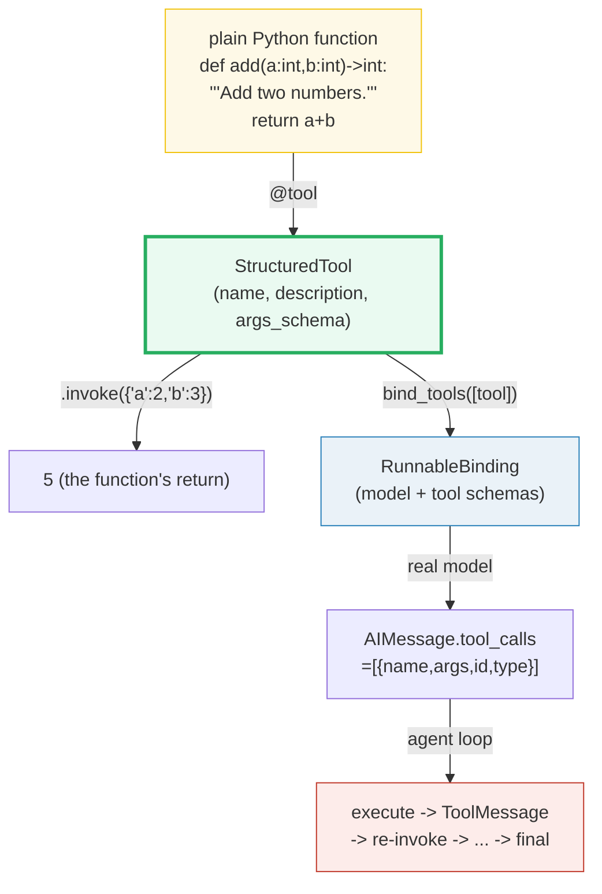
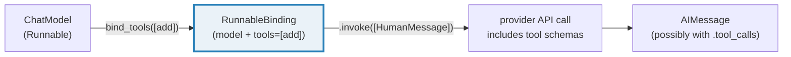
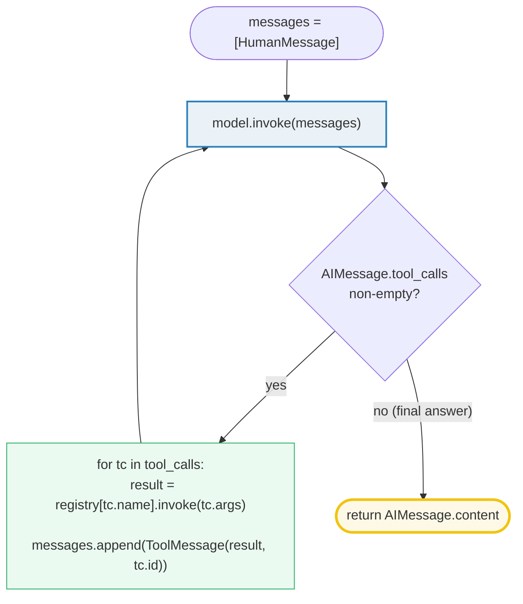

# LangChain Tools & Agents — `@tool`, `bind_tools`, and the Tool-Calling Loop

> **The one rule:** a language model only emits text. **Tools** give it a way to
> *call functions*: `@tool` wraps a Python function into a JSON-schema'd
> `BaseTool`, `bind_tools` advertises those schemas to the model, and an
> **agent** is just a loop — *model → (tool calls?) → execute → `ToolMessage` →
> model → … → final answer*. Get these three primitives straight and every
> agent framework (LangGraph, OpenAI Assistants, MCP) stops looking like magic.

**Companion code:** [`lc_tools_agents.py`](./lc_tools_agents.py).
**Every number and table below is printed by `uv run python
lc_tools_agents.py`** — change the code, re-run, re-paste. Nothing here is
hand-computed. Captured stdout lives in
[`lc_tools_agents_output.txt`](./lc_tools_agents_output.txt).

**Goal of this bundle (lineage, old → new):**

> from *"the LLM just generates text"*
> → *"tools let the model CALL functions: `@tool` wraps a function into a
> schema, `bind_tools` exposes them, and an agent loops
> model → tool → `ToolMessage` → model until a final answer."*

🔗 This is bundle **#41 of Phase 6**. It builds directly on
[`LC_MODELS_MESSAGES`](./LC_MODELS_MESSAGES.md) (#36) — chat models as
Runnables, the message types, and `AIMessage.tool_calls` introduced there are
the *raw material* an agent loop runs on. The loop itself is a graph (model
node ↔ tools node, conditional edge), which [`LC_LANGGRAPH`](./LC_LANGGRAPH.md)
(#42) generalizes. Tools are a universal contract: the *same* `@tool` shape
travels across providers and across the **Model Context Protocol** — see
[`MCP_TOOLS`](./MCP_TOOLS.md) (#51, Phase 8).

**OFFLINE / NO API KEY:** every "model" below is a
`FakeMessagesListChatModel` seeded with canned `AIMessage`s (some carrying
`.tool_calls`). A real tool-calling model (ChatOpenAI / ChatAnthropic) *emits*
those `.tool_calls`; the fake lets us inject them deterministically so the
parsing, dispatch, and loop shape can be asserted byte-for-byte.

---

## 0. The three ideas on one page



| Primitive | What it does | Returns |
|---|---|---|
| `@tool def fn(...)` | Wraps `fn` into a `BaseTool` with an auto-derived schema | a `StructuredTool` (a `Runnable`) |
| `tool.invoke({...})` | Validates args against `args_schema`, calls `fn` | the function's return value |
| `model.bind_tools([...])` | Advertises tool schemas to the model | a `Runnable` (a `RunnableBinding`) |
| `AIMessage.tool_calls` | The model's request to call tools | `[{name, args, id, type="tool_call"}]` |
| `ToolMessage(content, tool_call_id)` | A tool's output, keyed to the request | a `BaseMessage` of `type="tool"` |

---

## 1. `@tool` — a function becomes a `BaseTool` with an auto-derived schema

The [Tools concept page](https://python.langchain.com/docs/concepts/tools/)
defines the abstraction bluntly: *"the **tool** abstraction in LangChain
associates a Python **function** with a **schema** that defines the function's
**name**, **description** and **expected arguments**."* The `@tool` decorator
is the recommended constructor, and it auto-derives all three from the function
itself:

- **`name`** ← the function's name (`add`).
- **`description`** ← the function's **docstring** (`"Add two numbers."`). Write
  a good one — this is what the model actually reads to decide whether to call
  your tool.
- **`args_schema`** ← a **Pydantic model** built from the type-hinted
  parameters. `a: int, b: int` becomes a model with two `int` fields. The model
  also gives you `tool.args` — a **JSON-schema dict** the provider's API
  consumes directly.

`@tool` returns a `StructuredTool`, which is a subclass of `BaseTool`, which is
a `Runnable`. So a tool composes in LCEL pipes (`prompt | model.bind_tools([t])`)
and answers `invoke` / `batch` / `stream` uniformly (🔗 [`LC_CHAINS_LCEL`](./LC_CHAINS_LCEL.md)).

> From `lc_tools_agents.py` Section A:
> ```
> ======================================================================
> SECTION A — @tool decorator: function -> BaseTool with an auto schema
> ======================================================================
> @tool wraps a Python function into a StructuredTool (subclass of
> BaseTool, which is a Runnable). It AUTO-DERIVES the tool's schema
> from the function: name <- function name, description <- docstring,
> args <- type-hinted parameters as a Pydantic model (args_schema).
> 
> expression                                      value
> ------------------------------------------------------------------------
> add.name                                        'add'
> add.description                                 'Add two numbers.'
> type(add).__name__                              StructuredTool
> isinstance(add, BaseTool)                       True
> isinstance(add, Runnable)                       True
> add.args_schema.__name__                        'add'
> list(add.args_schema.model_fields)              ['a', 'b']
> a annotation                                    <class 'int'>
> b annotation                                    <class 'int'>
> add.args (JSON schema dict)                     {'a': {'title': 'A', 'type': 'integer'}, 'b': {'title': 'B', 'type': 'integer'}}
> 
> [check] add.name == 'add' (from the function name): OK
> [check] add.description == 'Add two numbers.' (from the docstring): OK
> [check] add is a BaseTool (and a Runnable): OK
> [check] args_schema is a Pydantic model with fields a, b: OK
> [check] a and b are typed int (from the type hints): OK
> [check] add.args JSON schema marks a, b as integer: OK
> ```

### Why the docstring + type hints ARE the schema (internals)

Under the hood `@tool` (in `langchain_core.tools.concrete`) inspects the
function with the stdlib `inspect` + `pydantic.TypeAdapter` machinery: it reads
`fn.__doc__` into `description`, walks `inspect.signature(fn).parameters` for
the argument names, and builds a `BaseModel` subclass whose fields are the
parameters annotated with their Python type hints. That Pydantic model is
`args_schema`; calling `.model_json_schema()` (which is what `.args` returns)
produces the JSON schema the model's tool-call API speaks natively. This is
why **type hints are required** for `@tool` (the docs say so explicitly) and
why a vague docstring translates into a vague tool the model misuses. Use
`Annotated[int, "the divisor"]` to add per-arg descriptions, and `InjectedToolArg`
to hide runtime-only args (user ids, configs) from the schema entirely.

---

## 2. `tool.invoke({...})` — run the wrapped function by args dict

Because a tool is a `Runnable`, it answers `.invoke()`. The input is an **args
dict** (validated against `args_schema`); the output is the function's return
value, unmodified. This is the *exact same* call the agent loop will make when
it receives a `tool_call` — it just plumbs `tool_call["args"]` straight in.

> From `lc_tools_agents.py` Section B:
> ```
> ======================================================================
> SECTION B — tool.invoke({'a': 2, 'b': 3}) executes the wrapped function
> ======================================================================
> A tool is a Runnable: invoke() takes an args DICT (validated against
> args_schema) and returns the function's return value. Below: 2 + 3.
> 
> add.invoke({'a': 2, 'b': 3}) -> 5  (type=int)
> add.invoke({'a': 10, 'b': -4}) -> 6
> 
> [check] add.invoke({'a':2,'b':3}) == 5: OK
> [check] result has type int (the function's return type): OK
> [check] add.invoke({'a':10,'b':-4}) == 6: OK
> ```

**Expert gotcha:** the agent loop **stringifies** this return value into the
`ToolMessage.content` (see §5). Return a `str` directly for natural-language
results; return a JSON string (or use `response_format="content_and_artifact"`)
for structured payloads the model must parse back. Returning a bare object the
model can't stringify lands as a useless `"<MyObject object at 0x…>"`.

---

## 3. `bind_tools` — advertise the schemas to the model

`bind_tools([...])` attaches a list of tools to a chat model. The return value
is a **`RunnableBinding`** — the same model, but on every subsequent
`.invoke()` the bound tool schemas ride along as a `tools=[…]` kwarg so the
provider's API can advertise them to the LLM. On a real tool-calling model the
LLM may then decide to emit `AIMessage.tool_calls` instead of plain text.



For this OFFLINE bundle the fake model has no provider to translate schemas for,
so we subclass `FakeMessagesListChatModel` to implement `bind_tools` by
delegating to the generic `Runnable.bind(tools=...)` (which is exactly the
mechanism real overrides build on). What we *assert* — that `bind_tools` returns
a `Runnable` that carries the tool — is therefore faithful to a real call.

> From `lc_tools_agents.py` Section C:
> ```
> ======================================================================
> SECTION C — model.bind_tools([add]) -> a Runnable that knows the tool
> ======================================================================
> bind_tools([...]) attaches tool schemas to the model. Real chat
> models translate the schemas into the provider's tool-call format
> and return a RunnableBinding; on subsequent .invoke() calls the
> model MAY emit AIMessages with .tool_calls. The fake model can't
> translate schemas (it has no provider), but bind_tools STILL returns
> a Runnable — we feed canned tool_calls by hand in Section F.
> 
> expression                              value
> ----------------------------------------------------------------
> type(bound).__name__                    _ChatModelBinding
> isinstance(bound, Runnable)             True
> bound.kwargs keys                       ['tools']
> bound tools                             ['add']
> bound.invoke(...).content               'ack'
> 
> [check] bind_tools returns a Runnable: OK
> [check] the bound runnable carries the tool by name: OK
> [check] bound.invoke still returns an AIMessage (canned): OK
> ```

### Why `bind_tools` is abstract on the base class (internals)

`BaseChatModel.bind_tools` raises `NotImplementedError` by design — every
provider speaks a *different* wire format for tools (OpenAI functions, Anthropic
XML/JSON, Gemini `functionDeclarations`…). Each integration package overrides
`bind_tools` to translate the universal `BaseTool` schemas into its native
shape and then `return self.bind(tools=<translated>)`. So the *universal* part
(the `RunnableBinding` return, the `tools=[…]` plumbing, the `.invoke` shape)
is shared, and only the translation is per-provider. That is also why a model
that hasn't implemented `bind_tools` (the fake model, some older integrations)
blows up with `NotImplementedError` — there is no generic fallback.

---

## 4. `AIMessage.tool_calls` + `ToolMessage` keyed by `tool_call_id`

🔗 Introduced in [`LC_MODELS_MESSAGES`](./LC_MODELS_MESSAGES.md) §G — recapped
here because the *pairing* is what makes the loop work.

When a tool-calling model decides to call a tool, it returns an `AIMessage`
whose `.tool_calls` is a list of dicts, each shaped exactly:

```python
{"name": "add", "args": {"a": 2, "b": 3}, "id": "call_1", "type": "tool_call"}
```

- **`name`** — the tool to call (must match a bound tool's `.name`).
- **`args`** — a dict, already validated against the tool's `args_schema` shape
  on the way out of the model (the provider's API does this).
- **`id`** — a unique handle for *this* call (so the model can tell parallel
  calls apart).
- **`type`** — always the literal `"tool_call"` (LangChain normalizes this
  across providers; the parsed `.tool_calls` always carries it).

The agent's answer is a **`ToolMessage`** — a message of `type == "tool"` whose
`.content` carries the result string and whose **`.tool_call_id`** echoes the
request's `id`. That id pairing is how the model reassembles "which result
answers which request" when several tool calls fan out in one turn.

> From `lc_tools_agents.py` Section D:
> ```
> ======================================================================
> SECTION D — AIMessage.tool_calls + ToolMessage keyed by tool_call_id
> ======================================================================
> A tool-calling model returns an AIMessage whose .tool_calls is a list
> of {name, args, id, type} dicts (type is always 'tool_call'). Each id
> is a unique handle; the matching ToolMessage echoes it in
> tool_call_id so the model can pair request with result.
> 
> AIMessage.tool_calls[0] keys = ['args', 'id', 'name', 'type']
>   tc['name'] = 'add'
>   tc['args'] = {'a': 2, 'b': 3}
>   tc['id'] = 'call_1'
>   tc['type'] = 'tool_call'
> 
> ToolMessage.type          = 'tool'
> ToolMessage.content       = '5'
> ToolMessage.tool_call_id  = 'call_1'
> 
> [check] tool_call has keys name, args, id, type: OK
> [check] tool_call type is always 'tool_call': OK
> [check] tool_call name == 'add': OK
> [check] tool_call args == {'a':2,'b':3}: OK
> [check] ToolMessage.type == 'tool': OK
> [check] ToolMessage echoes the tool_call_id: OK
> ```

**Expert gotcha:** never build a `ToolMessage` without a `tool_call_id` —
most providers will **reject** the next turn ("tool message without a matching
tool call") because they cannot pair it. The id is the load-bearing key.

---

## 5. Executing a tool call — dispatch by name, wrap the result

Given one entry of `AIMessage.tool_calls`, the agent does three things:

1. **Dispatch** — look up the tool by `tc["name"]` in a registry (a
   `{name: tool}` dict; in LangGraph this is the `ToolNode`).
2. **Invoke** — call `tool.invoke(tc["args"])`; Pydantic validates the args
   against `args_schema`.
3. **Wrap** — `ToolMessage(content=str(result), tool_call_id=tc["id"])`. The
   agent appends this to the message list, then re-invokes the model.

> From `lc_tools_agents.py` Section E:
> ```
> ======================================================================
> SECTION E — Executing a tool call: dispatch by name -> ToolMessage
> ======================================================================
> Given an AIMessage.tool_calls entry, the agent: (1) looks up the tool
> by name in a registry, (2) invokes it with .args, (3) wraps the
> result string into a ToolMessage keyed by .id. Below: the full round
> trip for one tool_call.
> 
> registry           = {name: tool}  ->  ['add']
> tc['name']         = 'add'
> tc['args']         = {'a': 2, 'b': 3}
> invoke result      = 5  (type=int)
> ToolMessage.content      = '5'
> ToolMessage.tool_call_id = 'call_1'
> 
> [check] registry lookup by name returns the add tool: OK
> [check] dispatch + invoke returns 5: OK
> [check] the ToolMessage content is str(result): OK
> [check] the ToolMessage id matches the tool_call id: OK
> ```

---

## 6. The agent loop — model → tool_calls? → execute → repeat

This is the whole idea in one paragraph. **An agent is a `while` loop over the
message list.** Invoke the model. If the returned `AIMessage` has a non-empty
`.tool_calls`, execute every tool call (§5), append each `ToolMessage`, and
loop again — the model now sees its own request *and* the result. If
`.tool_calls` is empty, the `AIMessage.content` is the **final answer**; break.



The bundle simulates the model with a `FakeMessagesListChatModel` seeded with a
two-response script: first an `AIMessage` carrying one `add(2, 3)` tool call,
then a plain `AIMessage("The sum is 5")`. The loop executes the tool, feeds the
`ToolMessage` back, and the second model turn produces the final answer —
exactly one tool round-trip, two model invocations total.

> From `lc_tools_agents.py` Section F:
> ```
> ======================================================================
> SECTION F — The agent loop: model -> tool_calls? -> execute -> repeat
> ======================================================================
> The agent loop, in one sentence: invoke the model; if its AIMessage
> carries tool_calls, execute each, append ToolMessages, and re-invoke;
> otherwise return the AIMessage's content as the final answer.
> 
> Seed: responses = [AIMessage(tool_calls=[add(2,3)]),
>                        AIMessage(content='The sum is 5')]
> 
> step  role      content               tool_calls
> ----------------------------------------------------------------
> init  human     'What is 2 + 3?'      
> L1    ai        ''                    [('add', {'a': 2, 'b': 3})]
> T1    tool      '5'                   id='call_1'
> L2    ai        'The sum is 5'        []
> 
> [check] the loop produced a final answer: OK
> [check] final answer is 'The sum is 5': OK
> [check] exactly one tool round-trip happened (1 tool_call executed): OK
> [check] the loop took 2 model invocations (call + final): OK
> [check] the last message is the final AIMessage with no tool_calls: OK
> [check] a ToolMessage sits between the two AIMessages: OK
> ```

### Why this loop, not a single call (internals)

A model can't *do* anything — it emits tokens. Tool calls are tokens too (a
structured kind), so the model can only **request** an action; an outer loop
must actually **perform** it and feed the observation back. The
request/observe/re-request rhythm is precisely the ReAct pattern (Reason +
Act), and it is why every agent framework converges on this loop: model node →
conditional edge (`has tool_calls?`) → tools node → back to model node. That is
also why **`max_iterations`** is mandatory in production — without a cap a
model that keeps hallucinating tool calls will loop forever (and burn tokens).

🔗 [`LC_LANGGRAPH`](./LC_LANGGRAPH.md) (#42) makes this loop a first-class
graph: nodes for the model and the tools, a conditional edge on `tool_calls`,
and built-in checkpointing so a long-running agent can pause, persist, and
resume.

---

## 7. Tool errors + the modern prebuilt agent

**Tool errors.** A tool may fail (network, bad input, business rule). Raise a
**`ToolException`** (LangChain's special tool-only exception). The agent
catches it and feeds the **error string** back as a `ToolMessage` — same
`tool_call_id`, content is the error message — so the model can *see* the
failure and recover (retry with different args, apologize, escalate). This is
why tool errors should be **informative strings**, not stack traces: the model
reads them. You can also pass `handle_tool_error=True` (or a callable) to
`tool.invoke(..., config=...)` to convert a `ToolException` into a returned
string automatically; the agent pattern below does it by hand to make the
round-trip explicit.

> From `lc_tools_agents.py` Section G:
> ```
> ======================================================================
> SECTION G — Tool errors -> feed back as a ToolMessage; the prebuilt agent
> ======================================================================
> A tool may raise ToolException. The agent catches it and feeds the
> ERROR STRING back as a ToolMessage (same tool_call_id) so the model
> can recover — e.g. retry with different args. Below we simulate the
> error path of one round.
> 
> tc['args']               = {'a': 1, 'b': 0}
> caught ToolException text = 'Error: division by zero'
> ToolMessage.content       = 'Error: division by zero'
> ToolMessage.tool_call_id  = 'call_err'
> 
> [check] divide raises ToolException on b=0: OK
> [check] the error becomes a ToolMessage keyed by tool_call_id: OK
> The modern API: LangGraph ships a prebuilt tool-calling agent that
> RUNS this exact loop as a graph (model node <-> tools node, edge on
> 'has tool_calls?'). In the installed langgraph it is exposed as
> create_react_agent (a.k.a. chat_agent_executor); the latest LangChain
> concepts docs rename it create_agent. The legacy AgentExecutor is
> phased out. Tools are the universal contract — the same @tool works
> across all of them and across MCP (🔗 MCP_TOOLS, P8 #51).
> 
> [check] langgraph.prebuilt.create_react_agent is importable: OK
> ```

**The modern API.** The [Agents concept page](https://python.langchain.com/docs/concepts/agents/)
puts it bluntly: *"By themselves, language models can't take actions — they
just output text. Agents are systems that take a high-level task and use an LLM
as a reasoning engine to decide what actions to take and execute those
actions."* LangChain recommends **LangGraph** for building agents, and ships a
**prebuilt** tool-calling agent that runs exactly the loop in §6 as a compiled
graph. In the installed `langgraph` (1.2.x) it is exposed as
**`create_react_agent`** (alias `chat_agent_executor`); the latest LangChain
concepts docs **rename it `create_agent`**. The legacy `AgentExecutor` is being
phased out. The bundle verifies the prebuilt is importable; everything you
asserted by hand in §6 is what it does for you.

🔗 **Tools are the universal contract.** The same `@tool` (the same
`{name, description, args_schema}` triple) works across `bind_tools`, the
LangGraph prebuilt, and the **Model Context Protocol** — see
[`MCP_TOOLS`](./MCP_TOOLS.md) (#51, Phase 8), where the same idea travels over
a standardized server protocol so tools from different vendors compose.

---

## Pitfalls

| Trap | Example | The fix |
|---|---|---|
| No type hints on a `@tool` function | `def add(a, b)` → schema generation fails / args untyped | always annotate every arg; type hints ARE the schema |
| Vague or missing docstring | `"""?"""` → model can't tell when to call it | write a one-line description of *what* and *when*; the model reads it |
| Returning a non-stringifiable object | `return my_obj` → `ToolMessage.content` becomes `"<X at 0x…>"` | return a `str` (or JSON); use `response_format="content_and_artifact"` for structured payloads |
| Building a `ToolMessage` with no `tool_call_id` | `ToolMessage(content="5")` → provider rejects the next turn | always pass `tool_call_id=tc["id"]` — the id is the load-bearing key |
| Forgetting `max_iterations` / recursion limit | a hallucinating model loops tool calls forever | cap the loop; LangGraph uses `recursion_limit` in the config |
| Letting tool exceptions propagate | a tool that raises kills the whole agent run | raise `ToolException` (not `ValueError`); the loop catches it and feeds the message back |
| Error message that's a stack trace | model reads `Traceback (most recent…)` and gets confused | return a short, model-readable explanation: `"Cannot divide by zero; supply b != 0"` |
| `bind_tools` raising `NotImplementedError` | custom `BaseChatModel` subclass without an override | override `bind_tools` (real providers do) or use a supported integration |
| Assuming the model will *always* call the right tool | a tool-calling model can still just answer in prose | branch on `bool(AIMessage.tool_calls)`, don't assume the call happens |
| Treating `tool_calls` as the only output | the model may emit text *and* tool_calls in the same AIMessage | read `.content` for the preamble, `.tool_calls` for the actions |

---

## Cheat sheet

- **`@tool def fn(a: int, b: int) -> int: """doc."""`** → a `StructuredTool`
  (`BaseTool`, a `Runnable`). `name`=fn name, `description`=docstring,
  `args_schema`=Pydantic model from the type hints, `args`=JSON-schema dict.
- **`tool.invoke({"a": 2, "b": 3})`** → validates the args dict, runs the
  function, returns its value (here `5`).
- **`model.bind_tools([tool, ...])`** → a `Runnable` (`RunnableBinding`) that
  advertises the tool schemas to the provider on every `.invoke`. Abstract on
  `BaseChatModel`; each integration overrides it to translate to the wire
  format.
- **`AIMessage.tool_calls`** → list of `{name, args, id, type="tool_call"}`
  dicts. Empty list = final answer. (🔗 introduced in `LC_MODELS_MESSAGES` §G.)
- **`ToolMessage(content, tool_call_id)`** → a tool's output, `type="tool"`,
  keyed to the request by `tool_call_id`. **Always** set the id.
- **The agent loop:** `while True: ai = model.invoke(msgs); msgs.append(ai);
  if not ai.tool_calls: return ai.content; for tc in ai.tool_calls:
  msgs.append(ToolMessage(str(registry[tc.name].invoke(tc.args)), tc.id))`.
- **Errors:** raise `ToolException("msg")`; the loop feeds `"Error: msg"` back
  as a `ToolMessage` so the model recovers. Cap with `max_iterations`.
- **Modern API:** `langgraph.prebuilt.create_react_agent` (renamed
  `create_agent` in the latest docs) runs this loop as a compiled graph and
  replaces the legacy `AgentExecutor`. (🔗 `LC_LANGGRAPH`.)
- **Universal contract:** the same `@tool` triple works for `bind_tools`, the
  prebuilt agent, and MCP. (🔗 `MCP_TOOLS`.)

---

## Sources

- **LangChain — Tools (concepts).**
  https://python.langchain.com/docs/concepts/tools/
  *The authoritative description of the tool abstraction: a function + a schema
  (`name`, `description`, `args`); the `@tool` decorator and how it auto-derives
  `name`/`description`/`args_schema`; `tool.invoke(...)`; the recommendation
  that "type hints are required as they define the tool's input schema."
  Quoted in §0 and §1.*
- **LangChain — Agents (concepts).**
  https://python.langchain.com/docs/concepts/agents/
  *"By themselves, language models can't take actions — they just output text.
  Agents are systems that take a high-level task and use an LLM as a reasoning
  engine to decide what actions to take."* Recommends LangGraph for agents and
  notes the legacy `AgentExecutor` is being phased out. Quoted in §7.*
- **LangChain — `@tool` API reference (langchain_core.tools).**
  https://reference.langchain.com/python/langchain-core/tools/
  *The `@tool` decorator signature, `args_schema`/`args`/`name`/`description`
  attributes, `response_format="content_and_artifact"`, and `InjectedToolArg`.
  Basis for §1 and §2.*
- **LangChain — `BaseTool.bind_tools` / `RunnableBinding`.**
  https://reference.langchain.com/python/langchain-core/language_models/chat_models/BaseChatModel/bind_tools
  *`bind_tools` attaches tool schemas to a chat model and returns a
  `RunnableBinding`. The base class method raises `NotImplementedError`;
  provider packages override it to translate schemas into the wire format.
  Basis for §3 and the `bind_tools` internals note.*
- **LangChain — How to handle tool errors.**
  https://python.langchain.com/docs/how_to/tool_error/
  *`ToolException` is the special exception the tool layer treats as a
  recoverable error; `handle_tool_error=True` (or a callable) returns the error
  string as the tool's output instead of raising. Referenced in §7.*
- **LangGraph — Prebuilt agents (`create_react_agent`).**
  https://langchain-ai.github.io/langgraph/reference/prebuilt/
  *The prebuilt tool-calling agent exposed as `create_react_agent` (alias
  `chat_agent_executor`); compiled from a model node + tools node with a
  conditional edge on `tool_calls`. Confirmed importable in langgraph 1.2.6.
  Referenced in §7.*
- **`langchain_core` source — `tools/concrete.py`, `tools/base.py`,
  `language_models/chat_models.py`.** (installed v1.4.8)
  *Read directly to verify: `@tool` → `StructuredTool`; `BaseTool` is a
  `Runnable`; `BaseChatModel.bind_tools` raises `NotImplementedError` by
  default; `Runnable.bind(tools=...)` returns a `_ChatModelBinding` (a
  `Runnable`). The offline `_ToolCallingFakeModel` in the `.py` mirrors this.*
