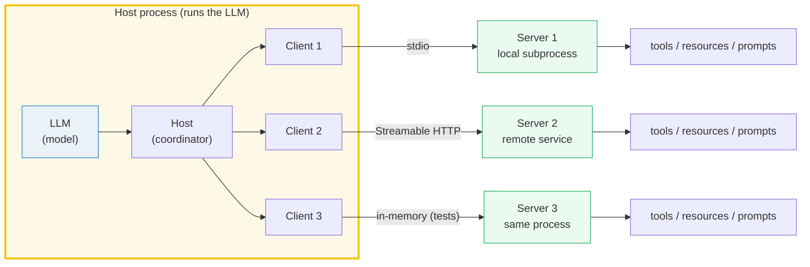
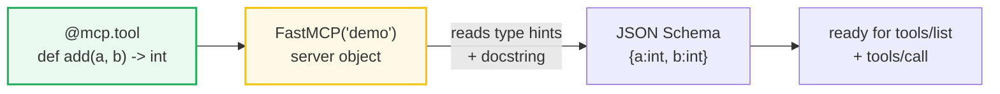
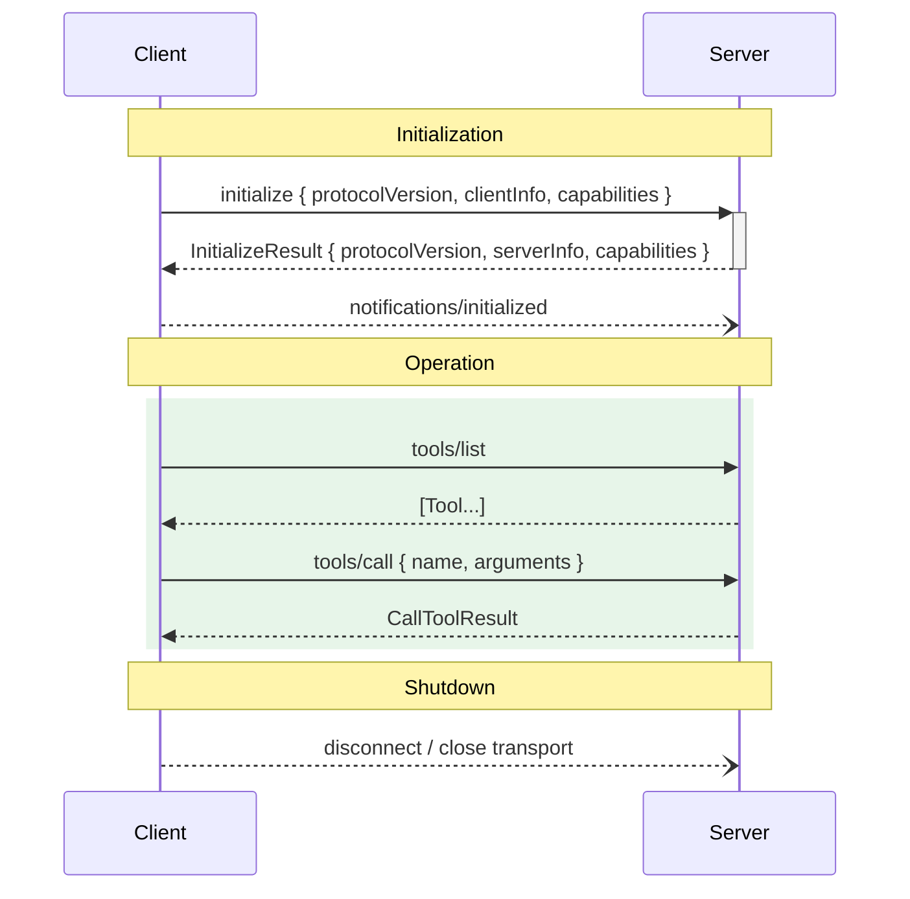
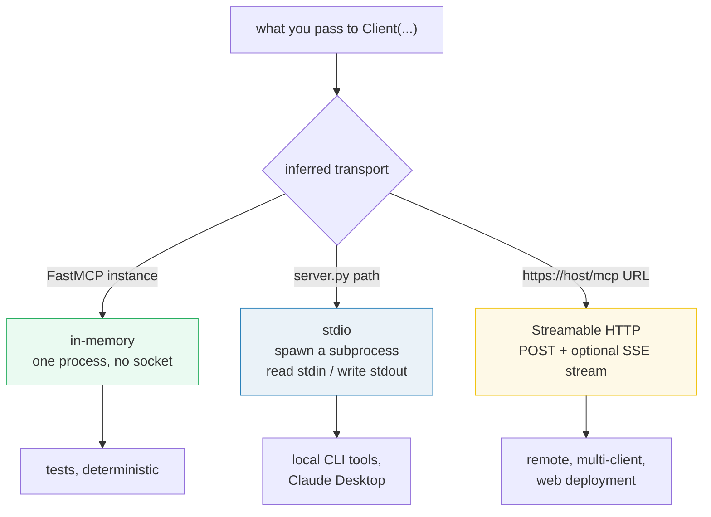
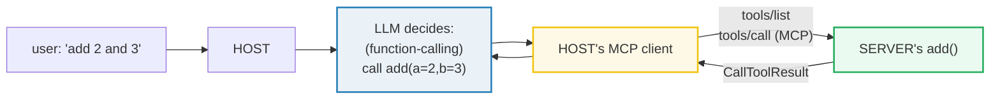

# MCP Architecture — Host, Client, Server, and the JSON-RPC Wire Between Them

> **The one rule:** an LLM host cannot, by itself, reach your files, your
> database, or your APIs. The **Model Context Protocol (MCP)** is the standard
> **client-host-server** protocol (JSON-RPC 2.0) that fixes this: a **server**
> exposes `tools` / `resources` / `prompts`; a **host** runs the model and
> manages one **client** per server connection; a **transport** (stdio /
> Streamable HTTP / in-memory) carries the messages. Any host speaks to any
> server because the wire is fixed.

**Companion code:** [`mcp_architecture.py`](./mcp_architecture.py).
**Every value and capability dump below is printed by `uv run python
mcp_architecture.py`** — change the code, re-run, re-paste. Nothing here is
hand-computed. Captured stdout lives in
[`mcp_architecture_output.txt`](./mcp_architecture_output.txt).

> This bundle runs entirely in-process: FastMCP's in-memory `Client` passes the
> `FastMCP` instance straight into the transport, so the full JSON-RPC lifecycle
> runs with **no subprocess, no socket, no network, no API key** — fully
> deterministic. (FastMCP 3.4.2, MCP protocol version `2025-11-25`; the version
> strings drift over time but the structure does not.)

**Goal of this bundle (lineage, old → new):**

> from *"my LLM can't reach my data, and every tool integration is bespoke"*
> → *"MCP is the standard client-server protocol connecting an LLM host to
> external tools/resources/prompts; a server exposes capabilities, a host runs
> the model, and transports carry the JSON-RPC."*

🔗 This is bundle **#50 of Phase 8** (MCP). The primitives are previewed here
then expanded: tools → [`MCP_TOOLS`](./MCP_TOOLS.md) (#51), resources/prompts
→ [`MCP_RESOURCES_PROMPTS`](./MCP_RESOURCES_PROMPTS.md) (#52), context/sampling
→ [`MCP_CONTEXT_SAMPLING`](./MCP_CONTEXT_SAMPLING.md) (#53), transports &
integration → [`MCP_INTEGRATION`](./MCP_INTEGRATION.md) (#54). The host is, in
practice, a function-calling agent — see [`LC_TOOLS_AGENTS`](../llm/LC_TOOLS_AGENTS.md)
(Phase 6 #41). See [`TODO.md`](./TODO.md) for the full plan.

---

## 0. The whole topology on one page



The three roles are deliberately separable:

| Role | Lives in | Responsibility | Speaks the wire? |
|---|---|---|---|
| **HOST** | the user's app (Claude Desktop, an agent) | runs the LLM, manages N clients, enforces consent, aggregates context | no — it *contains* clients |
| **CLIENT** | inside the host, one per server | opens the stateful session, does the `initialize` handshake, routes requests | **yes** — JSON-RPC to its server |
| **SERVER** | a local subprocess or a remote service | exposes `tools` / `resources` / `prompts` via MCP primitives | **yes** — JSON-RPC back to its client |

A host **never** talks to a server directly; it always goes through a client,
and **each client is 1:1 with exactly one server**. The spec is explicit that
servers are isolated from one another and from the full conversation — the host
hands a server only what it needs.

---

## 1. The three roles: HOST ↔ CLIENT ↔ SERVER

MCP's [Architecture](https://modelcontextprotocol.io/specification/2025-11-25/architecture)
section names these three actors precisely. The payoff of the split: servers
are **trivial to build** (a function + a decorator), **composable** (a host
plugs in many), and **isolated** (one server cannot see another's traffic or
the model's whole prompt). The host does the hard orchestration; the server
does one focused thing.

> From `mcp_architecture.py` Section A:
> ```
> ======================================================================
> SECTION A — The three roles: HOST ↔ CLIENT ↔ SERVER
> ======================================================================
> MCP (spec 2025-11-25, Architecture) is a client-host-server protocol.
> A HOST runs the LLM and manages many clients; a CLIENT is the single
> 1:1 connection to one server; a SERVER exposes tools/resources/prompts.
> MCP standardizes the wire, so ANY host talks to ANY server.
> 
> role      who runs it                     job
> ----------------------------------------------------------------------
> HOST      Claude Desktop / an agent       runs the LLM, manages client connections, enforces consent
> CLIENT    one per server, inside the host opens a stateful session; does the initialize handshake
> SERVER    subprocess or remote service    exposes tools/resources/prompts via MCP primitives
> 
> [check] three canonical roles are HOST, CLIENT, SERVER: OK
> [check] each client has a 1:1 relationship with exactly one server: OK
> ```

### Why the host/client/server split exists (internals)

The protocol is JSON-RPC 2.0 over a transport. Without the split you'd have one
monolithic "LLM + tools" process; with it, the **host** owns the model and
permission UX (the thing users trust), while **servers** are small, swappable,
and language-agnostic (a Python server, a Rust server, and a Go server all look
identical on the wire). The **client** exists per-server so the host can fan out
to many servers at once *and* so each server sees only an isolated session — a
server cannot read another server's messages or the model's full history. That
isolation is a security property, not an implementation detail: it's what makes
it safe to plug a third-party server into a trusted host.

---

## 2. A minimal FastMCP server: `FastMCP("demo")` + `@mcp.tool`



A FastMCP server is just an object you register callables onto. The `@mcp.tool`
decorator (parentheses optional — `@mcp.tool` and `@mcp.tool()` are equivalent)
reads the function's **type hints** to build a JSON Schema and its **docstring**
to fill the tool's `description`. Crucially, the server knows about its tools
**before** any client connects — registration is an in-process side effect of
the decorator, independent of the transport.

> From `mcp_architecture.py` Section B:
> ```
> ======================================================================
> SECTION B — A minimal FastMCP server: FastMCP('demo') + @mcp.tool
> ======================================================================
> Build the server object, then register a tool with a decorator.
> FastMCP reads the type hints + docstring and generates the JSON
> schema automatically — this is what tools/list will hand back.
> 
> server.name               = 'demo'
> server.list_tools() names = ['add']
> 'add' description         = 'Add two integers.'
> 
> [check] server is named 'demo': OK
> [check] server exposes a tool named 'add': OK
> [check] exactly one tool registered on the minimal server: OK
> ```

### Why the schema is derived from annotations (internals)

`add(a: int, b: int) -> int` becomes
`{"properties": {"a": {"type": "integer"}, "b": {"type": "integer"}}, "required": ["a", "b"], "type": "object"}`.
FastMCP walks `typing.get_type_hints()` and maps Python types to JSON-Schema
keywords (`int`/`float` → `integer`/`number`, `str` → `string`, `bool` →
`boolean`, Pydantic models → nested `object`). That schema is what the model
eventually sees, so the model can decide to call `add` with the right argument
shapes. The docstring becomes the `description` — write it carefully, because
**it is the only text the model uses to decide whether to call your tool.**

---

## 3. The in-memory Client: `async with Client(mcp) as c`

`Client(mcp)` — passing a `FastMCP` *instance* rather than a path or URL —
selects the **in-memory transport**: no socket, no subprocess, the JSON-RPC
messages are delivered straight across a function call boundary inside one
process. The [FastMCP client docs](https://gofastmcp.com/clients/client) call
this out as ideal for testing. Entering `async with` runs the `initialize`
handshake; `list_tools()` is the JSON-RPC `tools/list` method and returns one
`mcp.types.Tool` per registered tool.

> From `mcp_architecture.py` Section C:
> ```
> ======================================================================
> SECTION C — In-memory Client: async with Client(mcp) as c
> ======================================================================
> Client(mcp) selects the IN-MEMORY transport: no socket, no subprocess.
> Entering `async with` runs the JSON-RPC initialize handshake; inside
> the block the connection is live. list_tools() is the JSON-RPC
> 'tools/list' method and returns one mcp.types.Tool per tool.
> 
> c.is_connected()        = True
> len(c.list_tools())     = 1
> tool names              = ['add']
> tool.name               = 'add'
> tool.inputSchema        = {'additionalProperties': False, 'properties': {'a': {'type': 'integer'}, 'b': {'type': 'integer'}}, 'required': ['a', 'b'], 'type': 'object'}
> 
> [check] client reports connected inside the context manager: OK
> [check] list_tools includes 'add': OK
> [check] add's schema requires both 'a' and 'b': OK
> [check] add's schema types a and b as integer: OK
> ```

### Why the `async with` (internals)

MCP is a **stateful session** protocol: a connection has a lifecycle
(initialize → operate → shutdown), so the client is a context manager. On
`__aenter__` it opens the transport and runs the `initialize` request +
`notifications/initialized` reply automatically (toggle it off with
`auto_initialize=False`). On `__aexit__` it tears the session down. Every
operation — `ping`, `list_tools`, `call_tool`, `list_resources` — is a
coroutine because even the in-memory transport shares the async event loop with
the server; over stdio/HTTP the same calls become real network round-trips
without the code changing.

---

## 4. The lifecycle: the `initialize` handshake



The spec's [Lifecycle](https://modelcontextprotocol.io/specification/2025-11-25/basic/lifecycle)
page is strict: `initialize` **MUST** be the first interaction. The client sends
its protocol version + capabilities + client info; the server replies with *its*
protocol version + `serverInfo` + capabilities; the client then sends an
`initialized` notification. Both sides then honor only what was negotiated.
FastMCP does this whole dance when you enter the context manager and exposes the
server's reply via `c.initialize_result`.

> From `mcp_architecture.py` Section D:
> ```
> ======================================================================
> SECTION D — Lifecycle: the initialize handshake (protocolVersion + caps)
> ======================================================================
> Per spec Lifecycle, connecting MUST first run 'initialize': the client
> sends its protocolVersion + clientInfo + capabilities; the server
> replies with ITS protocolVersion + serverInfo + capabilities; then the
> client sends notifications/initialized. FastMCP does all of this when
> you enter `async with Client(...)` and exposes the result directly.
> 
> protocolVersion         = '2025-11-25'
> serverInfo.name         = 'demo'
> serverInfo.version      = '3.4.2'
> capabilities.tools      = {'listChanged': True}
> capabilities.prompts    = {'listChanged': True}
> capabilities.resources  = {'subscribe': False, 'listChanged': True}
> 
> [check] initialize_result is populated (handshake ran): OK
> [check] server reported its name ('demo'): OK
> [check] server reported a protocol version (date-shaped): OK
> [check] server advertised the 'tools' capability: OK
> [check] server advertised the 'prompts' capability: OK
> [check] server advertised the 'resources' capability: OK
> ```

### Why version + capability negotiation (internals)

Two things make MCP evolve safely. **Version negotiation:** the client sends the
*latest* version it supports; if the server supports it, it echoes the same; if
not, it replies with another version it supports (the client disconnects if it
can't accept it). **Capability negotiation:** each side advertises optional
features — servers declare `tools`, `resources`, `prompts`, `logging`,
`completions`; clients declare `roots`, `sampling`, `elicitation`. A feature
used without being negotiated is a protocol violation. `listChanged: True` (seen
above) means the server will emit notifications when its list of that primitive
changes; `resources.subscribe: False` means this server won't let you subscribe
to individual resource updates.

🔗 **Sampling** (the server asking the host's LLM to generate) and
**roots/elicitation** are client-side capabilities covered in
[`MCP_CONTEXT_SAMPLING`](./MCP_CONTEXT_SAMPLING.md) (#53).

---

## 5. `tools/call`: invoke the tool and get a result

`call_tool(name, arguments)` is the JSON-RPC `tools/call` method. FastMCP
returns a `CallToolResult` with **two views of the same answer**:

- `.content` — the wire content blocks (a list of `TextContent` / `ImageContent`
  / `EmbeddedResource`); this is what the spec puts on the wire.
- `.data` — the structured Python value, decoded from the tool's declared return
  type via Pydantic. When the tool is typed `-> int`, `.data` is a real `int`.

> From `mcp_architecture.py` Section E:
> ```
> ======================================================================
> SECTION E — tools/call: call_tool('add', {a:2, b:3}) -> 5
> ======================================================================
> call_tool() is the JSON-RPC 'tools/call' method. FastMCP returns a
> CallToolResult with two views: .content (wire content blocks, plain
> text here) and .data (the structured Python return value).
> 
> type(res)               = CallToolResult
> res.data                = 5  (int)
> res.content[0].text     = '5'
> res.content[0] type     = TextContent
> res.is_error            = False
> 
> [check] call_tool('add', {a:2,b:3}).data == 5: OK
> [check] structured data type is int (matches -> int): OK
> [check] wire content is the text '5': OK
> [check] result is not an error: OK
> ```

### Why two result views (internals)

The wire only knows content blocks (text the model can read). But callers in
Python usually want a typed object back. FastMCP bridges both: it serializes the
return value into a `TextContent` JSON blob for `.content` (so any host,
including non-FastMCP ones, can read it) *and* validates it against the tool's
`outputSchema` to populate `.data` as a native Python type. If the tool raises,
`is_error` would be `True` on the wire — but with the default `raise_on_error`
flag FastMCP raises a `ToolError` locally instead of returning the error
result. (Call `call_tool(..., raise_on_error=False)` if you want the error
`CallToolResult` handed back.)

---

## 6. Transports: stdio (default) | Streamable HTTP | in-memory



The spec's [Transports](https://modelcontextprotocol.io/specification/2025-11-25/basic/transports)
page defines **two standard transports**: **stdio** (client launches the server
as a subprocess; messages are newline-delimited JSON-RPC on stdin/stdout) and
**Streamable HTTP** (a single `POST`/`GET` endpoint, optionally with
Server-Sent Events for streaming). The old **HTTP+SSE** transport from protocol
version `2024-11-05` is **deprecated** — Streamable HTTP replaces it. FastMCP
adds an **in-memory** transport for tests. The client infers which to use from
what you pass it.

> From `mcp_architecture.py` Section F:
> ```
> ======================================================================
> SECTION F — Transports: stdio (default) | Streamable HTTP | in-memory
> ======================================================================
> The spec defines two standard transports: stdio and Streamable HTTP
> (HTTP+SSE is the deprecated 2024-11-05 form). FastMCP also offers an
> in-memory transport for tests. Client(mcp) infers in-memory; Client of
> a .py path -> stdio subprocess; Client of a URL -> Streamable HTTP.
> 
> transport         Client(...) arg           fits
> ----------------------------------------------------------------------
> stdio             Client('server.py')       local CLI tools, Claude Desktop
> Streamable HTTP   Client('https://x/mcp')   remote, multi-client, web
> in-memory         Client(mcp_instance)      tests, no socket, one process
> 
> [check] spec defines exactly two standard transports (stdio, Streamable HTTP): OK
> [check] in-memory transport uses no socket and no subprocess: OK
> ```

### Why a transport layer at all (internals)

The protocol is **transport-agnostic**: the JSON-RPC message format and the
lifecycle are identical regardless of how bytes move. That means the *same*
server code runs under stdio for a local desktop client **and** under
Streamable HTTP for a remote one — you just call `mcp.run()` (default stdio) or
`mcp.run(transport="http")`. stdio fits local tools (Claude Desktop spawns your
server per session); Streamable HTTP fits a remote, multi-client deployment
(one process, many sessions, an `MCP-Session-Id` header ties requests to a
session). The in-memory transport is what makes this bundle reproducible — it
short-circuits the bytes entirely.

🔗 Real deployments, auth, and mounting an MCP server behind FastAPI are in
[`MCP_INTEGRATION`](./MCP_INTEGRATION.md) (#54).

---

## 7. MCP vs raw function-calling — two layers, not competitors



A common confusion: "isn't MCP just function-calling?" **No** — they are two
distinct layers that cooperate. **Function-calling** is *model-internal*: the
LLM, given a menu of functions the host declared, emits structured arguments.
**MCP** is the *protocol* the host then uses to **discover** that menu (via
`tools/list`) and **invoke** the chosen tool (via `tools/call`) on a server —
possibly in another process or another machine. The model decides; the host's
client executes that decision on the server.

> From `mcp_architecture.py` Section G:
> ```
> ======================================================================
> SECTION G — MCP vs raw function-calling: who decides, who invokes
> ======================================================================
> Function-calling is MODEL-INTERNAL: the LLM emits structured args for
> a function the host declared. MCP is the PROTOCOL the host then uses to
> DISCOVER + INVOKE the server's tool. Two steps, two layers.
> 
> concern                   function-calling            MCP
> ----------------------------------------------------------------------
> where it lives            inside the model            a wire protocol between processes
> who picks the function    the model emits args        host's client calls tools/call
> discovery                 host hardcodes the list     tools/list at runtime
> boundary                  one process                 host + server (1:many)
> 
> [check] MCP sits between the model's tool decision and the server's code: OK
> ```

### Why the distinction matters (internals)

Without MCP, every agent hardcodes its tool list: you write `tools = [...]` in
the same process as the model, and adding a tool means editing the agent. With
MCP, discovery is **runtime**: the host asks the server `tools/list`, feeds the
schemas to the model, and the model's function-calling output is dispatched back
through `tools/call`. So MCP is best read as *"function-calling, but the menu is
served over a protocol from an independent process."* The host is the bridge:
model-internal on one side, JSON-RPC on the other.

🔗 The host side — actually driving an LLM loop that calls these tools — is the
subject of [`LC_TOOLS_AGENTS`](../llm/LC_TOOLS_AGENTS.md) (Phase 6 #41).

---

## 8. The three primitives preview: tools / resources / prompts

Per the spec's [Server Overview](https://modelcontextprotocol.io/specification/2025-11-25/server),
a server exposes exactly three primitive kinds, distinguished by **who
controls** them:

| Primitive | Control | Description | Example |
|---|---|---|---|
| **Prompts** | user-controlled | templates the user picks from a menu | slash commands |
| **Resources** | application-controlled | contextual data the app attaches | file contents, a config blob |
| **Tools** | model-controlled | functions the LLM decides to call | an API call, a computation |

All three register with analogous decorators and all three have a `list_*` /
`get_*` / `read_*` client method. This bundle registers one of each and lists
them over the wire to prove the model.

> From `mcp_architecture.py` Section H:
> ```
> ======================================================================
> SECTION H — Three primitives preview: tools / resources / prompts
> ======================================================================
> Per spec Server Overview, a server exposes three primitive kinds.
> Tools are model-controlled, resources are application-controlled,
> prompts are user-controlled. Each gets its own bundle later.
> 
> tools      = ['add']
> resources  = [('app_config', AnyUrl('config://app'))]
> prompts    = ['code_review']
> 
> [check] server exposes 1 tool ('add'): OK
> [check] server exposes 1 resource ('app_config'): OK
> [check] server exposes 1 prompt ('code_review'): OK
> ```

### Why three primitives and not one (internals)

They answer three different questions. **Tools** are *actions* the model takes
(send an email, run a query) — so they're **model-controlled**, gated by user
consent in the host. **Resources** are *data* the app attaches as context (a
file, a DB row) — they're **application-controlled**, addressed by URI
(`config://app`, `file:///x`), so the host decides what context to load rather
than the model. **Prompts** are *reusable message templates* (a slash command
that expands into a code-review instruction) — they're **user-controlled**,
surfaced as a menu. Collapsing them into one "function" type would lose who gets
to invoke each — and that distinction is the whole consent/security model.

🔗 Deep dives: tools → [`MCP_TOOLS`](./MCP_TOOLS.md) (#51); resources &
prompts → [`MCP_RESOURCES_PROMPTS`](./MCP_RESOURCES_PROMPTS.md) (#52).

---

## Pitfalls

| Trap | Example | The fix |
|---|---|---|
| Confusing host/client/server | "the server calls the LLM" | the **host** runs the LLM; the server only exposes primitives; a server *requests* sampling via the client, it doesn't call the model directly |
| Treating MCP as function-calling | "MCP replaces tool-calling" | MCP is the **protocol**; function-calling is still how the model decides *which* tool — MCP serves the menu + dispatches the call |
| Expecting `list_tools` before `initialize` | calling `list_tools` on a bare `Client` | operations need the context manager: `async with Client(...) as c:` runs the handshake first |
| Reading `.content` but ignoring `.data` | parsing `"5"` text back to an int yourself | `.data` is the already-typed Python value (validated against the return type); use it when the tool is typed |
| Assuming a tool error raises by default | `res.is_error` is always `False` | with `raise_on_error=True` (default) FastMCP raises `ToolError`; pass `raise_on_error=False` to inspect the error `CallToolResult` |
| Mixing up the HTTP transports | "SSE is the modern transport" | **Streamable HTTP** is current (spec `2025-11-25`); **HTTP+SSE** is the deprecated `2024-11-05` form — use Streamable HTTP for new servers |
| Forgetting capability negotiation | using `resources/subscribe` without it | a feature used without being advertised in `initialize` is a protocol violation; check `capabilities` before relying on a sub-feature |
| Expecting cross-server visibility | server A reading server B's tool list | servers are isolated; only the host sees all clients; each client is a 1:1 session |
| Assuming `@mcp.tool` needs parens | writing `@mcp.tool()` everywhere | both `@mcp.tool` and `@mcp.tool()` work; bare form is idiomatic when you have no options |
| Pinning `protocolVersion` in tests | hardcoding `"2025-11-25"` | the version drifts across SDK releases; assert it's a non-empty date-shaped string, not a literal, for forward-compat |

---

## Cheat sheet

- **Three roles:** **HOST** runs the LLM + manages clients; **CLIENT** is the
  1:1 per-server connection that speaks JSON-RPC; **SERVER** exposes
  tools/resources/prompts. The host never touches a server directly.
- **Wire:** JSON-RPC 2.0. Methods: `initialize`, `notifications/initialized`,
  `tools/list`, `tools/call`, `resources/list`, `resources/read`, `prompts/list`,
  `prompts/get`, plus `ping` and cancellation/progress notifications.
- **Lifecycle:** `initialize` (version + capability negotiation) →
  `notifications/initialized` → operate → shutdown. FastMCP runs the first two
  on `async with Client(...)`.
- **Minimal server:** `mcp = FastMCP("demo")` + `@mcp.tool def add(a:int,b:int)
  -> int: ...`. The schema is derived from type hints; the description from the
  docstring.
- **In-memory client:** `async with Client(mcp) as c:` — pass a `FastMCP`
  instance (not a path/URL) for the in-memory transport: no socket, deterministic.
- **Introspection:** `await c.list_tools()` → `[mcp.types.Tool]` with `.name`,
  `.inputSchema`. `c.initialize_result` → `InitializeResult` with
  `.protocolVersion`, `.serverInfo`, `.capabilities`.
- **Invoke:** `res = await c.call_tool("add", {"a":2,"b":3})` → `res.data == 5`
  (typed), `res.content[0].text == "5"` (wire), `res.is_error is False`.
- **Transports:** two standard — **stdio** (local subprocess; Claude Desktop)
  and **Streamable HTTP** (remote, multi-client). **HTTP+SSE** is deprecated.
  In-memory is a FastMCP test convenience. Client infers from what you pass.
- **MCP vs function-calling:** function-calling is model-internal (the LLM emits
  args); MCP is the protocol the host uses to discover (`tools/list`) and invoke
  (`tools/call`) the server's tool. Two cooperating layers.
- **Three primitives:** **tools** (model-controlled actions), **resources**
  (app-controlled data, URI-addressed), **prompts** (user-controlled templates).

---

## Sources

- **MCP Specification — Architecture (2025-11-25).**
  https://modelcontextprotocol.io/specification/2025-11-25/architecture
  *Defines the client-host-server topology: the host "creates and manages
  multiple client instances," each client has "a 1:1 relationship with a
  particular server," and servers "expose resources, tools and prompts." Basis
  for §1 and the §0 topology diagram.*
- **MCP Specification — Lifecycle (2025-11-25).**
  https://modelcontextprotocol.io/specification/2025-11-25/basic/lifecycle
  *The three phases (initialization, operation, shutdown); the `initialize`
  request/response JSON with `protocolVersion: "2025-11-25"`, `capabilities`,
  `serverInfo`; version + capability negotiation rules; the
  `notifications/initialized` notification. Quoted/paraphrased in §4.*
- **MCP Specification — Transports (2025-11-25).**
  https://modelcontextprotocol.io/specification/2025-11-25/basic/transports
  *"The protocol currently defines two standard transport mechanisms … stdio
  … Streamable HTTP." Notes Streamable HTTP "replaces the HTTP+SSE transport
  from protocol version 2024-11-05"; the `MCP-Session-Id` and
  `MCP-Protocol-Version` headers; stdio subprocess + newline-delimited JSON-RPC.
  Basis for §6.*
- **MCP Specification — Server Overview (2025-11-25).**
  https://modelcontextprotocol.io/specification/2025-11-25/server
  *The three primitives and their control hierarchy: Prompts (user-controlled),
  Resources (application-controlled), Tools (model-controlled). Quoted as the
  table in §8.*
- **FastMCP Docs — The FastMCP Client.**
  https://gofastmcp.com/clients/client
  *The in-memory pattern `client = Client(server)` ("In-memory, no network or
  subprocess"); `async with client:` runs the initialization handshake;
  `initialize_result.serverInfo.name`; `list_tools()` / `call_tool()` /
  `read_resource()` / `get_prompt()` signatures. Verified against installed
  FastMCP 3.4.2.*
- **FastMCP Docs — Running Your Server.**
  https://gofastmcp.com/deployment/running-server
  *The three transports in `mcp.run()`: default **stdio**, `transport="http"`
  (Streamable HTTP, "recommended for network-based deployments"), and
  `transport="sse"` marked "Legacy … available only for compatibility."
  Confirms the §6 transport table.*
- **Empirical verification against installed packages.** `Client.__init__`
  accepts `FastMCP | Path | str | URL | dict`; `list_tools() -> list[Tool]`;
  `call_tool(name, args) -> CallToolResult` with `.data` + `.content` +
  `.is_error`; `initialize_result.protocolVersion == "2025-11-25"` and
  `serverInfo.version == "3.4.2"` at FastMCP 3.4.2 on CPython 3.13.5. (Version
  strings drift; the structural assertions are what's stable.)
