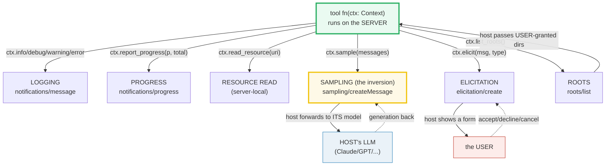
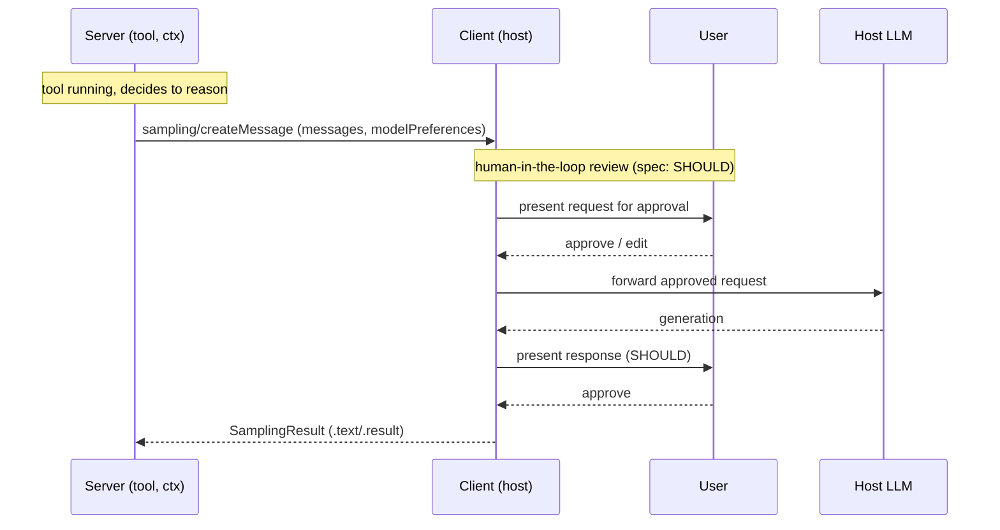

# MCP Context & Sampling — The Inversion Where a Server Borrows the Host's LLM

> **The one rule:** an MCP server is *not* just dumb data + code. Give a tool a
> `Context` parameter and it can **log** to the client, **report progress**,
> **read resources/roots**, **ask the host's LLM to sample** (generate text),
> and **elicit input from the user**. Sampling is the headline *inversion*: the
> server **borrows the host's model** to reason — so servers become **agentic**
> without each one shipping its own LLM, API key, or trust.

**Companion code:** [`mcp_context_sampling.py`](./mcp_context_sampling.py).
**Every value and table below is printed by `uv run python
mcp_context_sampling.py`** — change the code, re-run, re-paste. Nothing here is
hand-computed. Captured stdout lives in
[`mcp_context_sampling_output.txt`](./mcp_context_sampling_output.txt).

**Goal of this bundle (lineage, old → new):**

> from *"a server runs its own code only — the host calls tools and reads the
> results"* (🔗 [`MCP_TOOLS`](./MCP_TOOLS.md), [`MCP_ARCHITECTURE`](./MCP_ARCHITECTURE.md))
> → *"via the `Context`, a server can ASK the host's LLM (sampling), elicit user
> input, log, report progress, and read granted roots — the inversion that lets
> servers be agentic without bundling a model, a key, or the user's trust."*

🔗 Sits in Phase 8 between [`MCP_ARCHITECTURE`](./MCP_ARCHITECTURE.md) (#50,
host/client/server roles) and [`MCP_TOOLS`](./MCP_TOOLS.md) (#51, `@mcp.tool`).
The host-side callbacks here are the same surface a
[`LC_LANGGRAPH`](./LC_LANGGRAPH.md) agent (#42) implements when it *is* the
host. See [`TODO.md`](./TODO.md) for the full plan.

**Offline note:** sampling by definition needs a HOST model. This bundle
installs **host-side STUB handlers** (`sampling_handler`, `elicitation_handler`,
`log_handler`, `progress_handler`, `roots`) on the in-memory `Client`. The stub
model returns a canned string; the stub user returns a canned name. No network,
no API key, no real LLM — byte-reproducible. In production the host's **real**
model and the **real** user answer; only the wiring shown here changes.

---

## 0. The five Context capabilities on one page



| Capability | Context call | Wire method | Direction | Who answers |
|---|---|---|---|---|
| Logging | `ctx.info/debug/warning/error` | `notifications/message` | server → host | host console |
| Progress | `ctx.report_progress(p, total)` | `notifications/progress` | server → host | host UI |
| Sampling | `await ctx.sample(msg)` | `sampling/createMessage` | server → **host's LLM** | the host's model |
| Elicitation | `await ctx.elicit(msg, type=T)` | `elicitation/create` | server → **user** | the user |
| Roots | `await ctx.list_roots()` | `roots/list` | host → server | user-granted dirs |

The bottom three (sampling, elicitation, roots) all **route through the host**,
which is why the server never sees the model, the key, or unmediated disk.

---

## 1. Context basics — a tool with `ctx: Context` (auto-injected)

Add a parameter annotated `ctx: Context` and FastMCP **auto-injects** a context
object — the parameter is **excluded** from the tool's input schema (the client
never sees it). Inside the tool you can log, report progress, read resources,
ask the host to sample, elicit input, and read roots. Each MCP request gets a
**fresh** context scoped to that single request.

```python
from fastmcp.server.context import Context

@mcp.tool
async def ctx_basics(x: int, ctx: Context) -> str:
    await ctx.info(f"processing x={x}")                 # logging
    res = await ctx.read_resource("config://app")       # read a resource
    return f"x={x} cfg={res.contents[0].content!r}"
```

> From `mcp_context_sampling.py` Section A:
> ```
> ======================================================================
> SECTION A — Context basics: a tool with `ctx: Context` runs
> ======================================================================
> Add a parameter annotated `ctx: Context` and FastMCP auto-injects a
> context object (the param is EXCLUDED from the tool's input schema).
> Inside, the tool can log, report progress, read resources, ask the
> host's LLM to sample, elicit user input, and read granted roots.
> 
> ctx_basics(7).data          = "x=7 cfg='version=9.9'"
> result.is_error             = False
> Context methods exercised here + later sections:
>   ctx.info
>   ctx.debug
>   ctx.warning
>   ctx.error
>   ctx.report_progress
>   ctx.read_resource
>   ctx.sample
>   ctx.elicit
>   ctx.list_roots
> 
> [check] a tool with a Context arg ran and returned data: OK
> [check] the call was not an error: OK
> [check] Context exposes info/report_progress/sample/elicit/list_roots: OK
> ```

### Why the Context exists — directionality (internals)

Without `Context`, a tool is a pure function: the host calls it, it returns.
`Context` opens the **reverse channel**: the tool can talk *back up* to the host
*while it runs*. FastMCP implements this by binding the current MCP
`RequestContext` (the live JSON-RPC session) to the `Context` object at call
time — that's why context is **only valid during a request** and why
`ctx.info` can reach the client mid-execution. `read_resource` returns a
`ResourceResult` whose `.contents` is a list of `ResourceContent` (each with
`.content` + `.mime_type`); resources here are **server-local** (the server
reads its own registry), unlike roots which come *down* from the host.

🔗 The mechanics of `@mcp.tool` (name/description/schema auto-derivation, the
`CallToolResult` shape) are in [`MCP_TOOLS`](./MCP_TOOLS.md) §A–D.

---

## 2. Logging — `ctx.info/debug/warning/error` reach the host

Each `ctx.<level>(msg)` emits a JSON-RPC `notifications/message` carrying
`level` + `data{msg, extra}` up to the client. The host installs
`log_handler=` on the `Client` to receive them. This is how a server surfaces
in-band diagnostics to whatever UI the user is looking at.

```python
@mcp.tool
async def ctx_logger(ctx: Context) -> str:
    await ctx.debug("debug-msg")
    await ctx.info("info-msg")
    await ctx.warning("warn-msg")
    await ctx.error("error-msg")
    return "logged-at-4-levels"
```

> From `mcp_context_sampling.py` Section B:
> ```
> ======================================================================
> SECTION B — Logging: ctx.info/debug/warning/error reach the host
> ======================================================================
> ctx.<level>(msg) sends a JSON-RPC `notifications/message` log up to
> the client. The host installs `log_handler=` to receive them. Each
> notification carries level + data{msg, extra}.
> 
> ctx_logger().data           = 'logged-at-4-levels'
> captured_logs (level, msg)  = [('debug', 'debug-msg'), ('info', 'info-msg'), ('warning', 'warn-msg'), ('error', 'error-msg')]
> 
> [check] the tool logged at all 4 levels: OK
> [check] the messages arrived intact: OK
> ```

### Why logging is a *notification*, not a return value (internals)

A tool returns **once**; logging can happen **many times mid-run**. So logs ride
on `notifications/message` — a server-initiated JSON-RPC notification that does
not block the request. The four levels (`debug`/`info`/`warning`/`error`) map
to the MCP `LoggingLevel` enum; `ctx.log(msg, level=...)` is the generic form.
The host's `log_handler` receives `LoggingMessageNotificationParams` with
`.level` and `.data`; here the handler captures `(level, data["msg"])` tuples
and asserts all four arrived in order.

---

## 3. Progress — `ctx.report_progress(done, total)` → host callback

For long-running tools, `report_progress(progress, total)` streams
`notifications/progress` so the host can render a progress bar. The host passes
`progress_handler=` (to the `Client` or to a specific `call_tool`) and receives
`(progress, total, message=None)` per update.

```python
@mcp.tool
async def ctx_progress(n: int, ctx: Context) -> str:
    for i in range(n):
        await ctx.report_progress(i + 1, n)
    return "done"
```

> From `mcp_context_sampling.py` Section C:
> ```
> ======================================================================
> SECTION C — Progress: ctx.report_progress(done, total) -> host callback
> ======================================================================
> report_progress(progress, total) streams progress notifications up to
> the client. The host passes `progress_handler=` to call_tool (or to
> the Client) and receives (progress, total, message=None) per update.
> 
> ctx_progress(3).data        = 'done'
> captured_progress           = [(1.0, 3.0), (2.0, 3.0), (3.0, 3.0)]
> 
> [check] the tool returned 'done' after 3 updates: OK
> [check] the host saw 3 updates (1/3, 2/3, 3/3): OK
> ```

🔗 `MCP_TOOLS` §G used the same `progress_handler=` against `call_tool`. The
only new idea here is the symmetry: **progress is the server → host stream that
mirrors** the call's host → server direction.

---

## 4. Sampling — `ctx.sample` asks the HOST's LLM (the inversion)

This is the core of the bundle. `await ctx.sample(messages, ...)` sends
`sampling/createMessage` **up** to the client. The host's `sampling_handler`
forwards the request to **its own** model and returns the generation. The
server never sees an API key, never picks the exact model (it sends
`modelPreferences` — *hints*, not names), and the user **SHOULD** approve each
request (the spec mandates a human-in-the-loop).

```python
@mcp.tool
async def ctx_sample(question: str, ctx: Context) -> str:
    res = await ctx.sample(question, temperature=0.0, max_tokens=32)
    return f"host-said:{res.text!r}"
```

The host side (here a STUB; in production this forwards to Claude/GPT/etc.):

```python
async def stub_sampling_handler(messages, params, context):
    return STUB_HOST_REPLY  # real host: call its LLM with messages + params
```

> From `mcp_context_sampling.py` Section D:
> ```
> ======================================================================
> SECTION D — Sampling: ctx.sample asks the HOST's LLM (the inversion)
> ======================================================================
> ctx.sample(messages, ...) sends `sampling/createMessage` UP to the
> client. The host's sampling_handler forwards to ITS model and returns
> the generation. The server never sees an API key. Here the host is a
> STUB returning a canned string; in production the host's REAL model
> answers.
> 
> ctx_sample(...).data        = "host-said:'[HOST-STUB] The capital of France is Paris.'"
> stub host reply (STUB_HOST_REPLY) = '[HOST-STUB] The capital of France is Paris.'
> 
> [check] ctx.sample returned the host-stub's canned text: OK
> [check] the server got text back WITHOUT owning a model or key: OK
> ```

### How the host-side stub works (the offline trick)

The in-memory `Client` accepts four optional callbacks that become the server's
"upward" channel:

```python
Client(
    mcp,
    sampling_handler=stub_sampling_handler,      # answers ctx.sample(...)
    elicitation_handler=stub_elicitation_handler, # answers ctx.elicit(...)
    log_handler=capture_log_handler,             # receives ctx.info/...
    progress_handler=capture_progress_handler,    # receives report_progress
    roots=[Root(uri="file:///...", name="...")],  # answers ctx.list_roots()
)
```

`create_sampling_callback` wraps the handler into the MCP session's
`sampling_callback`; when the server calls `ctx.sample`, the request crosses the
in-memory transport, hits the callback, and the handler's return value (a plain
`str`, or a full `CreateMessageResult` with `role`/`content`/`model`/`stopReason`)
is wrapped into a `SamplingResult` with `.text`, `.result`, and `.history`. The
stub returns a fixed string so the run is deterministic and offline; swapping
in a real provider only changes the handler body.

### Why this is an *inversion* (internals)

In a normal tool call the **host** drives: it asks the model, the model decides
to call a tool, the host invokes the server. Sampling **inverts the arrow**: the
**server** initiates an LLM call, nested inside a tool, and the **host**
services it. This lets a server implement **agentic loops** (plan → call a tool
→ ask the host's model to reason over the result → decide the next step)
**without bundling a model**. The trade the server makes: it gives up control
over *which* model runs (only hints), *whether* the request is approved (the
user can deny it), and *what* the model sees (the host may redact or rewrite).
That trade is precisely what keeps the host the trust boundary.



---

## 5. The inversion in one table — who owns what

| who | owns the model? | owns the API key? | job |
|---|---|---|---|
| **SERVER** | NO (borrows it) | NO | tools/data + can ASK host to sample |
| **HOST** | YES | YES | runs the LLM, mediates all requests, holds trust |
| **USER** | — | — | approves sampling/elicitation, grants roots |

> From `mcp_context_sampling.py` Section E:
> ```
> ======================================================================
> SECTION E — The inversion: the server BORROWS the host's model
> ======================================================================
> Normally a server is dumb data + code. With sampling, the server can
> ASK the host's LLM to reason — enabling AGENTIC servers (the server
> decides a plan, then uses the host's model to think) without each
> server shipping its own LLM, key, or trust. The HOST owns the model.
> 
> who       owns the model?     owns the API key?     job
> ------------------------------------------------------------------------------
> SERVER    NO (borrows it)     NO                    tools/data + can ASK host to sample
> HOST      YES                 YES                   runs the LLM, mediates all requests, holds trust
> USER      -                   -                     approves sampling/elicitation, grants roots
> 
> [check] the inversion: server borrows the host model (no own model/key): OK
> ```

The practical payoff: you can write a server that *summarizes*, *classifies*, or
*plans* — genuinely intelligent behaviour — and ship **zero model weights and
zero keys**. The host the user already trusts (and already paid for the model
on) supplies the intelligence. The cost: latency (every sample is a round-trip
through the host) and indeterminism (the host's model, not yours, decides).

---

## 6. Elicitation — `ctx.elicit` asks the USER for structured input

New in the 2025-06-18 MCP spec. `await ctx.elicit(message, response_type=T)`
sends `elicitation/create` up to the client; the host shows a **form** to the
user and returns one of three actions: `accept` (+`data`), `decline`, or
`cancel`. The schema is restricted to **flat objects of primitives** (string,
number, boolean, enum) so any client can render it. The server must not request
sensitive information. Here the user is a stub returning a fixed name.

```python
@mcp.tool
async def ctx_elicit_demo(ctx: Context) -> str:
    res = await ctx.elicit("Enter your GitHub username:", response_type=str)
    return f"action={res.action} data={res.data!r}"
```

> From `mcp_context_sampling.py` Section F:
> ```
> ======================================================================
> SECTION F — Elicitation: ctx.elicit asks the USER for structured input
> ======================================================================
> ctx.elicit(message, response_type=T) sends `elicitation/create` up to
> the client; the host shows a form to the USER and returns one of three
> actions: 'accept' (+data), 'decline', or 'cancel'. The host (not the
> server) owns the UI and the user's trust. Here the user is a STUB.
> 
> ctx_elicit_demo().data      = "action=accept data='octocat'"
> stub user reply             = 'octocat'
> 
> [check] elicit returned action='accept': OK
> [check] elicit returned the stub user's data: OK
> ```

### Why three actions, not a nullable value (internals)

A naive API returns `Optional[str]` — but `None` is ambiguous (did the user
decline, or dismiss the dialog?). The spec's three-action model
(`accept`/`decline`/`cancel`) lets the server distinguish an explicit "no"
(decline → offer an alternative) from a dismissal (cancel → ask again later).
`response_type=str` wraps the scalar in a single-field `{"value": ...}` schema
for the wire and unwraps it on return, so `res.data` is the plain string. Pass a
`BaseModel`/`dataclass`/`TypedDict` for a multi-field form; the host's
`elicitation_handler` returns the value (or an `ElicitResult` with an explicit
`.action`).

---

## 7. Roots — `ctx.list_roots` reads the dirs the USER granted

Roots are **filesystem boundaries** the user granted the server. The host
declares the `roots` capability and passes the list down; the server calls
`roots/list` to discover them and **must respect** those boundaries — this is
the permission fence that keeps a server from wandering outside the workspace.
A root is a `file://` URI plus an optional display name.

```python
GRANTED_ROOTS = [Root(uri="file:///home/user/project", name="My Project")]

@mcp.tool
async def ctx_roots_demo(ctx: Context) -> str:
    roots = await ctx.list_roots()
    return f"roots={[(str(r.uri), r.name) for r in roots]}"
```

> From `mcp_context_sampling.py` Section G:
> ```
> ======================================================================
> SECTION G — Roots: ctx.list_roots reads the dirs the USER granted
> ======================================================================
> Roots are filesystem boundaries the USER granted the server (the host
> declares the `roots` capability + passes them down). The server asks
> `roots/list` and must respect those boundaries — the permission fence.
> 
> ctx_roots_demo().data       = "roots=[('file:///home/user/project', 'My Project')]"
> GRANTED_ROOTS               = [('file:///home/user/project', 'My Project')]
> 
> [check] ctx.list_roots returned the one granted root: OK
> ```

### Why roots flow *down* while sampling flows *up* (internals)

Sampling/elicitation are **server → host** (the server asks, the host answers).
Roots are the one capability that flows **host → server**: the host *pushes*
the granted directories so the server knows its own fence. The host may emit
`notifications/roots/list_changed` when the workspace changes, and the server
re-queries. The security contract: the host **MUST** validate root URIs against
path traversal and only expose dirs with consent; the server **SHOULD** cache
and re-check every path it touches against the granted set.

---

## 8. The trust / permission model — everything is host-mediated

All five Context capabilities route **through** the host. The server never
receives the model, the API key, or direct filesystem access — it **asks**, the
host **shows** the user, the user **approves**, the host **returns** the result.
This is the security pillar that makes "agentic servers" safe to install
untrusted.

| capability | direction | who answers | mediated by |
|---|---|---|---|
| logging | server → host | host console | host (display only) |
| progress | server → host | host UI | host (display only) |
| sampling | server → host | **HOST's LLM** | host + **USER approval** |
| elicitation | server → host | **the USER** | host + **USER approval** |
| roots | host → server | USER-granted dirs | host (**permission fence**) |

> From `mcp_context_sampling.py` Section H:
> ```
> ======================================================================
> SECTION H — The trust model: sampling/elicitation/roots are host-mediated
> ======================================================================
> All four Context capabilities route THROUGH the host. The server never
> gets the model, the key, or direct filesystem access — it ASKS, the
> host SHOWS the user, the user APPROVES, the host returns the result.
> This is the security pillar that makes 'agentic servers' safe.
> 
> capability            direction         who answers       mediated by
> --------------------------------------------------------------------------
> logging               server -> host    host console      host (display only)
> progress              server -> host    host UI           host (display only)
> sampling              server -> host    HOST's LLM        host + USER approval
> elicitation           server -> host    the USER          host + USER approval
> roots                 host -> server    USER-granted dirs host (permission fence)
> 
> [check] every Context capability is mediated by the host: OK
> [check] the server never receives the model or API key directly: OK
> ```

The spec is explicit (Sampling → Security): *"there SHOULD always be a human in
the loop with the ability to deny sampling requests."* The host is where that
human lives. A server can be fully open-source and auditable yet still "smart",
because the intelligence is borrowed, not embedded.

🔗 When the host *is* your own agent, these same callbacks are what a
[`LC_LANGGRAPH`](./LC_LANGGRAPH.md) graph wires up; the agentic integration of
sampling servers into such a host is [`MCP_INTEGRATION`](./MCP_INTEGRATION.md)
(#54).

---

## Pitfalls

| Trap | Example | The fix |
|---|---|---|
| Treating sampling as deterministic | `ctx.sample` result depends on the **host's** model, not yours | pin `temperature=0` *if the host honors it*; never assert exact wording across hosts |
| Assuming a specific model name | servers can't name a model — only `modelPreferences` (hints) | request by *capability* (`intelligencePriority`/`speedPriority`/`costPriority`); the host maps hints to what it has |
| Forgetting the human-in-the-loop | the user **may deny** any sampling/elicitation request | always handle `decline`/`cancel` and a denied sampling error (`-1`, "User rejected") |
| Using `ctx` outside a request | context is bound to the **live** request only | `get_context()` raises `RuntimeError` outside a request; don't stash `ctx` for later |
| Expecting elicitation to carry secrets | the spec **MUST NOT** request sensitive info; schema is flat primitives only | use elicitation for names/choices; keep secrets in resources the host already guards |
| Confusing roots with resources | resources are **server-local** (`read_resource`); roots are **host-granted dirs** (`list_roots`) | `read_resource` reads the server's registry; `list_roots` discovers the user's fence |
| Ignoring `roots/list_changed` | the workspace can change mid-session | re-query `list_roots` after the notification; re-check every path against the granted set |
| Calling `ctx` methods on a sync tool path | `info`/`sample`/`elicit` are **async** | make the tool `async def` and `await` every Context call |
| Trusting the stub output as the "real" answer | this bundle's `sampling_handler` returns a **canned** string | swap the handler for a real provider in production; the server code is unchanged |
| `elicit(response_type=None)` | deprecated; some clients (VS Code) hang on an empty form | always pass an explicit `response_type` (`str`, `int`, a `BaseModel`, …) |

---

## Cheat sheet

- **The Context object** (`from fastmcp.server.context import Context`): add a
  `ctx: Context` param to a tool/resource/prompt; FastMCP auto-injects it and
  **excludes** it from the schema. Valid only during one request.
- **Logging:** `await ctx.info/debug/warning/error(msg)` → host's `log_handler`
  (`notifications/message`, level + `data{msg, extra}`).
- **Progress:** `await ctx.report_progress(done, total)` → host's
  `progress_handler(progress, total, message=None)`.
- **Resource read:** `await ctx.read_resource(uri)` → `ResourceResult`
  (`.contents[0].content`); **server-local** registry.
- **Sampling (the inversion):** `await ctx.sample(msg, temperature=, max_tokens=, model_preferences=)`
  → `SamplingResult` (`.text`/`.result`/`.history`). Server **asks** the host's
  LLM; host's `sampling_handler(messages, params, context)` answers. No key on
  the server. Human-in-the-loop SHOULD approve.
- **Elicitation:** `await ctx.elicit(msg, response_type=T)` → result with
  `.action` (`accept`/`decline`/`cancel`) + `.data`. Host shows a form; flat
  primitive schemas only; never request secrets.
- **Roots:** `await ctx.list_roots()` → `list[Root]` (`uri`, `name`). Host-granted
  `file://` dirs; the **permission fence**. Flows host → server (the inverse of
  sampling/elicitation).
- **The host-side wiring (offline stubs):**
  `Client(mcp, sampling_handler=, elicitation_handler=, log_handler=, progress_handler=, roots=[Root(...)])`.
  Swap stubs for a real provider/user in production — server code is unchanged.
- **The trust model:** every capability is **host-mediated**. The server never
  gets the model, the key, or unmediated disk. That is what makes agentic
  servers safe.

---

## Sources

- **FastMCP docs — MCP Context.**
  https://gofastmcp.com/servers/context
  *The canonical list of Context capabilities (logging, progress, resource
  access, **LLM sampling**, **user elicitation**, roots, session state) and the
  `ctx: Context` type-hint injection. Verified the `ctx.info/debug/warning/error`,
  `ctx.report_progress(progress, total)`, `ctx.read_resource`, `ctx.sample`,
  `ctx.elicit(message, response_type=)`, and `ctx.list_roots` signatures quoted
  in §§1–7.*
- **Model Context Protocol — Concepts: Sampling.**
  https://modelcontextprotocol.io/docs/concepts/sampling
  *The inversion stated authoritatively: servers request LLM sampling "with no
  server API keys necessary"; the human-in-the-loop warning ("there SHOULD
  always be a human in the loop"); the `sampling/createMessage` request/response
  shape; `modelPreferences` (hints + `costPriority`/`speedPriority`/`intelligencePriority`).
  Basis for §4 and the sequence diagram.*
- **Model Context Protocol — Concepts: Roots.**
  https://modelcontextprotocol.io/docs/concepts/roots
  *Roots as filesystem boundaries; `roots/list` + `notifications/roots/list_changed`;
  the `file://` URI requirement; the security contract (host MUST validate path
  traversal, server SHOULD respect boundaries). Basis for §7.*
- **Model Context Protocol — Specification 2025-06-18: Elicitation.**
  https://modelcontextprotocol.io/specification/2025-06-18/client/elicitation
  *The `elicitation/create` request, the restricted flat-object primitive schema
  (string/number/boolean/enum), and the three-action response model
  (`accept`/`decline`/`cancel`). The "Servers MUST NOT request sensitive
  information" rule. Basis for §6.*
- **FastMCP 3.4.2 installed package (verified API surface).**
  `fastmcp.server.context.Context` method signatures
  (`info/debug/warning/error/log/report_progress/read_resource/sample/elicit/list_roots/get_state/set_state`);
  `fastmcp.client.sampling.SamplingHandler` + `create_sampling_callback`;
  `fastmcp.client.elicitation.ElicitationHandler`;
  `fastmcp.client.logging.LogHandler`; `fastmcp.client.roots.RootsHandler`;
  `Client(..., sampling_handler=, elicitation_handler=, log_handler=, progress_handler=, roots=)`;
  `SamplingResult.text/.result/.history`; `ResourceResult.contents`.
  *Confirmed by `inspect.signature`/`inspect.getsource` on the installed 3.4.2
  wheel — every signature in the §0 table and the cheat sheet matches.*
- **GitHub — modelcontextprotocol discussion #124 (Improve sampling).**
  https://github.com/modelcontextprotocol/modelcontextprotocol/discussions/124
  *Independent confirmation that `sampling/createMessage` lets servers request
  LLM responses from clients "without [the server] … API keys."*
- **Sibling bundles (cross-references).**
  [`MCP_ARCHITECTURE`](./MCP_ARCHITECTURE.md) #50 — host/client/server roles;
  [`MCP_TOOLS`](./MCP_TOOLS.md) #51 — `@mcp.tool`, `CallToolResult`, the same
  `progress_handler=` used in its §G;
  [`MCP_INTEGRATION`](./MCP_INTEGRATION.md) #54 — agentic host integration;
  [`LC_LANGGRAPH`](./LC_LANGGRAPH.md) #42 — the host side as an agent graph.
