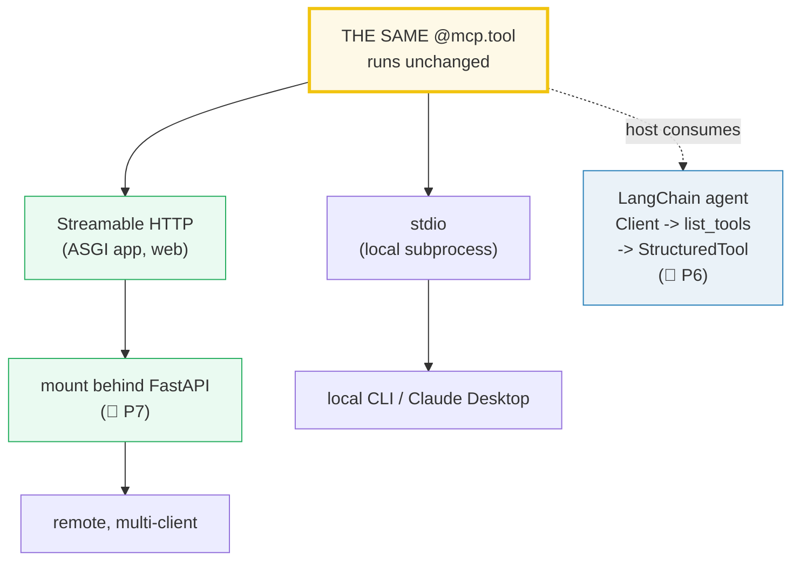
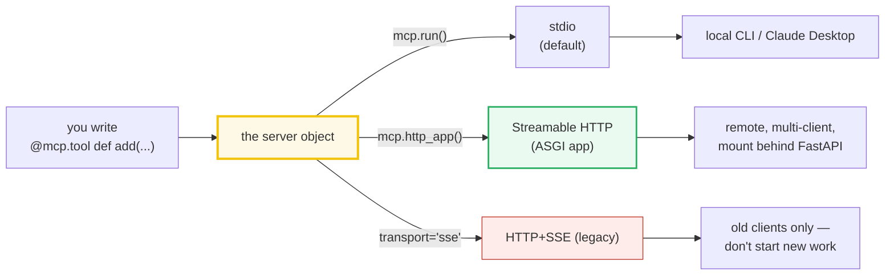
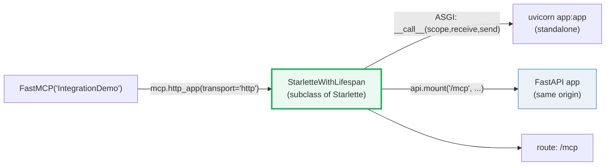
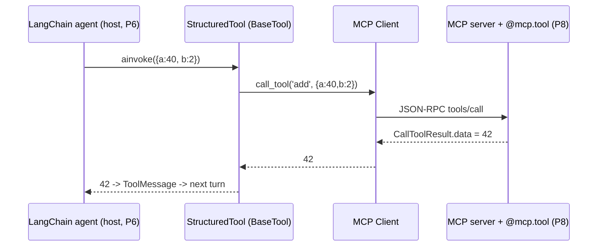
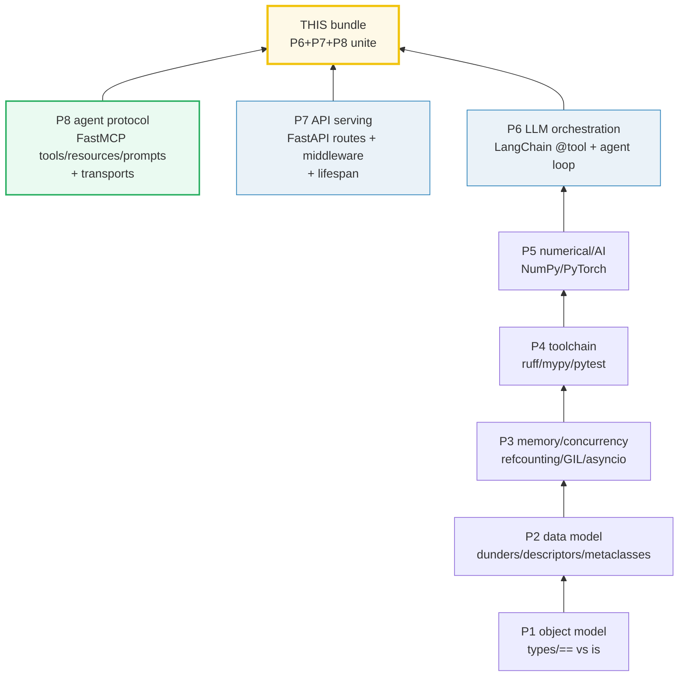

# MCP Integration — Transports, FastAPI Mounting, and LangChain Consuming MCP

> **The one rule:** an MCP server is not an island. You deploy it over the RIGHT
> transport (stdio for local subprocess tools, Streamable HTTP for remote
> web-deployable servers), and a LangChain agent can CONSUME its tools by
> connecting a Client. This is the capstone: Phase 6 (LangChain) + Phase 7
> (FastAPI) + Phase 8 (MCP) compose end-to-end.

**Companion code:** [`mcp_integration.py`](./mcp_integration.py).
**Every table and value below is printed by `uv run python
mcp_integration.py`** — change the code, re-run, re-paste. Nothing here is
hand-computed. Captured stdout lives in
[`mcp_integration_output.txt`](./mcp_integration_output.txt).

**Goal of this bundle (lineage, old → new):**

> from *"my MCP server is an island — I built a tool but only I can call it"*
> → *"I deploy MCP over the right transport (stdio local / Streamable HTTP
> remote, mountable behind FastAPI), and a LangChain agent can consume an MCP
> server's tools — P6 + P7 + P8 unite."*

🔗 This is bundle **#54, the Phase 8 capstone**. It ties together:
- [`LC_TOOLS_AGENTS`](./LC_TOOLS_AGENTS.md) (P6 #41) — the host IS a tool-calling
  agent; its `AIMessage.tool_calls` become MCP `call_tool` requests.
- [`FASTAPI_MIDDLEWARE_LIFESPAN`](./FASTAPI_MIDDLEWARE_LIFESPAN.md) (P7 #47) —
  the Streamable-HTTP server is an ASGI app you can MOUNT behind FastAPI, so its
  middleware onion (CORS, auth, logging) covers the MCP endpoint too.
- [`MCP_ARCHITECTURE`](./MCP_ARCHITECTURE.md) / [`MCP_TOOLS`](./MCP_TOOLS.md)
  (P8 #50/#51) — the host-client-server roles and the `@mcp.tool` primitive
  this bundle deploys and consumes.

---

## 0. The three ideas on one page



| Decision | The answer | Why |
|---|---|---|
| Which transport? | **stdio** for local/subprocess; **Streamable HTTP** for remote/web | the MCP spec defines exactly two standard transports; HTTP+SSE is deprecated |
| How to web-deploy? | `mcp.http_app()` → an ASGI **Starlette** app | serve with uvicorn standalone, or `api.mount('/mcp', ...)` behind FastAPI |
| How does an agent call it? | connect a **Client**, `list_tools`, wrap each as a LangChain `BaseTool` | the host-consumes-server bridge — P6 meets P8 |

---

## 1. Transport decision: stdio | Streamable HTTP | (legacy) SSE

The MCP specification ([Transports](https://modelcontextprotocol.io/docs/concepts/transports))
defines **exactly two standard transports**: `stdio` and **Streamable HTTP**.
The older **HTTP+SSE** transport (protocol version `2024-11-05`) is explicitly
**deprecated** and exists only for backwards compatibility. FastMCP exposes all
three so the choice is a **deployment decision, not a protocol decision**: the
*same* server, the *same* tools, a *different wire*.



| Transport | Process model | Use when |
|---|---|---|
| **stdio** | the client spawns the server as a subprocess | local CLI tools, files, Claude Desktop (1:1) |
| **Streamable HTTP** | the server is a web service (an ASGI app) | remote, multi-client, web, mount behind FastAPI |
| **HTTP+SSE (legacy)** | two-endpoint SSE+POST | ONLY for old clients — deprecated, do not start new work |

> From `mcp_integration.py` Section A:
> ```
> ======================================================================
> SECTION A — Transport decision: stdio | Streamable HTTP | (legacy) SSE
> ======================================================================
> The MCP spec defines exactly TWO standard transports — stdio and
> Streamable HTTP (HTTP+SSE from 2024-11-05 is DEPRECATED). FastMCP
> exposes all three. The choice is a deployment decision, not a
> protocol decision: the SAME server, the SAME tools, different wire.
> 
> transport         process model                 use when
> ------------------------------------------------------------------------------
> stdio             client spawns a subprocess    local CLI tools, files, Claude Desktop (1:1)
> Streamable HTTP   server is a web service (ASGI app)remote, multi-client, web, mount behind FastAPI
> HTTP+SSE (legacy) two-endpoint SSE+POST         ONLY for old clients — deprecated, do not start new work
> 
> [check] spec defines exactly two standard transports (stdio, Streamable HTTP): OK
> [check] HTTP+SSE (2024-11-05) is deprecated: OK
> [check] the SAME @mcp.tool runs unchanged across every transport: OK
> ```

### Why stdio is the local default (internals)

Per the spec, in `stdio` the **client launches the server as a subprocess**; the
server reads newline-delimited JSON-RPC from `stdin` and writes responses to
`stdout`, with `stderr` reserved for logs. There is no socket and no port — the
OS pipe IS the transport. This is why a stdio server "doesn't stay running" on
its own: the client owns its lifecycle (close `stdin` → terminate). It is the
right choice for local CLI tools, filesystem access, and editor/desktop
integrations (Claude Desktop), where the user invoking the server IS the trust
boundary.

---

## 2. stdio: the host spawns the server as a subprocess

Two entry points start a stdio server (we describe them; we do **not** spawn a
subprocess — that would be non-deterministic in this bundle):

```python
# (a) the programmatic entry — blocking, stdio when transport is None
if __name__ == "__main__":
    mcp.run()

# (b) the CLI — finds the instance named mcp/server/app for you
#     $ fastmcp run server.py
```

On the **host side**, `Client("server.py")` spawns the subprocess, performs the
`initialize` handshake over the pipe, and owns the child's lifecycle. No
`host`/`port` exist for stdio — confirming it is a pipe, not a socket.

> From `mcp_integration.py` Section B:
> ```
> ======================================================================
> SECTION B — stdio: the host spawns the server as a subprocess (sketch)
> ======================================================================
> Per spec Transports/stdio: the CLIENT launches the server as a
> subprocess; the server reads newline-delimited JSON-RPC from stdin
> and writes responses to stdout (stderr is for logs only). We do NOT
> spawn here (keep it offline) — we show the two entry points.
> 
> mcp.run(transport: 'Transport | None' = None, show_banner: 'bool | None' = None, **transport_kwargs: 'Any') -> 'None'
>   transport=None -> stdio (default); **transport_kwargs carry host/port
> if __name__ == '__main__': mcp.run()                  # stdio default
>   $ fastmcp run server.py                            # CLI, stdio
>   $ python server.py                                 # mcp.run() stdio
> 
> Wire (host side): Client('server.py') spawns the subprocess and owns
> its lifecycle; close stdin -> terminate. No socket, no port.
> 
> [check] run() signature takes 'transport' + '**transport_kwargs': OK
> [check] run() is blocking (returns None): OK
> [check] stdio needs NO host/port (subprocess, no socket): OK
> ```

---

## 3. Streamable HTTP: `mcp.http_app()` returns an ASGI-callable Starlette app

For network deployment, FastMCP builds the Streamable-HTTP server as a
**Starlette ASGI app object** via `mcp.http_app(transport="http")`. Crucially we
get the *object* back without ever calling uvicorn — so this bundle stays
offline and deterministic while still proving the app is real and ASGI-callable.

The return type `StarletteWithLifespan` is a **subclass of `Starlette`**, so it
is a genuine ASGI app: it defines `__call__(scope, receive, send)`, which is the
entire ASGI contract. Its default MCP endpoint is `/mcp` (matches the spec's
"single HTTP endpoint path … e.g. `https://example.com/mcp`"). Serve it
standalone with `uvicorn`, or mount it behind a larger app (next section).



> From `mcp_integration.py` Section C:
> ```
> ======================================================================
> SECTION C — Streamable HTTP: mcp.http_app() -> an ASGI-callable Starlette app
> ======================================================================
> mcp.http_app(transport='http') builds the Streamable-HTTP server as a
> Starlette ASGI app OBJECT — we do NOT call uvicorn here (no port bind).
> The object can be served standalone OR mounted behind a FastAPI app.
> 
> type(app)               = StarletteWithLifespan
> isinstance(app, Starlette) = True
> callable(app) (__call__)   = True
> app.routes (paths)      = ['/mcp']
> default MCP endpoint     = '/mcp'
> 
> Standalone:   uvicorn app:app            # app = mcp.http_app()
> Behind FastAPI (next): api.mount('/mcp', mcp.http_app())
> 
> [check] http_app() returns a Starlette (ASGI) app: OK
> [check] the ASGI app is callable (__call__ defined): OK
> [check] the default Streamable-HTTP endpoint is /mcp: OK
> [check] no port was bound (object only, never served): OK
> ```

### Why `http_app()` returns an object, not a running server (internals)

`run(transport="http", ...)` would *block* and bind a port (it wraps uvicorn).
`http_app()` instead returns the **ASGI app object** — the thing uvicorn would
serve — without starting the server. This separation is what lets you mount the
MCP server into a host ASGI app (FastAPI, Starlette, Litestar): the host owns
the event loop and the listening socket; the MCP app is just one route tree
inside it. That is exactly the same "build the app object, hand it to a server"
pattern FastAPI itself uses (`app = FastAPI()` then `uvicorn app:app`).

---

## 4. Mounting the MCP server behind FastAPI (🔗 P7)

FastAPI/Starlette apps can `mount()` another ASGI app at a sub-path. So one
FastAPI app can serve ordinary REST routes **and** an MCP endpoint on the *same
origin*:

```python
from fastapi import FastAPI
api = FastAPI(title="HostApp")

@api.get("/health")
async def health() -> dict:
    return {"ok": True}

api.mount("/mcp", mcp.http_app(transport="http"))
```

Now `/health` (REST) and `/mcp` (MCP) live behind one origin. The payoff:
**FastAPI's middleware onion — CORS, auth, request logging, exception handlers —
wraps the MCP endpoint too.** The same hardening you built in
🔗 [`FASTAPI_MIDDLEWARE_LIFESPAN`](./FASTAPI_MIDDLEWARE_LIFESPAN.md) applies to
your agent's tool calls without any MCP-specific work.

> From `mcp_integration.py` Section C2:
> ```
> ======================================================================
> SECTION C2 — Mounting the MCP server behind FastAPI (no port bind)
> ======================================================================
> FastAPI/Starlette apps can MOUNT another ASGI app at a sub-path. So a
> FastAPI app can serve REST routes AND an MCP server on the same origin
> (🔗 FASTAPI_MIDDLEWARE_LIFESPAN: middleware wraps BOTH).
> 
> FastAPI routes after mount = ['/docs', '/docs/oauth2-redirect', '/health', '/mcp', '/openapi.json', '/redoc']
> (REST '/health' + MCP '/mcp' live behind ONE origin; FastAPI's
>  middleware onion — CORS, auth, logging — covers the MCP path too.)
> 
> [check] FastAPI route '/health' present: OK
> [check] MCP server mounted at '/mcp' behind FastAPI: OK
> [check] no port was bound (built objects only): OK
> ```

---

## 5. Consuming MCP from LangChain — the capstone link (🔗 P6)

This is the bridge that makes the server "not an island". A **host** (here, a
LangChain agent) connects a `Client`, lists the server's tools, and **exposes
each as a LangChain `BaseTool`** whose coroutine does an MCP `call_tool`. The
agent's tool-call (`name` + `args`) is then carried over the transport to the
server's actual function.

The production library for this is
[`langchain-mcp-adapters`](https://reference.langchain.com/python/langchain-mcp-adapters)
(not installed in this repo's env), so the bundle demonstrates the **thin manual
adapter** that does the same thing in a dozen lines:

1. read the MCP tool's `inputSchema` (a JSON-Schema dict, see 🔗
   [`MCP_TOOLS`](./MCP_TOOLS.md));
2. rebuild a **Pydantic `args_schema`** from it (`integer`→`int`, `string`→`str`,
   …);
3. return a `StructuredTool` whose `coroutine` calls `client.call_tool(name,
   args)` and returns `.data`.

The result is a real `langchain_core.tools.BaseTool` (it is also a `Runnable`)
— exactly the kind of object `bind_tools` accepts (🔗
[`LC_TOOLS_AGENTS`](./LC_TOOLS_AGENTS.md) §C).



> From `mcp_integration.py` Section D:
> ```
> ======================================================================
> SECTION D — A LangChain agent consumes an MCP server's tools (in-memory)
> ======================================================================
> The host-consumes-server pattern: connect a Client, list the server's
> tools, and expose each as a LangChain tool whose coroutine does an MCP
> call_tool. Now the agent's tool-call (name + args) reaches the server's
> code — Phase 6 (LangChain) meets Phase 8 (MCP).
> (langchain-mcp-adapters would do this for you; here we show the bridge.)
> 
> connected, is_connected() = True
> mcp tool names            = ['add']
> langchain tool names      = ['add']
> type(add_lc).__name__     = StructuredTool
> isinstance(add_lc, BaseTool) = True
> isinstance(add_lc, Runnable) = True
> add_lc.description        = 'Add two integers (the shared tool across every transport demo).'
> add_lc.args fields        = ['a', 'b']
> add_lc.ainvoke({'a':40,'b':2}) -> 42  (type=int)
> 
> [check] client connected to the MCP server: OK
> [check] exactly one MCP tool ('add') was discovered: OK
> [check] the adapter wrapped it into a LangChain BaseTool: OK
> [check] the LangChain tool kept name 'add': OK
> [check] args schema was rebuilt from the MCP JSON-Schema (a, b as int): OK
> [check] calling the LC tool reached the MCP server and returned 42: OK
> [check] the returned value has type int (matches the tool's -> int): OK
> ```

### Why this is the "host-consumes-server" pattern (internals)

Recall the three MCP roles from 🔗 [`MCP_ARCHITECTURE`](./MCP_ARCHITECTURE.md):
**HOST** runs the LLM and manages clients; **CLIENT** is the 1:1 connection to
one server; **SERVER** exposes tools/resources/prompts. Here the LangChain agent
*is* the host, the `Client` is the per-server connection, and the `@mcp.tool`
function is the server primitive. The adapter's only job is **schema
translation**: it copies the MCP tool's JSON-Schema into a LangChain
`args_schema` (a Pydantic model) and routes `invoke`/`ainvoke` to
`call_tool`. The model never knows the tool is remote — it just sees another
`BaseTool` in its `bind_tools` list. That abstraction symmetry is why the
*same* `@tool` concept spans both ecosystems.

---

## 6. The end-to-end shape — P6 + P7 + P8 united

Put the pieces in a row and the curriculum's three AI phases compose into one
dataflow. The host is a LangChain agent (P6); the transport is the only thing
FastAPI contributes (P7 — it *mounts* the Streamable-HTTP app); the server's
tool is the P8 primitive that actually runs.

| Hop | What happens |
|---|---|
| 1 host/agent | LangChain `create_react_agent` decides "call `add(40,2)`" |
| 2 tool-call | `AIMessage.tool_calls` → `{name:'add', args:{a:40,b:2}}` |
| 3 MCP client | `Client.call_tool('add', {a:40,b:2})` (JSON-RPC) |
| 4 transport | stdio \| Streamable HTTP \| in-memory |
| 5 MCP server | the `@mcp.tool` fn runs server-side: `40 + 2` |
| 6 result | `CallToolResult.data` → `42` → fed back as a `ToolMessage` |
| 7 agent | next model turn sees the `42`, emits the final answer |

> From `mcp_integration.py` Section E:
> ```
> ======================================================================
> SECTION E — End-to-end shape: LangChain agent -> client -> MCP tool -> result
> ======================================================================
> The whole stack in one line of dataflow. The host (a LangChain agent,
> P6) decides to call a tool; the MCP client (P8) carries the call over
> a transport; the server's tool (P8) runs and returns. The FastAPI layer
> (P7) is ONE transport option for the client->server hop.
> 
> hop             what happens
> ----------------------------------------------------------------------
> 1 host/agent    LangChain create_react_agent decides 'call add(40,2)'
> 2 tool-call     AIMessage.tool_calls -> {name:'add', args:{a:40,b:2}}
> 3 MCP client    Client.call_tool('add', {a:40,b:2})  (JSON-RPC)
> 4 transport     stdio | Streamable HTTP | in-memory
> 5 MCP server    the @mcp.tool fn runs server-side: 40 + 2
> 6 result        CallToolResult.data -> 42 -> fed back as ToolMessage
> 7 agent         next model turn sees the 42, emits final answer
> 
> [check] the host is a LangChain agent (P6): OK
> [check] the transport is the ONLY thing P7 contributes (FastAPI mounts it): OK
> [check] the server's tool is the P8 primitive that actually runs: OK
> [check] result feeds back as a ToolMessage so the agent can loop: OK
> ```

---

## 7. Production checklist — the stdio-vs-HTTP security boundary

The transport choice **is** the security model. **stdio** runs the server as a
subprocess on the *user's* machine, so the user is the trust boundary — no
network auth is needed, but you **must vet the server code** (it runs arbitrary
Python with the user's privileges). **Streamable HTTP** exposes the server on
the network, so every web-app hardening rule applies (🔗
[`FASTAPI_MIDDLEWARE_LIFESPAN`](./FASTAPI_MIDDLEWARE_LIFESPAN.md)). The spec is
explicit: servers **MUST** validate the `Origin` header (DNS-rebinding
defense), **SHOULD** bind `127.0.0.1` when local, and **SHOULD** require auth on
all connections.

| Item | What |
|---|---|
| auth on HTTP transport | require a token / OAuth on the MCP endpoint |
| rate limiting | cap calls per session / per IP (slowth) |
| logging / observability | structured logs + request id + lifespan |
| secrets not in source | env vars / a vault; never hardcode keys |
| resource limits | timeouts, max tool duration, max payload |
| localhost binding | bind `127.0.0.1` for local-only HTTP servers |
| Origin header validation | spec: **MUST** validate Origin (DNS rebinding) |
| stdio server vetting | stdio runs ARBITRARY code → audit the server |

> From `mcp_integration.py` Section F:
> ```
> ======================================================================
> SECTION F — Production checklist: the stdio-vs-HTTP security boundary
> ======================================================================
> stdio runs the server in-process-equivalent (subprocess) on the USER's
> machine -> the user IS the trust boundary; no network auth needed but
> you MUST vet server code. Streamable HTTP exposes the server on the
> network -> every web-app hardening rule applies (🔗 FASTAPI).
> 
> item                      what
> ----------------------------------------------------------------------
> auth on HTTP transport    require a token / OAuth on the MCP endpoint
> rate limiting             cap calls per session / per IP (slowth)
> logging / observability   structured logs + request id + lifespan
> secrets not in source     env vars / a vault; never hardcode keys
> resource limits           timeouts, max tool duration, max payload
> localhost binding         bind 127.0.0.1 for local-only HTTP servers
> Origin header validation  spec: MUST validate Origin (DNS rebinding)
> stdio server vetting      stdio runs ARBITRARY code -> audit the server
> 
> [check] checklist covers: auth on HTTP transport: OK
> [check] checklist covers: rate limiting: OK
> [check] checklist covers: logging / observability: OK
> [check] checklist covers: secrets not in source: OK
> [check] checklist covers: resource limits: OK
> [check] checklist covers: localhost binding: OK
> [check] checklist covers: Origin header validation: OK
> [check] checklist covers: stdio server vetting: OK
> ```

---

## 8. The curriculum stack — Python mastery → agent protocol (recap)

This bundle is the capstone because it composes every prior phase. Mastery is a
**stack**: language fundamentals at the bottom, the agent protocol at the top,
each layer built on the one below.



> From `mcp_integration.py` Section G:
> ```
> ======================================================================
> SECTION G — The curriculum stack: P1 -> P8 (Python mastery -> agent protocol)
> ======================================================================
> This bundle is the capstone because it composes every prior phase.
> Mastery is a stack: language fundamentals at the bottom, the agent
> protocol at the top, each layer built on the one below.
> 
> phase                   the idea
> ----------------------------------------------------------------------
> P1 object model         types/numeric tower/truthiness == vs is
> P2 data model           dunder protocols, descriptors, metaclasses
> P3 memory/concurrency   refcounting/GIL/asyncio
> P4 toolchain            ruff/mypy/pytest/packaging
> P5 numerical/AI         NumPy/PyTorch tensors + autograd
> P6 LLM orchestration    LangChain @tool + bind_tools + agent loop
> P7 API serving          FastAPI routes + middleware + lifespan
> P8 agent protocol       FastMCP tools/resources/prompts + transports
> 
> THIS bundle = P6 agent (host) -> P7 FastAPI (a transport) -> P8 MCP
> (the server + its tools). The three AI phases compose end-to-end.
> 
> [check] eight phases from P1 (language) to P8 (agent protocol): OK
> [check] the capstone ties together P6, P7, and P8: OK
> ```

---

## Pitfalls

| Trap | Example | The fix |
|---|---|---|
| Starting new work on the deprecated transport | `mcp.run(transport="sse")` for a new server | use `transport="http"` (Streamable HTTP); SSE is 2024-11-05 legacy only |
| Confusing `run()` (blocks + binds port) with `http_app()` (returns object) | calling `mcp.run()` inside an async function raises (loop already running) | use `http_app()` to get the ASGI object, or `run_async()` in async contexts |
| Binding `0.0.0.0` for a "local" HTTP MCP server | exposes the server to the whole LAN — DNS-rebinding risk | bind `127.0.0.1` for local-only; the spec **SHALL** validate `Origin` |
| Treating stdio as "safe by default" | stdio runs the server as a subprocess with the user's privileges | audit/vet the server code; the user invoking it IS the trust boundary |
| Skipping auth on a remote Streamable HTTP server | anyone who can reach `/mcp` can invoke every tool | require a token / OAuth on the endpoint (🔗 FASTAPI middleware) |
| Assuming `langchain-mcp-adapters` is always present | `import langchain_mcp_adapters` fails in minimal envs | either add the dep, or write the thin `Client → StructuredTool` adapter shown in §5 |
| Mapping MCP JSON-Schema types naively in a manual adapter | `{"type":"number"}` → `int` loses float precision | `number`→`float`, `integer`→`int`; mirror the schema, don't guess |
| Forgetting that mounting changes the endpoint path | client connects to `/mcp` but the app is mounted at `/mcp/` (trailing slash) | match the mount path the client uses; Starlette is strict about the slash |
| Reusing one `Client` across transports without reconnecting | the client opened over in-memory can't switch to stdio mid-session | one transport per `async with Client(...)` session; reconnect to change |
| Expecting FastAPI middleware to cover a *separately served* MCP app | if you serve `mcp.http_app()` on its own uvicorn, FastAPI's CORS/auth never run | `mount()` it into the FastAPI app so its onion wraps the `/mcp` route |

---

## Cheat sheet

- **Two standard transports:** `stdio` (local subprocess) and **Streamable HTTP**
  (remote web service). HTTP+SSE (2024-11-05) is **deprecated** — don't start
  new work on it.
- **stdio:** `mcp.run()` (default) or `fastmcp run server.py`; the client spawns
  the server, talks newline-delimited JSON-RPC over stdin/stdout, owns the
  lifecycle. No socket, no port. Use for local tools / Claude Desktop.
- **Streamable HTTP:** `mcp.http_app(transport="http")` → a
  `StarletteWithLifespan` (a `Starlette` subclass → **ASGI-callable**, has
  `__call__`). Default endpoint: `/mcp`. Serve standalone with uvicorn OR mount
  behind FastAPI: `api.mount('/mcp', mcp.http_app())`.
- **`run()` vs `http_app()`:** `run()` blocks and binds a port; `http_app()`
  returns the ASGI object without serving. Use `run_async()` inside an async
  context (calling `run()` there raises).
- **Mount behind FastAPI (🔗 P7):** one origin serves REST (`/health`) **and**
  MCP (`/mcp`); the middleware onion (CORS, auth, logging) wraps BOTH.
- **LangChain consumes MCP (🔗 P6):** connect a `Client`, `list_tools`, wrap
  each tool's `inputSchema` into a Pydantic `args_schema`, return a
  `StructuredTool` whose coroutine does `client.call_tool(name, args)` and
  returns `.data`. Production lib: `langchain-mcp-adapters`.
- **End-to-end:** LangChain agent (host, P6) → MCP client → transport (stdio /
  Streamable HTTP / in-memory) → server's `@mcp.tool` (P8) → `CallToolResult.data`
  → `ToolMessage` → agent loops. FastAPI (P7) is *one transport option*.
- **Security boundary = transport choice:** stdio → vet the server code (user is
  the boundary); HTTP → auth + rate-limit + `Origin` validation + bind
  `127.0.0.1` when local (spec DNS-rebinding defense).
- **The stack:** P1 object model → P2 data model → P3 memory/concurrency →
  P4 toolchain → P5 numerical/AI → P6 LLM orchestration → P7 API serving →
  P8 agent protocol. **This bundle composes P6 + P7 + P8.**

---

## Sources

- **MCP specification — Transports (concepts).**
  https://modelcontextprotocol.io/docs/concepts/transports
  *The authoritative statement that the protocol defines exactly two standard
  transports — stdio and Streamable HTTP — with HTTP+SSE (2024-11-05) deprecated.
  Defines the stdio subprocess/pipe model (newline-delimited JSON-RPC, stderr for
  logs) and the Streamable HTTP single-endpoint (`/mcp`) POST/GET + optional SSE
  model. Quoted in §1 and §2; the `Origin`/localhost/auth security warning is the
  basis of §7.*
- **FastMCP — Running Your Server.**
  https://gofastmcp.com/deployment/running-server
  *Documents `mcp.run()` (blocking, stdio default) and `mcp.run(transport="http",
  host=, port=)` (Streamable HTTP), the `fastmcp run server.py` CLI, `run_async()`
  for async contexts, the `/mcp` default endpoint, custom routes, and the ASGI
  `app = mcp.http_app()` pattern for uvicorn/production. Verified against the
  installed FastMCP 3.4.2; basis for §2, §3, §4.*
- **FastMCP — HTTP Deployment (integration with web frameworks).**
  https://gofastmcp.com/deployment/http
  *Documents mounting the MCP Streamable-HTTP app into a FastAPI or Starlette app
  and production HTTP hardening (auth, middleware). Referenced in §4 and §7.*
- **LangChain MCP Adapters (Python reference).**
  https://reference.langchain.com/python/langchain-mcp-adapters
  *The production library that converts MCP tools into LangChain/LangGraph
  `BaseTool`s (used across multiple MCP servers). Not installed in this repo's
  env, so §5 demonstrates the equivalent thin manual adapter; this URL is the
  canonical replacement for production use.*
- **FastMCP 3.4.2 installed package (introspected).**
  `mcp.http_app(path=None, transport='http'|'streamable-http'|'sse', ...) ->
  StarletteWithLifespan`; `StarletteWithLifespan` subclasses `starlette.applications.
  Starlette` (hence ASGI-callable); `mcp.run(transport=None, **transport_kwargs)`.
  *Every signature and return type asserted in §2–§4 was verified by
  `inspect.signature` against the installed package, not guessed.*
- **🔗 Sibling bundles — `MCP_ARCHITECTURE`, `MCP_TOOLS` (P8 #50/#51),
  `LC_TOOLS_AGENTS` (P6 #41), `FASTAPI_MIDDLEWARE_LIFESPAN` (P7 #47).**
  *Provide the host-client-server roles, the `@mcp.tool`/`inputSchema` primitive,
  the `BaseTool`/`bind_tools`/agent-loop contract, and the middleware/lifespan
  onion this bundle composes. Cross-referenced throughout.*
