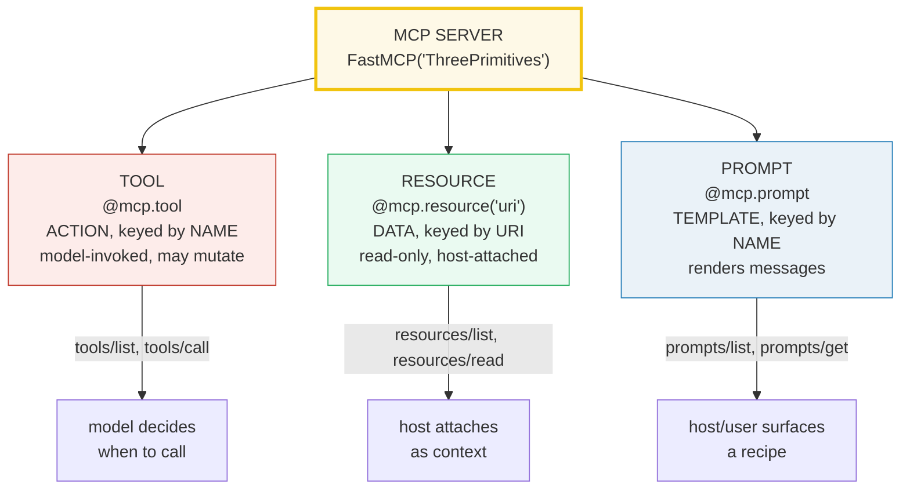
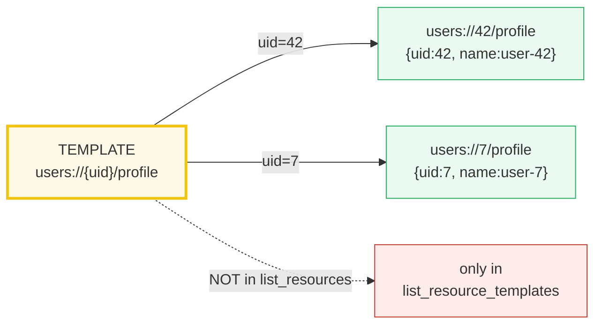
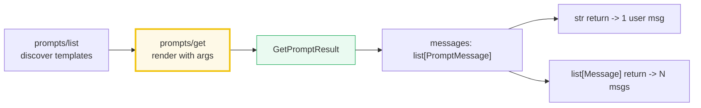

# MCP Resources & Prompts — The Other Two Primitives (URI Data + Prompt Templates)

> **The one rule:** MCP is not "just tools." It has **three** primitives, and
> mixing them up is the most common MCP design mistake. **Tools** are *actions*
> the model invokes (side effects, data fetch). **Resources** are *read-only
> data* the host attaches to the conversation, addressed by a **URI**. **Prompts**
> are *parametrized instruction templates* the server authors and the host
> surfaces to the user. Resources = data you **read**; prompts = recipes you
> **render**; tools = capabilities you **call**. Knowing which one fits is the
> expert move.

**Companion code:** [`mcp_resources_prompts.py`](./mcp_resources_prompts.py).
**Every URI, message, and table below is printed by `uv run python
mcp_resources_prompts.py`** — change the code, re-run, re-paste. Nothing here is
hand-computed. Captured stdout lives in
[`mcp_resources_prompts_output.txt`](./mcp_resources_prompts_output.txt).

**Goal of this bundle (lineage, old → new):**

> from *"MCP only has tools — the model calls functions"*
> → *"MCP has THREE primitives: tools (actions), resources (URI-addressed
> read-only DATA), and prompts (parametrized prompt TEMPLATES) — and a prompt
> beats a tool when you want to inject STRUCTURE, not a capability."*

🔗 This is bundle **#52 of Phase 8**. It builds on the server/client skeleton
from [`MCP_ARCHITECTURE`](./MCP_ARCHITECTURE.md) (#50) and the `@mcp.tool` deep
dive from [`MCP_TOOLS`](./MCP_TOOLS.md) (#51). The host-attaches-context story
continues in [`MCP_CONTEXT_SAMPLING`](./MCP_CONTEXT_SAMPLING.md) (#53). The
"prompt = parametrized message template" idea rhymes with LangChain's
[`LC_PROMPTS`](./LC_PROMPTS.md) (#37) — but MCP prompts live server-side and are
surfaced by the host. See [`TODO.md`](./TODO.md) for the full plan.

> **Verified against:** FastMCP **3.4.2** (installed in this env; the
> `@mcp.resource` / `@mcp.prompt` decorators and the in-memory `Client` API are
> stable across the FastMCP 2.x→3.x line). All client calls below go through
> FastMCP's in-memory `Client` — no socket, no network, byte-reproducible.

---

## 0. The three primitives on one page



| Primitive | What it is | Keyed by | Read via | Side effects? |
|---|---|---|---|---|
| **tool** | an ACTION / capability | **name** | `tools/call` | **yes** (may) |
| **resource** | read-only **DATA** | **URI** | `resources/read` | no |
| **prompt** | instruction **TEMPLATE** | **name** | `prompts/get` | no (renders messages) |

The single most important distinction: **resources are addressed by URI and
attached by the host, not called by the model.** The MCP spec calls resources
*"application-driven"* — the host application decides how to incorporate them as
context (a file picker, auto-include, etc.). Tools are *"model-driven"* — the LLM
decides to call them. Confusing the two is the #1 MCP design bug.

---

## 1. Resources — URI-addressed, read-only DATA

A resource is registered with `@mcp.resource("uri")`. The **URI is its primary
key** — that string is how everything else refers to it. FastMCP infers the
resource's `name` from the function name and its `description` from the docstring;
the default `mimeType` for a `str` return is `text/plain`. The host discovers
resources with `resources/list` and reads one with `resources/read`.

> From `mcp_resources_prompts.py` Section A:
> ```
> ======================================================================
> SECTION A — @mcp.resource: list_resources + read_resource
> ======================================================================
> A resource is DATA the server exposes, addressed by a URI. The host
> discovers it via list_resources and reads it via read_resource. It is
> read-only CONTEXT the host attaches to the conversation.
> 
> uri                 name          mimeType
> --------------------------------------------
> config://app        get_config    text/plain
> logs://tail         tail_log      text/plain
> metrics://q1        q1_metrics    application/json
> 
> read_resource('config://app') -> '{"theme": "dark", "version": "1.0"}'
> 
> [check] config://app appears in list_resources: OK
> [check] read_resource returns the JSON config blob: OK
> ```

### Why the URI is the key (internals)

In the MCP protocol, `resources/read` takes **only a `uri`** — no name, no
arguments. So a resource *is* its URI from the client's point of view. FastMCP
keeps an internal `uri -> FunctionResource` map; `read_resource("config://app")`
looks up that exact string, runs the function lazily, and wraps the return in a
`TextResourceContents` (with `uri`, `mimeType`, `text`). The function runs **only
when someone reads the resource** — it is not evaluated at registration. This is
why a config file, a log tail, a DB schema, or a notes blob is *naturally* a
resource: it is context the host pulls in on demand, not something the model
"invents" a call for.

---

## 2. Resource vs tool — DATA by URI vs ACTION by name

Resources and tools live in **separate namespaces**: `list_resources()` returns
URIs, `list_tools()` returns names, and the two never overlap. A resource is
**read-only data**; a tool is an **action that may have side effects**. The
litmus test: *"does this change the world, or just describe it?"* "Send an email"
changes the world → tool. "The app config" describes the world → resource.

> From `mcp_resources_prompts.py` Section B:
> ```
> ======================================================================
> SECTION B — URI addressing: resource=DATA by URI vs tool=ACTION by name
> ======================================================================
> Resources are DATA keyed by URI (read-only, host-attached). Tools are
> ACTIONS keyed by NAME (model-invoked, may have side effects). The two
> live in SEPARATE namespaces: list_resources != list_tools.
> 
> list_tools()      -> ['send_email']
> list_resources()  -> ['config://app', 'logs://tail', 'metrics://q1']
> 
> call_tool('send_email', ...) -> 'sent to bob'
> side-effect log `sent`       -> ['bob: hi']
> 
> [check] send_email is a TOOL (in list_tools): OK
> [check] send_email is NOT a resource (not in list_resources): OK
> [check] config://app is a RESOURCE (in list_resources): OK
> [check] calling the tool produced a side effect (sent grew): OK
> ```

### Why they are split (internals)

The protocol separates them because the **trust model differs**. A tool call is
the model taking an action in the real world (send money, delete a row, post a
message) — hosts gate it behind confirmation UI and treat the result as the
outcome of an action. A resource read is the host (or, with care, the model)
pulling in *passive context* — there is nothing to confirm, because reading a
config cannot change anything. FastMCP reflects this split in its decorator
*arguments*: `@mcp.resource` requires a `uri`, `@mcp.tool` does not (it uses the
function name). Conflating them — e.g. modeling "get user profile" as a *tool*
that the model must remember to call — throws away the host's ability to
auto-attach it as context and forces the model to spend a turn asking for it.

🔗 The full tool story (validation, `Context`, structured output, error mapping)
is in [`MCP_TOOLS`](./MCP_TOOLS.md) (#51).

---

## 3. Resource templates — a URI with `{variables}`

When a resource's URI contains `{var}` placeholders, FastMCP registers it as a
**resource template** — a *factory* that produces a concrete resource per set of
arguments. Templates do **not** appear in `list_resources` (there is no single
concrete instance to list); they appear in `list_resource_templates`, and the
client reads an instance by filling in the URI variable.



> From `mcp_resources_prompts.py` Section C:
> ```
> ======================================================================
> SECTION C — Resource templates: a URI with {variables}
> ======================================================================
> A resource TEMPLATE has {var} placeholders in the URI. It does NOT
> appear in list_resources — it appears in list_resource_templates, and
> the client reads a CONCRETE instance by filling in the variable.
> 
> uriTemplate='users://{uid}/profile'  name='user_profile'
> 
> template uri 'users://{uid}/profile' in list_resources? False
> 
> read_resource('users://42/profile') -> {"uid": "42", "name": "user-42", "active": true}
> read_resource('users://7/profile') -> {"uid": "7", "name": "user-7", "active": true}
> 
> [check] the template appears in list_resource_templates: OK
> [check] the template does NOT appear in list_resources (it is a factory): OK
> [check] uid=42 instance carries uid 42: OK
> [check] uid=7 instance carries uid 7 (the URI variable parameterized it): OK
> ```

### Why templates are a separate registry (internals)

FastMCP implements URI templates per **RFC 6570**. At registration it detects the
`{...}` in the URI and routes the function to the *template* registry instead of
the *concrete resource* registry. At read time it pattern-matches the incoming
concrete URI (`users://42/profile`) against each template, extracts `{"uid":
"42"}`, validates it against the function signature, calls the function, and
returns the content — transparently, as if a concrete resource had existed all
along. The expert gotcha: **every required function parameter must appear in the
URI template** (otherwise FastMCP cannot fill it from the URI); optional params
may be hidden or exposed as `{?query}` params. This mirrors how REST routes work
— a template is a typed, URI-keyed family of resources.

---

## 4. Prompts — parametrized instruction templates

A prompt is registered with `@mcp.prompt` (no URI — like a tool, it is keyed by
**name**). The function's parameters become the prompt's **arguments**, surfaced
via `prompts/list`; parameters with defaults are optional. The host renders one
with `prompts/get` (`get_prompt`), passing a dict of arguments.

> From `mcp_resources_prompts.py` Section D:
> ```
> ======================================================================
> SECTION D — @mcp.prompt: list_prompts + get_prompt
> ======================================================================
> A prompt is a reusable, server-authored instruction TEMPLATE the host
> surfaces. list_prompts publishes them; get_prompt renders one with
> arguments. Parameters with defaults are optional.
> 
> published prompts (sorted): ['code_review', 'summarize']
> 
> code_review
>   description: Review source code for bugs and style.
>   arguments:   language (required), code (required)
> summarize
>   description: Summarize text in a given tone (multi-message template).
>   arguments:   text (required), tone (optional)
> 
> get_prompt('code_review', ...) -> 1 message(s)
> 
> [check] code_review appears in list_prompts: OK
> [check] summarize appears in list_prompts: OK
> [check] code_review args: language & code both required: OK
> ```

### Why prompts exist separately from tools (internals)

A prompt is **not** a capability — it produces no side effect and fetches no
data. It is a **recipe the server authors once and the host reuses**: "given a
language and some code, here is the ideal review instruction." FastMCP derives
the prompt's `name` from the function name, its `description` from the docstring
summary, and the per-argument `required` flag from whether the parameter has a
default. The arguments are validated against the signature before the function
runs, so `get_prompt("code_review", {})` (missing args) is a client-side error,
not a silent mis-render. This is why a prompt is the right home for "review",
"summarize", "explain like I'm five" — reusable instructions where the *shape*
of the request is the value, not the action.

---

## 5. Rendered prompts — a prompt returns a list of messages

`get_prompt` returns a `GetPromptResult` whose `.messages` is a list of
`PromptMessage`s (each with a `role` and `content`). A prompt function may return
a bare `str` — FastMCP auto-wraps it as **one** `user` message — or a
`list[Message]` for a **multi-message** conversation. `Message(content, role)`
defaults to `role="user"`; `role="assistant"` is available for seeded
back-and-forth.



> From `mcp_resources_prompts.py` Section E:
> ```
> ======================================================================
> SECTION E — Rendered prompt: a prompt returns a list of messages
> ======================================================================
> A prompt function may return a str (auto-wrapped as ONE user message)
> or a list[Message] (a multi-message conversation). get_prompt returns
> a GetPromptResult whose .messages carry role + content.
> 
> code_review (returned a str):
>   role='user'  text='Review this python for bugs and style:\nx = 1'
> 
> summarize (returned a list[Message]):
>   role='user'  text='Summarize the following in a wry tone.'
>   role='user'  text='MCP has three primitives.'
> 
> [check] str-returning prompt -> exactly one message: OK
> [check] that message has role 'user': OK
> [check] that message text embeds both args: OK
> [check] list-returning prompt -> two messages: OK
> [check] summarize second message carries the source text: OK
> ```

### Why the return is a message *list* (internals)

MCP models a prompt as a **partial conversation**, not a flat string. That is
why `get_prompt` returns `messages: [...]` even for a one-liner: the host can
prepend/append its own messages (a system prompt, the attached resources) and
hand the whole transcript to the model. FastMCP's `Message(content, role)` only
allows `"user"` and `"assistant"` — there is **no `"system"` role** in MCP
prompts (system instructions belong to the host/client, not the server's
prompt). A `dict`/`list`/`BaseModel` passed to `Message(...)` is auto-JSON-
serialized to text; for full control (per-message metadata, a description on the
result) FastMCP 3.x adds `PromptResult`.

🔗 This message-list shape is the same abstraction LangChain uses
(`HumanMessage`/`AIMessage`) — see [`LC_PROMPTS`](./LC_PROMPTS.md) (#37) and
[`LC_MODELS_MESSAGES`](./LC_MODELS_MESSAGES.md) (#36).

---

## 6. When a prompt beats a tool (the expert move)

The expert question is never *"tool or prompt?"* in the abstract — it is
*"structure or capability?"* A **prompt** injects a reusable **recipe** the
server authors and the host surfaces; it has **no side effect**. A **tool**
exposes a **capability** the model drives, typically for side effects or live
data fetch. Use a prompt when the value is the *shape of the instruction* (code
review, summarize, refactor). Use a tool when the value is *doing something*
(send email, query the DB, mutate state). The bundle proves the asymmetry
directly: getting a prompt leaves the side-effect log untouched; calling a tool
mutates it.

> From `mcp_resources_prompts.py` Section F:
> ```
> ======================================================================
> SECTION F — When a prompt beats a tool (the expert move)
> ======================================================================
> TOOL   = a CAPABILITY the model drives for side-effects/data-fetch
>          (send_email, query_db). The model decides when to call it.
> PROMPT = a RECIPE the server authors and the host surfaces to the
>          user/model ("code review", "summarize"). It injects
>          STRUCTURE/instructions, not a capability.
> 
> get_prompt('code_review') -> 'Review this python for bugs and style:\nx = 1'
>   side-effect log `sent` unchanged? True
> 
> call_tool('send_email')   -> 'sent to carol'
>   side-effect log `sent` grew?     True
> 
> [check] getting a prompt has NO side effect: OK
> [check] calling a tool HAS a side effect (sent now has carol): OK
> [check] the prompt injected an instruction (not a capability): OK
> ```

### Why "prompt vs tool" is the wrong frame (internals)

The two are **not interchangeable** — they have different trigger models. A tool
is invoked by the **model** mid-generation (the LLM emits a tool call); a prompt
is triggered by the **user/host** (a slash-command, a button, an auto-surface).
So "should code review be a tool or a prompt?" has a clean answer: it is a
**prompt** if you want the host to offer a "Review" affordance that injects a
server-authored instruction; it is a **tool** only if the model should be able
to *request* a review of arbitrary code at runtime (rare). Modeling it as a tool
when it is really a recipe pollutes the tool namespace and hides the recipe from
the host's UI. Modeling a side-effecting action as a prompt is worse — prompts
cannot mutate anything by construction.

---

## 7. The three-primitives contrast table

The payoff table — printed by the `.py`, not hand-typed — fixes the three
primitives in one view. Read it as a **decision matrix**: pick the row whose
"keyed by" and "triggered by" match your intent.

> From `mcp_resources_prompts.py` Section G:
> ```
> ======================================================================
> SECTION G — The three primitives: tools vs resources vs prompts
> ======================================================================
> primitive  what it is            keyed by    triggered by        side fx    MCP methods                 decorator
> ---------  --------------------  ----------  ------------------  ---------  --------------------------  --------------------
> tools      ACTION / capability   name        model (LLM)         yes (may)  tools/list, tools/call      @mcp.tool
> resources  read-only DATA        URI         host/app attaches   no         resources/list, resources/read  @mcp.resource("uri")
> prompts    instruction TEMPLATE  name        user/host surfaces  no         prompts/list, prompts/get   @mcp.prompt
> ```

**How to use it:** *model-invoked + side effects* → tool. *host-attached +
URI-keyed + read-only* → resource. *user-surfaced + named + renders messages* →
prompt. Note resources are the **only** primitive keyed by URI — that is the
single feature that lets the host auto-include them as context without the model
asking.

---

## 8. MIME types & structured resource contents

A resource may declare a `mime_type` and return **structured data**. A `str`
return defaults to `text/plain`; a `dict`/`list` is JSON-encoded and can be
tagged `application/json` so the host knows how to render it. `bytes` returns
become base64 `BlobResourceContents` (ideal for images/binary). The `mimeType`
travels alongside the `text` in every `TextResourceContents`, so a host can pick
a viewer without sniffing the content.

> From `mcp_resources_prompts.py` Section H:
> ```
> ======================================================================
> SECTION H — MIME types & structured resource contents
> ======================================================================
> A resource may declare a mime_type and return structured data. A str
> defaults to text/plain; a dict/list is JSON-encoded and can be tagged
> application/json so the host knows how to render it.
> 
> uri               mimeType              text
> ------------------------------------------------------------------
> config://app      text/plain            {"theme": "dark", "version": "1.0"}
> metrics://q1      application/json      {"quarter": "Q1", "revenue": 1000, "users": 42}
> 
> [check] str resource defaults to text/plain: OK
> [check] metrics resource is tagged application/json: OK
> [check] metrics text parses back to the structured dict: OK
> ```

### Why MIME types matter (internals)

The MCP spec carries an optional `mimeType` on **every** resource and content
block. FastMCP infers a sensible default (`text/plain` for `str`,
`application/octet-stream` for `bytes`) but lets you override it on the
decorator. The host uses it to choose a renderer — pretty-print JSON, render
`text/markdown`, inline an `image/png`. FastMCP 3.x also offers `ResourceResult`
for multi-content resources (several blocks, each with its own MIME) — handy when
one URI should return both a human-readable summary and a machine-readable blob.

---

## Pitfalls

| Trap | Example | The fix |
|---|---|---|
| Modeling read-only data as a **tool** | a `get_config` *tool* the model must remember to call | make it a **resource** (`@mcp.resource("config://app")`); the host can auto-attach it as context |
| Modeling a side-effecting action as a **resource** | `@mcp.resource("email://send")` | resources are read-only by design; use a **tool** for mutations |
| Modeling a reusable recipe as a **tool** | "code review" as a tool the model invokes | make it a **prompt** so the host can surface it and inject the authored instruction |
| Expecting a template in `list_resources` | `users://{uid}/profile` is "missing" | templates live in `list_resource_templates`; read a **concrete** URI (`users://42/profile`) |
| Required param not in the URI template | `@mcp.resource("u://{uid}") def f(uid, x): ...` | every required param **must** appear in the URI; make `x` optional or add it to the template |
| Treating prompts as system-prompt injectors | `Message("You are...", role="system")` | MCP `Message` only allows `"user"`/`"assistant"`; system text belongs to the host/client |
| Assuming `get_prompt` returns a string | `result.upper()` → `AttributeError` | it returns a `GetPromptResult` with `.messages`; iterate `m.content.text` |
| Forgetting `mime_type` for JSON resources | host renders raw JSON as text | set `mime_type="application/json"` (or `text/markdown`, etc.) on the decorator |
| Returning a mutable global from a resource | the function reads/writes module state | resources should be **pure reads**; mutate only inside tools |
| Confusing *model-driven* (tools) with *host-driven* (resources/prompts) | expecting the LLM to "call" a resource | tools are model-invoked; resources/prompts are host/user-triggered — different trust & UI gates |

---

## Cheat sheet

- **Three primitives:** **tools** (actions, model-invoked, may have side effects),
  **resources** (read-only data, URI-keyed, host-attached), **prompts**
  (parametrized instruction templates, name-keyed, render messages).
- **Resource:** `@mcp.resource("config://app") def f() -> str`. URI is the key.
  `list_resources()` → `[{uri, name, mimeType, description}]`;
  `read_resource(uri)` → `[TextResourceContents(.uri, .mimeType, .text)]`.
  Default `mimeType` for `str` is `text/plain`.
- **Resource template:** URI with `{var}`. NOT in `list_resources`; only in
  `list_resource_templates`. Read a concrete instance: `read_resource(
  "users://42/profile")`. Every required param must be in the URI (RFC 6570).
- **Prompt:** `@mcp.prompt def code_review(language, code) -> str`. Name-keyed.
  `list_prompts()` → `[{name, description, arguments}]` (`required` per arg);
  `get_prompt(name, {args})` → `GetPromptResult(.messages)`.
- **Prompt return shapes:** `str` → one `user` message; `list[Message]` → a
  multi-message conversation. `Message(content, role="user"|"assistant")` — no
  `"system"` role in MCP. `dict`/`list`/`BaseModel` content is auto-JSON-encoded.
- **Tool vs resource vs prompt — pick by trigger + effect:** model-invoked +
  side effect → **tool**; host-attached + read-only + URI → **resource**;
  user-surfaced + named + renders instructions → **prompt**.
- **`mime_type`:** declare it on the decorator (`application/json`,
  `text/markdown`, `image/png`) so the host picks the right renderer; `bytes`
  returns become base64 `BlobResourceContents`.
- **Decision rule:** *"does this change the world?"* → tool; *"is this data the
  host should attach?"* → resource; *"is this a reusable instruction shape?"* →
  prompt.

---

## Sources

- **FastMCP docs — Resources & Templates.**
  https://gofastmcp.com/servers/resources
  *The `@mcp.resource` decorator, the URI-as-key model, resource templates with
  `{var}` placeholders (RFC 6570), `mime_type` inference (`text/plain` for
  `str`, `application/octet-stream` for `bytes`), and the rule that every
  required function parameter must appear in the URI template. Basis for
  §1, §3, §8.*
- **FastMCP docs — Prompts.**
  https://gofastmcp.com/servers/prompts
  *The `@mcp.prompt` decorator, argument `required` inference from defaults, the
  three return shapes (`str` → one user message, `list[Message|str]` →
  conversation, `PromptResult`), and `Message(content, role="user"|"assistant")`.
  Basis for §4, §5, §6.*
- **MCP spec — Resources (concepts).**
  https://modelcontextprotocol.io/docs/concepts/resources
  *The defining statement that resources are *"application-driven"* (the host
  determines how to incorporate them as context), uniquely identified by URI,
  read via `resources/read` / discovered via `resources/list`, and parameterized
  via `resources/templates/list`. The `mimeType` field on every resource and
  content block. Basis for §0, §1, §2, §3.*
- **MCP spec — Prompts (concepts).**
  https://modelcontextprotocol.io/docs/concepts/prompts
  *Prompts as reusable, parametrized message templates; `prompts/list` and
  `prompts/get` returning a `GetPromptResult` whose `.messages` carry role +
  content. Confirms the prompt-as-partial-conversation model in §5.*
- **RFC 6570 — URI Template.**
  https://datatracker.ietf.org/doc/html/rfc6570
  *The `{var}` expansion syntax FastMCP uses for resource templates (§3),
  including simple `{param}` and form-style `{?param}` query expansion.*
- **FastMCP Client API (installed package v3.4.2).**
  *Signatures verified by `inspect.signature` against the installed package:
  `Client.list_resources() -> list[Resource]`,
  `Client.read_resource(uri) -> list[TextResourceContents|BlobResourceContents]`,
  `Client.list_resource_templates() -> list[ResourceTemplate]`,
  `Client.list_prompts() -> list[Prompt]`,
  `Client.get_prompt(name, arguments=None) -> GetPromptResult`,
  plus `list_tools` / `call_tool` used for the §2/§6 contrast. Every call in the
  `.py` goes through the in-memory `Client`.*
