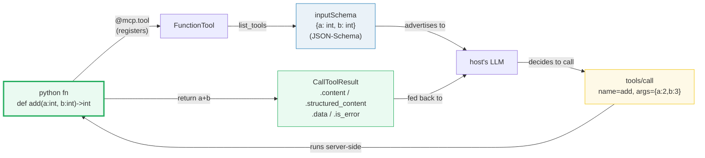

# MCP Tools — `@mcp.tool`, the JSON-Schema Contract, and `tools/call`

> **The one rule:** an MCP tool is *a function the host's model can invoke*.
> `@mcp.tool` wraps a Python function into a tool whose name, description, and
> input schema are **auto-derived** (name from the fn, description from the
> docstring, `inputSchema` from the type hints — a JSON-Schema). The model
> discovers tools with `tools/list`, calls them with `tools/call`, and receives
> the result as **content** (text/structured) or as a **tool-error result**
> (never as an HTTP 500). Tools are the universal callable contract across MCP.

**Companion code:** [`mcp_tools.py`](./mcp_tools.py).
**Every value and schema below is printed by `uv run python mcp_tools.py`** —
change the code, re-run, re-paste. Nothing here is hand-computed. Captured
stdout lives in [`mcp_tools_output.txt`](./mcp_tools_output.txt).

**Goal of this bundle (lineage, old → new):**

> from *"I know LangChain `@tool` turns a fn into a model-callable"*
> → *"I understand MCP `@mcp.tool` does the same job — but as a WIRE-PROTOCOL
> > contract: the schema is JSON-Schema carried over JSON-RPC, the call runs
> > server-side, and results come back as `CallToolResult` (content / structured
> > / data / is_error)."*

🔗 This is bundle **#51 of Phase 8** (FastMCP). Sibling bundles:
- [`MCP_ARCHITECTURE`](./MCP_ARCHITECTURE.md) (P8 #50) — the server/client
  transports (stdio / HTTP / in-memory) this bundle calls "the wire".
- [`MCP_RESOURCES_PROMPTS`](./MCP_RESOURCES_PROMPTS.md) (P8 #52) — the *other*
  two MCP primitives (resources = data the model reads, prompts = templates).
  Tools are **actions**; resources/prompts are **context**.
- [`MCP_CONTEXT_SAMPLING`](./MCP_CONTEXT_SAMPLING.md) (P8 #53) — the `Context`
  object's deeper powers (`ctx.sample`, `ctx.read_resource`, elicitation).
  This bundle only previews `report_progress` / `info`.
- [`LC_TOOLS_AGENTS`](./LC_TOOLS_AGENTS.md) (P6 #41) — the in-process
  counterpart: `@tool` + `bind_tools` + the agent loop.

---

## 0. The round trip on one page



The contract is three handshakes: **register** (`@mcp.tool` builds a
`FunctionTool`), **advertise** (`tools/list` ships the `inputSchema` to the
host's model), **invoke** (`tools/call` runs the fn server-side and ships back
a `CallToolResult`). Everything else in this guide is detail on those three
steps + how errors fit in.

| Concept | LangChain `@tool` | MCP `@mcp.tool` |
|---|---|---|
| Wraps fn into | `BaseTool` (a `Runnable`) | `FunctionTool` (a server-side tool) |
| Schema format | Pydantic `args_schema` | **JSON-Schema** `inputSchema` |
| Invoked via | `tool.invoke({args})` — Python call | `await c.call_tool(name, {args})` — JSON-RPC |
| Where the fn runs | same process as the agent | server process (often remote) |
| Result shape | the python return value | `CallToolResult` (`.content` / `.data` / `.is_error`) |
| Errors | `raise ToolException` (caught by agent) | `raise` → result with `is_error=True` (NOT HTTP 500) |

---

## 1. `@mcp.tool` — function → tool (auto name + description)

The canonical form is `@mcp.tool` **without parentheses** (the decorator is
overloaded: a bare fn, a string name, `name=...`, or empty parens all work —
the bare form is what the FastMCP docs lead with). On registration FastMCP
walks the function and derives three fields the host will see:

- **name** ← the function's `__name__`
- **description** ← the function's docstring (first non-empty line; for richer
  per-arg descriptions use Google/NumPy/Sphinx-style `Args:` blocks, FastMCP
  ≥ 3.2.4, or `Annotated[T, "..."]` / `Field(description=...)`)
- **inputSchema** ← see §2

The function itself stays callable in-process (`type(add).__name__ == 'function'`);
`@mcp.tool` *registers* it with the server, it does not wrap it.

> From `mcp_tools.py` Section A:
> ```
> ======================================================================
> SECTION A — @mcp.tool: function -> tool with auto name + description
> ======================================================================
> @mcp.tool (no parens) registers a Python function as an MCP tool.
> FastMCP auto-derives: name <- function name, description <- the
> docstring, args <- the type hints. The host's model sees the tool
> via tools/list and may invoke it via tools/call.
> 
> expression                          value
> ------------------------------------------------------------
> sorted tool names                   ['add', 'create_customer', 'fail', 'plain_text', 'with_progress']
> add.name                            'add'
> add.description                     'Add two numbers.'
> type(add).__name__                  function
> 
> [check] 'add' is registered as a tool: OK
> [check] add.name == 'add' (from the function name): OK
> [check] add.description == 'Add two numbers.' (from the docstring): OK
> ```

### Why the function stays a function (internals)

`FastMCP.tool` is a **registrar**, not a transformer. Internally it builds a
`FunctionTool` dataclass (name, description, parameters, the fn callable) and
adds it to the server's local provider — but it *also* leaves the original
function untouched in your module's namespace, so you can still call
`add(2, 3)` directly in tests. The tool and the function share the same
callable; the tool is the *metadata + transport wrapper* around it. This is
the opposite of LangChain's `@tool`, which **replaces** the function with a
`StructuredTool` instance (see §8).

🔗 [`DECORATORS_DEEP`](./DECORATORS_DEEP.md) covers the general pattern of
"registrar vs transformer" decorators; here we lean on it without re-deriving.

---

## 2. The `inputSchema` contract — JSON-Schema from type hints

MCP's wire format is **JSON-Schema** (not Pydantic). FastMCP builds the
`inputSchema` by:

1. Reading the function's `__annotations__` (PEP 484 type hints).
2. Running each parameter through Pydantic's `TypeAdapter` to produce a
   JSON-Schema fragment.
3. Wrapping the result as `{type: object, properties: {...}, required: [...],
   additionalProperties: False}`.

For `add(a: int, b: int) -> int` this is exactly:

```json
{"type": "object",
 "properties": {"a": {"type": "integer"}, "b": {"type": "integer"}},
 "required": ["a", "b"],
 "additionalProperties": false}
```

The host's model reads this schema when deciding how to call the tool. JSON
types map cleanly: Python `int` → `integer`, `str` → `string`, `float` →
`number`, `bool` → `boolean`, `list[T]` → `{"type": "array", "items": {...}}`,
`dict[str, V]` → `{"type": "object", "additionalProperties": {...}}`,
`T | None` → nullable, `Literal["a", "b"]` → enum.

> From `mcp_tools.py` Section B:
> ```
> ======================================================================
> SECTION B — The auto inputSchema: JSON-Schema from type hints
> ======================================================================
> list_tools() returns each tool's inputSchema — a JSON-Schema dict
> derived from the function's parameter annotations. The host model
> reads this schema to decide HOW to call the tool.
> 
> add.inputSchema = {'additionalProperties': False, 'properties': {'a': {'type': 'integer'}, 'b': {'type': 'integer'}}, 'required': ['a', 'b'], 'type': 'object'}
> 
> Schema shape (the MCP/JSON-Schema contract):
>   type                 = 'object'
>   properties.keys()    = ['a', 'b']
>   properties['a']      = {'type': 'integer'}
>   properties['b']      = {'type': 'integer'}
>   required             = ['a', 'b']
>   additionalProperties = False
> 
> [check] schema type is 'object': OK
> [check] properties are a, b (from the param names): OK
> [check] a is JSON-Schema integer: OK
> [check] b is JSON-Schema integer: OK
> [check] both a and b are required: OK
> ```

### Why `additionalProperties: False` (internals)

JSON-Schema allows unknown properties by default; FastMCP sets
`additionalProperties: False` so the host's model cannot sneak extra keys past
the validator. Combined with `required: [a, b]`, the schema is **closed** —
the model must supply exactly `{a: int, b: int}` and nothing else. This is
stricter than REST APIs typically are, and it's deliberate: tools are invoked
by an LLM, and a loose schema invites hallucinated arguments.

---

## 3. A Pydantic-arg tool — nested JSON-Schema

The schema derivation recurses through Pydantic models. Each `BaseModel`
parameter becomes a nested `object` with its own `properties`, and `Field(...)`
metadata travels through: `description=` lands on the property,
`ge=`/`le=`/`gt=`/`lt=` become `minimum`/`maximum`, `min_length`/`max_length`
become `minLength`/`maxLength`, `pattern=` becomes `pattern`. The host model
reads the nested schema and produces a matching JSON object as the argument.

> From `mcp_tools.py` Section C:
> ```
> ======================================================================
> SECTION C — A Pydantic-arg tool: nested JSON-Schema from the model
> ======================================================================
> A Pydantic model as a parameter yields a NESTED JSON-Schema: each
> field becomes a property, with descriptions (Field(description=...))
> and constraints (Field(ge=..., le=...)) carried through. The model
> reads the nested schema and produces a matching JSON object.
> 
> create_customer.inputSchema = {'additionalProperties': False, 'properties': {'customer': {'properties': {'name': {'type': 'string'}, 'age': {'maximum': 150, 'minimum': 0, 'type': 'integer'}, 'address': {'properties': {'street': {'description': 'street name', 'type': 'string'}, 'zip': {'description': 'postal code', 'type': 'string'}}, 'required': ['street', 'zip'], 'type': 'object'}}, 'required': ['name', 'age', 'address'], 'type': 'object'}}, 'required': ['customer'], 'type': 'object'}
> 
> Schema highlights:
>   customer.required              = ['name', 'age', 'address']
>   customer.age (with constraints) = {'maximum': 150, 'minimum': 0, 'type': 'integer'}
>   customer.address.street          = {'description': 'street name', 'type': 'string'}
> 
> [check] top-level arg is 'customer': OK
> [check] customer has nested fields name, age, address: OK
> [check] age carries ge=0 and le=150 constraints from Field(...): OK
> [check] nested street description came through: OK
> ```

### Why `$ref` is dereferenced (internals)

The MCP spec allows `$defs`/`$ref` in JSON-Schema, but several production
clients (Claude Desktop, VS Code Copilot) don't fully resolve references.
FastMCP **inlines** `$ref`s at serve-time (via middleware) so the schema a
client receives is always self-contained. The in-memory `Client` used here
already sees the dereferenced form. You can opt out with
`FastMCP(..., dereference_schemas=False)` if your clients handle `$ref`
correctly and you want smaller payloads.

🔗 [`FASTAPI_BODIES_PYDANTIC`](./FASTAPI_BODIES_PYDANTIC.md) covers the same
Pydantic → JSON-Schema derivation for HTTP request bodies; MCP reuses the
exact same machinery server-side.

---

## 4. `call_tool` — the `CallToolResult` shape

`await c.call_tool("add", {"a": 2, "b": 3})` runs the function **server-side**
and returns a `CallToolResult`. The same answer is exposed in four parallel
views, because MCP serves different consumers:

| Field | Type | Who reads it |
|---|---|---|
| `.content` | `list[TextContent \| ImageContent \| ...]` | the LLM in its chat context (always present, for backward compat) |
| `.structured_content` | `dict \| None` | programmatic consumers (validated against the output schema if any) |
| `.data` | the typed python value (`int`, `str`, `Root(...)` for models) | the FastMCP client (deserialized from structured) |
| `.is_error` | `bool` | the host (decides whether to surface as failure) |

> From `mcp_tools.py` Section D:
> ```
> ======================================================================
> SECTION D — call_tool: the CallToolResult shape
> ======================================================================
> await c.call_tool(name, {args}) runs the function server-side and
> returns a CallToolResult. It carries FOUR views of the same answer:
>   .content             list of MCP content blocks (TextContent, ...)
>   .structured_content  the JSON dict (wraps primitives under 'result')
>   .data                the typed python value (5, str, model, ...)
>   .is_error            False here; True for tool failures (Section F)
> 
> result                 = CallToolResult(content=[TextContent(type='text', text='5', annotations=None, meta=None)], structured_content={'result': 5}, meta={'fastmcp': {'wrap_result': True}}, data=5, is_error=False)
> result.content[0]      = type='text' text='5' annotations=None meta=None
> result.content[0].text = '5'
> result.structured_content = {'result': 5}
> result.data            = 5  (type=int)
> result.is_error        = False
> 
> [check] result.data == 5 (typed python int): OK
> [check] structured_content wraps the int under 'result': OK
> [check] content[0].text is '5' (the human-readable view): OK
> [check] is_error is False for a successful call: OK
> ```

### Why primitives are wrapped under `"result"` (internals)

JSON-Schema **requires** a structured output schema to be an `object` type
(it can't be a bare `integer`). So when a tool's return type hint is a
primitive (`-> int`, `-> str`, `-> bool`), FastMCP generates an output schema
`{type: object, properties: {result: {type: integer}}, "x-fastmcp-wrap-result": true}`
and serializes the value as `{"result": 5}`. The marker
`x-fastmcp-wrap-result: true` is a non-standard extension that tells
FastMCP-aware clients "unwrap the `result` key to recover the primitive."
Object-like returns (`dict`, `dataclass`, Pydantic model) already satisfy the
object requirement, so they're **not** wrapped — see §5.

---

## 5. Return content vs structured — three return shapes

The function's **return type hint** decides what the host sees:

| Return hint | `data` | `structured_content` | `content[0].text` |
|---|---|---|---|
| `int` / `bool` | the primitive | `{"result": <primitive>}` (wrapped) | `str(value)` |
| `str` | the string | `{"result": "<string>"}` (wrapped) | the string itself |
| `dict` / Pydantic model / dataclass | `Root(...)` wrapper | the object's fields (NOT wrapped) | JSON serialization |

The rule (from the FastMCP docs): **object-like results → become structured
content directly; primitives → only become structured content if there's a
return annotation, and they're wrapped under `"result"`**. The text content is
ALWAYS produced for backward compatibility with older MCP clients.

> From `mcp_tools.py` Section E:
> ```
> ======================================================================
> SECTION E — Return content vs structured: primitive, str, Pydantic
> ======================================================================
> Three return shapes, one rule: the function's return type hint
> controls what the host sees. Primitives WITH a hint -> wrapped
> {'result': N} structured content + '5' text; str -> {'result': ...};
> a Pydantic model -> its fields as structured content + JSON text.
> 
> tool              return hint data                      structured_content
> --------------------------------------------------------------------------------
> add(2,3)          int         5                         {'result': 5}
> plain_text(7)     str         value is 7                {'result': 'value is 7'}
> create_customer   Customer    Root(name='Ada', age=30, address=Root(street='X St', zip='00000')){'name': 'Ada', 'age': 30, 'address': {'street': 'X St', 'zip': '00000'}}
> 
> create_customer content[0].text = '{"name":"Ada","age":30,"address":{"street":"X St","zip":"00000"}}'
> 
> [check] int return: data==5, structured wrapped under 'result': OK
> [check] str return: data=='value is 7', structured wraps the string: OK
> [check] Pydantic return: structured_content has the model's fields: OK
> [check] Pydantic return: content[0].text is the JSON serialization: OK
> ```

### Why the model's `data` comes back as `Root(...)` (internals)

When a tool returns a Pydantic model, FastMCP needs a generic type to
deserialize the structured content back into on the client side. Since the
client doesn't necessarily import your `Customer` class, FastMCP synthesizes a
`Root` model — a Pydantic wrapper whose `__root__` validates against the
output schema. The fields are correct (`.name`, `.age`, `.address`) but the
type prints as `Root`, not `Customer`. If you want the real class back, pass
`output_schema=...` explicitly or deserialize `structured_content` yourself.

---

## 6. Tool errors are returned as results — NOT an HTTP 500

MCP separates two error paths (the spec calls them "protocol errors" vs "tool
execution errors"):

1. **Protocol errors** — JSON-RPC-level failures (unknown tool name, malformed
   request, schema mismatch). These come back as a JSON-RPC `error` object
   with a numeric code (`-32602` for unknown tool, etc.).
2. **Tool execution errors** — the function *ran* and raised. These come back
   as a **normal** `tools/call` result whose `isError` is `true`. The failure
   message is in `content[0].text`. **There is no HTTP 500 and no exception
   propagation across the wire** — the host model just sees a result that says
   "this didn't work" and can decide to retry or apologize.

FastMCP's `Client.call_tool` raises a `ToolError` on a tool-execution error by
default (so `try/except` works idiomatically). Pass `raise_on_error=False` to
inspect the raw result with `is_error=True` — useful for logging, retry logic,
or building a custom agent loop.

> From `mcp_tools.py` Section F:
> ```
> ======================================================================
> SECTION F — Tool errors are returned as results (NOT an HTTP 500)
> ======================================================================
> MCP separates two error paths: PROTOCOL errors (unknown tool, bad
> JSON-RPC) come back as JSON-RPC error objects; TOOL EXECUTION
> errors (the function raised) come back as a NORMAL result whose
> is_error is True. The host model sees the failure message and can
> retry. FastMCP's Client raises ToolError by default; pass
> raise_on_error=False to inspect the raw result shape.
> 
> result               = CallToolResult(content=[TextContent(type='text', text="Error calling tool 'fail': boom: invalid x", annotations=None, meta=None)], structured_content=None, meta=None, data=None, is_error=True)
> result.is_error      = True
> result.content[0]    = type='text' text="Error calling tool 'fail': boom: invalid x" annotations=None meta=None
> result.content[0].text = "Error calling tool 'fail': boom: invalid x"
> result.data          = None
> result.structured_content = None
> 
> [check] is_error is True for a raised exception: OK
> [check] the error message is carried in content[0].text: OK
> [check] data is None on error (no value to return): OK
> [check] structured_content is None on error: OK
> ```

### Why errors are results, not exceptions (internals)

The host's model calls tools autonomously; if every failure were an HTTP 500
or a thrown exception, the model would have no recoverable signal — the
session would just die. By making errors *ordinary results*, MCP lets the
model read "division by zero" in `content[0].text` and try again with
different arguments. This mirrors how LangChain's agent loop feeds
`ToolException` text back as a `ToolMessage` (🔗 [`LC_TOOLS_AGENTS`](./LC_TOOLS_AGENTS.md)
Section G) — same psychology, different transport.

For security, FastMCP's `mask_error_details=True` strips the traceback from
non-`ToolError` exceptions; only explicit `ToolError` messages are always sent
verbatim. Use `ToolError` when you want the client to see the failure reason;
let other exceptions propagate (they'll be masked to a generic message).

---

## 7. `Context` — progress reporting and logging inside a tool

A tool that wants server-side MCP capabilities takes a `Context`-typed
parameter. FastMCP detects the annotation, **excludes** it from the
`inputSchema` (so the model never sees it), and injects the live `Context` at
call time. The `Context` exposes:

- `ctx.report_progress(progress, total)` — pushes a progress notification to
  the host (the host subscribes via `call_tool(..., progress_handler=cb)`).
- `ctx.info / debug / warning / error(msg)` — server-side logging routed to
  the host's log stream.
- `ctx.read_resource(uri)` — read an MCP resource (🔗 `MCP_RESOURCES_PROMPTS`).
- `ctx.sample(prompt, ...)` — ask the host's LLM a question from inside the
  tool (🔗 `MCP_CONTEXT_SAMPLING`).
- `ctx.request_id`, `ctx.session_id`, `ctx.request_context` — transport-level
  introspection.

> From `mcp_tools.py` Section G:
> ```
> ======================================================================
> SECTION G — Context: progress reporting + logging inside a tool
> ======================================================================
> A tool that takes a Context-typed parameter gets server-side access
> to MCP capabilities: ctx.info/warning/error (logging),
> ctx.report_progress(progress, total), ctx.read_resource(uri), and
> ctx.sample(...) (LLM round-trip — covered in MCP_CONTEXT_SAMPLING).
> The host subscribes via call_tool(..., progress_handler=cb).
> 
> result.data            = 'done'
> progress_handler saw   = [(0.0, 3.0), (1.0, 3.0), (2.0, 3.0), (3.0, 3.0)]
> 
> Context has these capabilities (dir):
>   ctx.info
>   ctx.debug
>   ctx.warning
>   ctx.error
>   ctx.report_progress
>   ctx.read_resource
>   ctx.sample
>   ctx.request_id
>   ctx.session_id
> 
> [check] the tool returned 'done' after reporting progress: OK
> [check] the host saw 4 progress updates (0/3, 1/3, 2/3, 3/3): OK
> [check] Context exposes report_progress, info, sample: OK
> ```

### Why progress is server-pushed, not polled (internals)

Long-running tools (data loads, multi-step computations) would otherwise force
the host to either block silently or poll. MCP defines a
`notifications/progress` JSON-RPC notification that the server emits mid-call;
the host registers a handler and renders a progress bar. The same mechanism
underlies FastMCP's task mode (`@mcp.tool(task=True)`), which moves the entire
tool execution to a background worker and lets the client poll for both status
and result. Sync tools are dispatched to a threadpool by default so they don't
block the event loop while they `time.sleep` or hit a database.

🔗 [`ASYNCIO_BASICS`](./ASYNCIO_BASICS.md) covers the event-loop / threadpool
split that makes "sync tool, async server" work. [`CONTEXT_MANAGERS`](./CONTEXT_MANAGERS.md)
covers the unrelated stdlib `contextlib` — different concept, despite the name.

---

## 8. Contrast with LangChain `@tool` — wire protocol vs in-process

LangChain's `@tool` and MCP's `@mcp.tool` solve the **same problem** — turn a
typed Python function into a model-invokable callable with an auto-derived
schema. They differ in **where the function runs**:

```mermaid
graph TB
    subgraph LC["LangChain @tool (in-process)"]
        LFn["def add(a,b)->int"] -->|@tool| LTool["StructuredTool (Runnable)"]
        LTool -->|bind_tools| LAgent["agent in SAME process"]
        LAgent -->|".invoke({a,b})"| LFn
    end
    subgraph MCP_S["MCP @mcp.tool (wire protocol)"]
        MFn["def add(a,b)->int"] -->|@mcp.tool| MSrv["FunctionTool (server)"]
        MSrv -->|"tools/list (JSON-RPC)"| MHost["host / client (maybe remote)"]
        MHost -->|"tools/call {a,b}"| MSrv
        MSrv -->|runs server-side| MFn
    end
    style LC fill:#eaf2f8,stroke:#2980b9
    style MCP_S fill:#eafaf1,stroke:#27ae60,stroke-width:3px
```

- **LangChain `@tool`** wraps the fn into a `StructuredTool` (subclass of
  `BaseTool`, which is a `Runnable`). The schema is a Pydantic `args_schema`
  model. The agent calls `tool.invoke({args})` — a **Python function call in
  the same process**. Errors are `ToolException`s caught by the agent loop and
  fed back as `ToolMessage`s. There is no transport; the tool and the LLM
  caller share memory.
- **MCP `@mcp.tool`** registers the fn with a server. The schema is a
  **JSON-Schema `inputSchema`** shipped over **JSON-RPC** (stdio, HTTP+SSE, or
  in-memory). The host calls `await c.call_tool(name, {args})`, which becomes
  a `tools/call` message; the server runs the fn and ships back a
  `CallToolResult`. Errors are results with `is_error=True`. The tool and the
  LLM caller may live in different processes, containers, or machines.

> From `mcp_tools.py` Section H:
> ```
> ======================================================================
> SECTION H — Contrast with LangChain @tool: wire protocol vs in-process
> ======================================================================
> Same idea (fn -> JSON-Schema -> model-invokable), DIFFERENT layer:
> LangChain @tool wraps a fn into a BaseTool (a Runnable) used IN the
> agent's process — bind_tools -> .invoke() is a Python call. MCP
> @mcp.tool wraps a fn into a tool EXPOSED OVER THE WIRE — tools/list
> and tools/call are JSON-RPC messages, so the host and server may
> live in different processes or machines.
> 
> aspect                    LangChain @tool                 MCP @mcp.tool
> ------------------------------------------------------------------------------------------
> wraps fn into             BaseTool (Runnable)             FunctionTool
> schema source             type hints + docstring          type hints + docstring
> invocation                tool.invoke({args})             await c.call_tool(name, {args})
> transport                 in-process Python call          JSON-RPC over stdio/http/SSE/in-memory
> where the fn runs         same process as agent           server process (often remote)
> result shape              the python return value         CallToolResult (.content/.data/.is_error)
> errors                    raise ToolException -> caught   raised -> result with is_error=True
> 
> [check] LC @tool yields a BaseTool: OK
> [check] LC tool name == 'add_lc' (the full function name): OK
> [check] LC description == 'Add two numbers.' (from the docstring): OK
> [check] LC tool.invoke({'a':2,'b':3}) == 5  (in-process): OK
> ```

### Why both exist (internals)

LangChain `@tool` optimizes for **single-process simplicity** — the agent and
its tools share types, memory, and lifecycle. MCP optimizes for
**interoperability** — a tool server written in Python can serve a host
written in TypeScript, running on a different machine, with the model in a
third-party cloud. The price is the JSON-RPC + JSON-Schema contract and a
network round-trip per call. Many real systems use both: a LangChain agent
imports remote MCP tools via a connector (treating each MCP tool as a
`BaseTool` whose `.invoke` is really a `tools/call` over the wire), getting
the ergonomics of `@tool` with the deployment flexibility of MCP.

🔗 See [`LC_TOOLS_AGENTS`](./LC_TOOLS_AGENTS.md) Section A–B for the full
LangChain side of this contrast, and [`MCP_ARCHITECTURE`](./MCP_ARCHITECTURE.md)
for the transport layer that makes "remote tool server" concrete.

---

## Pitfalls

| Trap | Example | The fix |
|---|---|---|
| Using `@mcp.tool()` when you meant `@mcp.tool` | Both work, but bare `@mcp.tool` is the documented canonical form and avoids confusing linters | use `@mcp.tool` (no parens) unless you're passing kwargs (`name=`, `tags=`, `output_schema=`, …) |
| Forgetting the docstring | `description` is `None` → the host model has no idea what the tool does | always add a one-line docstring; or pass `description=` to the decorator |
| `def` (sync) tool that blocks the event loop | a sync tool doing `requests.get(...)` stalls the server until it returns | make blocking I/O tools `async def` (or rely on the default threadpool dispatch — but async is strictly better for I/O) |
| Returning a primitive without a return annotation | no `structured_content` generated — clients that expect structured data break | add the return annotation (`-> int`, `-> str`) so FastMCP generates the `{"result": ...}` wrapper |
| Expecting `result.data` to be your Pydantic class | it comes back as a synthesized `Root(...)` model — fields are right, class name isn't | deserialize `result.structured_content` into your real class with `MyModel.model_validate(...)`, or accept the `Root` duck |
| Letting `Client.call_tool` raise on a tool error | the default raises `ToolError`, which is wrong if you want to feed the error text to a retry loop | pass `raise_on_error=False` and inspect `.is_error` / `.content[0].text` |
| Exposing internal exception tracebacks to clients | a `KeyError` leaks internal structure names | use `ToolError("safe message")` for client-facing errors; or set `FastMCP(mask_error_details=True)` |
| Treating `Context` as a normal arg | putting `ctx: Context` *in* the schema | FastMCP auto-excludes it; just declare it. For other injected values use `Depends(...)` (FastMCP ≥ 2.14) |
| Expecting `*args` / `**kwargs` to work | FastMCP can't generate a schema for variadic args — registration fails | take explicit typed parameters or a single Pydantic model |
| Assuming the schema is sent with `$ref` intact | some clients (Claude Desktop, VS Code Copilot) don't resolve `$ref` | FastMCP dereferences at serve-time by default; if you opted out, make sure your clients handle `$ref` |
| Confusing MCP `Context` with `contextlib` context managers | same word, totally different concept | MCP `Context` is the per-call RPC handle; `contextlib` is the `with`/`async with` protocol (🔗 `CONTEXT_MANAGERS`) |

---

## Cheat sheet

- **`@mcp.tool`** (no parens) registers a Python function as an MCP
  `FunctionTool`. Name ← fn name, description ← docstring, `inputSchema` ←
  type hints. Sync fns run in a threadpool; async fns run on the event loop.
- **`inputSchema`** is a **JSON-Schema** object
  (`{type: object, properties, required, additionalProperties: false}`) auto-
  derived from the annotations. Pydantic models recurse; `Field(description=,
  ge=, le=)` carries through.
- **Discovery:** `async with Client(mcp) as c: tools = await c.list_tools()`
  returns `[Tool(name, description, inputSchema, outputSchema, ...)]`. The
  host's model reads these to decide what's callable.
- **Invocation:** `result = await c.call_tool(name, {args})` returns a
  `CallToolResult` with four parallel views:
  - `.content` — `list[TextContent|ImageContent|...]` (always present)
  - `.structured_content` — `dict|None` (JSON for programmatic consumers)
  - `.data` — the typed python value (FastMCP's deserialization)
  - `.is_error` — `bool` (True ⇒ the fn raised)
- **Return shapes:** primitives (`-> int`/`-> str`/`-> bool`) are wrapped
  under `{"result": N}` in structured content; objects (`dict`, Pydantic,
  dataclass) are passed through unwrapped. Text content is always produced.
- **Errors:** a tool that raises returns a NORMAL result with `is_error=True`
  and the message in `content[0].text` (NOT an HTTP 500). `Client` raises
  `ToolError` by default — pass `raise_on_error=False` to inspect. Use
  `ToolError` for client-safe messages; `mask_error_details=True` to hide
  internal tracebacks.
- **Context:** a `ctx: Context` parameter is auto-excluded from the schema and
  injected at call time. Use `ctx.report_progress(p, total)`,
  `ctx.info/.warning/.error(msg)`, `ctx.read_resource(uri)`, `ctx.sample(...)`.
  Subscribe on the host with `call_tool(..., progress_handler=cb)`.
- **vs LangChain `@tool`:** same idea (fn → schema → model-invokable),
  different layer. LC `@tool` = in-process `BaseTool.invoke()`; MCP `@mcp.tool`
  = JSON-RPC `tools/call` over a transport. LC errors are `ToolException`s
  caught by the agent; MCP errors are results with `is_error=True`.

---

## Sources

- **FastMCP docs — Tools.** https://gofastmcp.com/servers/tools
  *The canonical reference for `@mcp.tool` (the bare-decorator form, §"The
  `@tool` Decorator"), the auto-derived `inputSchema`, the
  `additionalProperties: False` closed-schema rule, async/sync dispatch, the
  `Context` parameter auto-exclusion, return-type-driven structured content,
  and the `ToolError` / `mask_error_details` error model. Quoted and asserted
  throughout §1, §2, §4–§7.*
- **Model Context Protocol spec — Tools (concepts).**
  https://modelcontextprotocol.io/docs/concepts/tools
  *The wire-protocol contract: tools are "model-controlled"; the `tools/list`
  and `tools/call` JSON-RPC messages; the `Tool` definition fields (`name`,
  `title`, `description`, `inputSchema`, `outputSchema`, `annotations`); the
  `Tool Result` shape (`content`, `structuredContent`, `isError`); and the
  two-path error model ("Protocol Errors" vs "Tool Execution Errors" with
  `isError: true`). Basis for §0, §4, §5, §6.*
- **Model Context Protocol spec — Tools (2025-06-18 specification).**
  https://modelcontextprotocol.io/specification/2025-06-18/server/tools
  *The precise JSON-RPC wire format referenced by the FastMCP docs: the
  `outputSchema` field, the structured-content wrapping rule for primitives,
  and the `notifications/progress` message that `ctx.report_progress` emits.
  Referenced in §4 (primitive wrapping) and §7 (progress).*
- **Pydantic docs — JSON Schema.** https://docs.pydantic.dev/latest/concepts/json_schema/
  *The underlying schema-derivation rules: `Field(description=, ge=, le=)` →
  JSON-Schema `description/minimum/maximum`; `list[T]` → `{type: array,
  items: {...}}`. The machinery FastMCP reuses for `inputSchema` (§2, §3) and
  for FastAPI request bodies (🔗 `FASTAPI_BODIES_PYDANTIC`).*
- **FastMCP source — `FastMCP.tool` (installed v3.4.2).**
  *Inspected in-env via `inspect.getsource(FastMCP.tool)`. Confirms the
  overloaded decorator signature (`name_or_fn: str | AnyFunction | None`) and
  the documented calling patterns (`@server.tool` without parens is the
  canonical form).*
- **FastMCP source — `Client.call_tool` signature (installed v3.4.2).**
  *Inspected in-env via `inspect.signature(Client.call_tool)`. Confirms the
  `progress_handler: ProgressHandler | None = None` and
  `raise_on_error: bool = True` keyword arguments used in §6 and §7.*
- **LangChain docs — Tools (🔗 LC_TOOLS_AGENTS bundle).**
  https://python.langchain.com/docs/concepts/tools/
  *The in-process counterpart: `@tool` yields a `BaseTool` (a `Runnable`);
  the agent calls `.invoke({args})` directly. Referenced in §8 for the
  side-by-side contrast with MCP's wire-protocol model.*
