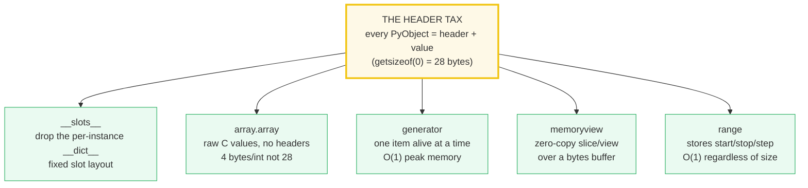
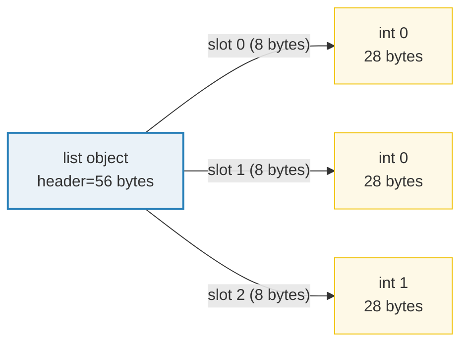
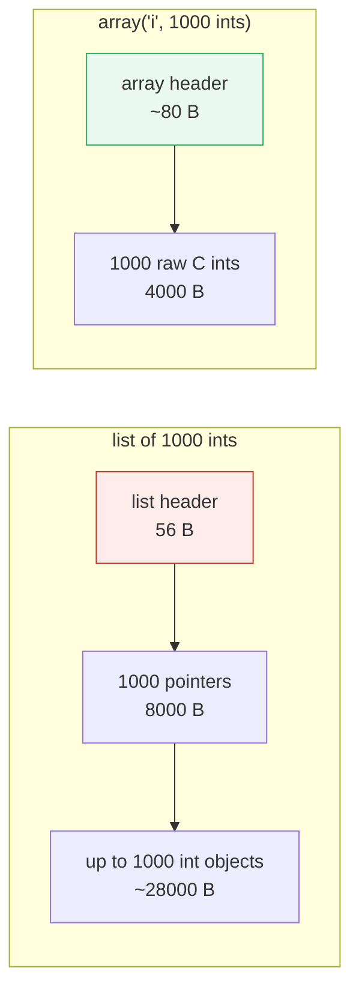
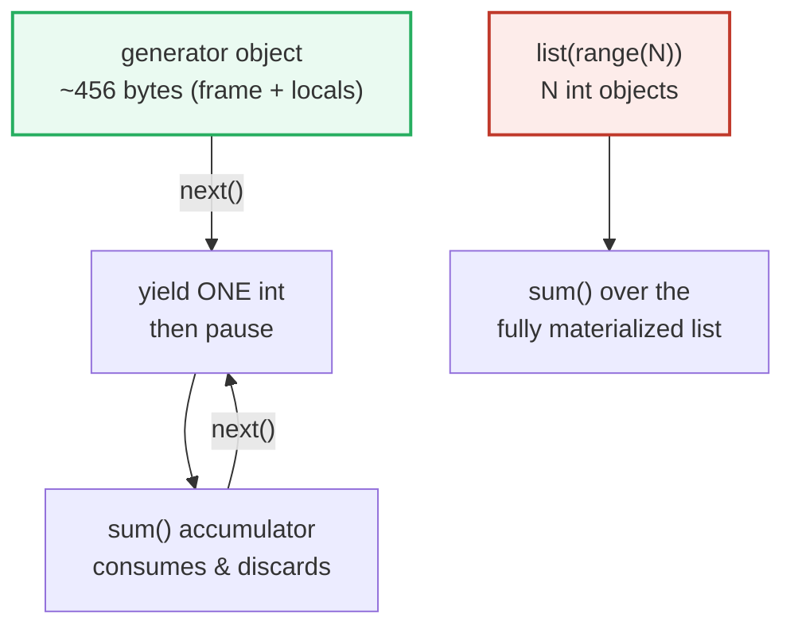

# Memory Efficiency — The Object-Header Tax, and `__slots__` / `array` / generators / `memoryview`

> **The one rule:** every Python object is a `PyObject` carrying a header
> (refcount + type pointer) before its value. A single `0` is **28 bytes**, not
> 4. When you hold a million of anything, that header tax dominates — and the
> four levers to cut it are **`__slots__`** (drop the per-instance `__dict__`),
> **`array.array`** (raw C values, no per-element header), **generators**
> (one item alive at a time, O(1) peak), and **`memoryview`** (a zero-copy view
> over a bytes buffer).

**Companion code:** [`memory_efficiency.py`](./memory_efficiency.py).
**Every number and table below is printed by `uv run python
memory_efficiency.py`** — change the code, re-run, re-paste. Nothing here is
hand-computed. Captured stdout lives in
[`memory_efficiency_output.txt`](./memory_efficiency_output.txt).

**Goal of this bundle (lineage, old → new):**

> from *"a list holds my data"*
> → *"every Python object pays a header tax; `__slots__`, `array`, generators,
> and `memoryview` are the levers to cut memory for large datasets."*

🔗 This is bundle **#25 of Phase 4**. It builds directly on:
[`MEMORY_MODEL`](./MEMORY_MODEL.md) (Phase 3) — the `PyObject*` view of "a
variable is a label", which is *why* there is a header at all;
[`PROPERTIES_DESCRIPTORS`](./PROPERTIES_DESCRIPTORS.md) (Phase 2) — the `§G`
that introduced `__slots__` as a descriptor layout (here we measure its payoff);
[`GENERATORS_ITERATORS`](./GENERATORS_ITERATORS.md) (Phase 1) — the iterator
protocol (here we measure the memory consequence); and
[`GC_WEAKREFS`](./GC_WEAKREFS.md) (Phase 3) — the `tracemalloc` tool we reuse to
measure peak allocations. See [`TODO.md`](./TODO.md) for the full plan.

---

## 0. The five levers on one page



| Lever | Wins when | Cost |
|---|---|---|
| `__slots__` | millions of uniform instances | no `__dict__` → no ad-hoc attrs, no `cached_property` |
| `array.array` | huge homogeneous numeric column | reads *box* back to `int`/`float` on every access; no nesting |
| generator | streaming / one-pass transform | single-use, no random access, no `len()` |
| `memoryview` | slicing/inspecting a binary buffer | source must support the buffer protocol |
| `range` | lazy integer sequence | integers only, fixed step |

---

## 1. The object-header tax: why `0` is 28 bytes

A Python `int` is **not** the 4-byte `int` of C. Every object is a `PyObject`
C struct whose first fields are a **refcount** and a **type pointer**; only
*after* that does the value live. The `int` type is arbitrary-precision, so the
value is stored as an array of 30-bit "digits" (`sys.int_info.bits_per_digit`).
A small int still pays for the header plus one digit; `2**100` needs more digits
so it is larger.

The consequence that catches everyone: `sys.getsizeof([0] * 1000)` is **8056
bytes**, but that counts only the list struct (56-byte header + 1000 pointers at
8 bytes each). It does **not** count the 1000 `int` objects those pointers
target — because the [docs](https://docs.python.org/3/library/sys.html#sys.getsizeof)
say `getsizeof` counts *"only the memory consumption directly attributed to the
object, not … objects it refers to."* A million-element list of *the same* `0`
is therefore 8 MB of pointers pointing at one shared 28-byte `int` (the
small-int cache from [`TYPES_AND_TRUTHINESS`](./TYPES_AND_TRUTHINESS.md)).

> From `memory_efficiency.py` Section A:
> ```
> ======================================================================
> SECTION A — The object-header tax: every PyObject pays for a header
> ======================================================================
> A Python `int` is NOT 4 bytes. Every object carries a PyObject
> header (refcount + type pointer + GC bookkeeping) plus its value.
> On a 64-bit CPython build the header alone is ~16-28 bytes. The
> docs warn: getsizeof counts ONLY what is directly attributed to
> the object, NOT what it refers to (so a list does NOT count its
> elements). That makes the list-of-pointers overhead easy to miss.
> 
> object                    getsizeof (bytes)
> ------------------------------------------------
> 0 (small int)             28
> 1 (small int)             28
> True (bool singleton)     28
> 2**100 (big int)          40
> () (empty tuple)          40
> [] (empty list)           56
> [0] (1 element)           64
> [0]*1000 (1000 ptrs)      8056
> range(1000)               48
> 
> list growth for 1000 slots = 8000 bytes (~8 bytes/slot = one PyObject* pointer)
> vs 1000 raw C ints would be ~4000 bytes (4 bytes each)
> 
> [check] a Python int 0 is > 20 bytes (header + digit storage): OK
> [check] 2**100 is bigger than 0 (more digits stored): OK
> [check] a list grows by ~8 bytes per slot (one pointer): OK
> [check] range(1000) is tiny regardless of size (stores start/stop/step): OK
> ```

### Why a list is a vector of pointers (internals)



A `list` is a resizable array of `PyObject*` pointers, **not** the values
themselves. Appending `0` stores a pointer; the pointed-to `int` is a separate
heap object. That indirection is what lets a list hold *mixed* types (a pointer
to an `int`, then a pointer to a `str`, …), but it is also why a list of 1000
ints is ~8 KB of pointers **plus** up to 28 KB of int objects (28 KB shrinks to
near-zero here only because the 1000 slots all point at the *cached singleton*
`0`). The next three sections are the ways to avoid paying that tax.

🔗 The full `PyObject` layout (refcount, type pointer, `id()`) is the subject of
[`MEMORY_MODEL`](./MEMORY_MODEL.md).

---

## 2. `__slots__`: drop the per-instance `__dict__`

A normal instance stores its attributes in a per-instance `__dict__` — a hash
table that is a few hundred bytes even for one field. Declaring `__slots__`
tells the class "these are the only attributes; give each a fixed slot instead
of a `__dict__`." The interpreter then allocates a fixed, compact struct.

**The trap that makes this measurement subtle:** `getsizeof(instance)` is
**shallow**. For a non-slotted instance it returns the size of the instance
struct *without* the separate `__dict__` object that struct points at. To compare
honestly you must add `getsizeof(instance.__dict__)`. On this build a 3-field
non-slotted instance is `48 + 296 = 344` bytes; the same field count with
`__slots__` is `56` bytes with no `__dict__` at all — a **6.14×** saving per
instance, which at a million instances is ~275 MiB.

> From `memory_efficiency.py` Section B:
> ```
> ======================================================================
> SECTION B — __slots__: trade the per-instance __dict__ for a fixed layout
> ======================================================================
> A normal instance carries a __dict__ (a hash table) to hold its
> attributes — typically a few hundred bytes, even for one field. A
> class with __slots__ drops that __dict__ and stores attributes in a
> fixed slot array. The catch: getsizeof(instance) is SHALLOW, so to
> compare honestly we must add getsizeof(instance.__dict__) for the
> non-slotted class.
> 
> measurement                       bytes
> --------------------------------------------------
> getsizeof(NoSlots())              48
> getsizeof(NoSlots().__dict__)     296
>   -> NoSlots TOTAL                344
> getsizeof(WithSlots())            56
>   -> WithSlots TOTAL (no __dict__)56
> hasattr(WithSlots(), __dict__)    False
> 
> non-slotted / slotted ratio = 6.14x more memory per instance
> 
> [check] __slots__ instance has NO __dict__: OK
> [check] non-slotted instance DOES have a __dict__: OK
> [check] slotted TOTAL < non-slotted TOTAL (the whole point): OK
> at 1,000,000 instances, __slots__ saves ~288,000,000 bytes (~275 MiB)
> ```

### Why slots are smaller (internals)

Each slot name becomes a **member descriptor** sitting on the *class* (see
[`PROPERTIES_DESCRIPTORS`](./PROPERTIES_DESCRIPTORS.md) §G). Reading `p.x` calls
that descriptor's `__get__`, which reads a fixed offset in the instance struct;
writing `p.x = v` calls `__set__` at the same offset. Because the offsets are
fixed at class-creation time, there is no hash table, no resizing, and no key
storage — just a flat array of value slots. The [data-model docs](https://docs.python.org/3/reference/datamodel.html#slots)
state the rule verbatim: *"`__slots__` … deny the creation of `__dict__` and
`__weakref__`."* The cost is real, though: you cannot add ad-hoc attributes,
`pickle`/`copy` need care, and `functools.cached_property` is unusable (it
relies on the `__dict__` it removes).

---

## 3. `array.array`: raw C values, no per-element header

`array.array` stores values **inline as C primitives** — `array('i')` uses 4-byte
ints, `array('d')` uses 8-byte doubles — with no `PyObject` header per element.
1000 ints cost ~4 KB instead of ~28 KB. The trade is semantic: every read
*boxes* the C value back into a fresh Python `int` (so `arr[0]` returns a real
`int`), and the array can only hold one scalar type (no nesting, no strings).

> From `memory_efficiency.py` Section C:
> ```
> ======================================================================
> SECTION C — array.array: store raw C values, not PyObjects
> ======================================================================
> A list of ints holds POINTERS to int objects (each ~28 bytes).
> array.array stores the raw C values inline (4 bytes for 'i'), so
> 1000 ints cost ~4 KB in an array vs ~28 KB+ as a list of int
> objects (28 bytes/int + 8 bytes/pointer). The trade: every read
> BOXES the C value back into a Python int on the fly.
> 
> container                       getsizeof (bytes)
> ----------------------------------------------------
> [0]*1000  (list of 1000 int objects)8056
> array("i", [0]*1000)  (raw C ints)4080
> array.itemsize                  4
> 
> list / array ratio = 1.97x (array is 2.0x smaller for the same 1000 ints)
> 
> [check] array.itemsize == 4 for 'i' (one C int per slot): OK
> [check] array('i', 1000 ints) < list of 1000 ints: OK
> [check] reading an array element returns a Python int (boxes on read): OK
> [check] array scales by itemsize (1000 * 4 + small header): OK
> ```

### Why `array` wins for numeric columns (internals)



`getsizeof([0]*1000)` is 8056 bytes (56-byte list header + 8000 bytes of
pointers); `getsizeof(array('i', [0]*1000))` is 4080 bytes (~80-byte array header
+ 4000 bytes of raw `int32`). Even this **understates** the list's true cost:
`getsizeof` excludes the int *objects* the pointers target (up to 28 KB more if
they are not cached singletons). For real numeric work `numpy.ndarray` is the
same idea at scale — a single typed buffer plus vectorized ops — but `array`
ships with the stdlib and needs no dependency.

---

## 4. `bytes` / `bytearray` / `memoryview`: zero-copy views

`bytes` is an **immutable** compact buffer: 1 byte per element plus a ~33-byte
header (so `bytes(1_000_000)` is exactly `1_000_033` bytes). `memoryview` wraps
any object that implements the **buffer protocol** and exposes a view that
shares the underlying memory — slicing a 1 MB buffer into a 1000-byte view
allocates only the ~184-byte view struct, not a copy. If the source is mutable
(`bytearray`), you can **write** through the view and mutate the original in
place.

> From `memory_efficiency.py` Section D:
> ```
> ======================================================================
> SECTION D — memoryview: a zero-copy view over a bytes-like buffer
> ======================================================================
> bytes is an immutable compact buffer (1 byte per element + a small
> header). memoryview wraps any buffer-protocol object and lets you
> slice / read / (if mutable) write WITHOUT copying the data. The
> view object itself is ~184 bytes regardless of how big a slice it
> describes, because it shares the underlying buffer.
> 
> object                                  getsizeof (bytes)
> ------------------------------------------------------------
> bytes(1_000_000)                        1000033
> memoryview(bytes(1_000_000))            184
> memoryview(...)[:1000]  (a slice)       184
> mv_slice.nbytes (logical bytes seen)    1000
> 
> The 184-byte slice view shares the 1,000,033-byte buffer -> zero copy.
> 
> ba = bytearray(b'hello world')
> memoryview(ba)[0:5] = b'HELLO'  ->  ba now = b'HELLO world'
> 
> [check] bytes(1MB) is ~1 MB (33-byte header + 1,000,000 data): OK
> [check] memoryview of a 1 MB buffer is tiny (zero-copy): OK
> [check] a slice view is the same tiny size (shares the buffer): OK
> [check] the slice sees 1000 logical bytes but copies none: OK
> [check] writing through a memoryview mutates the underlying bytearray: OK
> ```

### Why the view is 184 bytes for any slice (internals)

A `memoryview` is a small struct holding a pointer to the source's buffer, an
offset, a shape, and strides — not the data itself. So `memoryview(big)[:1000]`
and `memoryview(big)` report the *same* `getsizeof` (184 bytes) even though
`.nbytes` differs (1000 vs 1,000,000): the former is a window into the same
million bytes. This is the [buffer protocol](https://docs.python.org/3/c-api/buffer.html)
that `bytes`, `bytearray`, `array.array`, and `numpy.ndarray` all implement,
which is why `memoryview` can wrap any of them interchangeably. Zero-copy slicing
matters enormously for parsing big binary blobs (network frames, file formats,
images): `buf[10:14]` on a `memoryview` is a pointer arithmetic, whereas
`buf[10:14]` on a `bytes` allocates a fresh 4-byte object.

---

## 5. Generator vs list: O(1) vs O(N) peak memory

A generator `sum(x for x in range(N))` runs the loop *lazily*: at any instant
exactly one `int` is alive, then it is consumed by `sum` and discarded. A list
`sum(list(range(N)))` materializes **all N** ints at once before `sum` even
starts. We measure **peak** memory with `tracemalloc` (🔗 [`GC_WEAKREFS`](./GC_WEAKREFS.md)
introduced it): the generator's peak is a flat 456 bytes from N=1,000 to
N=1,000,000, while the list's peak grows linearly to ~40 MB.

> From `memory_efficiency.py` Section E:
> ```
> ======================================================================
> SECTION E — Generator vs list: O(1) vs O(N) peak memory
> ======================================================================
> A generator yields one item at a time and forgets it; a list holds
> all N items at once. We measure PEAK memory with tracemalloc across
> growing N: the generator's peak stays ~constant, the list's scales
> linearly. (🔗 GENERATORS_ITERATORS for the iterator protocol.)
> 
>          N      gen_peak     list_peak    list/gen
> ------------------------------------------------------
>      1,000           456        31,952       70.1x
>    100,000           456     3,991,952     8754.3x
>  1,000,000           456    39,991,952    87701.6x
> 
> [check] generator peak memory is ~constant across N (O(1)): OK
> [check] list peak memory grows with N (O(N)): OK
> [check] at N=1,000,000 the list peak >> generator peak: OK
> [check] the two produce the same answer (sum is equal): OK
> ```

### Why the generator's peak is flat (internals)



A generator object is a **suspended frame**: it holds the bytecode pointer, the
local variables, and the operand stack — a fixed ~456-byte struct regardless of
how many items it will eventually yield. Each `next()` resumes the frame,
computes one value, yields it, and suspends again; nothing accumulates. The
list version, by contrast, must call `list(range(N))` *first*, allocating N int
objects and N pointer slots, before `sum` is even invoked. The 456-byte gen peak
includes the generator frame plus a little `tracemalloc` bookkeeping — it would
be the same for `N = 10**9` (modulo `sum`'s growing integer accumulator).
🔗 [`GENERATORS_ITERATORS`](./GENERATORS_ITERATORS.md) covers the `__iter__` /
`__next__` / `yield` mechanics; the headline here is the **memory** consequence.

---

## 6. The decision table: which lever wins when

> From `memory_efficiency.py` Section F:
> ```
> ======================================================================
> SECTION F — Which lever wins when: the decision table
> ======================================================================
> Pick the tool by data SHAPE and ACCESS pattern, not by habit.
> 
> scenario                                  best tool             why
> --------------------------------------------------------------------------------------------
> small, heterogeneous records              objects / dict        __dict__ overhead is negligible; flexibility wins
> huge homogeneous numeric column           array / numpy         raw C values, no per-element header
> streaming / one-pass transformation       generator             O(1) peak memory; nothing buffered
> binary buffer (parse / slice)             bytes / memoryview    compact + zero-copy slicing
> millions of small uniform instances       class with __slots__  drops the per-instance __dict__
> lazy arithmetic sequence                  range                 stores only start/stop/step; O(1)
> 
> [check] a decision rule was printed for every lever above: OK
> [check] array beats list for a numeric column (re-assert from Section C): OK
> ```

The guiding question is always: **does every element need its own header?**
Heterogeneous records (a `User` with `name`, `age`, `email`) genuinely need
per-object flexibility, so a `dict` or a plain class is correct — the overhead
is negligible next to the data. It is only when the elements are *uniform and
numerous* (a million floats, a gigabyte of bytes, a streaming pipeline) that the
header tax dominates and a compact representation pays for itself.

---

## Pitfalls

| Trap | Example | The fix |
|---|---|---|
| Trusting `getsizeof` as the whole footprint | `getsizeof([0]*1000)` ignores the int objects the pointers target | use the recursive sizeof recipe the docs link, or `tracemalloc` for real peak |
| Comparing `getsizeof(slotted)` vs `getsizeof(non-slotted)` directly | raw slotted instance can be the same size or larger; the win is the absent `__dict__` | add `getsizeof(instance.__dict__)` for the non-slotted side |
| `__slots__` + inheritance | a subclass without `__slots__` re-creates `__dict__`, erasing the saving | every class in the MRO must declare `__slots__` (empty `()` is fine) |
| Assuming `array` is always faster | every read *boxes* the C value into a fresh `int`; random access under GIL can lose to `list` | benchmark; for heavy numeric work use `numpy` (vectorized, no per-op boxing) |
| Treating a generator like a list | `len(gen)`, `gen[5]`, or iterating twice fails / exhausts it | materialize to a `list` only when you genuinely need random access or reuse |
| Slicing a `bytes` thinking it's cheap | `buf[10:1000000]` allocates a fresh ~1 MB object every time | wrap once in `memoryview(buf)` and slice the view (zero-copy) |
| Writing through a `memoryview` over `bytes` | `bytes` is immutable → `TypeError` | use a `bytearray` source if you need in-place mutation |
| `array('i')` overflow | values outside `[-2**31, 2**31)` raise `OverflowError` on store | pick the right typecode (`'l'`, `'q'`, `'d'`) for your range |
| Expecting `__slots__` to shrink *every* class | single-instance savings are tiny; payoff is only at scale (millions) | profile first; don't slot a class with 3 instances |
| `range` mistaken for a list | `range(10**12)` is fine (O(1)); `list(range(10**12))` will OOM | keep it lazy; only materialize when you must |

---

## Cheat sheet

- **The header tax:** every `PyObject` = refcount + type pointer + value. `getsizeof(0)` = 28
  bytes (not 4). `getsizeof` is **shallow** — it excludes referred-to objects.
- **`__slots__`:** declares the fixed attribute set; removes the per-instance `__dict__`.
  ~6× smaller per instance at 3 fields; ~275 MiB saved at a million instances. Every class
  in the MRO must slot it, or a `__dict__` sneaks back.
- **`array.array`:** typed C buffer (`'i'`=4 B, `'d'`=8 B). 1000 ints = ~4 KB vs ~8 KB+ for a
  list of pointers (and up to ~28 KB more for the int objects). Reads box back to `int`.
- **`bytes` / `bytearray`:** compact 1-byte-per-element buffer + ~33-byte header. `bytes` is
  immutable; `bytearray` is mutable.
- **`memoryview`:** zero-copy view over any buffer-protocol object. The view struct is ~184
  bytes regardless of slice size; writes through it mutate a `bytearray` source in place.
- **generator vs list:** a generator is one suspended frame (~constant memory); a list holds
  all N items. `tracemalloc` proves it: gen peak flat at 456 B, list peak linear to ~40 MB at
  N=10⁶. Keep pipelines lazy; materialize only when you need random access.
- **`range`:** stores only `start/stop/step` — O(1) regardless of size. The cheapest possible
  integer sequence.
- **Decision rule:** heterogeneous → `dict`/object; homogeneous numeric → `array`/`numpy`;
  streaming → generator; binary → `bytes`/`memoryview`; millions of uniform instances →
  `__slots__`; integer sequence → `range`.

---

## Sources

- **Python docs — `sys.getsizeof`.**
  https://docs.python.org/3/library/sys.html#sys.getsizeof
  *Verbatim: "Only the memory consumption directly attributed to the object is
  accounted for, not the memory consumption of objects it refers to." This is
  why a list's `getsizeof` excludes its elements, and why the `__slots__`
  comparison must add `getsizeof(instance.__dict__)` (§1, §2).*
- **Python docs — Data model: `__slots__`.**
  https://docs.python.org/3/reference/datamodel.html#slots
  *"`__slots__` allow us to explicitly declare data members … and deny the
  creation of `__dict__` and `__weakref__`." Defines the fixed-layout semantics
  and the MRO rules that §2 leans on.*
- **Python docs — `array`: Efficient arrays of numeric values.**
  https://docs.python.org/3/library/array.html
  *Typecode table (`'i'` = signed int, 4 bytes on this platform; `'d'` = double,
  8 bytes) and the `.itemsize` attribute used in §3.*
- **Python docs — Built-in Types: Memory Views.**
  https://docs.python.org/3/library/stdtypes.html#memoryview
  *Defines `memoryview` as a view over buffer-protocol objects and `.nbytes` as
  the logical byte count, confirming the zero-copy slicing in §4.*
- **Python docs — Sequence Types: `range`.**
  https://docs.python.org/3/library/stdtypes.html#ranges
  *Verbatim: "a range object will always take the same (small) amount of memory,
  no matter the size of the range it represents (as it only stores the start,
  stop and step values)." Cited in §1 and §6.*
- **Python docs — Buffer Protocol (C API).**
  https://docs.python.org/3/c-api/buffer.html
  *The protocol `bytes`/`bytearray`/`array`/`numpy` implement and `memoryview`
  consumes — the mechanism behind the zero-copy slice in §4.*
- **Python docs — `sys.int_info`.**
  https://docs.python.org/3/library/sys.html#sys.int_info
  *`bits_per_digit` / `sizeof_digit` confirm that `int` is arbitrary-precision
  storage in base 2³⁰, explaining why `getsizeof(2**100) > getsizeof(0)` in §1.*
- **Python docs — `tracemalloc`.**
  https://docs.python.org/3/library/tracemalloc.html
  *`start()` / `get_traced_memory()` (returns current, peak) used in §5 to prove
  the generator's flat peak vs the list's linear peak. (🔗 `GC_WEAKREFS`
  introduced this tool.)*
- **Cross-references (sibling bundles).**
  [`MEMORY_MODEL`](./MEMORY_MODEL.md) — the `PyObject*` view behind the header tax;
  [`PROPERTIES_DESCRIPTORS`](./PROPERTIES_DESCRIPTORS.md) — the descriptor layout
  of `__slots__`; [`GENERATORS_ITERATORS`](./GENERATORS_ITERATORS.md) — the
  iterator protocol behind the O(1) generator peak; [`GC_WEAKREFS`](./GC_WEAKREFS.md)
  — `tracemalloc` and the allocator view; [`TYPES_AND_TRUTHINESS`](./TYPES_AND_TRUTHINESS.md)
  — the small-int cache that makes `getsizeof([0]*1000)` understate so sharply.
