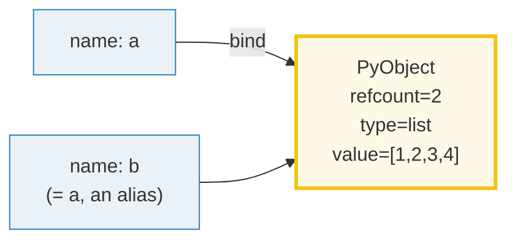
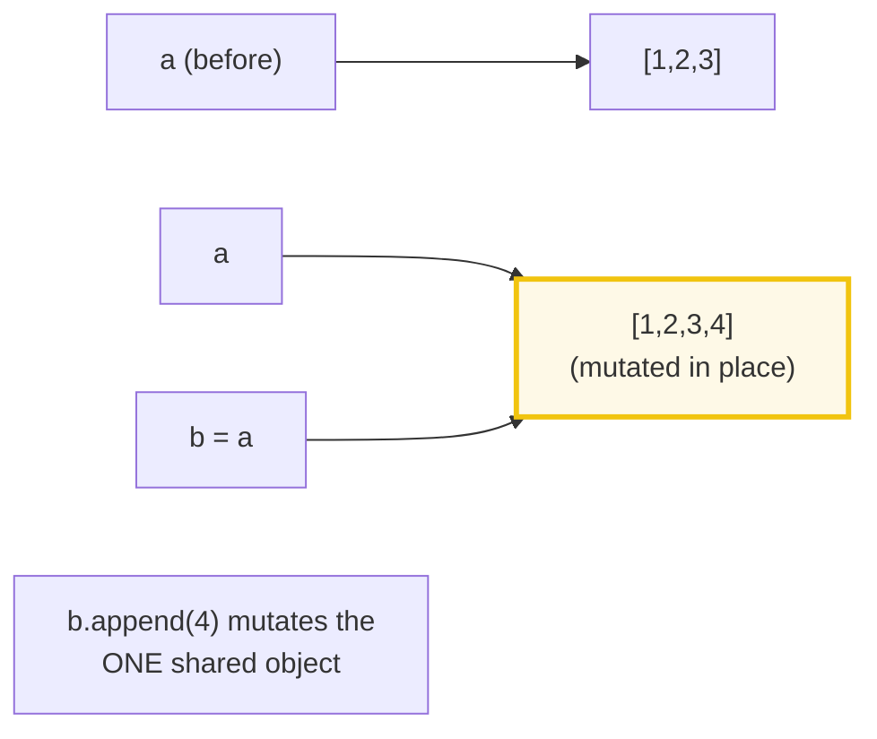
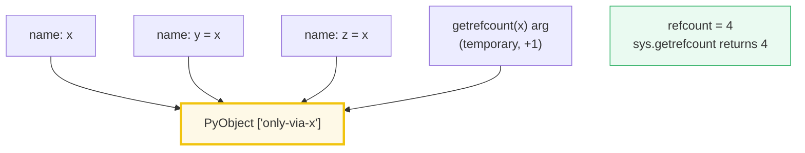
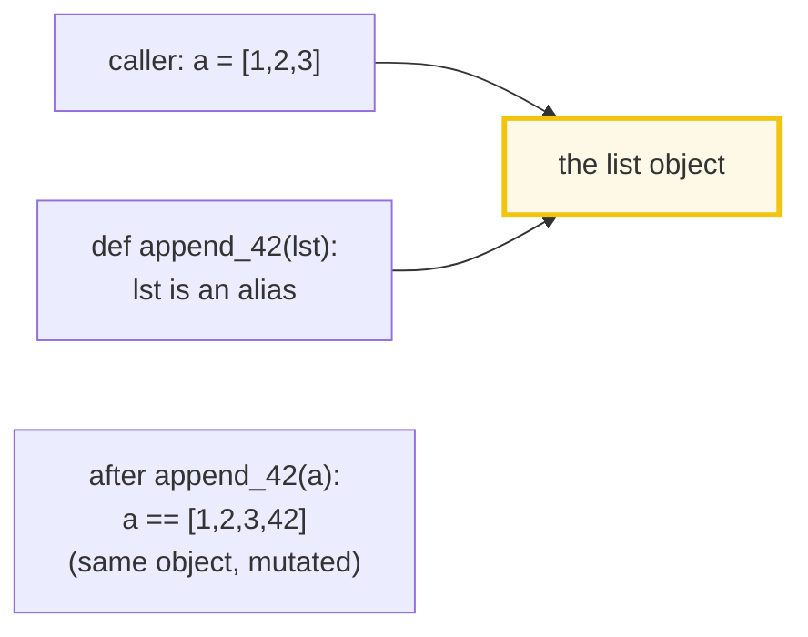
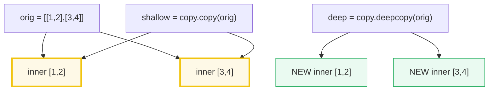

# Memory Model — Names as Labels on `PyObject`, `id()`/`is`, Refcounts, and Copying

> **The one rule:** a Python variable is **not a box that holds a value** — it
> is a **label tied to a `PyObject`** (a C struct holding a refcount, a type
> pointer, and the value). Assignment `b = a` adds a *second label* to the
> *same* object; `is` compares labels (identity), `==` compares values; mutability
> + aliasing is the root of most surprising bugs.

**Companion code:** [`memory_model.py`](./memory_model.py).
**Every number and table below is printed by `uv run python
memory_model.py`** — change the code, re-run, re-paste. Nothing here is
hand-computed. Captured stdout lives in
[`memory_model_output.txt`](./memory_model_output.txt).

> `id()` integers change **every run** (they are memory addresses). The `.py`
> therefore asserts **relationships** (`a is b`, refcount *deltas*), never
> absolute `id()` values. Where an `id()` appears below it is illustrative; the
> script always labels it "(varies per run)".

**Goal of this bundle (lineage, old → new):**

> from *"variables hold values"*
> → *"variables are LABELS on `PyObject` structs; assignment binds a name to an
> object; `is` compares object identity; reference counting governs lifetime;
> mutability + aliasing is the root of most bugs."*

🔗 This bundle is **#16, the opener of Phase 3** ("Internals"). It deepens the
`is` / `==` distinction first introduced in
[`TYPES_AND_TRUTHINESS`](./TYPES_AND_TRUTHINESS.md) (P1 #1, Section E — which
previewed the small-int cache and one line of string interning). The
mutable-default trap is revisited here from the *memory* angle (one shared
object), having been introduced syntactically in
[`FUNCTIONS_ARGS_SCOPE`](./FUNCTIONS_ARGS_SCOPE.md) (P1 #6). Reference counting
is the bridge to [`GC_WEAKREFS`](./GC_WEAKREFS.md) (P3 #17 — cyclic collection)
and ultimately to [`THREADING_GIL`](./THREADING_GIL.md) (P3 #19) and
[`ASYNCIO`](./ASYNCIO.md) (P3 #21): the refcount→GIL chain *is* the heart of
"Python expert." See [`TODO.md`](./TODO.md) for the full plan.

---

## 0. The one diagram: names are labels on objects



| Question | Operator | What it really asks | Overridable? |
|---|---|---|---|
| "Same **value**?" | `==` | calls `__eq__` | yes |
| "Same **object**?" | `is` | same `id()` (pointer compare in C) | **no** |
| "How many names point here?" | `sys.getrefcount(x)` − 1 | the refcount (−1 for the call's own arg) | n/a |
| "Make a copy that shares inner objects?" | `copy.copy(x)` | one-level copy | via `__copy__` |
| "Make a fully independent copy?" | `copy.deepcopy(x)` | recursive copy | via `__deepcopy__` |

---

## 1. Names are labels on objects, not boxes

The single most important shift in becoming a Python expert: stop thinking of a
variable as a *box* and start thinking of it as a *sticky note* (a label) pasted
onto an object. `a = [1,2,3]` creates a list object **and** pastes the label `a`
onto it. `b = a` does **not** copy the list — it pastes a *second* label `b` onto
the *same* object. There is now one list and two names. Mutating through either
name is visible through the other, because there is only one object. This is
**aliasing**, and it is why "I changed `b` and `a` changed too!" happens.



> From `memory_model.py` Section A:
> ```
> ======================================================================
> SECTION A — Names are labels on objects, not boxes
> ======================================================================
> A Python variable is NOT a box that holds a value. It is a NAME (a
> label) tied to a PyObject. Assignment `b = a` makes b a SECOND label
> on the SAME object a points at — so mutating through b is visible via
> a. This is aliasing, and it is the root of most surprise.
> 
> a = [1,2,3]
> b = a              # second label on the same object
> b.append(4)        # mutates the ONE object both names see
> a is now: [1, 2, 3, 4]
> b is now: [1, 2, 3, 4]
> a is b: True
> 
> [check] a is b after `b = a` (two labels, one object): OK
> [check] a == [1,2,3,4] after b.append(4) (same object mutated): OK
> [check] b == [1,2,3,4] (alias sees the mutation too): OK
> ```

### Why assignment is rebinding (internals)

There is no "copy" step in `=`. CPython compiles `b = a` to a `STORE_NAME`
bytecode that writes a pointer (`PyObject*`) into the local namespace dict /
`fast` slot. Both `a` and `b` end up holding the **same pointer to the same
struct**. To get an independent list you must explicitly ask for one —
`b = a.copy()`, `b = list(a)`, `b = a[:]`, or `copy.deepcopy(a)` (see §6).
Ned Batchelder's "Facts and Myths about Python names and values" calls this the
distinction between *assignment* (which moves labels) and *mutation* (which
changes an object in place): `b = a` is assignment (re-label); `b.append(4)` is
mutation (alter the shared object).

🔗 The mutable-default trap (§5) and the "function mutated my list" surprise
(§5) are both *direct* consequences of this rebinding model.

---

## 2. `id()` and `is`: identity vs equality

`id(obj)` returns the object's **identity** — in CPython, literally its memory
address. `a is b` is **exactly** `id(a) == id(y)`: a raw pointer comparison
that never calls `__eq__` and cannot be overloaded. `==` calls `__eq__` and
asks "same value?" Two freshly-built lists with equal contents are `==` but
**not** `is`, because each literal `[1,2]` constructs a *distinct* struct at a
*distinct* address.

> From `memory_model.py` Section B:
> ```
> ======================================================================
> SECTION B — id() and is: identity vs equality
> ======================================================================
> id(obj) is the object's identity (its address in CPython). `is` asks
> 'do two names point at the SAME object?' — it is exactly id(x) ==
> id(y), and it NEVER calls __eq__. `==` asks 'same VALUE?' and calls
> __eq__. Two equal lists are == but NOT is.
> 
> a = [1,2];  b = [1,2];  c = a
> id(a) = 4330313664  (varies per run)
> id(b) = 4331302464  (varies per run)
> id(c) = 4330313664  (== id(a): same object)
> expression      result
> ----------------------------------
> a == b          True   (equal contents)
> a is b          False   (distinct objects)
> a is c          True   (c is an alias of a)
> 
> [check] a == b is True (equal values): OK
> [check] a is b is False (two equal lists are distinct objects): OK
> [check] a is c is True (c is an alias of a, same id): OK
> ```
>
> *Note: the `id()` integers above are illustrative — they change every run.
> The relationships (`id(a) == id(c)`, `id(a) != id(b)`) are what the script
> asserts and what hold deterministically.*

### Why `is` is a pointer compare (internals)

A `PyObject` is a C struct whose first field is the refcount (`Py_ssize_t
ob_refcnt`) and whose second field is a pointer to its type object
(`PyTypeObject *ob_type`). `id(obj)` returns the address of that struct; `is`
compares two such addresses with a single `==` in C (`PyObject *a == PyObject *b`).
That is why `is` is (a) not overridable — there is no `__is__` — (b) cheaper
than `==`, and (c) the **only** correct way to test for singletons like `None`,
`True`, `False`, and sentinels. A custom class can make `__eq__` lie
(`__eq__` can return `True` for anything); `is` cannot be fooled.

🔗 `==` calls `__eq__`; `__eq__` and `__hash__` together govern hashability and
dict/set membership — covered in [`DUNDER_METHODS`](./DUNDER_METHODS.md)
(P2 #10). The equality-vs-identity distinction was first introduced in
[`TYPES_AND_TRUTHINESS`](./TYPES_AND_TRUTHINESS.md) §5 (P1 #1).

---

## 3. Reference counting: `sys.getrefcount`

Every `PyObject` carries a **refcount**: the number of names, container slots,
and C-level references that point at it. The moment the refcount drops to `0`,
CPython frees the object **immediately** (not "eventually" — at once, in the
same `DECREF` call). `del x` does not delete the object; it deletes the *name*,
decrementing the refcount. `y = x` increments it. `sys.getrefcount(x)` reports
the count **plus one** — the `+1` is the temporary reference created by passing
`x` as the function's argument.



> From `memory_model.py` Section C:
> ```
> ======================================================================
> SECTION C — Reference counting: sys.getrefcount
> ======================================================================
> Every PyObject has a refcount = the number of names/containers
> pointing at it. When the refcount hits 0 the object is freed at once.
> sys.getrefcount(x) returns the count + 1: the +1 is the temporary
> reference created by passing x as the argument. We assert the DELTA
> (alias -> +1, del -> back to base), which is deterministic.
> 
> x = ['only-via-x']
> base  getrefcount(x) = 2   (= 1 name 'x' + 1 arg artifact)
> y = x  -> getrefcount(x) = 3   (delta 1)
> z = x  -> getrefcount(x) = 4   (delta 2)
> del y, z -> getrefcount(x) = 2   (back to base)
> 
> [check] base refcount is 2 (the name + the getrefcount arg artifact): OK
> [check] one alias adds exactly 1 (after_alias - base == 1): OK
> [check] a second alias adds another 1 (after_z - base == 2): OK
> [check] deleting both aliases restores base (after_del == base): OK
> ```

### Why the `+1` artifact exists, and why we assert deltas (internals)

`sys.getrefcount(x)` is itself a Python function: to call it, the interpreter
must load `x` onto the stack and bind it to the parameter — that binding is a
real reference, counted by the very function it invokes. The docs say so
verbatim: *"The count returned is generally one higher than you might expect,
because it includes the (temporary) reference as an argument to getrefcount()."*
The absolute count therefore depends on internal optimizations (3.12+'s
`LOAD_FAST_BORROW` can sometimes avoid creating the reference); the **delta**
from adding/removing one name, however, is rock-solid `±1`, which is what the
script asserts.

🔗 Refcounting has one blind spot — **reference cycles** (`a.b = a`) that keep
each other's count above 0 forever. Those are collected by the **cyclic garbage
collector**, the subject of [`GC_WEAKREFS`](./GC_WEAKREFS.md) (P3 #17). The GIL
exists in large part to keep refcount increments/decrements atomic — the bridge
to [`THREADING_GIL`](./THREADING_GIL.md) (P3 #19).

---

## 4–5. Mutability + aliasing: the function-call trap

Because a parameter is just another **label**, passing a mutable object into a
function gives that function an **alias** on the caller's object. Any in-place
mutation (`append`, `sort`, `obj[k] = v`) is visible to the caller the instant
the function returns. The same aliasing rule, applied to default *argument*
values, is the famous **mutable-default trap**: the default `[]` is evaluated
**once**, at `def` time, and stored in `f.__defaults__`. Every call that omits
the argument shares that single list object.



> From `memory_model.py` Section D:
> ```
> ======================================================================
> SECTION D — Mutability + aliasing: the function-call trap
> ======================================================================
> Passing a mutable object to a function passes a LABEL on it. The
> function's parameter is an ALIAS: mutating it mutates the caller's
> object. The same aliasing rule creates the mutable-default trap: the
> default `[]` is evaluated ONCE at def-time and shared by every call.
> 
> a = [1,2,3];  b = append_42(a)
> a after call: [1, 2, 3, 42]   (caller's object was mutated)
> b is a: True    (function returned the same object)
> 
> [check] append_42 mutated the caller's list (a == [1,2,3,42]): OK
> [check] return value is the same object (b is a): OK
> with_default(items=[]) called 3x with NO argument:
>   r1 = [1, 1, 1]
>   r2 = [1, 1, 1]
>   r3 = [1, 1, 1]
>   r1 is r2: True  (default [] is ONE object, eval'd once)
>   with_default.__defaults__ = ([1, 1, 1],)
> 
> [check] mutable default is shared across calls (r1 is r2): OK
> [check] after 3 calls the shared default == [1,1,1]: OK
> ```

### Why default args are evaluated once (internals)

The `def` statement is an executable statement; when it runs, CPython evaluates
each default expression **once** and stores the results in a tuple on the
function object (`f.__defaults__`). The function literal `def f(x=[])` evaluates
`[]` exactly once — at definition — and binds that *one* list as the default
forever. The three calls to `with_default()` all omitted the argument, so all
three received the **same** list; three `append(1)` calls produced `[1, 1, 1]`,
which `f.__defaults__[0]` confirms is the *one* shared object. The idiomatic fix
is `def f(x=None): if x is None: x = []` — a fresh list per call. Python is
**pass-by-object-reference** (a.k.a. "pass-by-assignment" / "pass-by-sharing"):
the parameter is bound to the same object, never a copy.

🔗 The mutable-default trap was introduced syntactically in
[`FUNCTIONS_ARGS_SCOPE`](./FUNCTIONS_ARGS_SCOPE.md) (P1 #6); here you see its
*memory* cause — one shared `PyObject`.

---

## 6. Immutable container, mutable contents

"Immutable" means you cannot **reassign** the container's slots — *not* that
everything reachable through it is frozen. A tuple holds **references**; those
references are fixed (you cannot make slot 0 point elsewhere), but if a slot
references a **mutable** object you can mutate that object freely through the
tuple. The tuple's `id()` and length never change; only the pointed-at object's
internal state does. Immutability is **shallow**.

> From `memory_model.py` Section E:
> ```
> ======================================================================
> SECTION E — Immutable container, mutable contents
> ======================================================================
> A tuple is immutable: you cannot REASSIGN its slots. But immutability
> is SHALLOW — if a slot HOLDS a mutable object, you can mutate that
> object through the tuple. The tuple's id() and length never change;
> only the pointed-at object's contents do.
> 
> t = (1, [2,3]);  id(t[1]) = 4331302464  (varies per run)
> t[0] = 99  ->  TypeError: 'tuple' object does not support item assignment
> t[1].append(4)  ->  t = (1, [2, 3, 4])
> id(t[1]) after append = 4331302464  (== before: True, same object)
> 
> [check] tuple slot reassignment raises TypeError: OK
> [check] inner list mutation works (t == (1, [2,3,4])): OK
> [check] the inner object is the SAME object (id unchanged): OK
> [check] the tuple length is unchanged (len(t) == 2): OK
> ```
>
> *The `id(t[1])` value is illustrative (varies per run); the script asserts
> `id(t[1]) before == id(t[1]) after`, i.e. the same object survives the
> mutation.*

### Why a tuple of a list can still "change" (internals)

`t = (1, [2,3])` builds a tuple struct whose second slot holds a **pointer** to
a list struct. `t[0] = 99` fails because the tuple type has no
`__setitem__`/`mp_ass_subscript` slot — CPython raises `TypeError: 'tuple'
object does not support item assignment`. But `t[1].append(4)` first reads the
pointer (`t[1]`), then calls `list.append` on the object *that pointer leads
to* — the tuple is never asked to change its slots, so no error. The tuple's
"hashability" follows from this: a tuple is hashable only if **all** its
elements are hashable (so `(1, [2,3])` is **not** hashable, because the list
inside is mutable).

---

## 7. `copy.copy` (shallow) vs `copy.deepcopy` (recursive)

When you need an independent object, the `copy` module offers two depths.
`copy.copy(x)` constructs a **new outer** object and fills its slots with the
**same references** as the original — so nested mutables are **shared**.
`copy.deepcopy(x)` recurses: it builds a new outer object *and* new copies of
every mutable reachable inside, tracking already-copied objects in a memo dict
to handle cycles and shared sub-structure correctly. Shallow shares inner
mutables; deep shares nothing.



> From `memory_model.py` Section F:
> ```
> ======================================================================
> SECTION F — copy.copy (shallow) vs copy.deepcopy (recursive)
> ======================================================================
> copy.copy(obj) makes a NEW outer object whose SLOTS still point at the
> SAME inner objects as the original (shared). copy.deepcopy(obj) makes
> a fully independent clone — it recurses, copying every mutable inside.
> Shallow shares inner mutables; deep shares nothing.
> 
> orig    = [[1, 2], [3, 4]]
> shallow = copy.copy(orig)      (new outer; SHARED inner lists)
> deep    = copy.deepcopy(orig)  (new outer; NEW inner lists)
> 
> relationship                  result
> ----------------------------------------------
> orig is shallow               False   (new outer object)
> orig is deep                  False   (new outer object)
> orig[0] is shallow[0]         True   (SHARED inner)
> orig[0] is deep[0]            False   (independent inner)
> 
> shallow[0].append(99) -> orig[0] = [1, 2, 99]   (shared: LEAKED)
>                       -> deep[0]  = [1, 2]   (independent)
> deep[1].append(77)    -> orig[1] = [3, 4]   (independent)
> 
> [check] shallow copy is a distinct OUTER object (orig is not shallow): OK
> [check] deepcopy is a distinct OUTER object (orig is not deep): OK
> [check] shallow copy SHARES inner lists (orig[0] is shallow[0]): OK
> [check] deepcopy makes independent inner lists (orig[0] is not deep[0]): OK
> [check] shallow mutation leaked into orig (orig[0] == [1,2,99]): OK
> [check] deepcopy mutation did NOT leak (orig[1] == [3,4]): OK
> ```

### Why shallow "leaks" and deep doesn't (internals)

`copy.copy` calls the type's `__copy__` if defined, else falls back to
`copy._copy_immutable` (for immutables, it can just return the same object) or a
generic reconstruct that copies only the outer container. For a list, that's
`list(x)` semantics: a new list whose elements are the **same pointers**. So
`orig[0] is shallow[0]` — `shallow[0].append(99)` mutates the shared inner list,
and `orig[0]` sees it. `copy.deepcopy` walks the object graph with
`_deepcopy_dict`, calling `deepcopy` on each element; each mutable inner gets a
brand-new struct, so `orig[0] is not deep[0]` and mutating `deep[1]` cannot
touch `orig`. Use **shallow** when the elements are immutable or you *want*
sharing (e.g. slicing rows of a table); use **deep** when you need total
independence (e.g. snapshotting state for undo). For container types there are
also shortcuts: `list(x)`, `x[:]`, and `x.copy()` are all **shallow**.

---

## 8. Interning: the small-int cache and string literals

CPython pre-allocates **one** `int` object for every value in `[-5, 256]` at
startup. Any time such a value is produced you get a *reference to the shared
singleton*, so `256 is 256` is `True`. Past `256` identity is **not guaranteed**
— we build `257` through `int('257')` at runtime so each construction is a fresh
object (reliably distinct). CPython also **interns** certain strings: identifier-
like literals (ASCII letters, digits, underscores) at compile time, plus the
empty string as a singleton; `sys.intern()` forces a string into the intern
table explicitly. Interning makes `==` on shared literals a cheap pointer
compare and slashes memory for repeated keys/values.

> From `memory_model.py` Section G:
> ```
> ======================================================================
> SECTION G — Interning: the small-int cache and string literals
> ======================================================================
> CPython pre-allocates ONE int object for every value in [-5, 256]; any
> occurrence of such a value is a reference to that shared singleton, so
> `256 is 256` is True. Past the cache, identity is NOT guaranteed — we
> build 257 via int('257') at runtime so it is reliably distinct. CPython
> also interns identifier-like string literals; sys.intern() does it
> explicitly. (Full small-int demo: types_and_truthiness Section E.)
> 
> a = -5; b = -5;          a is b: True   (lower cache bound)
> a = 256; b = 256;        a is b: True   (upper cache bound)
> int('257') is int('257'): False   (OUT of cache -> distinct)
> 
> [check] int('-5') is int('-5') (lower small-int cache bound shared): OK
> [check] int('256') is int('256') (upper small-int cache bound shared): OK
> [check] int('257') is NOT int('257') (out of cache): OK
> lit1 = "interned";  lit2 = "interned"
> built = "".join(["inter","ned"])   (runtime-built)
> lit1 == lit2            : True
> lit1 is lit2            : True   (identifier-like literal)
> built == lit1           : True
> built is lit1           : False   (runtime-built, distinct)
> sys.intern(built) is lit1: True   (explicit intern)
> 
> [check] equal string literals compare equal (lit1 == lit2): OK
> [check] runtime-built string equals the literal (built == lit1): OK
> [check] sys.intern() makes them identical (sys.intern(built) is lit1): OK
> ```

### Why the cache exists, and the `int('257')` construction (internals)

The small-int cache (`NSMALLNEGINTS`/`NSMALLPOSINTS` in CPython's `longobject.c`,
documented under `PyLong_FromLong`) covers `[-5, 256]` because those values
dominate loop indices, lengths, and flags — caching them avoids millions of
tiny allocations. We construct the cache tests via `int(<str>)` so that the
**peephole/AST optimizer** cannot constant-fold `257` into a single shared
`co_consts` entry (which would mask the boundary). The same care is why the
non-interned string is built with `"".join(...)` at runtime: a literal
`"interned" + "interned"` would be folded at compile time. `lit1 is lit2` is
`True` because CPython interns identifier-like literals across a module; `built
is lit1` is `False` because `str.join` returns a fresh, uninterned string; and
`sys.intern(built) is lit1` is `True` because `intern` looks the value up in the
global intern table and returns the existing canonical object.

🔗 The small-int cache and the first taste of interning were introduced in
[`TYPES_AND_TRUTHINESS`](./TYPES_AND_TRUTHINESS.md) §5 (P1 #1); this bundle is
the full treatment. See [`STRINGS_AND_BYTES`](./STRINGS_AND_BYTES.md) for how
interning and immutability combine to make `str` hashing safe.

> **Never rely on `is` for arbitrary ints or strings.** The cache range and the
> exact interning rules are **CPython implementation details** that change
> across versions and implementations (PyPy, Jython). Use `==` for value
> equality; reserve `is` for singletons (`None`, `True`, `False`, sentinels)
> and explicit `sys.intern`.

---

## Pitfalls

| Trap | Example | The fix |
|---|---|---|
| `b = a` aliases a mutable | `a=[1]; b=a; b.append(2)` → `a==[1,2]` | copy explicitly: `b = a.copy()` (shallow) or `b = copy.deepcopy(a)` |
| Function mutates caller's list | `def f(x): x.append(9)` mutates the arg | document mutation, or return a new list; never mutate unless you say so |
| Mutable default arg | `def f(x=[])` shared across all calls | `def f(x=None): x = [] if x is None else x` |
| `==` to test for `None` | `if x == None:` lies if `__eq__` is broken | always `if x is None:` (identity, no `__eq__`) |
| Assuming `is` for ints/strings | `a is b` for big ints is **not** guaranteed | use `==` for value equality; `is` only for singletons/cache curiosity |
| Treating "immutable" as "deeply frozen" | `t = (1, [2]); t[1].append(3)` works | immutability is **shallow** — guard inner mutables; such tuples aren't hashable |
| Shallow copy "leaking" mutations | `c = orig.copy(); c[0].append(9)` changes `orig[0]` | use `copy.deepcopy` for nested mutables |
| `deepcopy` on objects it can't clone | custom classes without `__deepcopy__` may break or copy too much | define `__deepcopy__`, or restrict to plain data; watch for file handles/sockets |
| `sys.getrefcount` looks off-by-one | `getrefcount(x)` is 1 higher than expected | the `+1` is the call's own argument reference — assert **deltas**, not absolutes |
| Refcounting can't collect cycles | `a.x = a` keeps both alive forever | the cyclic GC (`gc.collect()`) handles it — see 🔗 `GC_WEAKREFS` |
| `del x` doesn't free a shared object | `del a` when `b = a` exists keeps the object alive | `del` removes a **name**, not the object; the object dies only at refcount 0 |

---

## Cheat sheet

- **Names are labels, not boxes.** `a = [1,2,3]` pastes a label on a new list;
  `b = a` pastes a *second* label on the *same* list. No copy is made by `=`.
- **Aliasing:** two names, one object → mutating through one is visible through
  the other. The root of most "it changed and I didn't touch it" bugs.
- **`id(x)`** = the object's identity (its address in CPython). **`a is b`** ≡
  `id(a) == id(b)` — a pointer compare, **not** overridable, never calls
  `__eq__`. **`==`** calls `__eq__` and compares values.
- **Two equal lists are `==` but not `is`**: `[1,2] == [1,2]` → `True`;
  `[1,2] is [1,2]` → `False` (distinct objects at distinct addresses).
- **Reference counting:** every `PyObject` has a refcount; `y = x` → +1,
  `del y` → −1, refcount 0 → freed **at once**. `sys.getrefcount(x)` returns
  count **+ 1** (the call's own argument); assert **deltas**, not absolutes.
- **Pass-by-object-reference:** a parameter is an alias on the caller's object —
  in-place mutation is visible to the caller; rebinding the parameter is not.
- **Mutable-default trap:** `def f(x=[])` evaluates `[]` **once** at `def` time;
  the shared list lives in `f.__defaults__`. Fix: `x=None` then `if x is None:
  x = []`.
- **Immutability is shallow:** a tuple forbids slot **reassignment**
  (`t[0]=...` → `TypeError`) but lets you **mutate** a mutable element
  (`t[1].append(...)`). The tuple's `id()`/length never change.
- **`copy.copy`** = one-level copy, **shares** inner mutables.
  **`copy.deepcopy`** = recursive, **independent** clone (memo tracks cycles).
  `list(x)`, `x[:]`, `x.copy()` are all **shallow**.
- **Small-int cache:** `[-5, 256]` inclusive — shared singletons, so `256 is
  256` → `True`. Past it identity is **not** guaranteed; always use `==` for
  values. **String interning:** identifier-like literals interned at compile
  time; `sys.intern(s)` forces it. Both are CPython details — never depend on
  them for correctness.

---

## Sources

- **Python docs — The Python Language Reference: Data model.**
  https://docs.python.org/3/reference/datamodel.html
  *Defines objects as the abstraction for data: "Every object has an identity, a
  type and a value. An object's identity never changes once it has been created;
  you may think of it as the object's address in memory. The `is` operator
  compares the identity of two objects; the `id()` function returns an integer
  representing its identity." Basis for §2 and the whole bundle.*
- **Python docs — The Python Language Reference: Execution model (naming and binding).**
  https://docs.python.org/3/reference/executionmodel.html
  *"A name refers to an object. Names are bound by assignment." Assignment is
  binding (a label on an object), not copying — the formal statement of §1.*
- **Python docs — The Python Language Reference: Expressions (comparisons).**
  https://docs.python.org/3/reference/expressions.html#comparisons
  *"`is`/`is not` test object identity" and "cannot be customized … never raise
  an exception" — the §2 identity-vs-equality contract.*
- **Python docs — C API: Common Object Structures (`PyObject`).**
  https://docs.python.org/3/c-api/structures.html#c.PyObject
  *The C struct every Python object derives from: `Py_ssize_t ob_refcnt;` (the
  refcount) and `PyTypeObject *ob_type;` — the §3 internals behind `id()`/`is`.*
- **Python docs — C API: Integer Objects (`PyLong_FromLong`).**
  https://docs.python.org/3/c-api/long.html#c.PyLong_FromLong
  *"CPython implementation detail: CPython keeps an array of integer objects for
  all integers between −5 and 256." The §8 small-int cache rule.*
- **Python docs — Library: `sys.getrefcount`.**
  https://docs.python.org/3/library/sys.html#sys.getrefcount
  *"Return the reference count of the object. The count returned is generally
  one higher than you might expect, because it includes the (temporary)
  reference as an argument to getrefcount()." The §3 `+1` artifact.*
- **Python docs — Library: `sys.intern`.**
  https://docs.python.org/3/library/sys.html#sys.intern
  *"Enter *string* in the table of 'interned' strings and return the interned
  string." The explicit-intern primitive used in §8.*
- **Python docs — Library: `copy` — Shallow and deep copy operations.**
  https://docs.python.org/3/library/copy.html
  *"A shallow copy constructs a new compound object and then (to the extent
  possible) inserts *references* into it to the objects found in the original. A
  deep copy constructs a new compound object and then, recursively, inserts
  *copies* into it." The §7 definitions; `__copy__`/`__deepcopy__` protocol.*
- **Ned Batchelder — "Facts and Myths about Python Names and Values."**
  https://nedbatchelder.com/text/names.html  (PyCon 2015 talk)
  *The canonical exposition of "names are labels, not boxes": assignment moves
  labels; mutation changes objects; the two kinds of change are independent.
  Quoted conceptually throughout §1 and §4–5.*
- **CPython internal docs — String Interning.**
  https://github.com/python/cpython/blob/main/InternalDocs/string_interning.md
  *The two interning mechanisms (singletons + dynamic interning) and which
  strings qualify — the precise rules behind §8's literal interning.*
