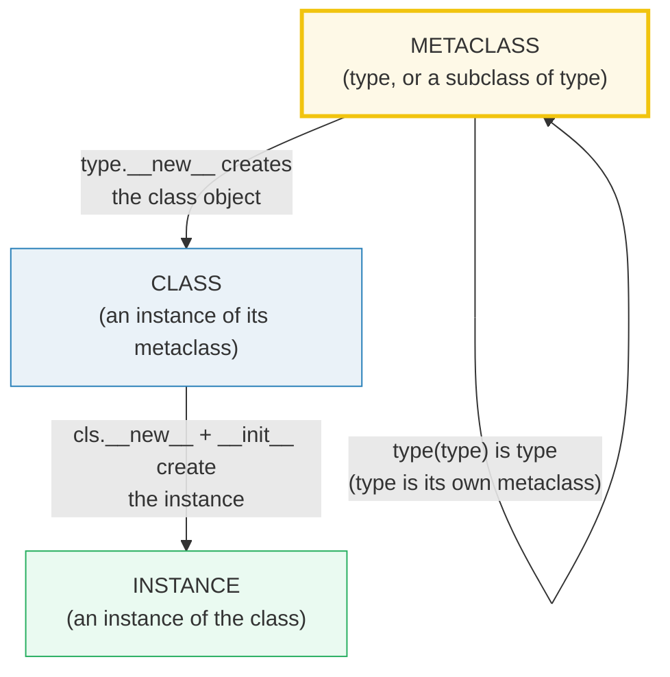
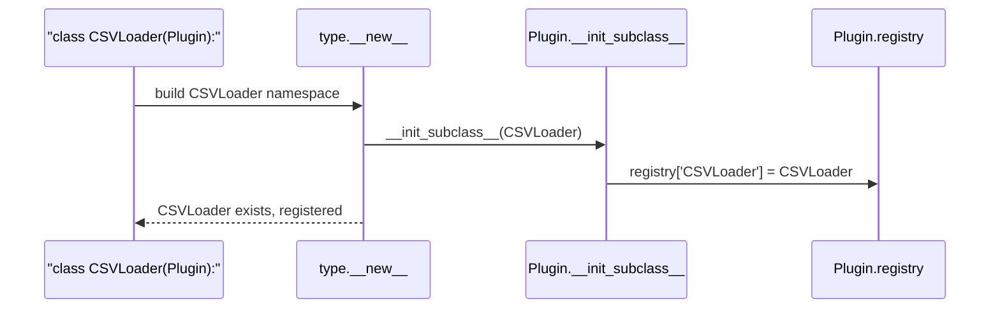
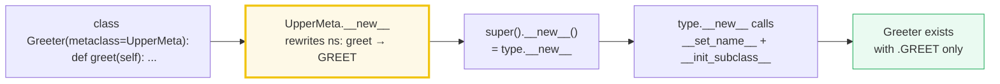
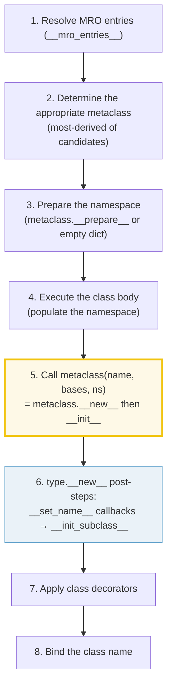

# Metaclasses — The Class of a Class, `type`, `__init_subclass__`, and When You Actually Need One

> **The one rule:** a metaclass is just the **class of a class**. `type` is the
> default metaclass — it builds classes the way classes build instances. For 90%
> of class-customization needs, `__init_subclass__` is the simple, sufficient
> hook; a real custom metaclass is reserved for rewriting the namespace, custom
> `__prepare__`, or `__instancecheck__`. If you think you need a metaclass, you
> probably need `__init_subclass__` instead.

**Companion code:** [`metaclasses.py`](./metaclasses.py).
**Every number and table below is printed by `uv run python
metaclasses.py`** — change the code, re-run, re-paste. Nothing here is
hand-computed. Captured stdout lives in
[`metaclasses_output.txt`](./metaclasses_output.txt).

**Goal of this bundle (lineage, old → new):**

> from *"metaclasses are dark magic"*
> → *"a metaclass is just the class of a class; `type` builds classes;
> `__init_subclass__` solves 90% of customization needs; you rarely need a real
> metaclass."*

🔗 This bundle sits at the top of the object-model phase. It leans on
[`INHERITANCE_MRO`](./INHERITANCE_MRO.md) (P2 #11) — the MRO is computed during
class creation, which is what a metaclass customizes. The `__set_name__` hook
(fired by `type.__new__`) only matters once you understand
[`DESCRIPTORS`](./DESCRIPTORS.md) (P2 #12). The `__class_getitem__` mechanism
(§5) is the runtime side of parametrized generics — the full typing story is
deferred to `TYPE_HINTS` (P3 #18). See [`TODO.md`](./TODO.md) for the full plan.

---

## 0. The three ideas on one page



| Question | Mechanism | When it runs |
|---|---|---|
| "What is the class of a class?" | `type(Foo)` → `type` (the default metaclass) | at any time |
| "Can I build a class at runtime?" | `type(name, bases, dict)` — the 3-arg form | whenever you call it |
| "Can the parent react to subclassing?" | `__init_subclass__(cls)` — the 90% solution | at **subclass definition** time |
| "Can I rewrite the namespace before the class exists?" | `class Meta(type): __new__(mcs, ...)` | at **class definition** time |
| "How does `list[int]` work without instantiating?" | `__class_getitem__` — a class-level `__getitem__` | at subscript time |

---

## 1. `type` is the metaclass; `type(name, bases, dict)` builds a class

Every class object is itself an **instance of its metaclass**. The default
metaclass is `type`, so `type(Foo) is type` for any normally-defined class —
including the builtins (`type(int) is type`). The remarkable fact:
`type(type) is type` — `type` is **its own metaclass**. This is the fixed point
at the top of Python's object model.

The `class` statement is syntactic sugar for the **3-argument form** of `type()`:
`type(name, bases, dict)`. The docs state this verbatim: *"With three arguments,
return a new type object. This is essentially a dynamic form of the `class`
statement."* The `name` becomes `__name__`, the `bases` tuple becomes
`__bases__` (with `object` added if empty), and the `dict` becomes the class
`__dict__`. The following two are identical:

```python
class X:
    a = 1
X = type('X', (), dict(a=1))
```

> From `metaclasses.py` Section A:
> ```
> ======================================================================
> SECTION A — type is the metaclass; type(name, bases, dict) builds a class
> ======================================================================
> Every class is an INSTANCE of its metaclass. The default metaclass
> is `type`, so `type(Foo) is type`. The 3-arg form type(name, bases,
> dict) is the dynamic form of the `class` statement — it builds a new
> class object at runtime from a name, a bases tuple, and a namespace.
> 
> expression                        result
> ----------------------------------------------------
> type(Foo)                         <class 'type'>
> type(Foo) is type                 True
> isinstance(Foo, type)             True
> type(int) is type                 True
> type(type) is type                True
> 
> Bar = type('Bar', (), {'a': 1})   # 3-arg type() builds a class
> 
> expression                    result
> ------------------------------------------------
> type(Bar) is type             True
> Bar.__name__                  'Bar'
> Bar.__bases__                 (<class 'object'>,)
> Bar.a                         1
> Bar().a                       1
> isinstance(Bar(), object)     True
> 
> [check] type(Foo) is type (the default metaclass): OK
> [check] type(type) is type (type is its own metaclass): OK
> [check] type('Bar', (), {'a': 1})().a == 1: OK
> [check] the 3-arg type() returns a class (instance of type): OK
> ```

### Why `type(type) is type` (internals)

In CPython, `type` is a C-level singleton (`PyId_type`). Its `ob_type` pointer
points at itself. This breaks the infinite regress: every object has a type,
every type has a metaclass, and `type` is the fixed point where the chain
stops. When the interpreter needs the metaclass of a class, it reads
`ob_type`; for `type` itself, that pointer is `type`. This is why `isinstance(Foo,
type)` is `True` — a class *is* an instance, and `type` is the class that
produces it.

🔗 The class-creation pipeline (determining the metaclass → preparing the
namespace → executing the body → calling the metaclass) is specified in
[§3.3.3 of the Data Model](https://docs.python.org/3/reference/datamodel.html#customizing-class-creation)
and is the subject of the rest of this guide.

---

## 2. `__init_subclass__` — the 90% solution (plugin registry)

> Whenever a class inherits from another class, `__init_subclass__()` is called
> on the **parent** class. — [Data Model §3.3.3](https://docs.python.org/3/reference/datamodel.html#object.__init_subclass__)

This is the hook that replaced most metaclass usage. It is called on the parent
whenever a subclass is **defined** (not instantiated). The `cls` argument is the
new subclass. The classic use case is an auto-populating **plugin registry**:
the parent declares an empty dict, and `__init_subclass__` inserts each subclass
by name — no registration call needed, no metaclass involved. `type(CSVLoader)`
is still `type`; the customization happened entirely through the parent's hook.



> From `metaclasses.py` Section B:
> ```
> ======================================================================
> SECTION B — __init_subclass__: the 90% solution (plugin registry)
> ======================================================================
> __init_subclass__ runs in the PARENT whenever a SUBCLASS is defined.
> It receives the new subclass as `cls`. This is the common, simple way
> to react to subclassing — and it replaces most metaclass use cases.
> 
> class Plugin:
>     registry = {}
>     def __init_subclass__(cls, **kwargs):
>         super().__init_subclass__(**kwargs)
>         Plugin.registry[cls.__name__] = cls
> 
> Defining subclasses now — the parent hook fires at definition time:
> 
> class CSVLoader(Plugin):  pass   # __init_subclass__ fires
> class JSONLoader(Plugin): pass   # __init_subclass__ fires
> 
> expression                                    result
> ----------------------------------------------------------------
> list(Plugin.registry)                         ['CSVLoader', 'JSONLoader']
> Plugin.registry['CSVLoader'] is CSVLoader     True
> Plugin.registry['JSONLoader'] is JSONLoader   True
> type(CSVLoader) is type                       True
> 
> [check] registry contains both subclasses after class defs: OK
> [check] registry maps names to the actual class objects: OK
> [check] no custom metaclass involved (type(CSVLoader) is type): OK
> ```

### Why `__init_subclass__` usually replaces metaclasses (internals)

When `type.__new__` finishes creating the class object, it performs three
customization steps in order (Data Model §3.3.3.6):

1. Collect all namespace attributes that define `__set_name__()` and call each.
2. Call `__init_subclass__()` on the **immediate parent** in the MRO.

PEP 487 (2017) introduced both `__init_subclass__` and `__set_name__`
specifically to eliminate the two most common metaclass use cases: "notify the
parent when subclassed" and "tell a descriptor the name it was assigned under."
After PEP 487, you only reach for a metaclass when you need to modify the
namespace **before** `type.__new__` runs, or customize `__instancecheck__`, or
provide a custom `__prepare__`.

**Expert gotcha:** always call `super().__init_subclass__(**kwargs)` so that
cooperative parents in the MRO get their turn — and strip the kwargs you
consume before forwarding the rest. The default `object.__init_subclass__`
**raises if it receives any arguments**, so forgetting `super()` with keyword
arguments is a common crash.

---

## 3. A custom metaclass rewrites the namespace at definition time

A metaclass is a **subclass of `type`**. Its `__new__` runs when a `class`
statement with `metaclass=...` executes — **not** when you instantiate the
class. This gives you the namespace dict **before** the class object is frozen,
so you can inject, rename, or remove attributes. Below, `UpperMeta` auto-
uppercases every non-dunder method name; after `class Greeter(metaclass=UpperMeta)`
is defined, the method `greet` is accessible only as `Greeter().GREET()`.



> From `metaclasses.py` Section C:
> ```
> ======================================================================
> SECTION C — A custom metaclass rewrites the namespace at definition time
> ======================================================================
> A metaclass is a subclass of `type`. Its __new__ runs when a `class`
> statement executes (NOT at instantiation) and may rewrite the class
> namespace before the class object is created. Here: auto-uppercase
> every non-dunder method name.
> 
> class UpperMeta(type):
>     def __new__(mcs, name, bases, ns):
>         # uppercase every non-dunder callable name
> 
>   UpperMeta.__new__ running for 'Greeter'; rewriting namespace
> 
> expression                        result
> ----------------------------------------------------
> type(Greeter).__name__            'UpperMeta'
> type(Greeter) is UpperMeta        True
> 'GREET' in Greeter.__dict__       True
> 'WAVE' in Greeter.__dict__        True
> 'greet' in Greeter.__dict__       False
> Greeter().GREET()                 'hi'
> 
> [check] Greeter's metaclass is UpperMeta: OK
> [check] method names were uppercased at definition time: OK
> [check] original lowercase names are gone: OK
> [check] the uppercased method still works: OK
> ```

### The class-creation lifecycle (internals)

When a `class` statement executes, the interpreter follows this pipeline (Data
Model §3.3.3.1–3.3.3.6):



Step 5 is where a custom metaclass's `__new__` runs — it receives the
populated namespace and can rewrite it before handing off to
`type.__new__`. Step 6 is where `__set_name__` and `__init_subclass__` fire
(**after** the class object exists), which is why `__init_subclass__` cannot
rename attributes the way a metaclass can — by then the namespace is frozen.

🔗 `__set_name__` is the bridge to [`DESCRIPTORS`](./DESCRIPTORS.md) (P2 #12):
it tells a descriptor the name it was assigned under, at class-creation time.
🔗 The MRO computed in step 1 is the subject of
[`INHERITANCE_MRO`](./INHERITANCE_MRO.md) (P2 #11).

---

## 4. `__new__` creates, `__init__` initializes (singleton + skip rule)

Both **classes** and **instances** follow the same two-step creation:
`__new__` creates and returns the object; `__init__` initializes it. The rule
that catches everyone off guard (Data Model §3.3.1):

> If `__new__()` returns an instance of `cls` or a subclass of `cls`, then
> `__init__()` will be invoked. If `__new__()` returns an instance of a
> **different** class, `__init__()` will **not** be invoked.

This has two consequences demonstrated below. **(a)** The singleton/cache trick:
`__new__` returns a cached same-class instance — but `__init__` **still runs**
on every call (here `init_calls == 2`), silently re-initializing the object.
This is the classic singleton bug. **(b)** `__new__` returns an instance of a
different class (`Other`) — `__init__` is **skipped entirely**
(`init_calls == 0`), which is how factory-pattern classes work.

> From `metaclasses.py` Section D:
> ```
> ======================================================================
> SECTION D — __new__ creates, __init__ initializes (singleton + skip rule)
> ======================================================================
> __new__ creates and returns the instance; __init__ initializes it.
> RULE: if __new__ returns an instance of a DIFFERENT class, __init__
> is NOT called. This enables the singleton/cache trick — but beware:
> a same-class singleton still re-runs __init__ on every call.
> 
> s1 = Singleton(); s2 = Singleton()   # same-class singleton
> 
> expression                result
> --------------------------------------------
> s1 is s2                  True
> Singleton.init_calls      2
> 
> [check] singleton returns the SAME object (s1 is s2): OK
> [check] BUT __init__ ran twice (init_calls == 2) — the gotcha: OK
> class Factory:
>     def __new__(cls): return Other()   # different class
> obj = Factory()
> 
> expression                    result
> ------------------------------------------------
> isinstance(obj, Factory)      False
> isinstance(obj, Other)        True
> Factory.init_calls            0
> 
> [check] Factory() returns an Other (not a Factory): OK
> [check] __init__ was SKIPPED (init_calls == 0): OK
> ```

### The singleton `__init__` re-run (internals, the gotcha)

When you call `Singleton()`, CPython calls `Singleton.__new__(Singleton)`; it
returns the cached instance. CPython then checks `isinstance(returned, cls)` —
it is, so it calls `Singleton.__init__(returned)`. On the **second** call the
same thing happens: `__new__` returns the same cached object, and `__init__`
runs **again**. The fix is an initialization guard:

```python
def __init__(self):
    if getattr(self, "_initialized", False):
        return
    self._initialized = True
    # ... real init ...
```

For the "different class" case: `Factory.__new__` returns an `Other()`, which is
not an instance of `Factory`, so CPython skips `Factory.__init__`. This is how
`__new__`-based factories and the `enum.Enum` metaclass produce instances of a
different concrete type than the class you called.

---

## 5. `__class_getitem__` — class-level parametrization (`Vec[int]`)

Subscripting a **class** with `SomeClass[arg]` calls the classmethod
`__class_getitem__`, not the instance method `__getitem__`. This is how
`list[int]` works without instantiating `list`. Per the Data Model §3.3.5,
`__class_getitem__` is **automatically a classmethod** — no `@classmethod`
decorator needed. The builtins return a `types.GenericAlias`; your own class can
return anything you like (here, a tuple recording the type argument).

> From `metaclasses.py` Section E:
> ```
> ======================================================================
> SECTION E — __class_getitem__: class-level parametrization (Vec[int])
> ======================================================================
> Writing `SomeClass[arg]` calls the CLASSMETHOD __class_getitem__,
> NOT __getitem__ (which is for instances). This is how list[int] works
> without instantiating list. It returns whatever you choose — the
> builtins return a GenericAlias; your class can return anything.
> 
> class Vec:
>     def __class_getitem__(cls, item):
>         return ('Vec', item)
> 
> expression                  result
> ----------------------------------------------
> Vec[int]                    ('Vec', <class 'int'>)
> Vec[str]                    ('Vec', <class 'str'>)
> type(Vec[int]).__name__     'tuple'
> 
> list[int]                              list[int]
> type(list[int]).__name__               'GenericAlias'
> isinstance(list[int], types.GenericAlias) True
> 
> [check] Vec[int] returns our custom tuple: OK
> [check] Vec[int] does NOT instantiate Vec: OK
> [check] list[int] is a GenericAlias (no instantiation): OK
> [check] __class_getitem__ is stored on the class (auto classmethod): OK
> ```

### `__class_getitem__` vs `__getitem__` (internals)

The subscription expression `obj[key]` normally calls `type(obj).__getitem__(obj,
key)`. But when `obj` is itself a **class**, the interpreter calls the class's
`__class_getitem__` instead (Data Model §3.3.5.2). So `list[int]` calls
`list.__class_getitem__(int)` (which returns a `GenericAlias`), while
`[1,2,3][0]` calls `list.__getitem__(instance, 0)`. The two protocols are
completely separate. PEP 460/560 wired this into the builtins so that type
annotations like `list[int]` work at runtime without importing `typing.List`.

🔗 The full story of generics, `typing.Generic`, and PEP 484 type hints is
deferred to `TYPE_HINTS` (P3 #18). This bundle only covers the **runtime**
mechanism by which subscripting a class is dispatched.

---

## 6. When do you ACTUALLY need a metaclass?

The decision is simpler than the reputation. **Try `__init_subclass__` first.**
A real metaclass is only needed when you must customize class creation **before
or around** `type.__new__` — `__prepare__` (a custom namespace), `__instancecheck__`
(custom `isinstance`), or modifying **all** classes in a library hierarchy at
the namespace level. The standard library's two flagship metaclasses,
`abc.ABCMeta` and `enum.EnumType`, exist because they need `__instancecheck__`
and namespace rewriting respectively — neither of which `__init_subclass__` can
do.

> From `metaclasses.py` Section F:
> ```
> ======================================================================
> SECTION F — When do you ACTUALLY need a metaclass?
> ======================================================================
> Rule of thumb: reach for __init_subclass__ first. A real metaclass
> is only needed when you must customize class creation BEFORE or
> AROUND type.__new__ — __prepare__, __instancecheck__, or modifying
> ALL classes in a hierarchy at the namespace level.
> 
> task                                  use                         note
> ------------------------------------------------------------------------------------------
> auto-register subclasses              __init_subclass__           simple hook in parent
> validate subclass kwargs              __init_subclass__           raise in the parent hook
> inject/rewrite methods at def time    metaclass __new__           UpperMeta (Section C)
> custom namespace (ordered, etc.)      metaclass __prepare__       PEP 3115; rare
> customize isinstance/issubclass       metaclass __instancecheck__ abc.ABCMeta
> enforce rules on EVERY class in a lib metaclass                   EnumMeta, ABCMeta
> 
> type(abc.ABC).__name__             'ABCMeta'
> type(enum.Enum).__name__           'EnumType'
> issubclass(type(abc.ABC), type)    True
> 
> [check] abc.ABC's metaclass is a subclass of type: OK
> [check] enum.Enum's metaclass is a subclass of type: OK
> ```

### Why `abc.ABCMeta` needs a metaclass (internals)

`abc.ABCMeta` implements `__instancecheck__` and `__subclasscheck__` so that
`isinstance([], collections.abc.Sequence)` returns `True` even though `list`
does not inherit from `Sequence` — these are **virtual base classes**. This
hook lives **on the metaclass**, not on the class itself (Data Model §3.3.4),
because `isinstance` looks up special methods on the type of the object — and
for a class, that type is its metaclass. `__init_subclass__` cannot provide
this; only a metaclass can.

---

## Pitfalls

| Trap | Example | The fix |
|---|---|---|
| Singleton via `__new__` re-runs `__init__` every call | `Singleton.init_calls == 2` after two calls | guard `__init__` with an `_initialized` flag |
| Forgetting `super().__init_subclass__(**kwargs)` | `object.__init_subclass__` raises on stray kwargs | always strip consumed kwargs, forward the rest |
| Using a metaclass when `__init_subclass__` suffices | registry / validation done in `Meta.__new__` | use the parent hook (§2); reserve metaclasses for namespace rewriting / `__prepare__` |
| Metaclass conflict in multiple inheritance | `class C(A, B)` where `type(A)` and `type(B)` are unrelated metaclasses | use a common base metaclass, or switch to `__init_subclass__` |
| `__class_getitem__` returning `None` / wrong type | breaks generic-alias expectations of static checkers | return a `GenericAlias` (inherit `typing.Generic`) for real generics |
| Confusing `__class_getitem__` with `__getitem__` | expecting `Vec[int]` to index an instance | `Cls[k]` → classmethod; `instance[k]` → instance method |
| Returning a non-`cls` instance from `__new__` silently skips `__init__` | factory pattern, `__init__` never runs | intentional for factories; document it, or don't override `__new__` |
| Editing the class namespace after `type.__new__` | `__init_subclass__` can't rename attrs (namespace is frozen) | rewrite in `Meta.__new__` **before** calling `super().__new__` |
| Forgetting to call `super().__new__(mcs, ...)` in a metaclass | breaks `__classcell__`, `super()`, `__set_name__` | always forward to `type.__new__` via `super()` |

---

## Cheat sheet

- **`type` is the default metaclass:** `type(Foo) is type`. `type(type) is type`
  (self-referential fixed point). `isinstance(Foo, type)` → `True`.
- **3-arg `type(name, bases, dict)`:** the dynamic form of `class`. Returns a
  new class; `Bar().a == 1` for `type('Bar', (), {'a': 1})`.
- **`__init_subclass__(cls, **kwargs)`:** runs on the **parent** when a subclass
  is **defined**. The 90% solution for registries, validation, plugin systems.
  Always `super().__init_subclass__(**kwargs)`.
- **Custom metaclass:** `class Meta(type): def __new__(mcs, name, bases, ns)`.
  Runs at **class definition** time (not instantiation). Can rewrite the
  namespace before `type.__new__` freezes it.
- **Class-creation order:** resolve MRO → determine metaclass → `__prepare__` →
  execute body → `metaclass(name, bases, ns)` → `__set_name__` →
  `__init_subclass__` → decorators → bind name.
- **`__new__` vs `__init__`:** `__new__` creates, `__init__` initializes. If
  `__new__` returns a non-`cls` instance, `__init__` is **skipped**. Same-class
  singleton: `__init__` runs every call (guard it).
- **`__class_getitem__`:** `Cls[arg]` calls the auto-classmethod, not
  `__getitem__`. `list[int]` returns a `GenericAlias`. No instantiation.
- **When you need a real metaclass:** namespace rewriting before `type.__new__`,
  `__prepare__`, `__instancecheck__`/`__subclasscheck__`, or enforcing rules on
  every class in a library (`ABCMeta`, `EnumType`). Otherwise use
  `__init_subclass__`.

---

## Sources

- **Python docs — Data Model §3.3.3: Customizing class creation.**
  https://docs.python.org/3/reference/datamodel.html#customizing-class-creation
  *The authoritative specification of `__init_subclass__`, `__set_name__`,
  metaclasses, `__prepare__`, determining the appropriate metaclass, and the
  class-creation pipeline (resolve MRO → determine metaclass → prepare namespace
  → execute body → create class object → `__set_name__` → `__init_subclass__`).
  Quoted in §1–§3 and §6.*
- **Python docs — Data Model §3.3.1: Basic customization (`object.__new__`).**
  https://docs.python.org/3/reference/datamodel.html#object.__new__
  *The rule that `__new__` creates the instance and `__init__` initializes it,
  and that `__init__` is skipped if `__new__` returns an instance of a different
  class. Quoted verbatim in §4.*
- **Python docs — Data Model §3.3.5: Emulating generic types (`__class_getitem__`).**
  https://docs.python.org/3/reference/datamodel.html#emulating-generic-types
  *`__class_getitem__` is automatically a classmethod; it returns an object
  representing the specialization; `__class_getitem__` vs `__getitem__`
  dispatch. Basis for §5.*
- **Python docs — Built-in Functions: `type()`.**
  https://docs.python.org/3/library/functions.html#type
  *"With three arguments, return a new type object. This is essentially a
  dynamic form of the class statement." The equivalence of `class X: a = 1` and
  `type('X', (), dict(a=1))`. Quoted in §1.*
- **Python docs — Data Model §3.3.4: Customizing instance and subclass checks.**
  https://docs.python.org/3/reference/datamodel.html#customizing-instance-and-subclass-checks
  *`__instancecheck__` and `__subclasscheck__` are looked up on the metaclass,
  not the class — the reason `abc.ABCMeta` must be a metaclass. Referenced in
  §6.*
- **PEP 487 — Simpler customisation of class creation (2017).**
  https://peps.python.org/pep-0487/
  *Introduced `__init_subclass__` and `__set_name__` to eliminate the two most
  common metaclass use cases. The basis for the "90% solution" claim in §2 and
  the decision table in §6.*
- **PEP 3115 — Metaclasses in Python 3000 (the `__prepare__` hook).**
  https://peps.python.org/pep-3115/
  *Introduced `__prepare__` for custom class namespaces (e.g. ordered dicts),
  the mechanism that only a real metaclass can provide. Referenced in §6.*
- **PEP 3119 — Introducing Abstract Base Classes.**
  https://peps.python.org/pep-3119/
  *The `abc.ABCMeta` metaclass and the `__instancecheck__`/`__subclasscheck__`
  protocol for virtual base classes. Referenced in §6.*
- **Stack Overflow — Understanding `__init_subclass__`.**
  https://stackoverflow.com/questions/45400284/understanding-init-subclass
  *Independent confirmation that `__init_subclass__` runs on the parent when a
  subclass is defined, and that it replaced the most common metaclass patterns.*
