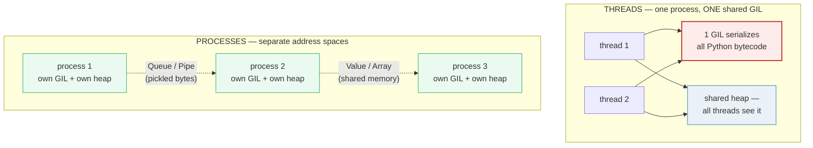
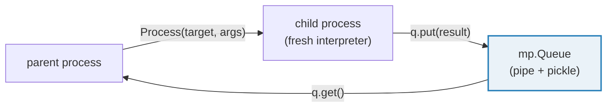
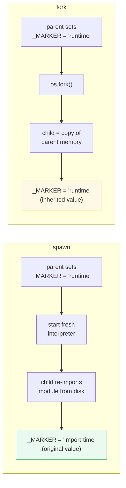
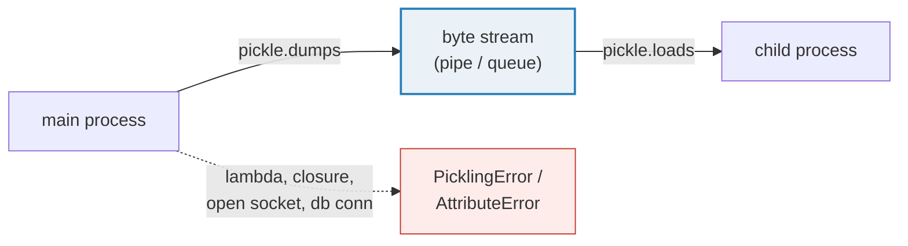

# Multiprocessing Basics — Processes, the GIL Escape Hatch, and Pickle

> **The one rule:** threads share one GIL, so CPU-bound Python never runs in
> true parallel. `multiprocessing` sidesteps the GIL by spawning **separate OS
> processes**, each with its own interpreter and its own GIL — real parallelism
> on multiple cores, at the cost of **no shared memory** (by default) and
> **picklable** arguments.

**Companion code:** [`multiprocessing_basics.py`](./multiprocessing_basics.py).
**Every number and table below is printed by `uv run python
multiprocessing_basics.py`** — change the code, re-run, re-paste. Nothing here
is hand-computed. Captured stdout lives in
[`multiprocessing_basics_output.txt`](./multiprocessing_basics_output.txt).

> **Note on pids:** process IDs and execution order vary between runs. The
> `[check]` asserts verify **results** (the sum, the count, the set of pids),
> never specific pid values or ordering. The output below is one committed
> snapshot; re-running yields different pids but identical check results.

**Goal of this bundle (lineage, old → new):**

> from *"the GIL blocks CPU parallelism in threads"*
> → *"multiprocessing sidesteps the GIL with separate OS processes that get
> true parallelism, at the cost of no shared memory and picklable args."*

🔗 [`THREADING_GIL`](./THREADING_GIL.md) (P3 #19) — the GIL is *why* you reach
for processes: threads serialize on CPU-bound work, so you need a separate
process per core to go fast. [`ASYNCIO`](./ASYNCIO.md) (P3 #21) is the
*I/O-bound* alternative — when you are waiting on network/disk, not burning
CPU, a single-threaded event loop beats a process pool.

---

## 0. The three ideas on one page



| Question | Threads | Processes |
|---|---|---|
| True CPU parallelism? | **No** — one GIL serializes bytecode | **Yes** — each has its own GIL |
| Shared memory by default? | **Yes** — same heap | **No** — separate address spaces |
| Startup cost | low (~µs) | high — full interpreter spawn (~ms) |
| Args/results | shared directly | must be **pickled** across the boundary |
| Best for | I/O-bound work | CPU-bound work |

---

## 1. Process basics — `start()` / `join()`, result via `Queue`

`multiprocessing.Process(target, args)` mirrors `threading.Thread`: you create
it, call `.start()` to launch a **new OS process**, and `.join()` to wait for
it. The critical difference from threads: a child's **return value does not
cross the process boundary**. To get data back you use a `Queue` (or `Pipe`),
which pickles the object on one side and unpickles it on the other.



> From `multiprocessing_basics.py` Section A:
> ```
> ======================================================================
> SECTION A — Process basics: start/join; result via Queue
> ======================================================================
> multiprocessing.Process(target, args) starts a NEW OS process.
> start() launches it; join() waits for it. A child's RETURN value
> does NOT cross the process boundary — use a Queue to get data back.
> 
> parent pid:   21847
> child pid:    21849
> child computed 7*7 = 49  (received via Queue)
> [check] worker ran and returned 7*7 == 49 via Queue: OK
> [check] child pid differs from parent pid: OK
> [check] process exited cleanly (exitcode == 0): OK
> ```

### Why the worker must be at module scope (internals)

On macOS and Windows the default start method is **`spawn`**: the child starts
a *fresh* Python interpreter and **re-imports** your module from scratch. If
your worker function is defined inside `main()` or inside another function,
the child cannot import it and dies with `AttributeError: Can't get local
object`. The fix: define every worker at **module top level** and guard the
launch with `if __name__ == "__main__":` so the child's re-import does not
re-run the launch (which would cause an infinite process explosion).

---

## 2. Real parallelism — N processes, distinct pids, correct sum

Each `Process` is a separate OS process scheduled by the kernel onto a
**separate core**. Four processes each summing 500 000 integers run on up to
four cores simultaneously — the combined result matches the serial sum. Each
process reports a **distinct pid** (OS process ID), proving they are real
processes, not coroutines pretending.

> From `multiprocessing_basics.py` Section B:
> ```
> ======================================================================
> SECTION B — Real parallelism: N processes, distinct pids, correct sum
> ======================================================================
> Each process is a separate OS process with its OWN Python interpreter
> and its OWN GIL. Four processes doing pure-Python CPU work run on up
> to four cores simultaneously — true parallelism, unlike threads.
> 
> serial sum of range(2000000):       1999999000000
> parallel sum (4 chunks of 500000):   1999999000000
> partial sums (sorted): [124999750000, 374999750000, 624999750000, 874999750000]
> distinct child pids: 4 of 4
> [check] parallel sum equals serial sum: OK
> [check] each process had a distinct pid: OK
> [check] no child pid equals parent pid: OK
> ```

### Why processes get real parallelism but threads do not (internals)

The GIL is a **per-interpreter** lock. A thread must hold it to execute Python
bytecode, so N threads in one process compete for *one* GIL — CPU-bound work
is serialized. N *processes* have N independent interprezers, each with its
own GIL, so the OS scheduler can run them on N cores at the same time. This is
the entire reason `multiprocessing` exists. The trade-off: spawning a process
costs a full interpreter startup (megabytes of memory, milliseconds of time),
far heavier than a thread.

---

## 3. `Pool.map` — parallel work, results in input order

`Pool(n)` manages a fixed set of worker processes. `pool.map(f, iterable)`
chunks the iterable, distributes chunks to workers, and collects results. The
return value is **always in input order** — `map([0..9])` returns
`[f(0), f(1), …, f(9)]` even though the work ran in parallel. For unordered
results (slightly faster, less memory) use `imap_unordered`.

> From `multiprocessing_basics.py` Section C:
> ```
> ======================================================================
> SECTION C — Pool.map: parallel work, results in input order
> ======================================================================
> Pool manages a set of worker processes. Pool.map(f, iterable)
> distributes work across the pool but returns results IN INPUT ORDER
> (unlike imap_unordered).
> 
> inputs:           [0, 1, 2, 3, 4, 5, 6, 7, 8, 9]
> Pool.map result:  [0, 1, 4, 9, 16, 25, 36, 49, 64, 81]
> serial listcomp:  [0, 1, 4, 9, 16, 25, 36, 49, 64, 81]
> [check] Pool.map results equal serial computation: OK
> [check] Pool.map preserves input order even though work is parallel: OK
> ```

### Why `Pool` is the default choice (internals)

Manual `Process` + `Queue` is tedious for "apply f to 10 000 items." `Pool`
handles chunking, dispatch, result collection, and worker recycling. It also
provides `apply_async` / `map_async` for non-blocking calls and `starmap` for
multi-argument functions. The higher-level
[`concurrent.futures.ProcessPoolExecutor`](https://docs.python.org/3/library/concurrent.futures.html#concurrent.futures.ProcessPoolExecutor)
offers the same power behind a uniform `submit`/`map` API shared with
`ThreadPoolExecutor`.

---

## 4. No shared memory by default — a child's global change is invisible

Each process has its **own address space**. A child that mutates a module
global changes *its copy only* — the parent never sees the change. Under
`spawn` the child re-imports the module (getting the original value); under
`fork` the child gets a copy-on-write snapshot of the parent's memory (changes
stay in the child). Either way, the parent's variable is untouched.

```mermaid
graph TB
    subgraph Parent["parent address space"]
        PG["_GLOBAL_COUNTER = 0"]
    end
    subgraph Child["child address space (copy)"]
        CG["_GLOBAL_COUNTER = 999<br/>(child's OWN copy)"]
    end
    PG -.->|"fork: copy-on-write<br/>spawn: re-import (stays 0)"| CG
    CG -.x|"NO write-back"| PG
    style PG fill:#eafaf1,stroke:#27ae60
    style CG fill:#fef9e7,stroke:#f1c40f
```

> From `multiprocessing_basics.py` Section D:
> ```
> ======================================================================
> SECTION D — No shared memory by default: child's global change is invisible
> ======================================================================
> Each process has its OWN address space. A child that mutates a module
> global changes ITS COPY only — the parent never sees the change.
> 
> _GLOBAL_COUNTER before child: 0
> _GLOBAL_COUNTER after child (child set its copy to 999): 0
> [check] parent still sees 0 (separate address space): OK
> [check] child exited cleanly (exitcode == 0): OK
> ```

### Why this surprises people (internals)

A thread can do `global x; x = 999` and every other thread sees it instantly —
they share the same heap. A process **cannot**: its memory is virtualized by
the OS. Under `fork` the child inherits a *copy-on-write* snapshot; modifying
it triggers a private copy, invisible to the parent. Under `spawn` the child
starts with a blank interpreter and re-imports the module from disk, so it sees
only the import-time value. If you need cross-process mutable state, you must
use **shared memory** (§5) or a **manager proxy**.

---

## 5. Shared `Value` / `Array` + `Lock` — a real cross-process counter

`mp.Value('i', 0)` allocates a ctypes integer in **shared memory** (an OS-level
mapped segment) so all processes see the *same* cell. But
`counter.value += 1` is a **read-modify-write** (load → add → store): between
the load and the store another process can read the stale value, causing a
**lost update**. The fix is the same as in threading: wrap the RMW in a
`Lock`. Four processes × 25 000 increments reach exactly 100 000 — no lost
updates.

> From `multiprocessing_basics.py` Section E:
> ```
> ======================================================================
> SECTION E — Shared Value + Lock: a real cross-process counter
> ======================================================================
> mp.Value wraps a ctypes value in SHARED MEMORY so all processes see
> the same cell. But counter.value += 1 is a read-MODIFY-write: you
> still need a Lock to avoid lost updates.
> 
> 4 processes x 25000 increments each -> expected total: 100000
> shared counter.value after: 100000
> [check] shared Value+Lock reaches expected total: OK
> ```

### Why a Lock is still needed even with shared memory (internals)

`Value`'s built-in lock protects individual `.value` get/set — but
`counter.value += 1` is *two* protected accesses with a gap between them:
`temp = counter.value` (lock-acquire/release), `temp += 1`,
`counter.value = temp` (lock-acquire/release). Two processes can both read the
same value, both increment, and both write back the same result — one increment
is lost. The `with lock:` block makes the entire RMW atomic. The same race
exists in `threading`; the GIL does not help because the bytecode-level
interruption point falls between `LOAD_ATTR` and `STORE_ATTR`.

🔗 For large numerical arrays, [`multiprocessing.shared_memory.SharedMemory`](https://docs.python.org/3/library/multiprocessing.shared_memory.html)
plus `numpy.ndarray` (backed by the shared buffer) is the zero-copy, MPI-style
approach. That is out of scope here but is the standard pattern for
data-parallel scientific computing.

---

## 6. Start methods — `spawn` (re-import) vs `fork` (copy parent)

Three start methods exist, selected via `mp.get_context(name)` or
`mp.set_start_method(name)`:

| Method | Mechanism | Default on | Safe with threads? | Startup |
|---|---|---|---|---|
| **`spawn`** | fresh interpreter; re-imports module; pickles args | macOS, Windows | yes | slow (~ms) |
| **`fork`** | `os.fork()`; copies parent's entire memory | (was Linux ≤ 3.13) | **no** — can deadlock/crash | fast |
| **`forkserver`** | helper server forks clean children | POSIX (Linux) since 3.14 | yes | medium |

> **Python 3.14 change (gh-84559):** `fork` is no longer the default on *any*
> platform. POSIX defaults moved to `forkserver` (fast like fork, but safe
> because the server is single-threaded). `spawn` remains the default on macOS
> and Windows. Code that needs `fork` must request it explicitly.



The script demonstrates the difference concretely: the parent sets a module
global at runtime, then launches one process via each context. The **spawn**
child re-imports the module and sees the *original* import-time value; the
**fork** child copies the parent's memory and sees the *runtime* value.

> From `multiprocessing_basics.py` Section F:
> ```
> ======================================================================
> SECTION F — Start methods: spawn (re-import) vs fork (copy parent)
> ======================================================================
> Three start methods exist. spawn starts a FRESH interpreter and
> re-imports the module (safe, pickles args, slower). fork calls
> os.fork() and copies the parent's memory (fast, POSIX only, unsafe
> with threads). forkserver uses a clean helper server.
> 
> available start methods: ['spawn', 'fork', 'forkserver']
> default on this platform: 'spawn'
> 
> spawn child saw _MARKER = 'import-time'  (re-imported module -> reset)
> fork child saw _MARKER  = 'set-by-parent-at-runtime'  (copied parent memory -> kept)
> [check] spawn child sees import-time value (re-import resets global): OK
> [check] fork child sees parent's runtime value (memory copy): OK
> ```

### Why `spawn` is the safe default (internals)

`fork` copies the parent *as-is*, including any **threads** it has started.
But the child only gets the main thread; the other threads vanish mid-operation,
leaving locks held, semaphores in inconsistent states, and C-library globals
corrupted (notably in macOS Frameworks and in OpenMP-using numerical libs).
Since Python 3.12, `os.fork()` on a multithreaded process raises a
`DeprecationWarning`; since 3.14 it is no longer the default anywhere. `spawn`
sidesteps all of this by starting clean — at the cost of re-importing the
module and pickling every argument.

---

## 7. The pickle requirement — lambdas cannot cross the boundary

Under `spawn` (and `forkserver`), every argument and the target function are
**serialized with `pickle`** to cross the OS pipe. `pickle` stores a function
by its **qualified name** (`module.qualname`) and re-imports it on the other
side. A `lambda` has the qualified name `<lambda>` — not findable in any module
— so it cannot be pickled. A nested closure (`def outer(): def inner(): …`)
fails for the same reason: pickle cannot reach a local object.



> From `multiprocessing_basics.py` Section G:
> ```
> ======================================================================
> SECTION G — The pickle requirement: lambdas cannot cross the boundary
> ======================================================================
> Every argument AND the target function must be picklable: spawn
> serializes them with pickle to ship them to the child. A lambda
> has no importable qualified name, so pickle cannot locate it.
> 
> Pool.map(lambda x: x*x, ...) raised: AttributeError
> [check] lambda to Pool fails (cannot cross process boundary): OK
> ```

The exact exception depends on where the lambda lives: a **module-level**
lambda raises `pickle.PicklingError` ("Can't pickle `<lambda>`"); a lambda
defined **inside a function** (as above) raises `AttributeError` ("Can't get
local object"). Either way, the work never reaches the worker. The fix: define
a named `def` at module scope and pass that instead.

---

## Pitfalls

| Trap | Example | The fix |
|---|---|---|
| Worker defined inside `main()` or a function | spawn child dies: `AttributeError: Can't get local object` | move every worker to **module top level**; guard launch with `if __name__ == "__main__":` |
| Forgetting `if __name__ == "__main__":` guard | child re-imports module → recursive process explosion on spawn | wrap all `Process`/`Pool` launches in the guard |
| Expecting a child's return value | `Process(target=f).start()` — return value is lost | use `Queue`, `Pipe`, `Value`, or `Pool.map` to get results back |
| Assuming processes share memory | child mutates a global → parent sees nothing | use `mp.Value`/`mp.Array` (shared memory) or `Manager` proxy |
| `counter.value += 1` without a Lock | lost updates → total < expected | wrap the read-modify-write in `with lock:` |
| Passing a lambda to `Pool.map` | `PicklingError` / `AttributeError` | define a named `def` at module scope |
| Passing unpicklable args (open file, db conn, socket) | `PicklingError` on dispatch | send only picklable data; open the resource *inside* the worker |
| Using `fork` with threads alive | deadlock / crash / `DeprecationWarning` (3.12+) | use `spawn` or `forkserver`; `fork` is no longer default since 3.14 |
| Deadlock on `Queue` + `Process.terminate()` | pipe corrupted, other workers hang | never `terminate` a process that holds a queue; drain and `join` instead |
| Too many processes → memory blowup | each process = full interpreter (~10–50 MB) | size the pool to `os.cpu_count()`, not to the task count |
| `Pool` inside a `Pool` (nested parallelism) | deadlock — inner pool waits for workers held by outer | flatten the work or use a single pool with larger chunk count |
| `fork`-context Lock passed to `spawn` process | `RuntimeError` — locks are context-specific | create locks and queues from the **same** `get_context()` |

---

## Cheat sheet

- **Why processes, not threads:** each process has its own GIL → N processes
  on N cores = **true CPU parallelism**. Threads share one GIL → serialized.
- **The API:** `Process(target, args).start()` / `.join()`;
  `Pool(n).map(f, iterable)`; `mp.Queue()` for results; `mp.Value`/`mp.Array`
  for shared memory; `mp.Lock` for atomic read-modify-write.
- **No shared memory by default:** each process has its own address space. A
  child's global mutation is invisible to the parent. Use `Value`/`Array` or a
  `Manager` proxy for shared state.
- **`Value`/`Array` + Lock:** shared memory gives a common cell, but
  `counter.value += 1` is a non-atomic RMW — always wrap it in `with lock:`.
- **Start methods:** `spawn` (macOS/Windows default — re-imports module,
  pickles args, safe) vs `fork` (POSIX — copies parent, fast, **unsafe with
  threads**, no longer default since 3.14) vs `forkserver` (POSIX default since
  3.14 — clean server forks children). Use `mp.get_context(name)` to pick.
- **Pickle requirement:** every arg and the target function must be picklable.
  Lambdas, closures, open files, and sockets **fail**. Define workers as named
  module-level `def`s.
- **Spawn-safe pattern:** workers at module scope; all launches inside
  `if __name__ == "__main__":`.
- **Cost:** processes are heavy (~MB each, ms startup). CPU-bound → processes;
  I/O-bound → threads or asyncio (🔗 lighter weight, no pickling needed).

---

## Sources

- **Python docs — `multiprocessing`: Process-based parallelism.**
  https://docs.python.org/3/library/multiprocessing.html
  *The authoritative reference for `Process`, `Pool`, `Queue`, `Pipe`,
  `Value`/`Array`, synchronization primitives, and the "Contexts and start
  methods" section. The intro states multiprocessing "effectively side-steps
  the Global Interpreter Lock by using subprocesses instead of threads." Quoted
  in §§1–5.*
- **Python docs — Contexts and start methods (spawn / fork / forkserver).**
  https://docs.python.org/3/library/multiprocessing.html#contexts-and-start-methods
  *Defines the three start methods; documents that `spawn` is "The default on
  Windows and macOS," `fork` is "Available on POSIX systems" (no longer default
  since 3.14), and `forkserver` is "The default on [POSIX]" since 3.14
  (gh-84559). Basis for §6.*
- **Python docs — `multiprocessing.shared_memory`: Shared memory for direct
  access across processes.**
  https://docs.python.org/3/library/multiprocessing.shared_memory.html
  *The `SharedMemory` class for zero-copy cross-process buffers (used with
  numpy). Referenced in the §5 forward-link.*
- **Python docs — Programming guidelines: The spawn and forkserver start
  methods.**
  https://docs.python.org/3/library/multiprocessing.html#the-spawn-and-forkserver-start-methods
  *The `if __name__ == "__main__":` requirement and picklability rules.
  Explains why REPL-defined functions fail. Basis for §§1, 7.*
- **Python docs — `pickle`: Python object serialization.**
  https://docs.python.org/3/library/pickle.html
  *"Functions are pickled by qualified name, not by value." The reason lambdas
  and closures cannot be pickled. Basis for §7.*
- **Python docs — `os.fork()`.**
  https://docs.python.org/3/library/os.html#os.fork
  *The `Changed in version 3.12` note: forking a multithreaded process raises
  `DeprecationWarning`. Referenced in the §6 "why spawn is safe" note.*
- **CPython issue gh-84559 — Default start method change in 3.14.**
  https://github.com/python/cpython/issues/84559
  *"On POSIX platforms the default start method was changed from fork to
  forkserver to retain the performance but avoid common multithreaded process
  incompatibilities." Quoted in §6.*
- **PEP 371 — Addition of the multiprocessing package (2008).**
  https://peps.python.org/pep-0371/
  *The proposal that added `multiprocessing` to the stdlib (Python 2.6 / 3.0),
  motivated by the GIL limiting threads to a single core.*
