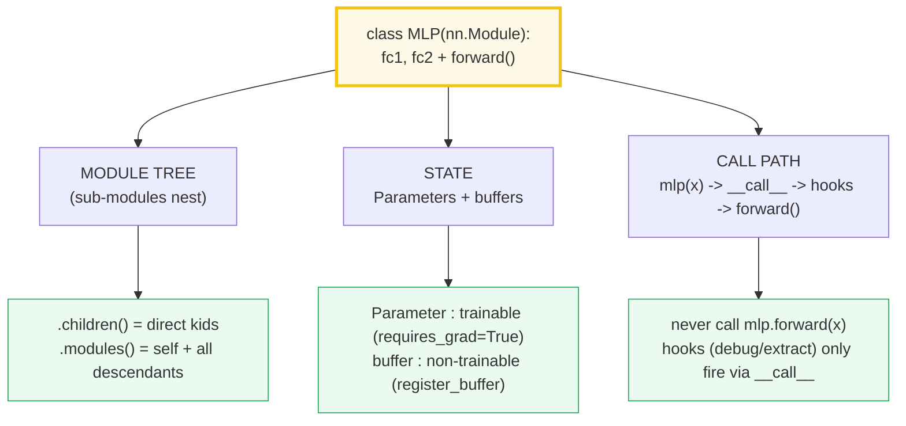
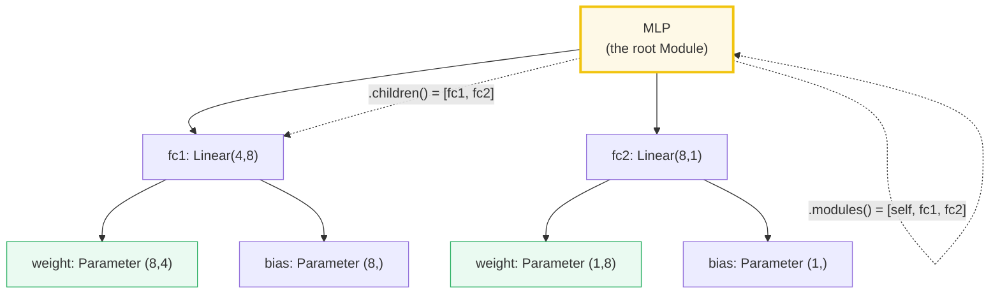
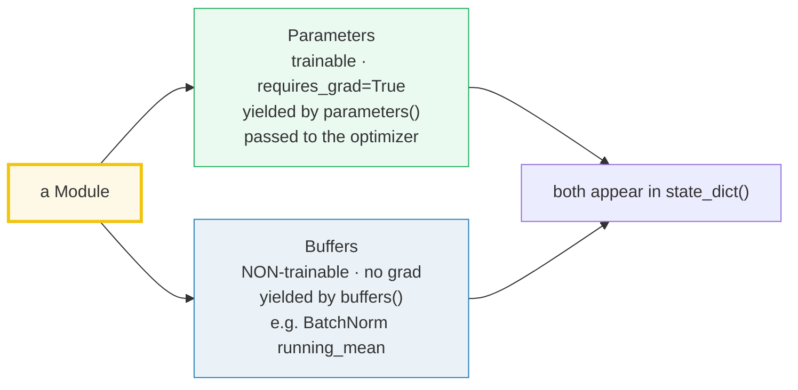

# nn.Module — The Composable Unit of PyTorch (Parameters, Buffers, the Tree, `__call__`)

> **The one rule:** in PyTorch a *model* is a tree of `nn.Module` objects. Each
> module **holds Parameters** (trainable tensors), **buffers** (non-trainable
> state), and **sub-modules** (other `nn.Module`s). You never call `.forward()`
> directly — you *call the module* `mlp(x)`, which routes through `__call__` so
> hooks fire. `train()/eval()` and `.to()` flip and move the *whole tree* at
> once. Get this and every layer, optimizer, and checkpoint just works.

**Companion code:** [`nn_module.py`](./nn_module.py).
**Every number and table below is printed by `uv run python nn_module.py`** —
change the code, re-run, re-paste. Nothing here is hand-computed. Captured
stdout lives in [`nn_module_output.txt`](./nn_module_output.txt).

**Goal of this bundle (lineage, old → new):**

> from *"a model is a function I call on a tensor"*
> → *"I understand `nn.Module` is the composable unit: it holds Parameters
> (trainable) + buffers (not) + sub-modules, builds a tree, and `forward()` runs
> via `__call__` so hooks fire; `train()/eval()` and `.to()` manage state."*

🔗 This is bundle **#31 of Phase 5** (the PyTorch phase). The parameters here
have `requires_grad=True` because they are destined for the autograd engine —
see [`AUTOGRAD`](./AUTOGRAD.md) (#30). The `state_dict()` keys shown in §4 are
exactly what [`TRAINING_LOOP`](./TRAINING_LOOP.md) (#33) saves and loads each
epoch. `.to(device)` generalizes to multi-GPU work in
[`GPU_DISTRIBUTED`](./GPU_DISTRIBUTED.md) (#34). The whole Module tree is just
the object model from [`CLASSES_BASICS`](./CLASSES_BASICS.md) (#9) — assignment
into `__dict__`, attribute lookup, composition — applied to tensors. See
[`TODO.md`](./TODO.md) for the full plan.

---

## 0. The three ideas on one page



| Question | API | What it does |
|---|---|---|
| "What is trainable?" | `parameters()` / `named_parameters()` | yields every `nn.Parameter` recursively (passed to the optimizer) |
| "What is state?" | `state_dict()` | an `OrderedDict` of all params **+ persistent buffers**, keyed by dotted path |
| "What composes?" | `.children()` / `.modules()` / `.named_modules()` | the sub-module tree (modules holding modules) |
| "How do I run it?" | `mlp(x)` (the `__call__`) | runs pre-hooks → `forward()` → post-hooks |
| "How do I switch mode?" | `mlp.train()` / `mlp.eval()` | flips `self.training` recursively (Dropout/BatchNorm obey) |

---

## 1. `nn.Module` subclass — `Linear` layers + a `forward()` pass

The [docs](https://docs.pytorch.org/docs/stable/generated/torch.nn.Module.html)
are unambiguous: *"Base class for all neural network modules. Your models
should also subclass this class."* You subclass `nn.Module`, call
`super().__init__()`, assign your layers (`nn.Linear`, `nn.Conv2d`, …) as
attributes, and define `forward()`. Calling the instance (`mlp(x)`) runs the
forward pass. Note the docs' one hard rule: *"an `__init__()` call to the parent
class must be made before assignment on the child"* — `super().__init__()`
first, then `self.fc1 = ...`.

> From `nn_module.py` Section A:
> ```
> ======================================================================
> SECTION A — nn.Module subclass: Linear layers + a forward() pass
> ======================================================================
> An nn.Module subclass holds its layers as attributes and defines
> forward(). Instantiating the subclass builds the object; calling it
> runs forward(). The base class is nn.Module itself.
> 
> isinstance(mlp, nn.Module)        True
> type(mlp).__name__                'MLP'
> type(mlp).__mro__                 (<class '__main__.MLP'>, <class 'torch.nn.modules.module.Module'>, <class 'object'>)
> isinstance(mlp.fc1, nn.Linear)    True
> repr(mlp):
> MLP(
>   (fc1): Linear(in_features=4, out_features=8, bias=True)
>   (fc2): Linear(in_features=8, out_features=1, bias=True)
> )
> 
> x = torch.arange(4)               [0.0, 1.0, 2.0, 3.0]
> out = mlp(x)                      [-0.46061691641807556]
> tuple(out.shape)                  (1,)
> 
> [check] mlp is an nn.Module: OK
> [check] mlp's MRO is MLP -> Module -> object: OK
> [check] fc1 is an nn.Linear (a Module subclass): OK
> [check] mlp(x) output shape is (1,) for a (4,) input: OK
> ```

### Why a `Linear` weight has shape `(8, 4)` not `(4, 8)` (internals)

`nn.Linear(in_features=4, out_features=8)` computes `y = x @ W^T + b`. It stores
`weight` as `(out_features, in_features)` = `(8, 4)` so the matmul is a single
transpose-free `x @ W.T`. A 1-D input of shape `(4,)` flows `fc1 → (8,) →
fc2 → (1,)`, so the output is shape `(1,)` (Linear always operates on the *last*
dimension). The MRO confirms the inheritance: `MLP → torch.nn.modules.module.Module
→ object` — every model is an ordinary Python class whose base happens to carry
the registration machinery.

🔗 The class machinery underneath (attribute assignment into `__dict__`, MRO
lookup) is exactly [`CLASSES_BASICS`](./CLASSES_BASICS.md) (#9). `nn.Module`
just *automates* part of `__setattr__` to recognize Parameters/sub-modules.

---

## 2. Parameters auto-register — `requires_grad=True`

The [Parameter docs](https://docs.pytorch.org/docs/stable/generated/torch.nn.parameter.Parameter.html):
*"A kind of Tensor that is to be considered a module parameter. Parameters are
Tensor subclasses, that have a very special property when used with `Module`s —
when they're assigned as Module attributes they are automatically added to the
list of its parameters, and will appear e.g. in `parameters()` iterator.
Assigning a Tensor doesn't have such effect."* Their default is
`requires_grad=True`, and notably *"the `torch.no_grad()` context does NOT affect
the default behavior of Parameter creation."*

> From `nn_module.py` Section B:
> ```
> ======================================================================
> SECTION B — Parameters auto-register: requires_grad=True
> ======================================================================
> nn.Linear's .weight and .bias are nn.Parameter objects (a Tensor
> subclass). Assigning a Parameter as a Module attribute automatically
> adds it to parameters(); assigning a plain Tensor does NOT.
> 
> type(mlp.fc1.weight).__name__           'Parameter'
> isinstance(mlp.fc1.weight, nn.Parameter)True
> mlp.fc1.weight.requires_grad            True
> mlp.fc1.bias.requires_grad              True
> tuple(mlp.fc1.weight.shape)             (8, 4)
> tuple(mlp.fc1.bias.shape)               (8,)
> 
> len(list(mlp.parameters()))             4
> named_parameters() keys                 ['fc1.weight', 'fc1.bias', 'fc2.weight', 'fc2.bias']
> 
> mlp.tmp = torch.zeros(3)   # plain Tensor, not a Parameter
> 
> len(list(mlp.parameters())) after       4
> "tmp" in named_parameters()             False
> 
> [check] fc1.weight is an nn.Parameter: OK
> [check] fc1.weight.requires_grad is True: OK
> [check] fc1.bias.requires_grad is True: OK
> [check] fc1.weight has shape (8, 4) [out, in]: OK
> [check] parameters() has 4 tensors (2 layers x weight+bias): OK
> [check] a plain Tensor attribute is NOT registered: OK
> ```

### Why assignment auto-registers — `nn.Module.__setattr__` (internals)

`nn.Module` overrides `__setattr__`. When you write `self.fc1 = nn.Linear(...)`,
the override sees an `nn.Module` value and files it under `self._modules`. When
you write `self.weight = nn.Parameter(...)`, it files it under
`self._parameters`. A plain `torch.Tensor` lands in the ordinary instance
`__dict__` — which is *exactly* why `mlp.tmp = torch.zeros(3)` does **not**
appear in `parameters()`. This is deliberate: you can stash transient tensors
(an RNN's last hidden state, a cache) on a module without poisoning the
optimizer. If you want a non-trainable tensor that *does* travel with the model,
use `register_buffer` (§6).

🔗 `requires_grad=True` is the handshake with the autograd engine — the full
reverse-mode story is [`AUTOGRAD`](./AUTOGRAD.md) (#30).

---

## 3. The sub-module tree — `children` / `modules` / `named_modules`



The [Module docs](https://docs.pytorch.org/docs/stable/generated/torch.nn.Module.html):
*"Modules can also contain other Modules, allowing them to be nested in a tree
structure… Submodules assigned in this way will be registered, and will also
have their parameters converted when you call `to()`, etc."* Three iterators
walk that tree at different depths:

- `.children()` — **direct** children only (here `fc1`, `fc2`; count 2).
- `.modules()` — **self + all** descendants recursively (count 3).
- `.named_modules()` — same as `.modules()` but yields `(name, module)` tuples;
  the root's name is the **empty string `''`** (this is why `state_dict` and
  `get_submodule` use dotted paths starting from `''`).

> From `nn_module.py` Section C:
> ```
> ======================================================================
> SECTION C — The sub-module tree: children / modules / named_modules
> ======================================================================
> Assigning self.fc1 = nn.Linear(...) auto-registers fc1 as a CHILD
> module. .children() yields direct children; .modules() yields self
> plus all descendants; .named_modules() adds the dotted-path name.
> 
> named_children() names          ['fc1', 'fc2']
> children() types                ['Linear', 'Linear']
> len(list(children()))           2
> named_modules() names           ['', 'fc1', 'fc2']
> len(list(modules()))            3
> 
> [check] MLP has 2 direct children (fc1, fc2): OK
> [check] named_children() == ['fc1', 'fc2']: OK
> [check] modules() includes self + 2 children = 3: OK
> [check] named_modules() root key is '' (self): OK
> ```

**Expert gotcha:** `modules()` (and `named_modules()`) **deduplicate** by default
— if the same sub-module instance is assigned in two places, it is yielded only
once. `nn.Sequential(l, l)` with one shared `l` returns `l` a single time. This
matters when you build weight-tied models.

---

## 4. `state_dict()` — the `OrderedDict` of params + persistent buffers

`state_dict()` is the serialization surface. From the
[docs](https://docs.pytorch.org/docs/stable/generated/torch.nn.Module.html):
*"Return a dictionary containing references to the whole state of the module.
Both parameters and persistent buffers (e.g. running averages) are included.
Keys are corresponding parameter and buffer names."* The keys are the **dotted
paths** you saw in §3 (`'fc1.weight'`, `'fc1.bias'`, …). This is precisely what
`torch.save(model.state_dict(), path)` writes and
`model.load_state_dict(torch.load(path))` reads back.

> From `nn_module.py` Section D:
> ```
> ======================================================================
> SECTION D — state_dict(): params + persistent buffers keyed by path
> ======================================================================
> state_dict() returns a dict of all PARAMETERS + persistent BUFFERS,
> keyed by dotted path. This is exactly what torch.save /
> load_state_dict serialize. Values are detached (requires_grad off).
> 
> type(sd).__name__                 'OrderedDict'
> isinstance(sd, dict)              True
> list(sd.keys())                   ['fc1.weight', 'fc1.bias', 'fc2.weight', 'fc2.bias']
> len(sd)                           4
> tuple(sd["fc1.weight"].shape)     (8, 4)
> sd["fc1.weight"].requires_grad    False
> 
> [check] state_dict is a dict: OK
> [check] 'fc1.weight' is a key: OK
> [check] state_dict has 4 entries: OK
> [check] keys == ['fc1.weight','fc1.bias','fc2.weight','fc2.bias']: OK
> [check] state_dict values are detached (requires_grad False): OK
> ```

### Why `state_dict` values are detached (internals)

By default `state_dict()` detaches every tensor — the stored `requires_grad` is
`False` even though the live `Parameter` has `requires_grad=True`. Detaching
breaks the autograd graph at the save boundary (you don't want to backprop
through a checkpoint load). Pass `keep_vars=True` to keep the grad tracking; and
note the returned object is a **shallow copy** — the tensors themselves are the
same storage as the live parameters (mutating one mutates the other until you
clone). The type is `OrderedDict`, so the key order is stable and reproducible —
a property `load_state_dict(strict=True)` relies on.

🔗 Saving/loading this dict each epoch is the checkpoint half of
[`TRAINING_LOOP`](./TRAINING_LOOP.md) (#33).

---

## 5. `forward()` runs via `__call__` — hooks fire only through `__call__`

This is the single most-cited PyTorch rule. The
[docs](https://docs.pytorch.org/docs/stable/generated/torch.nn.Module.html) on
`forward()`: *"one should call the Module instance afterwards instead of this
since the former takes care of running the registered hooks while the latter
silently ignores them."* In other words `mlp(x)` routes through
`Module.__call__`, which runs any registered **forward pre-hooks**, then
`forward()`, then **forward hooks**. Calling `mlp.forward(x)` *bypasses all of
that* — `forward()` is just a plain method. Below, a hook registered on `mlp`
fires once for `mlp(x)` and *not* for the subsequent `mlp.forward(x)`:

> From `nn_module.py` Section E:
> ```
> ======================================================================
> SECTION E — forward() runs via __call__: hooks fire only through __call__
> ======================================================================
> mlp(x) invokes Module.__call__, which runs forward hooks then
> forward(). mlp.forward(x) calls forward() DIRECTLY and skips the
> module's own hooks. Always use mlp(x), never mlp.forward(x).
> 
> len(records) after mlp(x)                 1
> tuple(records[0].shape)                   (1,)
> len(records) after mlp.forward(x)         1
> torch.equal(out_call, out_direct)         True
> 
> [check] hook fired once on mlp(x) via __call__: OK
> [check] hook recorded the (1,) output: OK
> [check] mlp.forward(x) did NOT fire the hook again (still 1): OK
> [check] both call forms give identical output: OK
> ```

### Why you must use `mlp(x)` — the `__call__` wrapper (internals)

`Module.__call__` is the seam where PyTorch inserts instrumentation: forward
hooks (feature extraction, activation logging), forward pre-hooks (input
inspection/modification), and — when you later backprop — backward hooks. If you
call `.forward()` directly you silently disable all of that, and your hooks will
"mysteriously" never fire. The two call forms give **identical numeric output**
(`torch.equal(...)` is `True`), which is exactly why the bug is invisible until
you try to attach a hook. **Always write `out = model(x)`, never
`out = model.forward(x)`.**

---

## 6. `register_buffer` — non-trainable tensors in the module state



Not every tensor attached to a module should be learned. `BatchNorm`'s
`running_mean`/`running_var` are statistics *updated* during the forward pass,
not *optimized* by gradient descent. The
[docs](https://docs.pytorch.org/docs/stable/generated/torch.nn.Module.html) on
`register_buffer`: *"Add a buffer to the module… a buffer that should not be
considered a model parameter. For example, BatchNorm's running_mean is not a
parameter, but is part of the module's state. Buffers, by default, are
persistent and will be saved alongside parameters."* A buffer is therefore: in
`state_dict()`, moved by `.to()`, but **absent from `parameters()`** and has
`requires_grad=False`.

> From `nn_module.py` Section F:
> ```
> ======================================================================
> SECTION F — register_buffer: non-trainable tensors in the module state
> ======================================================================
> register_buffer() stores a tensor that is part of the module's state
> (so it is saved/moved with .to()) but is NOT a parameter (no grad).
> BatchNorm's running_mean/running_var are the canonical example.
> 
> type(m.mu).__name__               'Tensor'
> isinstance(m.mu, nn.Parameter)    False
> m.mu.requires_grad                False
> len(list(m.parameters()))         2
> named_buffers() names             ['mu']
> "mu" in m.state_dict()            True
> 
> [check] the buffer is a Tensor, not a Parameter: OK
> [check] buffer.requires_grad is False: OK
> [check] buffer is NOT in parameters() (only fc.weight, fc.bias = 2): OK
> [check] buffer IS in state_dict(): OK
> ```

**Expert gotcha:** `register_buffer(..., persistent=False)` keeps the tensor in
the module (and in `buffers()`/moved by `.to()`) but **excludes it from
`state_dict()`**. Use that for ephemeral state you don't want to checkpoint
(e.g. a transient attention cache). Note the type is plain `Tensor`, *not*
`nn.Parameter` — that's the whole point: it dodges the optimizer.

---

## 7. `train()` / `eval()` — toggling `self.training`

Every module carries a boolean `self.training` (documented as the module's
*"training (bool) — whether this module is in training or evaluation mode"*).
`train(mode=True)` and `eval()` (which the
[docs](https://docs.pytorch.org/docs/stable/generated/torch.nn.Module.html)
define as *"equivalent with `self.train(False)`"*) set the flag **recursively**
across the whole tree. The flag itself does nothing to weights — but specific
layers read it: `Dropout` zeroes/scales in train mode and is the **identity** in
eval mode; `BatchNorm` uses batch stats in train and running stats in eval. The
demo below runs `nn.Dropout(p=0.5)` on a tensor of ones: train output has zeros
(and the survivors scaled up by `1/(1-p)=2`), eval output equals the input.

> From `nn_module.py` Section G:
> ```
> ======================================================================
> SECTION G — train()/eval(): toggling self.training changes Dropout
> ======================================================================
> Every Module carries a `training` flag (True by default). train()/
> eval() flip it recursively across the tree. Dropout multiplies/
> zeroes in train mode but is the identity in eval mode — same
> weights, different behavior.
> 
> mlp.training (default)                True
> mlp.training after .eval()            False
> mlp.training after .train()           True
> 
> nn.Dropout(p=0.5) applied to ones(2, 8):
>   train-mode output (some zeroed)     [[0.0, 0.0, 2.0, 0.0, 0.0, 0.0, 2.0, 2.0], [0.0, 2.0, 2.0, 2.0, 2.0, 0.0, 2.0, 2.0]]
>   eval-mode output (identity)         [[1.0, 1.0, 1.0, 1.0, 1.0, 1.0, 1.0, 1.0], [1.0, 1.0, 1.0, 1.0, 1.0, 1.0, 1.0, 1.0]]
> (out_train == 0).any()                True
> torch.equal(out_eval, ones)           True
> 
> [check] default mlp.training is True: OK
> [check] eval() flips training to False: OK
> [check] train() flips training back to True: OK
> [check] Dropout zeroes some entries in train mode: OK
> [check] Dropout is the identity in eval mode: OK
> ```

**Expert gotcha:** forgetting `model.eval()` before inference/validation is the
#1 silent-eval bug — validation loss looks fine but the Dropout/BatchNorm
statistics are wrong, and BatchNorm in particular will poison its running stats
with your validation batch. `eval()` does **not** turn off gradient tracking;
for that you additionally wrap inference in `with torch.no_grad():` (or
`torch.inference_mode()`). They are orthogonal: `.eval()` changes *layer
behavior*; `no_grad()` changes the *autograd graph*.

---

## 8. `.to(dtype)` / `.to(device)` — cast & move the whole tree

`.to()` is the one-call way to relocate or recast a model. The
[docs](https://docs.pytorch.org/docs/stable/generated/torch.nn.Module.html):
*"Move and/or cast the parameters and buffers."* It walks the tree, applies the
dtype/device change to every Parameter and buffer, and **returns `self`**
(modifying in place). So you typically write `model = MLP().to(device,
torch.float64)`. The cast below changes every weight from `float32` to
`float64`; the device report shows CUDA is unavailable here and Apple's MPS
backend is present (this machine) — but the run stays on CPU, so the device is
`'cpu'`.

> From `nn_module.py` Section H:
> ```
> ======================================================================
> SECTION H — .to(dtype) / .to(device): cast & move the whole tree
> ======================================================================
> .to() moves/casts ALL parameters and buffers recursively, in place
> (it returns self). .to(torch.float64) casts dtype; .to('cuda')/'mps'
> moves device. Below: dtype cast (CPU, deterministic) + device report.
> 
> fc1.weight.dtype before .to(float64)        torch.float32
> fc1.weight.dtype after  .to(float64)        torch.float64
> fc2.bias.dtype after                        torch.float64
> str(fc1.weight.device)                      cpu
> torch.cuda.is_available()                   False
> torch.backends.mps.is_available()           True
> 
> [check] default dtype is float32: OK
> [check] .to(float64) cast fc1.weight: OK
> [check] fc2.bias also cast to float64 (whole tree): OK
> [check] params live on CPU by default: OK
> ```

**Expert gotcha:** `.to('cuda')` makes the parameters **different objects**
(the docs warn: *"This also makes associated parameters and buffers different
objects. So it should be called before constructing the optimizer"*). Build the
optimizer **after** `.to(device)`, or `optimizer = SGD(model.parameters(), ...)`
will hold stale CPU references and silently update nothing on the GPU. The
convenience shortcuts `.cuda()`, `.cpu()`, `.half()`, `.float()`, `.double()`,
`.bfloat16()` all delegate to `.to()`.

🔗 `.to('cuda')` and beyond is the entry point to
[`GPU_DISTRIBUTED`](./GPU_DISTRIBUTED.md) (#34) — DataParallel / DDP build on
exactly this per-device move.

---

## Pitfalls

| Trap | Example | The fix |
|---|---|---|
| Calling `.forward()` instead of the module | `mlp.forward(x)` — runs but **skips all hooks** | always `out = mlp(x)`; reserve `.forward` for overriding inside a subclass |
| Forgetting `super().__init__()` before assigning submodules | `self.fc1 = ...` before `super().__init__()` → submodules **not registered** | first line of `__init__`: `super().__init__()` |
| Stashing a plain `Tensor` and expecting it in the optimizer | `self.cache = h` is *not* a Parameter | use `nn.Parameter(...)` to train it; `register_buffer` to carry it without grads |
| Building the optimizer **before** `.to(device)` | optimizer holds CPU params; GPU copy updates nothing | `model.to(device)` *then* `opt = SGD(model.parameters(), lr)` |
| Forgetting `model.eval()` before validation | Dropout still active / BatchNorm uses batch stats | `model.eval()` (and back to `.train()` before the next train epoch) |
| Assuming `eval()` disables gradients | `.eval()` flips `self.training` only; autograd still records | also wrap inference in `with torch.no_grad():` |
| Expecting a buffer to be optimized | `register_buffer` tensors have `requires_grad=False` | put learnable state in `nn.Parameter`; buffers are for statistics |
| Modifying `state_dict()` values thinking they're private | it's a **shallow copy** — same storage as live params | `clone()` any tensor you want to mutate independently |
| Weight-tied modules & dedup surprise | `nn.Sequential(l, l)` yields `l` once from `modules()` | intentional dedup; iterate manually if you need both slots |
| `Parameter(requires_grad=...)` inside `torch.no_grad()` | still defaults to `requires_grad=True` | explicitly pass `requires_grad=False`, or use `requires_grad_()` |

---

## Cheat sheet

- **`nn.Module`** is the base class for all layers/models. Subclass it,
  `super().__init__()`, assign sub-modules as attributes, define `forward()`.
- **`Parameter`** (`requires_grad=True` by default): assigned as an attribute →
  auto-added to `parameters()`. A plain `Tensor` attribute is **not** registered.
- **The tree:** `.children()` = direct kids; `.modules()` = self + all
  descendants (deduplicated); `.named_modules()` adds dotted-path names (root is
  `''`). Sub-modules auto-register via the `__setattr__` override.
- **`parameters()` / `named_parameters()`**: the trainable tensors — pass to the
  optimizer. `buffers()` / `named_buffers()` are the non-trainable ones.
- **`state_dict()`**: an `OrderedDict` of all params **+ persistent buffers**,
  keyed by dotted path; values are **detached**. This is what save/load use.
- **Call `mlp(x)`, never `mlp.forward(x)`.** `__call__` runs the registered
  hooks; `.forward()` skips them. Outputs are numerically identical.
- **`register_buffer(name, t, persistent=True)`**: a non-trainable tensor that
  travels with the model (in `state_dict`, moved by `.to`) but is absent from
  `parameters()`. `persistent=False` keeps it out of `state_dict`.
- **`train()` / `eval()`** flip `self.training` recursively; `eval()` ==
  `train(False)`. Dropout/BatchNorm read it. `eval()` does **not** disable
  autograd — pair with `torch.no_grad()` for inference.
- **`.to(device, dtype)`** moves/casts the whole tree in place, returns `self`.
  Build the optimizer **after** `.to(device)`. Shortcuts: `.cuda()`/`.cpu()`/
  `.half()`/`.float()`/`.double()`/`.bfloat16()`.
- **Hooks:** `register_forward_hook(fn)` runs `fn(module, args, output)` after
  every `forward()` — only when you call the module via `__call__`. Use for
  feature extraction / debugging.

---

## Sources

- **PyTorch docs — `torch.nn.Module`.**
  https://docs.pytorch.org/docs/stable/generated/torch.nn.Module.html
  *The authoritative API: "Base class for all neural network modules"; the rule
  that sub-modules auto-register on assignment and are converted by `.to()`;
  the `forward()` note that "one should call the Module instance … since the
  former takes care of running the registered hooks while the latter silently
  ignores them"; `register_buffer` ("BatchNorm's running_mean is not a
  parameter, but is part of the module's state"); `eval()` == `train(False)`;
  `state_dict()` ("Both parameters and persistent buffers … are included");
  `.to()` ("Move and/or cast the parameters and buffers"); the `training` bool
  variable. Quoted/cited throughout §1, §3, §4, §5, §6, §7, §8.*
- **PyTorch docs — `torch.nn.parameter.Parameter`.**
  https://docs.pytorch.org/docs/stable/generated/torch.nn.parameter.Parameter.html
  *`class Parameter(data=None, requires_grad=True)`; "Parameters are Tensor
  subclasses … when assigned as Module attributes they are automatically added to
  the list of its parameters … Assigning a Tensor doesn't have such effect"; the
  note that `torch.no_grad()` does **not** change the default `requires_grad`.
  Basis for §2 and the `__setattr__` internals.*
- **PyTorch docs — `torch.nn` (Containers, Linear, Dropout, ReLU).**
  https://docs.pytorch.org/docs/stable/nn.html
  *`nn.Linear(in, out)` storing `weight` of shape `(out, in)` and `bias` of
  shape `(out,)`; `nn.Dropout(p)` reading `self.training`; `nn.ReLU`;
  `nn.Sequential`. Underpins §1, §7.*
- **PyTorch docs — Locally disabling gradient computation.**
  https://docs.pytorch.org/docs/stable/notes/autograd.html#locally-disable-grad-doc
  *The official comparison of `model.eval()` vs `no_grad()` vs
  `requires_grad_()` — confirms `eval()` changes module behavior while `no_grad`
  changes the graph. Referenced in the §7 and §1 gotchas.*
- **PyTorch Forums — "Case for calling forward() manually".**
  https://discuss.pytorch.org/t/case-for-calling-forward-manually/222547
  *Community confirmation that `__call__` runs "all registered hooks + the
  forward method, while forward just does the basic job." Corroborates §5.*
- **Nandita Bhaskhar (Stanford) — Intermediate Activations: the forward hook.**
  https://web.stanford.edu/~nanbhas/blog/forward-hooks-pytorch/
  *Independent walkthrough of `register_forward_hook` for feature
  extraction/debugging — confirms the hook signature
  `hook(module, input, output)` and that hooks fire via `__call__.*
