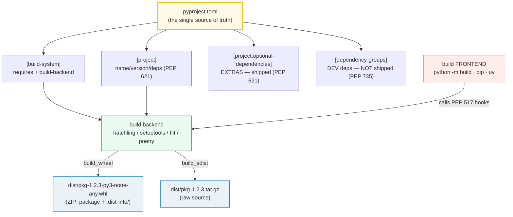
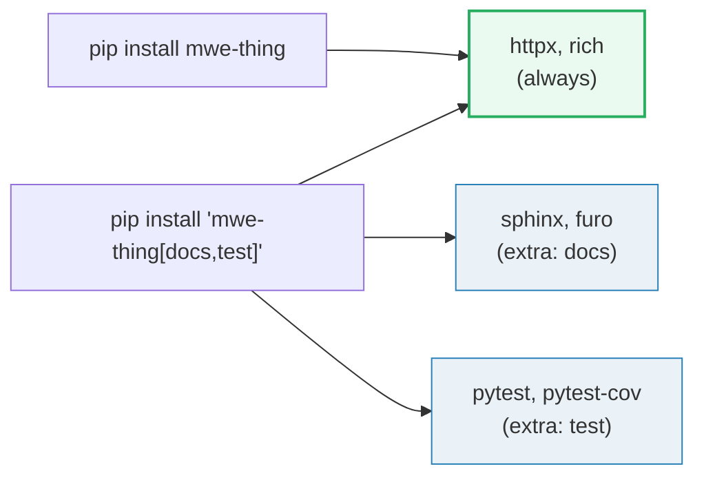
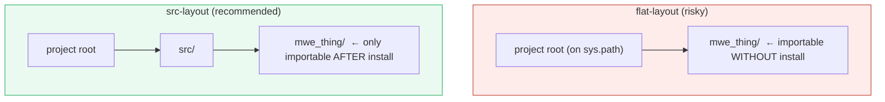
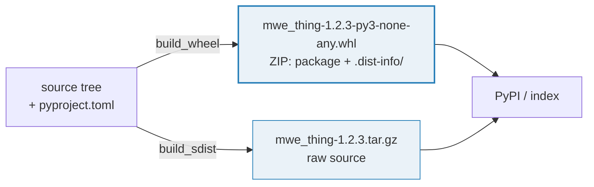

# Packaging — `pyproject.toml`, Build Backends, Wheels, and `uv`

> **The one idea:** modern Python packaging is `pyproject.toml`-centric. The
> `[build-system]` table picks a *build backend*; the `[project]` table declares
> the metadata; a build frontend (`python -m build`, `pip`, or `uv`) calls the
> backend's PEP 517 hooks to produce a **wheel** (the binary distribution) and an
> **sdist** (the source distribution). `uv` is a faster Rust-based frontend that
> reads the *same* standards — not a new format.

**Companion code:** [`packaging_basics.py`](./packaging_basics.py).
**Every table and parsed value below is printed by `uv run python packaging_basics.py`**
— change the code, re-run, re-paste. Nothing here is hand-computed. Captured
stdout lives in [`packaging_basics_output.txt`](./packaging_basics_output.txt).

> **No builds were run in the making of this bundle.** The `.py` embeds a SAMPLE
> `pyproject.toml` as a string and parses it with the stdlib `tomllib`. We never
> touch the repo's real [`pyproject.toml`](./pyproject.toml), never run
> `pip install`, never run `uv build`. The wheel/sdist internals in §6 are
> explained conceptually (the format is a documented standard, not something you
> need to invoke to understand).

**Goal of this bundle (lineage, old → new):**

> from *"I `pip install` and hope it works"*
> → *"I understand modern packaging is `pyproject.toml`-centric: `[build-system]`
> > picks a backend, `[project]` declares metadata, and a wheel is the
> > distributable; I know src-layout, extras, dependency-groups, and how `uv`
> > fits."*

🔗 This is bundle **#27 of Phase 4**. The repo's *own*
[`pyproject.toml`](./pyproject.toml) is a live example — it uses exactly the
`[project]` shape we parse below. Testing/linting deps (`pytest`, `ruff`,
`mypy`) live in this folder's `[project].dependencies` and are explained in
[`TESTING_LINTING`](./TESTING_LINTING.md) (Phase 4 #28); the type-checking tool
`mypy` is covered in [`TYPE_HINTS`](./TYPE_HINTS.md) (Phase 3 #18).

---

## 0. The whole map on one page



| Question | Table | Shipped to users? | Example |
|---|---|---|---|
| How do I *build* this? | `[build-system]` | n/a (build-time only) | `build-backend = "hatchling.build"` |
| What *is* this package? | `[project]` | yes (in METADATA) | `name`, `version`, `requires-python` |
| What must always install? | `[project].dependencies` | yes | `"httpx>=0.27"` |
| What's an opt-in feature? | `[project.optional-dependencies]` (extras) | yes (when requested) | `pip install pkg[docs]` |
| What's a dev-only tool? | `[dependency-groups]` (PEP 735) | **no** | `uv sync --group dev` |

---

## 1. `pyproject.toml` structure — `tomllib.loads(SAMPLE)`

`pyproject.toml` is the single source of truth for a modern Python project. Two
PEPs anchor it:

- **PEP 518 (2016)** introduced the *file* itself and the `[build-system]`
  table, so any tool could learn *how* to build your project without a
  `setup.py`.
- **PEP 621 (2020)** added the `[project]` table — a **tool-agnostic** way to
  declare project metadata, so `setuptools`, `hatchling`, `flit`, `poetry` all
  read the *same* `name`/`version`/`dependencies`.

Python 3.11+ ships [`tomllib`](https://docs.python.org/3/library/tomllib.html) —
a read-only TOML parser — so we can parse this file with **zero third-party
dependencies**. The `.py` embeds a SAMPLE and parses it.

> From `packaging_basics.py` Section A:
> ```
> ======================================================================
> SECTION A — pyproject.toml structure: tomllib.loads(SAMPLE)
> ======================================================================
> pyproject.toml is the single source of truth for a modern Python
> project. PEP 518 (2016) introduced the FILE and [build-system];
> PEP 621 (2020) added [project] for tool-agnostic metadata. Python
> 3.11+ ships tomllib to parse it. Below: load the SAMPLE and list
> the top-level tables.
> 
> top-level tables: ['build-system', 'dependency-groups', 'project', 'tool']
> 
> table                         kind
> --------------------------------------------------
> 'build-system'                dict
> 'dependency-groups'           dict
> 'project'                     dict
> 'tool'                        dict
> 
> [check] pyproject.toml has a [build-system] table: OK
> [check] pyproject.toml has a [project] table: OK
> [check] [project] is a dict (a TOML table): OK
> [check] [build-system] is a dict (a TOML table): OK
> ```

### Why a single file beat `setup.py` (internals)

Under the old `setup.py` regime, pip had to *execute* your project's Python
code just to learn its name — a recipe for arbitrary code execution at install
time (and a hard blocker for build isolation). PEP 518's `pyproject.toml` makes
the build requirements **declarative**; pip can read `[build-system].requires`,
provision an *isolated* environment for the build, and only then invoke the
backend. `[tool.*]` sub-tables (`[tool.ruff]`, `[tool.mypy]`, `[tool.pytest]`)
are reserved by PEP 518 for per-tool config, which is why every linter now lives
in the same file. `tomllib` is *read-only* (there is no `tomllib.dumps`) on
purpose — the file is hand-authored source, not generated state.

---

## 2. `[build-system]` (PEP 517/518) — pick a backend

PEP 518 defines `[build-system]` with two keys:

- **`requires`** — the list of packages the frontend must install into an
  *isolated* build environment before building (e.g. `["hatchling"]`).
- **`build-backend`** — the dotted path to a PEP 517 *backend object* that
  exposes the build hooks.

PEP 517 (2017) then defines the **hook interface** every backend implements:
`build_wheel`, `build_sdist`, plus the optional
`get_requires_for_build_wheel` and `prepare_metadata_for_build_wheel`. The
frontend (`pip`, `python -m build`, `uv`) calls these hooks — it never builds
the wheel itself.

| `build-backend` | family | when to reach for it |
|---|---|---|
| `hatchling.build` | Hatch | default for new projects; fast, configurable |
| `setuptools.build_meta` | setuptools | the legacy default; still huge, fine for existing projects |
| `flit_core.buildapi` | Flit | tiny, for single-module pure-Python packages |
| `poetry.core.masonry.api` | Poetry | ships with the Poetry workflow |

> From `packaging_basics.py` Section B:
> ```
> ======================================================================
> SECTION B — [build-system] (PEP 517/518): pick a backend
> ======================================================================
> PEP 518 defined [build-system] with two keys: `requires` (the list
> of packages pip must install into an ISOLATED build env) and
> `build-backend` (the dotted path to a PEP 517 backend object). The
> backend then exposes hooks: build_wheel, build_sdist, get_requires_for_build_wheel, prepare_metadata_for_build_wheel.
> 
> Common backends (each builds a wheel from the same [project]):
>   build-backend                   family      note
>   ------------------------------------------------------------
>   hatchling                       Hatch       default for new projects; fast, configurable
>   setuptools.build_meta           setuptools  the legacy default; still huge
>   flit_core.buildapi              Flit        tiny, for single-module pure-Python
>   poetry.core.masonry.api         Poetry      ships with the Poetry workflow
> 
> [build-system].requires      = ['hatchling']
> [build-system].build-backend = 'hatchling.build'
> 
> [check] [build-system] has 'requires' as a list of str: OK
> [check] [build-system] has 'build-backend' as a str: OK
> [check] our SAMPLE uses the hatchling backend: OK
> ```

### Why build isolation matters (internals)

Before PEP 517, `pip install yourpkg` ran `setup.py` in *your* environment —
so a `setup.py` that did `import numpy` would silently fail (or worse, mutate
your env). PEP 517 mandates **build isolation**: the frontend creates a fresh
venv containing *only* `[build-system].requires`, then invokes the backend
there. That's why `[build-system].requires = ["hatchling"]` must list the
backend even though you also see it in `build-backend` — `requires` provisions
the build env, `build-backend` names what to call inside it. Missing this
distinction is the #1 cause of "ModuleNotFoundError during `pip install`".

---

## 3. `[project]` metadata (PEP 621) + PEP 440 versions

PEP 621 standardizes the `[project]` table across all backends. `name` is
**required** (and is normalized per PEP 503 — uppercased, runs of `.-_`
collapsed to a single `-`, so `mwe-thing`, `MWE_Thing`, and `mwe.thing` are all
the same project). `version` must be a valid **PEP 440** string. The other keys
(`description`, `readme`, `requires-python`, `license`, `authors`, `keywords`,
`classifiers`, `urls`, `scripts`, `dependencies`,
`optional-dependencies`, `dynamic`) are optional but, when present, are
considered **canonical** — backends are forbidden from changing them.

> From `packaging_basics.py` Section C (project metadata):
> ```
> ======================================================================
> SECTION C — [project] metadata (PEP 621) + PEP 440 versions
> ======================================================================
> PEP 621 standardizes the [project] table. `name` is REQUIRED; `version`
> MUST follow PEP 440. Other keys: description, readme, requires-python,
> license, authors, keywords, classifiers, urls, scripts, dependencies,
> optional-dependencies, dynamic. Below: our SAMPLE's [project].
> 
>   name             = 'mwe-thing'
>   version          = '1.2.3'
>   description      = 'A minimal worked-example package.'
>   requires-python  = '>=3.11'
>   license          = {'text': 'MIT'}
>   authors          = [{'name': 'Ada Lovelace', 'email': 'ada@example.com'}]
>   keywords         = ['example', 'packaging']
>   dependencies     = ['httpx>=0.27', 'rich>=13.0']
> 
> [check] [project].name is 'mwe-thing': OK
> [check] [project].version is '1.2.3': OK
> [check] [project].requires-python is '>=3.11': OK
> [check] [project].authors is a list of inline tables: OK
> ```

### PEP 440 — the version scheme

PEP 440's grammar, in one line:
`[N!]N(.N)*[{a|b|rc}N][.postN][.devN][+local]`. The pieces, in precedence
order:

- **epoch** `N!` — a reset switch (rare; `2!1.0` beats any `1!x.x`). Default `0`.
- **release** `N(.N)*` — the familiar dotted version (`1.2.3`).
- **pre-release** `{a|b|rc}N` — alpha/beta/release-candidate (`1.0a1`, `1.0rc2`).
- **post-release** `.postN` — a patch *after* the release (`1.0.post1`).
- **dev-release** `.devN` — a pre-release so early it's *before* the pre-release
  (`1.0.dev1 < 1.0a1 < 1.0`).
- **local** `+local` — downstream-only build metadata, **never** allowed on
  PyPI uploads (`1.0+ubuntu1`).

The `.py` parses each piece with a minimal port of the PEP 440 regex (from the
PEP's own appendix), then builds a sortable key by porting the `packaging`
library's `_cmpkey` algorithm — so the runnable file stays **stdlib-only** while
still demonstrating real ordering.

> From `packaging_basics.py` Section C (PEP 440 parse + ordering):
> ```
> PEP 440 version scheme:  [N!]N(.N)*[{a|b|rc}N][.postN][.devN][+local]
> Below: each version parsed into (epoch, release, pre, post, dev, local).
> 
>   version       release   pre       post    dev     epoch
>   ----------------------------------------------------------
>   1.2.3         1.2.3     -         -       -       0
>   1.0a1         1.0       a         -       -       0
>   1.0b2         1.0       b         -       -       0
>   1.0rc1        1.0       rc        -       -       0
>   1.0           1.0       -         -       -       0
>   1.0.post1     1.0       -         1       -       0
>   1.0.dev1      1.0       -         -       1       0
>   2!1.0         1.0       -         -       -       2
>   1.0+local     1.0       -         -       -       0
>   1.0.0         1.0.0     -         -       -       0
> 
> sorted by PEP 440 order: ['1.0.dev1', '1.0a1', '1.0b1', '1.0rc1', '1.0', '1.0.post1']
> 
> [check] 1.0.dev1 sorts first (dev < everything): OK
> [check] 1.0.post1 sorts last (post > release): OK
> [check] the full chain is strictly ascending: OK
> [check] 1.0 == 1.0.0 (trailing zeros are insignificant): OK
> [check] 2!1.0 > 1!9.9 (epoch dominates release): OK
> [check] 1.0+local > 1.0 (local version beats no local): OK
> ```

### Why PEP 440 orders that way (internals)

The ordering `dev < pre < release < post` reflects "how much do we trust this
release". A `.dev1` is "we just started this version"; `1.0a1` is "early
preview"; `1.0` is "this is it"; `1.0.post1` is "small fix after the fact, no
new features". The `_cmpkey` trick the `packaging` library uses (and this
bundle ports): represent "no pre-release" as `+Infinity` and "dev but no
pre-release" as `-Infinity`, so a plain `1.0` sorts *after* every `1.0a1` while
`1.0.dev1` sorts *before* every `1.0a1`. Trailing zeros are stripped from the
release tuple, so `1.0` and `1.0.0` compare equal — pip will not consider them
"upgrades" of each other. The `+local` segment is **only** for local builds;
PyPI rejects uploads with a local version, because two builders' `+local`
labels would collide.

---

## 4. `dependencies` vs `optional-dependencies` (extras)

`[project].dependencies` always install. `[project.optional-dependencies]` are
**extras**: named groups the *user* opts into at install time with square
brackets. Crucially, extras **are** part of the built wheel — they ship to
end users as `Provides-Extra` metadata, and each extra's deps become conditional
`Requires-Dist` entries.



> From `packaging_basics.py` Section D:
> ```
> ======================================================================
> SECTION D — dependencies vs optional-dependencies (extras)
> ======================================================================
> [project].dependencies always install. [project.optional-dependencies]
> are EXTRAS: named groups the user opts into at install time with
> square brackets. Extras ARE shipped to users in the wheel.
> 
>   dependencies            = ['httpx>=0.27', 'rich>=13.0']
>   optional-dependencies   = {'docs': ['sphinx>=7.0', 'furo'], 'test': ['pytest>=8.0', 'pytest-cov']}
> 
>   # install just the core:
>   pip install mwe-thing
>   # install core + two extras (docs + test):
>   pip install 'mwe-thing[docs,test]'
> 
> [check] core dependencies are a list of PEP 508 strings: OK
> [check] 'docs' extra is a list: OK
> [check] 'docs' extra contains sphinx: OK
> [check] two extras defined (docs, test): OK
> ```

### Why extras exist (internals)

Extras model **optional features**, not dev tools. The canonical use: a package
that supports multiple backends (`pkg[httpx]` vs `pkg[requests]`), or optional
rich output (`rich[colors]`). Each extra name becomes a `Provides-Extra` line in
`METADATA`; when a user installs `pkg[docs]`, the resolver pulls the extra's
deps in addition to the core. Each dep string is a **PEP 508** marker —
`"django>2.1; os_name != 'nt'"` is legal. The trap: extras **ship**, so don't
put `pytest`/`ruff`/`mypy` in an extra unless you actually want users to receive
them — for dev-only tooling, use **dependency-groups** (§5).

---

## 5. Dependency groups (PEP 735) — NOT shipped

PEP 735 (2024) added `[dependency-groups]` for **dev/tool** dependencies that
must **never** end up in a built wheel. Unlike extras, they are purely for
local development and CI — the backend omits them from the sdist/wheel
entirely. This closes the long-standing "abuse a `dev` extra for my linter"
anti-pattern: an extra *would* publish your `ruff` pin to every downstream
user's resolver.

| aspect | `[project.optional-dependencies]` | `[dependency-groups]` |
|---|---|---|
| shipped to users? | **yes** (in the wheel) | **no** (dev only) |
| install syntax | `pip install pkg[dev]` | `uv sync --group dev` |
| PEP | PEP 621 (2020) | PEP 735 (2024) |
| use case | opt-in **features** (docs, gpu) | dev **tools** (ruff, mypy) |

> From `packaging_basics.py` Section E:
> ```
> ======================================================================
> SECTION E — dependency-groups (PEP 735): NOT shipped
> ======================================================================
> PEP 735 (2024) added [dependency-groups] for DEV/TOOL dependencies
> that must NEVER end up in a built wheel. Unlike extras, they are
> purely for local development and CI. uv/pip support installing them
> into dev environments but the backend omits them from the sdist/wheel.
> 
>   [dependency-groups] = {'dev': ['ruff>=0.6', 'mypy>=1.11'], 'test': ['pytest>=8.0']}
> 
>   aspect                [project.optional-dependencies]         [dependency-groups]
>   ------------------------------------------------------------------------------------------
>   shipped to users?     yes (in the wheel)                      no (dev only)
>   install syntax        pip install pkg[dev]                    uv sync --group dev
>   PEP                   PEP 621 (2020)                          PEP 735 (2024)
>   use case              opt-in FEATURES (docs, gpu)             dev TOOLS (ruff, mypy)
> 
> [check] SAMPLE defines a [dependency-groups] table: OK
> [check] 'dev' group has ruff + mypy: OK
> ```

### Why a new table was needed (internals)

Before PEP 735, the ecosystem splintered: Poetry used `[tool.poetry.group.dev]`,
PDM used `[tool.pdm.dev-dependencies]`, setuptools users shoved ruff into a
`[project.optional-dependencies].dev` extra (publishing it to PyPI whether
users wanted it or not). PEP 735 standardizes the table name so *any* frontend
(`uv`, `pip`, `nox`) can read it. A dependency-group is **not** a PEP 508
dependency of the project — it's a list of requirement strings the *tooling*
consumes, and the build backend is explicitly required to ignore it when
generating `METADATA`. This is why `uv add --group dev ruff` writes into
`[dependency-groups]` instead of `[project.optional-dependencies]`.

---

## 6. src-layout vs flat-layout



The trap: with the **flat** layout, the project root is on `sys.path`, so
`import mwe_thing` picks up the **local** source tree *even when the package is
not installed*. Tests then pass against your dev copy, silently hiding packaging
bugs (a missing `__init__.py`, a file you forgot to include in the wheel, a
broken relative import). The **src** layout nests the package under `src/`, so
you can *only* import the **installed** copy — tests then catch packaging
mistakes before release.

> From `packaging_basics.py` Section F:
> ```
> ======================================================================
> SECTION F — src-layout vs flat-layout
> ======================================================================
> The trap: with the FLAT layout, the project root is on sys.path, so
> `import mwe_thing` picks up the LOCAL source tree even when the package
> is NOT installed. Tests pass against your dev copy, hiding packaging
> bugs (missing __init__.py, wrong file inclusion). The SRC layout puts
> the package under src/, so you can only import the INSTALLED copy —
> tests then catch packaging mistakes before release.
> 
> flat-layout:
> mwe-thing/
> ├── pyproject.toml
> ├── README.md
> ├── mwe_thing/          ← the import package sits AT THE PROJECT ROOT
> │   ├── __init__.py
> │   └── cli.py
> └── tests/
>     └── test_cli.py
> 
> src-layout (recommended):
> mwe-thing/
> ├── pyproject.toml
> ├── README.md
> ├── src/                ← the import package is NESTED under src/
> │   └── mwe_thing/
> │       ├── __init__.py
> │       └── cli.py
> └── tests/
>     └── test_cli.py
> 
> [check] src-layout nests the package under src/: OK
> [check] flat-layout puts the package at the root: OK
> ```

### Why the layout matters at install time (internals)

A wheel installs the package into the venv's `site-packages/`. When you run
`pytest` from the project root, CPython prepends the current directory to
`sys.path[0]`. In a flat layout, `sys.path[0]` *contains* `mwe_thing/`, so it
shadows whatever `site-packages/mwe_thing/` the wheel installed — you test the
*source*, not the *artifact*. In a src layout, `sys.path[0]` contains `src/`
*only if you configure it* (or `pip install -e .` / editable install does);
otherwise the import resolves through `site-packages/`, exactly as your users
will experience it. The cost is one extra directory level; the benefit is that
"works on my machine" and "works when installed" become the *same* test.

---

## 7. The build flow — wheel + sdist (explained, not run)

`python -m build` (or `uv build`) is the build **frontend**. It reads
`[build-system]`, installs `requires` into an *isolated* environment, then calls
the backend's PEP 517 hooks. Output lands in `dist/`:



A **wheel** (`.whl`) is a **ZIP archive**. Its filename encodes compatibility:
`{distribution}-{version}-{python-tag}-{abi-tag}-{platform-tag}.whl`. For
`mwe_thing-1.2.3-py3-none-any.whl`: `py3` (pure-Python, any Python 3), `none`
(no C-ABI constraint), `any` (any OS/CPU). Compiled wheels look like
`numpy-1.26-cp312-cp312-macosx_11_0_arm64.whl`.

Inside the wheel ZIP:

```
mwe_thing/                       ← the import package
  __init__.py
  cli.py
mwe_thing-1.2.3.dist-info/       ← metadata directory
  METADATA                       ← name, version, Requires-Dist, Summary...
  WHEEL                          ← 'Wheel-Version: 1.0', 'Root-Is-Purelib: true'
  RECORD                         ← every file + its hash (integrity audit)
  entry_points.txt               ← from [project.scripts]
```

An **sdist** (`.tar.gz`) is the raw **source** — also produced by the backend,
so a downstream user can rebuild a wheel from source if no binary matches their
platform.

> From `packaging_basics.py` Section G:
> ```
> ======================================================================
> SECTION G — the build flow: wheel + sdist (explained, NOT run)
> ======================================================================
> `python -m build` (or `uv build`) is the build FRONTEND. It reads
> [build-system], installs `requires` into an ISOLATED env, then calls
> the backend's PEP 517 hooks. Output lands in dist/:
> 
>   source tree ──▶ build_wheel ──▶ mwe_thing-1.2.3-py3-none-any.whl
>              └──▶ build_sdist  ──▶ mwe_thing-1.2.3.tar.gz
> 
> A WHEEL (.whl) is a ZIP archive. Its filename encodes compatibility:
>   {distribution}-{version}-{python}-{abi}-{platform}.whl
>   mwe_thing-1.2.3-py3-none-any.whl
>     py3      : pure-Python, any Python 3
>     none     : no C-ABI constraint (no compiled extension)
>     any      : any OS / CPU
> 
> Inside the wheel ZIP:
>   mwe_thing/             ← the import package
>     __init__.py
>     cli.py
>   mwe_thing-1.2.3.dist-info/
>     METADATA             ← name, version, Requires-Dist, Summary...
>     WHEEL                ← 'Wheel-Version: 1.0', 'Root-Is-Purelib: true'
>     RECORD               ← every file + its hash (for integrity audits)
>     entry_points.txt     ← from [project.scripts]
> 
> An SDIST (.tar.gz) is the raw SOURCE — also produced by the backend,
> so a downstream user can rebuild a wheel from source if no binary
> matches their platform.
> 
> [check] wheel filename pattern is dist-version-pytag-abi-platform: OK
> [check] dist-info dir name is '{name}-{version}.dist-info': OK
> [check] METADATA + WHEEL + RECORD are the three required dist-info files: OK
> ```

### Why a wheel is a ZIP (internals)

A wheel is literally a `.zip` with a `.whl` extension — `unzip -l` any wheel and
you'll see its contents. Installing a pure-Python wheel is therefore *just* an
unzip into `site-packages/`, with no build step and no compiler — which is why
`pip install` is fast when a matching wheel exists and agonizingly slow when it
must fall back to building from sdist. The `.dist-info/RECORD` file lists every
shipped file with a SHA-256 hash, so `pip uninstall` knows exactly what to
remove (no global registry needed). `Root-Is-Purelib: true` tells the installer
to drop the package at the top level of `site-packages/`; a `false` would put it
under `site-packages/<platlib>/` for compiled extensions.

🔗 When a wheel needs a compiled extension, the build backend often calls out to
a build system (setuptools→distutils, maturin→Cargo, scikit-build→CMake). That
world is beyond this bundle; the *consuming* side (`pip install`, `uv sync`) is
identical.

---

## 8. `uv` — a fast Rust-based pip/build replacement

[`uv`](https://docs.astral.sh/uv/) (Astral, written in Rust) is a single binary
that replaces `pip`, `pip-tools`, `pipx`, `virtualenv`, `pyenv`, `poetry`, and
`twine` for the common workflows. It reads the **same** `pyproject.toml` — uv
is a faster **frontend**, not a new format. Every PEP cited above (517/518/621/
735) applies identically; `uv build` calls the same PEP 517 backend as
`python -m build`.

| command | what it does |
|---|---|
| `uv init` | scaffold a new project (`pyproject.toml` + src/ layout) |
| `uv add httpx` | add a dep to `[project].dependencies` + install it |
| `uv add --group dev ruff` | add to a `[dependency-groups]` (PEP 735) group |
| `uv sync` | create/update the venv from `pyproject.toml` + `uv.lock` |
| `uv lock` | write a deterministic `uv.lock` (reproducible installs) |
| `uv run python pkg.py` | run a command in the project env (no activation) |
| `uv build` | build wheel + sdist into `dist/` (calls the PEP 517 backend) |
| `uv pip install pkg` | the pip-compatible interface (drop-in) |
| `uv venv` | create a `.venv` (replaces `python -m venv`) |
| `uv publish` | upload `dist/*` to PyPI (replaces `twine`) |

> From `packaging_basics.py` Section H:
> ```
> ======================================================================
> SECTION H — uv: a fast Rust-based pip/venv/build replacement
> ======================================================================
> uv (Astral, Rust) is one binary that replaces pip, pip-tools, pipx,
> virtualenv, pyenv, poetry, and twine for the common workflows. It
> reads the SAME pyproject.toml — uv is a faster FRONTEND, not a new
> format. Commands you reach for daily:
> 
>   command                     what it does
>   ----------------------------------------------------------------
>   uv init                     scaffold a new project (pyproject.toml + src/ layout)
>   uv add httpx                add a dependency to [project].dependencies + install it
>   uv add --group dev ruff     add to a [dependency-groups] (PEP 735) group
>   uv sync                     create/update the venv from pyproject.toml + uv.lock
>   uv lock                     write a deterministic uv.lock (reproducible installs)
>   uv run python pkg.py        run a command in the project env (no activation)
>   uv build                    build wheel + sdist into dist/ (calls the PEP 517 backend)
>   uv pip install pkg          the pip-compatible interface (drop-in)
>   uv venv                     create a .venv (replaces `python -m venv`)
>   uv publish                  upload dist/* to PyPI (replaces twine)
> 
> uv vs pip, in one line: uv reads the same standards (PEP 517/518/621/
> 735), ships wheels/sdists to the same PyPI, but resolves + installs
> 10–100x faster thanks to a Rust resolver and a global package cache.
> 
> [check] uv uses the SAME pyproject.toml standard (not a new format): OK
> [check] 'uv build' produces a wheel + sdist (PEP 517 backend): OK
> ```

### Why uv is faster (internals)

pip resolves dependencies in Python, one version at a time, with heavy
backtracking; uv's resolver is written in Rust, uses a global content-addressed
cache (so a wheel downloaded once is hard-linked into every project that needs
it, never re-downloaded), and parallelizes downloads. `uv.lock` is uv's
deterministic lockfile — analogous to `poetry.lock` or `Cargo.lock` — pinning
the exact resolved versions so CI and teammates get byte-identical
environments. The lockfile is *not* a standard (there is no PEP for it); it's a
frontend-specific artifact, but every modern frontend ships one.

---

## Pitfalls

| Trap | Example | The fix |
|---|---|---|
| Listing the build backend in `dependencies` instead of `[build-system].requires` | `build-backend = "hatchling.build"` but `hatchling` only in `[project].dependencies` | `[build-system].requires = ["hatchling"]` — the build env is isolated from runtime deps |
| `pip install` fails with `ModuleNotFoundError` mid-build | a `setup.py` imported a runtime dep | move to PEP 517 isolation; the build env only has `[build-system].requires` |
| Using `1.0` and `1.0.0` and expecting an "upgrade" | `1.0 == 1.0.0` per PEP 440 (trailing zeros stripped) | bump a non-trailing component (`1.0.1`) if you need pip to see a new version |
| `1.0+local` rejected on `twine upload` | local versions are forbidden on PyPI | strip `+local` before upload; reserve it for in-house builds |
| Putting `pytest`/`ruff` in an extra | `[project.optional-dependencies].dev = ["ruff"]` ships ruff's pin to users | use `[dependency-groups]` (PEP 735) for dev-only tooling |
| Tests pass locally, the installed wheel is broken | flat-layout imports the source tree, masking packaging bugs | adopt the **src-layout** so tests run against the installed copy |
| `python -m build` is missing | the `build` package isn't stdlib | `pip install build` (or just use `uv build`) |
| `tomllib.dumps(...)` fails | stdlib `tomllib` is **read-only** | use `tomli_w` (third-party) or write TOML by hand — the file is source |
| Mixing extras and dependency-groups with the same name | `pkg[dev]` (extra) vs `--group dev` (PEP 735) are unrelated | they are different mechanisms; don't assume one implies the other |
| `requires-python = ">=3.8"` but using `match`/PEP 695 syntax | the wheel installs on 3.8 then crashes at import | keep `requires-python` honest with the *minimum* Python your code actually supports |

---

## Cheat sheet

- **`pyproject.toml`** is the single source of truth. PEP 518 made the file +
  `[build-system]`; PEP 621 added `[project]`; PEP 735 added
  `[dependency-groups]`. Parse with stdlib `tomllib` (3.11+, read-only).
- **`[build-system]`** = `{requires = [...], build-backend = "x.y"}`. `requires`
  provisions an *isolated* build env; `build-backend` names the PEP 517 hook
  object (`hatchling.build`, `setuptools.build_meta`, `flit_core.buildapi`,
  `poetry.core.masonry.api`).
- **`[project]`** metadata (PEP 621): `name` (required, PEP 503-normalized),
  `version` (PEP 440), `requires-python`, `dependencies`, `authors`,
  `optional-dependencies`, `scripts`, etc.
- **PEP 440** version: `[N!]N(.N)*[{a|b|rc}N][.postN][.devN][+local]`. Order:
  `dev < pre < release < post`; epoch dominates; trailing zeros insignificant;
  `+local` never allowed on PyPI.
- **`dependencies`** always install. **`optional-dependencies`** (extras) are
  opt-in feature groups *shipped* to users (`pip install pkg[docs]`).
- **`[dependency-groups]`** (PEP 735) are dev-only tools *never* shipped
  (`uv sync --group dev`). Use for ruff/mypy/pytest, NOT extras.
- **src-layout** (`src/pkg/`) prevents the local-source shadowing the installed
  wheel; flat-layout (`pkg/` at root) hides packaging bugs.
- **Wheel** (`.whl`) = a ZIP named `{dist}-{ver}-{pytag}-{abi}-{plat}.whl`,
  containing the package + `{dist}-{ver}.dist-info/{METADATA,WHEEL,RECORD}`.
  **Sdist** (`.tar.gz`) = raw source.
- **`uv`** = a Rust frontend over the *same* standards. `uv add`/`uv sync`/
  `uv run`/`uv build`/`uv lock`/`uv publish`; 10–100× faster than pip via a
  global cache + parallel resolver.

---

## Sources

- **Python Packaging User Guide — `pyproject.toml` specification.**
  https://packaging_basics.python.org/en/latest/specifications/pyproject-toml/
  *The canonical, maintained merge of PEP 518/621: the `[build-system]` and
  `[project]` table shapes, the `[tool.*]` reservation, and the `dynamic`
  semantics. Quoted throughout §1–§3.*
- **Python Packaging User Guide — src layout vs flat layout.**
  https://packaging_basics.python.org/en/latest/discussions/src-layout-vs-flat-layout/
  *The recommendation that src-layout prevents "accidentally import the local
  source instead of the installed package." Basis for §6.*
- **Python Packaging User Guide — Dependency Groups.**
  https://packaging_basics.python.org/en/latest/specifications/dependency-groups/
  *The maintained PEP 735 spec: dependency groups are "not included in project
  metadata" (i.e. never shipped). Cited in §5.*
- **PEP 517 — A build-system independent format for source trees.**
  https://peps.python.org/pep-0517/
  *Defines the backend hook interface (`build_wheel`, `build_sdist`,
  `get_requires_for_build_wheel`, `prepare_metadata_for_build_wheel`) and build
  isolation. Referenced in §2 and §7.*
- **PEP 518 — Specifying minimum build system requirements.**
  https://peps.python.org/pep-0518/
  *Introduced `pyproject.toml`, the `[build-system]` table (`requires` +
  `build-backend`), and reserved `[tool.*]`. The foundation for §1–§2.*
- **PEP 621 — Storing project metadata in `pyproject.toml`.**
  https://peps.python.org/pep-0621/
  *The `[project]` table: `name` (required, PEP 503-normalized), `version`
  (PEP 440), `description`, `requires-python`, `license`, `authors`,
  `dependencies`, `optional-dependencies`, `dynamic`. Quoted verbatim in §1,
  §3, §4.*
- **PEP 735 — Dependency Groups in `pyproject.toml`.**
  https://peps.python.org/pep-0735/
  *The `[dependency-groups]` table for "package requirements … not included in
  any built distribution." The extras-vs-groups contrast in §5.*
- **PEP 440 — Version Identification and Dependency Specification.**
  https://peps.python.org/pep-0440/
  *The version grammar and §8 ordering rules (epoch > release > pre > dev;
  trailing zeros insignificant; local versions). The regex in
  `packaging_basics.py` is the PEP's appendix-B pattern; the `_cmpkey` algorithm is a
  port of the `packaging` library's implementation.*
- **PEP 503 — Simple Repository API.**
  https://peps.python.org/pep-0503/
  *The project-name normalization rule (`re.sub(r"[-_.]+", "-", name).lower()`)
  referenced by PEP 621 for `name`. Cited in §3.*
- **PEP 508 — Dependency specification for Python software packages.**
  https://peps.python.org/pep-0508/
  *The grammar for every entry in `dependencies` / `optional-dependencies` /
  `dependency-groups` (e.g. `"django>2.1; os_name != 'nt'"`). Referenced in §4.*
- **Python docs — `tomllib` (TOML parser, 3.11+).**
  https://docs.python.org/3/library/tomllib.html
  *The read-only stdlib parser used by `packaging_basics.py` to parse the SAMPLE.
  Read-only by design; there is no `dumps`.*
- **uv documentation — Astral.**
  https://docs.astral.sh/uv/
  *uv's command surface (`uv add`, `uv sync`, `uv run`, `uv build`, `uv lock`,
  `uv pip install`, `uv venv`, `uv publish`) and the claim that it is a
  "drop-in replacement for pip / pip-tools / virtualenv / pipx" that reads the
  same `pyproject.toml`. Basis for §8.*
- **Python Packaging User Guide — Packaging Python Projects (tutorial).**
  https://packaging_basics.python.org/tutorials/packaging-projects/
  *The end-to-end worked example: `pyproject.toml` → `python -m build` →
  `dist/*.whl` + `dist/*.tar.gz` → `twine upload`. Confirms the §7 flow.*
