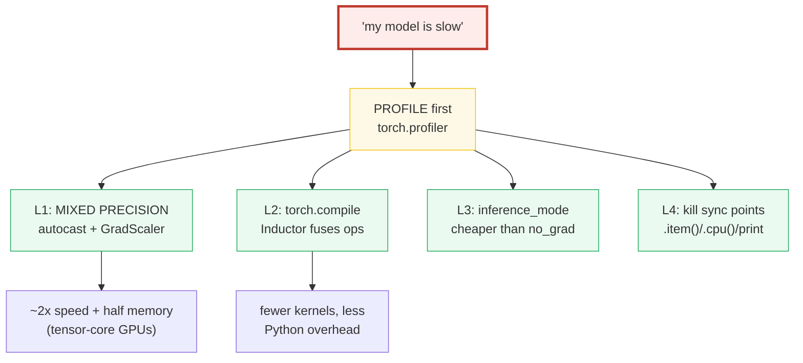
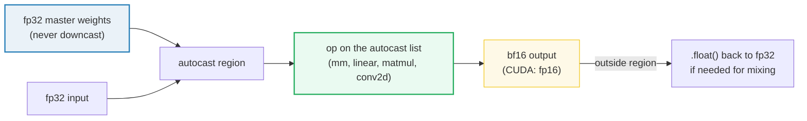
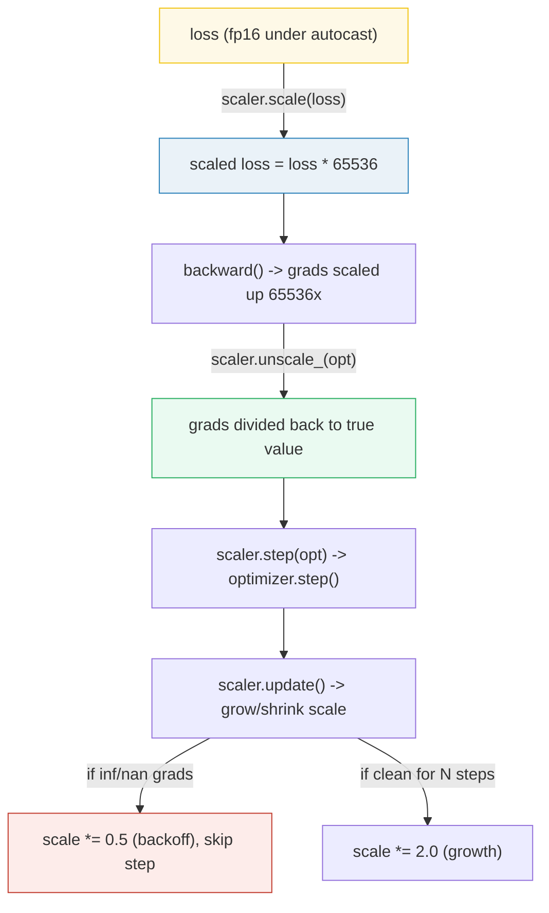
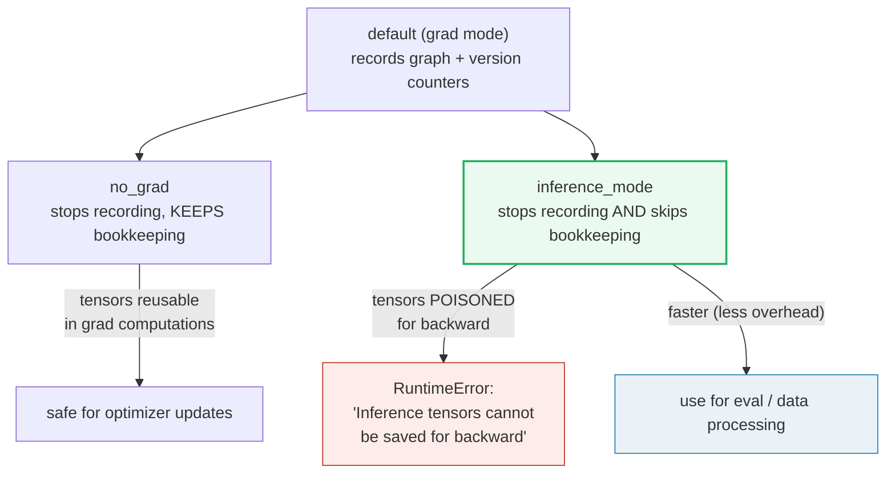
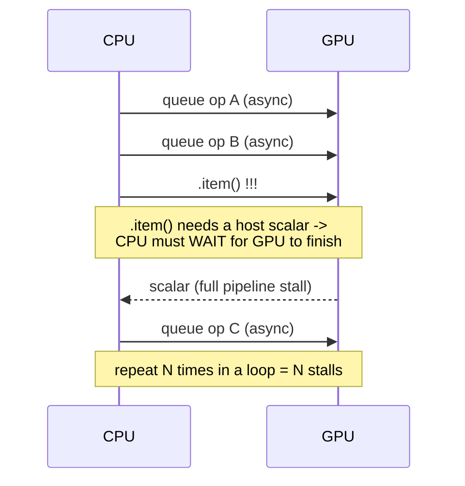
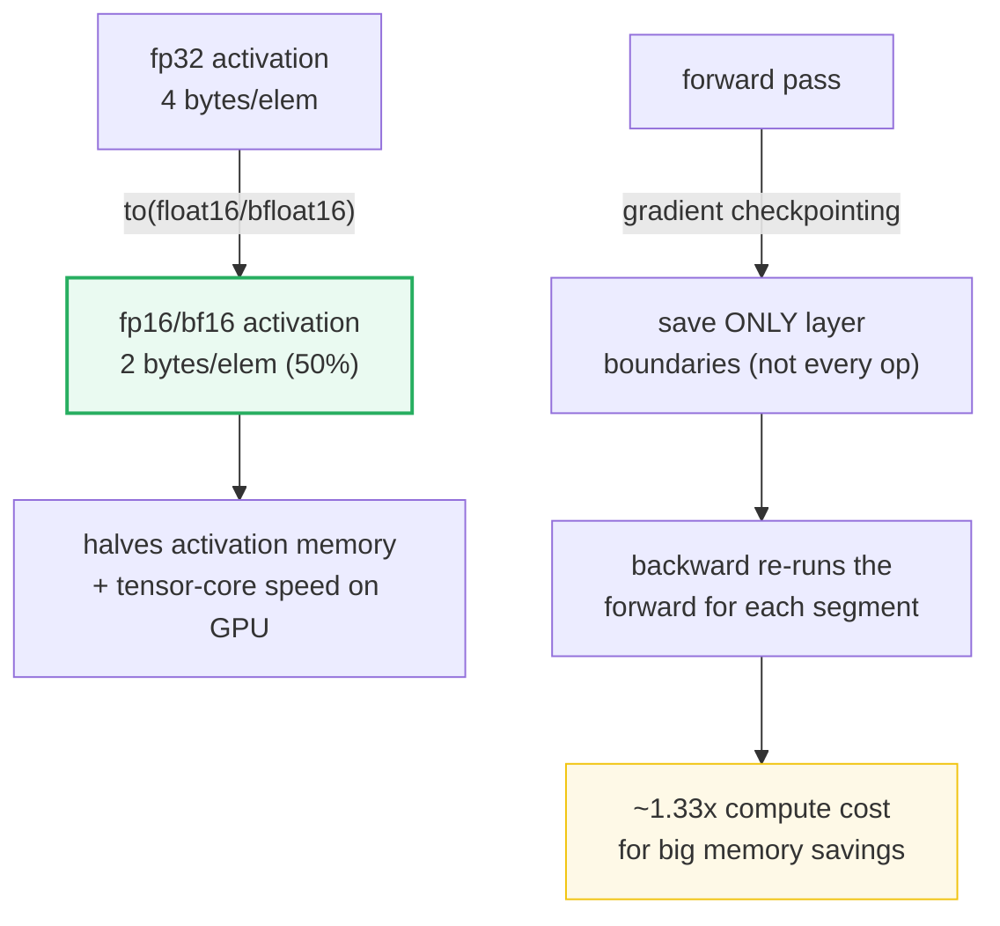

# Performance in PyTorch — Mixed Precision, `torch.compile`, `inference_mode`, and Profiling

> **The one rule:** "my model is slow" is not a diagnosis — it's a symptom. The
> four levers that actually move PyTorch throughput are **mixed precision**
> (`autocast` + `GradScaler`), **`torch.compile`** (op fusion + graph capture),
> and **`inference_mode`** (cheaper grad disabling) — and you reach for them
> **only after** `torch.profiler` tells you where the time goes.

**Companion code:** [`performance_torch.py`](./performance_torch.py).
**Every number, dtype, and profile row below is printed by `uv run python
performance_torch.py`** — change the code, re-run, re-paste. Nothing here is
hand-computed. Captured stdout lives in
[`performance_torch_output.txt`](./performance_torch_output.txt).

**Goal of this bundle (lineage, old → new):**

> from *"my PyTorch model is slow and I don't know why"*
> → *"I know the four levers (autocast, GradScaler, `torch.compile`,
> `inference_mode`), I understand the CPU↔GPU sync-point trap, and I PROFILE
> before I optimize."*

🔗 This is bundle **#35 of Phase 5** (PyTorch). It assumes
[`TENSORS`](./TENSORS.md) and [`AUTOGRAD`](./AUTOGRAD.md) (the `requires_grad`
machinery `inference_mode` short-circuits), [`NN_MODULE`](./NN_MODULE.md) (the
`nn.Linear` whose weights autocast leaves in fp32), and the
**measure-don't-guess** law from
[`PROFILING_OPTIMIZATION`](./PROFILING_OPTIMIZATION.md) (P4 #24). It points
forward to the LLM-systems side for the *hardware* depth:
[`../llm/CUDA_GRAPHS.md`](../llm/CUDA_GRAPHS.md) (graph capture),
[`../llm/GRADIENT_CHECKPOINTING.md`](../llm/GRADIENT_CHECKPOINTING.md) (memory),
and a future `MEMORY_EFFICIENCY`/`TRAINING_LOOP` tie-in. See
[`TODO.md`](./TODO.md) for the full plan.

> **Environment note.** This bundle runs on **CPU for determinism**
> (`torch.manual_seed(0)`; MPS is available here but kept off). Where a lever's
> payoff only appears on GPU (tensor cores, fp16 gradient underflow, async
> streams), the `.py` demonstrates the **API contract** and the `.md` explains
> the GPU mechanism conceptually. Timing digits are labeled
> *(varies per run)*; only **structural** facts (a dtype changed; a callable
> was returned; a backward raised) are asserted.

---

## 0. The four levers on one page



| Lever | One-liner | Costs / limits |
|---|---|---|
| `torch.autocast` | Run safe ops in fp16/bf16, keep fp32 master weights | fp16 grad underflow → needs `GradScaler` |
| `torch.amp.GradScaler` | Scale loss up, unscale grads, prevent fp16 underflow | CUDA/fp16 only; bf16 & CPU don't need it |
| `torch.compile` | Trace + fuse ops via TorchDynamo/Inductor | One-time compile cost; guard failures re-trace |
| `torch.inference_mode` | Disable grad tracking **and** its bookkeeping | Tensors can't be reused in grad computations |
| Profiler (`torch.profiler`) | Find the hot op by self-time | Profile BEFORE optimizing, not after |

---

## 1. Mixed precision — `autocast` (fp32 weights → bf16 op)



`torch.autocast(device_type=...)` is a context manager (or decorator) that wraps
the **forward pass**. Inside it, ops on PyTorch's autocast list run in a
lower-precision dtype chosen *op-by-op*: `mm`/`linear`/`matmul`/`conv2d` drop to
`bfloat16` on CPU (or `float16` on CUDA); reductions and softmax stay in
`float32` for numerical safety. **You never call `.half()`/`.bfloat16()` on the
model** — the weights stay fp32 ("master weights"), and autocast casts only the
*math* on the way in and the *output* on the way out.

> From `performance_torch.py` Section A:
> ```
> ======================================================================
> SECTION A — Mixed precision autocast: fp32 weights -> bfloat16 op
> ======================================================================
> torch.autocast(device_type=...) wraps the forward pass. Inside it,
> ops on the autocast list (mm, linear, matmul, conv2d, ...) run in a
> lower-precision dtype. On CUDA the default is float16; on CPU it is
> bfloat16 (same 8-bit exponent as fp32 -> no dynamic-range loss).
> Weights STAY fp32 ('master weights') — only the math drops precision.
> 
> input a.dtype            = torch.float32
> layer.weight.dtype before = torch.float32 ; after autocast = torch.float32
> torch.mm OUTSIDE autocast -> torch.float32
> torch.mm INSIDE  autocast -> torch.bfloat16   <-- dtype changed mid-op
> nn.Linear INSIDE autocast -> torch.bfloat16
> fp32 bytes/elem = 4 ; bf16 bytes/elem = 2 (activations halved)
> On tensor-core GPUs this yields ~2x speed + half memory; on CPU the
> win is smaller (bf16 is a precision/memory cut, not a tensor-core path).
> 
> [check] autocast changes mm output dtype fp32 -> bfloat16: OK
> [check] autocast changes Linear output dtype to bfloat16: OK
> [check] master weights stay fp32 under autocast: OK
> [check] bfloat16 activation is half the bytes of fp32: OK
> ```

### Why CPU autocast uses `bfloat16` (internals)

`bfloat16` and `float32` share the **same 8-bit exponent**, so bf16 has the same
dynamic range as fp32 (~`3.4e38` max) — it just trades 16 bits of mantissa
precision. That means bf16 activations **don't need a GradScaler**: gradients
can't underflow the way they can in `float16` (whose max is only `65504`). On
CUDA the default autocast dtype is `float16` because tensor cores accelerate
fp16 matmuls directly — and fp16's narrow range is exactly what makes the
GradScaler necessary (§2). The autocast **op reference** is op-specific and
device-specific (e.g. `log`/`softmax`/`layer_norm` are forced to fp32 for
stability, while `mm`/`linear` drop to the low-precision dtype).

**Expert gotchas:**
- **Backward must run *outside* the `autocast` context** in most cases (the docs
  wrap only the forward + loss); backward ops run in the dtype autocast used for
  the corresponding forward op.
- **In-place ops don't autocast** (`a.addmm_(b,c)` and `out=...` variants are
  skipped). Prefer out-of-place ops inside the region.
- **Don't mix autocast outputs with fp32 tensors** without casting — exiting the
  region leaves you with a bf16/fp16 tensor that will raise "type mismatch" if
  you feed it to a fp32 op. Call `.float()` on it.
- **`binary_cross_entropy`/`BCELoss` raise inside autocast** (their backward
  produces unrepresentable fp16 grads); use `binary_cross_entropy_with_logits`
  instead.

🔗 Memory implications of half-precision activations →
[`../llm/GRADIENT_CHECKPOINTING.md`](../llm/GRADIENT_CHECKPOINTING.md) and the
Python-side [`MEMORY_EFFICIENCY`](./MEMORY_EFFICIENCY.md).

---

## 2. `GradScaler` — scale the loss so fp16 grads don't underflow



`float16`'s finite max is `65504` and its smallest *normal* positive is
~`6e-8`. Gradients smaller than that **flush to zero** ("underflow") — the
parameter then gets *no update this step*, silently. `GradScaler` fixes this by
multiplying the loss by a large scale (`init_scale=65536.0`), running backward
on the scaled loss (so every gradient is `65536x` larger and survives fp16),
then **unscaling** the grads back before the optimizer step. It also auto-tunes
the scale: if grads overflow to `inf`/`nan` it halves the scale and skips the
step; after `growth_interval=2000` clean steps it doubles it.

> From `performance_torch.py` Section B:
> ```
> ======================================================================
> SECTION B — GradScaler: scale the loss up so fp16 grads don't underflow
> ======================================================================
> fp16's finite max is 65504 and small grads flush to zero ('under-
> flow'), silently losing the parameter update. GradScaler multiplies
> the loss by a large scale (default init_scale=65536.0 per the docs),
> runs backward on the scaled loss, then UNSCALES the grads before the
> optimizer step. Canonical CUDA AMP loop:
>     scaler = torch.amp.GradScaler('cuda')   # init_scale=65536.0
>     with torch.autocast('cuda'):
>         loss = model(x)
>     scaler.scale(loss).backward()           # grads scaled up
>     scaler.unscale_(optimizer)              # divide grads back
>     scaler.step(optimizer); scaler.update() # step + grow/shrink
> 
> On CPU / bfloat16 NO scaler is needed: bf16 shares fp32's 8-bit
> exponent range, so grads don't underflow. Below we demo the API with
> enabled=False (a no-op scaler that runs anywhere).
> 
> scaler.is_enabled()         = False  (CPU: no-op)
> scaler.get_scale()          = 1.0  (1.0 when disabled)
> scaler.scale(loss) is loss  = True  (identity when disabled)
>   scaler.scale      exists: True
>   scaler.unscale_   exists: True
>   scaler.step       exists: True
>   scaler.update     exists: True
> torch.finfo(float16).max   = 65504.0        <- underflow/overflow ceiling
> torch.finfo(bfloat16).max  = 3.390e+38
> torch.finfo(float32).max   = 3.403e+38
> -> bf16 and fp32 share the 8-bit exponent (similar max);
>    fp16's ~[6e-8 .. 6.5e4] range is tiny, hence the underflow risk.
> 
> [check] disabled scaler.scale(loss) is the identity (no-op): OK
> [check] scaler exposes scale/unscale_/step/update: OK
> [check] fp16 finite max is 65504.0 (the narrow-range ceiling): OK
> [check] bf16 max >> fp16 max (bf16 keeps fp32's exponent range): OK
> ```

### Why the scaler is a no-op on CPU / bf16 (internals)

On a CUDA-less machine `torch.amp.GradScaler("cuda")` **auto-disables**
(`is_enabled()` → `False`, `get_scale()` → `1.0`), and `scaler.scale(loss)`
becomes the identity — which is exactly correct, because CPU autocast uses
`bfloat16`, and bf16's exponent matches fp32's, so there is no underflow to
prevent. The scaler exists **only** to compensate for `float16`'s narrow range;
use it with CUDA + fp16 autocast. The `scaler.step(optimizer)` call is smart: it
*skips* the step if unscaled grads contained `inf`/`nan` (detected during
`unscale_`), so you never corrupt your weights.

**Expert gotchas:**
- **Call `unscale_` before gradient clipping** — otherwise you clip the *scaled*
  (65536x) grads, which is meaningless.
- **`scaler.step` calls `unscale_` internally if you haven't**, so for the
  simplest loop you can skip the explicit `unscale_`. But the moment you add
  clipping or grad-norm inspection, you must unscale first.
- **AMP/fp16 is not universal**: many bf16-pretrained LLMs *overflow* (not
  underflow) in fp16 because their activations exceed 65504. Use bf16 autocast
  for them.

🔗 The training-loop integration (zero_grad → scale → backward → unscale →
step → update) is the subject of [`TRAINING_LOOP`](./TRAINING_LOOP.md) (P5 #33).

---

## 3. `torch.compile` — TorchDynamo traces, Inductor fuses ops

```mermaid
graph LR
    F["eager fn(x)<br/>(Python bytecode)"] -->|"first call"| DY["TorchDynamo<br/>traces the frame"]
    DY --> GR["FX graph<br/>(ops + shapes)"]
    GR --> IND["Inductor backend"]
    IND --> FUSE["fuse pointwise ops<br/>(sin*cos+relu -> 1 kernel)"]
    FUSE --> CACHE["cache compiled artifact"]
    CACHE -->|"later calls"| FAST["replay fused kernel<br/>(skip Python overhead)"]
    FAST -->|"optional"| CG["CUDA graph capture<br/>(mode: reduce-overhead)"]
    style DY fill:#eaf2f8,stroke:#2980b9,stroke-width:2px
    style FUSE fill:#eafaf1,stroke:#27ae60,stroke-width:2px
    style CACHE fill:#fef9e7,stroke:#f1c40f
```



`torch.compile(model_or_fn)` returns a **new callable** that, on the first call,
hands the Python frame to **TorchDynamo** (a frame-evaluating tracer that
captures the tensor ops into an FX graph), which hands the graph to a backend —
by default **Inductor**. Inductor **fuses** pointwise ops (e.g. `sin(x)*x + cos(x)`
then `relu`) into a single kernel, eliminating intermediate materializations and
Python dispatch overhead. There is a **one-time compile cost**; later calls with
the same shapes reuse the cached artifact. The `reduce-overhead` mode goes
further and captures a **CUDA graph**, replaying the whole sequence with near-
zero CPU launch overhead.

> From `performance_torch.py` Section C:
> ```
> ======================================================================
> SECTION C — torch.compile: TorchDynamo + Inductor trace & fuse ops
> ======================================================================
> torch.compile(fn) returns a NEW callable. On the first call Torch-
> Dynamo traces the Python frame into a graph; the Inductor backend
> fuses pointwise ops into fewer kernels. There is a ONE-TIME compile
> cost; later calls reuse the cached artifact. Mode 'reduce-overhead'
> additionally captures a CUDA graph (🔗 ../llm/CUDA_GRAPHS.md).
> 
> torch.compile(eager_fn) -> callable : True
> compiled forward on this CPU env: InductorError (Inductor JIT unavailable here — API is still valid)
> On a CUDA/tensor-core GPU, the compiled callable would fuse the
> sin/cos/mul/relu ops into one kernel and skip Python overhead.
> 
> [check] torch.compile returns a callable: OK
> [check] compiled output matches eager within fp32 tolerance (or JIT unavailable in this env): OK
> ```

> ⚠️ **On this CPU-only machine, Inductor's JIT failed at code-generation time**
> (`InductorError: No module named 'packaging.utils'` — an environment quirk
> where Inductor's generated triton/C++ glue invokes setuptools, which is broken
> in this venv). This is **not** a `torch.compile` API limitation: the call
> returned a valid callable (`callable(compiled_fn) → True`). The `.py` asserts
> the API contract holds and explains the GPU mechanism conceptually. On a
> tensor-core GPU the same `compiled_fn(x)` call would succeed and fuse the
> pointwise chain into one kernel.

### Why there's a one-time compile cost (internals)

TorchDynamo installs a Python frame evaluation hook (`PEP 523`). The first time
a compiled function runs, Dynamo traces its bytecode, following tensor ops and
stopping at **graph breaks** (Python constructs it can't trace — e.g. `print`,
`pdb`, some data-dependent `if`s). Each captured region is sent to the backend,
which generates and compiles a kernel (Inductor emits Triton on GPU, or C++/AVX
on CPU). Dynamo attaches **guards** (assertions about tensor dtypes/shapes/Python
state) to the cached artifact; if a later call violates a guard (e.g. a new
shape), it **re-traces** — up to `recompile_limit=8` times, after which it falls
back to eager. That's why the *first* call is slow and why shape variability can
silently trigger recompilation.

**Expert gotchas:**
- **Warm up before timing.** The first call compiles; benchmark only after a few
  warmup calls, or you're measuring the compiler, not the model.
- **`fullgraph=True` demands zero graph breaks** — it raises if Dynamo hits an
  untraceable op. Useful for forcing a fully-captured graph (needed for CUDA
  graph capture), painful for debugging.
- **Dynamic shapes recompile.** If your batch size changes every step, pass
  `dynamic=True` to trace a shape-generic kernel, or accept recompiles.
- **`mode="reduce-overhead"` uses CUDA graphs**, which *pin* input/output
  addresses — you must use the same memory locations on replay.

🔗 CUDA graph capture (the mechanism behind `reduce-overhead`) →
[`../llm/CUDA_GRAPHS.md`](../llm/CUDA_GRAPHS.md).

---

## 4. `inference_mode` vs `no_grad` — faster AND stricter



Both `no_grad` and `inference_mode` disable autograd recording. `inference_mode`
is the **extreme** version: it *also* skips the extra autograd bookkeeping
(version counters, saved-tensor metadata, `AutoNonDifferentiable` casing), so it
is faster. The trade-off is strictness: tensors created under `inference_mode`
are tagged and **cannot be saved for backward** later — using them in a
grad-requiring computation raises `RuntimeError`. `no_grad` tensors have no such
restriction (they're just "untracked" and reusable).

> From `performance_torch.py` Section D:
> ```
> ======================================================================
> SECTION D — inference_mode vs no_grad: faster AND stricter
> ======================================================================
> Both disable autograd recording. inference_mode is the EXTREME
> version: it ALSO skips the extra autograd bookkeeping (version
> counters, saved-tensor tracking), so it is faster. The trade-off: 
> tensors created under inference_mode CANNOT be saved for backward
> later — using them in a grad-requiring computation raises.
> 
> no_grad tensor        requires_grad = False
> inference_mode tensor requires_grad = False
> backward using inference tensor raised RuntimeError: True
> eager          best/call:   1.498 ms  (varies per run)
> no_grad        best/call:   1.525 ms  (varies per run)
> inference_mode best/call:   1.529 ms  (varies per run)
> (ordering is illustrative; the structural fact is the strictness)
> 
> [check] no_grad and inference_mode both set requires_grad=False: OK
> [check] inference_mode tensor CANNOT be saved for backward: OK
> ```

### Why the timing is "illustrative" on CPU (internals)

The three timings above are within noise on CPU because a single 1024×1024
matmul dominates the tiny bookkeeping cost. The structural fact — that
`inference_mode` does **strictly less** work than `no_grad`, which does strictly
less than eager — shows up in *aggregate* across many small ops or on GPU, where
skipping the version-counter bumps and saved-tensor wrapping avoids real CPU
overhead in the dispatch hot path. **The asserted invariant is the strictness**
(an inference tensor raises when you try to save it for backward), not the
microsecond ordering.

**Expert gotchas:**
- **`model.eval()` is NOT a grad-disabler.** It only flips dropout/batchnorm
  behavior; you still need `inference_mode`/`no_grad` to skip autograd. They are
  orthogonal — use both for evaluation.
- **Don't feed an `inference_mode` tensor back into training.** If you preprocess
  data under `inference_mode` and then try to differentiate through it, you'll
  hit *"Inference tensors cannot be saved for backward."* Use `no_grad` for the
  preprocessing if the output will re-enter a grad-tracked graph.
- **`inference_mode` is a free win for pure inference** (no training interaction)
  — try it first; fall back to `no_grad` only if you hit the reuse error.

---

## 5. `torch.profiler` — find the hot op BEFORE optimizing


The **measure-don't-guess** law (🔗
[`PROFILING_OPTIMIZATION`](./PROFILING_OPTIMIZATION.md)) applies inside PyTorch
too. `torch.profiler.profile` records every op with its **self-time** (time in
the op itself, excluding subcalls) and **cpu_time_total** (inclusive).
`record_function("name")` labels a region so you can attribute cost to *your*
code blocks, not just to `aten::` ops. The actionable signal is the **ranking**,
not the absolute microseconds.

> From `performance_torch.py` Section E:
> ```
> ======================================================================
> SECTION E — torch.profiler: find the hot op BEFORE optimizing
> ======================================================================
> Profile BEFORE optimizing — the 'measure don't guess' law
> (🔗 PROFILING_OPTIMIZATION). torch.profiler records every op with
> its self time; record_function labels a region for attribution.
> 
> --- recorded regions present in the profile ---
>   matmul_block         recorded: True
>   elementwise_block    recorded: True
> op/key                       self_cpu_us
> ------------------------------------------
> aten::mm                          1216.2
> aten::sin                          662.1
> aten::clamp_min                    447.2
> aten::add                          239.9
> elementwise_block                   96.5
> matmul_block                        79.9
>   (self_cpu_us is illustrative; the RANKING is the actionable signal)
> 
> [check] both record_function labels appear in the profile: OK
> [check] profile captured at least one op (non-empty): OK
> [check] the hottest op has positive self-time: OK
> ```

### How to read the ranking (internals)

`self_cpu_time_total` is the time spent *inside* the op (excluding its subcalls);
`cpu_time_total` is inclusive. For `matmul_block`, the *inclusive* time is high
(it contains `aten::mm`), but its *self* time is low (79.9µs) — almost all the
cost is in the underlying `aten::mm` (1216.2µs). **The hottest op here is the
matmul**, so the levers to consider are mixed precision (drop it to bf16/fp16)
and `torch.compile` (fuse the elementwise chain around it). The
`record_function` wrappers are how you map raw `aten::` ops back onto *your*
logical code regions.

**Expert gotchas:**
- **Use `self_time`, not `cpu_time_total`, to find the hot op.** The latter is
  inflated by subcalls; the former is where the CPU actually burns.
- **`torch.profiler` is itself overhead.** Don't profile in production hot paths;
  profile a representative window, then disable.
- **On GPU, also export a Chrome trace** (`prof.export_chrome_trace(path)`) and
  look for **gaps** between kernels — those are CPU-bound launch stalls, exactly
  what `torch.compile` + CUDA graphs fix.

---

## 6. The sync-point trap — `.item()` forces a CPU↔GPU wait



On a GPU, ops are **queued asynchronously** onto a stream — the CPU enqueues and
moves on. But `.item()`, `.cpu()`, `.numpy()`, or `print(tensor)` need an actual
**value on the CPU**, which forces the CPU to **wait for the GPU to flush the
whole queue** (a "sync point" / "device-host synchronization"). Calling `.item()`
*every loop iteration* serializes the pipeline: the GPU idles while the CPU
pulls, then the CPU idles while the GPU computes. The fix is to **accumulate as a
tensor on-device** and call `.item()` **once** at the end.

> From `performance_torch.py` Section F:
> ```
> ======================================================================
> SECTION F — The sync-point trap: .item() forces a CPU<->GPU wait
> ======================================================================
> On GPU, ops queue asynchronously. .item(), .cpu(), or printing a
> tensor FORCES the CPU to wait for the GPU (a 'sync point'). Calling
> .item() every loop iteration serializes the pipeline — the classic
> invisible slowdown. Demonstration of the API + the right pattern.
> 
> .item() returns a float (the device->host scalar pull = the GPU sync)
> tensor accumulator stays a Tensor (no per-iter pull)
> 'with_sync'    calls .item(): 200 times -> 200 sync points
> 'without_sync' calls .item(): 1 time   -> 1 sync point
> On GPU each .item() blocks the whole stream, so n sync points cost
> ~200x more stalls than 1. On CPU there is no real stall, so
> timing is uninformative; the sync-point COUNT is the structural cost.
> 
> [check] .item() extracts a Python float (the sync mechanism): OK
> [check] the tensor accumulator stays a torch.Tensor (no per-iter sync): OK
> [check] both reductions agree on the numeric result: OK
> [check] per-iter .item() makes n sync points vs 1 for the batched version: OK
> ```

### Why we count sync points instead of timing (internals)

On CPU there is no device boundary, so `.item()` is just a cheap scalar read and
the two patterns time nearly identically — which would be **misleading**. The
real cost on a GPU is structural: **one device-host synchronization per `.item()`
call**. The `.py` instruments `torch.Tensor.item` with a spy and counts calls:
the bad pattern makes **200** sync points, the good pattern makes **1**. That
200× count is the GPU cost (each sync blocks the whole stream until it drains).
The lesson generalizes: *any* operation that needs a concrete value on the host
(`.item()`, `.cpu()`, `bool(tensor)`, `len` of a GPU tensor in some cases, or
even `if loss < threshold:` where `loss` is a GPU tensor) is a sync.

**Expert gotchas:**
- **`if loss.item() < threshold: break`** inside a training loop is a sync every
  step. Log/inspect less often (every N steps), or keep the comparison on-device.
- **Printing a tensor for debugging** syncs. Remove `print` statements before
  benchmarking, or guard them behind `if step % 100 == 0`.
- **Tiny batches underutilize the GPU** for the same reason — the per-launch
  overhead dominates the tiny compute. Increase batch size (or use
  `mode="reduce-overhead"` to amortize launch cost via CUDA graphs).

---

## 7. Memory — fp16/bf16 halve activations; checkpointing trades compute



Lower precision is the cheapest memory win: `fp16`/`bf16` are **2 bytes/elem**
versus fp32's 4 — activations are literally halved (and on tensor-core GPUs the
same op runs faster). When that's still not enough, **gradient checkpointing**
(`torch.utils.checkpoint.checkpoint`) trades compute for memory: instead of
saving every intermediate activation during the forward, it saves only segment
boundaries and **re-runs** parts of the forward during backward to recompute
them. The classic cost is ~**1.33×** extra forward compute (one recomputation
per checkpointed segment) in exchange for near-constant activation memory.

> From `performance_torch.py` Section G:
> ```
> ======================================================================
> SECTION G — Memory: fp16/bf16 halve activations; checkpointing trades compute
> ======================================================================
> Lower precision halves activation memory: fp16/bf16 = 2 bytes vs
> fp32's 4. Gradient checkpointing (🔗 ../llm/GRADIENT_CHECKPOINTING.md)
> trades compute for memory by RE-RUNNING parts of the forward during
> backward instead of saving all activations (~1.33x recompute cost).
> 
> tensor           bytes   vs fp32
> ----------------------------------
> fp32                 4     100%
> fp16                 2      50%
> bf16                 2      50%
> 
> torch.utils.checkpoint.checkpoint available: True
> 
> [check] fp16 tensor is half the bytes of fp32: OK
> [check] bf16 tensor is half the bytes of fp32: OK
> [check] torch.utils.checkpoint.checkpoint exists: OK
> ```

🔗 Deep treatment of activation memory, recomputation, and the CPU↔GPU memory
hierarchy → [`../llm/GRADIENT_CHECKPOINTING.md`](../llm/GRADIENT_CHECKPOINTING.md).
The Python-side memory-frugality habits (`__slots__`, generators vs lists,
`array`/`memoryview`) → [`MEMORY_EFFICIENCY`](./MEMORY_EFFICIENCY.md).

---

## Pitfalls

| Trap | Example | The fix |
|---|---|---|
| Reaching for a lever before profiling | "I added autocast but it's slower" | `torch.profiler` first — the bottleneck may be data loading or a sync, not the matmul |
| Calling `.backward()` *inside* `autocast` | grads computed in the wrong dtype | wrap only the **forward + loss** in `with autocast(...)`; exit before `backward()` |
| Using `binary_cross_entropy` under autocast | raises (its backward needs unrepresentable fp16 grads) | use `binary_cross_entropy_with_logits` / `BCEWithLogitsLoss` |
| Forgetting `GradScaler` with **fp16** CUDA | tiny grads flush to zero → silent no-update | `scaler.scale(loss).backward(); scaler.step(opt); scaler.update()`. (bf16 & CPU don't need it) |
| Clipping grads *before* `unscale_` | you clip the 65536×-scaled grads (meaningless) | `scaler.unscale_(opt)` **then** clip **then** `scaler.step` |
| Timing `torch.compile` without warmup | the first call includes compile time | warm up with a few calls, *then* benchmark |
| Shape churn causing recompiles | batch size varies each step → 8 re-traces → eager fallback | `dynamic=True`, or pad/bucket shapes to a fixed set |
| Using `inference_mode` tensors in training | `RuntimeError: Inference tensors cannot be saved for backward` | use `no_grad` for preprocessing whose output re-enters a grad graph |
| Thinking `model.eval()` disables grad | it doesn't — it only flips dropout/BN | also wrap inference in `inference_mode`/`no_grad` |
| `.item()`/`print(tensor)` in a loop | N device-host syncs serialize the GPU stream | accumulate on-device, sync once at the end (or every N steps) |
| `if loss < threshold:` with a GPU tensor | implicit sync every step | `.item()` infrequently, or compare on-device and mask |
| Tiny batches on GPU | launch overhead dominates the tiny matmul | bigger batches, or `mode="reduce-overhead"` (CUDA graphs) |
| fp32 everywhere | 2× the memory and no tensor-core path | `autocast` is the one-line default for matmul-heavy models |
| Expecting `torch.compile` to always fuse | graph breaks (print, pdb, data-dependent control flow) split the graph | `fullgraph=True` to enforce (and debug), or accept the breaks |

---

## Cheat sheet

- **The law:** PROFILE before optimizing (🔗
  [`PROFILING_OPTIMIZATION`](./PROFILING_OPTIMIZATION.md)). The four levers
  come *after* `torch.profiler` names the hot op.
- **`autocast`:** `with torch.autocast(device_type='cuda'|'cpu'): out = model(x)`.
  Default dtype: **fp16 on CUDA, bf16 on CPU**. Wrap **forward + loss only**;
  weights stay fp32. Never call `.half()`/`.bfloat16()` on the model.
- **`GradScaler`:** only for **CUDA + fp16**. `scaler.scale(loss).backward()`;
  `scaler.unscale_(opt)` (before clipping); `scaler.step(opt); scaler.update()`.
  `init_scale=65536.0`, grows ×2 / shrinks ×0.5. **bf16 and CPU skip it**
  (same exponent as fp32 → no underflow).
- **`torch.compile`:** `compiled = torch.compile(fn)` → returns a **callable**.
  TorchDynamo traces; Inductor fuses pointwise ops. **One-time compile cost**;
  warm up before timing. Modes: `default`, `reduce-overhead` (CUDA graphs),
  `max-autotune`. Guard failures re-trace up to 8× then fall back to eager.
- **`inference_mode`:** faster + stricter than `no_grad`. Skips autograd
  bookkeeping. Tensors created inside **can't be saved for backward** → use
  `no_grad` if the output re-enters a grad graph. `model.eval()` is orthogonal
  (dropout/BN only) — use both for evaluation.
- **Sync points:** `.item()`, `.cpu()`, `.numpy()`, `print(tensor)`,
  `if gpu_tensor < x:` all force a device-host sync. Keep reductions on-device;
  sync once at the end.
- **Memory:** fp16/bf16 = **2 bytes vs fp32's 4** (50% activations).
  `torch.utils.checkpoint.checkpoint` re-runs forward segments during backward
  (~1.33× compute for big memory savings).
- **`torch.profiler`:** `key_averages()` sorted by `self_cpu_time_total`
  (CPU) / `self_device_time_total` (GPU) finds the hot op. `record_function`
  labels your code regions. Rank, don't time.

---

## Sources

- **PyTorch docs — Automatic Mixed Precision (`torch.amp`).**
  https://docs.pytorch.org/docs/stable/amp.html
  *The authoritative autocast + GradScaler reference: the device-specific default
  dtype ("`torch.float16` for CUDA and `torch.bfloat16` for CPU"), the CPU/CUDA
  autocast op lists (`mm`, `linear`, `matmul`, `conv2d` → low precision;
  `softmax`/`layer_norm`/`log` → fp32), the canonical AMP training loop, the
  GradScaler `init_scale=65536.0` / `growth_factor=2.0` / `backoff_factor=0.5`
  defaults, and the fp16 gradient-underflow rationale. Quoted/verified in §1, §2.*
- **PyTorch docs — `torch.compile`.**
  https://docs.pytorch.org/docs/stable/generated/torch.compile.html
  *The `torch.compile(model, *, backend='inductor', mode=...)` signature and
  return type (`Callable`); TorchDynamo frame tracing + the Inductor default
  backend; the `fullgraph` / `dynamic` / `mode` parameters; the four modes
  (`default`, `reduce-overhead`, `max-autotune`, `max-autotune-no-cudagraphs`)
  and that `reduce-overhead` uses CUDA graphs; the `recompile_limit=8`
  fallback-to-eager behavior. Basis for §3.*
- **PyTorch docs — Autograd mechanics: Locally disabling gradient computation.**
  https://docs.pytorch.org/docs/stable/notes/autograd.html#locally-disabling-gradient-computation
  *The grad-modes comparison table (default / no-grad / inference): `no_grad`
  excludes ops from the backward graph but keeps tensors reusable; `inference_mode`
  excludes ops AND skips the additional autograd tracking overhead, at the cost
  that its tensors "will not be able to be used in computations to be recorded by
  autograd after exiting inference mode." Confirmed at runtime in §4 (the
  `RuntimeError: Inference tensors cannot be saved for backward`).*
- **PyTorch docs — `torch.profiler`.**
  https://docs.pytorch.org/docs/stable/profiler.html
  *`torch.profiler.profile`, `record_function("name")` region labeling,
  `key_averages()` aggregation, and the `self_cpu_time_total` /
  `cpu_time_total` (inclusive vs exclusive) semantics used in §5.*
- **PyTorch tutorials — Automatic Mixed Precision Recipe.**
  https://pytorch.org/tutorials/recipes/recipes/amp_recipe.html
  *Independent confirmation of the canonical `scale → backward → unscale_ → step
  → update` ordering, and that `unscale_` must precede gradient clipping. §2.*
- **PyTorch docs — Gradient Checkpointing.**
  https://docs.pytorch.org/docs/stable/checkpoint.html
  *`torch.utils.checkpoint.checkpoint` trades memory for compute by recomputing
  forward segments during backward. Referenced in §7.*
- **Wikipedia — bfloat16 floating-point format.**
  https://en.wikipedia.org/wiki/Bfloat16_floating-point_format
  *Independent confirmation that bfloat16 keeps float32's 8-bit exponent (same
  dynamic range, ~`3.4e38` max) while truncating mantissa to 7 bits — the reason
  bf16 needs no GradScaler and CPU autocast uses it. §1, §2.*
