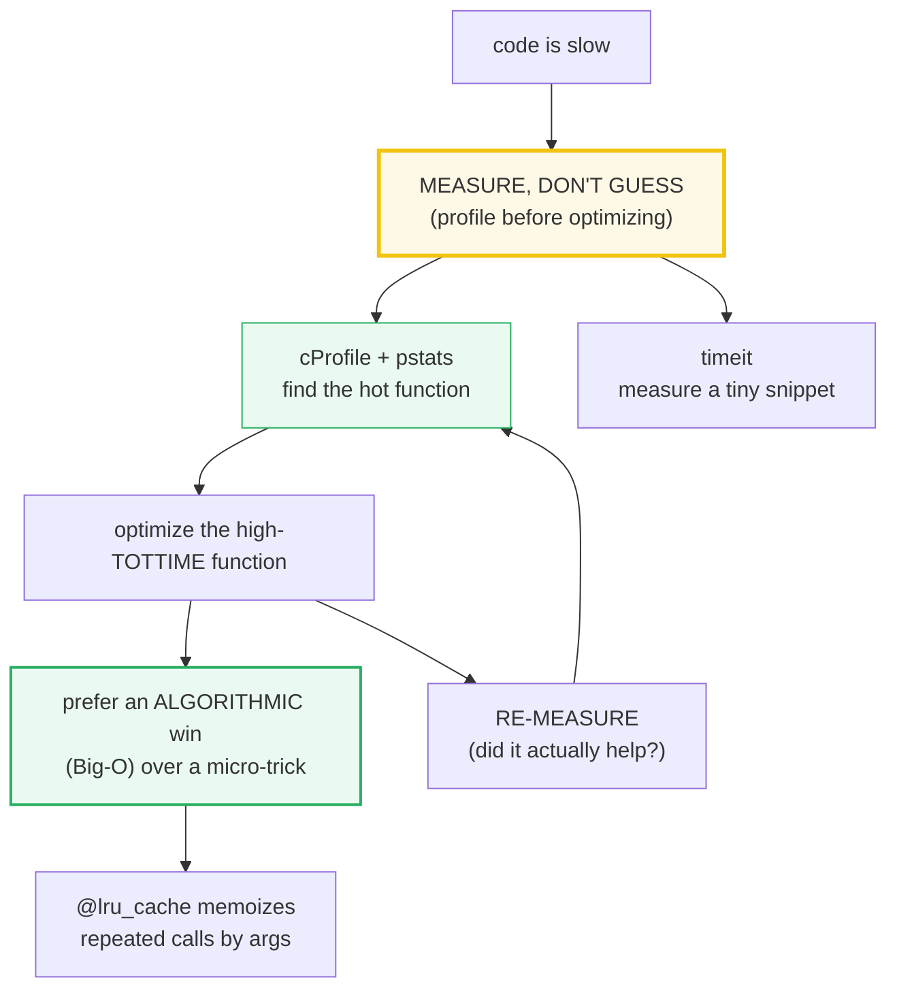
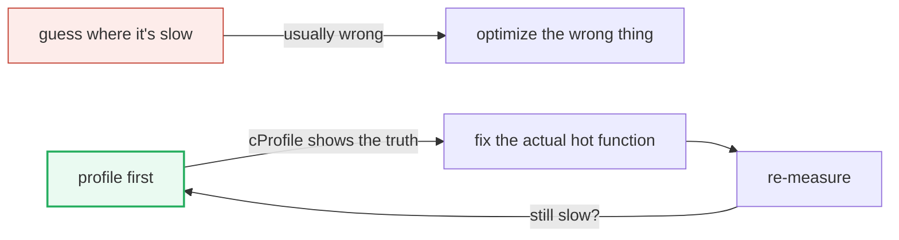
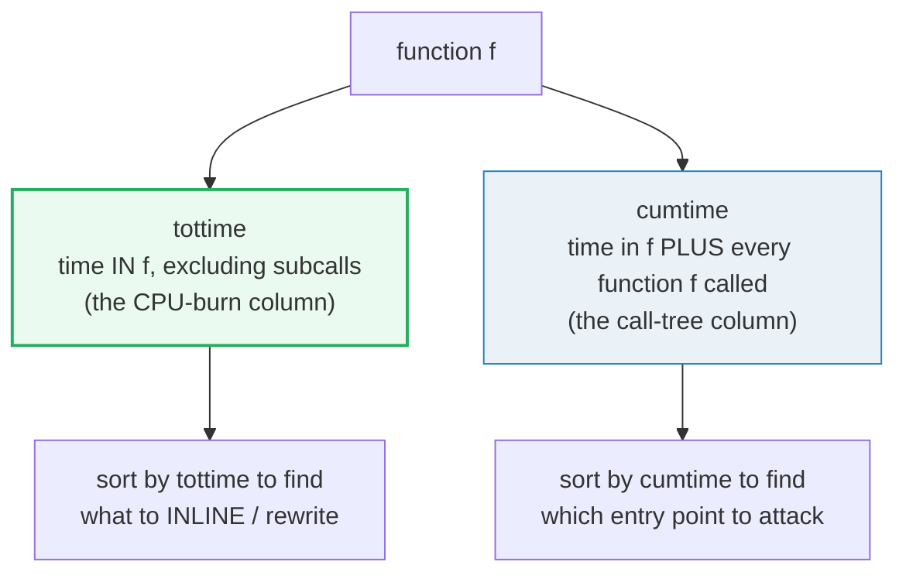
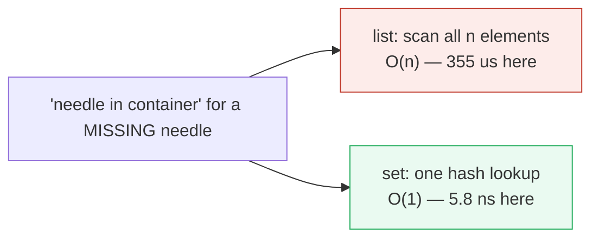
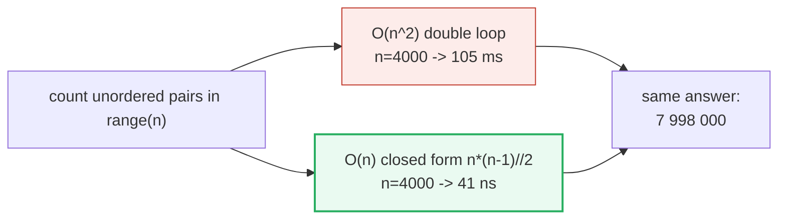
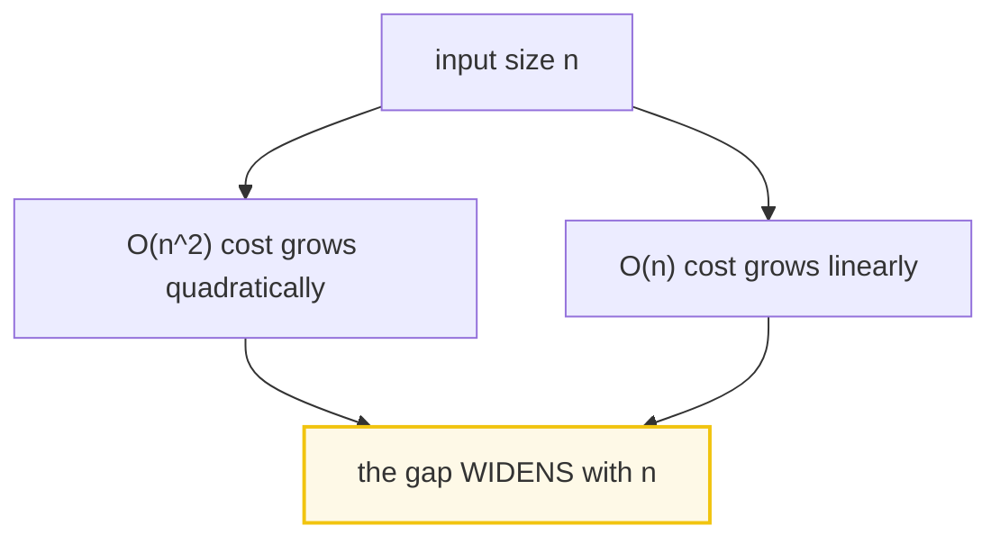

# Profiling & Optimization — Measure, Don't Guess

> **The one rule:** slow code has a *reason*, and the reason is almost never
> where your intuition says it is. Profile first (`cProfile`), measure snippets
> (`timeit`), memoize repeats (`lru_cache`), and reach for a better *algorithm*
> before a clever *trick*. Knuth said it 50 years ago and it is still the law.

**Companion code:** [`profiling_optimization.py`](./profiling_optimization.py).
**Every number, profile dump, and timing below is printed by `uv run python
profiling_optimization.py`** — change the code, re-run, re-paste. Nothing here
is hand-computed. Captured stdout lives in
[`profiling_optimization_output.txt`](./profiling_optimization_output.txt).

> **Timing digits are ILLUSTRATIVE** — they vary per run, machine, and load. The
> `.py` asserts only *structural* and *relative* facts (the optimized version is
> faster; `lru_cache` shrinks the call count; the profile lists the expected
> functions). Never trust an absolute microsecond from a single run.

**Goal of this bundle (lineage, old → new):**

> from *"my code is slow, I'll guess why"*
> → *"measure don't guess: `cProfile` finds the hot function, `timeit`
> measures a snippet, `@lru_cache` memoizes repeats, and algorithmic (Big-O)
> wins beat micro-optimization every time."*

🔗 This is bundle **#24 of Phase 4**. The bytecode-level reason *locals beat
globals* is the subject of [`BYTECODE_INTERNALS`](./BYTECODE_INTERNALS.md)
(P4 #23); the decorator mechanics of `@lru_cache` live in
[`DECORATORS_DEEP`](./DECORATORS_DEEP.md) (P2 #14); the memory cost of choosing
a `set` over a `list` is covered in [`MEMORY_EFFICIENCY`](./MEMORY_EFFICIENCY.md)
(P4 #25). See [`TODO.md`](./TODO.md) for the full plan.

---

## 0. The five ideas on one page



| Tool / idea | Answers | When to reach for it |
|---|---|---|
| `cProfile` + `pstats` | *Which* function eats the time? | first — always profile before optimizing |
| `pstats` **tottime** | where does the CPU actually burn? | the column to sort by when hunting hotspots |
| `pstats` **cumtime** | which call-tree entry point is expensive? | finding the high-level offender |
| `timeit` | how fast is this *one* snippet? | comparing two micro-alternatives head-to-head |
| `@lru_cache` | can I avoid recomputing this? | pure functions called repeatedly with the same args |
| **Big-O** | will this scale? | before any micro-optimization — an O(n) win beats a 2× constant |

---

## 1. The "measure, don't guess" law



Donald Knuth's 1974 paper coined the aphorism every engineer half-quotes:
*"We should forget about small efficiencies, say about 97% of the time:
premature optimization is the root of all evil. Yet we should not pass up our
opportunities in that critical 3%."* The half everyone forgets is the second
sentence — there *is* a critical 3%, and you find it by **measuring**, not
guessing. Human intuition about where a program spends its time is notoriously
bad: the expensive line is rarely the "complex-looking" one.

The workload for this bundle is naive recursive `fib(20)`. Before reading the
profile in §2, guess how many function calls it makes. The answer — printed by
the `.py`, not hand-computed — is over **twenty thousand** for a single value.
That exponential call count *is* the hotspot, and only a profile surfaces it.

> From `profiling_optimization.py` Section A:
> ```
> ======================================================================
> SECTION A — The 'measure don't guess' law
> ======================================================================
> Knuth (1974): 'We should forget about small efficiencies, say about
> 97% of the time: premature optimization is the root of all evil. Yet
> we should not pass up our opportunities in that critical 3%.'
> 
> THE LAW: profile BEFORE optimizing. Intuition about WHERE time goes
> is usually wrong. The disciplined loop is:
> 
>     profile -> find hot function -> optimize -> RE-MEASURE
> 
> Workload for this bundle: naive recursive fib(20). Before reading the
> profile in Section B, GUESS how many calls fib_naive(20) makes. The
> answer is printed below — almost nobody intuits the blow-up.
> 
> fib_naive(20) made 21891 function calls to compute ONE value.
> That exponential call count IS the hotspot — and only a profile
> makes it obvious. Guessing would have you optimize the wrong thing.
> 
> [check] fib_naive(20) makes over 20_000 calls (exponential blow-up): OK
> ```

### Why deterministic profiling is cheap enough (internals)

`cProfile` does **deterministic** profiling — every function call, return, and
exception event is instrumented with precise timings. The docs explain why this
is affordable in Python: because the interpreter is already active on every
operation, the per-event hook adds only a small constant; the interpreted
overhead dominates anyway. Contrast this with **statistical** profiling (e.g.
`py-spy`), which samples the instruction pointer at intervals and deduces where
time goes — lower overhead, but only *relative* indications. Use `cProfile` for
development; reach for a sampling profiler only for long-running production
processes where `cProfile`'s overhead would be too disruptive.

---

## 2. `cProfile` a workload + `pstats` top functions

`cProfile` (recommended over the pure-Python `profile` for its lower overhead)
exposes two interfaces: the one-liner `cProfile.run('expr')`, and the
object-level `Profile()` with `enable()` / `disable()` for precise control. We
use the latter so we can capture the profile to a `pstats.Stats` object and
sort it two ways: by **cumulative** time (the call-tree cost) and by **tottime**
(the time spent *inside* the function itself).

> From `profiling_optimization.py` Section B:
> ```
> ======================================================================
> SECTION B — cProfile a workload + pstats top functions
> ======================================================================
> cProfile is a DETERMINISTIC profiler: it instruments every function
> call/return and records precise timings. We profile fib_naive(20) and
> print the top functions two ways — by CUMULATIVE time (call-tree
> cost) and by TOTTIME (time inside the function itself).
> 
> --- top 8 by CUMULATIVE time (incl. subcalls) ---
>          21892 function calls (2 primitive calls) in 0.002 seconds
> 
>    Ordered by: cumulative time
> 
>    ncalls  tottime  percall  cumtime  percall filename:lineno(function)
>   21891/1    0.002    0.000    0.002    0.002 profiling_optimization.py:60(fib_naive)
>         1    0.000    0.000    0.000    0.000 {method 'disable' of '_lsprof.Profiler' objects}
> 
> 
> 
> --- top 8 by TOTTIME (time IN this function) ---
>          21892 function calls (2 primitive calls) in 0.002 seconds
> 
>    Ordered by: internal time
> 
>    ncalls  tottime  percall  cumtime  percall filename:lineno(function)
>   21891/1    0.002    0.000    0.002    0.002 profiling_optimization.py:60(fib_naive)
>         1    0.000    0.000    0.000    0.000 {method 'disable' of '_lsprof.Profiler' objects}
> 
> 
> 
> pstats reports fib_naive ncalls = 21891
> 
> [check] 'fib_naive' appears in the profiled function set: OK
> [check] profiled ncalls is large (>20_000, the exponential cost): OK
> ```

### Reading the ncalls column — `total/primitive`

The `21891/1` in the `ncalls` column means **21891 total calls, 1 primitive
call**. The docs: "when there are two numbers … the second value is the number
of primitive calls and the former is the total number of calls." A *primitive*
call is one not induced by recursion (the single top-level `fib_naive(20)`
entry); the other 21,890 are recursive self-calls. When a function does *not*
recurse, only one number is printed. `sort_stats(SortKey.CUMULATIVE)` orders by
`cumtime` (good for "which entry point is expensive?");
`sort_stats(SortKey.TIME)` orders by `tottime` (good for "where does the CPU
burn?"). For this trivial workload both point at `fib_naive`; in a real program
they diverge — and that divergence is the whole point of §3.

**Command-line equivalent:** `python -m cProfile -s cumulative -o restats
myscript.py`, then browse with `python -m pstats restats`.

---

## 3. Reading `pstats` columns — `tottime` vs `cumtime`



The two columns that decide where to optimize:

- **`tottime`** — total time spent in the function *excluding* time in the
  functions it calls. This is the number to sort by when hunting hotspots: a
  high `tottime` means the CPU is burning *in this function's own body*.
- **`cumtime`** — cumulative time from invocation to exit, *including* all
  subfunctions (accurate even for recursion). High `cumtime` but low `tottime`
  means the cost is in what the function *calls*, not its own body — attack the
  callee, not the caller.

> From `profiling_optimization.py` Section C:
> ```
> ======================================================================
> SECTION C — Reading pstats columns: ncalls / tottime / cumtime
> ======================================================================
> Every pstats row has five timing columns. The two that matter most:
> 
> column    meaning
> --------------------------------------------------------------------
> ncalls    times the function was called (total/primitive if recursive)
> tottime   time IN the function, EXCLUDING subcalls
> percall   tottime / ncalls
> cumtime   time in the function PLUS all subcalls it made
> percall   cumtime / primitive calls
> 
> RULE: optimize the high-TOTTIME function (where the CPU burns).
> CUMTIME shows the call-tree cost (which entry point to attack).
> 
> For fib_naive(15) from the profile:
>   primitive calls (cc) = 1
>   total calls (nc)     = 1973
>   tottime              = 0.000207 s  (varies per run)
>   cumtime              = 0.000207 s  (varies per run)
>   cumtime >= tottime  -> True  (the excess is recursive subcalls)
> 
> [check] total calls (nc) >= primitive calls (cc) always: OK
> [check] cumtime >= tottime always holds: OK
> [check] fib_naive(15) total calls is large (recursion): OK
> ```

### Why `cumtime >= tottime` is an invariant (internals)

By definition `cumtime = tottime + sum(cumtime of every callee)`. Since the
callee sum is non-negative, `cumtime >= tottime` always holds — the `.py`
asserts it. For `fib_naive(15)` they happen to be *equal* here only because the
profiler attributes all recursive time to the single `fib_naive` row (there is
no *other* callee to shift cost into); in a function that calls helpers, the
gap between `cumtime` and `tottime` is exactly the cost of those helpers. The
profiler docs note this "unusual handling of cumulative times … allows
statistics for recursive implementations to be directly compared to iterative
implementations" — a recursion and its loop equivalent become apples-to-apples.

---

## 4. `timeit` — `set` membership O(1) beats `list` membership O(n)



`timeit` is purpose-built for comparing tiny snippets. It avoids the common
traps of naive timing: it uses `time.perf_counter()` (the highest-resolution
monotonic clock), **suspends garbage collection** during the run so independent
timings are comparable, and runs the statement `number` times in a tight loop to
amplify the signal above clock resolution. The docs are emphatic that for
`repeat()` you should take the **`min()`** — higher values are interference
from other processes, not variability in Python's speed; "the `min()` of the
result is probably the only number you should be interested in."

Here we search for a *missing* needle (`-1`) in a `list` vs a `set` of 100 000
ints. List membership is a linear scan (O(n)); set membership is a hash lookup
(O(1)). The per-operation times differ by **four to five orders of magnitude**.

> From `profiling_optimization.py` Section D:
> ```
> ======================================================================
> SECTION D — timeit: set membership O(1) beats list membership O(n)
> ======================================================================
> timeit measures a tiny snippet many times with minimal overhead
> (default timer = time.perf_counter; GC is suspended during timing).
> We search for a MISSING needle (-1) in a list vs a set of 100_000
> ints. List membership scans all n elements (O(n)); set membership is
> a hash lookup (O(1)). Per docs, take min() of repeat() — the minimum
> is the only meaningful number (higher values are noise/interference).
> 
> list 'needle in lst': best per-op =   355.81 us  (varies per run)
> set  'needle in st':  best per-op =      5.8 ns  (varies per run)
> list is ~61210x slower than set for a missing element
> 
> [check] set membership faster than list membership for large n: OK
> [check] the set-vs-list gap is large (ratio > 10x): OK
> ```

### Why the profiler is NOT a benchmark (internals)

The profiler docs warn explicitly: `cProfile`/`profile` "are designed to
provide an execution profile … not for benchmarking purposes (for that, there
is `timeit`)." The reason: the profiler adds overhead to *Python-level* calls
but not to *C-level* functions, so a C function will look artificially fast
next to a Python one. When you need an honest head-to-head between two snippets,
use `timeit` — its only overhead is the loop itself. 🔗 The memory cost of that
`set` (a hash table with load-factor slack) vs a compact `list` is the trade
explored in [`MEMORY_EFFICIENCY`](./MEMORY_EFFICIENCY.md).

---

## 5. `@lru_cache` — exponential `fib` → linear (call-count proof)

`functools.lru_cache` wraps a function in a memoizing layer: each distinct
argument tuple is computed **once**, and every later call with the same args is
an O(1) dictionary lookup. The cache is keyed by the *hash* of the arguments,
so they must be hashable. The wrapped function gains three helpers:
`cache_info()` → a named tuple `(hits, misses, maxsize, currsize)`,
`cache_clear()`, and `cache_parameters()`. The original function is reachable
via `__wrapped__` (to bypass or re-wrap the cache).

Naive recursive `fib(20)` makes **21 891** calls; the memoized version makes
**39** (21 misses — `fib(0)…fib(20)` computed once each — plus 18 cache hits).
That is an exponential → linear transformation with no change to the algorithm
shape, just the `@lru_cache(maxsize=None)` line.

> From `profiling_optimization.py` Section E:
> ```
> ======================================================================
> SECTION E — lru_cache: exponential fib -> linear (call-count proof)
> ======================================================================
> @lru_cache memoizes by arguments: each distinct arg tuple is computed
> once; later calls are O(1) dict lookups. We reset the manual counter,
> run naive fib(20); then run cached fib(20) on a fresh cache and read
> cache_info() -> (hits, misses, maxsize, currsize).
> 
> fib_naive(20)  = 6765   calls = 21891
> fib_cached(20) = 6765  cache_info = CacheInfo(hits=18, misses=21, maxsize=None, currsize=21)
> naive made 21891 calls; cached made 39 calls (21 misses + 18 hits).
> 
> [check] both versions compute the same fib(20): OK
> [check] cached total calls (hits+misses) << naive count: OK
> [check] cached misses == 21 (fib(0)..fib(20) computed once each): OK
> [check] cache currsize == 21 (one entry per distinct arg): OK
> ```

### When NOT to use `lru_cache` (internals)

The docs are clear: the LRU cache "should only be used when you want to reuse
previously computed values." Do **not** cache functions with side effects,
functions that must return distinct mutable objects each call (generators,
async functions), or impure functions like `time()` / `random()`. The cache
keeps **references** to all arguments and return values until they age out, so
caching functions that take large or rapidly-changing arguments can leak
memory. `maxsize=None` (used here, equivalent to `@functools.cache`) disables
eviction and grows without bound; for a long-running process use a bounded
`maxsize` so the LRU eviction policy can reclaim entries. 🔗 The decorator
machinery (`__wrapped__`, `functools.wraps`) is dissected in
[`DECORATORS_DEEP`](./DECORATORS_DEEP.md).

---

## 6. Algorithmic wins — O(n) formula beats O(n²) loop





Big-O dominates constant factors. Counting the unordered pairs `(i, j)` with
`i < j` in `range(n)` has a closed form `n*(n-1)//2`; the obvious double loop
gives the same answer but does O(n²) work. At `n = 4000` the loop takes ~105 ms
while the formula takes ~41 **nanoseconds** — a million-fold difference that no
micro-optimization of the loop body can ever close. This is the deepest lesson
of the bundle: **a better algorithm beats a faster bad algorithm, every time.**
Reach for the algorithmic improvement first; only then micro-optimize the
hotspot that remains.

> From `profiling_optimization.py` Section F:
> ```
> ======================================================================
> SECTION F — Algorithmic wins: O(n) formula beats O(n^2) loop
> ======================================================================
> Big-O dominates constant factors. Counting unordered pairs in
> range(n): an O(n^2) double loop vs the O(n) closed form n*(n-1)//2.
> Both give the same answer; the formula is vastly faster for large n.
> This is WHY algorithms matter more than micro-optimizing a bad one.
> 
> n = 4000: O(n^2) loop     count = 7998000   best = 105.59 ms  (varies per run)
> n = 4000: O(n)   formula  count = 7998000   best = 41.3 ns  (varies per run)
> 
> [check] O(n^2) loop and O(n) formula agree on the count: OK
> [check] the O(n) formula is faster than the O(n^2) loop: OK
> ```

### Why the gap *widens* with n (internals)

A constant-factor speedup (say, a 10× faster inner loop) shifts the curve
*down* but does not change its *shape*: O(n²)/10 still overtakes O(n) for large
enough n. Swapping the *algorithm* changes the exponent, which is the only kind
of win that scales. This is why the profiler is step zero — it tells you whether
your hotspot is a constant-factor problem (micro-optimize the body) or an
algorithmic problem (replace the approach). `cumtime`-sorted `pstats` answers
the latter: if a single entry point's `cumtime` grows super-linearly with input
size, no amount of inlining will save you.

---

## 7. Micro-optimization pitfalls — locals, readability, premature opt

The one micro-optimization worth knowing: in a **hot loop**, a local variable
is accessed via `LOAD_FAST` (a fixed array slot) while a global is accessed via
`LOAD_GLOBAL` (a dict lookup by name). Binding a global to a local once, before
the loop, replaces the per-iteration dict lookup with an array index. The
bytecode (via `dis`) makes the difference literal. But note the payoff here is
**small** (~6 %) — the loop is dominated by `range` iteration and the
`BINARY_OP`. This is exactly the point: the micro-win is real but marginal, so
apply it only to a *measured* hotspot, never speculatively.

> From `profiling_optimization.py` Section G:
> ```
> ======================================================================
> SECTION G — Micro-optimization pitfalls: locals, readability, premature opt
> ======================================================================
> 'Locals are faster than globals' — TRUE, but only in HOT loops. A
> global is LOAD_GLOBAL (dict lookup by name each access); a local is
> LOAD_FAST (array slot). The bytecode (dis) reveals why; the timing
> shows the payoff. The speedup is real but SMALL — apply it ONLY to a
> measured hotspot, never at the cost of readability.
> 
> --- loop_global: how _GVAR is accessed inside the loop ---
>     LOAD_GLOBAL          _GVAR
> --- loop_local: how g_local is accessed inside the loop ---
>     LOAD_FAST_LOAD_FAST  acc, g_local
> 
> loop_global(200000): best/iter = 2.72 ms  (varies per run)
> loop_local(200000):  best/iter = 2.56 ms  (varies per run)
> 
> [check] loop_global and loop_local return the same value: OK
> [check] loop_global accesses _GVAR via LOAD_GLOBAL: OK
> [check] loop_local accesses g_local via LOAD_FAST: OK
> LESSON: profile first. Bind globals to locals ONLY inside a measured
> hot loop — readability beats a guessed micro-win the other 97% of the time.
> ```

### Why `LOAD_FAST` beats `LOAD_GLOBAL` (internals)

A Python frame stores locals in a flat C array (`frame->localsplus`); `LOAD_FAST
i` is a single pointer dereference at a known index — the fastest variable
access in the language. Globals live in the module's `__dict__`; `LOAD_GLOBAL`
must hash the name, probe the dict, and (since 3.11) consult a per-code-object
adaptive cache (`co_consts`-backed). The cache narrows the gap, but a dict probe
is still more work than an array index. CPython 3.12+ further folds paired
local loads into a single `LOAD_FAST_LOAD_FAST` (visible above: `acc, g_local`
in one instruction) — the compiler does this micro-opt *for* you when it can.
🔗 The full bytecode model — frames, the eval loop, the adaptive specializing
interpreter — is the subject of [`BYTECODE_INTERNALS`](./BYTECODE_INTERNALS.md).

---

## Pitfalls

| Trap | Example | The fix |
|---|---|---|
| Optimizing before profiling | rewriting a function that is 0.1 % of runtime | `cProfile` first; sort by `tottime`; attack the actual hot function |
| Confusing `tottime` and `cumtime` | "this function is slow" when its `cumtime` is high but `tottime` is ~0 | high `cumtime` + low `tottime` ⇒ the cost is in the *callees*, not this function |
| Benchmarking with the profiler | using `cProfile` numbers to compare two snippets | profiler adds overhead to Python calls but not C calls → use `timeit` for honest head-to-head |
| Taking the mean of `timeit.repeat` | averaging away the signal with noise | take `min()` — higher values are interference, the docs say min is "the only number you should be interested in" |
| `@lru_cache` on a non-pure function | caching `time()` or a function returning fresh mutable objects | only cache pure functions whose return value depends solely on hashable args |
| Unbounded `lru_cache(maxsize=None)` in a long-running process | memory grows forever as distinct args accumulate | use a bounded `maxsize`, or `@cache` only for small/fixed argument domains |
| Caching functions with unhashable args | `lru_cache` on a function taking a `list` → `TypeError` | arguments must be hashable; convert to `tuple`/`frozenset` or skip caching |
| Micro-optimizing readability for ~5 % | obfuscating a loop to bind globals to locals everywhere | only bind globals to locals inside a *measured* hot loop; readability wins the other 97 % |
| Guessing the algorithm is the bottleneck | tuning constants on an O(n²) loop instead of replacing it | an O(n) replacement beats any constant-factor win on the O(n²) version for large n |
| Trusting a single timing run | one `timeit` number is dominated by a GC/scheduling hiccup | `repeat` ≥ 5 and take `min()`; treat absolute microseconds as illustrative |
| Comparing floats from timing with `==` | `t1 == t2` is meaningless for measured times | compare ordering (`t1 < t2`) and ratios, never equality |

---

## Cheat sheet

- **The law:** profile *before* optimizing. Knuth: "premature optimization is
  the root of all evil" — but don't ignore the critical 3 %. Measure to find it.
- **`cProfile`:** deterministic profiler (C extension, low overhead). Use
  `pr = cProfile.Profile(); pr.enable(); …; pr.disable()` then
  `pstats.Stats(pr)`. CLI: `python -m cProfile -s cumulative script.py`.
- **`pstats` columns:** `ncalls` (`total/primitive` if recursive), `tottime`
  (IN the function, excl. subcalls — **sort by this to find hotspots**),
  `cumtime` (incl. subcalls — **sort by this to find expensive entry points**).
  `cumtime >= tottime` always.
- **`timeit`:** measures a snippet with GC suspended, `time.perf_counter` clock.
  Take `min(timeit.repeat(stmt, setup, number, repeat=5))` — the docs say the
  minimum is the only meaningful number. Not for benchmarking C vs Python (use
  it for snippet-vs-snippet, not via the profiler).
- **`@lru_cache(maxsize=N)`:** memoizes by hashable args; `cache_info()` →
  `(hits, misses, maxsize, currsize)`; `cache_clear()`; `__wrapped__` bypasses.
  `maxsize=None` (≡ `@functools.cache`) is unbounded. Only cache pure
  functions.
- **Big-O dominates:** an O(n) algorithm beats an O(n²) one for large n no
  matter the constant factor. Fix the algorithm before the constant.
- **Locals > globals:** `LOAD_FAST` (array slot) beats `LOAD_GLOBAL` (dict
  probe). Matters only in *measured* hot loops — never sacrifice readability for
  a guess. 🔗 [`BYTECODE_INTERNALS`](./BYTECODE_INTERNALS.md) for the why.

---

## Sources

- **Python docs — The Python Profilers (`cProfile`, `profile`, `pstats`).**
  https://docs.python.org/3/library/profile.html
  *The authoritative reference for deterministic profiling, the `Profile`
  class (`enable`/`disable`/`dump_stats`), the `Stats` class
  (`sort_stats`, `print_stats`, `SortKey`), the `ncalls`/`tottime`/`cumtime`
  column definitions, and the warning that profilers are "not for benchmarking
  purposes." Quoted in §1, §2, §3, and §4.*
- **Python docs — `timeit`: Measure execution time of small code snippets.**
  https://docs.python.org/3/library/timeit.html
  *The `timeit()`/`repeat()`/`Timer` API; the default timer is
  `time.perf_counter()`; GC is suspended during timing; the note that
  `min()` of `repeat()` is "the only number you should be interested in."
  Basis for §4.*
- **Python docs — `functools.lru_cache`.**
  https://docs.python.org/3/library/functools.html#functools.lru_cache
  *The `@lru_cache(maxsize=128, typed=False)` signature; `cache_info()` returns
  a named tuple `(hits, misses, maxsize, currsize)`; `maxsize=None` disables
  eviction; args must be hashable; "should only be used when you want to reuse
  previously computed values." The `fib` example and its `CacheInfo(hits=28,
  misses=16, …)` are the model for §5.*
- **Python docs — `time.perf_counter`.**
  https://docs.python.org/3/library/time.html#time.perf_counter
  *The highest-resolution monotonic clock that `timeit` uses by default since
  Python 3.3.*
- **Donald Knuth — "Structured Programming with go to Statements" (1974).**
  https://en.wikipedia.org/wiki/Program_optimization
  *Origin of "We should forget about small efficiencies, say about 97% of the
  time: premature optimization is the root of all evil. Yet we should not pass
  up our opportunities in that critical 3%." Quoted in full in §1.*
- **Wikipedia — Program optimization.**
  https://en.wikipedia.org/wiki/Program_optimization
  *Independent confirmation of the Knuth attribution and the "critical 3 %"
  context; the O(n) vs O(n²) scaling intuition behind §6.*
- **CPython source — `_lsprof` / `pstats`.**
  https://github.com/python/cpython/tree/3.14/Lib/pstats.py
  *The `Stats.stats` dict maps `(file, line, name) → (cc, nc, tt, ct, callers)`
  where `cc` = primitive calls, `nc` = total calls — the structure §2 and §3
  inspect programmatically.*
