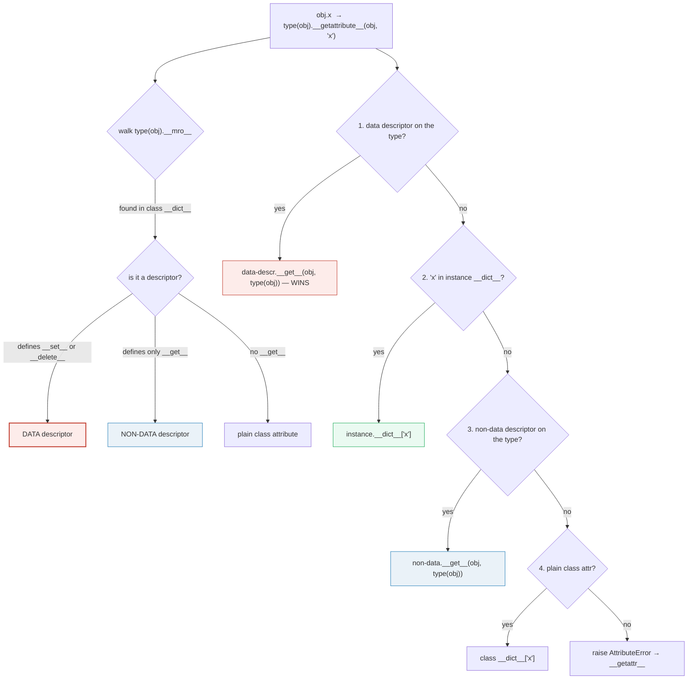
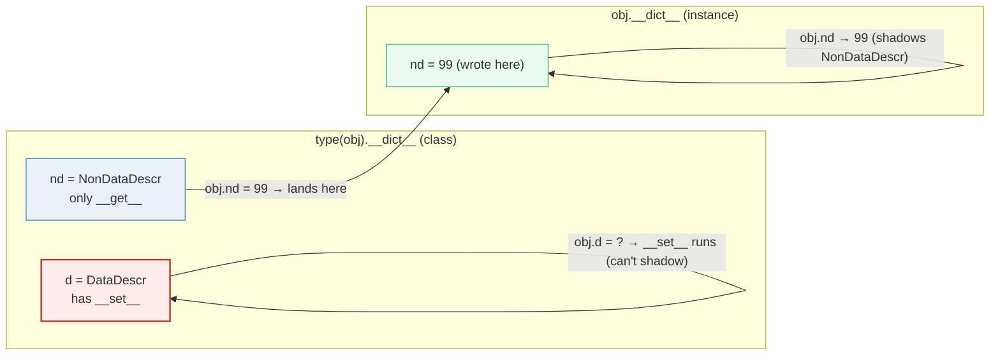

# Properties & Descriptors — The ONE Mechanism Behind `@property`, Methods, `classmethod`, `staticmethod`, and `__slots__`

> **The one rule:** a *descriptor* is any object that defines `__get__`
> (and optionally `__set__` / `__delete__`). Descriptors **only** work as
> **class** attributes. The single distinction between a *data* descriptor
> (has `__set__` or `__delete__`) and a *non-data* descriptor (only `__get__`)
> explains every surprising fact about Python attribute access: why `@property`
> validation always fires, why methods bind `self`, and why a `__slots__` class
> has no `__dict__`.

**Companion code:** [`properties_descriptors.py`](./properties_descriptors.py).
**Every number and table below is printed by `uv run python
properties_descriptors.py`** — change the code, re-run, re-paste. Nothing here
is hand-computed. Captured stdout lives in
[`properties_descriptors_output.txt`](./properties_descriptors_output.txt).

**Goal of this bundle (lineage, old → new):**

> from *"I know `@property` is a getter"*
> → *"descriptors are the mechanism behind `property`, methods, `classmethod`,
> `staticmethod`, and `__slots__` — the single idea that explains ALL attribute
> access."*

🔗 This is bundle **#12 of Phase 2**. It builds directly on
[`DUNDER_METHODS`](./DUNDER_METHODS.md) (#10: "every operator is a dunder lookup
on the TYPE") and [`CLASSES_BASICS`](./CLASSES_BASICS.md) (#9: class vs instance
attributes, why methods bind `self`). The function-as-descriptor story here is
the *mechanism* behind the bound-vs-unbound method picture in CLASSES_BASICS
§D. `__set_name__` firing at class creation is the natural on-ramp to
[`METACLASSES`](./METACLASSES.md) (#13: customizing `type.__new__`), and the
`__slots__` memory payoff is explored fully in
[`MEMORY_EFFICIENCY`](./MEMORY_EFFICIENCY.md) / [`MEMORY_MODEL`](./MEMORY_MODEL.md)
(Phase 3). See [`TODO.md`](./TODO.md) for the full plan.

---

## 0. The one picture



The **precedence chain** for `obj.x` is, verbatim from the
[descriptor how-to](https://docs.python.org/3/howto/descriptor.html#invocation-from-an-instance):

> **data descriptor on the type  >  instance `__dict__`  >  non-data descriptor
> on the type  >  plain class attribute  >  `__getattr__`**

That single ordering is the whole story. Everything below is a worked example of
it.

| Construct | Is it a descriptor? | Data or non-data? | What `__get__` returns |
|---|---|---|---|
| `@property` | yes | **data** (`__get__` + `__set__`) | result of the getter |
| plain function | yes | **non-data** (only `__get__`) | `function` from class; **bound method** from instance |
| `@staticmethod` | yes | non-data | the bare function (no self/cls) |
| `@classmethod` | yes | non-data | a bound method with `cls` bound |
| `__slots__` member | yes | **data** (member descriptor) | the slot's stored value |
| regular class var | no | — | the value, untouched |

---

## 1. `@property`: getter, setter, deleter, and validation

`@property` is sugar over the [`property()`](https://docs.python.org/3/library/functions.html#property)
builtin — it builds a **data descriptor** (`__get__` + `__set__` + `__delete__`)
that intercepts *every* read, assignment, and deletion of an attribute. The
setter is where you put validation; because it's a data descriptor, **the setter
runs on every assignment** — you cannot bypass it by stuffing a value into
`instance.__dict__` under the public name (the public name never lands there).

> From `properties_descriptors.py` Section A:
> ```
> ======================================================================
> SECTION A — @property: getter, setter, deleter, and validation
> ======================================================================
> @property is sugar over the property() builtin. It builds a DATA
> descriptor: reading `obj.fahrenheit` calls the getter; assigning
> calls the setter; `del` calls the deleter. The setter is where you
> put validation that runs on EVERY assignment.
> 
> Celsius(0).fahrenheit         = 32.0   (32°F, getter)
> t.fahrenheit = 212; ._celsius  = 100.0   (100°C, via setter)
>   (deleter fired: zeroing _celsius)
> after `del t.fahrenheit`        ._celsius = 0.0
> 
> t.fahrenheit = -500  ->  ValueError: -500°F is below absolute zero (-459.67°F)
> 
> [check] Celsius(0).fahrenheit == 32 (getter computes on read): OK
> [check] setter validation rejects -500°F (below absolute zero): OK
> [check] boiling point round-trips to 100°C: OK
> [check] the @property object has __get__: OK
> [check] the @property object has __set__  (so it is a DATA descriptor): OK
> ```

### Why the setter always fires (internals)

`property` is the canonical data descriptor: its C implementation
(`PyProperty_Type` in `Objects/descrobject.c`) defines `tp_descr_get` *and*
`tp_descr_set`. Because it has `__set__`, the attribute-lookup precedence puts
it **above** the instance `__dict__`. So `obj.fahrenheit = 212` is dispatched to
`property.__set__`, which calls your `@fahrenheit.setter` function with
`(self, 212)`. The actual value lives under a different key (here `_celsius`),
so the *public* name `fahrenheit` is never a key in `instance.__dict__` and
cannot be bypassed. This is exactly why `@property` is the right tool for
invariants that must hold on **every** assignment — there is no back door.

🔗 `@property` is also the standard way to build a **read-only** attribute: omit
the setter and `property.__set__` raises `AttributeError: can't set attribute`.
For the broader dunder-protocol picture (which `__getattribute__` drives all of
this), see [`DUNDER_METHODS`](./DUNDER_METHODS.md) §A.

---

## 2. The descriptor protocol — `__set_name__` / `__get__` / `__set__`; found on the CLASS, not the instance

A **descriptor** is any object defining `__get__(self, obj, objtype=None)`
(and optionally `__set__(self, obj, value)` and `__delete__(self, obj)`).
Two non-negotiable rules, both from the
[descriptor how-to](https://docs.python.org/3/howto/descriptor.html#definition-and-introduction):

1. **Descriptors only work as class attributes.** Put one in an instance dict and
   it does nothing — the lookup machinery only consults descriptors found by
   walking `type(obj).__mro__`.
2. **`__set_name__` is called automatically by `type.__new__` at class creation.**
   The `type` metaclass scans the new class's `__dict__`; for every entry that
   defines `__set_name__`, it calls `entry.__set_name__(owner_class, attr_name)`.
   This is how a descriptor learns the public name it was assigned to.

> From `properties_descriptors.py` Section B:
> ```
> ======================================================================
> SECTION B — The descriptor protocol: __set_name__ / __get__ / __set__
> ======================================================================
> A descriptor is any object defining __get__ (and optionally
> __set__ / __delete__). Descriptors ONLY work as CLASS attributes:
> they live in type(instance).__dict__, never in instance.__dict__.
> __set_name__ is called automatically by type.__new__ at class
> creation time, passing (owner_class, attribute_name).
> 
>   __set_name__('Person', 'age') -> private_name='_logged_age'
>   __set_name__('Person', 'name') -> private_name='_logged_name'
> 
> type(p).__dict__['age'] is a Logged
>   (the descriptor lives on the CLASS, not on p)
> 'age' in p.__dict__           -> False   (public name is NOT in instance dict)
> '_logged_age' in p.__dict__   -> True   (value is stored under the mangled private key)
> p.age                         -> 30   (re-reads via __get__)
> 
> [check] descriptor is stored on type(p), not on p: OK
> [check] descriptor stores value under the private (mangled) key: OK
> [check] __get__ reads back the value set by __set__: OK
> [check] accessing the descriptor on the class returns the descriptor itself: OK
> ```

### Why the descriptor must live on the class (internals)

`obj.x` is implemented by `object.__getattribute__(obj, "x")` (see the
[data-model reference](https://docs.python.org/3/reference/datamodel.html#object.__getattribute__)).
Its first step is `_PyType_Lookup(type(obj), "x")` — a walk of
`type(obj).__mro__` looking in each base's `__dict__`. **Only if it finds a
descriptor there** does it consult `__get__`. The instance's own `__dict__` is
checked *later*, at a different precedence level (see §3). So a descriptor
sitting in `instance.__dict__` is invisible to attribute lookup — `instance.x`
just returns the object itself, unchanged, without calling `__get__`.

The `__set_name__` callback is the bridge to
🔗 [`METACLASSES`](./METACLASSES.md) (#13): the call happens inside `type.__new__`,
which is exactly the machinery a metaclass overrides. If you add a descriptor to a
class *after* creation (`Person.age = Logged()`), `__set_name__` does **not** fire
again — you must call it by hand. That's the first hint that class creation is a
customizable process.

---

## 3. Data vs non-data descriptor — override vs shadow

This is the **single distinction** that explains all of attribute access:

- A **data descriptor** defines `__set__` **or** `__delete__`. It **wins** over
  an entry in the instance `__dict__`. You cannot shadow it by assigning on the
  instance — the assignment *routes through* its `__set__`.
- A **non-data descriptor** defines **only** `__get__`. It is **shadowed** by an
  entry in the instance `__dict__`. The first `instance.x = value` simply writes
  `x` into `instance.__dict__`, and from then on `instance.x` returns that value
  without ever calling `__get__`.



> From `properties_descriptors.py` Section C:
> ```
> ======================================================================
> SECTION C — Data vs non-data: data OVERRIDES instance __dict__
> ======================================================================
> DATA descriptor   (defines __set__ or __delete__): WINS over the
>                                    instance __dict__ entry.
> NON-DATA descriptor (defines only __get__): is SHADOWED by an
>                                    instance __dict__ entry.
> Lookup precedence: data-descr > instance __dict__ > non-data-descr
>                                                          > class var
> 
> Class C has: d = DataDescr() [has __set__], nd = NonDataDescr() [only __get__]
> c.d   (BEFORE assign) -> 'data-descriptor value (always wins)'
> c.nd  (BEFORE assign) -> 'non-data-descriptor value (shadowable)'
> c.nd = 99  -> c.__dict__['nd'] = 99
> c.nd  (AFTER  assign) -> 99   (instance __dict__ SHADOWS the non-data descriptor)
> c.d = 99   -> AttributeError: DataDescr cannot be shadowed by instance assignment
> 
> [check] non-data descriptor speaks BEFORE any instance assignment: OK
> [check] instance __dict__ shadows a NON-DATA descriptor: OK
> [check] the shadow value landed in the instance __dict__: OK
> [check] DATA descriptor blocks instance assignment via __set__: OK
> [check] DataDescr has __set__ (so it is data): OK
> [check] NonDataDescr has __get__ but NOT __set__: OK
> ```

### Why the precedence is exactly that order (internals)

The pure-Python equivalent in the
[descriptor how-to](https://docs.python.org/3/howto/descriptor.html#invocation-from-an-instance)
(`object_getattribute`) makes it literal:

```python
def object_getattribute(obj, name):
    null = object()
    objtype = type(obj)
    cls_var = find_name_in_mro(objtype, name, null)      # type's __mro__ walk
    descr_get = getattr(type(cls_var), '__get__', null)
    if descr_get is not null:
        if (hasattr(type(cls_var), '__set__')            # DATA descriptor?
            or hasattr(type(cls_var), '__delete__')):
            return descr_get(cls_var, obj, objtype)      # → step 1: data wins
    if hasattr(obj, '__dict__') and name in vars(obj):
        return vars(obj)[name]                           # → step 2: instance dict
    if descr_get is not null:
        return descr_get(cls_var, obj, objtype)          # → step 3: non-data
    if cls_var is not null:
        return cls_var                                   # → step 4: plain class attr
    raise AttributeError(name)
```

The `__set__`/`__delete__` probe happens *once*, up front, to classify the
descriptor. That classification is then reused to pick step 1 vs step 3. This is
why adding an empty `def __set__(self, obj, value): raise AttributeError` to a
descriptor is enough to make it read-only data — it flips the precedence in the
caller, even though your `__set__` body always raises.

---

## 4. Hand-rolled `MyProperty` — a data descriptor, just like `@property`

The descriptor protocol is general enough to rebuild `@property` from scratch in
~15 lines. The trick: `__set_name__` records the public name; `__get__` reads
from a **mangled** storage key in the instance `__dict__`; `__set__` writes to
that same key (after validation). Because `__set__` exists, the public name can
**never** be shadowed by instance assignment — exactly like the real `property`.

> From `properties_descriptors.py` Section D:
> ```
> ======================================================================
> SECTION D — Hand-rolled MyProperty: a DATA descriptor, like @property
> ======================================================================
> Here is the descriptor protocol doing exactly what @property does:
> __set_name__ records the public name; __get__ runs the getter;
> __set__ runs the setter and stores the value under a mangled key
> in the instance __dict__. Because it has __set__, it is a DATA
> descriptor — instance assignment can NEVER shadow it.
> 
> Temp(25).celsius             = 25
> 'celsius' in t.__dict__      -> False   (public name never lands in instance dict)
> '_myproperty_celsius' in t.__dict__ -> True   (value is here)
> type(t).__dict__['celsius']  is a MyProperty  (our hand-rolled descriptor, sitting on the class)
> 
> t.celsius = -300  ->  ValueError raised: True
> 
> [check] MyProperty stores the value under the mangled storage key: OK
> [check] MyProperty is a DATA descriptor (has __set__): OK
> [check] public attribute name is NOT in the instance __dict__: OK
> [check] MyProperty setter validation matches @property semantics: OK
> ```

### Why this mirrors the real `property` (internals)

The [pure-Python equivalent of `property`](https://docs.python.org/3/howto/descriptor.html#properties)
in the descriptor how-to is structurally identical to `MyProperty`: it stores
`fget`/`fset`/`fdel`, defines `__get__`/`__set__`/`__delete__`, and the
`.getter`/`.setter`/`.deleter` decorator-methods return new instances (so they
can be stacked). The real C `PyProperty_Type` does the same, just faster. Two
small differences from our toy: the real `property` stores the value wherever
*your getter* reads it from (it does not invent a storage key — you do, via your
getter/setter pair), and its `.setter`/`.deleter` return a **new** `property`
object rather than mutating in place. The data-descriptor behavior — value never
lands in the instance dict under the public name — is identical.

---

## 5. Functions ARE non-data descriptors — `Foo.bar` vs `foo.bar`

A `def` inside a `class` body creates an ordinary `function` object. Functions
define `__get__` (but not `__set__`), so they are **non-data descriptors**. The
`__get__` policy is what turns `foo.bar` into a bound method:

- Accessed on the **class** (`Foo.bar`): `__get__(None, Foo)` returns the bare
  function unchanged.
- Accessed on an **instance** (`foo.bar`): `__get__(foo, Foo)` returns a
  `method` object wrapping `(function=Foo.bar, self=foo)`.

That is *where `self` comes from*. Calling `foo.bar(10)` is exactly
`Foo.bar(foo, 10)`.

> From `properties_descriptors.py` Section E:
> ```
> ======================================================================
> SECTION E — Functions are non-data descriptors: Foo.bar vs foo.bar
> ======================================================================
> A function defines __get__ (but not __set__), so it is a NON-DATA
> descriptor. Accessed on the CLASS, __get__ returns the bare
> function; accessed on an INSTANCE, __get__ returns a BOUND method
> (the function wrapped together with its instance as `self`).
> 
> expression            type        detail
> ----------------------------------------------------------------
> Foo.bar               function    __qualname__='section_e_functions_are_descriptors.<locals>.Foo.bar'
> foo.bar               method      bound to Foo instance
> foo.bar.__func__      function    qualname='section_e_functions_are_descriptors.<locals>.Foo.bar'
> foo.bar.__self__      Foo         is foo? True
> foo.bar(10)            -> 11   (== Foo.bar(foo, 10))
> 
> [check] Foo.bar is the bare function (a function, not a method): OK
> [check] foo.bar is a bound method (NOT a function): OK
> [check] foo.bar.__func__ is Foo.bar: OK
> [check] foo.bar.__self__ is foo: OK
> [check] foo.bar(10) == Foo.bar(foo, 10): OK
> [check] function defines __get__ (so it is a descriptor): OK
> [check] function does NOT define __set__ (so it is a NON-DATA descriptor): OK
> ```

### Why methods can be shadowed by instance attributes (internals + gotcha)

Because functions are **non-data** descriptors, they sit at precedence step 3 —
**below** the instance `__dict__`. So if you do `foo.bar = lambda: 42`, that
lambda lands in `foo.__dict__['bar']`, and from then on `foo.bar` returns the
lambda, *not* the bound method. (The original method on the class is unchanged;
other instances are unaffected.) The
[pure-Python `Function.__get__`](https://docs.python.org/3/howto/descriptor.html#functions-and-methods)
is literally:

```python
def __get__(self, obj, objtype=None):
    if obj is None:
        return self                       # class access → bare function
    return MethodType(self, obj)          # instance access → bound method
```

and the bound method object is just `(func=self, self=obj)` — its `__call__`
runs `func(obj, *args)`. This is the whole reason `self` is prepended.

🔗 This is the mechanism behind "methods bind `self`" in
[`CLASSES_BASICS`](./CLASSES_BASICS.md) §D — the picture there (bound vs
unbound, `p.move.__self__ is p`) is *implemented* by the function's `__get__`
shown here.

---

## 6. `staticmethod` & `classmethod` are descriptors too

`staticmethod` and `classmethod` are descriptor *wrappers* stored in the class
`__dict__`, sitting in front of a plain function. They differ only in their
`__get__` policy:

| Wrapper | `__get__(obj, cls)` returns | Net effect of the call |
|---|---|---|
| `staticmethod(f)` | the bare `f` | `f(*args)` — no `self`, no `cls` |
| `classmethod(f)` | `MethodType(f, cls)` | `f(cls, *args)` — `cls` is bound |

> From `properties_descriptors.py` Section F:
> ```
> ======================================================================
> SECTION F — staticmethod & classmethod are descriptors too
> ======================================================================
> staticmethod.__get__ returns the bare function (no self, no cls).
> classmethod.__get__ binds the CLASS as the first argument (cls).
> Both are descriptors sitting in the class __dict__, just like
> ordinary functions — only their __get__ policy differs.
> 
> C.__dict__['add']      is a staticmethod
> C.__dict__['cls_name'] is a classmethod
> C.add(2, 3)     -> 5   (no self, no cls — bare call)
> c.add(2, 3)     -> 5   (same: staticmethod strips self)
> C.cls_name()    -> 'C'   (cls bound to C)
> c.cls_name()    -> 'C'   (cls STILL bound to type(c))
> 
> [check] C.add(2,3) == 5 (staticmethod ignores self/cls): OK
> [check] staticmethod is identical via class or instance: OK
> [check] classmethod binds the class as cls: OK
> [check] classmethod binds cls == type(c) even from an instance: OK
> [check] staticmethod object has __get__ (it is a descriptor): OK
> [check] classmethod object has __get__ (it is a descriptor): OK
> ```

### Why `classmethod` "just knows" the class even from an instance (internals)

The [pure-Python `ClassMethod`](https://docs.python.org/3/howto/descriptor.html#class-methods)
in the how-to is:

```python
class ClassMethod:
    def __get__(self, obj, cls=None):
        if cls is None:
            cls = type(obj)
        return MethodType(self.f, cls)    # bind CLS, not the instance
```

Two subtleties: (1) when accessed via the instance (`c.cls_name`), the
interpreter still passes `cls=type(c)` to `__get__`, so the method binds the
**class**, not the instance — that's why `c.cls_name()` returns `'C'`, the class
name, not anything about `c`; (2) `classmethod` is the idiomatic way to write
**alternate constructors** (e.g. `dict.fromkeys`, `datetime.fromtimestamp`),
because the bound `cls` lets the method build instances of a subclass
polymorphically. `staticmethod`, by contrast, is for functions that are
*conceptually* attached to a class but take no `self`/`cls` — pure utility
helpers.

---

## 7. `__slots__` — the instance `__dict__` is gone

When a class defines `__slots__`, the metaclass (`type.__new__`) **replaces the
per-instance `__dict__` with a fixed-size array of "member" descriptors**, one
per slot name. Each slot name is itself a data descriptor on the class (with
`__get__`/`__set__`) that reads/writes a fixed offset in the instance's C
struct. The user-visible consequences, all printed below:

1. **No `__dict__`.** `hasattr(instance, "__dict__")` is `False`.
2. **Instant `AttributeError` on unknown attributes** — misspell a slot and you
   find out at the assignment, not three functions later.
3. **Smaller per-instance memory** — a fixed array instead of a hash table.
4. **No `functools.cached_property`** (it needs a `__dict__` to cache into).

> From `properties_descriptors.py` Section G:
> ```
> ======================================================================
> SECTION G — __slots__: removes the instance __dict__
> ======================================================================
> A class with __slots__ trades the per-instance __dict__ for a
> fixed-size array of member descriptors (one per slot name). The
> payoff: instant AttributeError on unknown attributes, and a much
> smaller per-instance memory footprint. The cost: no __dict__, so
> no ad-hoc attributes and no functools.cached_property.
> 
> Point2D(1, 2).x, .y  -> 1, 2
> hasattr(p, '__dict__')  -> False   (slots class has NO instance dict)
> hasattr(Point2DDict(), '__dict__') -> True
> p.z = 99  ->  AttributeError: 'Point2D' object has no attribute 'z' and no __dict__ for setting new attributes
> 
> [check] __slots__ class has NO __dict__: OK
> [check] non-slots class DOES have a __dict__: OK
> [check] assigning an unknown slot name raises AttributeError: OK
> [check] each slot name is itself a member descriptor on the class: OK
> ```

### Why slots are member descriptors (internals)

The CPython [descriptor how-to](https://docs.python.org/3/howto/descriptor.html#member-objects-and-slots)
notes you can't build a drop-in pure-Python `__slots__` (it needs C-level memory
layout control), but each slot is conceptually a `Member` descriptor whose
`__get__`/`__set__` read/write a fixed `offset` into the instance memory block.
That is why the §G check "each slot name is itself a member descriptor on the
class" passes: `type(p).__dict__['x']` has both `__get__` and `__set__` — it is
a data descriptor, exactly the same category as `@property`. The
memory/footprint numbers (48 bytes vs 152 bytes for a 2-attr instance on 64-bit
Linux, ~35% faster attribute reads) are deferred to
🔗 [`MEMORY_EFFICIENCY`](./MEMORY_EFFICIENCY.md) (P4 #25) and the refcount/object
model in [`MEMORY_MODEL`](./MEMORY_MODEL.md) (P3 #16) and
[`GC_WEAKREFS`](./GC_WEAKREFS.md) (P3 #17, "how `__slots__` cuts memory").

**Expert gotcha — inheritance:** `__slots__` only saves memory if *every* class
in the hierarchy declares it. If a subclass leaves off `__slots__`, instances of
the subclass get a `__dict__` anyway (the slot layout is preserved, but a dict
is added on top). Also, `__slots__` and `@cached_property` are incompatible —
cached_property needs to write into `__dict__`, which doesn't exist.

---

## Pitfalls

| Trap | Example | The fix |
|---|---|---|
| Expecting a "read-only" `@property` to be settable | `obj.x = 1` raises `AttributeError: can't set attribute` | write a `@x.setter` (even one that raises your own error); or use `__slots__` |
| Trying to bypass a property by writing to `__dict__` | `obj.__dict__['x'] = 1` works but `obj.x` still calls the getter (data descriptor wins) | don't fight the descriptor — expose a separate setter, or use a different attr name |
| A non-data descriptor silently stops firing | `c.nd = 99` then `c.nd` returns `99`, not the descriptor's computed value | if it must always run, add `__set__` (make it a data descriptor) |
| Shadowing a method on an instance | `foo.bar = lambda: 42` then `foo.bar()` returns `42` | don't assign instance attributes that collide with method names; functions are non-data, so this is *legal* but almost always a bug |
| `__slots__` subclassed without re-declaring slots | `class B(A): pass` where `A` has `__slots__` — `B` instances get a `__dict__` anyway | re-declare `__slots__ = ()` (or the new names) in **every** subclass |
| `functools.cached_property` on a `__slots__` class | raises `TypeError: No '__dict__' attribute to cache ... property` | include `'__dict__'` in `__slots__` (defeats the memory win), or precompute, or use `functools.cache` on a method |
| Adding a descriptor after class creation | `Person.age = Logged()` — `__set_name__` does **not** fire | call `Logged().__set_name__(Person, 'age')` manually, or assign inside the class body |
| Assuming `classmethod` binds the instance | `c.cls_name()` returns info about `type(c)`, not `c` | `classmethod` binds `cls`; use a regular method (`def m(self)`) when you need the instance |
| Descriptor stored in the instance dict does nothing | `c = C(); c.d = SomeDescr()` — `c.d` returns the object, no `__get__` | descriptors must be **class** attributes; the lookup only walks `type(c).__mro__` |
| `@property` order confusion | `def x(self): ...; x = property(x)` then `@x.setter` works, but `@property` must come **first** | stack `@property` on the getter, then `@<name>.setter`/`@<name>.deleter` on the rest |

---

## Cheat sheet

- **Descriptor:** any object defining `__get__` (and optionally `__set__` /
  `__delete__`). Descriptors **only** work as **class** attributes; the lookup
  walks `type(obj).__mro__`, not the instance dict.
- **Data vs non-data:**
  - **Data** (has `__set__` **or** `__delete__`) → **overrides** instance
    `__dict__`. `@property`, read-only properties, `__slots__` members.
  - **Non-data** (only `__get__`) → **overridden by** instance `__dict__`.
    Plain functions, `staticmethod`, `classmethod`.
- **Lookup precedence for `obj.x`:**
  `data-descr on type  >  instance.__dict__  >  non-data-descr on type  >  class var  >  __getattr__`.
- **`@property`:** a data descriptor; setter runs on every assignment; public
  name never lands in `instance.__dict__`; omit setter for read-only.
- **`__set_name__(self, owner, name)`:** auto-called by `type.__new__` at class
  creation; lets each descriptor learn its public name. Not called for
  descriptors added after creation.
- **Functions are non-data descriptors:** `Foo.bar` → bare `function`;
  `foo.bar` → bound `method` whose `__self__` is `foo` and `__func__` is
  `Foo.bar`. `foo.bar(10) == Foo.bar(foo, 10)`.
- **`staticmethod`:** `__get__` returns the bare function — no `self`, no `cls`.
- **`classmethod`:** `__get__` binds `cls = type(obj)` (or the class itself),
  enabling alternate constructors (`dict.fromkeys`, `datetime.fromtimestamp`).
- **`__slots__`:** replaces the instance `__dict__` with member descriptors at
  fixed offsets. No `__dict__`, no ad-hoc attributes, instant `AttributeError`
  on typos, smaller/faster instances. Re-declare in every subclass or the dict
  comes back.
- **Hand-rolling `property`:** ~15 lines — store `fget`/`fset`, define
  `__get__`/`__set__`, store the value in `instance.__dict__` under a mangled
  key. The presence of `__set__` alone makes it a data descriptor.

---

## Sources

- **Python docs — Descriptor Guide (Raymond Hettinger).**
  https://docs.python.org/3/howto/descriptor.html
  *The canonical reference for this entire bundle. §"Definition and
  introduction" defines data vs non-data and the override precedence; §"Invocation
  from an instance" gives the pure-Python `object_getattribute` and the
  `data-descr > instance dict > non-data-descr > class var` ordering quoted in
  §0 and §3; §"Automatic name notification" explains `__set_name__` (§2);
  §"Properties" / "Functions and methods" / "Static methods" / "Class methods"
  / "Member objects and `__slots__`" are the pure-Python equivalents behind
  §1/§4, §5, §6, and §7.*
- **Python docs — Data model: descriptors.**
  https://docs.python.org/3/reference/datamodel.html#descriptors
  *The language-reference definitions of `object.__get__`, `__set__`,
  `__delete__`, and `__set_name__`; and the statement that "the default behavior
  for attribute access is to get/set/delete the attribute from an object's
  dictionary … a descriptor may override the default behavior." Basis for §2 and
  §3.*
- **Python docs — Data model: `object.__getattribute__`.**
  https://docs.python.org/3/reference/datamodel.html#object.__getattribute__
  *The exact entry point that implements `obj.x` and dispatches to the
  descriptor protocol; quoted in §2's internals note.*
- **Python docs — Built-in Functions: `property()`.**
  https://docs.python.org/3/library/functions.html#property
  *Signature `property(fget=None, fset=None, fdel=None, doc=None)`, the
  `@property` / `@x.setter` / `@x.deleter` decorator pattern, and the contract
  that a property with no setter raises `AttributeError` on assignment. Used in
  §1.*
- **Python docs — `staticmethod` / `classmethod`.**
  https://docs.python.org/3/library/functions.html#staticmethod
  https://docs.python.org/3/library/functions.html#classmethod
  *`staticmethod` "transforms a method into a static method" (no implicit
  argument); `classmethod` "passes the class as implicit first argument."
  Confirms both are descriptor wrappers in §6.*
- **PEP 487 — Maintainer-supplied class parameter (`__set_name__`).**
  https://peps.python.org/pep-0487/
  *Introduced `__set_name__` (Python 3.6) so descriptors can discover the
  attribute name they were assigned to, without requiring a metaclass. The
  mechanism behind §2 and §4.*
- **Wikipedia — Flyweight pattern.**
  https://en.wikipedia.org/wiki/Flyweight_pattern
  *The descriptor how-to frames `__slots__` (§7) as the flyweight pattern for
  Python objects: sharing the layout and avoiding per-instance `__dict__`
  overhead.*
