# Python Async — A Toy Event Loop, Then the Real Primitives

> **The one rule:** asyncio is a single-threaded scheduler that rotates
> *ready* **coroutines** at `await` points — `await` is just a yield back to a
> **loop**, and `gather` / `wait` / `Semaphore` / async-generators /
> async-context-managers are all patterns layered on that one primitive. Build
> the loop in 25 lines of generators and the rest is obvious.

**Companion code:** [`python_async.py`](https://github.com/quanhua92/tutorials/blob/main/python/python_async.py).
**Every value and ordering below is printed by `uv run python
python_async.py`** — change the code, re-run, re-paste. Nothing here is
hand-computed. Captured stdout lives in
[`python_async_output.txt`](https://github.com/quanhua92/tutorials/blob/main/python/python_async_output.txt).
The interactive companion is
[`python_async.html`](https://github.com/quanhua92/tutorials/blob/main/python/python_async.html).

**Goal of this bundle (lineage, old → new):**

> from *"asyncio is one-thread concurrency"*
> → *"I can see the scheduler itself: a ready queue popped round-robin, where
> > `await` is the only switch point; `gather`/`wait`/`Semaphore`/async-gen/
> > `async with` are the reusable patterns on top."*

🔗 This is the **HOW** companion to [`ASYNCIO_BASICS`](https://github.com/quanhua92/tutorials/blob/main/python/ASYNCIO_BASICS.md)
(Phase 3 #21, the WHAT). ASYNCIO_BASICS proves `await` yields and a blocking
call freezes the loop; this bundle builds the loop from scratch (§A), then
covers the deeper primitives ASYNCIO_BASICS only sketches: `wait`'s three modes
(§D), `Semaphore` rate-limiting (§E), async generators / `async for` (§F), and
`async with` / `__aenter__`-`__aexit__` (§G). `async with` is dissected in
[`CONTEXT_MANAGERS`](https://github.com/quanhua92/tutorials/blob/main/python/CONTEXT_MANAGERS.md)
(Phase 3 #22); the whole stack underlies
[`FASTAPI`](https://github.com/quanhua92/tutorials/blob/main/python/FASTAPI_ASYNC.md)
(Phase 7 #46) and MCP transports (Phase 8).

---

## 0. The one picture

```mermaid
graph TD
    Loop["EVENT LOOP<br/>(ONE OS thread, a ready queue)"]
    Loop -- "pop next ready task" --> T1["task A"]
    Loop -- "pop next ready task" --> T2["task B"]
    T1 -- "await asyncio.sleep(x)" --> Y1["SUSPENDS → re-queue A"]
    T2 -- "await fetch()" --> Y2["SUSPENDS → re-queue B"]
    Y1 -. "back of the queue" .-> Loop
    Y2 -. "back of the queue" .-> Loop
    Yield["await is the ONLY switch point<br/>(cooperative, not preemptive)"] --> Loop
    style Loop fill:#1c2f47,stroke:#3776ab,stroke-width:3px
    style Yield fill:#fef9e7,stroke:#f1c40f
    style Y1 fill:#eafaf1,stroke:#27ae60
    style Y2 fill:#eafaf1,stroke:#27ae60
```



| Question | Answer |
|---|---|
| What *is* the event loop? | A `while` that pops a ready coroutine, runs it until it `await`s, re-queues it, repeats. |
| When does a task give up control? | **Only at an `await` that suspends** — that is the one and only switch point. |
| Is it parallelism? | **No** — one coroutine runs at a time. It's *concurrency* via rotated waits. |
| What is `gather`/`wait`/`Semaphore` then? | Patterns built *on* the loop: fan-out, reactive completion, capped admission. |
| What is an async generator / `async with`? | A coroutine that `yield`s values over time / one that does async setup+teardown. |

---

## 1. A TOY event loop — one thread rotates ready tasks at yield points

The entire asyncio model fits in 25 lines if you use generator-coroutines. A
generator's `yield` is exactly a "I can wait — run someone else" point. A loop
pops the next ready task, runs it with `next()` until it yields, then puts it at
the **back** of the queue. With one thread, only one task executes at a time —
the loop just rotates *which* one. asyncio does precisely this, with native
`await` instead of `yield`.

> From `python_async.py` Section A:
> ```
> ======================================================================
> SECTION A — A TOY event loop: one thread rotates ready tasks at yield points
> ======================================================================
> Before asyncio, here is the WHOLE idea in 25 lines. A coroutine is a
> generator: every `yield` is a 'I can wait — run someone else' point. A
> LOOP pops a ready task, runs it until it yields, then re-queues it. With
> ONE thread, only ONE task executes at a time — the loop just rotates
> which one. asyncio does exactly this, with `await` instead of `yield`.
> 
> toy loop switch log = ['A:0', 'B:0', 'C:0', 'A:1', 'B:1', 'C:1', 'A:2']
> (A runs one step, yields, B runs one step, yields, C runs one step,
>  yields, then back to A ... strictly round-robin at each yield. A has
>  3 steps vs B/C's 2, so A runs its final step alone after they finish.)
> 
> [check] tasks interleaved: A0 then B0 (not A0,A1,A2): OK
> [check] round-robin order A0 B0 C0 A1 B1 C1 A2: OK
> [check] A (most steps) yielded last, after B and C were exhausted: OK
> ```

### Why this IS the asyncio model (internals)

The toy loop's `ready` queue is asyncio's ready deque. `next(task.gen)` is the
loop calling `task.__step`, which resumes the coroutine frame. The re-queue is
`loop.call_soon(task.__step)`. A real loop adds I/O multiplexing (`epoll`/
`kqueue`) so it can *sleep* when nothing is ready (the toy busy-spins), and
timer heaps for `asyncio.sleep(x)` — but the rotation discipline is identical.
The [Task docs](https://docs.python.org/3/library/asyncio-task.html#asyncio.Task)
state it: *"an event loop runs one Task at a time. While a Task awaits for the
completion of a Future, the event loop runs other Tasks."* The trace above is
that sentence, running. 🔗 This is the deep version of ASYNCIO_BASICS §2 (the
interleave proof); here you can see the *queue*, not just the effect.

---

## 2. `async`/`await` — native coroutines and await delegation

`async def` makes a **native coroutine**. `await expr` **delegates**: it drives
the awaited coroutine to its next suspension (or completion), handing control
to the loop in between. A chain `await f()` → `await g()` → `await
asyncio.sleep(x)` is **one** control flow — the loop sees a single suspension
at the deepest await, and the deepest `return` propagates back up the chain.
Critically, `await` does **not** always yield: if the awaited object never
suspends (a coroutine that just `return`s), `await` returns immediately with no
trip through the loop.

> From `python_async.py` Section B:
> ```
> ======================================================================
> SECTION B — async/await: native coroutines and await delegation
> ======================================================================
> `async def` makes a native coroutine. `await expr` DELEGATES to expr:
> it runs the awaited coroutine to its next suspension (or completion),
> yielding control to the loop in between. A chain `await f()` ->
> `await g()` -> `await asyncio.sleep(x)` is ONE control flow; the loop
> sees a single suspension at the deepest await.
> 
> await chain top -> middle -> leaf -> asyncio.sleep -> 'middle(leaf-value)'
> [check] the deepest return propagated up the await chain: OK
> awaiting a coroutine with no suspension returns instantly: 'instant'
> [check] await on a non-suspending coroutine returns its value directly: OK
> 
> top() with NO await -> type=coroutine, body did NOT run
> [check] calling (not awaiting) a coroutine returns a coroutine object, not its value: OK
> ```

### Why calling `f()` doesn't run it (internals)

`async def f` compiles to a code object flagged `CO_COROUTINE`; calling it
builds a **frame** wrapped in a `coroutine` object but never enters the frame —
exactly like the toy generator above. The frame advances only when something
*drives* it (`await`, `asyncio.run`, or `Task` scheduling). A bare `top()` in a
sync context therefore emits `RuntimeWarning: coroutine 'top' was never
awaited`. `asyncio.iscoroutine(x)` detects the object; the `type(coro).__name__
== 'coroutine'` check above is the live proof. The await chain result
`'middle(leaf-value)'` shows delegation: `top`'s `return await middle()` pushed
the deepest `return "leaf-value"` all the way back up. [PEP 492](https://peps.python.org/pep-0492/)
introduced native `async`/`await` in 3.5 precisely to make this distinct from
generators.

---

## 3. Task scheduling — `create_task` and the task lifecycle

`asyncio.create_task(coro)` wraps a coroutine in a **Task** and schedules it to
run **soon** — without awaiting — so it overlaps the code that created it. A
Task moves through states; `task.done()` flips to `True` once it finishes
(normally or with an exception). Two rules matter: (1) **save the return
value** — the loop holds only a *weak* reference, so an unheld task can be
garbage-collected mid-flight and silently vanish; (2) tasks are **introspectable**
— `task.get_name()` and `asyncio.all_tasks()` let you see what the loop is
running, invaluable for debugging.

> From `python_async.py` Section C:
> ```
> ======================================================================
> SECTION C — Task scheduling: create_task and the task lifecycle
> ======================================================================
> asyncio.create_task(coro) wraps a coroutine in a Task and schedules it
> SOON — without awaiting. A Task moves through states. Saving the return
> value is mandatory: the loop holds only a WEAK reference, so an unheld
> task can be garbage-collected mid-flight.
> 
>   created: t_quick.done()=False
>   mid: t_quick.done()=True t_slow.done()=False
>   joined: quick=quick@0.02s slow=slow@0.08s
> 
> [check] at creation neither task was done yet: OK
> [check] quick finished before slow (shorter delay, concurrent): OK
> [check] both tasks were done after being awaited: OK
> named tasks introspect to: ['alpha', 'beta']
> [check] Task.get_name() returns the explicitly assigned name: OK
> ```

### Why you must hold the reference (gotcha)

The [create_task docs](https://docs.python.org/3/library/asyncio-task.html#asyncio.create_task)
warn explicitly: *"Save a reference to the result of this function, to avoid a
task disappearing mid-execution. The event loop only keeps weak references to
tasks."* The idiomatic fix is a `set`: `tasks.add(t); t.add_done_callback(tasks.discard)`.
The trace above shows the lifecycle directly: at creation `t_quick.done()` is
`False`; after the main coroutine does its own `asyncio.sleep(0.05)`, the quick
task (0.02s) has already finished while the slow one (0.08s) has not — proof of
true background overlap. By the time both are awaited, both report `True`.
🔗 For structured concurrency with automatic cancellation on failure, prefer
`asyncio.TaskGroup` (3.11+) — see ASYNCIO_BASICS §0 / the discussion guide §3.

---

## 4. `gather` vs `wait` — two ways to run many tasks

Both fan out many coroutines concurrently, but their contracts differ:
`asyncio.gather(*aws)` returns results **in submission order** (you asked for
aws[0], aws[1], … — you get a list in that order, regardless of which finished
first). `asyncio.wait(aws)` returns **two sets** — `done` and `pending` — and
lets you pick the return condition: `ALL_COMPLETED` (default), `FIRST_COMPLETED`
(stop at the first finisher), or `FIRST_EXCEPTION` (stop at the first error).
Rule of thumb: **gather** = "give me all the results"; **wait** = "react as
they finish" (e.g. race a deadline, take the fastest response, cancel the rest).

> From `python_async.py` Section D:
> ```
> ======================================================================
> SECTION D — gather vs wait: two ways to run many tasks
> ======================================================================
> gather(*aws) runs everything concurrently and returns results in
> SUBMISSION order. wait(aws) returns two SETS (done, pending) and lets
> you choose the return condition — first complete, first exception, or all.
> Use gather for 'give me all results'; use wait for 'react as they finish'.
> 
> gather -> ['third', 'first', 'second']   (results in SUBMISSION order, not finish order)
> [check] gather preserves submission order despite different finish times: OK
> wait(FIRST_COMPLETED) -> done=['b'] pending=2
> [check] wait FIRST_COMPLETED returned only the fastest task ('b'): OK
> wait(FIRST_EXCEPTION) -> done_count=1 exc=ValueError
> [check] wait FIRST_EXCEPTION fires as soon as a task raises (ValueError): OK
> ```

### Why the order differs (internals)

`gather` wraps each awaitable in a Task and collects results into a list keyed
by submission index — the [gather docs](https://docs.python.org/3/library/asyncio-task.html#asyncio.gather)
guarantee *"results in the order of the original sequence."* `wait` ignores
order: it just partitions tasks into `done`/`pending` sets the instant the
condition is met, so you must `t.result()` each done task to know *which*
finished. The `gather -> ['third','first','second']` above is the smoking gun:
even though 'first' (0.02s) finished earliest, it sits at index 1 because that
was its submission position. `wait(FIRST_COMPLETED)` returned `{'b'}` and 2
pending — exactly one finisher, the fastest. Cancelling the stragglers (`for t
in pending: t.cancel()`) is mandatory, or the loop never exits cleanly. 🔗 For
structured cancellation on error, `TaskGroup` (3.11) is the modern replacement
that auto-cancels siblings — see the discussion guide's gather-vs-TaskGroup
table.

---

## 5. `Semaphore` — limit how many tasks run at once (rate limiting)

`asyncio.Semaphore(n)` admits at most `n` holders simultaneously; `async with
sem:` acquires on entry, releases on exit — the classic rate-limiter. It turns
"launch 1000 tasks" into "launch 1000 tasks but run only `n` at a time." A
`BoundedSemaphore` adds a safety net: releasing more than you acquired raises
`ValueError`, catching the double-release bug that a plain `Semaphore` would
silently allow (its internal counter would just grow past the initial value).

> From `python_async.py` Section E:
> ```
> ======================================================================
> SECTION E — Semaphore: limit how many tasks run at once (rate limiting)
> ======================================================================
> asyncio.Semaphore(n) admits at most n holders at a time. `async with sem:`
> acquires on entry, releases on exit — the classic rate-limiter. A
> BoundedSemaphore adds a safety check: releasing more than you acquired
> raises ValueError (catches double-release bugs).
> 
> Semaphore(2) over 6 workers -> 6 finished, limit=2
> [check] all 6 workers completed under the semaphore: OK
> 6 tasks x 0.05s with Semaphore(2) -> 0.154s (ceil(6/2)*0.05 = 0.15s)
> [check] Semaphore(2) serialized 6 tasks into ~3 waves (>= 0.14s): OK
> [check] Semaphore(2) still overlapped waves (< 0.28s, not fully serial): OK
> BoundedSemaphore over-release -> ValueError-on-over-release
> [check] BoundedSemaphore raised ValueError on a double release: OK
> ```

### Why the timing proves the cap (internals)

The 0.154s figure is the proof. Six tasks each sleeping 0.05s: fully serial
would be `6 × 0.05 = 0.30s`; fully unbounded async would be `~0.05s` (all six
sleeps overlap). With `Semaphore(2)`, exactly two run at a time, so the work
fans out in `ceil(6/2) = 3` waves of `0.05s` each ≈ `0.15s` — which is what the
run prints (`0.154s`). The two checks (`>= 0.14s` cap real, `< 0.28s` overlap
real) bracket the invariant on both sides to absorb timer jitter. This is the
primitive behind rate-limited LLM fan-out: `Semaphore(max_concurrent)` around
`client.post(...)` caps in-flight requests to the provider's concurrency limit.
🔗 The [sync docs](https://docs.python.org/3/library/asyncio-sync.html#asyncio.Semaphore)
note `BoundedSemaphore` *"makes sense if you also want to catch programming
errors"* — the double-release `ValueError-on-over-release` above is that catch
in action.

---

## 6. Async generators — streaming with `async for`

An `async def` that uses `yield` is an **async generator**: each `yield` can be
preceded by an `await`, so it produces values *over time* (one per I/O round-trip).
Consume with `async for`, or collect with an **async comprehension** (`[x async
for x in gen if cond]`) — the async analogue of a list comprehension over a
generator. Like regular generators, async generators are **single-use**: once
exhausted, iterating again yields nothing. This is the primitive behind
streaming LLM responses — `async for token in stream:` consumes tokens as they
arrive instead of buffering the whole reply.

> From `python_async.py` Section F:
> ```
> ======================================================================
> SECTION F — Async generators: streaming with async for
> ======================================================================
> An `async def` that uses `yield` is an async generator. Each `yield`
> can be preceded by an `await`, so it produces values over time (e.g.
> streamed tokens). Consume with `async for`, or collect with an async
> comprehension. This is the primitive behind streaming LLM responses.
> 
> async for over async generator -> [0, 1, 2, 3, 4]
> [check] async for consumed 0..4 from the async generator: OK
> async comprehension (filter even) -> [0, 2, 4]
> [check] async comprehension filtered to even values [0,2,4]: OK
> re-iterating an exhausted async generator -> [1]
> [check] async generators are single-use (second iteration produced nothing): OK
> ```

### Why async generators are single-use (internals)

An async generator is a state machine: `async for` calls `__anext__`, which
resumes the frame at the last `yield` and runs to the next. Once the frame
returns (StopAsyncIteration), the frame is closed and cannot be restarted —
identical to a sync generator. The `drained == [1]` check above is the proof:
the first `[v async for v in g]` exhausts it; the second `async for` finds an
already-closed generator and yields nothing, so only the first `1` survives.
The async comprehension `[0,2,4]` shows the filter: it interleaves `await`
between yields, applies the `if v % 2 == 0` predicate, and collects — all in one
expression. [PEP 525](https://peps.python.org/pep-0525/) (3.6) added async
generators; [PEP 530](https://peps.python.org/pep-0530/) added async
comprehensions. 🔗 ASYNCIO_BASICS uses these lightly; here they are the focus.

---

## 7. Async context managers — `async with` (`__aenter__`/`__aexit__`)

`async with` runs **async setup** before the block and **async teardown**
after — even if the block raises. Implement `__aenter__`/`__aexit__` as methods,
or wrap an async generator with `@asynccontextmanager` (setup before `yield`,
teardown after). The teardown **always** runs (the whole point), and nested
`async with` blocks tear down in **reverse order** (LIFO). This is how you
manage resources whose acquisition or release is itself async — database
connections, HTTP sessions, distributed locks.

> From `python_async.py` Section G:
> ```
> ======================================================================
> SECTION G — Async context managers: async with (__aenter__/__aexit__)
> ======================================================================
> `async with` runs async setup before the block and async teardown
> after — even if the block raises. Implement __aenter__/__aexit__, or
> use @asynccontextmanager to wrap an async generator. The teardown
> ALWAYS runs (the whole point), in reverse order for nested `async with`.
> 
>     [AsyncDB __aenter__: connected]
>     [AsyncDB __aexit__: closed]
> db.open inside block=True, after block=False
> [check] __aenter__ ran before the block (open=True inside): OK
> [check] __aexit__ ran after the block (open=False after): OK
> body raised -> events=['enter', 'body', 'exit', 'caught']
> [check] teardown (__aexit__) ran even though the body raised: OK
> @asynccontextmanager -> ['setup', 'inside', 'teardown']
> [check] asynccontextmanager ran setup before and teardown after yield: OK
> nested async with -> ['enter-outer', 'enter-inner', 'body', 'exit-inner', 'exit-outer']
> [check] nested async with tore down in reverse order (outer exits last): OK
> ```

### Why teardown is guaranteed (internals)

`async with x as y:` desugars to `y = await x.__aenter__(); try: ... finally:
await x.__aexit__(...)` — the `finally` is what makes teardown unconditional.
The `events == ['enter','body','exit','caught']` trace above is that finally in
action: even though the body raised `RuntimeError`, `__aexit__` ran ('exit'
appears) *before* the exception propagated out and was caught. `__aexit__`
returns a bool — `True` suppresses the exception, `False` (the safe default)
lets it propagate. The nested trace `['enter-outer','enter-inner','body',
'exit-inner','exit-outer']` shows LIFO teardown: inner exits before outer,
mirroring sync `with`. `@asynccontextmanager` is sugar: the generator's code
before `yield` is `__aenter__`, the code after is `__aexit__`, and the
framework wraps it in the try/finally for you. 🔗 The sync `with` protocol
(`__enter__`/`__exit__`) is dissected in
[`CONTEXT_MANAGERS`](https://github.com/quanhua92/tutorials/blob/main/python/CONTEXT_MANAGERS.md)
(Phase 3 #22); `async with` is the async twin covered there and here.

---

## Pitfalls

| Trap | Example | The fix |
|---|---|---|
| `create_task` with no reference held | task GC'd mid-flight, work silently dropped | keep a ref (`tasks.add(t); t.add_done_callback(tasks.discard)`) |
| `wait()` leaving pending tasks | stragglers keep the loop alive, never exit | `for t in pending: t.cancel()` after `wait` |
| Treating `gather` order as finish order | `gather(a_slow, b_fast)` returns `[a, b]` not `[b, a]` | remember results are in **submission** order; use `as_completed` for finish order |
| Plain `Semaphore` double-release | counter silently grows past the cap | use `BoundedSemaphore` (raises `ValueError` on over-release) |
| Re-iterating an async generator | second `async for` yields nothing | async generators are single-use; rebuild or cache the results |
| Suppressing exceptions in `__aexit__` | `return True` swallows real errors | return `False` (default) unless you explicitly want suppression |
| Calling a coroutine without awaiting | `RuntimeWarning: never awaited`, body never runs | `await coro()` or `create_task(coro())` |
| `await` assumed to always yield | `await finished_coro` returns instantly, no switch | only awaits that *suspend* (sleep, pending I/O) yield to the loop |

---

## Cheat sheet

- **The loop is a ready queue:** pop a task, run to its next `await`, re-queue.
  One thread, one task executing at a time — *concurrency*, not *parallelism*.
- **`await` = delegate + maybe yield:** drives the awaited coroutine; the loop
  regains control only when the awaited object *suspends*. Non-suspending
  awaits return instantly.
- **`create_task(coro)`:** schedules a background task; **hold the reference**
  (weak ref else GC). `task.done()`, `task.get_name()` introspect it.
- **`gather(*aws)`:** results in **submission** order; total ≈ `max`. **`wait(aws)`:**
  `done`/`pending` sets with `FIRST_COMPLETED` / `FIRST_EXCEPTION` /
  `ALL_COMPLETED`; cancel stragglers. **TaskGroup (3.11+)** for structured
  cancellation.
- **`Semaphore(n)` / `BoundedSemaphore(n)`:** `async with sem:` caps concurrent
  holders to `n`; `ceil(N/n)` waves of work. Use `Bounded` to catch over-release.
- **Async generator** (`async def` + `yield`): `async for` to consume, `[x async
  for x in g]` to collect; **single-use**. The streaming primitive.
- **`async with` (`__aenter__`/`__aexit__`):** async setup + guaranteed teardown
  (runs even on exception); nested teardown is LIFO. `@asynccontextmanager`
  wraps an async gen (before/after `yield`).

---

## Sources

- **Python docs — `asyncio`: Coroutines and Tasks.**
  https://docs.python.org/3/library/asyncio-task.html
  *The authoritative reference for `create_task`, `gather`, `wait`, `Semaphore`,
  `BoundedSemaphore`, and the Task object. Quoted throughout (§3–§5): "an event
  loop runs one Task at a time"; "Save a reference to the result of
  [create_task]"; gather "results in the order of the original sequence."*
- **Python docs — `asyncio` Synchronization Primitives.**
  https://docs.python.org/3/library/asyncio-sync.html
  *`Semaphore` / `BoundedSemaphore` semantics (§5): BoundedSemaphore "makes
  sense if you also want to catch programming errors" (over-release).*
- **Python docs — Asynchronous Context Managers & `contextlib.asynccontextmanager`.**
  https://docs.python.org/3/reference/datamodel.html#asynchronous-context-managers
  https://docs.python.org/3/library/contextlib.html#contextlib.asynccontextmanager
  *`__aenter__`/`__aexit__` protocol and the generator-based helper (§7).*
- **PEP 492 — Coroutines with async and await syntax (Selivanov, 2015).**
  https://peps.python.org/pep-0492/
  *Introduced native `async def`/`await` (3.5), making coroutines distinct from
  generators. Referenced in §2.*
- **PEP 525 — Asynchronous Generators (Selivanov, 2016).**
  https://peps.python.org/pep-0525/
  *Added `async def` + `yield` (3.6) and the single-use exhaustion semantics of §6.*
- **PEP 530 — Asynchronous Comprehensions (Selivanov, 2016).**
  https://peps.python.org/pep-0530/
  *Added `[x async for x in g]` / `{x async for ...}` (3.6), used in §6.*
- **Python docs — `asyncio` Event Loop.**
  https://docs.python.org/3/library/asyncio-eventloop.html
  *The loop's ready-queue / callback model that §1's toy loop mirrors (`call_soon`
  re-queue, `epoll`/`kqueue` multiplexing, timer heaps).*
