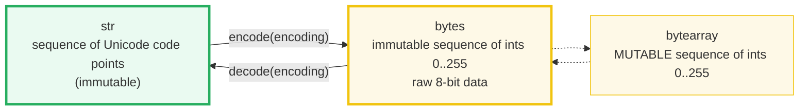
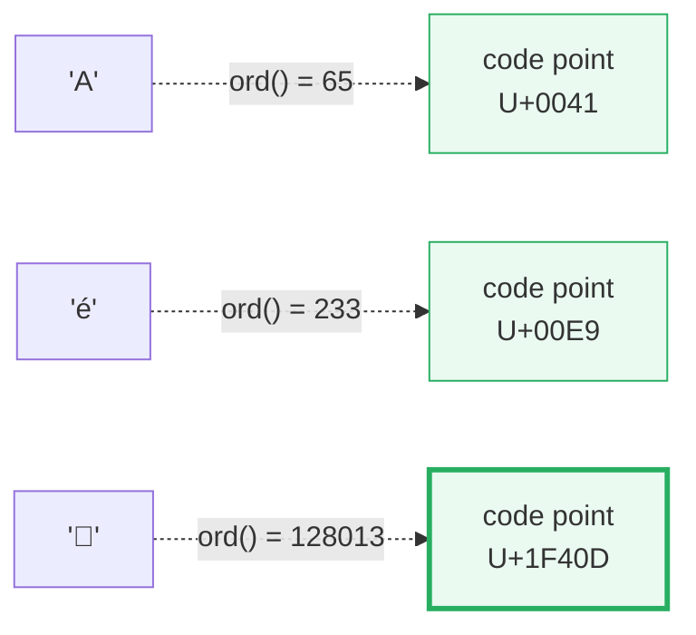
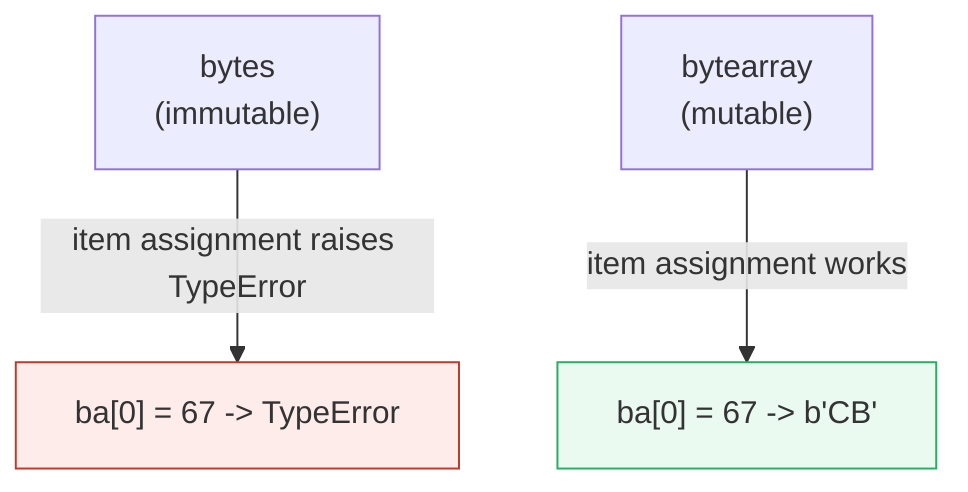
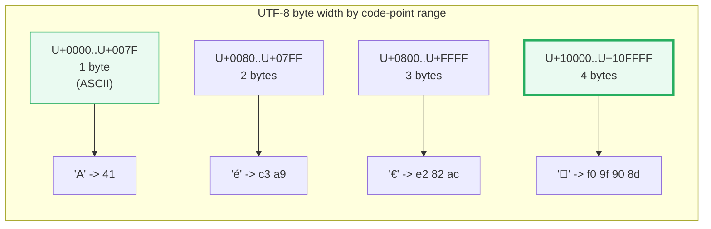
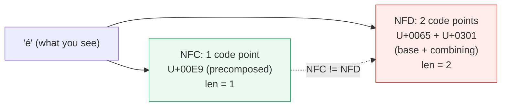
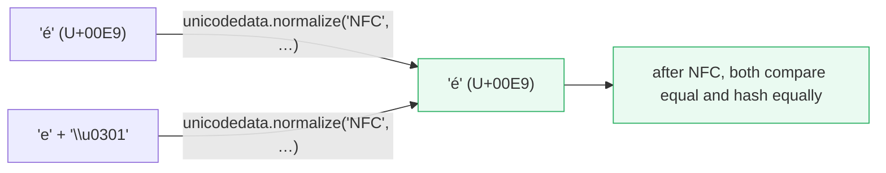
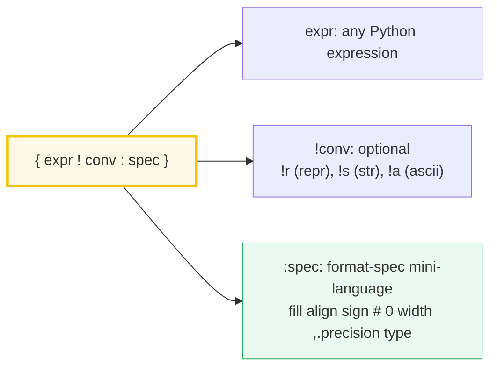

# Strings & Bytes — Code Points, UTF-8, and the `str`/`bytes` Wall

> **The one rule:** Python 3 `str` is a sequence of **Unicode code points**
> (abstract integers that name characters), `bytes` is **raw 8-bit data**, and
> **`encode()`/`decode()` is the only bridge** between them. Python 3 made
> `str != bytes` *on purpose* — the Python 2 "byte string" was a recurring
> source of silent corruption, and the type wall forces you to know which side
> of the boundary you are on.

**Companion code:** [`strings_and_bytes.py`](./strings_and_bytes.py).
**Every number and table below is printed by `uv run python
strings_and_bytes.py`** — change the code, re-run, re-paste. Nothing here is
hand-computed. Captured stdout lives in
[`strings_and_bytes_output.txt`](./strings_and_bytes_output.txt).

**Goal of this bundle (lineage, old → new):**

> from *"a string is just text"*
> → *"`str` is a sequence of Unicode code points; `bytes` is raw 8-bit data;
> encode/decode is the bridge; Python 3 made `str != bytes` on purpose."*

🔗 Bundle **#2 of Phase 1**. It extends
[`TYPES_AND_TRUTHINESS`](./TYPES_AND_TRUTHINESS.md) (every value is a
`PyObject`, including `str`/`bytes`) and feeds forward to
[`MEMORY_MODEL`](./MEMORY_MODEL.md) (the immutability of `str`/`bytes` and the
mutability of `bytearray` are the same aliasing story as lists vs tuples), and
to a future **encoding/`codecs`** note (the `surrogateescape`/`utf-8` codecs
that power the filesystem API).

---

## 0. The three ideas on one page



| Question | Type | What it holds | Example |
|---|---|---|---|
| "What does the user see?" | `str` | Unicode code points | `"café🐍"` |
| "What goes on the wire / disk?" | `bytes` (or `bytearray`) | Raw 8-bit octets | `b'caf\xc3\xa9\xf0\x9f\x90\x8d'` |
| "How do I cross?" | `.encode()` / `.decode()` | Names an **encoding** | `"café".encode("utf-8")` |

The single fact that unlocks everything else: `len(str)` counts **code
points**, `len(bytes)` counts **octets**. They are different lengths for any
non-ASCII text — that is not a bug, it is the whole point of having two types.

---

## 1. `str` is a sequence of Unicode code points

A Python 3 `str` is an **immutable sequence of Unicode code points** — abstract
integer identifiers that name characters. `ord(c)` returns the code point;
`chr(n)` is its inverse. `len()` counts code points, *not* display columns and
*not* encoded bytes. `list()` iterates code points.



Note `'🐍'` lives **past the BMP** (Basic Multilingual Plane, U+0000..U+FFFF)
in the SMP (Supplementary Multilingual Plane) at U+1F40D — yet `len('🐍') == 1`
because Python counts *code points*, not the 4 bytes UTF-8 needs to encode it.

> From `strings_and_bytes.py` Section A:
> ```
> ======================================================================
> SECTION A — str is a sequence of Unicode code points
> ======================================================================
> A Python 3 str is NOT bytes. It is an immutable sequence of
> Unicode CODE POINTS — abstract integers that name characters.
> ord(c) returns the code point; chr(n) is its inverse. len(str)
> counts code points, NOT display columns and NOT encoded bytes.
> 
> expression                      result
> ----------------------------------------------------
> ord('A')                        65
> chr(65)                         'A'
> ord('Z')                        90
> ord('0')                        48
> ord('é')                        233
> hex(ord('é'))                   '0xe9'
> ord('🐍')                        128013
> hex(ord('🐍'))                   '0x1f40d'
> len('AB')                       2
> len('é')                        1
>len('🐍')                        1
> list('Aé')                      ['A', 'é']
> 
> [check] ord('A') == 65 (ASCII capital A is code point 65): OK
> [check] chr(65) == 'A' (chr is the inverse of ord): OK
> [check] len('🐍') == 1 (one code point, regardless of byte width): OK
> [check] ord('🐍') == 0x1F40D (snake is past the BMP, in the SMP): OK
> 'man + ZWJ + woman + ZWJ + girl' as ONE grapheme cluster:
>   len(...) = 5  (5 code points, 1 grapheme cluster)
>   code points = ['0x1f468', '0x200d', '0x1f469', '0x200d', '0x1f467']
>   -> len counts CODE POINTS, not glyphs. For glyph counting you
>      need a grapheme-segmentation library (e.g. thirdparty/regex).
> 
> [check] ZWJ-joined 'family' has len 5 (5 code points), not 1: OK
> ```

### Why `len(emoji)` surprises you (internals)

`len(str)` counts **code points**, *not*:

- **Display columns** — `'🐍'` is 1 code point but renders 2 columns wide in
  most monospace fonts.
- **Encoded bytes** — `'🐍'.encode('utf-8')` is **4 bytes** (see §3).
- **User-perceived characters (graphemes)** — the family emoji
  👨‍👩‍👧 (`U+1F468 U+200D U+1F469 U+200D U+1F467`) is **5 code points** joined
  by `U+200D ZERO WIDTH JOINER`, but a reader sees **one** "family" glyph.

CPython stores `str` as an array of code-point *units* using a **flexible
representation**: 1 byte per char (Latin-1) if all code points fit, 2 bytes
(UCS-2) if all fit in the BMP, or 4 bytes (UCS-32) otherwise. The chosen width
is per-string, decided at creation. This is invisible to your code — `len()`
always means "code points" — but it is why `'a' * 10**8` uses 100 MB while
`'🐍' * 10**8` uses 400 MB.

🔗 The deep object/memory story — what `id('a')` actually points at, why
interning exists, why `s is t` is sometimes `True` for equal literals — is the
subject of [`MEMORY_MODEL`](./MEMORY_MODEL.md) (Phase 3).

---

## 2. `bytes` and `bytearray` — raw 8-bit data

A `bytes` object is an **immutable sequence of integers in `[0, 255]`**. A
`bytearray` is its **mutable** cousin. Indexing either yields an **`int`**, not
a 1-char `str` (this is the single biggest Python 2 → 3 visible change). To get
the character for a byte value, wrap it in `chr()`.



| Operation | `bytes` | `bytearray` |
|---|---|---|
| `b[0]` | → `int` | → `int` |
| `b[0] = 67` | **`TypeError`** | works (mutates in place) |
| `b += b'...'` | creates new object | mutates in place |
| Hashable / usable as dict key | yes | **no** |

> From `strings_and_bytes.py` Section B:
> ```
> ======================================================================
> SECTION B — bytes / bytearray: raw 8-bit data (immutable / mutable)
> ======================================================================
> A bytes object is an immutable sequence of ints in [0, 255].
> Indexing yields an INT (not a 1-char str like in Python 2).
> bytearray is the mutable cousin. b'...' literals give bytes.
> 
> expression                          result        type
> ----------------------------------------------------------------
> b'AB'                               b'AB'         bytes
> b'AB'[0]                            65            int
> b'AB'[1]                            66            int
> chr(b'AB'[0])                       A             str
> b'\x41\x42'                         b'AB'         bytes
> b'\x41\x42' == b'AB'                True          bool
> b'AB'[0] == 65                      True          bool
> b'AB'[0] == 'A'                     False         bool
> list(b'\x41\x42')                   [65, 66]      list
> bytearray(b'AB')                    bytearray(b'AB')bytearray
> type(bytearray(b'AB')).__name__     bytearray     str
> 
> [check] b'AB'[0] == 65 (indexing bytes yields an int): OK
> [check] b'\x41\x42' == b'AB' (hex escapes are just byte values): OK
> [check] b'AB'[0] != 'A' (bytes indexing is NOT str indexing): OK
> ba = bytearray(b'AB'); ba[0] = 67  # 'C' as int
>   -> ba is now bytearray(b'CB')  (mutated in place)
>   bytes has NO such operator -> immutable (TypeError on item set)
> 
> [check] bytearray is mutable (ba[0]=67 succeeds): OK
> [check] bytearray is NOT bytes (it is its own type): OK
> [check] bytes IS bytes: OK
> ```

### Why indexing returns `int`, not a 1-char `bytes` (internals)

PEP 3137 (the Python 3 `bytes` design) chose `int` for element access so that
`b[i]` could be used directly as a lookup key, a bitmask, or an arithmetic
operand — `b[i] == 0xFF`, `b[i] | 0x20`, `chr(b[i])`. A hypothetical
`bytes`-of-length-1 return type would force `b[i][0]` everywhere. `bytes` is
the *raw* type; if you want per-byte text semantics you decode first.

🔗 The `bytes` vs `bytearray` mutability contrast is the same shape as
`tuple` vs `list` (Phase 1 collections bundle) and `frozenset` vs `set`. It
matters for hashing, aliasing, and thread-safety reasoning — all covered in
[`MEMORY_MODEL`](./MEMORY_MODEL.md).

---

## 3. encode/decode — the bridge, UTF-8 byte layout, and error modes

Text and bytes are **different types**. The only way across is `.encode()`
(`str → bytes`) and `.decode()` (`bytes → str`). The **encoding** argument
names the rule. The default everywhere in Python 3 is **UTF-8**.



**The UTF-8 layout** (variable-width, ASCII-backward-compatible):

| Code-point range | Byte 1 | Byte 2 | Byte 3 | Byte 4 |
|---|---|---|---|---|
| U+0000..U+007F | `0xxxxxxx` | — | — | — |
| U+0080..U+07FF | `110xxxxx` | `10xxxxxx` | — | — |
| U+0800..U+FFFF | `1110xxxx` | `10xxxxxx` | `10xxxxxx` | — |
| U+10000..U+10FFFF | `11110xxx` | `10xxxxxx` | `10xxxxxx` | `10xxxxxx` |

The leading byte tells the decoder how many bytes follow (count of leading
`1`s); continuation bytes all start with `10`. ASCII (`0xxxxxxx`) never
collides with a multibyte sequence, so any valid ASCII file is also a valid
UTF-8 file with the same bytes — which is why UTF-8 won.

> From `strings_and_bytes.py` Section C:
> ```
> ======================================================================
> SECTION C — encode/decode: the str<->bytes bridge + error modes
> ======================================================================
> Text (code points) and bytes are DIFFERENT types. encode() goes
> str -> bytes; decode() goes bytes -> str. The ENCODING names the
> rule (UTF-8, UTF-16, ASCII, Latin-1, ...). UTF-8 uses 1-4 bytes
> per code point; ASCII is a 7-bit subset of UTF-8.
> 
> UTF-8 byte width by code-point range (the actual layout):
>   range                 bytes  example   octets
>   --------------------------------------------------------
>   U+0000..U+007F        1      'A'       41
>   U+0080..U+07FF        2      'é'       c3 a9
>   U+0800..U+FFFF        3      '€'       e2 82 ac
>   U+10000..U+10FFFF     4      '🐍'       f0 9f 90 8d
> 
> '🐍'.encode('utf-8') = b'\xf0\x9f\x90\x8d'
> len('🐍'.encode('utf-8')) = 4  (4 bytes, not 1)
> '🐍'.encode('utf-8').decode('utf-8') == '🐍':  True
> 
> [check] '🐍'.encode('utf-8') == b'\xf0\x9f\x90\x8d' (4 octets): OK
> [check] len('🐍'.encode('utf-8')) == 4 (code-point len != byte len): OK
> [check] 'é'.encode('utf-8') has length 2 (U+00E9 is in U+0080..U+07FF): OK
> [check] encode then decode round-trips losslessly (UTF-8 is bijective): OK
> src = 'a🐍b'  (contains a non-ASCII code point)
>   strict   -> raises UnicodeEncodeError (shown below)
>     UnicodeEncodeError: 'ascii' codec can't encode character '\U0001f40d' in position 1: ordinal not in range(128)
>   ignore   -> b'ab'  (drops the un-encodable code point)
>   replace  -> b'a?b'  (each bad code point becomes b'?')
>   backslashreplace -> b'a\\U0001f40db'  (literal escapes)
>   xmlcharrefreplace -> b'a&#128013;b'  (HTML entity)
> 
> [check] ASCII encode strict raises UnicodeEncodeError for '🐍': OK
> [check] errors='ignore' drops the non-ASCII code point: OK
> [check] errors='replace' substitutes b'?' per bad code point: OK
> Mojibake demo (café encoded UTF-8, decoded as Latin-1):
>   'café'.encode('utf-8')       = b'caf\xc3\xa9'
>   .decode('latin-1')           = 'café'  (the é -> two Latin-1 chars)
>   This is the classic 'café' you see on mis-labeled web pages.
> 
> [check] mojibake: 'café' UTF-8 bytes mis-decoded as Latin-1 != 'café': OK
> [check] re-encoding the mojibake back to latin-1 round-trips the bytes: OK
> ```

### Why the error modes exist (internals)

The default error mode is **`strict`** — it raises `UnicodeEncodeError` /
`UnicodeDecodeError` on any unmappable code point. The other modes are how you
survive lossy transports:

| `errors=` | On encode | On decode | Use when |
|---|---|---|---|
| `strict` (default) | raise | raise | you control both ends and want to know |
| `ignore` | silently drop | silently drop | you prefer missing data to crashes (risky) |
| `replace` | `b'?'` per code point | `'\ufffd'` (�) per bad byte | user-facing display; loss is visible |
| `backslashreplace` | `\\uxxxx` / `\\Uxxxxxxxx` literal | n/a on decode | debugging; round-trips losslessly as ASCII |
| `xmlcharrefreplace` | `&#NNN;` HTML entity | n/a on decode | rendering to HTML/ASCII-only contexts |
| `surrogateescape` | n/a on encode (raises) | decode bad byte to `U+DC80..U+DCFF` | **the filesystem codec** — round-trips unknown bytes losslessly |

The **mojibake** demo (`'café'` UTF-8 → mis-decoded Latin-1 → `'café'`) is
the single most common Unicode bug in real codebases. It happens whenever
producer and consumer disagree on the encoding. The fix is *not* `replace` —
it's to negotiate the encoding at the boundary (HTTP `Content-Type`, file
`encoding=`, database connection encoding). `surrogateescape` is special: it
maps each undecodable byte to a private-use surrogate so that re-encoding
losslessly reproduces the original bytes; that is why
`os.listdir`/`open`/`Path` use it by default on Unix (filenames are *bytes*,
not text, and Python refuses to lose data silently).

🔗 A future **encoding/codecs** note will cover `sys.getfilesystemencoding()`,
`os.fsdecode`/`os.fsencode`, the BOM, and the difference between
`utf-8`/`utf-8-sig`/`utf-16`.

---

## 4. The normalization trap — one glyph, two `str`s

The same *glyph* can have **two different `str` representations**:



They render identically (your font knows to overprint the combining accent),
but `precomposed == decomposed` is **`False`**. Two strings that look the same
to a human can compare unequal, hash to different values, sort differently, and
fail a `WHERE name = ?` SQL query. The fix is to **normalize before comparing,
hashing, or storing user-supplied text**.



The four normalization forms (Unicode Standard Annex #15):

| Form | Action | Use |
|---|---|---|
| **NFC** | compose (prefer precomposed chars) | default for storage & comparison |
| **NFD** | fully decompose | stripping accents (`unicodedata.combining`) |
| **NFKC** / **NFKD** | also *compatibility*-decompose (e.g. `fi` → `fi`) | search indexing, fuzzy matching |

> From `strings_and_bytes.py` Section D:
> ```
> ======================================================================
> SECTION D — The normalization trap: 'é' can be 1 OR 2 code points
> ======================================================================
> The SAME glyph can have TWO different str representations:
>   NFC: 'é' = U+00E9 (1 precomposed code point, len 1)
>   NFD: 'é' = U+0065 + U+0301 ('e' + combining acute, len 2)
> They render identically but are NOT equal as str. Normalize before
> comparing, hashing, or storing user-provided text.
> 
> precomposed = 'é'                       = 'é'
>   code points = ['0xe9']
>   len         = 1
>decomposed  = 'e' + '\u0301'           = 'é'
>   code points = ['0x65', '0x301']
>   len         = 2
> precomposed == decomposed : False  (visually identical, structurally different!)
> unicodedata.name on each code point:
>   U+00E9  LATIN SMALL LETTER E WITH ACUTE
>   U+0065  LATIN SMALL LETTER E
>   U+0301  COMBINING ACUTE ACCENT
> 
> unicodedata.normalize('NFC', precomposed) = 'é'  (len 1)
> unicodedata.normalize('NFC', decomposed)  = 'é'  (len 1)
> After NFC, both are equal: True
> 
> [check] precomposed 'é' has len 1 (single code point U+00E9): OK
> [check] decomposed 'e'+U+0301 has len 2 (two code points): OK
> [check] precomposed != decomposed (same glyph, different str): OK
> [check] NFC normalization makes both forms equal: OK
> ```

### Why the trap exists (internals)

Unicode is a *coded character set* (a mapping from integers to abstract
characters), not a *normalization*. For historical compatibility it carries
**both** a precomposed form (Latin Small Letter E With Acute, U+00E9) *and*
the equivalent base+combining sequence (U+0065 + U+0301). NFC normalizes by
preferring precomposed forms; NFD by preferring decomposed. The two are
*canonically equivalent* (they represent the same abstract character) but
*not* byte-identical — so naive `==`, `hash()`, and `len()` disagree. NFC is
the recommended form for storage and interchange (W3C recommends it for all
web content).

---

## 5. f-strings & format specs (PEP 498)

f-strings (Python 3.6+, formalized by PEP 701 in 3.12) embed expressions
directly inside `str` literals. The grammar is `{expression!conversion:format_spec}`:



**Format-spec cheat codes:**

| Spec | Effect | Example |
|---|---|---|
| `:.2f` | 2 decimals | `f"{3.14159:.2f}"` → `'3.14'` |
| `:,` / `:_` | thousands / underscore separator | `f"{12345:,}"` → `'12,345'` |
| `:>8` / `:<8` / `:^8` | right / left / center align, width 8 | |
| `:08.2f` | zero-pad to width 8 | `f"{3.14:08.2f}"` → `'00003.14'` |
| `:b` / `:o` / `:x` / `:X` | binary / octal / lower-hex / upper-hex | `f"{255:x}"` → `'ff'` |
| `:#x` | hex with `0x` prefix | `f"{255:#x}"` → `'0xff'` |
| `:c` | format an int as the matching character | `f"{65:c}"` → `'A'` |
| `!r` / `!s` / `!a` | convert via `repr` / `str` / `ascii` | `f"{'z'!r}"` → `"'z'"` |

The **`=` suffix** (PEP 498 / Python 3.8) self-documents: `f"{x=}"` produces
the literal text `x=` followed by `repr(x)` — invaluable for logging. The
format spec can also contain **nested `{...}` fields** that are evaluated at
runtime, letting you parameterize width/precision from variables.

> From `strings_and_bytes.py` Section E:
> ```
> ======================================================================
> SECTION E — f-strings & format specs (PEP 498, Python 3.6+)
> ======================================================================
> f-strings embed expressions directly in str literals. The part
> after the optional ':' is a FORMAT SPEC (mini-language). !r / !s
> / !a pick the conversion. The = suffix (3.8+) logs name=value.
> 
> expression                              result
> ----------------------------------------------------------------
> f'{{pi}}' doubled-braces -> literal     '{pi}'
> f'{pi}'                                 '3.14159'
> f'{pi:.2f}'  (2 decimals)               '3.14'
> f'{pi:>8.2f}'  (width 8, right align)   '    3.14'
> f'{pi:08.2f}'  (zero-pad)               '00003.14'
> f'{big:,}'  (thousands separator)       '12,345'
> f'{big:_}'  (underscore separator)      '12_345'
> f'{big:b}'  (binary)                    '11000000111001'
> f'{big:x}'  (hex)                       '3039'
> f'{big:#x}'  (hex with prefix)          '0x3039'
> f'{255:o}'  (octal)                     '377'
> f'{65:c}'  (char from code point)       'A'
> f'{name!r}'  (repr conversion)          "'zoe'"
> f'{name!s}'  (str conversion)           'zoe'
> f'{name!a}'  (ascii conversion)         "'zoe'"
> f'{name:>6}'  (right align width 6)     '   zoe'
> f'{name:^6}'  (center align)            ' zoe  '
> f'{name:<6}|' (left align)              'zoe   |'
> 
> The '=' self-documenting suffix (Python 3.8+):
>   f'{x=}'      -> x=42
>   f'{x = :>5}' -> x =    42
>   f'{y=}'      -> y='hi'
> 
> Nested: width=8, prec=3
>   You CAN nest fields inside the format spec (no concatenation):
>   f'{int(pi):{width}d}'  -> '       3'  (width applied at runtime)
>   f'{pi:.{prec}f}'        -> '3.142'  (precision applied at runtime)
> 
> [check] f'{pi:.2f}' == '3.14': OK
> [check] f'{big:,}' == '12,345': OK
> [check] f'{name!r}' == "'zoe'" (repr adds quotes): OK
> [check] f'{65:c}' == 'A' (format a code point as a char): OK
> [check] f-string with doubled braces is a literal brace: OK
> [check] nested format spec: f'{int(pi):{width}d}' honors width=8: OK
> [check] nested precision: f'{pi:.{prec}f}' == '3.142': OK
> ```

### Why f-strings replaced `%` and `str.format` (internals)

Pre-3.6 formatting had two flavors: the C-style `"%s" % x` operator and the
`"...{}...".format(x)` method. Both read **right-to-left** (you scan the
template, then jump to the arguments to see what each slot holds). f-strings
flip this: the expression sits **inside** the slot, so reading order matches
execution order — `f"{user.name} bought {qty}x {item!r}"` is one left-to-right
sweep. They are also marginally faster (evaluated inline in the surrounding
frame's bytecode, no separate `str.format` call). PEP 701 (3.12) finally made
the f-string grammar fully recursive (you can nest quotes that match the outer
f-string's quote), eliminating the old "can't reuse `"` inside `f"..."`"
headache.

---

## Pitfalls

| Trap | Example | The fix |
|---|---|---|
| Calling `len(s)` and expecting display columns | `len("🐍") == 1` (not 2) and `len("👨‍👩‍👧") == 5` | `len` counts **code points**; use `wcwidth`/grapheme segmentation for display width |
| Comparing `b'AB'[0]` to a character | `b'AB'[0] == 'A'` → `False` | indexing `bytes` returns `int`; wrap with `chr()` for the char |
| Assuming `str + bytes` works | `"a" + b"b"` → `TypeError` | pick a side: encode the str OR decode the bytes first |
| Mixing encodings silently | `"café".encode('utf-8').decode('latin-1')` → `'café'` (mojibake) | agree on UTF-8 at every boundary; never guess |
| `errors='ignore'` dropping data | `"a🐍b".encode('ascii', 'ignore')` → `b'ab'` (silent loss) | prefer `'replace'` (visible) or `'backslashreplace'` (lossless) |
| Comparing precomposed vs decomposed forms | `"é" == "e\u0301"` → `False` | `unicodedata.normalize("NFC", s)` before compare/hash/store |
| Mutating a `bytes` "in place" | `b = b'AB'; b[0] = 67` → `TypeError` | use `bytearray(b)` if you need mutation |
| Hashing a `bytearray` | `d[bytearray(b'x')] = 1` → `TypeError: unhashable` | use `bytes` (immutable) as the key |
| `sys.getdefaultencoding()` is read-only | trying to set it to ASCII "for safety" | it's a C-level constant (`utf-8`); fix your boundary code, not Python |
| Iterating bytes as chars | `for c in b'AB':` yields `65, 66` (ints) | decode first: `for c in b'AB'.decode():` |
| Open without `encoding=` on Windows | reads with locale-default cp1252 → mojibake | always `open(path, encoding='utf-8')` |
| `f"{x}".encode()` when you mean `repr(x)` | f-string uses `str`, not `repr` | `f"{x!r}"` |

---

## Cheat sheet

- **`str`**: immutable sequence of **Unicode code points**. `ord(c)` ↔ `chr(n)`.
  `len()` counts code points, *not* bytes or graphemes.
- **`bytes`**: immutable sequence of **ints in `[0, 255]`**. `b[i]` is an `int`,
  not a 1-char str. Hex literals `b'\x41'` are just byte values.
- **`bytearray`**: the **mutable** cousin of `bytes`. Not hashable.
- **`encode()` / `decode()`**: the **only** str↔bytes bridge. Default encoding
  is UTF-8 everywhere. `encode then decode` round-trips losslessly.
- **UTF-8 byte width**: 1 byte U+0000..U+007F; 2 bytes U+0080..U+07FF;
  3 bytes U+0800..U+FFFF; 4 bytes U+10000..U+10FFFF. ASCII is a strict subset.
- **`len(s) != len(s.encode('utf-8'))`** for any non-ASCII text. That's not a
  bug — it's why the two types exist.
- **Error modes** (`errors=`): `strict` (raise, default), `ignore` (drop),
  `replace` (`b'?'` / `'\ufffd'`), `backslashreplace` (lossless ASCII escapes),
  `xmlcharrefreplace` (HTML entity), `surrogateescape` (filesystem codec).
- **Mojibake** = decode bytes with the wrong encoding. Always agree on UTF-8 at
  every boundary (HTTP, file `open`, DB connection).
- **Normalization** (`unicodedata.normalize`): NFC for storage & comparison;
  NFD for stripping accents. Same glyph can be 1 or 2 code points; normalize
  before `==`/`hash`/SQL.
- **f-strings** (PEP 498): `{expr!conv:spec}`. `!r`/`!s`/`!a` for conversion.
  `:.2f`, `:,`, `:>8`, `:08.2f`, `:b/:o/:x`, `:c`, `{x=}` for debug. Nested
  `{...}` fields in the spec let you parameterize width/precision at runtime.

---

## Sources

- **Python docs — Text Sequence Type: `str`.**
  https://docs.python.org/3/library/stdtypes.html#text-sequence-type-str
  *The definition of `str` as an "immutable sequence of Unicode code points,"
  the `ord`/`chr` round-trip, and the table of `str` methods. Quoted in §1.*
- **Python docs — Bytes Objects.**
  https://docs.python.org/3/library/stdtypes.html#bytes-objects
  *`bytes` as "an immutable array of bytes," `bytearray` as "a mutable array";
  that single-byte indexing returns an `int`. Basis for §2.*
- **Python docs — `codecs` — Codec registry and base classes.**
  https://docs.python.org/3/library/codecs.html
  *The default `errors='strict'` semantics and the list of error handlers
  (`ignore`, `replace`, `backslashreplace`, `xmlcharrefreplace`,
  `surrogateescape`). Quoted in §3.*
- **Python docs — Unicode HOWTO.**
  https://docs.python.org/3/howto/unicode.html
  *The "Unicode Primer" — code points vs encodings, UTF-8/UTF-16/UTF-32 byte
  layouts, why Python 3 separated `str` from `bytes`. The §3 byte-width table
  and the mojibake narrative follow this HOWTO.*
- **PEP 3137 — Immutable Bytes and Mutable Buffer.**
  https://peps.python.org/pep-3137/
  *The Python 3 design decision that indexing `bytes` returns an `int` (not a
  `bytes` of length 1), and that `bytearray` is the mutable counterpart.
  Referenced in §2 internals.*
- **PEP 498 — Literal String Interpolation (f-strings).**
  https://peps.python.org/pep-0498/
  *The f-string syntax `{expression!conversion:format_spec}`, the `=` debug
  suffix, and the rationale that replaced `%` and `str.format`. Quoted in §5.*
- **PEP 701 — Syntactic formalization of f-strings (3.12).**
  https://peps.python.org/pep-0701/
  *Why 3.12 lifted the nested-quote restriction by tokenizing f-strings
  properly. Referenced in §5 internals.*
- **Unicode Standard Annex #15 — Unicode Normalization Forms.**
  https://www.unicode.org/reports/tr15/
  *The four normalization forms (NFC, NFD, NFKC, NFKD) and the definition of
  canonical equivalence. Basis for §4.*
- **Wikipedia — UTF-8.**
  https://en.wikipedia.org/wiki/UTF-8
  *Independent confirmation of the UTF-8 byte-layout table (number of leading
  `1`s in the first byte; continuation bytes all start with `10`), and the
  byte widths per code-point range used in §3.*
