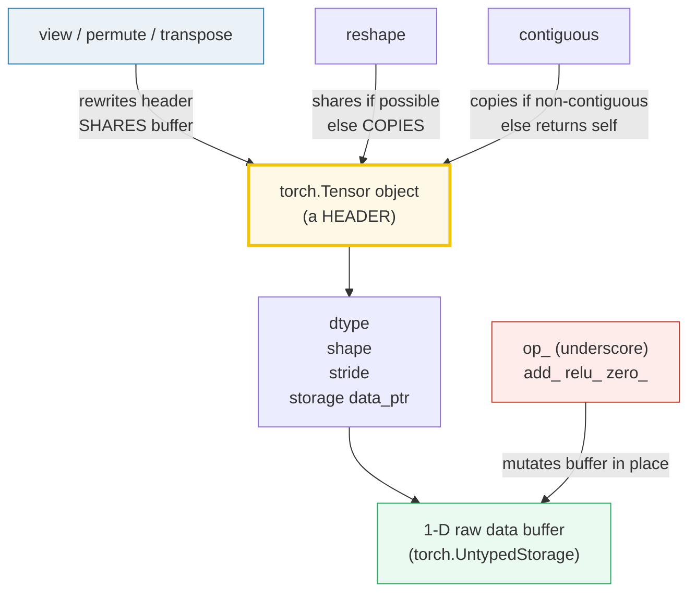
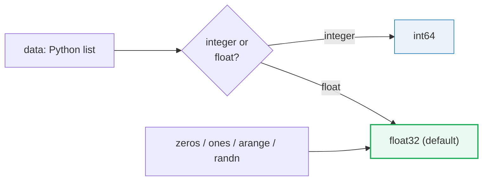
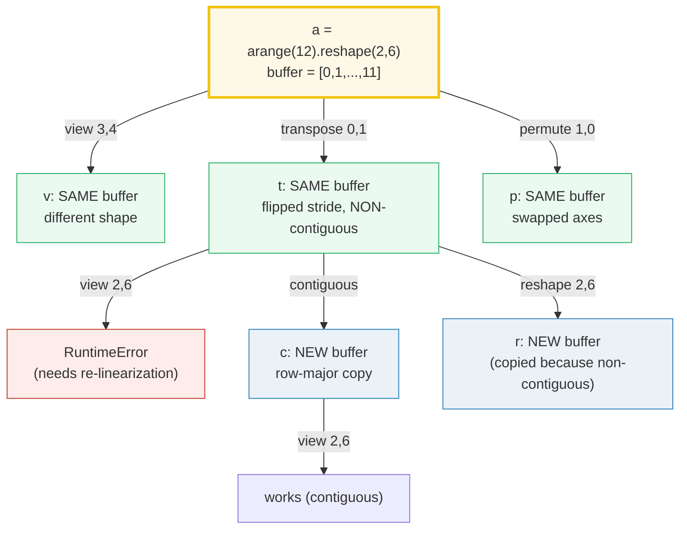

# Tensors — dtype, device, strided storage, views, broadcasting

> **The one rule:** a `torch.Tensor` is a **typed, device-resident, strided
> n-d array**. The Python object you hold is a thin *header* (dtype + shape +
> stride + a pointer into a 1-D data buffer). `view`/`reshape`/`permute`
> rewrite that header and may or may not copy the buffer; broadcasting governs
> every elementwise op; in-place ops carry a `_` suffix and can break autograd.

**Companion code:** [`tensors.py`](./tensors.py).
**Every number and table below is printed by `uv run python tensors.py`** —
change the code, re-run, re-paste. Nothing here is hand-computed. Captured
stdout lives in [`tensors_output.txt`](./tensors_output.txt).

**Goal of this bundle (lineage, old → new):**

> from *"a tensor is like a numpy array"*
> → *"a tensor is a typed, device-resident, strided n-d array; view/reshape/
> permute share or copy storage; broadcasting governs every elementwise op."*

🔗 This is bundle **#29 of Phase 5** — the gateway to PyTorch. The storage/
labels model behind `data_ptr()` builds on
[`MEMORY_MODEL`](./MEMORY_MODEL.md) (Phase 3, #16); the dtype/memory tradeoffs
echo [`MEMORY_EFFICIENCY`](./MEMORY_EFFICIENCY.md) (Phase 4, #25); the
in-place autograd trap is fully unpacked in
[`AUTOCRAD`](./AUTOCRAD.md) (Phase 5, #30). All tensors here live on **CPU**
for determinism; `cuda`/`mps` are mentioned conceptually but never required.

---

## 0. The mental model on one page



| Question | API | The expert fact |
|---|---|---|
| What numeric type? | `tensor.dtype` | `torch.float32` is the **default**; `torch.tensor([1,2,3])` infers `int64` |
| Where does it live? | `tensor.device` | `cpu` (default), `cuda` (NVIDIA), `mps` (Apple Silicon); never auto-moved |
| Bytes per element? | `tensor.element_size()` | float32→4, float16→2, int64→8, bool→1 |
| Same buffer? | `a.data_ptr() == b.data_ptr()` | `view`/`permute`/`transpose`: yes; `.to(new_dtype)`: no |
| Row-major? | `tensor.is_contiguous()` | transposes/permutes are non-contiguous **views** |

---

## 1. Creation, dtype, device

A `torch.Tensor` is, in the [docs' own words](https://docs.pytorch.org/docs/stable/tensors.html),
"a multi-dimensional matrix containing elements of a single data type." The
constructor `torch.tensor(data)` **infers** the dtype from the data — an
integer list yields `int64`, a float list yields `float32`. The *factory* ops
(`zeros`, `ones`, `arange`, `randn`) always use the **default dtype**, which is
`torch.float32` (confirm with `torch.get_default_dtype()`).



> From `tensors.py` Section A:
> ```
> ======================================================================
> SECTION A — Creation, dtype, device
> ======================================================================
> A torch.Tensor is a multi-dimensional matrix of a SINGLE data type
> (docs.pytorch.org tensors.html). torch.tensor(data) infers dtype from
> the data; the factory ops (zeros/ones/arange/randn) use the DEFAULT
> dtype = torch.float32. torch.get_default_dtype() confirms it.
> 
> expression                    dtype           shape
> ----------------------------------------------------------
> torch.tensor([1,2,3])         torch.int64     (3,)
> torch.tensor([1.,2.,3.])      torch.float32   (3,)
> torch.zeros(2,2)              torch.float32   (2, 2)
> torch.ones(3)                 torch.float32   (3,)
> torch.arange(0,12)            torch.int64     (12,)
> torch.randn(2,3) [seeded]     torch.float32   (2, 3)
> 
> torch.get_default_dtype() = torch.float32
> every tensor above is on device: cpu
> torch.backends.mps.is_available() = True  (Apple Silicon GPU; conceptual)
> seeded randn(2,3) values:
> tensor([[ 1.5410, -0.2934, -2.1788],
>         [ 0.5684, -1.0845, -1.3986]])
> 
> [check] torch.tensor([1,2,3]) infers int64 (integral data): OK
> [check] torch.tensor([1.,2.,3.]) infers float32 (default float dtype): OK
> [check] torch.zeros uses the default dtype (float32): OK
> [check] default dtype is float32: OK
> [check] CPU tensors report device type 'cpu': OK
> [check] torch.arange(0,12) has 12 elements: OK
> ```

### Why `torch.tensor()` always copies (internals)

The docs [warn explicitly](https://docs.pytorch.org/docs/stable/tensors.html):
"`torch.tensor()` always copies `data`." If you have a tensor already and only
want to change `requires_grad`, use `requires_grad_()`/`detach()`; if you have
a numpy array and want to avoid a copy, use `torch.as_tensor()`. The legacy
`torch.Tensor(...)` constructor is deprecated precisely because it does *not*
copy when given a tensor (it aliases) yet always builds a float tensor from a
list — surprising in both directions.

**Determinism:** `torch.manual_seed(0)` is called before any RNG call so the
`randn` block above is byte-reproducible. All tensors live on CPU; `cuda`
(NVIDIA) and `mps` (Apple Silicon) are real device types but are never required
to run this bundle.

---

## 2. dtype taxonomy, `element_size()`, and `.to()`

The [dtype taxonomy](https://docs.pytorch.org/docs/stable/tensor_attributes.html)
fixes both the numeric *kind* and the *bytes per element*. `element_size()`
returns bytes/element; `nbytes = element_size() * numel()`. `float32` is the
default and the most accurate single-precision option; `float16`/`bfloat16`
halve memory for training/inference; `int64` is the index dtype. `.to(dtype)`
**always returns a new tensor** with its own buffer (a cast is a copy).

> From `tensors.py` Section B:
> ```
> ======================================================================
> SECTION B — dtype taxonomy, element_size(), and .to()
> ======================================================================
> PyTorch's dtype fixes (a) the numeric kind and (b) the bytes/element.
> element_size() returns bytes per element; nbytes = element_size() *
> numel(). float32 is the DEFAULT and most accurate; float16/bfloat16
> halve memory for training/inference; int64 is the index dtype.
> 
> dtype             element_size (bytes)  nbytes (10 elems)
> ------------------------------------------------------------
> torch.float32     4                     40
> torch.float16     2                     20
> torch.bfloat16    2                     20
> torch.int64       8                     80
> torch.bool        1                     10
> 
> base.dtype = torch.float32,  cast = base.to(torch.float16)
> cast.dtype = torch.float16
> base.data_ptr() == cast.data_ptr() : False  (.to() to a new dtype COPIES)
> cast values (note fp16 rounding of -2.25): tensor([ 1.5000, -2.2500,  3.0000], dtype=torch.float16)
> 
> [check] float32 element_size == 4 bytes: OK
> [check] float16 element_size == 2 bytes (half the memory): OK
> [check] int64 element_size == 8 bytes (the index dtype): OK
> [check] bool element_size == 1 byte: OK
> [check] nbytes == element_size() * numel(): OK
> [check] .to(new_dtype) produces a DISTINCT buffer (a copy): OK
> ```

### Why dtype choice is a memory/accuracy dial (internals)

`float32` is IEEE-754 binary32 (1 sign + 8 exponent + 23 mantissa bits);
`float16` is binary16 (1 + 5 + 10) — *less* range and precision but half the
bytes; `bfloat16` is "Brain Float" (1 + 8 + 7) — the *same* exponent range as
float32 but only 7 mantissa bits, which is why it dominates LLM training: it
trades precision (cheap) for dynamic range (avoids overflow). At scale the
bytes add up: a 1B-parameter model is **4 GB** in float32 but **2 GB** in
float16/bfloat16. 🔗 The byte-counting instinct transfers directly from
[`MEMORY_EFFICIENCY`](./MEMORY_EFFICIENCY.md) (Phase 4, #25), where
`sys.getsizeof` exposed the per-object header tax — here `element_size()` plays
the analogous role for dense numeric buffers.

---

## 3. view / reshape / permute / contiguous — the storage-sharing core

This is the heart of the tensor model. The [Tensor Views doc](https://docs.pytorch.org/docs/stable/tensor_view.html)
states the rule plainly: *"View tensor shares the same underlying data with its
base tensor."* `view()`, `permute()`, and `transpose()` only rewrite the
**(shape, stride)** header — they **never move data**. `reshape()` "can return
either a view or new tensor, user code shouldn't rely on whether it's view or
not." `contiguous()` "returns **itself** if input tensor is already contiguous,
otherwise it returns a new contiguous tensor by copying data."



> From `tensors.py` Section C:
> ```
> ======================================================================
> SECTION C — view / reshape / permute / contiguous + shared storage
> ======================================================================
> A tensor is a (dtype, shape, stride, storage-ptr) HEADER over a raw
> 1-D data buffer. view()/permute()/transpose() REWRITE the header and
> SHARE the buffer (zero copy); reshape() shares when it can, COPIES
> when it must; contiguous() materializes a row-major copy if needed.
> 
> a = torch.arange(12).reshape(2,6) =
> tensor([[ 0,  1,  2,  3,  4,  5],
>         [ 6,  7,  8,  9, 10, 11]])
> a.stride() = (6, 1)  (row-jump=6, col-jump=1)
> 
> v = a.view(3,4) =
> tensor([[ 0,  1,  2,  3],
>         [ 4,  5,  6,  7],
>         [ 8,  9, 10, 11]])
> a.data_ptr() == v.data_ptr() : True  (view SHARES the buffer)
> v[0,0] = 999  ->  a[0,0] = 999  (mutation visible in base)
> 
> t = a.transpose(0,1): shape=(6, 2) stride=(1, 6)
> t.is_contiguous() = False
> t.view(2,6) on non-contiguous t -> RuntimeError: view size is not compatible with input tensor's size and stride
> 
> c = t.contiguous(): is_contiguous=True stride=(2, 1)
> c.data_ptr() == t.data_ptr() : False  (contiguous COPIED non-contiguous data)
> c.view(2,6) after contiguous() -> shape (2, 6) (works)
> 
> r = t.reshape(2,6): shape=(2, 6), data_ptr == t: False  (reshape copied)
> a.contiguous() returns same object when already contiguous: True
> p = a.permute(1,0): shape=(6, 2) stride=(1, 6) data_ptr == a: True
> 
> [check] a.view(3,4) shares the buffer with a (same data_ptr): OK
> [check] mutating a view is visible in the base (a[0,0] == 999): OK
> [check] transpose() yields a non-contiguous view: OK
> [check] .view() on a non-contiguous transpose raises RuntimeError: OK
> [check] contiguous() copies non-contiguous data (new data_ptr): OK
> [check] reshape() succeeds on non-contiguous input (shape (2,6)): OK
> [check] contiguous() on already-contiguous tensor returns the same object: OK
> [check] permute(1,0) shares storage with the base (same data_ptr): OK
> ```

### Why `view()` fails on a transpose (internals)

`view()` requires that the requested shape be *realizable by changing only the
strides* — i.e. the elements must be visitable by stepping through the buffer
in order. A `transpose` flips the strides (`(6,1)` → `(1,6)`); the data is
still `[0,1,...,11]` in memory, but reading it "row by row" of a `(2,6)` view
would need to skip around. Since that can't be expressed as a simple stride
pattern, `view()` raises. `reshape()` falls back to a **copy** in that case;
`contiguous()` does the copy eagerly and hands back a row-major tensor where
`view()` works again. This is exactly why `view()` is documented as strict and
`reshape()` as lenient.

🔗 The "a variable is a label on shared storage" intuition is the same one
[`MEMORY_MODEL`](./MEMORY_MODEL.md) (Phase 3, #16) builds for Python objects —
`a is v` is False (distinct headers) but `a.data_ptr() == v.data_ptr()` is True
(one buffer, two labels on it). Mutating through either label is visible
through the other.

---

## 4. Strides & `is_contiguous`

The [Tensor Attributes doc](https://docs.pytorch.org/docs/stable/tensor_attributes.html#torch.layout)
defines it: *"Strides are a list of integers: the k-th stride represents the
jump in the memory necessary to go from one element to the next one in the
k-th dimension of the Tensor."* A row-major (C-contiguous) tensor has
**decreasing** strides; `transpose()`/`permute()` flip them. `is_contiguous()`
returns True iff walking the axes in order visits the storage in order.

> From `tensors.py` Section D:
> ```
> ======================================================================
> SECTION D — Strides & is_contiguous: the header that interprets the buffer
> ======================================================================
> The k-th stride is the number of ELEMENTS to skip in the 1-D storage
> to advance one step along axis k. A row-major (C-contiguous) tensor
> has decreasing strides; a transposed view flips them. is_contiguous()
> is True iff walking the axes in order visits storage in order.
> 
> base = torch.arange(12).reshape(3,4)
>   shape=(3, 4)  stride=(4, 1)  is_contiguous=True
> col = base.transpose(0,1)
>   shape=(4, 3)  stride=(1, 4)  is_contiguous=False
>   col.data_ptr() == base.data_ptr() : True  (SAME buffer, flipped strides)
> 
> Reading col[0,:] walks storage with step 4 -> the FIRST column of base.
>   base[:, 0] = [0, 4, 8]
>   col[0, :]  = [0, 4, 8]   (identical: same bytes, new map)
> 
> [check] a (3,4) row-major tensor has stride (4,1): OK
> [check] transpose flips the strides to (1,4): OK
> [check] base is contiguous, its transpose is NOT: OK
> [check] transpose shares the buffer (same data_ptr): OK
> [check] col[0,:] equals base[:,0] (same bytes, reinterpreted): OK
> ```

### Why strides make ops free (internals)

`transpose`, `permute`, `flip`, `slice`, `expand` all cost **O(1)** — they
only write new strides into the header. That's why `base.transpose(0,1)` and
`base.permute(1,0)` report the *same* `data_ptr()` as `base`: not one byte
moved. The flip side is that downstream kernels may run slower on
non-contiguous inputs (scattered memory access), which is the "implicit
performance impact" the views doc warns about — hence `.contiguous()` exists
to let you pay the copy *eagerly* when a hot loop needs row-major access.

---

## 5. Broadcasting — align trailing dims; each must be equal or 1

The [broadcasting semantics](https://docs.pytorch.org/docs/stable/notes/broadcasting.html)
are NumPy's, verbatim: *"When iterating over the dimension sizes, starting at
the trailing dimension, the dimension sizes must either be equal, one of them
is 1, or one of them does not exist."* The result shape is the `max` along each
aligned axis. Crucially, broadcasting **expands without copying** — it uses a
**stride-0 trick** (the broadcast dim gets stride 0, so advancing along it
re-reads the same element).

```mermaid
graph LR
    M["matrix (3,4)"] --> Add["+ row_vec (4,)"]
    RV["row_vec (4,)"] --> Add
    Add -->|align trailing: (3,4)+(3,4)| R1["result (3,4)"]
    CV["col_vec (3,1)"] --> Mul["* one_row (1,4)"]
    OR["one_row (1,4)"] --> Mul
    Mul -->|both dims broadcast: (3,4)*(3,4)| R2["result (3,4) — outer product"]
    style R1 fill:#eafaf1,stroke:#27ae60
    style R2 fill:#eafaf1,stroke:#27ae60
```

> From `tensors.py` Section E:
> ```
> ======================================================================
> SECTION E — Broadcasting: align TRAILING dims; each must be equal or 1
> ======================================================================
> Two shapes are broadcastable iff, iterating from the TRAILING dim, each
> pair is equal OR one of them is 1 (or absent). The result dim is the
> max. Broadcasting expands WITHOUT copying (a stride-0 trick).
> 
> matrix  shape (3, 4)
> row_vec shape (4,)  -> matrix + row_vec shape (3, 4)
> col_vec shape (3, 1) ; one_row shape (1, 4) -> col_vec * one_row shape (3, 4)
> 
> matrix + row_vec (row broadcast across 3 rows):
> tensor([[10., 21., 32., 43.],
>         [14., 25., 36., 47.],
>         [18., 29., 40., 51.]])
> 
> col_vec * one_row (outer product via broadcasting):
> tensor([[ 100.,  200.,  300.,  400.],
>         [ 200.,  400.,  600.,  800.],
>         [ 300.,  600.,  900., 1200.]])
> 
> (2,3) + (2,2) -> RuntimeError: The size of tensor a (3) must match the size of tensor b (2) at non-si  (3 != 2)
> 
> [check] (3,4) + (4,) broadcasts the row to (3,4): OK
> [check] (3,1) * (1,4) broadcasts to (3,4) (outer product): OK
> [check] matrix + row_vec adds the SAME row to every row: OK
> [check] (2,3) + (2,2) is NOT broadcastable (trailing 3 != 2): OK
> [check] broadcasting result dim = max of the two along each axis: OK
> ```

### Why the trailing-dim rule (internals)

Shapes are aligned on the **right** because elementwise ops pair up
corresponding *coordinates*, and coordinates are indexed from the trailing
(most-rapidly-varying) axis. Prepending `1`s (not appending) lets a
lower-rank tensor act as a higher-rank one without ambiguity. The "equal or 1"
constraint is the loosest rule that still admits a unique result shape (the
max). The `(2,3)+(2,2)` failure above is the canonical trap: the leading dims
match (2==2) but the **trailing** dims (3 vs 2) do not, so the pair is
rejected — broadcasting never "transposes" to make things fit.

---

## 6. In-place ops — the `_` suffix and the autograd trap

The docs are explicit: *"Methods which mutate a tensor are marked with an
underscore suffix. For example, `torch.FloatTensor.abs_()` computes the
absolute value in-place."* Every out-of-place op has an in-place twin:
`add`/`add_`, `relu`/`relu_`, `zero`/`zero_`, `scatter`/`scatter_`. The
in-place version writes straight into the existing buffer and returns the same
object — fast and memory-cheap, but **dangerous under autograd**: an in-place
op on a **leaf** tensor that `requires_grad` raises immediately.

> From `tensors.py` Section F:
> ```
> ======================================================================
> SECTION F — In-place ops: the `_` suffix and the autograd trap
> ======================================================================
> A method ending in `_` (add_, relu_, abs_, zero_) mutates the tensor
> in place and returns it — no new buffer. Fast, but DANGEROUS under
> autograd: an in-place op on a LEAF tensor that requires grad raises
> immediately. (🔗 AUTOCRAD, Phase 5 #30, covers the full graph theory.)
> 
> t = [-1.0, 2.0, -3.0]
> t.relu_() -> t = [0.0, 2.0, 0.0]  (mutated in place)
> data_ptr(t) unchanged: True  ret is t: True  (same object, same buffer)
> 
> torch.tensor([...]).relu() (OUT-of-place) -> [0.0, 2.0, 0.0]
> (the `_`-less form returns a NEW tensor; original untouched)
> 
> leaf.add_(1) on a requires_grad=True leaf -> RuntimeError: a leaf Variable that requires grad is being used in an in-place operation.
> 
> [check] relu_() mutates in place (t == [0,2,0]): OK
> [check] the in-place method returns the SAME object (ret is t): OK
> [check] the out-of-place relu() does NOT mutate its source: OK
> [check] in-place on a requires_grad leaf raises RuntimeError: OK
> ```

### Why in-place breaks autograd (internals)

Autograd records a **computation graph** whose nodes are tensors and whose
edges are the ops that produced them. A leaf tensor (one *you* created, not the
output of a differentiable op) is a graph **input**; its value is needed
verbatim during `backward()` to compute gradients. If you overwrite it in
place, the recorded history no longer matches the stored value, so the gradient
would be silently wrong — PyTorch refuses and raises
`RuntimeError: a leaf Variable that requires grad is being used in an in-place
operation.` Non-leaf intermediates *can* be mutated in place (their
`grad_fn` tracks version counters), but even there an in-place op can invalidate
saved tensors needed for the backward pass. The safe rule: **avoid `_` ops on
any tensor that participates in a backward graph** unless you understand the
version-counter check. 🔗 The full theory — `requires_grad`, `grad_fn`,
`backward()`, the version counter — is the subject of
[`AUTOCRAD`](./AUTOCRAD.md) (Phase 5, #30).

---

## 7. Indexing — slice (view) vs boolean mask vs advanced (copy)

PyTorch follows [NumPy indexing](https://numpy.org/doc/stable/user/basics.indexing.html):
the Tensor Views doc summarizes it as *"basic indexing returns views, while
advanced indexing returns a copy. Assignment via either basic or advanced
indexing is in-place."*

| Index kind | Example | Returns |
|---|---|---|
| Basic (slices, ints) | `t[0, :]`, `t[:, 1:3]` | a **view** (shares buffer) |
| Boolean mask | `t[t > 5]` | a **copy** (1-D) |
| Advanced (index arrays) | `t[[0, 2, 2], :]` | a **copy** (gathered) |

> From `tensors.py` Section G:
> ```
> ======================================================================
> SECTION G — Indexing: slice (view) vs boolean mask vs advanced (copy)
> ======================================================================
> PyTorch follows NumPy: BASIC indexing (slices/int) returns a VIEW of
> the base; BOOLEAN MASK and ADVANCED indexing (tensor/idx arrays) return
> a COPY. Writing through either kind is always in-place.
> 
> t =
> tensor([[ 0,  1,  2,  3],
>         [ 4,  5,  6,  7],
>         [ 8,  9, 10, 11]])
> 
> t[0, :]   (basic slice)    -> [0, 1, 2, 3]
>   is view of t: True
> (t > 5)   (boolean mask)    -> shape (3, 4), 6 True entries
> t[t>5]    (advanced, mask)  -> [6, 7, 8, 9, 10, 11]  (1-D copy)
> t[[0,2,2],:]  (advanced idx) -> shape (3, 4) (rows 0,2,2 gathered)
> 
> row0[0] = -7 (mutate the slice view) -> t[0,0] = -7
> 
> [check] basic slice t[0,:] shares storage with t (a view): OK
> [check] boolean mask t[t>5] returns a 1-D copy of the matches: OK
> [check] advanced indexing t[[0,2,2],:] gathers rows (0,2,2): OK
> [check] mutating a slice view mutates the base (t[0,0] == -7): OK
> [check] the mask dtype is bool: OK
> ```

### Why basic indexing is a view but advanced is a copy (internals)

A basic slice (`t[0, :]`) picks a *regular* sub-region describable by an offset
+ strides — so it can be a view, just like `narrow`/`select`. A boolean mask or
an index array selects an *arbitrary* set of elements (possibly with repeats,
possibly out of order); there is no stride pattern for "the elements where the
mask is True," so the result must be materialized as a fresh contiguous buffer.
This is why `t[t > 5]` is always 1-D (the matches are flattened) and why
writing `t[idx] = v` is defined as in-place scatter even though *reading*
`t[idx]` copies: assignment writes back through the index, reading produces a
new tensor.

---

## 8. NumPy interop — zero-copy on CPU

On CPU, `t.numpy()` and `torch.from_numpy(arr)` **share the raw buffer** — no
copy, no conversion. Mutating either side is visible to the other.
`from_numpy` **preserves** the ndarray's dtype (a `float64` array becomes a
`torch.float64` tensor), which is distinct from the `torch.tensor()` rule that
infers dtype from the data.

> From `tensors.py` Section H:
> ```
> ======================================================================
> SECTION H — NumPy interop: t.numpy() and torch.from_numpy() share memory
> ======================================================================
> On CPU, a torch.Tensor and the ndarray from t.numpy() share the SAME
> raw buffer (zero copy). torch.from_numpy(arr) wraps an ndarray as a
> tensor the same way. Mutating either is visible to the other.
> 
> t = torch.tensor([1.,2.,3.,4.])
> arr = t.numpy()  -> type=ndarray, dtype=float32, values=[1.0, 2.0, 3.0, 4.0]
> t.data_ptr() == arr.__array_interface__['data'][0] : True  (shared buffer)
> 
> arr[0] = 99.0  ->  t = [99.0, 2.0, 3.0, 4.0]  (torch sees the numpy mutation)
> t[1] = -42.0  ->  arr = [99.0, -42.0, 3.0, 4.0]  (numpy sees the torch mutation)
> 
> back = torch.from_numpy(arr) -> shares buffer: True
> (from_numpy PRESERVES dtype: float32 ndarray -> float32 tensor,
>  NOT the float32 'default' rule that torch.tensor() uses.)
> np.array([1.,2.], dtype=float64) -> from_numpy -> dtype torch.float64 (preserved, NOT float32)
> 
> [check] t.numpy() returns a numpy.ndarray: OK
> [check] t.numpy() shares the buffer with t (same data pointer): OK
> [check] mutating the ndarray is visible in the tensor (t[0] == 99.0): OK
> [check] mutating the tensor is visible in the ndarray (arr[1] == -42.0): OK
> [check] torch.from_numpy(arr) shares the buffer too: OK
> [check] from_numpy PRESERVES dtype (float64 ndarray -> torch.float64): OK
> ```

### Why the bridge is free on CPU (internals)

Both libraries store dense numeric data as a flat C buffer; on CPU they can
literally point at the same memory. (On GPU the bridge must copy across the
PCIe/NVLink boundary, so `t.numpy()` is only valid for CPU tensors.) The dtype
preservation is the giveaway that no conversion happens: `float64` stays
`float64` rather than being silently widened/narrowed to the torch default. The
shared-buffer mutation demo is the proof — `arr[0] = 99.0` is instantly visible
in `t` and vice versa.

---

## Pitfalls

| Trap | Example | The fix |
|---|---|---|
| Assuming `torch.tensor([1,2,3])` is float | it infers `int64`, not `float32` | pass `dtype=torch.float32`, or write floats `([1.,2.,3.])` |
| `view()` on a non-contiguous tensor | `t.transpose(0,1).view(...)` → `RuntimeError` | call `.contiguous()` first, or use `.reshape()` (copies if needed) |
| Relying on `reshape()` sharing storage | it *may* copy; "user code shouldn't rely on whether it's view or not" | if you need a guarantee of sharing, use `view()` (after `contiguous()`); if you need a guarantee of a copy, use `.clone()` |
| Mutating a view and forgetting the base changed | `v = a.view(...); v[0] = 99` mutates `a` too | treat every view/permute/slice as an alias; `.clone()` for an independent copy |
| In-place `_` op on a `requires_grad` leaf | `leaf.add_(1)` → `RuntimeError` | use out-of-place `leaf = leaf + 1`, or `.detach()` first if you truly mean it |
| In-place op on a non-leaf needed for backward | may raise "one of the variables needed for gradient computation has been modified" | avoid `_` ops inside the backward graph; recompute instead |
| Truth-testing a multi-element tensor | `bool(t)` / `if t:` raises `RuntimeError` (ambiguous) | use `t.any()` / `t.all()` / `t.item()` (single element) explicitly |
| `t.numpy()` on a GPU tensor | raises (numpy is CPU-only) | `t.cpu().numpy()`; or keep the workflow on CPU |
| Forgetting `from_numpy` preserves dtype | `np.float64` array → `torch.float64`, not the `float32` default | cast explicitly: `torch.from_numpy(arr).float()` |
| Assuming `cuda`/`mps` makes things faster for tiny tensors | kernel-launch overhead dominates | benchmark; CPU is often faster for small/sequential work |
| `t.to(device)` in a hot loop | each call may allocate/copy | move once, reuse; check `t.device` before moving |

---

## Cheat sheet

- **Default dtype:** `torch.float32` (`torch.get_default_dtype()`). `torch.tensor([1,2,3])`
  infers `int64`; `torch.tensor([1.,2.])` and all factory ops (`zeros`/`ones`/
  `arange`/`randn`) use `float32`.
- **dtype memory:** `element_size()` = bytes/elem → float32=4, float16/bfloat16=2,
  int64=8, bool=1. `nbytes == element_size() * numel()`. `.to(dtype)` **copies**.
- **device:** `cpu` (default), `cuda` (NVIDIA), `mps` (Apple Silicon). Tensors
  are **never auto-moved**; call `.to(device)` explicitly.
- **Tensor = header + buffer:** the header is `(dtype, shape, stride, data_ptr)`;
  the buffer is a flat `UntypedStorage`. `data_ptr()` compares buffers.
- **Views share the buffer:** `view`, `permute`, `transpose`, basic slicing
  rewrite strides only — `a.data_ptr() == a.view(...).data_ptr()`. Mutating a
  view mutates the base.
- **`view()` needs contiguity; `reshape()` does not:** `view()` raises on a
  non-contiguous input that can't be expressed as strides; `reshape()` copies
  in that case. `contiguous()` copies if needed, returns `self` if already
  row-major.
- **Strides:** k-th stride = elements to skip to advance one step along axis k.
  Row-major ⇒ decreasing strides; `transpose`/`permute` flip them.
- **Broadcasting:** align on the **trailing** dim; each pair must be *equal* or
  one of them *1* (or absent). Result = `max` per axis. Expands via stride-0
  (no copy). `(3,1)*(1,4) → (3,4)`.
- **In-place = `_` suffix:** `add_`, `relu_`, `zero_`, … mutate the buffer and
  return the same object. **Never** on a `requires_grad` leaf (raises). 🔗 AUTOCRAD.
- **Indexing:** basic slice → **view**; boolean mask / index arrays → **copy**.
  Assignment (`t[mask] = v`) is in-place either way.
- **NumPy bridge (CPU):** `t.numpy()` and `torch.from_numpy(arr)` **share the
  buffer** (zero copy); dtype is preserved, not re-defaulted.

---

## Sources

- **PyTorch docs — `torch.Tensor`.**
  https://docs.pytorch.org/docs/stable/tensors.html
  *Defines the tensor as "a multi-dimensional matrix containing elements of a
  single data type"; the warning that `torch.tensor()` always copies data; the
  rule that "methods which mutate a tensor are marked with an underscore
  suffix"; the `element_size()`/`nbytes`/`itemsize` attributes. Quoted in §1
  and §6.*
- **PyTorch docs — Tensor Attributes (`torch.dtype`, `torch.device`, `torch.layout`).**
  https://docs.pytorch.org/docs/stable/tensor_attributes.html
  *The full dtype taxonomy (float32/float16/bfloat16/int64/bool, …); the
  default-dtype and type-promotion rules; the `torch.strided` layout definition
  where "the k-th stride represents the jump in the memory necessary to go from
  one element to the next one in the k-th dimension"; the device string forms
  (`'cpu'`, `'cuda'`, `'mps'`). Basis for §1, §2, and §4.*
- **PyTorch docs — Tensor Views.**
  https://docs.pytorch.org/docs/stable/tensor_view.html
  *"View tensor shares the same underlying data with its base tensor"; the
  canonical `t.storage().data_ptr() == b.storage().data_ptr()` example; the
  transpose→non-contiguous→`contiguous()` sequence; the note that
  `reshape()`/`flatten()` "can return either a view or new tensor, user code
  shouldn't rely on whether it's view or not"; and that `contiguous()` "returns
  itself if input tensor is already contiguous, otherwise it returns a new
  contiguous tensor by copying data"; the basic-vs-advanced indexing note.
  Quoted verbatim in §3 and §7.*
- **PyTorch docs — Broadcasting semantics.**
  https://docs.pytorch.org/docs/stable/notes/broadcasting.html
  *The trailing-dimension rule: "the dimension sizes must either be equal, one
  of them is 1, or one of them does not exist"; the result-shape = max rule;
  the in-place broadcast constraint. Quoted in §5.*
- **NumPy docs — Broadcasting.**
  https://numpy.org/doc/stable/user/basics.broadcasting.html
  *PyTorch's broadcasting "support[s] NumPy's broadcasting semantics" — the
  original, canonical statement of the trailing-dim / "equal or 1" rule that
  §5 leans on.*
- **NumPy docs — Indexing.**
  https://numpy.org/doc/stable/user/basics.indexing.html
  *The basic-vs-advanced indexing distinction that PyTorch inherits (basic →
  view, advanced → copy). Referenced by the Tensor Views doc and §7.*
- **ezyang — PyTorch Internals.**
  http://blog.ezyang.com/2019/05/pytorch-internals/
  *The blogpost the Tensor Views doc cites for "a more detailed walk-through of
  PyTorch internal implementation" — the storage-as-a-flat-buffer /
  tensor-as-strided-header design. Background for §0 and §3.*
