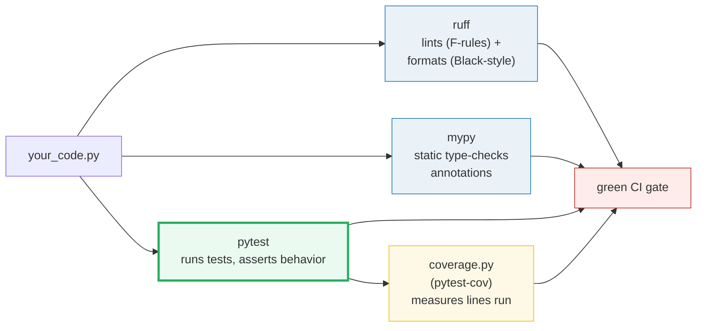
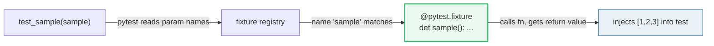
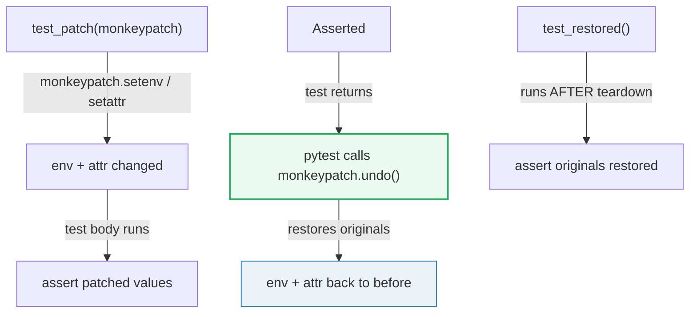
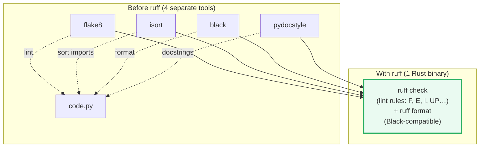
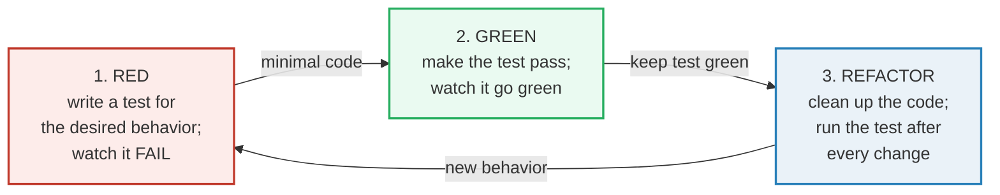

# Testing & Linting — pytest, ruff, mypy, and the Red→Green Loop

> **The one rule:** you don't check code by eye or by "it ran on my machine."
> You write **tests** (pytest) that assert behavior, you **lint + format**
> automatically (ruff), you **type-check** statically (mypy), and you **measure**
> what your tests actually exercise (coverage). The discipline that ties them
> together is the **red→green→refactor loop**: write a failing test → make it
> pass → clean up with the test as a safety net.

**Companion code:** [`testing_linting.py`](./testing_linting.py).
**Every number and tool output below is printed by `uv run python
testing_linting.py`** — the script invokes pytest programmatically
(`pytest.main` captured), and ruff / mypy via subprocess, on tiny inline sample
files written to a `/tmp` scratch dir. Change the code, re-run, re-paste. Nothing
here is hand-computed. Captured stdout lives in
[`testing_linting_output.txt`](./testing_linting_output.txt).

> **Determinism note:** the script normalizes the random scratch-dir path to
> `<tmpdir>` and the variable sub-second timings to `<duration>s` so the output is
> byte-reproducible. The `Scratch: …` line in the intro prints the real (random)
> temp path once for debugging; everything else is stable.

**Goal of this bundle (lineage, old → new):**

> from *"I run my code manually to check it"*
> → *"pytest fixtures / parametrize / monkeypatch give composable tests; ruff
> > lints + formats; mypy type-checks; the red→green loop keeps code correct."*

🔗 This is bundle **#28 of Phase 4**. It looks forward to
[`TYPE_HINTS`](./TYPE_HINTS.md) (P3 #18) — mypy is meaningless without type
annotations — and to [`PACKAGING`](./PACKAGING.md) (P4 #27), because this very
repo runs under `uv` + `ruff` and those tools are configured in
`pyproject.toml`. The `@parametrize` pattern ties into data-driven testing
everywhere later in the curriculum. See [`TODO.md`](./TODO.md) for the full plan.

---

## 0. The toolchain on one page



| Tool | What it answers | When it runs | Exit code 0 means |
|---|---|---|---|
| **pytest** | "does the code behave as my tests assert?" | test time (you choose) | all collected tests passed |
| **ruff check** | "does the code violate any lint rule?" | every save / pre-commit | zero rule violations |
| **ruff format** | "is the code formatted to a single style?" | every save | file already matches the formatter |
| **mypy** | "do the types line up without running?" | every save / CI | no type errors found |
| **coverage.py** | "which lines did my tests actually run?" | after the test suite | (informational — no pass/fail) |

---

## 1. pytest basics — test functions and exit codes

pytest discovers **any function named `test_*`** in a file named `test_*.py`,
runs each, and reports. The process exit code is a **first-class signal**: `0`
means `ExitCode.OK` (all passed), `1` means `ExitCode.TESTS_FAILED` (some
failed), `2` means an internal/usage error, `5` means no tests were collected.
When you embed pytest with `pytest.main([...])` the return value is this same
`ExitCode` (an `int` subclass), so you can assert on it programmatically.

> From `testing_linting.py` Section A:
> ```
> ======================================================================
> SECTION A - pytest basics: test functions and exit codes
> ======================================================================
> pytest discovers functions named test_*. Each runs its asserts;
> exit code 0 = all passed (ExitCode.OK), 1 = some failed
> (ExitCode.TESTS_FAILED). Below: pytest.main on a passing then a
> deliberately-failing test file.
> 
> --- pytest on test_pass.py (2 passing tests) ---
> ..
> 2 passed in <duration>s
> 
> [check] 2 passing tests -> exit code 0 (ExitCode.OK): OK
> [check] output reports '2 passed': OK
> --- pytest on test_fail.py (1 deliberately failing test) ---
> F
> =================================== FAILURES ===================================
> _________________________________ test_broken __________________________________
> 
>     def test_broken():
> >       assert 1 + 1 == 3
> E       assert (1 + 1) == 3
> 
> <tmpdir>/test_fail.py:2: AssertionError
> =========================== short test summary info ============================
> FAILED ../../../../..<tmpdir>/test_fail.py::test_broken
> 1 failed in <duration>s
> 
> [check] 1 failing test -> exit code 1 (ExitCode.TESTS_FAILED): OK
> [check] output reports '1 failed': OK
> ```

### Why `pytest.main` returns an `int`-like enum (internals)

`pytest.ExitCode` is an `IntEnum`: `OK=0`, `TESTS_FAILED=1`, `INTERNAL_ERROR=2`,
`USAGE_ERROR=4`, `NO_TESTS_COLLECTED=5`. Because it subclasses `int`,
`int(code) == 0` works directly and you can `assert code == 0` or compare to
`pytest.ExitCode.OK`. `pytest.main` **catches `SystemExit`** internally — it never
terminates your process; it returns the code instead. That is why the bundle can
call it repeatedly (once per section) inside one Python process.

### Why pytest rewrites your `assert` (internals)

Notice the failure shows `assert (1 + 1) == 3` with the *sub-expressions*
expanded (`1 + 1`), not just `AssertionError`. pytest's **assertion rewriting**
hook (`pytest` rewrites the bytecode of `test_*` files at import time) turns a
bare `assert` into one that captures intermediate values. You get this for free —
no `self.assertEqual` boilerplate (the `unittest` way). Plain `assert` is the
idiomatic pytest style.

---

## 2. Fixtures — dependency injection by name



A fixture is a function decorated with `@pytest.fixture`. pytest **injects** it
into any test that lists the fixture's **name** as a parameter — no import, no
manual wiring. Under the hood pytest inspects the test function's signature,
looks up each parameter name in the fixture registry, calls the matching fixture
function, and passes the return value as the argument. This is **dependency
injection by parameter name**: the test declares *what* it needs, pytest provides
*how*.

> From `testing_linting.py` Section B:
> ```
> ======================================================================
> SECTION B - Fixtures: dependency injection by name
> ======================================================================
> A @pytest.fixture function is injected into any test that lists its
> NAME as a parameter - no imports, no wiring. pytest sees 'sample' in
> the signature, finds the fixture, calls it, and passes the return
> value in.
> 
> --- pytest on test_fix.py ---
> .
> 1 passed in <duration>s
> 
> [check] fixture 'sample' injected by name -> exit code 0: OK
> [check] the fixture value [1,2,3] flowed into the test: OK
> ```

### Why fixtures are "injection by name" (internals)

pytest resolves arguments in a fixed priority order: built-in fixtures (e.g.
`tmp_path`, `capsys`, `monkeypatch`) → plugins → `conftest.py` fixtures →
module-level fixtures. A parameter name is **the contract** — if no fixture with
that name exists, pytest raises a `FixtureLookupError` at collection time. This
name-matching is powerful (zero wiring) but also why fixture names are global:
rename a fixture and every test referencing the old name breaks at collection.

---

## 3. `@pytest.mark.parametrize` — one test per data row

Instead of copy-pasting a test five times with different inputs, you decorate one
function with `@parametrize("argnames", [(row1), (row2), …])`. pytest generates
**one independent test per row** — each gets its own pass/fail and its own test ID
(`test_square[4-16]`). Stacking two `@parametrize` decorators produces the
**Cartesian product** of their rows.

> From `testing_linting.py` Section C:
> ```
> ======================================================================
> SECTION C - @pytest.mark.parametrize: one run per data row
> ======================================================================
> @parametrize(argnames, argvalues) runs the test ONCE per row in
> argvalues, injecting each row as arguments. 4 rows -> 4 test runs.
> 
> --- pytest on test_pm.py (4 param rows) ---
> ....
> 4 passed in <duration>s
> 
> [check] parametrized test ran once per row -> exit code 0: OK
> [check] collected count == number of param rows (4): OK
> ```

### Why parametrize beats a `for` loop (the expert point)

A naive `for x in cases: assert f(x) == ...` **stops at the first failure** —
you never learn which other cases break. `@parametrize` gives each row its own
test item: all four run independently, and the report shows exactly which input
failed (`test_square[3-9]`). The test IDs double as documentation: the param
values appear in the name. This is the backbone of **data-driven testing**.

---

## 4. `monkeypatch` — temporary patches, auto-restored



`monkeypatch` is a built-in fixture for **safely replacing** attributes
(`setattr`), dict items (`setitem`), and environment variables (`setenv`) for the
duration of one test. pytest records every change and **undoes them all** at
teardown — you never need a `try/finally` or manual cleanup. The bundle proves
this with two tests: test 1 patches an env var and `math.pi`; test 2 asserts both
are gone. Both pass → teardown worked.

> From `testing_linting.py` Section D:
> ```
> ======================================================================
> SECTION D - monkeypatch: temporary attribute/env patches, auto-restored
> ======================================================================
> The monkeypatch fixture sets attrs/dict-items/env-vars for the test
> duration, then UNDOES them at teardown. Below, test 1 patches an env
> var and math.pi; test 2 asserts both are gone - proving teardown.
> 
> --- pytest on test_mp.py (patch + restore) ---
> ..
> 2 passed in <duration>s
> 
> [check] monkeypatch took effect during test 1 -> exit code 0: OK
> [check] both tests passed (patch auto-restored before test 2): OK
> ```

### Why monkeypatch undoes itself (internals)

`monkeypatch` maintains an internal `_setattr` / `_setenv` undo list. At teardown
(the `finally` phase of the fixture's `yield`, or the end of a function-scope
fixture), it calls `undo()` which replays the list in reverse, restoring each
original value or deleting keys that were newly added. Because the scope is
**function** by default, patches never leak between tests — a critical safety
property for parallel / ordered test runs.

---

## 5. `tmp_path` & `capsys` — built-in fixtures you use every day

- **`tmp_path`** — pytest creates a **fresh `pathlib.Path` temp directory** for
  each test (under a base tmp area) and injects it. The dir is unique per test and
  cleaned up after a configurable number of sessions. Perfect for file-I/O tests
  with zero manual cleanup.
- **`capsys`** — captures everything written to `sys.stdout` / `sys.stderr`
  during the test. `capsys.readouterr()` returns a namedtuple `(out, err)` of the
  text so far; calling it again returns only new output since the last call.

> From `testing_linting.py` Section E:
> ```
> ======================================================================
> SECTION E - tmp_path & capsys: built-in fixtures
> ======================================================================
> tmp_path yields a fresh pathlib.Path temp dir (unique per test).
> capsys captures stdout/stderr written during the test via
> capsys.readouterr(). Both are built-in - no plugin needed.
> 
> --- pytest on test_tp.py (tmp_path + capsys) ---
> ..
> 2 passed in <duration>s
> 
> [check] tmp_path file round-trip + capsys capture -> exit code 0: OK
> [check] both built-in fixture tests passed: OK
> ```

### Why `readouterr()` consumes (the gotcha)

`capsys.readouterr()` **snapshots and clears** the buffer — call it twice and the
second call returns only output written *after* the first call. If you need to
inspect captured output in a fixture *after* the test, use `capsys`'s sibling
`capfd` (file-descriptor level) or the `--capture=` run modes. This "consume on
read" behavior trips up everyone once.

---

## 6. ruff — one tool that lints **and** formats



ruff is a single Rust binary that **replaces flake8 + isort + black + pydocstyle +
pyupgrade + autoflake** (and dozens of flake8 plugins). Two subcommands:
`ruff check` applies **lint rules** (e.g. `F401` "imported but unused", `E`
pycodestyle, `I` isort, `UP` pyupgrade) and exits `1` if any rule fires;
`ruff format` reformats code to a Black-compatible style, and `ruff format
--check` exits `1` if a file *would* be changed.

> From `testing_linting.py` Section F:
> ```
> ======================================================================
> SECTION F - ruff: lint + format (replaces flake8 + isort + black)
> ======================================================================
> ruff is ONE Rust binary that lints (rules like F401 unused import)
> AND formats (Black-compatible). It replaces flake8, isort, black,
> pydocstyle and more. Below: ruff check flags an unused import;
> ruff format --check flags code that needs reformatting.
> 
> --- ruff check on bad.py (unused import) ---
> F401 [*] `os` imported but unused
>  --> <tmpdir>/bad.py:1:8
>   |
> 1 | import os
>   |        ^^
> 2 | x = 1
>   |
> help: Remove unused import: `os`
> 
> Found 1 error.
> [*] 1 fixable with the `--fix` option.
> 
> [check] ruff flags unused import -> exit code 1: OK
> [check] ruff reports rule F401 'imported but unused': OK
> --- ruff format --check on ugly.py (needs formatting) ---
> Would reformat: <tmpdir>/ugly.py
> 1 file would be reformatted
> 
> [check] ruff format flags unformatted code -> exit code 1: OK
> [check] ruff format reports 'Would reformat': OK
> ```

### Why ruff is fast and unified (internals)

ruff is written in Rust and parses Python via the same [parser crate] that
powers Ruff's formatter and linter — so the file is tokenized/parsed **once** and
every rule reads the same AST. flake8 re-parses per plugin; black parses
separately from isort. The `[*]` marker in the output means the rule is
**auto-fixable** (`ruff check --fix` applies it). Rule prefixes map to their
origin: `F` = Pyflakes, `E`/`W` = pycodestyle, `I` = isort, `UP` = pyupgrade,
`D` = pydocstyle, `SIM` = simplify, etc.

🔗 This repo configures ruff in `pyproject.toml` — see
[`PACKAGING`](./PACKAGING.md) (P4 #27) for the `[tool.ruff]` section.

---

## 7. mypy — static type checking without running the code

mypy reads your **type annotations** (`x: int`, `def f(x: str) -> bool`) and
reports type errors at **analysis time** — before the code ever runs. It catches
whole families of bugs (passing a `str` where an `int` is expected, `None` where
an object is required, misspelled attribute access on a typed object) that would
otherwise surface as runtime `TypeError` / `AttributeError`.

> From `testing_linting.py` Section G:
> ```
> ======================================================================
> SECTION G - mypy: static type checking (catches type errors before runtime)
> ======================================================================
> mypy reads your type annotations and reports type errors WITHOUT
> running the code. Below: assigning a str to an int variable is an
> error (exit 1); the correct annotation passes (exit 0, 'Success').
> 
> --- mypy on bad_typed.py (str assigned to int) ---
> <tmpdir>/bad_typed.py:1: error: Incompatible types in assignment (expression has type "str", variable has type "int")  [assignment]
> Found 1 error in 1 file (checked 1 source file)
> 
> [check] mypy flags type error -> exit code 1: OK
> [check] mypy reports 'error:' (Incompatible types): OK
> --- mypy on good_typed.py (correct) ---
> Success: no issues found in 1 source file
> 
> [check] mypy passes correctly-typed code -> exit code 0: OK
> [check] mypy reports 'Success': OK
> ```

### Why mypy catches `x: int = "hello"` (internals)

mypy builds a type graph from annotations and inference, then checks every
assignment / call / return against it. `x: int` declares the variable's **declared
type**; `"hello"` has **inferred type** `str`; `str` is not assignable to `int`,
so mypy emits `Incompatible types in assignment [assignment]`. The `[assignment]`
bracket is the **error code** — you can selectively ignore it with `# type:
ignore[assignment]` or `--disable-error-code`. On success mypy prints `Success:
no issues found` and exits `0`.

🔗 mypy is only useful once you have **type annotations** — the full annotation
syntax (`Union`, `Optional`, `Callable`, generics, `TypeVar`) is the subject of
[`TYPE_HINTS`](./TYPE_HINTS.md) (P3 #18).

---

## 8. coverage.py & the red→green→refactor loop

**coverage.py** measures which **lines and branches** your test suite actually
executes. The **pytest-cov** plugin integrates it: `pytest --cov=mypackage` runs
the tests and reports a per-file line/branch coverage percentage. The goal is
**meaningful coverage** (are the important paths tested?) — not a blind pursuit
of 100%, which can produce low-value tests that exercise lines without asserting
anything.

The **red→green→refactor** loop (from TDD) is the discipline that uses tests to
drive design:



The bundle demonstrates the **RED → GREEN** transition live: a buggy `square`
(`x + x`) fails `square(4) == 16`; fixing it to `x * x` makes the **same test**
pass.

> From `testing_linting.py` Section H:
> ```
> ======================================================================
> SECTION H - coverage.py & the red->green->refactor loop
> ======================================================================
> coverage.py measures which lines/branches your tests EXECUTE; the
> pytest-cov plugin wires it into pytest (--cov). The goal is
> MEANINGFUL coverage, not 100%. The discipline that drives it is the
> red->green->refactor loop, demonstrated live below:
>   1. RED   - write a test for a buggy impl; watch it fail.
>   2. GREEN - fix the impl; watch the same test pass.
>   3. REFACTOR - clean up with the test as a safety net.
> 
> --- RED: impl.py returns x+x (square(4)==8, not 16) ---
> F
> =================================== FAILURES ===================================
> _________________________________ test_square __________________________________
> 
>     def test_square():
> >       assert square(4) == 16
> E       assert 8 == 16
> E        +  where 8 = square(4)
> 
> <tmpdir>/test_impl.py:3: AssertionError
> =========================== short test summary info ============================
> FAILED ../../../../..<tmpdir>/test_impl.py::test_square
> 1 failed in <duration>s
> 
> [check] RED: buggy impl -> test fails (exit code 1): OK
> --- GREEN: impl.py fixed to x*x (square(4)==16) ---
> .
> 1 passed in <duration>s
> 
> [check] GREEN: fixed impl -> same test passes (exit code 0): OK
> ```

### Why the module-cache reset matters (the bundle's own gotcha)

The bundle rewrites `impl.py` mid-run and re-invokes `pytest.main` in the **same**
process. Python caches every imported module in `sys.modules`; without
`sys.modules.pop("impl")` and `sys.modules.pop("test_impl")`, the second pytest
run would re-use the **old** buggy function object and the GREEN step would still
fail. This is exactly the kind of stale-state trap that fixtures and fresh
processes (CI runs each tool in a clean interpreter) protect you from in real
projects.

---

## Pitfalls

| Trap | Example | The fix |
|---|---|---|
| Asserting on exact pytest timing/duration | `assert "0.00s" in out` → flaky | assert **structural** facts (`"2 passed"`, exit code); timing varies |
| `capsys.readouterr()` called twice | second call returns empty (buffer was consumed) | call once, store the result; or call again only for new output |
| Patching a module already imported at top level | `monkeypatch.setattr("mymod.func", …)` silently no-ops if `mymod` was star-imported | patch the **using** module's reference (`monkeypatch.setattr(usermod, "func", fake)`) |
| Stale `sys.modules` when re-running `pytest.main` in-process | second run reuses old function objects | `sys.modules.pop(name)` for every module under test before re-run |
| Treating 100% coverage as the goal | tests that call code without asserting → green coverage, no real safety | review **branch** coverage and write assertions that check *outcomes* |
| Using `==` instead of `is` for `ExitCode` | `code == 0` works (IntEnum) but hides intent | compare to `pytest.ExitCode.OK` for readability (both are correct) |
| Forgetting `ruff format` exists, running `black` too | double-formatting conflict | drop black/isort/flake8 from deps; use `ruff check` + `ruff format` only |
| mypy passes but runtime crashes | `# type: ignore` or missing annotations → mypy has nothing to check | run `mypy --strict` or at least ensure all public functions are annotated |
| Parametrize values share a mutable object | a `list` param mutated in one row affects the next | use a factory fixture, or immutable tuples; parametrize passes values by reference |
| Test depends on test-ordering (no fixture isolation) | test B only passes because test A ran first and set env state | each test must be independent; use `monkeypatch`/fixtures, never cross-test state |

---

## Cheat sheet

- **pytest:** discovers `test_*` functions; exit `0` = `ExitCode.OK` (all
  passed), `1` = `ExitCode.TESTS_FAILED`. Embed via `pytest.main([...])` → returns
  the `ExitCode` (an `int`).
- **Fixtures:** `@pytest.fixture def name(): …` → injected into any test listing
  `name` as a parameter (dependency injection by name). Scopes: `function`
  (default), `class`, `module`, `package`, `session`.
- **`@pytest.mark.parametrize("a,b", [(1,2),(3,4)])`:** runs the test **once per
  row**; each row is an independent test item with its own ID. Stacking =
  Cartesian product.
- **`monkeypatch`:** `setattr` / `setenv` / `setitem` for one test; auto-undone at
  teardown via `undo()`. Never leaks between tests.
- **`tmp_path`:** fresh `pathlib.Path` temp dir per test. **`capsys`:** captures
  `sys.stdout`/`stderr`; `readouterr()` → `(out, err)`, consumes on read.
- **ruff:** one binary. `ruff check` = lint (F401 unused import, E, I, UP…);
  `ruff format` / `--check` = Black-compatible formatting. Replaces
  flake8+isort+black+pydocstyle+pyupgrade.
- **mypy:** static type-checker; reads annotations, reports `error:` (exit `1`) or
  `Success` (exit `0`). Add `--strict` for thorough checking.
- **coverage.py (+ pytest-cov):** measures executed lines/branches. Goal =
  *meaningful* coverage, not 100%.
- **red→green→refactor:** write a failing test → make it pass → refactor with the
  test as a safety net → repeat.

---

## Sources

- **pytest — How to use fixtures.**
  https://docs.pytest.org/en/stable/how-to/fixtures.html
  *"Test functions request fixtures they require by declaring them as
  arguments"* — the dependency-injection-by-name mechanism demonstrated in §2.
- **pytest — How to parametrize fixtures and test functions.**
  https://docs.pytest.org/en/stable/how-to/parametrize.html
  *The `@pytest.mark.parametrize` decorator; the worked example showing the test
  function "will run three times using them in turn." Basis for §3.*
- **pytest — How to monkeypatch/mock modules and environments.**
  https://docs.pytest.org/en/stable/how-to/monkeypatch.html
  *"The monkeypatch fixture helps you to safely set/delete an attribute,
  dictionary item or environment variable"* and *"There is generally no need to
  call undo(), since it is called automatically during tear-down."* Quoted in §4.
- **pytest — How to capture stdout/stderr output.**
  https://docs.pytest.org/en/stable/how-to/capture-stdout-stderr.html
  *`capsys.readouterr()` returns `(out, err)`; "snapshots the output so far."
  Basis for §5.*
- **pytest — How to use tmp_path.**
  https://docs.pytest.org/en/stable/how-to/tmp_path.html
  *`tmp_path` provides "a unique temporary directory" as a `pathlib.Path`.*
- **pytest — Exit codes.**
  https://docs.pytest.org/en/stable/reference/exit-codes.html
  *Exit code 0 = all passed; 1 = some tests failed; the `ExitCode` enum.*
- **Ruff — FAQ: Is Ruff compatible with Flake8 / Black / isort?**
  https://docs.astral.sh/ruff/faq/
  *"Ruff can be used as a drop-in replacement for Flake8"* and consolidates
  black, isort, pydocstyle, pyupgrade, autoflake. Quoted in §6.
- **Ruff — GitHub (astral-sh/ruff).**
  https://github.com/astral-sh/ruff
  *"An extremely fast Python linter and code formatter."* Confirms the
  lint + format unification and rule-set coverage.
- **mypy — Common issues and solutions / home.**
  https://mypy.readthedocs.io/en/stable/
  *Static type checking; the `Incompatible types in assignment` error message
  format reproduced verbatim in §7.*
- **Coverage.py — Branch coverage measurement.**
  https://coverage.readthedocs.io/en/latest/branch.html
  *"Each line in the file is an execution opportunity"* — how coverage measures
  executed lines and branches. Referenced in §8.
- **pytest-cov — Coverage plugin for pytest.**
  https://pytest-cov.readthedocs.io/en/latest/
  *Wires coverage.py into pytest via `--cov`; the integration model for §8.*
