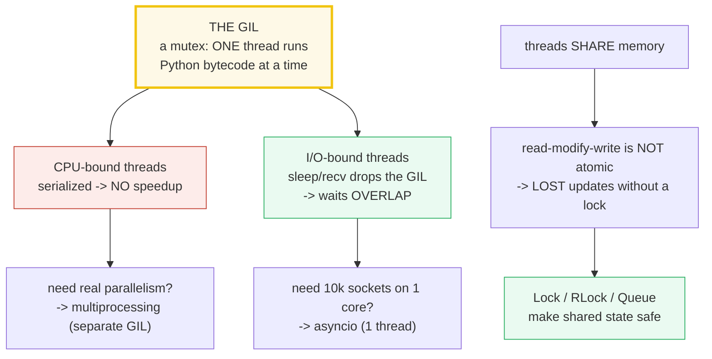
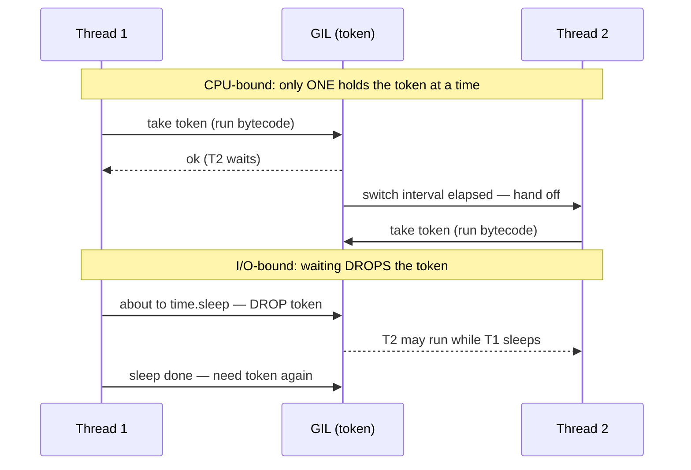
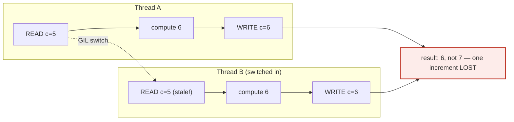
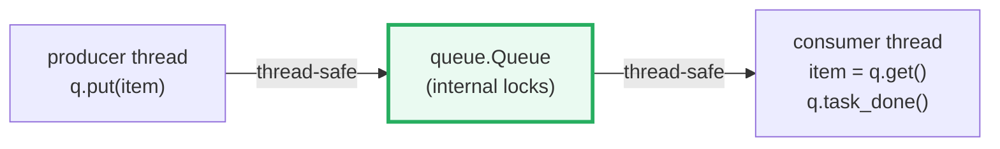

# Threading & the GIL — Threads, the Global Interpreter Lock, and Lock/Queue

> **The one rule:** Python threads share memory and are cheap to spawn, but
> CPython's **Global Interpreter Lock (GIL)** lets only **one** thread run
> Python bytecode at a time — so CPU-bound threads do **not** parallelize
> across cores, while I/O-bound threads **do** overlap. Shared mutable state
> needs a **Lock** (or a **Queue**); without one you get **lost updates**.

**Companion code:** [`threading_gil.py`](./threading_gil.py).
**Every number and table below is printed by `uv run python
threading_gil.py`** — change the code, re-run, re-paste. Nothing here is
hand-computed. Captured stdout lives in
[`threading_gil_output.txt`](./threading_gil_output.txt).

> Threading timing is **nondeterministic**: wall-clock figures and exact
> race-loss counts **vary per run/machine** and are pasted from one canonical
> capture as *illustrative*. The `[check] ... OK` lines assert **structural**
> invariants (a race loses updates; a Lock yields the exact count; a Queue
> transfers every item; I/O threads overlap) that hold on every run. Values
> that drift (thread `ident`, elapsed seconds, the exact lost count) are
> flagged inline.

**Goal of this bundle (lineage, old → new):**

> from *"threads run in parallel"*
> → *"in CPython the GIL serializes bytecode execution, so CPU-bound threads
> DON'T parallelize — but I/O-bound threads DO overlap; Lock / RLock / Queue
> make shared state safe."*

🔗 This is bundle **#19 of Phase 3**. It sits on the concurrency spine:
- [`MEMORY_MODEL`](./MEMORY_MODEL.md) — **why the GIL exists**: CPython manages
  memory with reference *counting*, and the GIL keeps refcount bumps safe
  without per-op locking. (The `.py` Section G makes this link explicit.)
- [`MULTIPROCESSING`](./MULTIPROCESSING.md) (P3 #20) — **the escape hatch** for
  real CPU parallelism: separate processes have separate GILs.
- [`ASYNCIO`](./ASYNCIO.md) (P3 #21) — **single-thread concurrency** for
  massive I/O: coroutines overlap on one thread instead of many.

---

## 0. The three ideas on one page



| Question | Answer | The catch |
|---|---|---|
| Do CPU-bound threads use my cores? | **No** — the GIL serializes bytecode | use `multiprocessing` for CPU parallelism |
| Do I/O-bound threads help? | **Yes** — blocking I/O releases the GIL | threads overlap while waiting |
| Is `counter += 1` safe across threads? | **No** — it's read-modify-write, not atomic | the bug is often *latent* (hard to trigger) |
| What makes shared state safe? | `Lock` / `RLock` / `queue.Queue` | a `Lock` a thread already holds **deadlocks** if re-acquired — use `RLock` |

---

## 1. Thread basics — `start()`, `join()`, shared memory

A thread is a separate flow of control that **shares memory** with its
creator. `threading.Thread(target=fn)` wraps a callable; `.start()` schedules
`fn` on a new OS thread; `.join()` blocks the caller until it finishes.
Results flow back through **shared** memory — here the worker writes into a
`dict` the main thread reads *after* `join()`.

> From `threading_gil.py` Section A:
> ```
> ======================================================================
> SECTION A — Thread basics: start(), join(), and a shared result
> ======================================================================
> A thread is a separate flow of control sharing the SAME memory as
> its creator. threading.Thread(target=fn) wraps a callable; .start()
> schedules it on a new OS thread; .join() blocks the caller until it
> finishes. The worker writes into a dict the main thread reads AFTER
> join() — that is how results flow back through SHARED memory.
> 
> main thread: creating worker thread ...
>   thread object: name='worker-alpha', daemon=False, alive(before start)=False
>   after start(): alive=True, ident=6140112896
>   after join():  alive=False, ident=6140112896
>   shared['worker'] = 'hello from alpha'
> 
> [check] worker ran and wrote into shared memory ('worker' in shared): OK
> [check] the worker's result is visible to main after join(): OK
> [check] a joined thread is no longer alive (not t.is_alive()): OK
> [check] main thread is threading.main_thread(): OK
> ```

*(The `ident=…` integer is the OS thread id; it **varies per run**.)*

### Why `.join()` is mandatory (internals)

`start()` returns immediately — the worker runs **concurrently**. If the main
thread reads `shared` *before* joining, it may see no result yet (a race), or
worse, the whole program may exit and tear the worker down mid-flight.
`.join()` is a **happens-before edge**: once it returns, every write the worker
made to shared memory is guaranteed visible to the caller. `Thread` objects
also carry lifecycle state — `is_alive()` is `False` before `start()` and after
`join()`, `True` in between; `daemon=False` (the default) means the interpreter
won't exit while the thread is still running.

---

## 2. The GIL — CPU-bound threads don't parallelize; I/O-bound threads do

The **Global Interpreter Lock** is the mutex the CPython glossary defines
verbatim: *"the mechanism used by the CPython interpreter to assure that only
one thread executes Python bytecode at a time."* Pure-Python CPU work holds
the GIL continuously (it's dropped only every few milliseconds for a forced
switch), so **splitting it across threads cannot use extra cores**. Blocking
I/O calls (`time.sleep`, `socket.recv`, file reads) **release the GIL while
waiting**, so I/O threads **overlap**.



> From `threading_gil.py` Section B:
> ```
> ======================================================================
> SECTION B — The GIL: CPU-bound threads do NOT parallelize; I/O-bound do
> ======================================================================
> The Global Interpreter Lock (GIL) is a mutex guaranteeing that only
> ONE thread executes Python bytecode at a time. Pure-Python CPU work
> holds the GIL continuously (released only every few ms for a switch)
> so splitting it across threads cannot use extra cores. I/O calls
> (time.sleep, socket, file) RELEASE the GIL while waiting, so I/O
> threads DO overlap.
> 
> This interpreter: GIL enabled = True
> (On a free-threaded / PEP 703 build, GIL enabled = False.)
> 
> CPU-bound work (pure-Python loop), total iterations = 2,000,000:
>   1 thread  : sum=254991808, elapsed=0.0336s
>   4 threads : sum=254985664, elapsed=0.0334s (each thread = 500,000 iters)
>   -> under the GIL, 4 threads take about the SAME wall time as
>      1 thread (work is serialized, not parallelized).
>      (Wall times are illustrative; they vary by machine/load.)
> 
> [check] CPU work produced the correct sum (1 thread): OK
> [check] CPU work produced the correct sum (4 threads, separate slots): OK
> [check] GIL on: 4 CPU threads are NOT 2x faster (t_multi >= t_single/2): OK
> I/O-bound work: 4 threads each time.sleep(0.1):
>   serial would be ~0.40s; actual elapsed = 0.1085s
>   -> sleep RELEASES the GIL while waiting, so the 4 waits overlap
>      and finish in ~one sleep, not four. (Illustrative timing.)
> 
> [check] all 4 I/O threads completed (all flags set): OK
> [check] I/O threads overlapped (elapsed < serial*0.75 = 0.30s): OK
> ```

*(Elapsed seconds **vary by machine/load**; the structural facts — sums are
correct, 4 CPU threads aren't 2× faster, 4 I/O threads finish in ~one sleep
not four — hold on every run. On a free-threaded/PEP 703 build the CPU
timing check is skipped because CPU work CAN parallelize there.)*

### Why CPU threads don't speed up, but I/O threads do (internals)

The CPU demo splits 2,000,000 pure-Python iterations across 4 threads, each
writing its **own** list slot (so there's no shared-write race to confound the
timing). Under the GIL the four threads **take turns**, so the total wall time
≈ the single-thread time — **no parallelism**, often slightly *worse* from
handoff overhead. The threading docs say it plainly: *"threading is still an
appropriate model if you want to run multiple I/O-bound tasks simultaneously."*

The I/O demo runs 4 threads each `time.sleep(0.1)`. Serially that's ~0.40s;
in parallel it's ~0.10s because `time.sleep` **drops the GIL** the instant it
begins waiting, letting all four sleeps run concurrently on the one OS thread
that holds nothing. This is exactly why threading is great for network/file
work and pointless for number-crunching.

> **Expert gotcha — `x += 1` is *not* atomic, but it rarely bites in a tight
> loop.** The glossary's `atomic operation` term is explicit: *"Python does not
> guarantee that high-level statements are atomic (for example, `x += 1`
> performs multiple bytecode operations and is not atomic)."* On modern CPython
> the GIL hands off at clean bytecode boundaries, so a bare counter race is
> **latent** — real, but hard to reproduce. Section 3 forces the window open.

🔗 For genuine CPU parallelism (separate GIL per process) see
[`MULTIPROCESSING`](./MULTIPROCESSING.md); for single-thread I/O concurrency
see [`ASYNCIO`](./ASYNCIO.md).

---

## 3. The race — a shared counter without a lock loses updates

A read-modify-write (`x = c; x += 1; c = x`) is **not atomic**: between the
READ and the WRITE the GIL may hand control to another thread that reads the
*same* stale value, so one of the two increments is **lost**. The final count
ends up **less** than expected.



> From `threading_gil.py` Section C:
> ```
> ======================================================================
> SECTION C — The race: a shared counter WITHOUT a lock loses updates
> ======================================================================
> 4 threads x 50,000 read-modify-writes each; expected total = 200,000.
> 
> A read-modify-write is NOT atomic: it is READ the value, compute
> value+1, WRITE it back. If the GIL switches threads between the
> READ and the WRITE, two threads read the SAME value and one WRITE
> clobbers the other -> a LOST update.
> 
> Expert gotcha: on modern CPython a bare `counter += 1` rarely loses
> updates in practice — the GIL hands off at clean bytecode boundaries,
> so the bug is *latent* (real but hard to trigger). We insert
> time.sleep(0) between the read and the write: it RELEASES the GIL,
> modeling any real code path that yields mid-update (I/O, a C call),
> and makes the lost update reliably observable.
> 
>   expected = 200,000
>   actual   = 50,032
>   lost     = 149,968 updates
>   (exact loss VARIES per run — illustrative; the FACT that count <
>    expected is the deterministic, structural point.)
> 
> [check] race lost updates (counter < expected): OK
> [check] the counter is non-negative: OK
> ```

*(The `actual` / `lost` figures **vary per run**; the structural fact
`counter < expected` holds on every run.)*

### Why `time.sleep(0)` is needed to *see* the race (internals)

`time.sleep(0)` is a blocking call that **releases the GIL** for a zero
duration — just long enough for the scheduler to run another thread. Inserting
it between the READ and the WRITE **widens the critical window** so the
interleaving in the diagram above is guaranteed to happen. This isn't
cheating: any real code path that yields the GIL mid-update (an `await`, a
socket read, a C-extension call) creates the exact same window. With it in
place, all four threads tend to read the *same* value each round, so the final
count ≈ the per-thread iteration count (≈50,000) instead of 4× that — about
75% of increments lost. The lesson stands with or without the yield: **shared
mutable state needs synchronization.**

---

## 4. A `Lock` fixes the race — the count is exactly correct

`threading.Lock` is a mutex. `with lock:` turns the read-modify-write into a
**critical section** that is atomic with respect to every other thread holding
the *same* lock — only one thread can be inside at a time, so no update is
lost. The code below is **identical** to Section 3 (same read, same
`time.sleep(0)`, same write); the **only** addition is `with lock:`.

> From `threading_gil.py` Section D:
> ```
> ======================================================================
> SECTION D — A Lock fixes the race: the count is exactly correct
> ======================================================================
> threading.Lock is a mutex. `with lock:` makes the read-modify-write
> ATOMIC with respect to other threads holding the SAME lock: only one
> thread can be inside the critical section at a time, so no update is
> lost. The code below is IDENTICAL to Section C (same read, same
> time.sleep(0), same write) — the ONLY addition is `with lock:`.
> 
>   expected = 200,000
>   actual   = 200,000
> 
> [check] Lock gives the exact expected count (counter == expected): OK
> ```

### Why the `Lock` wins (internals)

Notice that `time.sleep(0)` is **still inside** the `with lock:` block. While
the holding thread sleeps it releases the **GIL** (so other threads keep
running Python), but it does **not** release the **Lock** — so no other thread
can enter the critical section. The GIL and a `Lock` are two independent
mechanisms: the GIL serializes *bytecode execution*; a `Lock` serializes
*your* critical section. `acquire()` blocks (or returns `False` with
`blocking=False`) if another thread holds it; `release()` wakes exactly one
waiter. Use the context manager (`with lock:`) so the release always happens,
even if the body raises.

---

## 5. `RLock` — a thread may acquire the *same* lock twice

A plain `Lock` **deadlocks** if the owning thread calls `acquire()` again (it
blocks forever waiting for itself). `threading.RLock` (reentrant lock) tracks
an **owning thread** plus a **recursion level**: the *same* thread can acquire
it N times and must release it N times. This lets a function that already
holds the lock call another function that also acquires it — recursion and
re-entrancy without self-deadlock.

> From `threading_gil.py` Section E:
> ```
> ======================================================================
> SECTION E — RLock (reentrant): a thread may acquire the same lock twice
> ======================================================================
> A plain Lock DEADLOCKS if the owning thread calls acquire() again
> (it blocks forever waiting for itself). threading.RLock tracks an
> 'owning thread' + a recursion level: the SAME thread can acquire
> it N times and must release it N times. This lets a function that
> already holds the lock call another function that acquires it too
> — recursion and re-entrancy without self-deadlock.
> 
> plain Lock:  acquire() -> True;  2nd acquire(blocking=False) -> False  (would DEADLOCK if blocking)
> 
> [check] a plain Lock CANNOT be re-acquired by its owner (2nd -> False): OK
> RLock:       acquire() -> True;  2nd acquire() -> True (same thread);
>              after 1 release, acquire(blocking=False) -> True (still owner);
>              after full release, acquire(blocking=False) -> True (free to take again)
> 
> [check] RLock first acquire returns True: OK
> [check] RLock re-acquire by the SAME thread returns True (no deadlock): OK
> [check] RLock still owned after one release of two: OK
> [check] RLock re-acquirable after full release: OK
> recursive factorial(5) under an RLock = 120  (acquired 5 nested times, no self-deadlock)
> 
> [check] recursive function under RLock returns the right value (factorial(5)==120): OK
> ```

### Why a plain `Lock` would deadlock here (internals)

The demo re-acquires with `blocking=False` so a plain `Lock`'s second
`acquire()` returns `False` instead of hanging (the safe way to *show* the
trap without freezing the program). With `blocking=True` it would block
forever — the very definition of a **deadlock** ("two or more tasks wait
indefinitely for each other"). `RLock` instead increments its recursion
counter and returns `True` immediately because the caller is already the
owner; each `release()` decrements, and only the **outermost** release (level
→ 0) actually frees the lock for other threads. The recursive `factorial(5)`
acquires the `RLock` five nested times and releases it five times cleanly —
exactly the pattern that would freeze under a plain `Lock`.

> **Expert gotcha:** `RLock` is a bit slower than `Lock` (it must check the
> owning thread and maintain a recursion level). Prefer `Lock` unless you
> genuinely need re-entrancy. And never call `release()` more times than you
> `acquire()`d — it raises `RuntimeError`.

---

## 6. `Queue` — a thread-safe channel (no explicit lock needed)

`queue.Queue` implements **all** the locking internally, so producer and
consumer threads can `put()` / `get()` freely with **no `Lock` in your code**.
`put()` blocks when full, `get()` blocks when empty, and `join()` blocks until
every `put` item has been matched by a `task_done()`. This is the idiomatic,
race-free way to hand work between threads.



> From `threading_gil.py` Section F:
> ```
> ======================================================================
> SECTION F — Queue: a thread-safe channel (no explicit lock needed)
> ======================================================================
> queue.Queue implements ALL the locking internally, so producer and
> consumer threads can put()/get() freely without a single Lock in
> your code. put() blocks when full; get() blocks when empty; join()
> blocks until every item is task_done()'d. This is the idiomatic
> way to hand work between threads.
> 
> produced 20 items; consumed 20.
> first 5 consumed: [0, 10, 20, 30, 40]
> consumed == [i*10 for i in range(20)]: True
> 
> [check] Queue transferred all 20 items: OK
> [check] Queue preserved content (consumed == [i*10 for i in range(20)]): OK
> [check] queue is empty after the pipeline drained: OK
> ```

### Why `Queue` beats hand-rolled locking (internals)

The queue docs promise it *"implements all the required locking semantics"*
internally (a mutex plus condition variables). That means **you never write a
critical section** for producer/consumer handoff — no forgotten `release()`,
no deadlock from lock-ordering, no busy-wait. The sentinel (`None`) tells the
consumer to stop; `q.join()` returns only after every item was both `get()`'d
and `task_done()`'d. `LifoQueue` (stack) and `PriorityQueue` (heap-ordered)
share the same thread-safe interface. Prefer a `Queue` over shared variables +
locks whenever the problem is naturally "hand items from one thread to
another."

---

## 7. Where the GIL is released — and PEP 703 (the free-threaded future)

The GIL is released around **blocking** operations so other threads can run
bytecode while one waits:

- **I/O:** `time.sleep`, `socket.recv`, `file.read`, `select`, …
- **some C extensions** doing heavy CPU work (`numpy`, `zlib`, hashing)
  explicitly **drop the GIL** for the duration of the C call.

This is **why** I/O-bound threading works (Section 2) and **why** CPU-bound
pure-Python threading does not — the GIL comes back between bytecodes.

> From `threading_gil.py` Section G:
> ```
> ======================================================================
> SECTION G — Where the GIL is released; PEP 703 (free-threaded future)
> ======================================================================
> The GIL is released around BLOCKING operations so other threads can
> run Python bytecode while one thread waits:
>   - I/O:  time.sleep, socket.recv, file.read, select, ...
>   - some C extensions doing heavy CPU work (numpy, zlib, hashing)
>     explicitly drop the GIL for the duration of the C call.
> This is WHY I/O-bound threading works (Section B) and why CPU-bound
> pure-Python threading does not (the GIL returns between bytecodes).
> 
> The GIL exists because CPython manages memory with reference
> COUNTING (see MEMORY_MODEL): every PyObject has a refcount, and
> making every refcount bump atomic was historically too slow, so a
> single interpreter lock serializes bytecode and keeps refcounts
> safe. (Free-threaded builds make those refcount ops atomic instead.)
> 
> sysconfig Py_GIL_DISABLED = 0  (0/None = standard GIL build; 1 = free-threaded)
> runtime GIL enabled        = True
> PEP 703 (Python 3.13+) makes a free-threaded / no-GIL build an
> option (--disable-gil); on it, threads CAN run bytecode in parallel.
> Until free-threading is the default, use multiprocessing for real
> CPU parallelism (see MULTIPROCESSING) and asyncio for massive I/O
> concurrency on one thread (see ASYNCIO).
> 
> [check] GIL-status probe returns a bool: OK
> [check] a standard (non-free-threaded) build has the GIL on: OK
> ```

### Why the GIL exists at all (internals)

CPython manages memory with **reference counting** 🔗 [`MEMORY_MODEL`](./MEMORY_MODEL.md):
every `PyObject` carries a refcount, and an object is freed the instant its
refcount hits zero. Every assignment, return, and container insert mutates a
refcount — making each bump atomic with a fine-grained lock was historically
too slow, so CPython uses **one global lock** (the GIL) to serialize bytecode
and keep all refcount updates safe. The glossary puts it: the GIL *"simplifies
the CPython implementation by making the object model (including critical
built-in types such as dict) implicitly safe against concurrent access."*

**PEP 703** (Python 3.13+) changes this: a **free-threaded** build
(`--disable-gil` / `Py_GIL_DISABLED`) makes refcount operations atomic and lets
multiple threads run bytecode **in parallel**. As of 3.13 it's an opt-in,
experimental build. The `.py` detects it via `sysconfig` +
`sys._is_gil_enabled()` and adjusts the Section 2 CPU assertion accordingly.
Until free-threading is the default:

- need real **CPU** parallelism → [`MULTIPROCESSING`](./MULTIPROCESSING.md)
  (separate process = separate GIL);
- need massive **I/O** concurrency on one core → [`ASYNCIO`](./ASYNCIO.md)
  (coroutines, no threads).

---

## Pitfalls

| Trap | Example | The fix |
|---|---|---|
| Expecting CPU-bound threads to use all cores | 4 threads doing a pure-Python loop run in ~1 thread's time | use `multiprocessing` / `ProcessPoolExecutor` (separate GIL per process) |
| Assuming `x += 1` is safe across threads | `x += 1` is read-modify-write, **not atomic** (glossary) | guard it with a `Lock`, or use a `Queue`/`itertools`-free counter |
| A bare-counter race "never fails" in tests | on modern CPython the bug is **latent** (clean-boundary switches) | insert a yield (`time.sleep(0)`) to widen the window in tests; never assume "it passed = it's safe" |
| Re-acquiring a plain `Lock` you already hold | `lock.acquire()` inside a function already holding it → **deadlock** | use `RLock` (reentrant) for recursive/re-entrant critical sections |
| `release()` without matching `acquire()`, or too many releases | `RuntimeError` ("release unlocked lock") | always pair them; prefer `with lock:` |
| Daemon threads doing real work | killed abruptly at shutdown — files/transactions not flushed | make workers non-daemonic and signal them via an `Event`/sentinel |
| Forgetting `.join()` before reading a worker's result | main reads shared state before the worker wrote it (race) / or program exits early | always `join()`; it's the happens-before edge |
| Sharing a plain `list`/`dict` across threads without a lock | lost updates / torn reads | `Lock` around the mutation, or move handoff onto a `queue.Queue` |
| Calling blocking C code that doesn't release the GIL | it freezes all other threads | prefer GIL-aware extensions; or move it to a process |
| Relying on thread `ident` for logic | ids are recycled after a thread exits | use them only for logging/diagnostics |

---

## Cheat sheet

- **GIL:** one mutex; only ONE thread runs Python bytecode at a time. CPU-bound
  threads **don't** parallelize; I/O-bound threads **do** (blocking I/O
  releases the GIL).
- **`Thread`:** `t = Thread(target=fn, args=...)`; `t.start()` (run
  concurrently); `t.join()` (wait + happens-before). `daemon=False` keeps the
  program alive until it finishes.
- **Race:** `x += 1` / read-modify-write is **not atomic**; without a lock you
  get **lost updates**. The bug is often *latent* on modern CPython — widen the
  window with `time.sleep(0)` to reproduce it reliably.
- **`Lock`:** `with lock:` makes a critical section atomic. A `Lock` you hold
  **deadlocks** if you re-`acquire()` it.
- **`RLock`:** same thread may acquire N times (tracks owner + recursion
  level); must release N times. Use for recursion/re-entrancy.
- **`queue.Queue`:** thread-safe channel — `put`/`get`/`task_done`/`join`. No
  manual locking. Also `LifoQueue`, `PriorityQueue`.
- **GIL released by:** blocking I/O (`sleep`, socket, file, `select`) and some
  C extensions (`numpy`, `zlib`, hashing). That's the I/O-overlap mechanism.
- **Why the GIL exists:** CPython uses reference *counting*; the GIL keeps
  refcount bumps safe cheaply. PEP 703 (3.13+) makes a **free-threaded**
  (no-GIL) build an option. Until default: CPU → `multiprocessing`, I/O →
  `asyncio`.

---

## Sources

- **Python docs — Glossary: Global Interpreter Lock.**
  https://docs.python.org/3/glossary.html#term-global-interpreter-lock
  *Verbatim definition: "the mechanism used by the CPython interpreter to
  assure that only one thread executes Python bytecode at a time"; that it
  "simplifies the CPython implementation by making the object model …
  implicitly safe against concurrent access"; and that "the GIL is always
  released when doing I/O." Quoted in §0, §2, §7.*
- **Python docs — Glossary: atomic operation.**
  https://docs.python.org/3/glossary.html#term-atomic-operation
  *"Python does not guarantee that high-level statements are atomic (for
  example, `x += 1` performs multiple bytecode operations and is not
  atomic)." Basis for the §3 race demo.*
- **Python docs — Glossary: free threading / free-threaded build.**
  https://docs.python.org/3/glossary.html#term-free-threading
  *"A threading model where multiple threads can run Python bytecode
  simultaneously within the same interpreter … in contrast to the [GIL]."
  Referenced in §7.*
- **Python docs — `threading` — Thread-based parallelism.**
  https://docs.python.org/3/library/threading.html
  *The `Thread`/`Lock`/`RLock` reference; the CPython note that "only one
  thread can execute Python code at once" and that "threading is still an
  appropriate model if you want to run multiple I/O-bound tasks
  simultaneously"; `RLock` reentrancy ("may be acquired multiple times by the
  same thread"); the `with lock:` context-manager protocol. §1, §4, §5.*
- **Python docs — `queue` — A synchronized queue class.**
  https://docs.python.org/3/library/queue.html
  *"The `queue` module implements multi-producer, multi-consumer queues … the
  `Queue` class in this module implements all the required locking semantics";
  `put`/`get`/`task_done`/`join`. §6.*
- **PEP 703 — Making the GIL Optional in CPython (3.13+).**
  https://peps.python.org/pep-0703/
  *The free-threaded / no-GIL build (`--disable-gil`, `Py_GIL_DISABLED`), how
  refcounting is made thread-safe without the GIL, and that it is opt-in as of
  Python 3.13. §7.*
- **Python docs — `concurrent.futures` (ThreadPoolExecutor / ProcessPoolExecutor).**
  https://docs.python.org/3/library/concurrent.futures.html
  *Higher-level pools; `ProcessPoolExecutor` as the recommended path for
  CPU-bound parallelism (bypasses the GIL via separate processes). §0, §7.*
- **Python docs — C API: Initialization (`Py_GIL_DISABLED` / `--disable-gil`).**
  https://docs.python.org/3/c-api/init.html
  *Compile-time config and `sys._is_gil_enabled()` runtime probe used by the
  `.py` Section B/G to detect a free-threaded interpreter. §7.*
