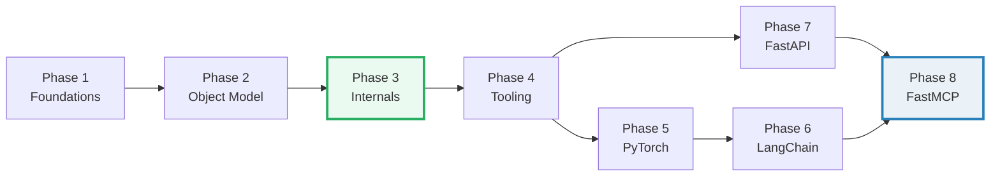

# TODO.md — The Python Expertise Curriculum (build checklist)

> **Goal:** a reader who walks every bundle start-to-finish becomes a **Python
> expert** — fluent in the data model, CPython internals, concurrency tradeoffs,
> the toolchain, and the AI libraries built on top.
>
> **How bundles get built:** see [`HOW_TO_RESEARCH.md`](./HOW_TO_RESEARCH.md).
> The orchestrator **never edits a bundle by hand** — each bundle is produced by
> a subagent (one worker per bundle, launched in parallel per phase), then passed
> through the verification sweep.
>
> Each bundle = `{name}.py` (ground truth) + `{name}_output.txt` (captured
> stdout) + `{NAME}.md` (guide). No `.html`.

---

## Progress

| Phase | Theme | Bundles | Status |
|---|---|---|---|
| 1 | Language Foundations | 8 | ✅ done (8/8, 243 checks) |
| 2 | Object Model & Functional Core | 7 | ✅ done (7/7, 187 checks) |
| 3 | Internals: Memory, Concurrency, Execution | 7 | ✅ done (7/7, 177 checks) |
| 4 | Performance, Tooling & Ecosystem | 6 | ✅ done (6/6, 140 checks) |
| 5 | PyTorch (numerical/AI compute) | 7 | ✅ done (7/7, 212 checks) |
| 6 | LangChain (LLM orchestration) | 7 | ✅ done (7/7, 202 checks) |
| 7 | FastAPI (production API serving) | 7 | ✅ done (7/7, 187 checks) |
| 8 | FastMCP (Model Context Protocol) | 5 | ✅ done (5/5, 129 checks) |
| | **Total** | **54** | **✅ ALL DONE — 1477 checks, 0 failures** |

**Reading order is the phase order.** Each phase assumes the prior — Phase 3
internals lean on Phase 2's data model; Phase 5+ AI libraries lean on the whole
language core. Do not skip ahead.

---

## Phase 1 — Language Foundations (8)

> **Goal:** rock-solid command of the language primitives. Every downstream
> concept (objects, memory, concurrency) rests on these.

- [x] **1. `types_and_truthiness`** — the numeric tower (int/float/complex/bool), `None`, truthiness rules, `bool()` of every type, `==` vs `is` first taste. *(Designated style anchor for all later workers.)*
- [x] **2. `strings_and_bytes`** — Unicode, `str` vs `bytes` vs `bytearray`, encode/decode, codecs, f-strings, the `emoji`-breaks-`len` trap.
- [x] **3. `collections_basics`** — list/tuple/dict/set/frozenset, dict ordering & equality, hashing & `__hash__`, when each structure wins (Big-O cheat sheet).
- [x] **4. `comprehensions`** — list/dict/set/generator comprehensions, nesting, scope leak (Py2→3 fix), readability vs a `for` loop.
- [x] **5. `generators_iterators`** — the iterator protocol (`__iter__`/`__next__`), `yield`, generator pipelines, `itertools` greatest hits, lazy/infinite streams, single-use exhaustion.
- [x] **6. `functions_args_scope`** — `*args`/`**kwargs`, the mutable-default trap, closures & LEGB, `nonlocal`, default-arg evaluation time.
- [x] **7. `control_flow`** — `if/elif/else`, `for/else` & `while/else`, `match`-case (structural), short-circuit `and`/`or`, ` walrus `:=`.
- [x] **8. `exceptions`** — `try/except/else/finally`, `raise`/`raise from`, custom exception hierarchies, exception chaining, `__cause__`/`__context__`, EAFP vs LBYL.

---

## Phase 2 — Object Model & Functional Core (7)

> **Goal:** mastery of "everything is an object" — the data model, the MRO,
> descriptors, metaclasses, and the functional toolkit. *This is the layer that
> separates Python users from Python experts.*

- [x] **9. `classes_basics`** — `class`, `__init__`, `self`, class vs instance attributes, `__dict__`, why methods bind.
- [x] **10. `dunder_methods`** — the data model as protocols: `__repr__`/`__str__`, `__eq__`/`__hash__`, `__len__`/`__getitem__`/`__contains__`, `__iter__`/`__next__`, `__enter__`/`__exit__`, arithmetic dunders.
- [x] **11. `inheritance_mro`** — single & multiple inheritance, `super()`, the C3 linearization (MRO) worked example, Mixins, `isinstance`/`issubclass`.
- [x] **12. `properties_descriptors`** — `@property`, the descriptor protocol (`__get__`/`__set__`/`__delete__`), how `property`/`classmethod`/`staticmethod`/methods really work under the hood, `__slots__`.
- [x] **13. `metaclasses`** — `type` as the class-of-classes, `__init_subclass__` (the 90% solution), `__new__` vs `__init__`, `__class_getitem__`, when you actually need a metaclass.
- [x] **14. `decorators_deep`** — closures recap → function decorators → parametrized decorators → class decorators → `functools.wraps`/`cache`/`lru_cache`; the late-binding-closure trap.
- [x] **15. `functional_toolkit`** — `map`/`filter`/`reduce`, `partial`, `singledispatch`, `operator`, higher-order patterns, when functional beats a loop (and when it doesn't).

---

## Phase 3 — Internals: Memory, Concurrency, Execution (7)

> **Goal:** see the machine beneath the language — the object/memory model, the
> GIL, and CPython's execution model. *This is where "expert" actually lives.*

- [x] **16. `memory_model`** — variables as labels on `PyObject*`, `id()`/`is`, reference counting, mutability vs immutability, aliasing, `copy` vs `deepcopy`, the small-int & string interning caches.
- [x] **17. `gc_weakrefs`** — the cyclic garbage collector & generations, `weakref`, `__del__` pitfalls, finalizers, how `__slots__` cuts memory, `tracemalloc`.
- [x] **18. `type_hints`** — annotations, `typing` generics, `TypeVar`/`Generic`, `Protocol` (structural typing), `Callable`/`overload`, runtime checking with `isinstance` + `runtime_checkable`, gradual typing.
- [x] **19. `threading_gil`** — the GIL explained (why threads don't parallelize CPU), `Thread`, `Lock`/`RLock`, `Queue`, `Condition`, when threads *do* help (I/O), the GIL-release points.
- [x] **20. `multiprocessing_basics`** *(stem avoids the stdlib `multiprocessing` module)* — `Process`/`Pool`, `spawn` vs `fork`, shared memory (`Value`/`Array`/`SharedMemory`), `pickle` limits, the "why it's heavier than threads" bill.
- [x] **21. `asyncio_basics`** *(stem avoids the stdlib `asyncio` module)* — the event loop, `async`/`await`, `Task`/`gather`/`wait`, `asyncio.Lock`/`Queue`, "async is concurrency, not parallelism", blocking-the-loop traps.
- [x] **22. `context_managers`** — `with`, `__enter__`/`__exit__`, `contextlib.contextmanager`/`ExitStack`/`suppress`, `async with`, resource-cleanup guarantees.

---

## Phase 4 — Performance, Tooling & Ecosystem (6)

> **Goal:** ship correct, fast, well-tested, well-packaged code — the engineering
> layer on top of language mastery.

- [x] **23. `bytecode_internals`** — `dis.dis`, code objects, frames, the eval loop, `LOAD_ATTR`/`CALL`/`BINARY_OP`, why `[].append` is a LOAD_ATTR, CPython 3.11+ specializing adaptive interpreter.
- [x] **24. `profiling_optimization`** — `cProfile`/`pstats`, `timeit`, the "measure don't guess" law, hot-loop wins, caching/memoization, algorithmic vs micro-optimization.
- [x] **25. `memory_efficiency`** — `sys.getsizeof`, `__slots__`, generators vs lists, `array`/`memoryview`/`numpy`, the memory cost of common structures.
- [x] **26. `c_extensions_ffi`** — `ctypes`, `cffi`, Cython basics, PyO3 (Rust) basics; when to drop out of pure Python and the cost of doing so.
- [x] **27. `packaging_basics`** *(stem `packaging_basics` — a bare `packaging` stem shadows the PyPI `packaging` package that langchain etc. import; exactly the src-layout trap this bundle teaches)* — `pyproject.toml` ([build-system]/[project]), `uv`/`pip`, build backends, wheels & platform tags, src-layout, dependency groups vs extras.
- [x] **28. `testing_linting`** — `pytest` (fixtures, `parametrize`, `monkeypatch`, `mocker`, `capsys`), coverage, `ruff` (lint+format), `mypy` in CI; the red→green discipline.

---

## Phase 5 — PyTorch (7)

> **Goal:** fluent with tensors, autograd, modules, and a real training loop —
> the foundation under every modern AI system. (Reuses `../llm/` intuitions from
> the LLM-systems side; here we go deep on the *library*.)

- [x] **29. `tensors`** — creation/dtype/device/shape, views vs copies (`reshape`/`view`/`permute`/contiguous), broadcasting rules, in-place vs functional, memory layout.
- [x] **30. `autograd`** — `requires_grad`, the dynamic computation graph, `backward()`, grad accumulations, `torch.no_grad`/`infer_mode`, detached tensors, a manual backward-by-hand check.
- [x] **31. `nn_module`** — `nn.Module`/`Parameter`/`register_buffer`, `forward`, sub-modules, `state_dict`, hooks (`forward_pre`/`forward`/`full_backward`), `.to(device)`/`.eval()`.
- [x] **32. `data_loading`** — `Dataset`/`IterableDataset`, `DataLoader`, batching, `collate_fn`, num_workers & the multiprocessing tax, transforms/augmentation pipeline.
- [x] **33. `training_loop`** — optimizer step anatomy (`zero_grad`→`backward`→`step`), loss fns, train/eval mode, learning-rate schedulers, gradient clipping, checkpoint save/load.
- [x] **34. `gpu_distributed`** — device management, `cuda.amp` context, `DistributedDataParallel` basics (tie to `../llm/DDP.md`), rank/world/process groups, the seed-per-rank rule.
- [x] **35. `performance_torch`** *(built as performance_torch)* — mixed precision (`autocast`/`GradScaler`), `torch.compile` & graph capture, inference optimization, profiling with `torch.profiler`.

---

## Phase 6 — LangChain (7)

> **Goal:** orchestrate LLMs end-to-end — prompts, structured output, chains,
> memory, RAG, and agents. Offline/mockable `.py` wherever possible.

- [x] **36. `lc_models_messages`** — the `Runnable`/`ChatModel` interface, message types (`System`/`Human`/`AI`/`Tool`), `invoke`/`stream`/`batch`, a stub chat model for offline runs.
- [x] **37. `lc_prompts`** — `PromptTemplate`/`ChatPromptTemplate`, few-shot, partials, output parsers, `with_structured_output` (Pydantic schema → tool/function calling).
- [x] **38. `lc_chains_lcel`** — LCEL pipe (`|`), sequential/parallel composition, `RunnablePassthrough`/`RunnableLambda`, custom `Runnable`, streaming through a chain.
- [x] **39. `lc_memory`** — chat history as state, buffer/summary/window memory, `RunnableWithMessageHistory`, when to move state into LangGraph.
- [x] **40. `lc_rag`** — `Document`, embeddings, vector stores (in-memory for the demo), retrievers, `retrieval_qa`-style chain, chunking & the "garbage-in" rule.
- [x] **41. `lc_tools_agents`** — `@tool`, tool schemas from signatures, tool calling, the ReAct loop, `create_agent`, error/loop handling.
- [x] **42. `lc_langgraph`** — `StateGraph`, nodes & edges, conditional routing, human-in-the-loop, checkpointing — the bridge from chains to real agents.

---

## Phase 7 — FastAPI (7)

> **Goal:** build production-grade async APIs — routing, validation, DI, auth,
> and tests. FastAPI is also the transport under FastMCP (Phase 8).

- [x] **43. `fastapi_routing_params`** — path/query params, path operations, type-based validation, default/optional, `Annotated` style.
- [x] **44. `fastapi_bodies_pydantic`** — `BaseModel`, nested models, `Field` constraints, validators, `response_model` & serialization, Pydantic v2 engine.
- [x] **45. `fastapi_dependencies`** — `Depends`, `yield` dependencies (setup/teardown), sub-dependencies, class-based deps, the dependency-injection inversion win.
- [x] **46. `fastapi_async`** — `async def` vs `def` endpoints (the threadpool rule), `BackgroundTasks`, blocking-call traps, concurrency vs throughput.
- [x] **47. `fastapi_middleware_lifespan`** — middleware (order matters), CORS, exception handlers, `lifespan` startup/shutdown events, structured logging.
- [x] **48. `fastapi_auth`** — `OAuth2PasswordBearer`, password hashing (`passlib`/`bcrypt`), JWT issue/verify, `Security(...)` dependencies, scopes.
- [x] **49. `fastapi_testing`** — `TestClient` (sync) vs `httpx.AsyncClient` (async), `dependency_overrides` for fakes, fixtures, the test-pyramid for APIs.

---

## Phase 8 — FastMCP (5)

> **Goal:** expose tools/resources/prompts over the Model Context Protocol — the
> standard layer connecting LLMs to the world. Builds on FastAPI (Phase 7).

- [x] **50. `mcp_architecture`** — host/server/client/transport, the JSON-RPC lifecycle (`initialize`→`tools/list`→`tools/call`), stdio vs HTTP vs SSE, where MCP sits vs raw function-calling.
- [x] **51. `mcp_tools`** — `@mcp.tool`, input schema from Pydantic, return types, progress reporting, error returns, the tools-as-the-contract principle.
- [x] **52. `mcp_resources_prompts`** — resources (URI-addressed data), resource templates, prompt templates (parametrized prompts), when a prompt beats a tool.
- [x] **53. `mcp_context_sampling`** — the `Context` object, LLM sampling (server asks host's model), elicitation (host↔user), logging, roots, the "server borrows the host's model" inversion.
- [x] **54. `mcp_integration`** — multi-transport deployment (stdio for local, StreamableHTTP for remote), mounting MCP behind FastAPI, consuming an MCP server from a LangChain agent (ties Phase 6 + 7 + 8 together).

---

## Cross-cutting 🔗 map (the expertise chain)

These links are the connective tissue that turns 54 separate topics into one
mental model. Workers must add the relevant 🔗 cross-references:

Key cross-links workers should wire up:
- `memory_model` (P3) ⟷ `is`/`==` (P1) ⟷ `gc_weakrefs` (P3) ⟷ `threading_gil` (P3) — **the refcount→GIL chain is the heart of "Python expert".**
- `dunder_methods` (P2) ⟷ `descriptors` (P2) ⟷ `properties` — the data model ↔ descriptor link.
- `asyncio` (P3) ⟷ `fastapi_async` (P7) ⟷ `mcp_integration` (P8) — one async story across the stack.
- `training_loop` (P5) ⟷ `../llm/DDP.md` + `ZERO.md` — PyTorch the library ↔ the systems concepts.
- `lc_tools_agents` (P6) ⟷ `mcp_tools` (P8) — tool-calling the LangChain way vs the MCP way.
- `packaging` (P4) ⟷ the whole repo's `pyproject.toml`/`uv` practice.

---

## How to run a phase (orchestrator recipe)

For each phase:

1. **Confirm deps:** add the phase's deps to `pyproject.toml`; `uv sync`.
2. **Write briefs:** fill the `HOW_TO_RESEARCH.md` §5 template for each bundle in
   the phase (5 min each).
3. **Launch the swarm:** one `Task` worker per bundle, all in **one message**
   (disjoint file ownership = safe parallelism). For Phase 1, ship
   `types_and_truthiness` first as the style anchor, then launch the rest against it.
4. **Verify:** run the §8 sweep; spot-check 2–3 `.md` callouts against `_output.txt`.
5. **Re-spawn** any failures; tick the boxes above; update the Progress table.
