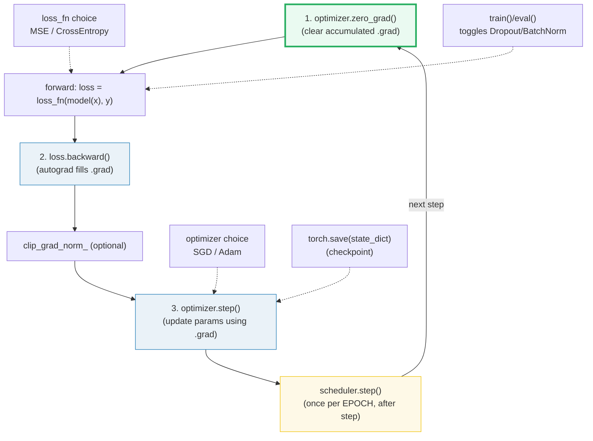
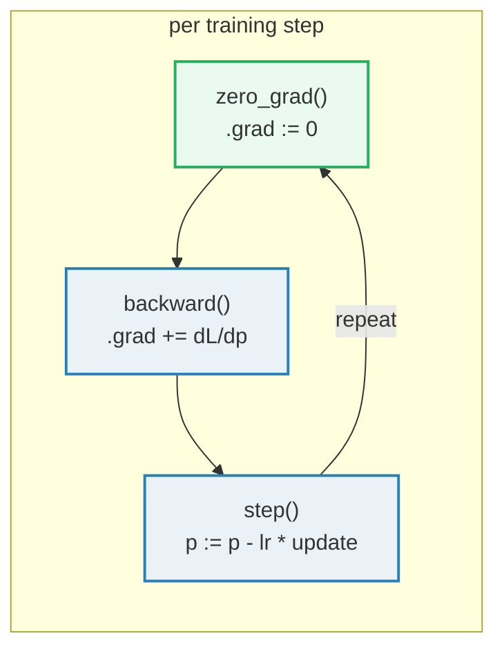
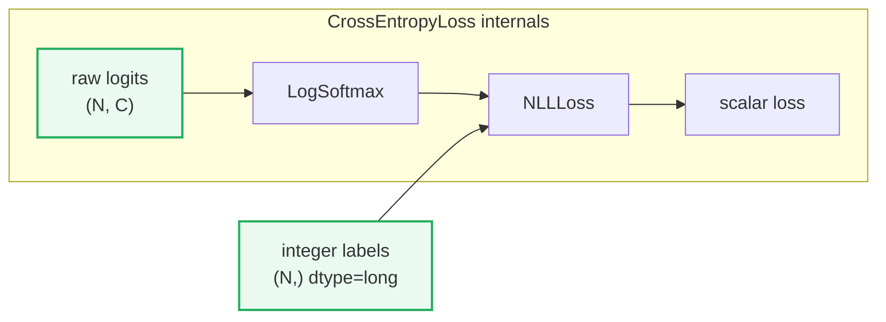
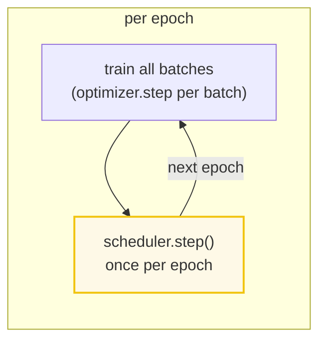
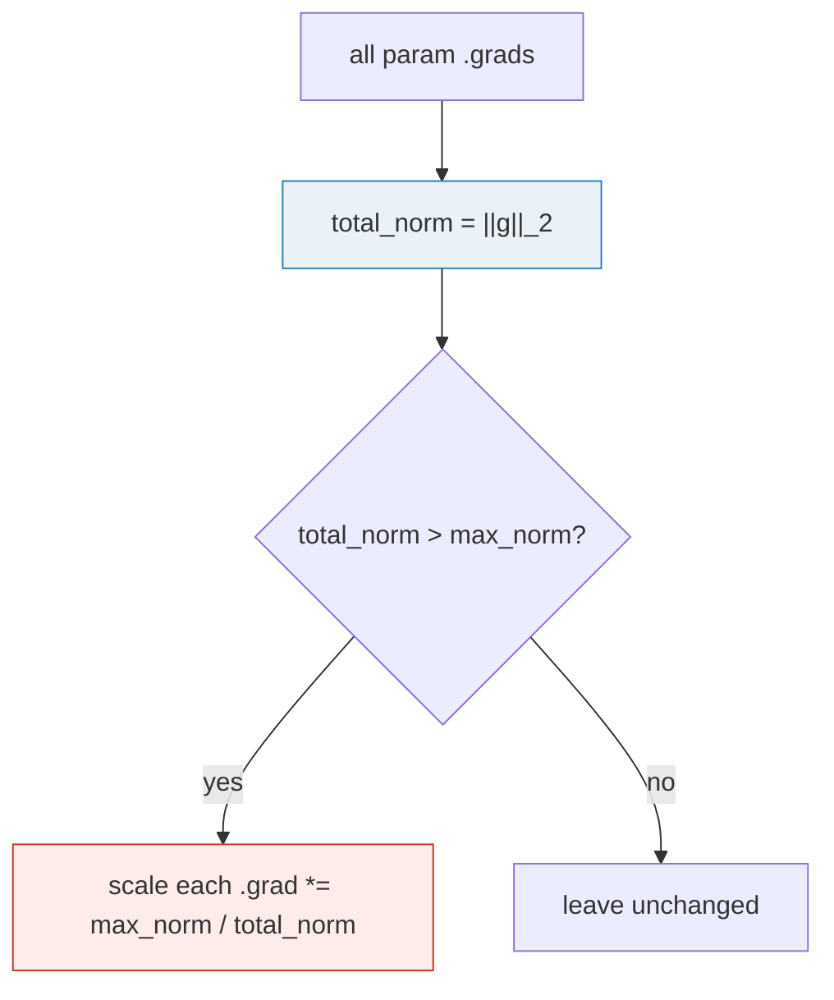

# Training Loop — The Ritual: `zero_grad` → `backward` → `step`

> **The one rule:** PyTorch does not "train" your model — *you* do, by
> repeating a precise three-line ritual every step:
> `optimizer.zero_grad()` → `loss.backward()` → `optimizer.step()`. The rest of
> "training" is *control* around that ritual: which optimizer, which loss
> function, how the learning rate decays, when to switch `train()`/`eval()`,
> when to clip gradients, and how to checkpoint. Master these nine pieces and
> you can write any training loop.

**Companion code:** [`training_loop.py`](./training_loop.py).
**Every number and table below is printed by `uv run python
training_loop.py`** — change the code, re-run, re-paste. Nothing here is
hand-computed. Captured stdout lives in
[`training_loop_output.txt`](./training_loop_output.txt).

**Goal of this bundle (lineage, old → new):**

> from *"I call `.backward()` and hope"*
> → *"the training step is a precise ritual — `zero_grad` → `backward` →
> `step` — and I control it with optimizer choice, lr schedulers, `train`/`eval`
> mode, gradient clipping, and checkpointing."*

🔗 This is bundle **#33 of Phase 5**. It assumes you know
[`AUTOGRAD`](./AUTOGRAD.md) (P5 #30 — `.backward()` fills `.grad`, and `.grad`
**accumulates**, which is *why* `zero_grad` exists) and
[`NN_MODULE`](./NN_MODULE.md) (P5 #31 — `model.parameters()` and
`state_dict()`). The [`DATA_LOADING`](./DATA_LOADING.md) bundle (P5 #32) covers
`DataLoader` in depth; the [`GPU_DISTRIBUTED`](./GPU_DISTRIBUTED.md) bundle (P5
#34) extends this loop to multi-GPU. See [`TODO.md`](./TODO.md) for the plan.

---

## 0. The nine ideas on one page



| Piece | One-liner | Section |
|---|---|---|
| **`zero_grad()`** | clears `.grad` (mandatory — grads **accumulate**) | §1, §2 |
| **`backward()`** | autograd fills `.grad` (🔗 AUTOGRAD) | §1 |
| **`step()`** | optimizer updates params using `.grad` | §1 |
| **optimizer choice** | SGD (momentum) vs Adam (adaptive per-param lr) | §3 |
| **loss function** | `MSELoss` (regression) / `CrossEntropyLoss` (logits!) | §4 |
| **`train()`/`eval()`** | toggles `self.training` → Dropout/BatchNorm behavior | §5 |
| **lr scheduler** | `StepLR` / `CosineAnnealingLR` — lr changes per epoch | §6 |
| **gradient clipping** | `clip_grad_norm_` caps the total grad norm | §7 |
| **checkpointing** | `torch.save` / `load_state_dict` round-trip (🔗 NN_MODULE) | §8 |

---

## 1. The canonical step: `zero_grad` → `backward` → `step`

The PyTorch docs ([optim.html — "Taking an optimization step"](https://docs.pytorch.org/docs/stable/optim.html#taking-an-optimization-step))
give the canonical training step **verbatim**:

```python
for input, target in dataset:
    optimizer.zero_grad()
    output = model(input)
    loss = loss_fn(output, target)
    loss.backward()
    optimizer.step()
```

Three lines do the work. **`zero_grad()`** clears the `.grad` buffers on every
parameter (§2 explains why this is mandatory). **`backward()`** runs reverse-mode
autodiff (🔗 [AUTOGRAD](./AUTOGRAD.md)) to fill `.grad` with the gradient of
`loss` w.r.t. each parameter. **`step()`** uses those gradients to update the
parameters according to the optimizer's rule (SGD: `p -= lr * grad`; Adam: more
complex, §3).



Below: a toy regression (`y = 3x - 1`, 16 points) trained with a single
`nn.Linear(1, 1)` via vanilla SGD. After 300 full-batch steps the loss drops
from `0.855` to `0.0001` and the learned weight/bias approach the true `3.0` /
`-1.0`.

> From `training_loop.py` Section A:
> ```
> ======================================================================
> SECTION A — The canonical step: zero_grad() -> backward() -> step()
> ======================================================================
> Toy regression y=3x-1; nn.Linear(1,1); SGD lr=0.1; 300 full-batch
> steps. The canonical ritual per PyTorch docs (optim.html):
> 
>   for ...:
>       optimizer.zero_grad()   # 1. clear accumulated grads
>       loss = loss_fn(model(x), y)
>       loss.backward()         # 2. autograd fills .grad  (AUTOGRAD)
>       optimizer.step()        # 3. update params using .grad
> 
> initial loss                0.855317
> final loss (300 steps)      0.000106
> true weight / bias          3.0  -1.0
> learned weight              2.966839
> learned bias                -0.982088
> 
> [check] final loss < initial loss (the ritual works): OK
> [check] loss dropped below 0.001: OK
> ```

### Why `step()` needs `zero_grad()` first (internals)

`backward()` **adds** to `.grad`, it does not overwrite (🔗 [AUTOGRAD](./AUTOGRAD.md)
§4). This accumulation is a *feature* for gradient accumulation across
mini-batches, but it means that without `zero_grad()` the gradient from step *N*
includes stale gradients from steps *1..N−1*. The optimizer would then take a
step that is far too large (proportional to the *sum* of all past gradients),
causing divergence. That is why every training loop in the PyTorch docs starts
with `optimizer.zero_grad()`.

---

## 2. `zero_grad` is MANDATORY — gradient accumulation demo

The demo below runs three `forward + backward` passes (no `optimizer.step()`,
so the model does not change and each individual gradient is identical). **Without**
`zero_grad`, `.grad` piles up linearly: `g`, `2g`, `3g`. **With** `zero_grad`, it
resets to `g` every step.

> From `training_loop.py` Section B:
> ```
> ======================================================================
> SECTION B — zero_grad() is MANDATORY: grads accumulate without it
> ======================================================================
> backward() ADDS to .grad (does NOT overwrite). So skipping
> zero_grad makes grads from every previous step pile up.
> 
> step    |grad| WITHOUT zero_grad      |grad| WITH zero_grad
> ----------------------------------------------------------------
> 1       0.535381                      0.535381
> 2       1.070761                      0.535381
> 3       1.606142                      0.535381
> 
> [check] WITHOUT zero_grad: 2nd grad > 1st (accumulated): OK
> [check] WITHOUT zero_grad: 3rd grad ~ 3x 1st (linear accumulation): OK
> [check] WITH zero_grad: grads stay constant across steps: OK
> ```

### Why `.grad` accumulates by design (internals)

When autograd populates `.grad` on a leaf tensor, it does `p.grad += grad` (or
`p.grad = grad` if `.grad` is `None`). The `+=` semantics exist so you can
**accumulate gradients across multiple mini-batches** before calling
`step()` — useful when a batch is too large for GPU memory (virtual batching).
`zero_grad()` simply sets `.grad` back to zero (or `None` in recent versions).
The autograd engine itself has no concept of "training step" — it just fills
`.grad`; it is the optimizer's job to decide when to consume and clear it.

🔗 The full treatment of `.grad` accumulation, `retain_graph`, and the leaf
rule is in [`AUTOGRAD`](./AUTOGRAD.md) §4.

---

## 3. Optimizers: SGD vs Adam

The optimizer defines **how** `step()` uses `.grad`. The two workhorses:

| | **SGD** | **Adam** |
|---|---|---|
| Update rule | `p -= lr * grad` (optionally + momentum) | per-param adaptive: uses running averages of grad and grad² |
| Hyperparams | `lr`, `momentum` | `lr`, `betas=(0.9, 0.999)`, `eps` |
| Per-parameter lr? | no — one global lr | yes — adapts magnitude per-param |
| Best for | simple convex problems, fine-tuning | most deep-learning defaults |

**Adam's key idea** (Kingma & Ba, 2014): maintain exponential moving averages of
the gradient (`m`, first moment) and the squared gradient (`v`, second moment),
then update `p -= lr * m_hat / (sqrt(v_hat) + eps)`. This gives each parameter
its own effective learning rate — parameters with large recent gradients get
smaller steps, and vice versa. On simple convex problems (like the toy linear
regression below) Adam's adaptive rates let it converge in far fewer steps than
vanilla SGD.

> From `training_loop.py` Section C:
> ```
> ======================================================================
> SECTION C — Optimizers: SGD vs Adam (Adam converges faster)
> ======================================================================
> Same init, same data, 50 steps, lr=0.1 for both.
> 
> optimizer             final loss      learned w     learned b
> ----------------------------------------------------------------
> SGD (vanilla)         0.189450        1.595633      -0.241407
> Adam (b=0.9,0.999)    0.002677        3.168345      -1.084678
> 
> true weight / bias                    3.000000      -1.000000
> 
> [check] Adam loss <= SGD loss at same step count: OK
> ```

**Expert note:** "Adam converges faster" is true on *most* problems but **not
universal**. On simple convex quadratics, SGD with momentum can match or beat
Adam. Adam's advantage is most pronounced on high-dimensional, non-convex, or
ill-conditioned landscapes (transformers, deep CNNs) where per-parameter
adaptation matters. Always benchmark on your specific problem.

---

## 4. Loss functions: `MSELoss` (regression) + `CrossEntropyLoss` (classification)

The loss function measures the gap between predictions and targets. The two
most common:

- **`nn.MSELoss`** — mean squared error: `mean((pred - target)²)`. For
  regression (continuous targets).
- **`nn.CrossEntropyLoss`** — cross-entropy: combines `LogSoftmax` + `NLLLoss`
  in one op. For classification (discrete targets).



**The #1 classification pitfall:** `CrossEntropyLoss` expects **raw logits**
(unnormalized scores), **not** softmax probabilities. The docs state it
plainly: *"The input is expected to contain the unnormalized logits for each
class (which do not need to be positive or sum to 1)"*. The target should be
**integer class indices** (`dtype=torch.long`), not one-hot vectors. If you
`softmax` the logits first, you double-apply softmax and get a **different
(wrong) loss**.

> From `training_loop.py` Section D:
> ```
> ======================================================================
> SECTION D — MSELoss (regression) + CrossEntropyLoss (logits, not softmax)
> ======================================================================
> MSELoss: mean((pred - target)^2)
>   pred   = [1.0, 2.0, 3.0]
>   target = [1.5, 2.0, 2.5]
>   MSELoss = 0.166667   hand = 0.166667
> 
> CrossEntropyLoss expects RAW LOGITS + INTEGER class indices.
>   logits = [[0.5, -0.5, 1.0], [0.1, 2.0, -0.3]]
>   labels = [2, 1]  (dtype=torch.int64)
>   CE(logits, labels)              = 0.413568
>   LogSoftmax+NLLLoss               = 0.413568  (identical)
>   CE(softmax(logits), labels)      = 0.795060  (PITFALL: double-softmax)
> 
> [check] MSELoss == hand-computed mean squared error: OK
> [check] CrossEntropyLoss == LogSoftmax + NLLLoss: OK
> [check] softmax(logits) gives a DIFFERENT (wrong) loss: OK
> ```

### Why passing logits (not softmax) matters (internals)

`CrossEntropyLoss` applies `log(softmax(x))` internally for numerical stability
— it uses the [LogSumExp trick](https://en.wikipedia.org/wiki/LogSumExp) to
avoid overflow/underflow when exponentiating large logits. If you pass
`softmax(logits)`, the loss function applies softmax a *second* time, compressing
the distribution toward uniform. The resulting loss is larger (the model looks
*worse* than it should) and the gradients are wrong, leading to slow or unstable
training. **Rule: your model's last layer for classification should output raw
logits, and `CrossEntropyLoss` does the rest.**

> **Soft-label note (PyTorch ≥1.10):** `CrossEntropyLoss` *can* accept class
> probabilities (float targets of shape `(N, C)`) instead of integer indices —
> useful for label smoothing or blended labels. This is a *different code path*,
> not the same as one-hot integers. For standard classification, always pass
> integer labels.

---

## 5. `train()` / `eval()`: toggling mode

Every `nn.Module` carries a `self.training` boolean (default `True`). `model.train()`
sets it `True` recursively across the whole module tree; `model.eval()` sets it
`False`. Two layer types read this flag:

- **`nn.Dropout`** — in `train` mode: randomly zeros entries and scales survivors
  by `1/(1-p)`. In `eval` mode: identity (passes input through unchanged).
- **`nn.BatchNorm*`** — in `train` mode: uses batch statistics and updates
  running estimates. In `eval` mode: uses the stored running statistics (fixed).

**The rule:** always call `model.eval()` before validation / inference, and
`model.train()` before resuming training. Forgetting this is a top-3 silent bug.

> From `training_loop.py` Section E:
> ```
> ======================================================================
> SECTION E — train()/eval(): toggling self.training (Dropout)
> ======================================================================
> model.train() sets self.training=True (recursive). Dropout zeros
> and scales active units. model.eval() sets it False -> Dropout is
> the identity. Always eval() before validation/inference. (NN_MODULE)
> 
> model.training after train()              True
> model.training after eval()               False
> train: out(seed=0) == out(seed=1)?        False
> eval:  out == out (deterministic)?        True
> 
> [check] train() sets training=True: OK
> [check] eval() sets training=False: OK
> [check] train mode: different RNG seeds give different outputs: OK
> [check] eval mode: output is deterministic (no dropout): OK
> ```

🔗 The deep treatment of `train()`/`eval()` (including how `Module.__call__`
checks `self.training` before dispatching to `Dropout.forward`) is in
[`NN_MODULE`](./NN_MODULE.md) §7.

---

## 6. lr schedulers: `StepLR` and `CosineAnnealingLR`

The learning rate is the single most important hyperparameter. Schedulers decay
it over training to take big steps early (fast progress) and small steps late
(fine convergence). The key rule from the docs:

> *"Learning rate scheduling should be applied after the optimizer's update."*

Call `scheduler.step()` **once per epoch, after `optimizer.step()`**, not inside
the batch loop. Calling it *before* `optimizer.step()` skips the first lr value
(a [BC-breaking change](https://docs.pytorch.org/docs/stable/optim.html#how-to-adjust-learning-rate)
in PyTorch 1.1.0 — the docs warn about this explicitly).



Two common schedules:

- **`StepLR(opt, step_size, gamma)`** — multiplies lr by `gamma` every
  `step_size` epochs. A staircase.
- **`CosineAnnealingLR(opt, T_max)`** — smoothly anneals lr from initial value
  to `eta_min` (default `0`) following a cosine curve over `T_max` epochs.

> From `training_loop.py` Section F:
> ```
> ======================================================================
> SECTION F — lr scheduler: StepLR / CosineAnnealingLR (lr changes per epoch)
> ======================================================================
> scheduler.step() is called ONCE PER EPOCH, AFTER optimizer.step().
> 
> epoch   StepLR lr         CosineAnnealingLR lr
> --------------------------------------------
> 0       0.100000          0.100000
> 1       0.100000          0.093301
> 2       0.010000          0.075000
> 3       0.010000          0.050000
> 4       0.001000          0.025000
> 5       0.001000          0.006699
> 
> [check] StepLR: lr at epoch 0 == 0.1: OK
> [check] StepLR: lr decays to 0.01 at epoch 2 (step_size=2, gamma=0.1): OK
> [check] StepLR: lr decays to 0.001 at epoch 4: OK
> [check] CosineAnnealingLR: lr changes across epochs: OK
> [check] CosineAnnealingLR: starts at initial lr (0.1): OK
> [check] CosineAnnealingLR: ends near eta_min=0: OK
> ```

### How to read the current lr

The optimizer stores the lr in `optimizer.param_groups[0]["lr"]`. Schedulers
mutate this value in-place when you call `scheduler.step()`. To log or assert
on the current lr, read `param_groups[0]["lr"]` at the start of each epoch.

---

## 7. Gradient clipping: `clip_grad_norm_`

When gradients explode (common in RNNs, transformers, or with high learning
rates), `clip_grad_norm_` caps the total gradient norm to prevent destabilizing
updates. The docs describe it precisely:

> *"The norm is computed over the norms of the individual gradients of all
> parameters, as if the norms of the individual gradients were concatenated
> into a single vector. Gradients are modified in-place."*

**Algorithm:** compute `total_norm = ||concat(all .grad)||₂`. If `total_norm >
max_norm`, scale every `.grad` by `max_norm / total_norm`. This preserves the
gradient *direction* while capping its magnitude.



**Placement:** call it **after** `backward()` and **before** `optimizer.step()`.

> From `training_loop.py` Section G:
> ```
> ======================================================================
> SECTION G — clip_grad_norm_: caps the total gradient L2 norm
> ======================================================================
> clip_grad_norm_ computes the total L2 norm over all param grads,
> and if it exceeds max_norm, scales ALL grads by max_norm/total_norm
> (in-place). Call it AFTER backward(), BEFORE optimizer.step().
> 
> grad before clip            [3.0, 4.0]  norm=5.0
> total_norm (returned)       5.000000
> max_norm                    1.0
> grad after clip             [0.6, 0.8]  norm=1.000000
> scale factor                0.200000
> 
> [check] total_norm returned == original norm (5.0): OK
> [check] clipped grad norm <= max_norm: OK
> [check] grad was scaled to [0.6, 0.8] (3*0.2, 4*0.2): OK
> ```

**Note on `clip_grad_value_`:** there is a *different* function,
`clip_grad_value_(params, clip_value)`, that clips each element to
`[-clip_value, clip_value]` independently. This changes the gradient *direction*
and is rarely the right choice. `clip_grad_norm_` (norm-based) is the standard.

---

## 8. Checkpointing: `torch.save` / `torch.load` + `state_dict`

Checkpointing saves the model's learned parameters to disk so you can resume
training or deploy for inference. The round-trip is:

```python
# Save
torch.save(model.state_dict(), "model.pt")
# Load (into a fresh model with the same architecture)
model = MyModel()
model.load_state_dict(torch.load("model.pt", weights_only=True))
```

`state_dict()` returns a dict of all **parameters** + **persistent buffers**
keyed by dotted path (🔗 [NN_MODULE](./NN_MODULE.md) §4). `torch.save` uses
Python's `pickle` + `zip` serialization. In PyTorch ≥2.6, `torch.load` defaults
to `weights_only=True` (only loads tensors, not arbitrary Python objects — safer
against malicious checkpoint files).

> From `training_loop.py` Section H:
> ```
> ======================================================================
> SECTION H — Checkpointing: torch.save(model.state_dict(), path)
> ======================================================================
> torch.save serializes the state_dict (params + persistent buffers)
> to disk; torch.load + load_state_dict restores them into a fresh
> model.  (NN_MODULE state_dict)
> 
> saved keys                      ['weight', 'bias']
> keys match after round-trip     True
> all tensors equal               True
> 
> [check] saved and loaded state_dict keys match: OK
> [check] all params equal after save/load round-trip: OK
> ```

**Full checkpoint (resume training):** to resume mid-training, also save the
optimizer state (momentum buffers, Adam running averages) and the scheduler
state + epoch number:

```python
ckpt = {
    "epoch": epoch,
    "model_state_dict": model.state_dict(),
    "optimizer_state_dict": optimizer.state_dict(),
    "scheduler_state_dict": scheduler.state_dict(),
    "loss": current_loss,
}
torch.save(ckpt, "checkpoint.pt")
```

---

## 9. The full loop: epoch × batch via `DataLoader`

Putting it all together — a minimal but complete training loop over a
`DataLoader` (🔗 [DATA_LOADING](./DATA_LOADING.md), P5 #32):

```python
for epoch in range(num_epochs):
    for xb, yb in dataloader:       # mini-batches
        optimizer.zero_grad()        # 1. clear grads
        pred = model(xb)             # 2. forward
        loss = loss_fn(pred, yb)     # 3. compute loss
        loss.backward()              # 4. backward (autograd)
        optimizer.step()             # 5. update params
    scheduler.step()                 # 6. decay lr (once per epoch)
    # model.eval(); validate; model.train()  # optional eval phase
```

Below: 16-point regression, `batch_size=4` (4 batches/epoch), 50 epochs of
vanilla SGD. The average loss drops from `0.954` to `0.001`.

> From `training_loop.py` Section I:
> ```
> ======================================================================
> SECTION I — Full epoch loop over a DataLoader (forward->loss->step)
> ======================================================================
> TensorDataset(16 pts) -> DataLoader(batch_size=4) -> 4 batches/epoch x 50 epochs. Mini-batch SGD lr=0.1.
> 
> epoch   avg loss (over 4 batches)
> --------------------------------
> 0       0.954088
> 10      0.271290
> 20      0.070669
> 30      0.018409
> 40      0.004795
> 49      0.001429
> 
> [check] loss decreases across epochs (final < first): OK
> [check] final epoch loss < 0.05: OK
> ```

🔗 For **distributed** training (DDP), each rank runs this same loop but
`backward()` triggers an all-reduce to average gradients across GPUs, and
`step()` must be called by every rank. That is the subject of
[`GPU_DISTRIBUTED`](./GPU_DISTRIBUTED.md) (P5 #34).

---

## Pitfalls

| Trap | Example | The fix |
|---|---|---|
| **Forgetting `zero_grad()`** | grads accumulate → exploding updates → NaN loss | always call `optimizer.zero_grad()` at the top of every step |
| **Passing softmax'd logits to `CrossEntropyLoss`** | `CE(softmax(logits), y)` double-applies softmax → wrong loss | pass **raw logits**; `CE` does `LogSoftmax` internally |
| **Passing one-hot instead of integer labels** | shape mismatch or silently treated as soft-label path | use `torch.tensor([2, 1])` (dtype `long`), not `[[0,0,1],[0,1,0]]` |
| **Forgetting `model.eval()` before validation** | Dropout still active → noisy validation metrics | `model.eval()` before val; `model.train()` before resuming train |
| **Forgetting `model.train()` after eval** | BatchNorm frozen → no batch-stat updates → training stalls | always pair `eval()` → val → `train()` → resume |
| **Calling `scheduler.step()` before `optimizer.step()`** | skips the first lr value (PyTorch ≥1.1.0 BC change) | call `scheduler.step()` **after** `optimizer.step()`, once per epoch |
| **Calling `scheduler.step()` per batch** | lr decays `batch_count`× too fast | call `scheduler.step()` once per **epoch**, not per batch |
| **Clipping before `backward()`** | `.grad` is `None` → no-op or error | clip **after** `backward()`, **before** `step()` |
| **Using `clip_grad_value_` when you mean `clip_grad_norm_`** | value-clip distorts gradient direction | `clip_grad_norm_` preserves direction; it is the standard |
| **`torch.load` without `weights_only=True`** (PyTorch <2.6) | arbitrary code execution from untrusted checkpoint | pass `weights_only=True`; default changed to True in 2.6+ |
| **Not saving optimizer state for resume** | Adam's momentum buffers are lost → restart is not seamless | save `optimizer.state_dict()` alongside model state |

---

## Cheat sheet

- **The ritual:** `optimizer.zero_grad()` → `loss.backward()` →
  `optimizer.step()`. Every step, no exceptions.
- **`zero_grad` is mandatory:** `.grad` **accumulates** (🔗 AUTOGRAD); skip it
  and grads pile up across steps.
- **SGD vs Adam:** SGD does `p -= lr * grad` (+ optional momentum). Adam
  maintains running averages of grad and grad² for per-parameter adaptive lr.
  Adam typically converges faster; SGD+momentum generalizes better on some tasks.
- **`MSELoss`:** `mean((pred - target)²)`. For regression.
- **`CrossEntropyLoss`:** pass **raw logits** `(N, C)` + **integer labels**
  `(N,)` dtype `long`. Equivalent to `LogSoftmax` + `NLLLoss`. Never softmax
  the logits first.
- **`train()` / `eval()`:** toggles `self.training` recursively. Dropout is
  active in train, identity in eval. BatchNorm uses batch stats in train,
  running stats in eval. Always `eval()` before inference.
- **lr scheduler:** `scheduler.step()` once per epoch, **after**
  `optimizer.step()`. `StepLR` decays by `gamma` every `step_size` epochs;
  `CosineAnnealingLR` follows a cosine to `eta_min`.
- **Gradient clipping:** `clip_grad_norm_(params, max_norm)` after `backward()`,
  before `step()`. Scales all grads by `min(1, max_norm / total_norm)`.
- **Checkpointing:** `torch.save(model.state_dict(), path)` →
  `model.load_state_dict(torch.load(path, weights_only=True))`. For full resume,
  also save optimizer + scheduler state.
- **Read current lr:** `optimizer.param_groups[0]["lr"]`.

---

## Sources

- **PyTorch docs — `torch.optim` (Optimizers).**
  https://docs.pytorch.org/docs/stable/optim.html
  *The canonical training-step code (`zero_grad → backward → step`), the
  optimizer construction API, per-parameter options, and the lr-scheduler
  ordering rule ("Learning rate scheduling should be applied after the
  optimizer's update"). Quoted verbatim in §0, §1, §6.*
- **PyTorch docs — `torch.nn.CrossEntropyLoss`.**
  https://docs.pytorch.org/docs/stable/generated/torch.nn.CrossEntropyLoss.html
  *"The input is expected to contain the unnormalized logits for each class
  (which do not need to be positive or sum to 1)."* Confirms the equivalence to
  `LogSoftmax` + `NLLLoss` and the integer-label requirement. Basis for §4.*
- **PyTorch docs — `torch.nn.MSELoss`.**
  https://docs.pytorch.org/docs/stable/generated/torch.nn.MSELoss.html
  *Defines `mean((x - y)²)` with `reduction='mean'` default. Referenced in §4.*
- **PyTorch docs — `torch.nn.utils.clip_grad_norm_`.**
  https://docs.pytorch.org/docs/stable/generated/torch.nn.utils.clip_grad_norm_.html
  *"The norm is computed over the norms of the individual gradients of all
  parameters … Gradients are modified in-place."* Confirms the scale-by-
  `max_norm/total_norm` behavior and the return value. Basis for §7.*
- **PyTorch docs — `torch.optim.lr_scheduler.StepLR`.**
  https://docs.pytorch.org/docs/stable/generated/torch.optim.lr_scheduler.StepLR.html
  *"Decays the learning rate of each parameter group by gamma every step_size
  epochs."* Verified in §6.*
- **PyTorch docs — `torch.optim.lr_scheduler.CosineAnnealingLR`.**
  https://docs.pytorch.org/docs/stable/generated/torch.optim.lr_scheduler.CosineAnnealingLR.html
  *The cosine annealing formula `η_t = η_min + ½(η₀ − η_min)(1 + cos(πt/T_max))`.
  Verified in §6.*
- **PyTorch docs — `torch.optim.SGD`.**
  https://docs.pytorch.org/docs/stable/generated/torch.optim.SGD.html
  *SGD update with optional momentum and weight decay. Referenced in §3.*
- **PyTorch docs — `torch.optim.Adam`.**
  https://docs.pytorch.org/docs/stable/generated/torch.optim.Adam.html
  *Adam (Kingma & Ba, 2014): adaptive moment estimation with `betas=(0.9, 0.999)`
  defaults. Referenced in §3.*
- **PyTorch docs — Saving and Loading Models (Recipes).**
  https://docs.pytorch.org/tutorials/recipes/recipes/saving_and_loading_models_for_inference.html
  *The `torch.save(model.state_dict(), path)` / `model.load_state_dict(torch.load(path))`
  round-trip pattern and the `weights_only` argument. Basis for §8.*
- **Kingma & Ba — *Adam: A Method for Stochastic Optimization* (ICLR 2015).**
  https://arxiv.org/abs/1412.6980
  *The Adam algorithm: exponential moving averages of gradient (`m`) and squared
  gradient (`v`), bias correction, and the `lr * m_hat / (sqrt(v_hat) + eps)`
  update. Referenced in §3.*
